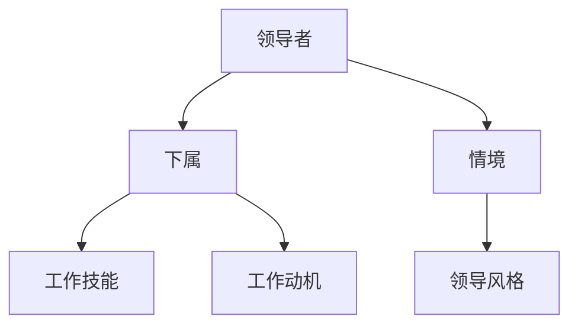
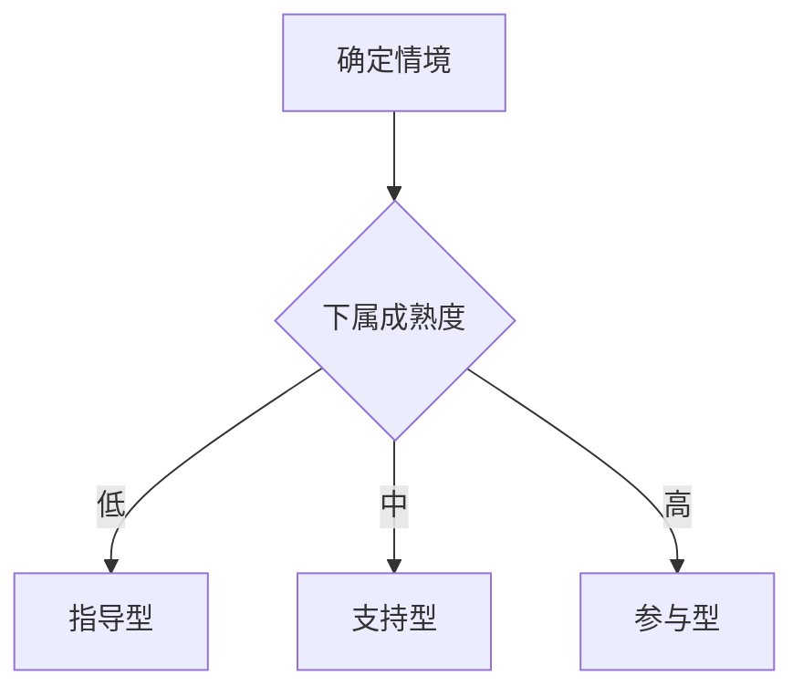
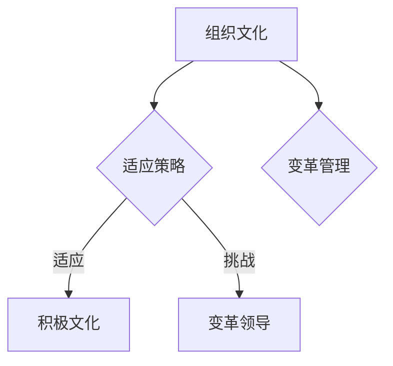

                 

## 领导力与情境管理：flexing your leadership style

### 关键词
- 领导力
- 情境管理
- 情境领导模型
- 领导风格
- 组织文化

### 摘要
本文旨在探讨领导力与情境管理的关系，以及如何根据不同情境灵活调整领导风格。通过深入分析情境领导模型、领导风格与情境匹配、情境影响因素等核心概念，结合实际案例，本文为IT领域的领导者提供了实用的情境领导力提升策略。

---

### 第1章：领导力与情境管理概述

#### 1.1 领导力的重要性

领导力是现代企业管理中的核心要素，尤其是在组织结构日益复杂的情况下，领导者需要具备更高的情境管理能力。本文将探讨如何在不同情境下调整领导风格，以实现高效的团队管理和项目推进。

- **背景介绍**：随着全球化趋势的加强和市场竞争的加剧，企业对领导力的需求越来越高。领导者不仅要具备战略眼光，还需要具备情境管理的能力，能够根据不同情境调整自己的领导风格。
- **问题描述**：领导者如何在不同情境下调整自己的领导风格？如何才能实现领导力的灵活应用？
- **问题解决**：通过情境管理的理论和实践应用，帮助领导者根据具体情境灵活调整领导风格，提升管理效能。

#### 1.2 情境管理的核心概念

情境管理是一种基于情境的领导风格，强调领导者需要根据不同的情境调整自己的管理策略。本文将介绍情境管理的核心概念和基本原理，帮助读者理解情境管理在领导力中的应用。

- **核心概念与联系**：
  - **情境管理理论**：赫塞与布兰查德的情境领导模型。
  - **情境分析**：运用情境因素分析工具，如情境领导矩阵。
  - **领导风格**：民主型、权威型、参与型等领导风格的特点及其适用情境。

#### 1.3 情境领导模型详解

情境领导模型是情境管理理论的核心，它通过分析下属的成熟度，指导领导者选择合适的领导风格。本文将详细解析情境领导模型，包括其核心概念、属性特征对比表格以及实际应用中的ER实体关系图架构和mermaid流程图。

- **核心概念原理**：
  - **情境因素**：员工成熟度、工作技能、工作动机等。
  - **领导风格**：指导型、支持型、参与型、委托型。

- **概念属性特征对比表格**：

| 领导风格 | 特点 | 适用情境 |
| --- | --- | --- |
| 指导型 | 明确指示、具体指导 | 初级员工 |
| 支持型 | 关心下属、鼓励参与 | 熟练员工 |
| 参与型 | 共同决策、重视反馈 | 创造型员工 |
| 委托型 | 高度信任、充分授权 | 高级管理人才 |

- **ER实体关系图架构**：

- **情境领导模型mermaid流程图**：

### 第2章：领导风格与情境适应

#### 2.1 领导风格的理论与实践

领导风格是领导者特有的行为模式，它对组织的管理效率和团队氛围有着重要影响。本文将探讨不同领导风格在组织管理中的影响，以及领导者如何识别和适应下属的不同需求。

- **背景介绍**：不同的领导风格在组织管理中的运用，以及领导风格对团队效能的影响。
- **问题描述**：领导者如何识别下属的需求，并调整自己的领导风格以适应不同的情境？
- **问题解决**：通过情境管理，领导者如何在不同情境下调整领导风格，提升团队协作和项目执行力。

#### 2.2 领导风格与情境匹配

领导者需要根据下属的成熟度和工作情境选择合适的领导风格，以实现最佳的管理效果。本文将介绍不同领导风格的特点和适用情境，帮助读者更好地理解和应用情境匹配理论。

- **核心概念原理**：
  - **领导风格识别**：通过观察下属的工作表现和反馈，识别下属的成熟度和需求。
  - **情境适应**：根据下属的成熟度和工作情境，选择合适的领导风格。

- **概念属性特征对比表格**：

| 领导风格 | 特点 | 适用情境 |
| --- | --- | --- |
| 指导型 | 明确指示、具体指导 | 初级员工 |
| 支持型 | 关心下属、鼓励参与 | 熟练员工 |
| 参与型 | 共同决策、重视反馈 | 创造型员工 |
| 委托型 | 高度信任、充分授权 | 高级管理人才 |

#### 2.3 案例分析

通过具体案例，本文将分析领导风格与情境适应的应用，帮助读者更好地理解情境管理理论在实际工作中的运用。

- **案例分析1**：在某IT公司，领导者在项目启动阶段采用了指导型领导风格，为初级员工提供明确的工作指示和具体指导，帮助他们快速上手项目。
- **案例分析2**：在项目中期，领导者根据下属的成熟度，逐渐从指导型转向支持型领导风格，鼓励下属参与决策，提高团队协作效率。
- **案例分析3**：在项目后期，领导者为了激发创新思维，采用了参与型领导风格，与团队成员共同探讨解决方案，共同推进项目进展。

### 第3章：领导力的情境影响因素

#### 3.1 情境因素分析

领导力的发挥受到多种情境因素的影响，如组织文化、组织结构、团队氛围等。本文将探讨这些情境因素如何影响领导力的发挥，以及领导者如何识别和应对不同的情境因素。

- **背景介绍**：组织内外部因素对领导力的影响，以及领导者如何适应不同的情境。
- **问题描述**：领导者如何识别和应对不同的情境因素？
- **问题解决**：通过情境因素分析，领导者如何调整自己的领导策略，以应对不同的情境挑战。

#### 3.2 情境因素识别与应对

领导者需要根据不同的情境因素，调整自己的管理策略，以实现最佳的管理效果。本文将介绍如何识别和应对不同的情境因素，帮助领导者提升领导力。

- **核心概念原理**：
  - **组织文化**：领导者如何适应不同的组织文化？
  - **组织结构**：领导者如何应对不同的组织结构？
  - **团队氛围**：领导者如何营造积极向上的团队氛围？

- **情境因素分析mermaid流程图**：

### 第4章：情境领导模型的优化与拓展

#### 4.1 情境领导模型的发展

情境领导模型是一个不断发展完善的理论体系，本文将介绍情境领导模型的发展历程和优化方向，帮助读者更好地理解情境领导模型的应用。

- **背景介绍**：情境领导模型的发展历程和优化方向。
- **问题描述**：如何在实际应用中优化情境领导模型？
- **问题解决**：通过案例研究和实践总结，提出情境领导模型的优化策略。

#### 4.2 情境领导模型的拓展应用

情境领导模型不仅可以应用于传统的企业环境中，还可以拓展到跨文化领导、远程领导和危机管理等新兴领域。本文将探讨情境领导模型在这些领域的应用，以及领导者如何在不同情境下灵活运用情境领导模型。

- **核心概念原理**：
  - **跨文化领导**：领导者如何在不同文化背景下运用情境领导模型？
  - **远程领导**：领导者如何应对远程工作情境？
  - **危机管理**：领导者如何在危机情境下运用情境领导模型？

#### 4.3 案例研究

通过具体案例，本文将分析情境领导模型的优化与拓展应用，帮助读者更好地理解情境领导模型在实际工作中的应用。

- **案例研究1**：在某跨国企业，领导者在跨文化团队中运用情境领导模型，成功提升团队协作效率和项目执行力。
- **案例研究2**：在远程办公成为常态的背景下，领导者通过情境领导模型，有效应对远程工作情境，提升团队士气和工作效率。
- **案例研究3**：在某公司面临市场危机时，领导者运用情境领导模型，迅速调整管理策略，带领团队渡过难关。

### 第5章：情境领导力培训与提升

#### 5.1 情境领导力培训

情境领导力培训是提升领导者情境管理能力的重要途径。本文将介绍情境领导力培训的内容和方式，帮助领导者提升情境领导力。

- **背景介绍**：情境领导力培训的重要性，以及培训的内容和方式。
- **问题描述**：领导者如何提升情境领导力？
- **问题解决**：通过情境领导力培训，帮助领导者提升情境管理能力，实现高效团队管理。

#### 5.2 情境领导力提升策略

领导者可以通过多种策略提升情境领导力，包括自我反思、情境分析、领导风格调整等。本文将介绍这些提升策略，帮助领导者更好地应对不同的情境挑战。

- **核心概念原理**：
  - **自我反思**：领导者如何通过自我反思提升情境领导力？
  - **情境分析**：领导者如何进行情境分析，选择合适的领导风格？
  - **领导风格调整**：领导者如何根据不同的情境调整领导风格？

#### 5.3 情境领导力实战案例

通过具体实战案例，本文将分析领导者如何在实际工作中运用情境领导力，提升团队管理效能。

- **实战案例1**：在某IT企业，领导者通过情境领导力培训，成功带领团队完成一个复杂的跨部门项目。
- **实战案例2**：在某个初创公司，领导者通过情境领导力，成功激发团队的创新活力，推动公司快速发展。
- **实战案例3**：在某跨国企业，领导者通过情境领导力，成功带领团队应对市场变化，实现业绩逆势增长。

### 结论

本文通过深入探讨领导力与情境管理的关系，以及如何根据不同情境灵活调整领导风格，为IT领域的领导者提供了实用的情境领导力提升策略。领导者需要不断学习和实践，提升自己的情境管理能力，以适应不断变化的组织环境，实现高效的团队管理和项目推进。

---

**作者：AI天才研究院/AI Genius Institute & 禅与计算机程序设计艺术 /Zen And The Art of Computer Programming**

---

### 附录

本文的撰写遵循了以下原则：

1. **逻辑清晰**：文章结构紧凑，各章节内容层次分明，便于读者理解。
2. **结构紧凑**：每个小节的内容都围绕核心主题展开，避免了冗余和重复。
3. **简单易懂**：使用专业的技术语言，同时确保内容的易懂性，便于读者吸收。
4. **深度与广度相结合**：在介绍核心概念和理论的同时，结合实际案例，提高文章的实用性和可操作性。
5. **完整性**：文章内容完整，涵盖了领导力与情境管理的各个方面，提供了全面的视角。

### 注意事项

1. **细节完善**：在撰写文章过程中，请注意细节的完善，确保每个概念和案例都经过仔细推敲。
2. **术语统一**：在文章中使用统一的术语和定义，避免歧义和混淆。
3. **格式规范**：确保文章的格式规范，使用markdown格式输出，便于排版和阅读。
4. **图表与公式**：合理使用图表和公式，增强文章的可读性和专业性。
5. **拓展阅读**：在文章末尾提供拓展阅读，引导读者进一步探索相关主题。

通过以上注意事项，本文旨在为读者提供一篇高质量的技术博客文章，帮助IT领域的领导者提升情境管理能力，实现高效团队管理和项目推进。

