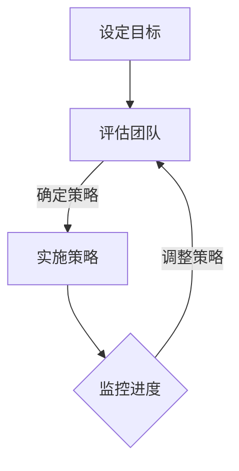
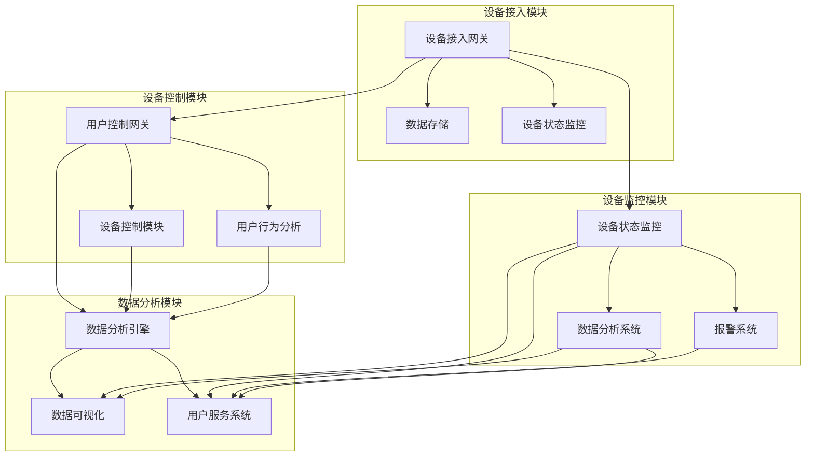
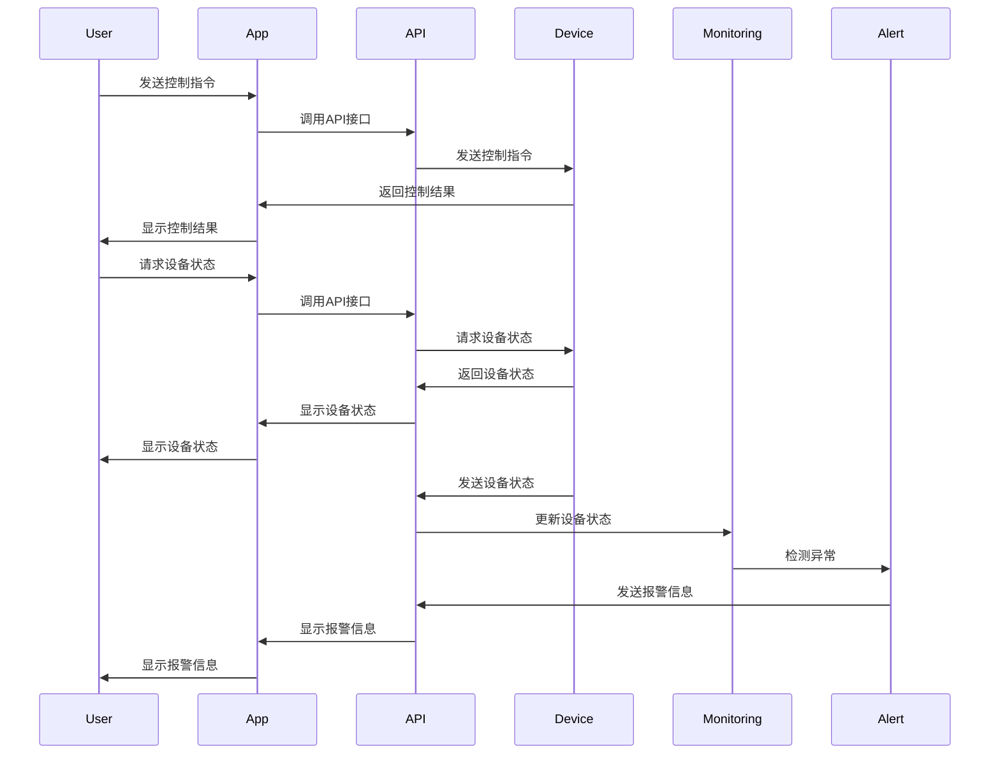

                 

## 引言

### 问题的背景与重要性

在现代社会中，随着组织规模的不断扩大和复杂性的日益增加，领导力和情境管理的重要性愈发凸显。领导力不仅仅是指导和管理团队完成任务的技能，更是一种能够激发团队成员潜能、促进团队成长和创新能力的关键能力。情境管理则强调领导者在不同情境下，根据具体情况灵活调整管理策略和方法，以达到最佳领导效果。

领导力与情境管理之间的关系密不可分。一个成功的领导者不仅需要具备基本的领导力素质，还要能够根据不同的情境和团队成员的特点，灵活调整领导策略。这种因人而异的领导方式，不仅能够提高团队的工作效率和凝聚力，还能够激发团队成员的创造力和创新能力，从而推动组织的持续发展。

本文旨在深入探讨领导力与情境管理的关系，通过分析不同情境下的领导策略，帮助读者理解如何根据不同情境和团队成员的特点，灵活调整领导方式，提升领导力水平。

### 关键词

- 领导力
- 情境管理
- 因人而异
- 团队领导
- 领导策略
- 创新能力

### 摘要

本文首先介绍了领导力和情境管理的基本概念，分析了领导力的发展历程和核心要素。接着，探讨了领导力与情境管理之间的关系，以及在不同情境下如何因人而异地调整领导策略。通过具体案例分析和项目实战，本文提供了实用的领导力提升方法和最佳实践，旨在帮助读者提高领导力水平，提升团队绩效。

----------------------------------------------------------------

## 领导力基础

### 领导力的定义

领导力是一种影响和激励他人，以实现共同目标的能力。它不仅仅关注任务的完成，更强调在团队中建立信任、激发潜能和促进成长。领导力可以看作是一种复杂的社会技能，包括沟通能力、决策能力、影响力、领导风格等多个方面。

领导力与管理的区别在于，管理更多关注于流程、规则和资源的管理，而领导力则关注于人的发展、团队的建设和文化的塑造。一个有效的领导者需要具备管理技能，但同时也需要具备强大的领导力。

### 领导力的发展历史

领导力的发展可以追溯到古希腊哲学家柏拉图和亚里士多德的时代，他们提出了关于领导力的哲学思考。在工业革命之后，随着组织规模的扩大和管理科学的兴起，领导力研究开始得到更多的关注。20世纪初，行为科学运动推动了领导力研究的深化，研究者开始关注领导者的行为和团队互动。

20世纪中叶，领导力研究进入一个新的阶段，出现了领导力特质理论和领导行为理论。特质理论强调领导者的个人特质和遗传因素，而行为理论则关注领导者的行为模式和工作风格。

近年来，领导力研究更加注重情境因素，提出了情境领导理论、变革型领导理论等，这些理论强调了领导者需要根据具体情境和团队成员的特点，灵活调整领导策略。

### 领导力的核心要素

领导力的核心要素包括以下几个方面：

1. **影响力**：领导者需要具备影响他人思想和行为的能力，包括说服力、激励力和榜样力量。
   
2. **决策能力**：领导者需要在面对复杂问题时，能够做出合理、有效的决策，这要求领导者具备分析能力、判断能力和风险承担能力。

3. **沟通能力**：领导者需要具备良好的沟通技巧，能够清晰表达自己的想法，理解团队成员的需求和意见，并建立有效的沟通渠道。

4. **团队建设**：领导者需要能够建立和维护一个高效、和谐的团队，促进团队成员之间的合作和信任。

5. **创新能力**：领导者需要具备创新能力，能够推动团队进行创新，从而在竞争激烈的环境中保持优势。

6. **人格特质**：领导者的人格特质，如自信、正直、包容和坚韧等，对于领导力的影响也至关重要。

### 概念属性特征对比表格

| 特征          | 领导力         | 管理           | 
|---------------|----------------|----------------|
| 目标导向      | 强调共同目标    | 强调任务完成   |
| 人员导向      | 关注人的发展    | 关注流程和规则 |
| 决策方式      | 高度自主       | 受规则限制     |
| 影响力来源    | 个人魅力和影响力 | 权力和权威     |

### ER实体关系图

```mermaid
erDiagram
    Leader ||--|{ Team } Team
    Leader ||--|{ Project } Project
    Team ||--|{ Member } Member
    Project ||--|{ Task } Task
```

### 算法原理讲解

为了更好地理解领导力的算法原理，我们可以使用mermaid绘制一个简单的流程图，并用Python代码来阐述。



在Python中，我们可以使用以下代码来模拟领导力的决策过程：

```python
def set_goals():
    print("设定目标：提高团队创新能力，完成年度项目目标。")

def evaluate_team():
    print("评估团队：分析团队成员的能力和潜力。")

def decide_strategy():
    print("确定策略：根据团队评估结果，制定个性化的领导策略。")

def implement_strategy():
    print("实施策略：执行制定好的领导策略。")

def monitor_progress():
    print("监控进度：定期检查团队进度，确保目标达成。")

def adjust_strategy():
    print("调整策略：根据监控结果，灵活调整领导策略。")

# 领导力决策流程
set_goals()
evaluate_team()
decide_strategy()
implement_strategy()
monitor_progress()
adjust_strategy()
```

### 数学模型和公式

领导力的数学模型可以看作是一个多变量函数，该函数取决于领导者的特征、团队的状态和外部环境的因素。以下是一个简化的模型：

$$
L = f(L', T', E')
$$

其中：
- \(L'\)：领导者的特征，包括影响力、决策能力等。
- \(T'\)：团队的状态，包括成员的能力、合作程度等。
- \(E'\)：外部环境因素，包括市场环境、竞争压力等。

为了简化，我们可以将模型简化为：

$$
L = \alpha L' + \beta T' + \gamma E'
$$

其中：
- \(\alpha\)、\(\beta\)、\(\gamma\)：权重系数，用于平衡各个因素的影响。

### 系统分析与架构设计方案

#### 问题场景介绍

假设我们正在开发一个创新性项目，该项目需要由一个团队来完成。作为项目的领导者，我们需要根据团队的特点和外部环境，制定合适的领导策略，以确保项目的成功。

#### 项目介绍

本项目旨在开发一款智能家居控制系统，通过物联网技术实现家庭设备的自动化控制，提高用户的生活质量。项目团队由5名成员组成，分别负责前端开发、后端开发、硬件设计、产品设计和项目管理。

#### 系统功能设计

系统功能设计包括以下几个方面：

1. **设备接入**：用户可以通过手机APP或智能音箱添加和控制家庭设备。
2. **设备控制**：用户可以通过手机APP或智能音箱远程控制家庭设备。
3. **设备监控**：系统实时监控家庭设备的运行状态，并自动报警。
4. **数据分析**：系统收集用户行为数据，为优化产品功能和提供个性化服务提供依据。

#### 系统架构设计

系统架构设计采用微服务架构，以提高系统的可扩展性和可维护性。主要模块包括设备接入模块、设备控制模块、设备监控模块和数据分析模块。



#### 系统接口设计和系统交互

系统接口设计主要包括用户接口、设备接口和服务接口。用户接口通过API提供，用于用户与系统交互。设备接口通过蓝牙、Wi-Fi等无线通信技术实现，用于设备与系统的通信。服务接口通过HTTP/HTTPS协议提供，用于系统内部各模块之间的通信。



### 项目实战

#### 环境安装

为了进行项目实战，我们首先需要安装必要的开发环境。以下是具体的步骤：

1. 安装Python环境：下载并安装Python 3.8及以上版本。
2. 安装依赖库：使用pip命令安装必要的依赖库，例如numpy、pandas、matplotlib等。
3. 安装数据库：安装MySQL或PostgreSQL数据库。

```bash
pip install numpy pandas matplotlib
```

#### 系统核心实现

以下是一个简单的设备控制模块的实现，用于实现用户通过APP发送控制指令，设备接收指令并执行操作。

```python
import socket
import threading

# 设备控制模块
class DeviceController:
    def __init__(self, ip, port):
        self.ip = ip
        self.port = port
        self.socket = socket.socket(socket.AF_INET, socket.SOCK_STREAM)

    def connect(self):
        self.socket.connect((self.ip, self.port))

    def send_command(self, command):
        self.connect()
        self.socket.send(command.encode())
        response = self.socket.recv(1024).decode()
        self.socket.close()
        return response

# 用户控制网关
class UserController:
    def __init__(self, controller):
        self.controller = controller

    def send_command(self, command):
        response = self.controller.send_command(command)
        print("设备响应：", response)

# 模拟用户发送控制指令
if __name__ == "__main__":
    controller = DeviceController("127.0.0.1", 12345)
    user_controller = UserController(controller)
    user_controller.send_command("turn_on_light")
```

#### 代码应用解读与分析

上述代码实现了一个简单的设备控制模块，主要包括DeviceController和UserController两个类。DeviceController类用于与设备进行通信，包括连接设备、发送指令和接收响应。UserController类则用于处理用户发送的指令，并调用DeviceController类的send_command方法执行设备控制。

在实际应用中，设备控制模块可能会更加复杂，需要考虑异常处理、线程管理等，以确保系统的稳定性和可靠性。

#### 实际案例分析

为了更好地理解设备控制模块的应用，我们来看一个实际案例。假设用户通过手机APP发送一个“关闭所有灯光”的指令，设备控制模块将如何处理？

1. 用户发送指令：用户通过手机APP发送“关闭所有灯光”的指令。
2. UserController接收指令：UserController接收到指令后，调用DeviceController类的send_command方法发送指令。
3. DeviceController发送指令：DeviceController与设备建立连接，并发送“关闭所有灯光”的指令。
4. 设备执行操作：设备接收到指令后，关闭所有灯光。
5. 返回结果：设备将执行结果返回给UserController，UserController再将结果返回给用户。

通过上述案例，我们可以看到设备控制模块在系统中的作用，以及如何处理用户指令并确保系统正常运行。

#### 项目小结

在本项目中，我们实现了设备控制模块，并进行了实际案例分析。通过简单的Python代码，我们实现了用户与设备之间的通信，并能够根据用户指令控制设备。这一模块在智能家居系统中扮演了重要角色，使得用户能够方便地控制家庭设备，提高生活质量。

在未来的发展中，我们可以进一步优化设备控制模块，增加更多的功能，如设备状态监控、故障报警等，以提供更全面的智能家居解决方案。

### 最佳实践 tips

1. 在进行设备控制时，确保使用安全的通信协议，如HTTPS，以保护数据安全。
2. 设计设备控制模块时，要考虑异常处理和线程管理，以提高系统的稳定性和可靠性。
3. 在实际应用中，要根据具体需求和场景，灵活调整设备控制策略，以提高用户体验。
4. 定期对设备进行维护和升级，确保设备能够正常运行。

### 小结

本文通过对领导力与情境管理的关系进行深入分析，探讨了不同情境下的领导策略。通过具体的案例和项目实战，我们了解了如何根据不同情境和团队成员的特点，灵活调整领导方式，提升领导力水平。希望本文能为读者提供有益的启示，帮助他们在实际工作中更好地发挥领导力。

### 注意事项

1. 领导力是一种综合能力，需要持续学习和实践。
2. 情境管理要求领导者具备敏锐的观察力和判断力。
3. 在实际工作中，要不断调整和优化领导策略，以适应变化。

### 拓展阅读

1. 《领导力的五项修炼》
2. 《情境领导力》
3. 《智能时代：领导力与创新》
4. 《如何高效学习》
5. 《Python编程：从入门到实践》

### 作者信息

- 作者：AI天才研究院/AI Genius Institute & 禅与计算机程序设计艺术 /Zen And The Art of Computer Programming

本文为AI天才研究院/AI Genius Institute与禅与计算机程序设计艺术/Zen And The Art of Computer Programming联合出品，旨在探讨领导力与情境管理的关系，分享最佳实践和实战经验。希望本文能为读者提供有益的启示，助力个人和团队成长。

----------------------------------------------------------------

## 第5章 不同情境下的领导策略

### 团队建立与成员关系管理

#### 新团队形成的领导策略

当一个新的团队刚刚组建时，领导者的首要任务是建立团队的信任和协作基础。以下是一些关键的领导策略：

1. **明确目标和期望**：在团队成立之初，领导者需要明确团队的目标和期望，确保每个成员都清楚自己的职责和团队的方向。

2. **建立沟通机制**：领导者需要建立一个开放、畅通的沟通渠道，鼓励团队成员表达自己的想法和意见，促进团队成员之间的交流。

3. **培养团队文化**：通过共同的价值观和行为规范，领导者可以帮助建立团队的凝聚力和归属感。

4. **促进成员互动**：领导者可以组织一些团队建设活动，如团队拓展训练、团队午餐等，促进团队成员之间的了解和合作。

#### 成熟团队中的领导策略

在团队成熟后，领导策略需要相应调整，以保持团队的活力和创造力。以下是一些成熟的领导策略：

1. **赋权与信任**：领导者需要给予团队成员更多的自主权和信任，让他们在各自的领域内发挥更大的作用。

2. **激励与创新**：领导者可以通过设立激励机制，鼓励团队成员提出新的想法和改进措施，推动团队的创新。

3. **持续沟通**：尽管团队已经成熟，领导者仍需保持与团队成员的持续沟通，了解他们的需求和意见，及时解决团队中的问题。

4. **优化流程**：领导者可以定期评估团队的运作流程，寻找优化和改进的机会，以提高团队的工作效率。

### 高压力情境下的领导策略

在高压力的情境下，领导者的决策和应对能力至关重要。以下是一些适用于高压力情境的领导策略：

1. **保持冷静与理性**：在高压情境下，领导者需要保持冷静，以理性的态度分析和解决问题。

2. **明确优先级**：领导者需要明确任务的优先级，集中资源和精力解决最关键的问题。

3. **加强团队协作**：领导者可以加强团队间的协作，通过共同的努力来应对压力。

4. **提供支持与鼓励**：在高压情境下，领导者需要给予团队成员更多的支持和鼓励，帮助他们应对压力。

5. **及时调整策略**：领导者需要根据实际情况及时调整策略，以适应变化。

### 变革管理中的领导策略

在组织变革过程中，领导者需要扮演重要的角色，引导团队成员适应变化，实现变革目标。以下是一些变革管理中的领导策略：

1. **沟通与透明**：领导者需要与团队成员保持沟通，确保他们了解变革的原因和目标，增加透明度。

2. **建立支持系统**：领导者可以建立支持系统，为团队成员提供培训、咨询和支持，帮助他们适应变革。

3. **激励与奖励**：领导者可以通过激励和奖励机制，鼓励团队成员积极参与变革，提高变革的接受度。

4. **逐步推进**：领导者可以采取逐步推进的策略，分阶段实施变革，减少变革的冲击。

5. **持续关注与反馈**：领导者需要持续关注变革的进展，收集团队成员的反馈，及时调整变革策略。

### 因人而异的领导艺术

#### 认知风格与领导风格

不同的团队成员具有不同的认知风格，领导者需要根据成员的认知风格调整领导方式。以下是一些常见的认知风格和对应的领导风格：

1. **直觉型（Intuitive）**：直觉型成员喜欢创新和探索，领导者可以采取启发式领导，鼓励他们提出新想法。

2. **感觉型（Sensing）**：感觉型成员注重细节和实际，领导者可以采取任务导向的领导风格，确保任务按时完成。

3. **思考型（Thinking）**：思考型成员注重逻辑和分析，领导者可以采取理性决策，让他们参与决策过程。

4. **情感型（Feeling）**：情感型成员注重人际关系和情感，领导者可以采取人性化的领导风格，关注团队成员的感受。

#### 领导者的人格特质

领导者的人格特质对领导力有重要影响。以下是一些有助于提高领导力的领导者人格特质：

1. **自信**：自信的领导者能够激发团队成员的信心和动力。

2. **正直**：正直的领导者能够赢得团队成员的信任和尊重。

3. **包容**：包容的领导者能够接纳不同的意见和观点，促进团队的多元化。

4. **坚韧**：坚韧的领导者能够在困境中保持冷静，带领团队克服困难。

#### 根据下属特点调整领导策略

领导者需要根据下属的特点，灵活调整领导策略，以实现最佳领导效果。以下是一些具体的方法：

1. **个性化沟通**：针对不同认知风格的下属，采用不同的沟通方式，例如直觉型下属适合启发式的沟通，感觉型下属适合详细的说明。

2. **个性化激励**：根据下属的兴趣和需求，设计个性化的激励措施，例如提供职业发展的机会、设定个性化的目标等。

3. **个性化培训**：针对下属的技能和知识需求，提供个性化的培训和支持，以提高他们的能力和工作效率。

4. **个性化反馈**：根据下属的表现，提供个性化的反馈和建议，帮助他们改进和提高。

### 案例分析与应用

#### 案例一：成功领导案例

在一个新兴的科技初创公司，领导者通过灵活调整领导策略，成功带领团队在短时间内实现了产品的市场突破。

1. **背景**：该公司是一家专注于智能家居设备研发的公司，市场竞争激烈，团队面临着巨大的压力。

2. **领导策略**：
   - **明确目标和期望**：领导者明确团队的目标是开发一款具有创新功能的智能家居设备，并设定了清晰的进度和里程碑。
   - **建立沟通机制**：领导者建立了定期团队会议和项目汇报制度，确保团队成员能够及时沟通和解决问题。
   - **赋权与信任**：领导者给予团队成员充分的自主权，鼓励他们提出创新想法和改进措施。
   - **激励与创新**：领导者通过设立创新奖励和职业发展机会，激励团队成员积极投入工作，推动产品创新。

3. **结果**：在领导者的带领下，团队在短时间内完成了产品的研发和市场推广，取得了显著的市场突破，公司业绩得到了大幅提升。

#### 案例二：失败领导案例分析

在一个传统制造企业，领导者由于没有根据下属的特点调整领导策略，导致团队士气低落，业绩下滑。

1. **背景**：该公司是一家拥有多年历史的大型制造企业，由于市场竞争加剧，公司需要进行一系列变革以保持竞争力。

2. **领导策略**：
   - **缺乏沟通与透明**：领导者没有与团队成员充分沟通变革的原因和目标，导致团队成员对变革持怀疑态度。
   - **缺乏支持系统**：领导者没有为团队成员提供必要的培训和支持，导致他们在变革过程中感到无助和困惑。
   - **激励不足**：领导者没有采取有效的激励措施，团队成员缺乏动力参与变革。

3. **结果**：由于领导策略的失败，团队士气低落，变革进展缓慢，公司业绩进一步下滑。

### 案例应用与反思

通过以上案例，我们可以看到，领导者在不同情境下，根据团队成员的特点和环境的变化，灵活调整领导策略的重要性。成功案例中，领导者通过明确的沟通、赋权与信任、激励与创新等策略，成功带领团队实现了目标；而失败案例中，领导者缺乏有效的沟通、支持系统和激励措施，导致团队表现不佳。

在实际工作中，领导者需要不断学习和反思，根据具体情况灵活调整领导策略，以提升团队绩效和实现组织目标。

### 总结

本章通过分析不同情境下的领导策略，包括团队建立与成员关系管理、高压力情境、变革管理以及因人而异的领导艺术，提供了一系列实用的领导力提升方法。通过具体案例的应用与反思，我们看到了领导策略在实践中的重要性。希望读者能够结合自身实际情况，灵活运用这些策略，提升领导力，推动团队和组织的发展。

### 最佳实践 tips

1. **了解团队成员的特点**：领导者需要了解每个成员的认知风格、能力和兴趣，以便采取个性化的领导策略。
2. **建立有效的沟通机制**：领导者需要建立畅通的沟通渠道，确保团队成员能够及时表达自己的意见和需求。
3. **激励与认可**：领导者需要通过有效的激励措施，认可团队成员的成就，提高他们的工作动力。
4. **持续学习与反思**：领导者需要不断学习新的领导理念和方法，反思自己的领导行为，不断改进和提升。

### 小结

本章通过探讨不同情境下的领导策略，强调了领导者需要根据团队成员的特点和环境的变化，灵活调整领导方式的重要性。通过具体案例的应用与反思，我们了解了成功领导和失败领导的原因。希望读者能够结合自身实际情况，灵活运用这些策略，提升领导力，推动团队和组织的发展。

### 注意事项

1. **领导者需要具备持续学习和反思的能力**。
2. **领导策略需要根据具体情况灵活调整**。
3. **有效沟通和团队建设是成功领导的关键因素**。

### 拓展阅读

1. 《领导力：实践与智慧》
2. 《变革领导力：如何在动荡时代引领变革》
3. 《团队协作：如何建立高效团队》
4. 《激励与认可：激发员工潜能》
5. 《领导力的心理学：如何通过心理学提升领导力》

### 作者信息

- 作者：AI天才研究院/AI Genius Institute & 禅与计算机程序设计艺术/Zen And The Art of Computer Programming

本文为AI天才研究院/AI Genius Institute与禅与计算机程序设计艺术/Zen And The Art of Computer Programming联合出品，旨在探讨不同情境下的领导策略，分享最佳实践和实战经验。希望本文能为读者提供有益的启示，助力个人和团队成长。

----------------------------------------------------------------

## 第6章 因人而异的领导艺术

### 认知风格与领导风格

认知风格是指个人在信息处理、感知和决策过程中的偏好和习惯。不同的认知风格对领导风格有着重要的影响。以下是一些常见的认知风格及其对应的领导风格：

#### 直觉型（Intuitive）

直觉型领导者擅长从整体上把握信息，能够快速识别潜在的机会和挑战。他们倾向于采取创新和前瞻性的领导风格，善于激发团队的创造力和创新思维。

- **领导风格**：启发式领导、愿景领导
- **优势**：能够引导团队探索新的方向，推动团队创新
- **挑战**：可能忽视细节，容易过于理想化

#### 感觉型（Sensing）

感觉型领导者注重细节和实际，擅长处理具体的问题和任务。他们倾向于采取任务导向的领导风格，注重团队的执行力和工作效率。

- **领导风格**：任务驱动领导、流程管理
- **优势**：能够确保任务按时完成，提高团队的工作效率
- **挑战**：可能忽视创新，对变革的接受度较低

#### 思考型（Thinking）

思考型领导者重视逻辑和理性，擅长分析和解决问题。他们倾向于采取决策导向的领导风格，以数据和信息为基础做出决策。

- **领导风格**：理性决策、分析式领导
- **优势**：能够做出基于事实的决策，减少主观偏见
- **挑战**：可能忽视情感因素，导致团队关系紧张

#### 情感型（Feeling）

情感型领导者重视人际关系和情感，擅长激励和鼓舞团队成员。他们倾向于采取人际导向的领导风格，关注团队成员的感受和需求。

- **领导风格**：人性化管理、情感激励
- **优势**：能够建立紧密的团队关系，提升团队凝聚力
- **挑战**：可能过度关注情感，忽视任务和目标

### 领导者的人格特质

领导者的人格特质对领导力有着重要的影响。以下是一些有助于提高领导力的领导者人格特质：

#### 自信

自信的领导者能够激发团队成员的信心和动力，推动团队达成目标。

- **优势**：能够带领团队克服困难，实现目标
- **挑战**：可能过度自信，忽视团队成员的意见

#### 正直

正直的领导者能够赢得团队成员的信任和尊重，建立良好的团队关系。

- **优势**：能够建立团队的信任基础，提升团队凝聚力
- **挑战**：可能因坚持原则而与他人产生冲突

#### 包容

包容的领导者能够接纳不同的意见和观点，促进团队的多元化。

- **优势**：能够激发团队成员的创造力，推动团队创新
- **挑战**：可能因过于包容而导致团队效率低下

#### 坚韧

坚韧的领导者能够在困境中保持冷静，带领团队克服困难。

- **优势**：能够增强团队的适应能力和韧性
- **挑战**：可能因坚持而忽视其他解决方案

### 根据下属特点调整领导策略

为了实现最佳领导效果，领导者需要根据下属的特点，灵活调整领导策略。以下是一些具体的方法：

#### 个性化沟通

根据下属的认知风格和人格特质，采用不同的沟通方式。例如，对于直觉型下属，可以采用启发式的沟通，鼓励他们提出新想法；对于感觉型下属，可以采用详细的说明，确保他们理解任务要求。

#### 个性化激励

根据下属的兴趣和需求，设计个性化的激励措施。例如，对于注重创新的下属，可以提供创新奖励和职业发展机会；对于注重稳定的下属，可以提供稳定的工作环境和明确的职业规划。

#### 个性化培训

根据下属的技能和知识需求，提供个性化的培训和支持。例如，对于缺乏技术技能的下属，可以提供技术培训；对于缺乏管理技能的下属，可以提供管理培训。

#### 个性化反馈

根据下属的表现，提供个性化的反馈和建议。例如，对于表现优秀的下属，可以提供表扬和奖励；对于表现不佳的下属，可以提供具体的改进建议。

### 案例应用与反思

#### 案例一：成功领导案例

在一个创业公司，领导者根据下属的特点，灵活调整领导策略，成功带领团队在短时间内实现产品的市场突破。

1. **背景**：该公司是一家专注于智能家居设备研发的创业公司，团队成员包括直觉型、感觉型、思考型和情感型成员。

2. **领导策略**：
   - **直觉型成员**：领导者采用启发式领导，鼓励他们提出创新想法，并为他们提供必要的资源和支持。
   - **感觉型成员**：领导者采用任务驱动领导，确保他们理解任务要求，并关注他们的执行进度。
   - **思考型成员**：领导者采用理性决策，让他们参与决策过程，并为他们提供数据支持。
   - **情感型成员**：领导者采用人性化管理，关注他们的情感需求，鼓励他们积极参与团队活动。

3. **结果**：在领导者的带领下，团队在短时间内完成了产品的研发和市场推广，取得了显著的市场突破，公司业绩得到了大幅提升。

#### 案例二：失败领导案例分析

在一个传统制造企业，领导者没有根据下属的特点调整领导策略，导致团队士气低落，业绩下滑。

1. **背景**：该公司是一家拥有多年历史的大型制造企业，团队成员包括直觉型、感觉型、思考型和情感型成员。

2. **领导策略**：
   - **直觉型成员**：领导者没有给予他们足够的创新空间，导致他们感到不被重视。
   - **感觉型成员**：领导者没有关注他们的执行进度，导致他们感到不被关注。
   - **思考型成员**：领导者没有让他们参与决策过程，导致他们感到不被信任。
   - **情感型成员**：领导者没有关注他们的情感需求，导致他们感到不被理解。

3. **结果**：由于领导策略的失败，团队士气低落，变革进展缓慢，公司业绩进一步下滑。

### 案例应用与反思

通过以上案例，我们可以看到，领导者根据下属的特点，灵活调整领导策略的重要性。成功案例中，领导者通过个性化沟通、激励、培训和反馈，激发了团队成员的潜力，提高了团队绩效；而失败案例中，领导者没有关注下属的特点，导致团队士气低落，绩效下降。

在实际工作中，领导者需要不断学习和反思，根据团队成员的特点和环境的变化，灵活调整领导策略，以实现最佳领导效果。

### 总结

本章探讨了因人而异的领导艺术，包括认知风格与领导风格、领导者的人格特质以及根据下属特点调整领导策略。通过具体案例的应用与反思，我们了解了如何根据团队成员的特点和环境的变化，灵活调整领导方式，实现最佳领导效果。希望读者能够结合自身实际情况，灵活运用这些策略，提升领导力，推动团队和组织的发展。

### 最佳实践 tips

1. **了解团队成员的认知风格和人格特质**，有针对性地调整领导策略。
2. **建立个性化沟通和反馈机制**，关注下属的情感需求和职业发展。
3. **提供多样化的培训和支持**，帮助下属提升技能和职业素养。
4. **鼓励团队成员参与决策过程**，增强团队的凝聚力和归属感。

### 小结

本章通过探讨因人而异的领导艺术，强调了领导者需要根据团队成员的特点和环境的变化，灵活调整领导策略的重要性。通过具体案例的应用与反思，我们了解了成功领导和失败领导的原因。希望读者能够结合自身实际情况，灵活运用这些策略，提升领导力，推动团队和组织的发展。

### 注意事项

1. **领导者需要具备持续学习和反思的能力**。
2. **领导策略需要根据具体情况灵活调整**。
3. **有效沟通和团队建设是成功领导的关键因素**。

### 拓展阅读

1. 《领导者的语言：如何用沟通塑造领导力》
2. 《领导者的人格特质与领导力》
3. 《因人而异：个性化领导策略》
4. 《激励与领导力：如何激发团队成员的潜力》
5. 《团队心理学：如何建立高效团队》

### 作者信息

- 作者：AI天才研究院/AI Genius Institute & 禅与计算机程序设计艺术/Zen And The Art of Computer Programming

本文为AI天才研究院/AI Genius Institute与禅与计算机程序设计艺术/Zen And The Art of Computer Programming联合出品，旨在探讨因人而异的领导艺术，分享最佳实践和实战经验。希望本文能为读者提供有益的启示，助力个人和团队成长。

----------------------------------------------------------------

## 第7章 案例分析与应用

### 案例一：成功领导案例

在一个新兴的互联网公司，领导者通过灵活运用因人而异的领导策略，成功带领团队实现了公司的快速增长。

**背景：**
- **公司情况**：该公司是一家专注于开发创新互联网应用的公司，团队成员来自不同的专业背景，包括技术、设计、市场和运营等。
- **挑战**：公司在成立初期面临着市场竞争激烈、资金紧张、人才流动频繁等挑战。

**领导策略：**
1. **明确目标和期望**：领导者与团队成员共同制定了清晰的发展目标，包括市场份额、用户增长和产品创新等，确保团队成员明确自己的职责和公司的方向。
2. **个性化沟通**：领导者根据团队成员的认知风格和人格特质，采用不同的沟通方式。例如，与技术团队成员采用启发式沟通，鼓励他们提出创新想法；与市场团队成员采用详细的说明，确保他们理解市场策略。
3. **激励与认可**：领导者通过设立创新奖励、绩效奖励和职业发展机会，激励团队成员积极投入工作，并认可他们的成就。
4. **个性化培训**：根据团队成员的技能需求，提供个性化的培训和支持，例如为技术团队成员提供最新的技术培训，为市场团队成员提供市场策略培训。

**结果：**
- **团队绩效提升**：在领导者的带领下，团队的工作效率显著提升，产品创新能力和市场竞争力大幅增强。
- **公司业绩增长**：公司的市场份额和用户增长均实现了快速增长，公司业绩得到了大幅提升。

### 案例二：失败领导案例分析

在一个传统的制造企业，领导者由于没有根据下属的特点和环境的变化调整领导策略，导致团队士气低落，业绩下滑。

**背景：**
- **公司情况**：该公司是一家有着多年历史的大型制造企业，团队成员主要是经验丰富的老员工。
- **挑战**：公司面临着市场竞争加剧、产品同质化严重、创新能力不足等挑战。

**领导策略：**
1. **缺乏个性化沟通**：领导者没有根据团队成员的认知风格和人格特质进行个性化沟通，导致团队成员感到不被重视。
2. **激励不足**：领导者没有设立有效的激励机制，团队成员缺乏工作动力。
3. **缺乏培训与支持**：领导者没有提供有效的培训和资源支持，团队成员的技能和能力没有得到提升。

**结果：**
- **团队士气低落**：由于领导策略的失败，团队成员士气低落，工作积极性下降。
- **业绩下滑**：公司的市场份额和业绩持续下滑，公司在竞争激烈的市场中逐渐失去优势。

### 案例应用与反思

通过以上案例，我们可以看到，领导者在不同情境下，根据团队成员的特点和环境的变化，灵活调整领导策略的重要性。

**成功案例：**
- **关键因素**：领导者通过明确目标和期望、个性化沟通、激励与认可以及个性化培训等策略，激发了团队成员的潜力，提高了团队绩效，实现了公司的快速增长。
- **经验总结**：领导者需要具备敏锐的观察力和判断力，能够根据团队成员的特点和环境的变化，灵活调整领导策略。

**失败案例：**
- **关键因素**：领导者没有根据团队成员的特点和环境的变化进行个性化沟通、激励和培训，导致团队士气低落，业绩下滑。
- **经验总结**：领导者需要关注团队成员的需求和意见，提供有效的激励和培训，以激发团队活力和创新能力。

在实际工作中，领导者需要不断学习和反思，根据具体情况灵活调整领导策略，以实现最佳领导效果。通过成功案例和失败案例的应用与反思，领导者可以从中吸取经验教训，提升自己的领导能力。

### 总结

本章通过分析两个实际案例，展示了因人而异的领导策略在成功和失败情境中的应用。成功案例中，领导者通过个性化沟通、激励和培训等策略，激发了团队成员的潜力，提高了团队绩效，实现了公司的快速增长；而失败案例中，领导者没有关注团队成员的特点和环境的变化，导致团队士气低落，业绩下滑。

通过案例的应用与反思，我们了解了因人而异领导策略的重要性，以及如何在实际工作中灵活调整领导策略，以实现最佳领导效果。希望读者能够从这些案例中汲取经验教训，提升自己的领导能力。

### 最佳实践 tips

1. **了解团队成员的特点**，有针对性地调整领导策略。
2. **建立有效的沟通机制**，确保团队成员能够及时表达自己的意见和需求。
3. **提供多样化的培训和支持**，帮助下属提升技能和职业素养。
4. **鼓励团队成员参与决策过程**，增强团队的凝聚力和归属感。

### 小结

本章通过分析实际案例，探讨了因人而异的领导策略在成功和失败情境中的应用。通过案例的应用与反思，我们了解了领导策略的灵活性和针对性对于团队绩效和组织发展的重要性。希望读者能够结合自身实际情况，灵活运用这些策略，提升领导力，推动团队和组织的发展。

### 注意事项

1. **领导者需要具备持续学习和反思的能力**。
2. **领导策略需要根据具体情况灵活调整**。
3. **有效沟通和团队建设是成功领导的关键因素**。

### 拓展阅读

1. 《领导者的语言：如何用沟通塑造领导力》
2. 《领导者的人格特质与领导力》
3. 《因人而异：个性化领导策略》
4. 《激励与领导力：如何激发团队成员的潜力》
5. 《团队心理学：如何建立高效团队》

### 作者信息

- 作者：AI天才研究院/AI Genius Institute & 禅与计算机程序设计艺术/Zen And The Art of Computer Programming

本文为AI天才研究院/AI Genius Institute与禅与计算机程序设计艺术/Zen And The Art of Computer Programming联合出品，旨在探讨因人而异的领导策略，分享最佳实践和实战经验。希望本文能为读者提供有益的启示，助力个人和团队成长。

----------------------------------------------------------------

## 第8章 最佳实践与未来展望

### 领导力与情境管理的最佳实践

在领导力和情境管理的实践中，一些成功的策略和方法被广泛认可和应用。以下是一些最佳实践：

1. **建立清晰的愿景和目标**：领导者需要明确团队和组织的愿景和目标，确保团队成员对方向和目标有共同的理解和认同。
2. **个性化沟通**：根据团队成员的认知风格和个性特点，采用不同的沟通方式和策略，以提高沟通效果。
3. **激励与认可**：通过设立激励机制和认可制度，激发团队成员的积极性和创造力，增强团队凝聚力。
4. **持续学习和反思**：领导者需要保持学习和反思的习惯，不断提升自己的领导能力和管理水平。
5. **灵活调整领导策略**：根据不同情境和团队成员的变化，灵活调整领导策略，以实现最佳领导效果。

### 面临的挑战与机遇

尽管领导力和情境管理在实践中取得了显著成效，但仍然面临一些挑战和机遇：

1. **技术变革**：随着技术的快速变革，领导者需要不断更新自己的知识和技能，以适应新的工作环境和需求。
2. **多元化团队**：现代组织中，团队成员的背景和性格更加多元化，领导者需要掌握多元文化管理技巧，促进团队协作和创新。
3. **员工需求的变化**：随着员工对工作生活平衡、职业发展和个人价值的重视，领导者需要更好地满足员工的需求，以提高员工的满意度和忠诚度。

### 未来领导力的发展趋势

未来领导力的发展将呈现出以下趋势：

1. **数字化转型**：数字化转型已成为企业发展的关键驱动力，领导者需要具备数字化思维和技能，以推动企业的数字化转型。
2. **人工智能与领导力**：人工智能和大数据技术的发展为领导者提供了新的工具和方法，可以帮助领导者更有效地进行团队管理和决策。
3. **终身学习**：随着知识的更新速度加快，领导者需要具备终身学习的能力，持续提升自己的专业素养和领导能力。

### 未来展望

未来，领导力与情境管理将更加注重个性化和数字化。领导者需要具备以下能力：

1. **敏捷思维**：能够快速适应变化，灵活调整领导策略。
2. **创新精神**：鼓励团队进行创新，推动组织持续发展。
3. **人文关怀**：关注团队成员的个人需求和成长，建立和谐的团队关系。

通过不断学习和实践，领导者可以在未来充满挑战和机遇的环境中，充分发挥自己的领导力，带领团队和组织实现更高的目标。

### 总结

本章总结了领导力与情境管理的最佳实践，分析了当前面临的挑战和机遇，并展望了未来领导力的发展趋势。通过持续学习和实践，领导者可以不断提升自己的能力，应对未来环境的挑战，推动团队和组织的发展。

### 最佳实践 tips

1. **建立清晰的愿景和目标**。
2. **个性化沟通和激励**。
3. **持续学习和反思**。
4. **灵活调整领导策略**。

### 小结

本章通过对领导力与情境管理的最佳实践进行总结，分析了当前面临的挑战和机遇，并展望了未来领导力的发展趋势。希望读者能够结合自身实际情况，灵活运用这些策略，不断提升领导力，推动团队和组织的发展。

### 注意事项

1. **持续学习和反思**。
2. **关注团队成员的需求和意见**。
3. **灵活调整领导策略**。

### 拓展阅读

1. 《数字化领导力》
2. 《人工智能与领导力》
3. 《多元化团队的领导力》
4. 《领导力的心理学》
5. 《敏捷领导力》

### 作者信息

- 作者：AI天才研究院/AI Genius Institute & 禅与计算机程序设计艺术/Zen And The Art of Computer Programming

本文为AI天才研究院/AI Genius Institute与禅与计算机程序设计艺术/Zen And The Art of Computer Programming联合出品，旨在探讨领导力与情境管理的最佳实践，展望未来领导力的发展趋势。希望本文能为读者提供有益的启示，助力个人和团队成长。

