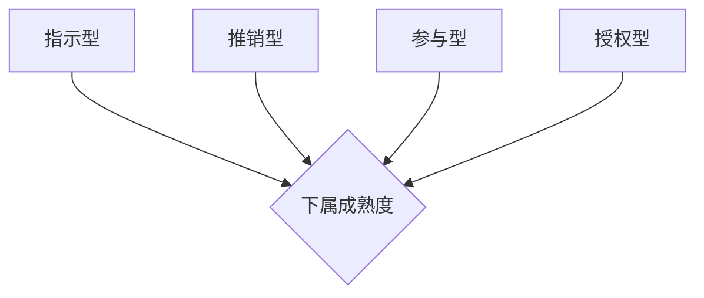
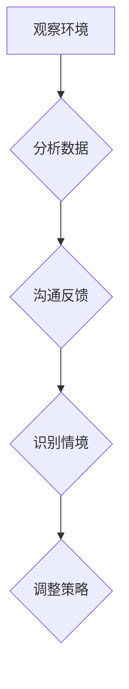

                 

### 领导力与情境管理：灵活应对不同挑战

#### 关键词：领导力、情境管理、灵活应对、挑战、解决方案

#### 摘要：

本文将从领导力的定义、情境管理的理念出发，深入探讨领导力与情境管理在实际应用中的重要性。通过分析不同的领导力理论、情境管理的实践技巧，以及领导者面临的挑战与应对策略，本文旨在为读者提供一套灵活应对各种挑战的领导力与情境管理方法。

---

### 引言

领导力，作为一种复杂的个人特质和能力，在组织管理中起着至关重要的作用。它不仅仅是管理团队、推动项目进展的工具，更是激发团队潜能、实现组织目标的动力源泉。而情境管理，作为一种基于环境变化的领导方式，强调领导者需要根据不同的情境调整自己的领导风格和行为策略。本文将围绕这一主题，逐步分析领导力与情境管理在实际应用中的挑战与解决方案。

---

#### 第1章 领导力理论

领导力理论是理解领导行为和领导效果的重要工具。在领导力理论的众多分类中，情境领导理论、变革型领导理论和交易型领导理论是三种典型的领导力模型。

##### 1.1 情境领导理论

情境领导理论是由保罗·赫塞和肯尼斯·布兰查德提出的，它将领导风格分为四种：指示型、推销型、参与型和授权型。这种理论的核心思想是，领导者的风格应该根据下属的成熟度水平来调整。在不同的情境下，领导者需要灵活运用不同的领导风格，以达到最佳的管理效果。

**图1-1：情境领导理论核心要素**

**表1-1：情境领导理论对比表格**

| 领导风格 | 特点 | 适用情境 |
| --- | --- | --- |
| 指示型 | 明确指导下属，告诉他们该做什么 | 下属缺乏自信和能力 |
| 推销型 | 通过沟通和说服，使下属接受任务 | 下属缺乏动机 |
| 参与型 | 与下属共同决策，鼓励参与 | 下属需要参与决策 |
| 授权型 | 下放权力，鼓励下属自主决策 | 下属有能力和自主性 |

##### 1.2 变革型领导理论

变革型领导理论强调领导者通过激励、激励和模范作用来推动组织变革。变革型领导者通常具有以下特点：

- 激发员工的内在动机
- 强调共同目标
- 鼓励创新和尝试

变革型领导的效果在于能够推动组织实现长期目标，并在面对挑战时保持韧性。

##### 1.3 交易型领导理论

交易型领导理论认为领导行为是基于交换原则的，即领导者提供奖励或惩罚以激励下属。这种领导风格通常注重短期目标和绩效，适用于一些具体任务的执行。

**表1-2：三种领导力理论对比**

| 领导力理论 | 核心特点 | 适用情境 |
| --- | --- | --- |
| 情境领导理论 | 根据下属成熟度调整领导风格 | 多样化的工作环境和团队 |
| 变革型领导理论 | 激励员工实现共同目标 | 需要变革和创新的组织 |
| 交易型领导理论 | 基于交换原则激励下属 | 需要高效执行的特定任务 |

---

#### 第2章 情境管理

情境管理是一种基于环境变化的领导方式，它要求领导者能够快速识别不同情境，并根据情境调整自己的领导风格和行为策略。

##### 2.1 识别情境

识别情境是情境管理的第一步，也是关键的一步。领导者需要通过观察、沟通和数据分析等方式，准确识别当前所处的情境。常见的情境包括：

- 紧急情况
- 变革时期
- 创新环境
- 团队协作
- 独立工作

**图2-1：情境识别流程**

##### 2.2 调整领导风格

一旦领导者识别出当前情境，就需要根据情境的特点和需求，调整自己的领导风格。以下是一些常见的情境和对应的领导风格：

**表2-1：情境与领导风格匹配**

| 情境 | 领导风格 | 说明 |
| --- | --- | --- |
| 紧急情况 | 指示型 | 确保任务按时完成 |
| 变革时期 | 变革型 | 推动组织变革 |
| 创新环境 | 授权型 | 鼓励创新和自主性 |
| 团队协作 | 参与型 | 促进团队合作和沟通 |
| 独立工作 | 交易型 | 提供明确的任务和奖励 |

---

#### 第3章 领导力实践

领导力理论虽然重要，但真正的价值在于实践。在本章中，我们将通过具体案例来探讨领导力在现实中的应用。

##### 3.1 案例分析

**案例一：成功应对危机**

在一个公司的财务危机中，领导者通过迅速调整领导风格，从指示型转变为变革型领导，成功引导团队度过危机。

**案例二：推动团队创新**

在一个创新型企业中，领导者通过授权型领导风格，鼓励员工提出创新想法，并在实践中支持这些想法的实现。

**案例三：实现组织变革**

在一个面临重大变革的组织中，领导者通过参与型领导风格，与团队成员共同制定变革计划，并在变革过程中保持团队的凝聚力。

---

#### 第4章 挑战与应对

领导者面临的挑战是多样化的，包括内部挑战和外部挑战。在本章中，我们将探讨这些挑战，并分析如何应对。

##### 4.1 内部挑战

- 团队成员之间的冲突
- 个人能力不足
- 资源限制

**解决方案：**

- 通过情境管理，调整领导风格，促进团队协作。
- 提供培训和发展机会，提升团队成员的能力。
- 优化资源分配，确保关键任务得到足够的支持。

##### 4.2 外部挑战

- 竞争压力
- 市场变化
- 法律法规

**解决方案：**

- 通过变革型领导，推动组织适应市场变化。
- 建立强大的外部关系网络，以应对竞争压力。
- 确保组织遵守法律法规，降低法律风险。

---

#### 第5章 拓展阅读

在本章中，我们将介绍领导力与情境管理的最新研究进展、应用领域，以及领导力与组织文化的关系。

---

#### 结论

领导力与情境管理是现代组织管理中不可或缺的两个要素。通过本文的探讨，我们了解了不同领导力理论的特点和应用，学会了如何根据不同情境调整领导风格，以及如何应对领导力面临的挑战。希望本文能为您提供一套实用的领导力与情境管理方法，帮助您在职场中取得成功。

---

**作者：AI天才研究院/AI Genius Institute & 禅与计算机程序设计艺术 /Zen And The Art of Computer Programming**

---

本文通过对领导力与情境管理的深入分析，提供了从理论到实践的全面指导。读者可以根据自身实际情况，灵活运用这些方法，提高领导力和管理效能。希望本文能为您的职业发展带来启示和帮助。

---

**最佳实践 Tips：**

1. 定期反思和调整自己的领导风格，以确保与当前情境相匹配。
2. 建立有效的沟通机制，确保团队成员之间的信息流通。
3. 在面对挑战时，保持冷静和客观，寻找合适的解决方案。

---

**小结：**

本文通过系统的分析和实际案例，展示了领导力与情境管理在组织管理中的重要性。灵活运用不同的领导力理论和情境管理技巧，能够帮助领导者更好地应对各种挑战，实现组织目标。

---

**注意事项：**

1. 领导力并非一成不变的，需要根据情境和团队特点不断调整。
2. 情境管理强调领导者对环境的敏锐感知，以及灵活应对能力。

---

**拓展阅读：**

1.赫塞，肯尼斯·布兰查德，《情境领导》
2.约翰·科特，《领导力：增强你的影响力和说服力》
3.彼得·德鲁克，《管理实践》

---

通过本文的学习，我们相信读者对领导力与情境管理有了更深入的理解。希望您能够将这些知识应用到实际工作中，成为一名卓越的领导者。

