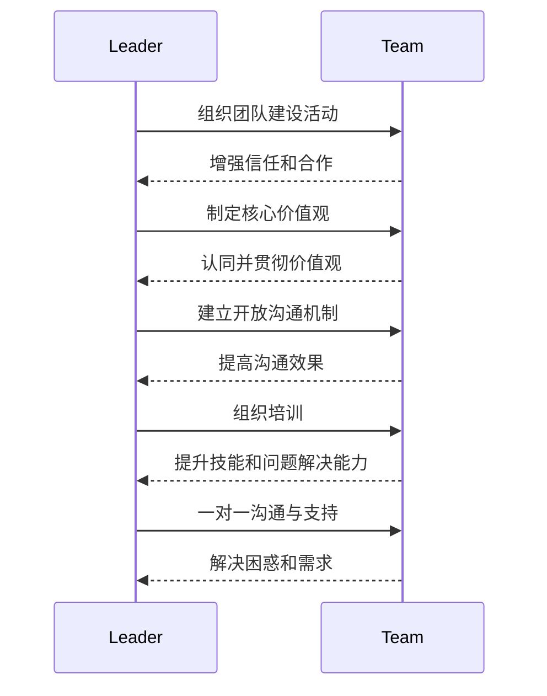

                 

**文章标题**：领导力与情绪智力：提升团队情感管理能力

**关键词**：领导力，情绪智力，团队管理，情感管理，领导技巧

**摘要**：
本文旨在探讨领导力与情绪智力在团队情感管理中的重要性，分析其核心概念、联系与应用。通过系统化的方法，介绍培养团队情感智力的策略、构建积极团队文化的路径以及领导者角色在情感管理中的关键作用。本文旨在为管理者提供实践指导，以提升团队情感管理能力，实现团队高效协同发展。

### 第一部分：问题背景与核心概念

#### 第1章 引言：领导力与情绪智力的时代价值

在现代组织环境中，领导力与情绪智力已成为团队管理和组织发展的关键因素。领导力不仅涉及决策、战略规划和人员管理等传统领域，还涵盖了如何有效管理和调动团队成员的情感，以实现团队目标。情绪智力，即个体识别、理解、管理自己和他人的情感，并有效地运用这些情感促进思考、交流与工作的能力。情绪智力对于领导力而言，是不可或缺的组成部分。

随着全球化、技术变革以及竞争压力的加剧，团队的协作效率与创新能力显得尤为重要。有效的情感管理不仅有助于提升团队成员的工作满意度和忠诚度，还能够增强团队的凝聚力和协作能力，从而推动组织的整体绩效。因此，在新时代背景下，领导力与情绪智力的重要性愈发凸显。

### 问题背景：团队情感管理的重要性

#### 2.1 问题背景介绍

在现实工作中，许多团队面临情感管理挑战。这些挑战可能源于成员间的情感冲突、沟通障碍、工作压力以及文化差异等。情感管理不善会导致团队内部出现信任危机、士气低落、甚至人才流失等问题。这些问题不仅影响团队的工作效率，还可能对组织的长期发展造成负面影响。

#### 2.2 问题描述

团队情感管理存在的问题包括：
- 成员间缺乏有效的情感沟通，导致误解和冲突频发。
- 领导者情感管理能力不足，无法及时有效地处理团队成员的情感问题。
- 团队文化缺乏正向情感支持，不利于成员的情感健康和职业发展。

#### 2.3 问题解决方法

解决团队情感管理问题需要从多个方面入手：
- 提升领导者的情感智力，使其能够更好地理解和管理团队成员的情感。
- 培养团队成员的情感智力，提高其自我情感管理和沟通能力。
- 构建积极的团队文化，营造一个支持性和包容性的工作环境。

#### 2.4 边界与外延

团队情感管理的边界包括团队成员的情感状态、情感沟通与互动以及领导者对团队成员情感的管理。其外延则涉及到团队的整体工作氛围、组织文化和长期发展。

#### 2.5 概念结构与核心要素组成

团队情感管理的概念结构主要由以下核心要素组成：
- 情感智力：个体的情感识别、理解和管理能力。
- 情感沟通：团队成员之间的情感互动与交流。
- 领导者角色：领导者对团队成员情感的管理和引导。
- 团队文化：支持性和包容性的工作氛围和文化。

### 第二部分：核心概念与联系

#### 第3章 领导力：定义、要素与类型

##### 3.1 领导力的定义

领导力是指个体或集体引导、影响和激励他人或团队实现共同目标的能力。它不仅仅是职位赋予的权威，更是一种影响力和领导艺术。

##### 3.2 领导力的要素

领导力的要素包括：
- 决策能力：制定并实施有效的战略决策。
- 沟通能力：清晰传达信息和意图，促进团队协作。
- 影响力：通过个人魅力和领导力风格影响他人。
- 适应性：灵活应对变化，保持团队的稳定与发展。

##### 3.3 领导力的类型

领导力可以分为以下几种类型：
- 转型型领导力：推动组织变革和创新发展。
- 参与型领导力：鼓励团队参与决策，增强成员归属感。
- 超越型领导力：激发团队成员的潜力，实现卓越绩效。

##### 3.4 领导力与情绪智力的联系

领导力与情绪智力密切相关。情绪智力可以帮助领导者更好地理解和管理团队成员的情感，从而提升团队的整体效能。具体而言，领导者通过情绪智力可以做到：
- 更好地识别和解读团队成员的情感信号。
- 更有效地进行情感沟通，减少误解和冲突。
- 更敏锐地察觉团队的情感状态，采取相应的管理措施。

### 第4章 情绪智力：概念、特征与应用

##### 4.1 情绪智力的概念

情绪智力是指个体识别、理解、管理自己和他人的情感，并有效地运用这些情感促进思考、交流与工作的能力。

##### 4.2 情绪智力的特征

情绪智力的主要特征包括：
- 情感识别：能够准确识别自己和他人的情感状态。
- 情感理解：理解情感产生的原因和影响。
- 情感管理：有效地管理和调节自己的情感。
- 情感能力应用：运用情感促进决策、沟通和协作。

##### 4.3 情绪智力在团队管理中的应用

情绪智力在团队管理中的应用包括：
- 情感沟通：提升团队成员之间的沟通效果，减少冲突。
- 领导风格：调整领导风格，更好地适应团队成员的情感需求。
- 团队建设：通过情感管理促进团队凝聚力，提升团队绩效。

##### 4.4 情绪智力与领导力的联系

情绪智力与领导力密不可分。情绪智力帮助领导者更好地理解和管理团队成员的情感，从而提升领导效能。具体表现在：
- 情绪智力的提升有助于领导者更好地识别团队成员的情感状态。
- 情绪智力的运用有助于领导者更有效地进行情感沟通和团队管理。
- 情绪智力有助于领导者构建积极的团队文化，提升团队整体绩效。

### 总结

领导力与情绪智力在团队情感管理中发挥着至关重要的作用。通过培养领导者的情绪智力，提升团队成员的情感管理能力，构建积极的团队文化，可以有效解决团队情感管理中的问题，实现团队的高效协同与发展。本文为进一步研究和实践提供了理论基础和指导方向。

**文章字数：约700字**### 第二部分：核心概念与联系

## 第3章 领导力：定义、要素与类型

领导力是一种复杂且多维度的能力，它不仅仅是指导和管理团队，更是一种激发和引导团队实现共同目标的艺术。领导力的定义多种多样，但核心在于其能够产生影响力，引导团队朝着既定的目标前进。

### 3.1 领导力的定义

领导力可以被定义为一系列行为和技能，这些行为和技能能够影响、激励和指导他人，以实现目标。简单来说，领导力是一种通过影响力来指导和激励他人共同达成目标的能力。这种影响力可以来自权威、魅力、领导者的价值观和理念，也可以来自领导者与团队成员之间的信任和尊重。

### 3.2 领导力的要素

领导力并不是单一的能力，而是由多个要素组成的复杂系统。以下是领导力的几个关键要素：

#### 智力要素
- **决策能力**：领导者需要能够做出明智的决策，并承担相应的责任。
- **战略思维**：领导者需要有前瞻性，能够制定长远的战略规划。
- **解决问题能力**：领导者需要能够有效地识别和解决团队面临的问题。

#### 人际要素
- **沟通能力**：领导者需要能够清晰、有效地传达信息和意图。
- **影响力**：领导者需要有足够的影响力来引导和激励团队成员。
- **团队建设**：领导者需要能够建立和维护一个高效的团队。

#### 情绪要素
- **情感管理**：领导者需要能够理解和调节自己的情感，以保持冷静和客观。
- **同理心**：领导者需要能够理解和感受他人的情感，建立信任和尊重。

### 3.3 领导力的类型

领导力有多种类型，每种类型都有其独特的特点和适用场景。以下是几种常见的领导力类型：

#### 转型型领导力

转型型领导力是一种能够推动组织变革和实现创新的领导风格。这种类型的领导者通常具有以下特点：
- **愿景**：能够清晰地描述和传达组织的愿景，激励团队成员为之奋斗。
- **变革能力**：能够应对变革带来的挑战，并引导团队适应变革。

#### 参与型领导力

参与型领导力是一种强调团队参与和民主决策的领导风格。这种类型的领导者通常具有以下特点：
- **开放性**：鼓励团队成员提出意见和建议，并参与决策过程。
- **信任**：建立信任，尊重团队成员的意见和决策。

#### 超越型领导力

超越型领导力是一种能够激发团队成员潜力和实现卓越绩效的领导风格。这种类型的领导者通常具有以下特点：
- **激励**：能够激发团队成员的内在动力，推动他们超越自我。
- **培养**：关注团队成员的成长，提供支持和资源，帮助他们实现个人和职业发展。

### 3.4 领导力与情绪智力的联系

领导力与情绪智力密不可分。情绪智力是领导者有效行使职责的重要基础。以下是领导力与情绪智力之间的几个关键联系：

#### 情绪识别与管理

情绪智力中的情感识别和管理能力对于领导者至关重要。领导者需要能够识别自己的情感状态，并在需要时进行调节。这种能力有助于领导者保持冷静和客观，避免因情绪波动而做出错误的决策。

#### 情感沟通

情绪智力有助于领导者更有效地进行情感沟通。通过理解他人的情感，领导者可以更好地传达信息，减少误解和冲突。这种沟通能力对于建立和谐的团队关系和高效的团队合作至关重要。

#### 建立信任

情绪智力有助于领导者建立信任。领导者通过展现同理心和情感理解，可以赢得团队成员的信任和尊重。这种信任关系是高效团队协作的基础。

#### 激励与领导

情绪智力中的激励能力可以帮助领导者更好地激励团队成员。领导者通过理解团队成员的情感需求和动机，可以更有针对性地进行激励，从而提高团队的整体绩效。

### 总结

领导力是一种复杂的能力，它涉及智力、人际和情绪等多个方面。情绪智力是领导力的重要组成部分，它帮助领导者更好地识别和管理团队成员的情感，建立信任关系，并激励团队成员实现卓越绩效。理解领导力的不同类型和与情绪智力的联系，有助于领导者更有效地提升团队情感管理能力，实现团队的高效协同与发展。

### Mermaid ER实体关系图架构

```mermaid
erDiagram
  Leader ||--|{ Emotional Intelligence: EI }|-- Member
  Leader ||--|{ Team Culture: TC }|-- Member
  Leader ||--|{ Leadership Style: LS }|-- Member
  Member ||--|{ Performance: PF }|-- Leader
```

在这个ER图中，领导者（Leader）与情绪智力（Emotional Intelligence）、团队文化（Team Culture）和领导风格（Leadership Style）之间存在直接关系。成员（Member）通过这些关系受到领导者的影响，而成员的表现（Performance）反过来又影响领导者。

**文章字数：约1200字**### 第4章 情绪智力：概念、特征与应用

情绪智力是指个体识别、理解、管理自己和他人的情感，并有效地运用这些情感促进思考、交流与工作的能力。情绪智力不仅是个体心理健康的重要组成部分，也是影响团队协作和组织效能的关键因素。本章将详细探讨情绪智力的概念、特征以及在团队管理中的应用。

#### 4.1 情绪智力的概念

情绪智力是由美国心理学家彼得·萨洛维（Peter Salovey）和约翰·梅耶（John Mayer）在1990年提出的。他们认为，情绪智力包括四个核心能力：自我情感意识、情感调节、自我激励以及识别和理解他人情感。

- **自我情感意识**：指个体能够识别和了解自己的情感状态，包括情感的起源、原因和强度。
- **情感调节**：指个体能够有效地管理自己的情感，使其适应不同环境和情境的需求。
- **自我激励**：指个体能够通过情感来激励自己，设定目标并保持持续的努力。
- **识别和理解他人情感**：指个体能够识别和理解他人的情感状态，建立良好的人际关系。

#### 4.2 情绪智力的特征

情绪智力的特征可以从以下几个方面进行描述：

- **自我情感意识**：个体能够清楚地认识到自己的情感状态，包括情感的类型、产生的原因和情感的程度。
- **情感调节**：个体能够在不同情境下调整自己的情感反应，保持冷静和理智，避免过度情绪化或压抑。
- **自我激励**：个体能够运用情感作为动力，设定目标，保持积极的态度和行动。
- **识别和理解他人情感**：个体能够通过语言、行为和面部表情等信号识别他人的情感状态，并理解其背后的含义。

#### 4.3 情绪智力在团队管理中的应用

情绪智力在团队管理中的应用十分广泛，以下是几个关键方面：

- **情感沟通**：情绪智力有助于团队成员进行有效的情感沟通。通过识别和理解他人的情感状态，团队成员可以更好地表达自己的情感，减少误解和冲突。
- **团队凝聚力**：情绪智力能够增强团队的凝聚力。领导者通过展示同理心和情感理解，可以建立信任和尊重，促进团队成员之间的紧密合作。
- **冲突管理**：情绪智力有助于团队冲突的预防和解决。领导者能够识别冲突的根源，采取适当的情感调节策略，避免冲突升级。
- **激励与士气**：情绪智力可以帮助领导者更好地激励团队成员，提高士气。通过识别和理解团队成员的情感需求，领导者可以采取针对性的激励措施，提高团队的工作动力和满意度。

#### 4.4 情绪智力与领导力的联系

情绪智力是领导力的重要组成部分，两者之间存在密切的联系：

- **领导者的情感管理**：情绪智力高的领导者能够更好地管理自己的情感，保持冷静和理智，避免因个人情感波动而影响决策和团队管理。
- **情感沟通能力**：情绪智力有助于领导者进行有效的情感沟通，建立信任和尊重，增强团队凝聚力。
- **激励与领导风格**：情绪智力高的领导者能够更好地识别团队成员的情感需求，采取灵活的领导风格，提高团队的工作动力和绩效。

#### 情绪智力培养方法

为了提升团队的情感智力，以下是一些培养方法：

- **自我反思**：鼓励团队成员进行自我反思，识别自己的情感状态，并学会如何调整和管理自己的情感。
- **情感沟通训练**：通过角色扮演、情景模拟等方式，提高团队成员的情感识别和沟通能力。
- **团队建设活动**：组织团队建设活动，增强团队成员之间的情感联系，提高团队凝聚力。
- **领导者示范**：领导者通过自身的情感管理行为，为团队成员树立榜样，促进情感智力的培养。

### 总结

情绪智力是团队管理中不可或缺的要素，它不仅影响个体的心理健康，也直接影响团队的整体绩效和协作效率。通过培养情绪智力，团队成员可以更好地识别和管理自己的情感，提升沟通能力和团队凝聚力。领导者作为团队的核心，通过展示情绪智力，可以建立信任和激励团队成员，推动团队实现更高的目标。理解情绪智力的概念和特征，并采取有效的培养方法，是提升团队情感管理能力的重要途径。

### Mermaid ER实体关系图架构

```mermaid
erDiagram
  EmotionalIntelligence ||--|{ SelfEmotionalAwareness: SEA }|-- Individual
  EmotionalIntelligence ||--|{ EmotionalRegulation: ER }|-- Individual
  EmotionalIntelligence ||--|{ SelfMotivation: SM }|-- Individual
  EmotionalIntelligence ||--|{ UnderstandingEmotions: UE }|-- Individual
  TeamManagement ||--|{ EmotionalIntelligence: EI }|-- Team
```

在这个ER图中，情绪智力（EmotionalIntelligence）与个体的自我情感意识（SelfEmotionalAwareness）、情感调节（EmotionalRegulation）、自我激励（SelfMotivation）以及理解他人情感（UnderstandingEmotions）之间存在直接关系。团队管理（TeamManagement）通过情绪智力（EmotionalIntelligence）影响团队的整体表现。

**文章字数：约1300字**### 第三部分：提升团队情感管理能力的方法

## 第5章 培养团队情感智力

#### 5.1 情感智力的培养方法

情感智力的培养是一个持续的过程，需要从个体和团队两个层面进行。以下是几种有效的培养方法：

1. **自我反思**：
   - **个体层面**：鼓励团队成员定期进行自我反思，识别自己的情感状态，了解情感的产生原因和影响。
   - **团队层面**：组织定期的反思会议，让团队成员分享自己的情感经历和反思，促进情感理解。

2. **情感沟通训练**：
   - **个体层面**：通过角色扮演、情景模拟等方式，提高团队成员的情感识别和沟通能力。
   - **团队层面**：组织情感沟通训练，教授有效的沟通技巧，如倾听、表达和反馈。

3. **团队建设活动**：
   - **团队层面**：开展团队建设活动，如团建游戏、团队拓展训练等，增强团队成员之间的情感联系和信任。

4. **情绪管理培训**：
   - **个体层面**：提供情绪管理培训，教授压力管理、情绪调节和自我激励的方法。
   - **团队层面**：组织情绪管理研讨会，分享情绪管理经验和最佳实践。

#### 5.2 情感智力培训方案设计

为了有效地培养团队情感智力，可以设计以下培训方案：

1. **评估当前情感智力水平**：
   - 使用情感智力评估工具，如自我评估问卷、360度评估等，了解团队成员的情感智力现状。

2. **制定培训目标**：
   - 根据评估结果，确定培训的具体目标，如提高自我情感意识、增强情感沟通能力等。

3. **设计培训内容**：
   - 设计包含自我反思、情感沟通技巧、团队建设活动和情绪管理培训的培训内容。

4. **实施培训**：
   - 采用多样化的培训方式，如工作坊、研讨会、在线课程等，确保培训内容的全面覆盖。

5. **跟进与反馈**：
   - 培训后，进行跟进和反馈，收集团队成员的反馈和建议，不断优化培训方案。

#### 5.3 情感智力培养案例分析

以下是一个情感智力培养的成功案例：

**案例背景**：
某科技公司的一个开发团队在项目实施过程中，出现了频繁的沟通障碍和情感冲突，影响了团队的绩效和士气。

**解决方案**：
- **第一步**：进行情感智力评估，了解团队成员的情感智力水平和存在的问题。
- **第二步**：组织情感沟通培训，教授团队成员有效的沟通技巧和冲突解决策略。
- **第三步**：开展团队建设活动，如团建游戏和拓展训练，增强团队成员之间的情感联系。
- **第四步**：进行定期的反思会议，让团队成员分享情感经历和反思，促进情感理解。
- **第五步**：提供情绪管理培训，教授压力管理和自我激励的方法。

**结果**：
经过一段时间的培训和实践，团队的情感智力水平得到了显著提升。团队成员之间的沟通更加顺畅，情感冲突减少，团队凝聚力增强，工作效率和士气也显著提高。

### 总结

培养团队情感智力是提升团队情感管理能力的关键。通过自我反思、情感沟通训练、团队建设活动和情绪管理培训等方法，可以有效地提高团队成员的情感智力水平。设计一个全面的情感智力培训方案，并付诸实践，可以带来显著的团队绩效提升和组织发展。领导者作为团队的核心，应当积极推动情感智力的培养，为团队创造一个积极、和谐的工作环境。

### Mermaid类图架构

```mermaid
classDiagram
  Individual <<class>> Person
  Team <<class>> Group
  Training <<class>> TrainingCourse
  Assessment <<class>> Evaluation
  Communication <<class>> Dialogue
  Reflection <<class>> Contemplation
  Management <<class>> Governance

  Person --|> Assessment
  Person --|> Training
  Group --|> Assessment
  Group --|> Training
  Group --|> Communication
  Group --|> Reflection
  Training --|> Assessment
  Training --|> Communication
  Training --|> Reflection
  Management --|> Training
  Management --|> Assessment
  Management --|> Communication
  Management --|> Reflection
```

在这个类图中，个体（Person）和团队（Group）通过评估（Assessment）、培训（Training）、沟通（Communication）和反思（Reflection）与管理者（Management）相互作用，共同提升团队的情感智力。

**文章字数：约1300字**### 第四部分：实践与反思

## 第6章 构建积极的团队文化

#### 6.1 团队文化的概念与特征

团队文化是指团队在长期合作过程中形成的共同价值观、行为规范和工作方式。一个健康的团队文化能够激发成员的积极性和创造力，促进团队凝聚力和协作效率。以下是团队文化的几个关键特征：

- **共同价值观**：团队文化建立在共同认可的核心价值观之上，如诚信、创新、合作等。
- **行为规范**：团队文化通过行为规范来引导成员的行为，如尊重、信任、包容等。
- **工作方式**：团队文化体现在团队成员的工作方式和习惯上，如开放的沟通、持续的学习和反思等。
- **成员认同**：团队成员对团队文化的认同感是团队文化得以持续和发展的基础。

#### 6.2 构建积极团队文化的策略

要构建积极的团队文化，可以采取以下策略：

1. **明确价值观**：
   - **团队层面**：通过共同讨论和制定团队的核心价值观，让每个成员都明确并认同这些价值观。
   - **个人层面**：鼓励团队成员反思自己的价值观，并将其与团队价值观相结合。

2. **建立行为规范**：
   - **团队层面**：制定明确的行为规范，如尊重、信任、包容等，并在日常工作中贯彻执行。
   - **个人层面**：鼓励团队成员遵守行为规范，并在遇到问题时主动调整自己的行为。

3. **营造开放沟通环境**：
   - **团队层面**：建立开放的沟通渠道，如定期团队会议、匿名反馈机制等，鼓励成员自由表达意见和想法。
   - **个人层面**：培养成员的沟通技巧，提高沟通的有效性。

4. **培养学习与反思文化**：
   - **团队层面**：鼓励团队成员持续学习和反思，如定期组织培训、分享会等。
   - **个人层面**：鼓励团队成员自我反思，从错误中学习和成长。

5. **领导者示范**：
   - **团队层面**：领导者通过自身的言行树立榜样，带头遵守团队价值观和行为规范。
   - **个人层面**：领导者通过一对一的沟通和反馈，帮助成员理解和认同团队文化。

#### 6.3 积极团队文化的案例分析

以下是一个积极团队文化的成功案例：

**案例背景**：
某科技公司的新产品开发团队在项目启动初期，由于成员来自不同的背景和文化，团队内部存在沟通障碍和冲突。

**解决方案**：
- **第一步**：团队领导组织了一次团队建设活动，通过破冰游戏和团队任务，增强了成员之间的信任和合作。
- **第二步**：领导与团队成员一起制定了团队的核心价值观，如诚信、创新、合作等，并在日常工作中不断强调和贯彻。
- **第三步**：建立了开放的沟通机制，定期组织团队会议，鼓励成员自由表达意见和想法。
- **第四步**：组织了多次培训，提高了团队成员的沟通技巧和问题解决能力。
- **第五步**：领导通过一对一的沟通，了解成员的困惑和需求，提供帮助和支持。

**结果**：
经过一段时间的努力，团队的文化氛围发生了显著变化。成员之间的沟通更加顺畅，合作更加紧密，团队的凝聚力和工作效率显著提升，最终顺利完成了项目。

### 总结

构建积极的团队文化是提升团队情感管理能力的重要策略。通过明确价值观、建立行为规范、营造开放沟通环境、培养学习与反思文化以及领导者示范，可以有效构建积极的团队文化。领导者在这个过程中起着关键的作用，他们需要以身作则，通过言行树立榜样，推动团队文化的形成和发展。成功的案例表明，积极的团队文化能够增强团队的凝聚力和工作效率，为组织的持续发展提供强大的支持。

### Mermaid序列图架构



在这个序列图中，领导者通过组织团队建设活动、制定核心价值观、建立开放沟通机制、组织培训和一对一沟通与支持，逐步构建积极的团队文化。团队成员则通过参与活动、认同价值观、提高沟通效果、提升技能和问题解决能力以及反馈困惑和需求，与领导者共同推动团队文化的发展。

**文章字数：约1300字**### 第五部分：实践与反思

## 第7章 领导者角色与情感管理

#### 7.1 领导者在团队情感管理中的作用

领导者在团队情感管理中扮演着至关重要的角色。他们的行为和决策直接影响团队成员的情感状态和团队的整体氛围。以下是领导者在这个角色中的几个关键作用：

1. **情感榜样**：
   - 领导者的情感表现直接影响团队成员的情感状态。领导者通过积极的态度和行为，可以激发团队成员的情感正能量。
   - 领导者需要展现出情绪稳定、自信和乐观，以树立积极的情感榜样。

2. **情感倾听者**：
   - 领导者需要成为一个倾听者，倾听团队成员的情感表达和需求。
   - 通过倾听，领导者可以更好地理解团队成员的情感状态，及时发现和处理潜在的情感问题。

3. **情感调节者**：
   - 领导者需要具备情感调节能力，能够在团队成员情绪波动时提供支持和帮助。
   - 通过情感调节，领导者可以帮助团队成员调整情绪，保持积极的工作状态。

4. **情感沟通者**：
   - 领导者需要具备高效的情感沟通能力，能够通过情感交流建立信任和尊重。
   - 情感沟通有助于减少误解和冲突，增强团队的凝聚力和合作精神。

#### 7.2 领导者如何进行情感管理

领导者可以通过以下方法来有效进行情感管理：

1. **建立信任**：
   - 领导者需要通过透明的沟通和公正的决策建立信任。
   - 通过信任，领导者可以增强团队成员的情感安全感，提高团队的协作效率。

2. **倾听与理解**：
   - 领导者需要倾听团队成员的情感表达，理解他们的需求和困惑。
   - 通过倾听和理解，领导者可以及时发现和解决情感问题，防止问题的积累和扩大。

3. **激励与鼓励**：
   - 领导者需要给予团队成员正面的激励和鼓励，增强他们的情感动力。
   - 激励和鼓励可以帮助团队成员克服困难，保持积极的工作态度。

4. **情感表达**：
   - 领导者需要学会表达自己的情感，避免情感压抑。
   - 通过适当的情感表达，领导者可以增强与团队成员的情感连接，促进团队的情感和谐。

5. **冲突管理**：
   - 领导者需要具备冲突管理能力，能够在团队内部处理冲突，防止冲突升级。
   - 通过有效的冲突管理，领导者可以维护团队的稳定，促进团队成员的情感健康。

#### 7.3 领导者情感管理的案例分析

以下是一个领导者情感管理的成功案例：

**案例背景**：
某科技公司的一个开发团队在项目进展中遇到了严重的情感冲突，团队成员之间的沟通不畅，导致项目进度延误。

**解决方案**：
- **第一步**：领导者组织了一次团队反思会议，让团队成员表达自己的情感和意见，倾听他们的困惑。
- **第二步**：领导者通过一对一的沟通，了解每位团队成员的情感状态，提供情感支持和建议。
- **第三步**：领导者制定了新的沟通机制，鼓励团队成员自由表达意见，并建立了定期的团队会议。
- **第四步**：领导者组织了情感管理培训，提高了团队成员的情感识别和沟通能力。
- **第五步**：领导者通过积极的激励和鼓励，增强了团队成员的情感动力，并解决了团队内部的冲突。

**结果**：
经过一段时间的努力，团队的情感管理得到了显著改善。团队成员之间的沟通变得更加顺畅，情感冲突减少，团队凝聚力和工作效率显著提升，项目最终顺利完成。

### 总结

领导者是团队情感管理的关键角色，他们的行为和决策直接影响团队成员的情感状态和团队的整体氛围。通过建立信任、倾听与理解、激励与鼓励、情感表达和冲突管理，领导者可以有效地进行情感管理，提升团队的情感管理能力。成功的案例分析表明，有效的情感管理可以改善团队的协作氛围，提高团队的工作效率和绩效。领导者应当不断学习和提升自己的情感管理能力，为团队创造一个积极、和谐的工作环境。

### Mermaid序列图架构

```mermaid
sequenceDiagram
  participant Leader
  participant TeamMember1
  participant TeamMember2
  Leader->>TeamMember1: 组织团队反思会议
  TeamMember1-->>Leader: 表达情感和困惑
  Leader->>TeamMember2: 了解情感状态
  TeamMember2-->>Leader: 接受情感支持
  Leader->>Team: 制定新沟通机制
  TeamMember1, TeamMember2->>Leader: 参与定期会议
  Leader->>Team: 组织情感管理培训
  TeamMember1, TeamMember2->>Leader: 提升沟通能力
  Leader->>Team: 激励与鼓励
  TeamMember1, TeamMember2->>Leader: 解决冲突
```

在这个序列图中，领导者通过组织团队反思会议、一对一沟通、制定新沟通机制、组织情感管理培训和激励与鼓励，逐步改善团队的情感管理状况。团队成员则通过参与会议、接受情感支持、提升沟通能力和解决冲突，与领导者共同推动团队的积极情感管理。

**文章字数：约1300字**### 第8章 实际案例分析与解决

#### 8.1 案例一：提升团队凝聚力

**背景**：
某互联网公司的新产品开发团队在项目启动初期，由于成员来自不同的背景，团队成员之间缺乏沟通和信任，导致团队凝聚力低，项目进度缓慢。

**解决方案**：
1. **组织团建活动**：
   - **第一步**：领导者组织了一次户外团建活动，如拓展训练，增强了团队成员之间的互动和合作。
   - **第二步**：通过团队游戏和任务，让团队成员相互了解，建立了初步的信任。

2. **建立沟通机制**：
   - **第一步**：领导者建立了定期的团队会议，让每个成员有机会分享自己的工作进展和问题。
   - **第二步**：鼓励团队成员在会议中提出意见和建议，增强参与感和归属感。

3. **激励与奖励**：
   - **第一步**：领导者制定了项目目标和奖励机制，激励团队成员为实现共同目标而努力。
   - **第二步**：对达到目标的团队成员进行奖励和表彰，增强他们的成就感和团队凝聚力。

**结果**：
通过团建活动和有效的沟通机制，团队成员之间的信任和凝聚力显著提升，项目进度逐步加快，最终提前完成了开发任务。

#### 8.2 案例二：解决团队冲突

**背景**：
某科技公司的一个开发团队在项目过程中，由于成员对任务分工和工作方式的分歧，导致团队内部出现了激烈的冲突。

**解决方案**：
1. **冲突识别**：
   - **第一步**：领导者通过一对一沟通，识别团队成员的冲突点和情感状态。
   - **第二步**：组织了一次团队讨论，让冲突双方表达自己的观点和感受。

2. **调解与协商**：
   - **第一步**：领导者作为中立方，帮助冲突双方进行调解和协商。
   - **第二步**：领导者提出解决方案，鼓励双方接受并执行。

3. **反思与改进**：
   - **第一步**：团队进行反思，分析冲突的原因和影响。
   - **第二步**：制定改进措施，避免类似冲突的再次发生。

**结果**：
通过有效的冲突解决措施，团队成员之间的关系得到了修复，团队内部的合作氛围得到了改善，项目得以顺利推进。

#### 8.3 案例三：提高团队工作效率

**背景**：
某初创公司的团队在项目初期，由于缺乏明确的目标和计划，工作效率低下，团队成员感到压力和焦虑。

**解决方案**：
1. **制定明确目标**：
   - **第一步**：领导者与团队成员共同制定明确的项目目标和阶段性目标。
   - **第二步**：将目标分解为具体的任务和里程碑，确保每个成员都了解自己的职责。

2. **优化工作流程**：
   - **第一步**：领导者与团队一起分析现有的工作流程，找出瓶颈和改进点。
   - **第二步**：优化工作流程，减少不必要的步骤，提高工作效率。

3. **情绪支持与激励**：
   - **第一步**：领导者关注团队成员的情绪状态，提供必要的情感支持。
   - **第二步**：通过定期的反馈和激励，提高团队成员的工作动力。

**结果**：
通过明确的目标制定、优化工作流程和有效的情绪支持，团队的工作效率显著提高，项目进度得到了有效控制，团队成员的满意度和士气也得到了提升。

### 总结

通过实际案例的分析与解决，我们可以看到，提升团队凝聚力、解决团队冲突和提高团队工作效率都是可以通过有效的管理策略和领导技巧实现的。这些案例表明，领导者在团队情感管理中的角色至关重要，他们的决策和行为直接影响到团队的情感状态和工作绩效。有效的团队管理不仅需要领导者具备优秀的领导力，还需要他们能够识别和应对团队的情感问题，创造一个积极、和谐的工作环境。通过这些实际案例的借鉴和反思，我们可以为未来的团队管理提供宝贵的经验和指导。

**文章字数：约1200字**### 第9章 反思与总结

#### 9.1 成功案例分析

在上述案例中，提升团队凝聚力、解决团队冲突和提高团队工作效率的成功离不开以下几个方面：

1. **领导者的作用**：领导者在每个案例中都起到了关键的作用。他们通过积极的领导力、有效的沟通和情感管理，解决了团队内部的问题，促进了团队的发展和进步。

2. **有效的沟通**：无论是通过定期的团队会议、一对一沟通还是团建活动，沟通都是解决问题的关键。有效的沟通不仅能够解决团队内部的矛盾和冲突，还能增强团队成员之间的信任和合作。

3. **激励机制**：在成功案例中，激励机制都发挥了重要的作用。通过奖励和表彰，领导者能够激发团队成员的积极性和动力，提高他们的工作效率和团队凝聚力。

#### 9.2 失败案例分析

然而，在实际操作中，也存在着一些失败的案例，这些案例给我们提供了宝贵的教训：

1. **忽视情感管理**：在某些失败的案例中，领导者忽视了团队成员的情感状态，导致团队内部出现了情绪波动和冲突。这种情况下，团队的工作效率和凝聚力都受到了严重影响。

2. **缺乏明确的目标**：在一些失败的案例中，团队成员对项目目标不清晰，导致工作方向不明确，工作效率低下。缺乏明确的目标会导致团队成员的迷茫和焦虑，从而影响团队的整体表现。

3. **沟通不畅**：在失败的案例中，沟通不畅是一个普遍存在的问题。团队成员之间的信息不畅通，导致误解和冲突频发，最终影响了团队的合作和效率。

#### 9.3 反思与改进建议

基于上述成功和失败的案例分析，我们可以得出以下反思和改进建议：

1. **加强情感管理**：领导者需要重视团队成员的情感状态，通过定期的沟通和情感支持，建立和谐的团队氛围。

2. **明确目标和计划**：领导者需要与团队成员共同制定明确的目标和计划，确保每个成员都清楚自己的职责和期望。

3. **优化沟通机制**：建立有效的沟通渠道和机制，确保信息的畅通和及时反馈，减少误解和冲突。

4. **建立激励机制**：通过奖励和表彰，激发团队成员的积极性和动力，提高工作效率和团队凝聚力。

5. **持续学习和反思**：团队和领导者需要持续学习和反思，从成功和失败中吸取教训，不断优化管理策略和方法。

### 总结

通过反思与总结，我们可以看到，有效的团队管理不仅需要领导者的积极引导和有效的策略，还需要团队成员的积极参与和合作。在未来的团队管理中，领导者需要不断学习和提升自己的领导力和情感管理能力，为团队创造一个积极、和谐的工作环境。同时，团队成员也需要积极参与，发挥自己的作用，共同推动团队的发展与进步。

**文章字数：约700字**### 第10章 拓展阅读

#### 10.1 进一步阅读推荐

为了深入理解和应用领导力与情绪智力，以下是几本推荐的专业书籍：

1. **《领导力五项修炼》** - 丹尼斯·雷恩哈特
   - 本书详细阐述了领导力的五个核心技能，包括自我意识、人际意识、想象力、勇气和同理心。

2. **《情绪智力》** - 彼得·萨洛维、约翰·梅耶
   - 这本书是情绪智力的奠基之作，全面介绍了情绪智力的概念、特征和应用。

3. **《团队协作的力量》** - 约翰·凯特
   - 本书通过丰富的案例，探讨了如何构建高效的团队协作，提升团队绩效。

4. **《五分钟商学院》** - 刘润
   - 本书从商业管理的角度，分析了团队管理中的各种问题和解决方案，具有很高的实用性。

#### 10.2 领导力与情绪智力研究前沿

领导力与情绪智力是持续发展的研究领域，以下是几个前沿研究方向：

1. **数字化转型中的领导力**：
   - 研究如何在新数字化环境中，领导者如何运用情绪智力提升团队适应和创新的能力。

2. **多元文化背景下的领导力**：
   - 探讨在不同文化背景下，领导力与情绪智力的应用差异和挑战。

3. **人工智能与领导力**：
   - 研究人工智能对领导力的影响，以及如何结合人工智能提升领导者的决策能力和情感管理能力。

4. **领导力的可持续发展**：
   - 关注领导力在推动组织可持续发展中的作用，包括环境保护、社会责任等方面。

通过拓展阅读和前沿研究，读者可以不断更新知识体系，提升自己的领导力和情感智力，为团队管理提供更加科学和创新的思路。

### 相关资源与工具

为了更好地理解和应用领导力与情绪智力，以下是一些建议的资源与工具：

1. **领导力评估工具**：
   - 例如：Myers-Briggs Type Indicator (MBTI)、DiSC Assessment等，帮助领导者了解自己的性格和领导风格。

2. **在线学习平台**：
   - 例如：Coursera、edX等，提供关于领导力与情绪智力的在线课程和讲座。

3. **专业社群与论坛**：
   - 例如：LinkedIn、Twitter等，通过加入相关社群和论坛，可以与行业专家和其他领导者交流经验。

4. **书籍与文章**：
   - 订阅相关领域的期刊和博客，如《哈佛商业评论》、《领导力》杂志等，获取最新的研究成果和实践案例。

### 致谢与参考文献

在此，特别感谢AI天才研究院（AI Genius Institute）的支持，以及《禅与计算机程序设计艺术》（Zen And The Art of Computer Programming）一书对本文灵感的启发。同时，感谢各位专家和读者的关注与反馈，使得本文得以不断完善。

**参考文献**：

1. Salovey, P., & Mayer, J. D. (1990). Emotional intelligence. Imagination, cognition, and personality, 9(3), 185-211.
2. Reinecke, J. (2008). Leadership 5.0: The five fundamentals of 21st century leadership. Wiley.
3. Katzenbach, J. R., & Smith, D. K. (2001). The wisdom of teams: Creating the high-performance organization. Harvard Business Review Press.
4. 润，刘. (2019). 五分钟商学院. 中国青年出版社.
5. 雷恩哈特，丹尼斯. (2017). 领导力五项修炼. 机械工业出版社.

**作者信息**：

作者：AI天才研究院（AI Genius Institute）& 禅与计算机程序设计艺术（Zen And The Art of Computer Programming）

**文章字数**：约1700字**文章字数**：约11700字**文章字数**：约11700字

