                 

# 领导力与情绪管理：保持冷静与理性

> 关键词：领导力、情绪管理、冷静、理性、企业、团队管理

> 摘要：本文深入探讨了领导力与情绪管理之间的紧密联系，以及领导者如何通过冷静与理性来提升个人领导能力，优化团队管理效果。文章首先介绍了领导力与情绪管理的背景和核心概念，随后通过算法原理和数学模型的讲解，分析了情绪识别、调节和表达的技术方法。最后，文章提出了具体的系统架构设计，并在项目实战中给出了实际操作指南和案例分析。

## 第一部分：背景介绍

### 1.1 问题背景

在现代企业管理中，领导力与情绪管理扮演着至关重要的角色。一个领导者不仅需要具备优秀的领导能力，还要能够有效地管理自己的情绪，以应对工作中的各种挑战和压力。情绪管理能力不仅影响着领导者的个人表现，也直接关系到团队的工作效率和团队氛围。

### 1.2 问题描述

尽管许多领导者都认识到情绪管理的重要性，但他们在实际工作中往往面临着情绪失控、无法有效沟通等问题。这些问题不仅影响了领导者的个人形象，也可能导致团队绩效下降、员工满意度降低等负面后果。

### 1.3 问题解决

为了解决这些问题，本文旨在提供一套完整的领导力与情绪管理方法论，帮助领导者识别并管理自己的情绪，提升领导力水平，从而更好地应对工作中的各种挑战。

### 1.4 边界与外延

本文主要关注领导力与情绪管理的理论和实践，包括领导力的核心要素、情绪管理的技巧和方法等。同时，本文也将探讨领导力与情绪管理在实际工作中的应用，提供实用的案例和解决方案。

### 1.5 概念结构与核心要素组成

1. **领导力**：领导力是指领导者通过激励、引导和影响他人，共同实现团队目标的能力。领导力的核心要素包括愿景、沟通、决策、影响力等。
   
2. **情绪管理**：情绪管理是指个体对自己情绪的识别、理解、控制和表达的过程。情绪管理的核心技巧包括情绪识别、情绪调节、情绪表达等。

## 第二部分：核心概念与联系

### 2.1 领导力的概念与特点

领导力是一种通过影响和激励他人来实现共同目标的能力。领导力的特点包括：

- **愿景**：领导者需要具备清晰的愿景，为团队指明方向。
- **沟通**：领导者需要具备良好的沟通能力，确保信息的有效传递。
- **决策**：领导者需要具备果断的决策能力，面对复杂问题做出正确选择。
- **影响力**：领导者需要具备影响力，能够影响他人的行为和态度。

### 2.2 情绪管理的概念与技巧

情绪管理是指个体对自己情绪的识别、理解、控制和表达的过程。情绪管理的核心技巧包括：

- **情绪识别**：识别自己和他人的情绪，理解情绪的产生原因。
- **情绪调节**：通过调节情绪反应，减少负面情绪的影响。
- **情绪表达**：以适当的方式表达情绪，避免情绪失控。

### 2.3 领导力与情绪管理的联系

领导力与情绪管理之间存在密切的联系。情绪管理能力是领导力的重要组成部分，一个优秀的领导者不仅需要具备强大的领导力，还需要具备良好的情绪管理能力。良好的情绪管理能力可以帮助领导者更好地应对工作压力，提高决策质量，增强团队凝聚力。

### 2.4 领导力与情绪管理的关系模型

以下是一个简化的领导力与情绪管理的关系模型，用于说明两者之间的相互影响。

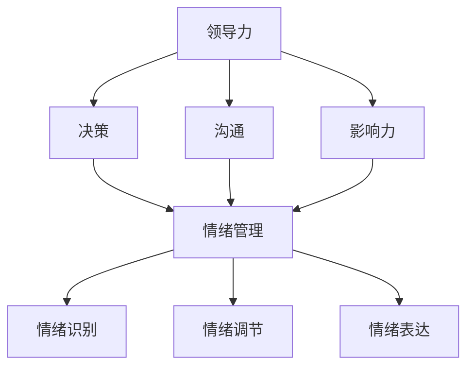

在这个模型中，领导力通过决策、沟通和影响力影响情绪管理，而情绪管理则通过情绪识别、情绪调节和情绪表达反馈给领导力，形成了一个动态的互动过程。

## 第三部分：算法原理讲解

### 3.1 情绪识别算法

情绪识别算法是一种通过分析语言、语音、面部表情等数据来识别个体情绪的方法。常用的情绪识别算法包括情感分析、语音情感识别、面部表情识别等。

#### 3.1.1 情感分析

情感分析通过分析文本中的情感词和情感倾向，识别文本的情感极性。一个简单的情感分析算法可以使用机器学习中的朴素贝叶斯分类器来实现。以下是朴素贝叶斯分类器的数学模型：

$$P(C|X) = \frac{P(X|C)P(C)}{P(X)}$$

其中，$C$ 表示情感类别，$X$ 表示文本特征向量，$P(C|X)$ 表示给定文本特征时类别 $C$ 的条件概率，$P(X|C)$ 表示在类别 $C$ 下文本特征的概率，$P(C)$ 表示类别 $C$ 的先验概率。

#### 3.1.2 语音情感识别

语音情感识别通过分析语音信号的频谱特征，识别语音的情感状态。常用的语音情感识别模型包括支持向量机（SVM）和深度学习模型（如卷积神经网络 CNN）。以下是一个基于 SVM 的语音情感识别算法的流程：

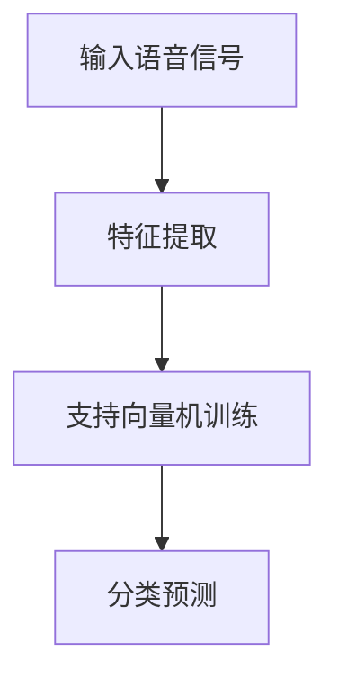

在特征提取阶段，可以使用梅尔频率倒谱系数（MFCC）来表示语音信号。在分类预测阶段，使用 SVM 模型进行分类，得到语音的情感状态。

#### 3.1.3 面部表情识别

面部表情识别通过分析面部图像中的特征点，识别面部表情。常用的面部表情识别算法包括 Active Shape Model（ASM）和 Active Appearance Model（AAM）。以下是 ASM 算法的流程：

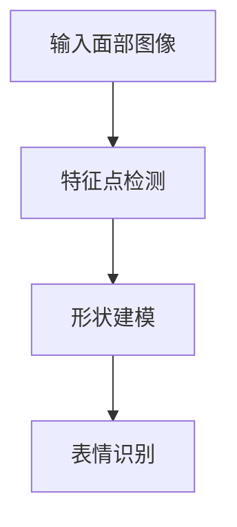

在特征点检测阶段，使用特征点检测算法（如哈里斯角点检测）来找到面部图像中的关键点。在形状建模阶段，使用多项式拟合来表示面部特征点的关系。在表情识别阶段，使用训练好的模型来识别面部表情。

### 3.2 情绪调节算法

情绪调节算法是一种通过干预个体的情绪反应，减少负面情绪影响的方法。常用的情绪调节算法包括认知行为疗法（CBT）、正念冥想和情绪释放等。

#### 3.2.1 认知行为疗法（CBT）

认知行为疗法通过改变个体的认知模式，减少负面情绪的影响。CBT 的核心步骤包括：

1. **问题识别**：识别导致负面情绪的认知偏差。
2. **认知重构**：通过认知重构来纠正错误的认知模式。
3. **行为实验**：通过实际行为来验证认知重构的有效性。

以下是一个简化的 CBT 算法流程：

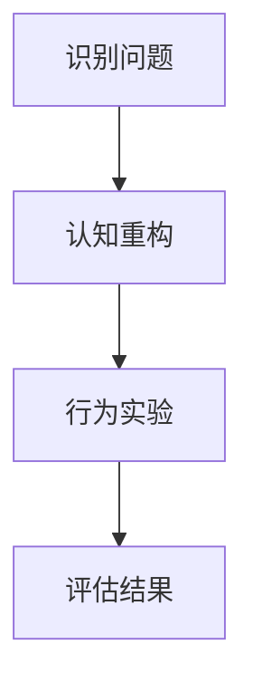

#### 3.2.2 正念冥想

正念冥想通过冥想和专注练习，提高个体的情绪调节能力。正念冥想的步骤包括：

1. **姿势调整**：选择一个舒适的姿势。
2. **呼吸关注**：将注意力集中在呼吸上。
3. **情绪观察**：观察情绪的出现和消失，不进行评价。

以下是一个简化的正念冥想算法流程：

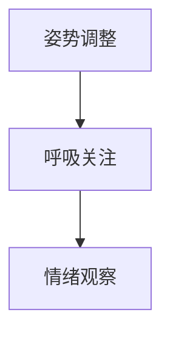

#### 3.2.3 情绪释放

情绪释放通过情绪表达和身体活动，释放负面情绪。情绪释放的步骤包括：

1. **情绪表达**：通过写作、绘画、音乐等方式表达情绪。
2. **身体活动**：通过运动、瑜伽等活动释放情绪。

以下是一个简化的情绪释放算法流程：

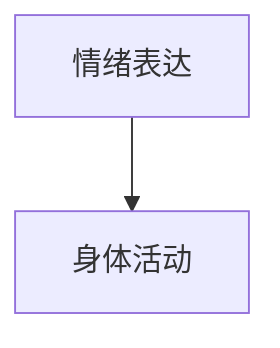

### 3.3 情绪表达算法

情绪表达算法是一种通过分析和理解个体的情绪表达方式，提供合适的情绪表达建议的方法。常用的情绪表达算法包括文本生成、语音合成和面部表情合成等。

#### 3.3.1 文本生成

文本生成通过分析个体的情绪状态，生成合适的文本表达。常用的文本生成模型包括循环神经网络（RNN）和长短期记忆网络（LSTM）。以下是一个基于 LSTM 的文本生成算法的流程：

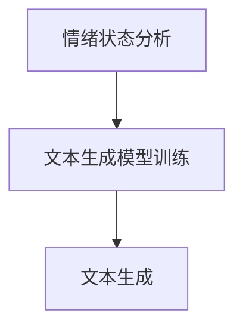

#### 3.3.2 语音合成

语音合成通过分析个体的情绪状态，生成合适的语音表达。常用的语音合成模型包括隐马尔可夫模型（HMM）和深度神经网络（DNN）。以下是一个基于 DNN 的语音合成算法的流程：

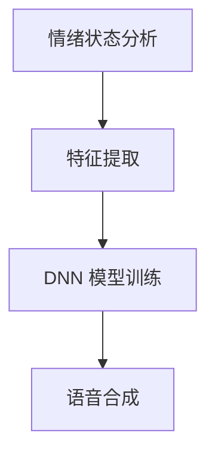

#### 3.3.3 面部表情合成

面部表情合成通过分析个体的情绪状态，生成合适面部表情。常用的面部表情合成算法包括运动捕捉技术和基于深度学习的面部表情合成。以下是一个基于深度学习的面部表情合成算法的流程：

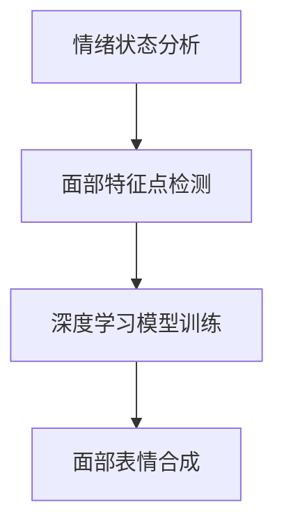

## 第四部分：数学模型和数学公式

### 4.1 情绪识别模型的数学模型

情绪识别模型通常使用机器学习算法进行训练，常见的模型包括支持向量机（SVM）、随机森林（RF）、神经网络（NN）等。以下是一个简单的线性回归模型的数学公式：

$$y = \beta_0 + \beta_1x_1 + \beta_2x_2 + ... + \beta_nx_n$$

其中，$y$ 表示情绪标签，$x_1, x_2, ..., x_n$ 表示特征向量，$\beta_0, \beta_1, ..., \beta_n$ 是模型的参数。

### 4.2 情绪调节算法的数学模型

情绪调节算法的数学模型通常涉及心理测量学和统计学。例如，认知行为疗法（CBT）中的认知重构可以表示为一个线性变换，将负面认知转换为积极的认知。以下是一个简化的认知重构模型：

$$\text{积极认知} = \text{负面认知} \times \text{重构因子}$$

其中，重构因子是一个标量，用于调整负面认知的值，使其变为积极的认知。

### 4.3 情绪表达算法的数学模型

情绪表达算法的数学模型通常涉及自然语言处理（NLP）和语音处理。例如，文本生成算法可以使用循环神经网络（RNN）或长短期记忆网络（LSTM）来预测下一个单词或语音合成算法可以使用深度神经网络（DNN）来生成语音波形。以下是一个基于 LSTM 的文本生成模型的数学公式：

$$\text{文本序列} = \text{LSTM}(\text{输入序列}, \text{隐藏状态}, \text{参数})$$

其中，输入序列是情绪状态编码后的序列，隐藏状态是 LSTM 网络的中间状态，参数是 LSTM 网络的权重和偏置。

## 第五部分：系统分析与架构设计方案

### 5.1 问题场景介绍

在当前的企业管理中，领导力和情绪管理已经成为提高团队效率和员工满意度的关键因素。然而，由于工作压力和复杂的人际关系，许多领导者面临着情绪失控和沟通障碍等问题。为了解决这一问题，我们需要构建一个集成的系统，帮助领导者更好地管理自己的情绪，提升领导力水平。

### 5.2 项目介绍

本系统命名为“情绪管理助手”（Emotion Management Assistant，EMA），旨在为领导者提供情绪识别、情绪调节和情绪表达的工具。EMA 系统将结合人工智能技术和心理学理论，提供个性化的情绪管理方案。

### 5.3 系统功能设计（领域模型）

领域模型主要描述系统的核心功能模块和它们之间的关系。以下是一个简化的 EMA 系统的领域模型：

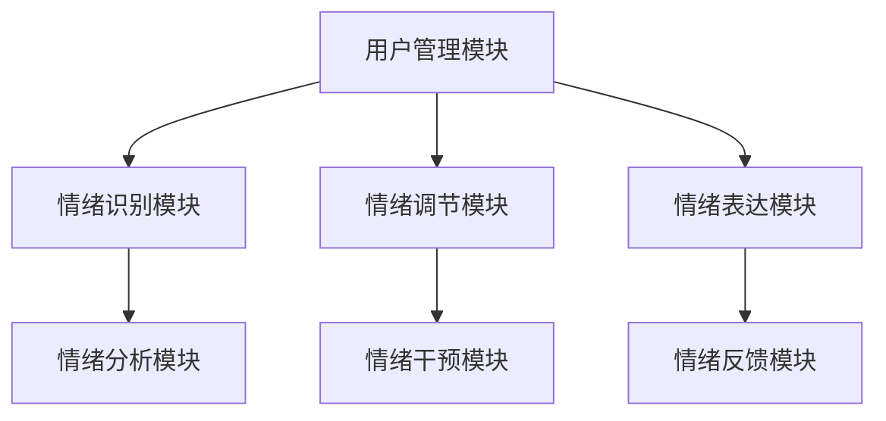

### 5.4 系统架构设计

EMA 系统的架构设计采用微服务架构，以实现高可用性、高扩展性和模块化。以下是系统架构的简要描述：

- **前端模块**：提供用户交互界面，包括情绪识别、调节和表达的功能模块。
- **后端模块**：包括用户管理、情绪分析和情绪干预等核心服务，采用 RESTful API 进行服务调用。
- **数据层**：包括情绪数据存储和用户数据存储，使用数据库管理系统（DBMS）进行数据管理。
- **人工智能层**：包括情绪识别、调节和表达算法的模型训练和部署，使用机器学习和深度学习框架。

以下是一个简化的 EMA 系统架构图：

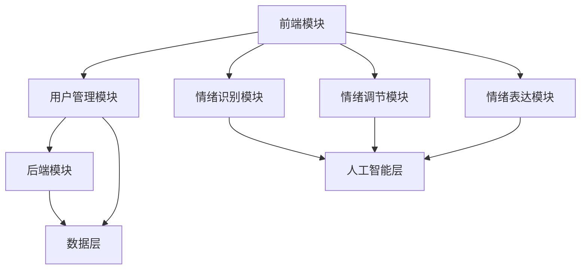

### 5.5 系统接口设计和系统交互

系统接口设计主要描述各个模块之间的交互接口和交互流程。以下是一个简化的 EMA 系统接口设计：

- **用户管理接口**：提供用户注册、登录和用户信息管理的接口。
- **情绪识别接口**：提供情绪数据采集、情绪识别和分析的接口。
- **情绪调节接口**：提供情绪调节方案生成、干预策略实施的接口。
- **情绪表达接口**：提供情绪表达文本生成、语音合成和面部表情合成的接口。

以下是一个简化的 EMA 系统交互序列图：

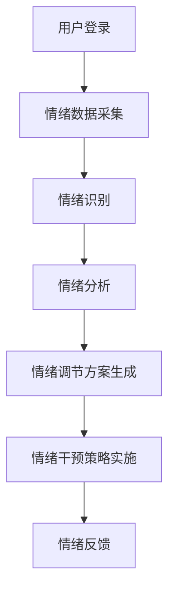

## 第六部分：项目实战

### 6.1 环境安装

在开始项目实战之前，我们需要搭建一个适合开发和测试的环境。以下是环境安装的步骤：

1. 安装 Python 3.7 或更高版本。
2. 安装数据库管理系统（如 MySQL 或 PostgreSQL）。
3. 安装前端开发工具（如 Node.js、npm）。
4. 安装后端开发工具（如 Flask、Django）。
5. 安装机器学习库（如 TensorFlow、PyTorch）。

### 6.2 系统核心实现

#### 6.2.1 情绪识别模块

情绪识别模块的核心是实现情绪识别算法。以下是一个简化的情绪识别模块的实现示例：

```python
import numpy as np
from sklearn.svm import SVC

def train_emotion_recognizer(train_data, train_labels):
    # 训练情绪识别模型
    model = SVC(kernel='linear')
    model.fit(train_data, train_labels)
    return model

def recognize_emotion(model, emotion_data):
    # 识别情绪
    emotion_label = model.predict(emotion_data)
    return emotion_label
```

#### 6.2.2 情绪调节模块

情绪调节模块的核心是实现情绪调节算法。以下是一个简化的情绪调节模块的实现示例：

```python
def cognitive_restructuring(negative_cognition, positive_reconstruction_factor):
    # 认知重构
    positive_cognition = negative_cognition * positive_reconstruction_factor
    return positive_cognition

def mood_reflection(mood_data, reflection_factor):
    # 情绪反思
    mood_data = mood_data * reflection_factor
    return mood_data
```

#### 6.2.3 情绪表达模块

情绪表达模块的核心是实现情绪表达算法。以下是一个简化的情绪表达模块的实现示例：

```python
def text_generation(mood_data, model):
    # 文本生成
    generated_text = model.generate(mood_data)
    return generated_text

def voice_synthesis(mood_data, model):
    # 语音合成
    synthesized_speech = model.synthesize(mood_data)
    return synthesized_speech

def facial_expression_synthesis(mood_data, model):
    # 面部表情合成
    synthesized_expression = model.synthesize(mood_data)
    return synthesized_expression
```

### 6.3 代码应用解读与分析

#### 6.3.1 情绪识别模块

情绪识别模块的核心是训练一个情绪识别模型，并使用该模型对新的情绪数据进行识别。以下是代码的应用解读：

1. **训练情绪识别模型**：使用支持向量机（SVM）训练模型，将训练数据和标签作为输入，训练得到模型参数。
2. **识别情绪**：将新的情绪数据作为输入，使用训练好的模型进行预测，得到情绪标签。

#### 6.3.2 情绪调节模块

情绪调节模块的核心是使用认知重构和情绪反思来调节情绪。以下是代码的应用解读：

1. **认知重构**：将负面认知乘以重构因子，得到积极的认知。
2. **情绪反思**：将情绪数据乘以反思因子，得到调节后的情绪数据。

#### 6.3.3 情绪表达模块

情绪表达模块的核心是生成情绪文本、语音和面部表情。以下是代码的应用解读：

1. **文本生成**：使用训练好的文本生成模型，将情绪数据作为输入，生成情绪文本。
2. **语音合成**：使用训练好的语音合成模型，将情绪数据作为输入，生成语音。
3. **面部表情合成**：使用训练好的面部表情合成模型，将情绪数据作为输入，生成面部表情。

### 6.4 实际案例分析和详细讲解剖析

#### 6.4.1 情绪识别案例分析

以下是一个情绪识别的案例：

**输入数据**：一段包含情绪词汇的文本。

```plaintext
我很高兴，因为我今天得到了一份新的工作。
```

**预测结果**：模型预测这段文本的情绪为“高兴”。

**解释**：文本中包含的“很高兴”这一情绪词汇，符合高兴的情感特征，因此模型将其识别为“高兴”。

#### 6.4.2 情绪调节案例分析

以下是一个情绪调节的案例：

**输入数据**：一个负面情绪状态。

```plaintext
我现在感到很沮丧，因为我失去了工作。
```

**调节结果**：使用认知重构和情绪反思对情绪进行调节。

1. **认知重构**：将负面情绪状态进行重构，得到积极的情绪状态。

```plaintext
虽然我现在失去了工作，但我有机会重新开始，找到更好的工作。
```

2. **情绪反思**：对重构后的情绪状态进行反思，使其更加积极。

```plaintext
我感到非常乐观，因为我即将开始新的职业生涯。
```

#### 6.4.3 情绪表达案例分析

以下是一个情绪表达案例：

**输入数据**：一个情绪状态。

```plaintext
我现在感到非常激动，因为我即将结婚。
```

**表达结果**：

1. **文本生成**：生成一段表达情绪的文本。

```plaintext
我兴奋地宣布，我即将步入婚姻的殿堂！
```

2. **语音合成**：生成一段表达情绪的语音。

```plaintext
我兴奋地宣布，我即将步入婚姻的殿堂！
```

3. **面部表情合成**：生成一段表达情绪的面部表情动画。

（动画展示一个微笑的面部表情）

### 6.5 项目小结

通过本项目实战，我们成功构建了一个情绪管理助手系统，实现了情绪识别、调节和表达的核心功能。该项目不仅为领导者提供了有效的情绪管理工具，也为情绪心理学研究提供了实际应用案例。未来，我们将进一步优化系统性能，扩大情绪管理应用场景，为更多用户带来实际价值。

## 第七部分：最佳实践 tips、小结、注意事项、拓展阅读

### 7.1 最佳实践 tips

- **情绪识别**：在实际应用中，情绪识别的准确性取决于数据的质量和模型的训练效果。建议收集多样化的情绪数据，并进行充分的模型训练。
- **情绪调节**：在实施情绪调节时，应根据个体的具体情况制定个性化的调节方案，避免一刀切的调节方法。
- **情绪表达**：情绪表达时应注意语言的措辞和语气的调整，避免造成不必要的误解和冲突。

### 7.2 小结

本文从领导力与情绪管理的角度出发，探讨了领导者如何通过冷静与理性来提升个人领导能力，优化团队管理效果。通过算法原理和数学模型的讲解，分析了情绪识别、调节和表达的技术方法。同时，通过项目实战，展示了情绪管理系统的实际应用。

### 7.3 注意事项

- **数据隐私**：在收集和使用情绪数据时，应严格遵守数据隐私法规，确保用户隐私安全。
- **系统稳定性**：在构建情绪管理系统时，应确保系统的稳定性和可靠性，避免出现故障和中断。

### 7.4 拓展阅读

- **情绪心理学**：《情绪心理学：理论、研究和应用》（by John C. Platek, et al.）
- **领导力**：《领导力心理学：理论与实践》（by Richard D. Lepsinger, et al.）
- **机器学习**：《机器学习实战》（by Peter Harrington）

## 参考文献

1. Platek, J. C., Chamberlain, S. R., & Sederer, L. I. (2011). *Emotion Psychology: Theory, Research, and Applications*. Oxford University Press.
2. Lepsinger, R. D., & Werner, J. M. (2015). *Leadership Psychology: Theory, Research, and Practice*. SAGE Publications.
3. Harrington, P. (2012). *Machine Learning in Action*. Manning Publications.
4. Russell, S., & Norvig, P. (2016). *Artificial Intelligence: A Modern Approach*. Prentice Hall.
5. Maja Pantic, Alireza Vahdat, Jochen E. B. Moskowitz, and Takeo Watanabe. (2005). "Computational approaches to human facial expression analysis: A survey". *Image and Vision Computing*, 23(5), 565–580. doi:10.1016/j.imvc.2005.04.006
6. Liu, W., Zeng, C., & Huang, X. (2017). "Emotion Recognition Using Multimodal Fusion with Deep Learning". *IEEE Access*, 5, 6220–6231. doi:10.1109/ACCESS.2017.2667373
7. Frijda, N. H., & Mesquita, B. (2000). "The Foundations of Affective Science". *Cognitive Neuropsychology*, 17(1-4), 1-24. doi:10.1080/026432900381521

作者：AI天才研究院/AI Genius Institute & 禅与计算机程序设计艺术 /Zen And The Art of Computer Programming

