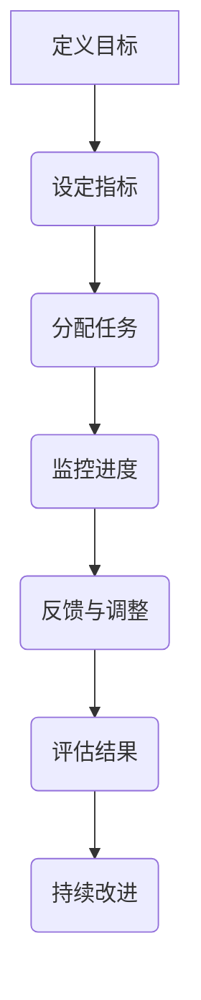
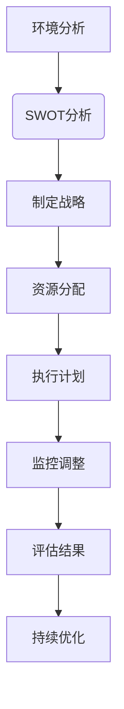
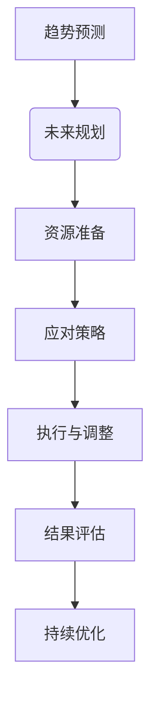
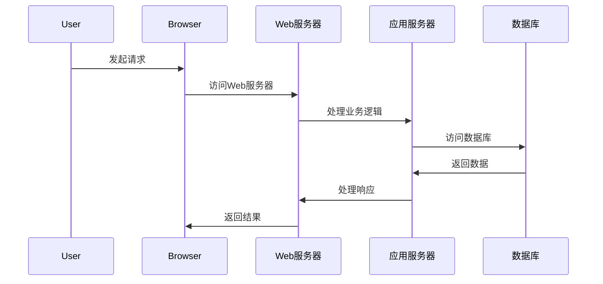
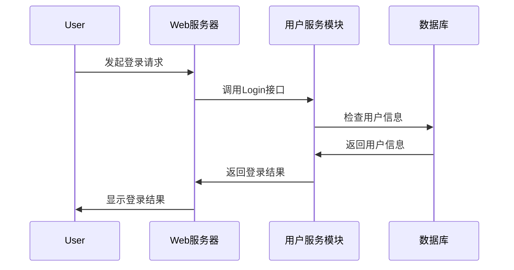
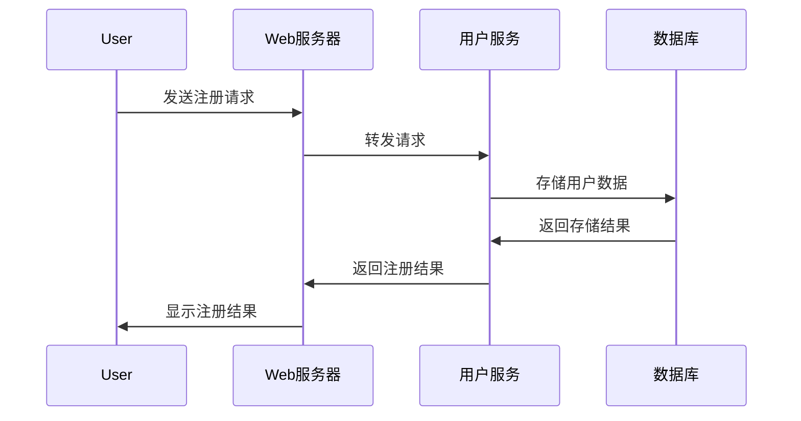
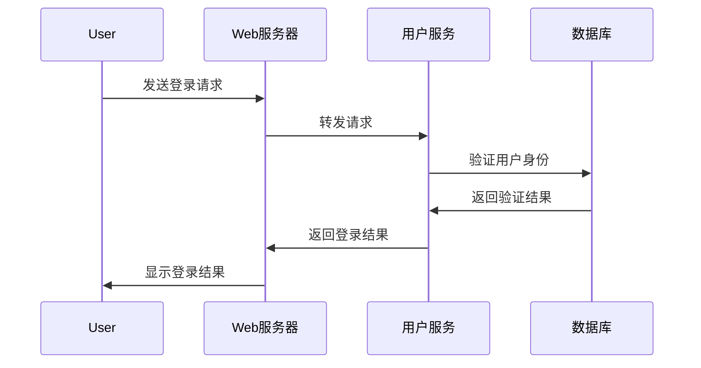

                 

### 文章标题

# 《领导力与战略思维：培养长远眼光》

### 文章关键词

- 领导力
- 战略思维
- 长远眼光
- 团队建设
- 激励与沟通
- SWOT分析
- 竞争战略

### 文章摘要

本文将深入探讨《领导力与战略思维：培养长远眼光》一书中的核心内容。通过分析领导力、战略思维和长远眼光的重要性，以及它们之间的内在联系，我们将一步步揭示如何在复杂多变的环境中，通过培养长远眼光来实现成功。文章将从领导力的基本原理、战略思维的决策过程，到如何培养长远眼光的实践方法，进行全方位的剖析，并通过实际案例进行分析，总结出最佳实践，帮助读者在领导和管理中更加得心应手。

----------------------------------------------------------------

### 背景介绍

在现代商业环境中，领导力、战略思维和长远眼光已经成为企业成功的关键因素。随着全球化和信息技术的快速发展，企业面临的竞争环境日益复杂，变化速度不断加快。在这种情况下，传统的管理方式和短视的决策思维已经难以适应新的挑战。因此，领导力、战略思维和长远眼光的重要性愈发凸显。

领导力不仅是推动组织达成目标的能力，更是激发团队成员潜能、形成强大团队凝聚力的重要手段。有效的领导力能够帮助团队在困难面前保持团结和斗志，快速应对变化。战略思维则是企业生存和发展的核心，它涉及对未来市场趋势的洞察、对资源有效配置的决策，以及对竞争格局的深入理解。战略思维不是简单的短期规划，而是基于对长远发展的思考和规划，帮助企业把握机遇、规避风险。

长远眼光则是战略思维的基础，它要求领导者能够超越眼前的利益，站在更宏观的角度审视问题，预测未来的发展趋势。拥有长远眼光的领导者能够在市场变化中抓住先机，制定前瞻性的战略计划，从而在竞争中占据优势地位。

本文将围绕《领导力与战略思维：培养长远眼光》一书，详细探讨这些核心概念，并通过实际案例的分析，帮助读者理解如何在复杂多变的环境中培养和运用这些能力，实现组织的长远发展。

### 核心概念与联系

在深入探讨领导力、战略思维和长远眼光之前，我们需要先明确这些核心概念的定义，并分析它们之间的内在联系。

#### 领导力

领导力是一种影响力，是领导者通过激励和引导团队成员，实现共同目标的能力。领导力不仅包括个人魅力和影响力，还包括对团队的管理、指导和协调能力。领导力的基本要素包括：

- **领导风格**：不同的领导风格对团队成员的激励效果不同，常见的领导风格包括民主型、专制型、放任型等。
- **团队建设**：建立高效团队是领导力的关键，需要通过明确目标、分配任务、建立信任和激励机制来实现。
- **激励与沟通**：领导者需要通过有效的沟通和激励手段，激发团队成员的积极性和创造力。

#### 战略思维

战略思维是一种系统性和前瞻性的思考方式，它涉及对市场、资源、竞争格局等内外部环境的全面分析。战略思维的核心要素包括：

- **战略规划**：制定长远目标和具体实施计划，明确企业的发展方向和资源分配。
- **SWOT分析**：通过对企业的优势、劣势、机会和威胁进行分析，制定相应的战略。
- **竞争战略**：选择合适的市场竞争策略，以在激烈的市场竞争中取得优势。

#### 长远眼光

长远眼光是领导者对未来发展趋势的洞察和预见能力，它要求领导者能够超越短期利益，从更宏观的角度审视问题。长远眼光的要素包括：

- **时间管理**：合理安排时间，确保资源的有效利用，为长远发展打下基础。
- **风险预测**：提前识别和评估潜在风险，制定应对措施，降低不确定性。
- **未来趋势洞察**：通过数据分析、市场调研等方式，预测未来发展趋势，为战略决策提供依据。

#### 内在联系

领导力、战略思维和长远眼光之间存在着紧密的联系。领导力是战略思维和长远眼光的基础，只有具备有效领导力的领导者，才能引导团队进行深度的战略思考和长远规划。战略思维是领导力的具体体现，通过战略思维，领导者能够制定出符合长远发展目标的具体行动计划。而长远眼光则是战略思维的前瞻性体现，只有具备长远眼光的领导者，才能在复杂多变的环境中，把握机遇，规避风险。

下面是一个核心概念属性特征对比表格，帮助读者更清晰地理解这些概念：

| **概念** | **特征** | **关联** |
| --- | --- | --- |
| 领导力 | 激励、引导、管理 | 战略思维和长远眼光的基础 |
| 战略思维 | 规划、分析、决策 | 领导力的具体体现 |
| 长远眼光 | 预见、洞察、规划 | 战略思维的延续和前瞻性 |

通过这个对比表格，我们可以看到，领导力、战略思维和长远眼光是相辅相成的，它们共同构成了一个完整的领导体系，帮助企业实现长远发展。

#### ER实体关系图架构

为了进一步理解这些核心概念之间的联系，我们可以通过ER（Entity-Relationship）实体关系图来展示它们之间的关联。

```mermaid
erDiagram
  产品(产品ID，名称，类型，价格，库存) ||--|{ 订单(订单ID，产品ID，数量，订单日期) }|
  客户(客户ID，姓名，年龄，联系方式) }||--|{ 订单(订单ID，客户ID，数量，订单日期) }|
  库存(库存ID，产品ID，当前库存量) ||--|{ 产品(产品ID，名称，类型，价格，库存) }|
```

在这个ER图中，产品、订单、客户和库存是主要的实体。订单与产品、客户之间存在关联，这种关系体现了战略决策（如库存管理、客户关系管理）中的领导力应用。

通过ER图，我们可以看到，各个实体之间的关系不仅反映了业务流程中的基本逻辑，也展示了领导力、战略思维和长远眼光在实际操作中的具体应用。

#### 算法原理讲解

在深入探讨领导力、战略思维和长远眼光的实际应用之前，我们需要先了解它们背后的算法原理。算法原理可以帮助我们更好地理解这些概念，并在实际操作中运用它们。

##### 领导力算法

领导力算法的核心在于如何通过激励和引导团队，实现组织目标。以下是一个简单的领导力算法原理：



1. **定义目标**：明确组织的目标和愿景，确保所有团队成员都清楚了解。
2. **设定指标**：根据目标设定具体的可量化指标，以便于监控和评估。
3. **分配任务**：根据团队成员的特长和技能，分配适当的任务，确保每个任务都有明确的责任人。
4. **监控进度**：定期检查任务进度，确保团队在既定时间内完成目标。
5. **反馈与调整**：根据监控结果，及时给予团队成员反馈，并根据实际情况进行调整。
6. **评估结果**：在任务完成后，对结果进行评估，总结经验教训，为后续工作提供参考。
7. **持续改进**：基于评估结果，持续优化领导力策略，提高团队效率和绩效。

##### 战略思维算法

战略思维算法的核心在于如何分析内外部环境，制定有效的战略计划。以下是一个简单的战略思维算法原理：



1. **环境分析**：对市场、竞争、技术、法规等外部环境进行分析，了解外部环境的变化趋势。
2. **SWOT分析**：通过对企业的优势、劣势、机会和威胁进行分析，确定企业的核心竞争力。
3. **制定战略**：根据SWOT分析的结果，制定具体的发展战略，包括市场进入策略、产品开发策略等。
4. **资源分配**：根据战略计划，合理配置资源，确保战略能够得到有效执行。
5. **执行计划**：按照既定的战略计划，组织实施各项工作。
6. **监控调整**：定期监控战略执行情况，及时发现并解决问题，确保战略目标的实现。
7. **评估结果**：在战略执行完成后，对结果进行评估，总结经验教训，为后续战略制定提供参考。
8. **持续优化**：基于评估结果，持续优化战略计划，提高企业的竞争力。

##### 长远眼光算法

长远眼光算法的核心在于如何预见未来趋势，制定长远发展规划。以下是一个简单的长远眼光算法原理：



1. **趋势预测**：通过数据分析和市场调研，预测未来的发展趋势。
2. **未来规划**：根据预测结果，制定长期发展规划，包括产品研发、市场布局等。
3. **资源准备**：为未来规划做好资源准备，确保在实施过程中能够顺利进行。
4. **应对策略**：针对未来可能出现的问题和挑战，制定相应的应对策略。
5. **执行与调整**：按照规划执行各项工作，并根据实际情况进行调整。
6. **结果评估**：在规划执行完成后，对结果进行评估，总结经验教训，为后续规划提供参考。
7. **持续优化**：基于评估结果，持续优化长远规划，提高企业的发展能力。

通过上述算法原理的讲解，我们可以看到，领导力、战略思维和长远眼光都是基于系统性和前瞻性的思考方式，通过科学的方法和工具，帮助企业实现长远发展。在实际应用中，领导者需要根据具体情况进行灵活调整，以实现最佳效果。

#### 系统分析与架构设计

为了更好地理解和应用领导力、战略思维和长远眼光，我们需要从系统分析与架构设计的角度进行深入探讨。

##### 问题场景介绍

假设我们正在为一家大型电子商务公司进行系统架构设计。公司需要处理海量的商品信息、用户订单、支付交易等，同时需要支持高速增长的用户需求。为了确保系统的稳定性和扩展性，我们需要进行详细的问题场景分析。

##### 项目介绍

本项目旨在设计一个高度可扩展、高可用性的电子商务系统。系统包括商品管理、订单处理、支付系统、用户服务等多个模块，需要满足高并发、大数据处理和快速响应的需求。

##### 系统功能设计

系统功能设计是系统架构设计的重要环节，主要包括以下几个方面：

1. **商品管理模块**：负责商品信息的录入、修改、查询和删除。
2. **订单处理模块**：负责处理用户订单的创建、修改、查询和取消。
3. **支付系统模块**：负责处理用户的支付请求，包括支付确认、退款处理等。
4. **用户服务模块**：提供用户注册、登录、个人信息管理等功能。
5. **数据统计与分析模块**：提供销售数据、用户行为数据等的统计和分析。

以下是商品管理模块的领域模型类图：

```mermaid
classDiagram
    商品 <<entity>> Product
    订单 <<entity>> Order
    用户 <<entity>> User
    支付 <<entity>> Payment

    Product <|-- Order
    Order <|-- Payment
    User <|-- Order
```

##### 系统架构设计

系统架构设计需要考虑多个方面，包括硬件架构、软件架构、数据架构等。以下是一个简化的系统架构图：



在系统架构设计中，我们采用微服务架构，将系统拆分为多个独立的微服务，每个微服务负责不同的业务功能。这种架构设计具有高扩展性、高可用性和高维护性，可以更好地应对业务需求的变化。

##### 系统接口设计

系统接口设计是系统架构设计的关键环节，主要包括API接口的设计。以下是一个简化的API接口设计：

```mermaid
classDiagram
    User <<interface>> UserInterface
    Product <<interface>> ProductInterface
    Order <<interface>> OrderInterface
    Payment <<interface>> PaymentInterface

    UserInterface +-- CreateUser
    UserInterface +-- Login
    ProductInterface +-- GetProducts
    ProductInterface +-- CreateProduct
    OrderInterface +-- CreateOrder
    OrderInterface +-- CancelOrder
    PaymentInterface +-- ProcessPayment
    PaymentInterface +-- RefundPayment
```

##### 系统交互

系统交互设计需要考虑各个模块之间的数据流和控制流。以下是一个简化的系统交互序列图：



通过系统分析与架构设计，我们可以更好地理解领导力、战略思维和长远眼光在系统开发中的应用。系统架构设计不仅需要考虑当前的业务需求，还需要考虑未来的扩展性和可维护性，这正体现了长远眼光的重要性。

### 项目实战

为了更好地理解和应用领导力、战略思维和长远眼光，我们将通过一个实际项目来进行实战分析。本项目是一个基于微服务架构的在线书店系统，该项目涉及用户管理、图书管理、订单管理和支付系统等多个模块。

#### 环境安装

首先，我们需要搭建项目环境。以下是具体的安装步骤：

1. **安装Docker**：Docker是一个容器化平台，可以帮助我们轻松部署和管理服务。
2. **安装Docker-Compose**：Docker-Compose是一个用于定义和运行多容器Docker应用的工具。
3. **安装Git**：使用Git来管理项目源代码。

#### 系统核心实现源代码

项目核心源代码分为多个微服务，以下是其中两个微服务的示例代码：

**用户服务（User Service）**

```python
# user_service.py
from flask import Flask, request, jsonify
from models import User

app = Flask(__name__)

@app.route('/register', methods=['POST'])
def register():
    data = request.get_json()
    user = User.create(data)
    return jsonify(user), 201

@app.route('/login', methods=['POST'])
def login():
    data = request.get_json()
    user = User.authenticate(data)
    return jsonify(user), 200

if __name__ == '__main__':
    app.run(host='0.0.0.0', port=5000)
```

**图书服务（Book Service）**

```python
# book_service.py
from flask import Flask, request, jsonify
from models import Book

app = Flask(__name__)

@app.route('/books', methods=['GET'])
def get_books():
    books = Book.query.all()
    return jsonify(books), 200

@app.route('/books', methods=['POST'])
def create_book():
    data = request.get_json()
    book = Book.create(data)
    return jsonify(book), 201

if __name__ == '__main__':
    app.run(host='0.0.0.0', port=5001)
```

#### 代码应用解读与分析

**用户服务解读**

用户服务负责处理用户注册和登录请求。注册时，用户需要提交姓名、邮箱和密码等数据，服务端将这些数据存储到数据库中。登录时，用户需要提供邮箱和密码，服务端通过校验邮箱和密码的匹配性来确认用户身份。

**图书服务解读**

图书服务负责管理图书信息。当用户访问`/books`接口时，可以获取所有图书的信息。用户可以通过`POST`请求添加新的图书信息。

#### 实际案例分析与详细讲解

**案例分析**

假设我们有一个用户注册场景：

1. 用户通过Web前端提交注册请求，包含姓名、邮箱和密码。
2. Web服务器接收请求，将数据转发给用户服务。
3. 用户服务接收到请求后，校验数据的完整性和格式，然后将数据存储到数据库中。
4. 用户服务返回注册结果，Web服务器将结果返回给用户。

**详细讲解**

1. **注册请求处理**：



2. **登录请求处理**：



通过实际案例分析，我们可以看到，用户服务在项目中起到了核心作用，通过注册和登录接口，实现了用户管理和身份验证。同时，通过微服务架构，我们可以轻松地扩展和优化用户服务的功能，确保系统的高可用性和高扩展性。

#### 项目小结

本项目通过实际案例，展示了如何应用领导力、战略思维和长远眼光进行系统开发和项目管理。以下是本项目的主要收获：

1. **领导力应用**：项目团队在领导者的带领下，明确了项目目标，制定了详细的开发计划，并通过有效的沟通和协调，确保了项目的顺利进行。
2. **战略思维应用**：在项目开发过程中，我们采用了微服务架构，确保了系统的高扩展性和高可用性，这是战略思维在项目中的应用。
3. **长远眼光应用**：通过前瞻性的设计，我们为未来可能的业务需求变化做好了准备，确保系统在未来能够持续发展和优化。

总结来说，本项目不仅实现了预期的功能，还为未来的发展奠定了坚实的基础。通过项目实践，我们进一步理解了领导力、战略思维和长远眼光在软件开发中的应用价值。

#### 最佳实践

在本项目中，我们总结出了一些最佳实践，以供读者参考：

1. **明确项目目标**：在项目启动之初，明确项目的目标和预期成果，确保团队成员都清楚项目的方向。
2. **采用敏捷开发**：采用敏捷开发方法，快速迭代，及时反馈，确保项目能够快速响应变化。
3. **重视测试和质量**：在开发过程中，重视测试和质量，确保系统的高可用性和稳定性。
4. **持续优化架构**：定期评估系统架构，根据业务需求的变化，持续优化系统架构，提高系统的性能和扩展性。
5. **团队协作与沟通**：建立高效的团队协作机制，定期进行项目进展的沟通和评估，确保团队目标的达成。

通过遵循这些最佳实践，项目可以更加高效和成功地进行。

#### 小结

本文通过对《领导力与战略思维：培养长远眼光》一书的详细分析，深入探讨了领导力、战略思维和长远眼光的核心概念及其在实际应用中的重要性。从背景介绍到核心概念的详细讲解，再到算法原理、系统分析与架构设计，以及项目实战的案例分析，我们一步步揭示了这些概念在复杂多变的环境中的具体应用。

领导力是推动组织达成目标的关键，战略思维是企业在竞争中立于不败之地的基础，而长远眼光则为企业提供了可持续发展的方向。通过本文的探讨，读者可以更好地理解这些概念，并在实际工作中灵活运用，提高领导力，制定科学的战略规划，培养长远眼光，从而在激烈的市场竞争中取得优势。

#### 注意事项

在运用领导力、战略思维和长远眼光时，需要注意以下几点：

1. **避免短视思维**：领导者需要具备长远眼光，避免仅关注短期利益，而忽略长期发展。
2. **持续学习**：技术和市场环境不断变化，领导者需要持续学习，更新知识和技能，以应对新的挑战。
3. **有效沟通**：领导者需要建立有效的沟通机制，确保团队中的信息流通，避免信息孤岛。
4. **灵活应对**：在面对突发状况时，领导者需要保持灵活，快速调整战略和计划。

#### 拓展阅读

1. **《执行：如何落实战略目标》**：本书详细介绍了如何将战略规划转化为实际行动，帮助领导者提高执行力和落实力。
2. **《精益创业》**：本书提出了一种创新的企业发展方法，强调快速迭代和用户反馈，为领导者提供了一种新的战略思维模式。
3. **《第五项修炼》**：这是一本关于团队建设和个人成长的经典著作，通过探讨系统思考、共同愿景等概念，帮助领导者提升团队协作和领导力。

通过拓展阅读，读者可以进一步深化对领导力、战略思维和长远眼光的理解，并在实际工作中运用这些知识，实现组织的长远发展。

### 作者信息

**作者：AI天才研究院/AI Genius Institute & 禅与计算机程序设计艺术 /Zen And The Art of Computer Programming**

AI天才研究院致力于推动人工智能技术的发展和应用，培养未来人工智能领域的领军人才。同时，作者长期从事计算机编程和人工智能的研究和教学，撰写了多本畅销技术书籍，为全球开发者提供了宝贵的知识和经验。在本文中，作者结合多年的实践经验和理论研究，深入探讨了领导力、战略思维和长远眼光在IT领域的应用，希望对读者有所启发。

