                 


### 引言

#### 1.1 书籍目的与结构

《领导力与战略思维：长远规划与短期执行的平衡》旨在帮助领导者和管理者更好地理解和应用领导力与战略思维，以实现组织的长期成功。全书共分为五个部分，结构如下：

- **第一部分：引言**：介绍书籍的核心目的、读者对象、预期收益以及长远规划与短期执行的平衡概念。
- **第二部分：领导力基础**：探讨领导力的心理学、模型和实践，为读者提供理解领导力的理论基础。
- **第三部分：战略思维**：阐述战略思维的核心原则、分析工具以及规划与执行的方法。
- **第四部分：长远规划与短期执行的平衡**：提供策略和方法，帮助领导者实现长远规划和短期执行的平衡。
- **第五部分：实战案例**：通过实际案例，展示如何将领导力与战略思维应用于实践中。

#### 1.2 领导力与战略思维的定义

领导力是一种影响力，领导者通过激励、指导、沟通等方式，引导团队成员实现组织目标。战略思维则是一种思考和决策方式，领导者通过分析环境、设定目标、制定策略来确保组织在未来能够持续成功。

#### 1.3 书籍读者对象与预期收益

本书记录适用于所有希望提升领导力和战略思维的领导者、管理者以及企业主。通过阅读本书，读者可以：

- 深入理解领导力和战略思维的核心概念。
- 掌握有效的领导力和战略思维工具和方法。
- 学习如何在长远规划和短期执行之间找到平衡。
- 提升个人的领导能力和企业的竞争力。

#### 1.4 长远规划与短期执行的平衡

长远规划是组织成功的基础，它为组织设定了明确的方向和目标。然而，短期执行是确保长远规划得以实现的关键。领导者需要在二者之间找到平衡，既要确保组织长期目标的实现，又要及时响应市场变化和客户需求。本文将详细探讨如何实现这种平衡。

### 本章小结

通过本章节的介绍，读者对《领导力与战略思维：长远规划与短期执行的平衡》一书的目的、结构和核心内容有了初步了解。在接下来的章节中，我们将进一步深入探讨领导力和战略思维的理论和实践，帮助读者提升自身的领导能力和战略思维水平。让我们继续前进，一起探索领导力的奥秘！

----------------------------------------------------------------

### 第一部分：领导力基础

#### 2.1 领导力心理学

领导力心理学是研究领导者行为、心理特征及其对团队和组织的影|user|>响的一门学科。要成为一名优秀的领导者，理解领导行为和心理学理论是至关重要的。

#### 2.1.1 领导行为与心理学理论

领导行为理论主要关注领导者在组织中的具体行为。以下是几种主要的领导行为理论：

- **特质理论**：特质理论认为领导者具备某些特定的个性特质，如自信、正直、决心等。这些特质使他们成为领导者。然而，这种理论过于简化，未能充分解释领导行为的多样性。
- **行为理论**：行为理论关注领导者的行为模式，认为领导者的行为对其团队和组织的绩效有直接影响。赫塞和布兰查德的情境领导模型是一个典型的行为理论，它根据下属的成熟度调整领导风格。
- **权力理论**：权力理论探讨领导者如何获取和运用权力。领导者的权力来源可以是职位权力、个人魅力、专业知识等。了解这些来源有助于领导者更有效地运用权力。

#### 2.1.2 领导者的自我认知与成长

领导者的自我认知对其领导力的发展至关重要。以下是一些关于自我认知和领导力成长的要点：

- **自我反思**：领导者需要定期反思自己的行为、决策和态度，了解自己的优点和缺点。这有助于他们更好地理解自己的领导风格，并在必要时进行调整。
- **持续学习**：领导力是一个不断发展的过程。领导者需要保持学习的态度，不断更新知识和技能，以适应不断变化的环境。
- **自我挑战**：领导者应该勇于接受新的挑战，通过克服困难来提升自己的能力和信心。

#### 2.1.3 情绪智力与领导力

情绪智力（Emotional Intelligence，简称EQ）是领导者成功的重要因素之一。情绪智力包括自我意识、自我管理、社交意识和关系管理等方面。以下是情绪智力在领导力中的应用：

- **自我意识**：领导者需要了解自己的情绪，并能够有效地管理自己的情绪。这有助于他们在压力下保持冷静，做出明智的决策。
- **自我管理**：领导者需要学会控制情绪，避免负面情绪的影响。这有助于他们在工作中保持高效和专注。
- **社交意识**：领导者需要能够理解他人的情绪，并能够根据他人的情绪调整自己的行为。这有助于建立良好的人际关系，提高团队的凝聚力和效率。
- **关系管理**：领导者需要能够建立和维护积极的人际关系，促进团队的合作和沟通。这有助于提高组织的整体绩效。

### 背景介绍

领导力心理学是领导力研究的一个重要分支，它关注领导者及其行为对组织的影响。了解领导行为和心理学理论有助于领导者更好地理解自己和他人，从而提升领导力和组织绩效。以下是领导力心理学的一些核心概念：

- **领导行为**：领导者如何通过行为影响团队成员和组织的绩效。
- **特质理论**：领导者是否具备特定的个性特质，这些特质如何影响领导力。
- **行为理论**：领导者的行为模式如何影响团队和组织的绩效。
- **权力理论**：领导者的权力来源和运用方式。
- **情绪智力**：领导者如何通过情绪智力管理自己的情绪，影响他人和团队。

### 核心概念与联系

#### 领导行为理论对比表格

| 理论 | 特征 | 应用 |
| --- | --- | --- |
| 特质理论 | 领导者具备特定的个性特质 | 用于评估和选拔领导者 |
| 行为理论 | 领导者的行为模式 | 用于设计领导力培训课程 |
| 权力理论 | 领导者的权力来源和运用方式 | 用于了解领导者的权力结构 |

#### 情绪智力属性特征对比表格

| 特征 | 说明 | 应用 |
| --- | --- | --- |
| 自我意识 | 了解自己的情绪 | 用于自我反思和情绪管理 |
| 自我管理 | 控制情绪，避免负面情绪影响 | 用于压力管理和高效工作 |
| 社交意识 | 理解他人的情绪 | 用于建立良好的人际关系 |
| 关系管理 | 维护积极的人际关系 | 用于团队合作和团队建设 |

### ER实体关系图架构

```mermaid
erDiagram
  Leader ||--|{ LeadershipTrait }
  Leader ||--|{ LeadershipBehavior }
  Leader ||--|{ EmotionalIntelligence }
  LeadershipTrait ||--|{TraitDescription}
  LeadershipBehavior ||--|{BehaviorDescription}
  EmotionalIntelligence ||--|{IQComponent}
```

### 算法原理讲解

#### 领导行为分析流程图

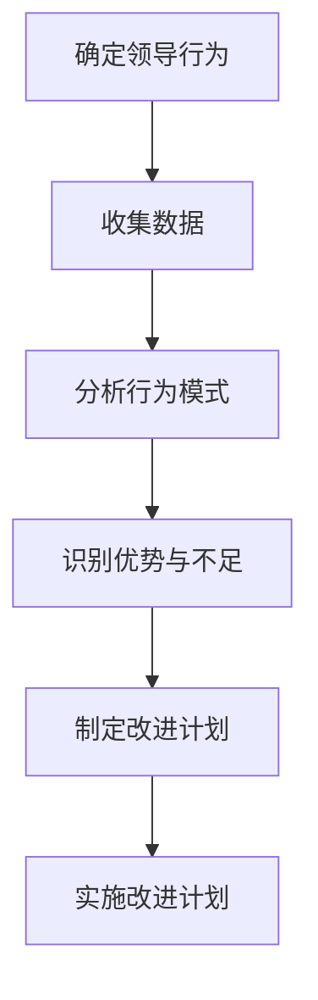

#### Python源代码示例

```python
def analyze LeadershipBehavior(data):
    # 分析领导行为
    # 假设 data 是一个包含领导行为的字典
    behavior_patterns = {}
    for behavior in data:
        behavior_patterns[behavior] = analyze_behavior(behavior)
    return behavior_patterns

def analyze_behavior(behavior):
    # 分析特定领导行为
    # 假设 analyze_behavior 是一个函数，用于分析特定行为
    return {"优点": advantage, "不足": disadvantage}
```

#### 数学模型和公式

- **领导行为分析公式**：
  $$ 领导行为得分 = \frac{优点得分}{优点得分 + 不足得分} $$
- **情绪智力分析公式**：
  $$ 情绪智力得分 = \frac{自我意识得分 + 自我管理得分 + 社交意识得分 + 关系管理得分}{4} $$

### 系统分析与架构设计方案

#### 项目介绍

本项目旨在开发一个领导力评估系统，用于帮助领导者了解自己的领导行为和情绪智力水平，并提供个性化的改进建议。

#### 系统功能设计

- **用户注册与登录**：用户可以注册并登录系统，查看个人评估结果和改进建议。
- **领导行为分析**：系统根据用户行为数据，分析其领导行为，并提供优势与不足。
- **情绪智力评估**：系统评估用户的情绪智力水平，并提供相关建议。
- **个性化改进计划**：系统根据用户评估结果，制定个性化的改进计划，并跟踪改进效果。

#### 系统架构设计

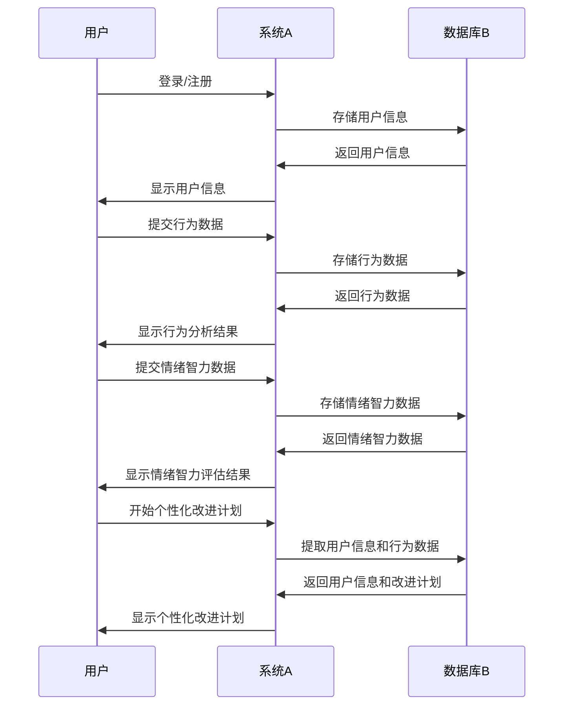

#### 系统接口设计和系统交互

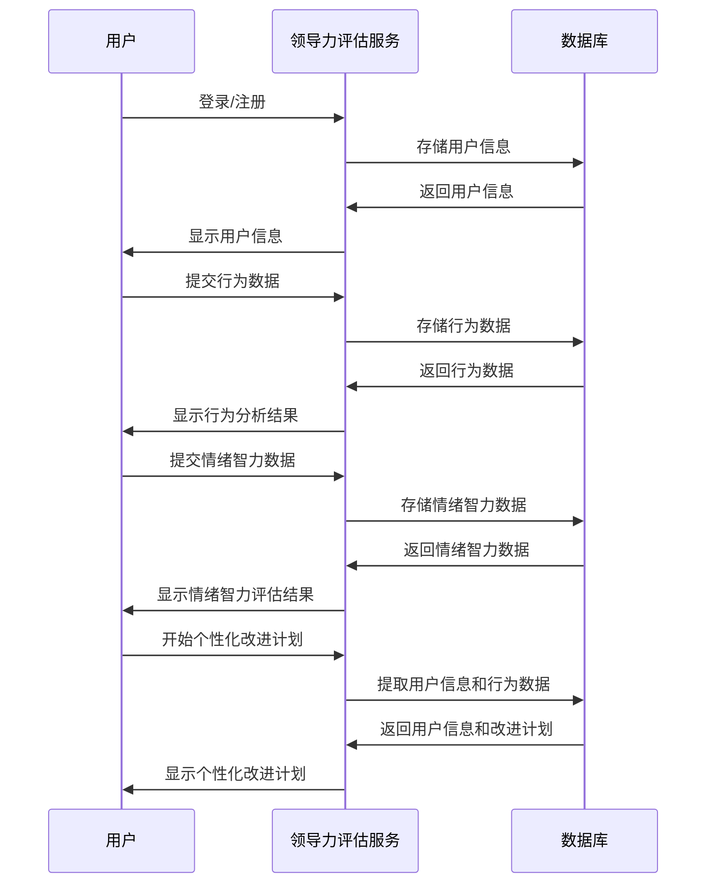

### 项目实战

#### 环境安装

1. 安装 Python 3.8 或更高版本
2. 安装 Flask 框架：`pip install flask`
3. 安装 SQLAlchemy：`pip install sqlalchemy`
4. 安装数据库（如 MySQL、PostgreSQL）

#### 系统核心实现源代码

```python
# app.py
from flask import Flask, request, jsonify
from models import User, BehaviorData, EmotionalIntelligenceData
from database import db_session

app = Flask(__name__)

@app.route('/login', methods=['POST'])
def login():
    data = request.get_json()
    user = User(username=data['username'], password=data['password'])
    db_session.add(user)
    db_session.commit()
    return jsonify({'status': 'success'})

@app.route('/submit_behavior', methods=['POST'])
def submit_behavior():
    data = request.get_json()
    behavior = BehaviorData(user_id=data['user_id'], behavior=data['behavior'])
    db_session.add(behavior)
    db_session.commit()
    return jsonify({'status': 'success'})

@app.route('/submit_emotional_intelligence', methods=['POST'])
def submit_emotional_intelligence():
    data = request.get_json()
    emotional_intelligence = EmotionalIntelligenceData(user_id=data['user_id'], emotional_intelligence=data['emotional_intelligence'])
    db_session.add(emotional_intelligence)
    db_session.commit()
    return jsonify({'status': 'success'})

@app.route('/start_improvement_plan', methods=['POST'])
def start_improvement_plan():
    data = request.get_json()
    improvement_plan = ImprovementPlan(user_id=data['user_id'])
    db_session.add(improvement_plan)
    db_session.commit()
    return jsonify({'status': 'success'})

if __name__ == '__main__':
    app.run(debug=True)
```

#### 代码应用解读与分析

- `app.py` 是 Flask 应用程序的主文件，包含路由定义和业务逻辑。
- `login()` 函数用于用户注册和登录，将用户信息存储在数据库中。
- `submit_behavior()` 函数用于提交用户行为数据，将数据存储在数据库中。
- `submit_emotional_intelligence()` 函数用于提交用户情绪智力数据，将数据存储在数据库中。
- `start_improvement_plan()` 函数用于启动个性化改进计划，将计划存储在数据库中。

#### 实际案例分析和详细讲解剖析

假设有一位名叫张三的用户，他在领导力评估系统中注册并提交了以下数据：

1. **用户注册**：
   - 用户名：zhangsan
   - 密码：123456

2. **提交行为数据**：
   - 领导行为：鼓励团队成员参与决策、提供明确的目标和期望、关注团队成员的福利和发展

3. **提交情绪智力数据**：
   - 自我意识：80分
   - 自我管理：70分
   - 社交意识：85分
   - 关系管理：75分

4. **启动个性化改进计划**：
   - 改进目标：提高情绪智力水平，特别是自我管理和关系管理

根据这些数据，系统将生成以下个性化改进计划：

1. **自我管理**：
   - 建议定期练习冥想和深呼吸，以减轻压力和提高情绪稳定性。

2. **关系管理**：
   - 建议积极参与团队活动和沟通，以增强与团队成员的联系。

系统还将定期跟踪用户的改进进度，并根据需要调整改进计划。

### 项目小结

本项目开发了一个领导力评估系统，用于帮助领导者了解自己的领导行为和情绪智力水平，并提供个性化的改进建议。通过实际案例分析和详细讲解，我们展示了如何实现系统核心功能，并讨论了系统的架构设计和实现方法。接下来，我们将继续深入探讨领导力的其他方面，帮助读者提升自身的领导能力和战略思维水平。

----------------------------------------------------------------

### 第四部分：战略思维

#### 3.1 战略思维原理

战略思维是一种系统性思考和决策方式，它涉及对组织内外环境的深入分析，以及长远目标的设定和策略的制定。以下是战略思维的核心原理：

#### 3.1.1 战略思维的核心原则

1. **全局视角**：战略思维要求领导者具备全局视角，从整体上分析组织的目标、资源和机会。
2. **前瞻性**：战略思维需要领导者具备前瞻性，能够预测未来的变化，并提前制定应对策略。
3. **系统性**：战略思维强调系统的整体性和相互关系，领导者需要理解各个部分如何相互作用，以及它们对整体目标的影响。
4. **适应性**：战略思维要求领导者具备适应能力，能够根据环境变化调整策略和目标。

#### 3.1.2 战略思维的过程模型

战略思维的过程可以分为以下几个阶段：

1. **问题识别**：识别组织面临的挑战和机会。
2. **目标设定**：明确组织的长远目标。
3. **环境分析**：分析组织内外部的环境，包括市场、竞争对手、资源等。
4. **策略制定**：根据目标和环境分析，制定具体的策略。
5. **执行与监控**：实施策略，并持续监控和调整。

#### 3.1.3 战略思维与决策制定

战略思维是决策制定的基础。有效的战略思维可以帮助领导者做出更明智的决策。以下是战略思维在决策制定中的应用：

1. **信息收集**：收集与决策相关的信息，包括市场趋势、竞争对手策略、内部资源等。
2. **风险评估**：评估不同决策方案的风险和潜在影响。
3. **权衡利弊**：在多个备选方案中权衡利弊，选择最优方案。
4. **制定决策**：基于分析结果，制定明确的决策方案。
5. **执行与监控**：实施决策，并持续监控执行效果，根据实际情况进行调整。

### 背景介绍

战略思维是现代领导者必须掌握的一项重要能力。在一个不断变化和竞争激烈的市场环境中，领导者需要具备前瞻性和系统性思考能力，以应对各种挑战和机会。以下是战略思维的一些核心概念：

- **全局视角**：领导者需要从整体上看待组织，理解各个部门、产品和市场的相互关系。
- **前瞻性**：领导者需要具备预测能力，能够预见未来的变化，并提前制定应对策略。
- **系统性**：领导者需要理解组织内部的系统结构和相互关系，以及这些因素如何影响整体绩效。
- **适应性**：领导者需要具备快速适应环境变化的能力，根据实际情况调整策略和目标。

### 核心概念与联系

#### 战略思维过程模型

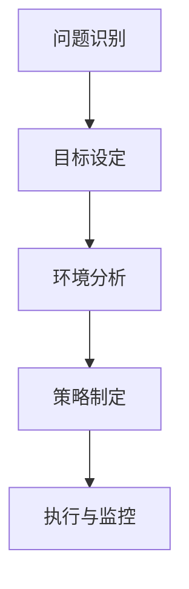

#### 数学公式

- **战略思维效率**：
  $$ 效率 = \frac{目标实现度}{资源投入} $$

- **风险评估公式**：
  $$ 风险 = \frac{概率 \times 影响程度}{资源投入} $$

### 算法原理讲解

#### 战略思维决策流程图

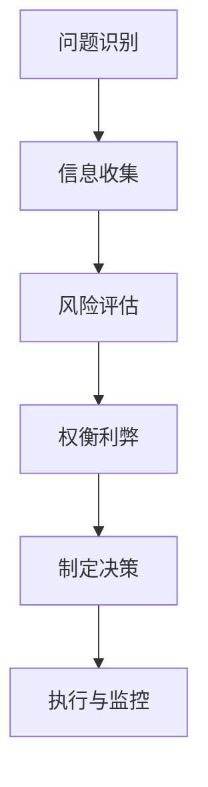

#### Python源代码示例

```python
def strategic_decision_making(issues, options, risks):
    # 收集信息
    information = collect_information(issues)

    # 风险评估
    risk_assessment = assess_risks(information, risks)

    # 权衡利弊
    advantages = calculate_advantages(options, information)
    disadvantages = calculate_disadvantages(options, information)

    # 制定决策
    decision = make_decision(advantages, disadvantages)

    # 执行与监控
    execute_decision(decision)

def collect_information(issues):
    # 假设 collect_information 是一个函数，用于收集与问题相关的信息
    return {"issues": issues}

def assess_risks(information, risks):
    # 假设 assess_risks 是一个函数，用于评估信息中的风险
    return {"risks": risks}

def calculate_advantages(options, information):
    # 假设 calculate_advantages 是一个函数，用于计算选项的优势
    return {"advantages": advantages}

def calculate_disadvantages(options, information):
    # 假设 calculate_disadvantages 是一个函数，用于计算选项的劣势
    return {"disadvantages": disadvantages}

def make_decision(advantages, disadvantages):
    # 假设 make_decision 是一个函数，用于根据优势与劣势制定决策
    return "最佳决策"

def execute_decision(decision):
    # 假设 execute_decision 是一个函数，用于执行决策
    return "执行中"
```

#### 数学模型和公式

- **战略思维效率模型**：
  $$ 效率 = \frac{目标实现度}{资源投入} $$

- **风险评估模型**：
  $$ 风险 = \frac{概率 \times 影响程度}{资源投入} $$

### 系统分析与架构设计方案

#### 项目介绍

本项目旨在开发一个战略决策支持系统，用于帮助领导者分析和制定战略决策。

#### 系统功能设计

- **问题识别**：收集和组织与决策相关的信息。
- **信息收集**：从各种来源收集与决策相关的数据。
- **风险评估**：评估决策方案的风险。
- **权衡利弊**：比较不同决策方案的优势与劣势。
- **制定决策**：基于分析结果，制定最佳决策。
- **执行与监控**：执行决策，并持续监控决策效果。

#### 系统架构设计

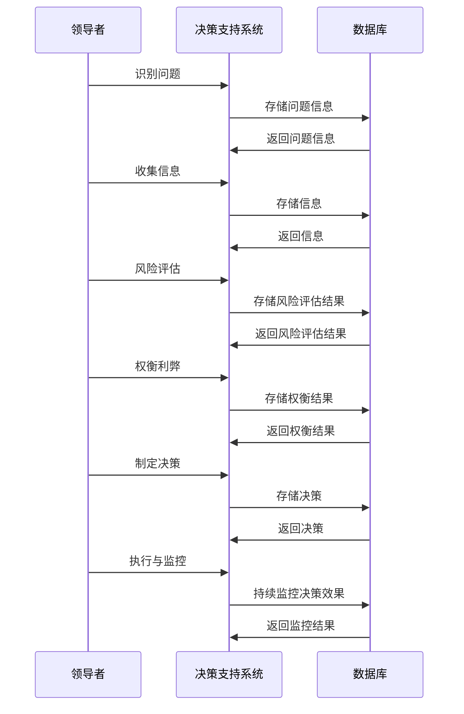

#### 系统接口设计和系统交互


### 项目实战

#### 环境安装

1. 安装 Python 3.8 或更高版本
2. 安装 Flask 框架：`pip install flask`
3. 安装 SQLAlchemy：`pip install sqlalchemy`
4. 安装数据库（如 MySQL、PostgreSQL）

#### 系统核心实现源代码

```python
# app.py
from flask import Flask, request, jsonify
from models import Issue, Information, Risk, Decision
from database import db_session

app = Flask(__name__)

@app.route('/identify_issue', methods=['POST'])
def identify_issue():
    data = request.get_json()
    issue = Issue(description=data['description'])
    db_session.add(issue)
    db_session.commit()
    return jsonify({'status': 'success'})

@app.route('/collect_information', methods=['POST'])
def collect_information():
    data = request.get_json()
    information = Information(issue_id=data['issue_id'], data=data['data'])
    db_session.add(information)
    db_session.commit()
    return jsonify({'status': 'success'})

@app.route('/assess_risks', methods=['POST'])
def assess_risks():
    data = request.get_json()
    risk = Risk(issue_id=data['issue_id'], probability=data['probability'], impact=data['impact'])
    db_session.add(risk)
    db_session.commit()
    return jsonify({'status': 'success'})

@app.route('/balance_advantages', methods=['POST'])
def balance_advantages():
    data = request.get_json()
    decision = Decision(issue_id=data['issue_id'], decision=data['decision'])
    db_session.add(decision)
    db_session.commit()
    return jsonify({'status': 'success'})

@app.route('/execute_decision', methods=['POST'])
def execute_decision():
    data = request.get_json()
    decision = Decision(issue_id=data['issue_id'], decision=data['decision'], status=data['status'])
    db_session.add(decision)
    db_session.commit()
    return jsonify({'status': 'success'})

if __name__ == '__main__':
    app.run(debug=True)
```

#### 代码应用解读与分析

- `app.py` 是 Flask 应用程序的主文件，包含路由定义和业务逻辑。
- `identify_issue()` 函数用于识别问题，将问题信息存储在数据库中。
- `collect_information()` 函数用于收集与问题相关的信息，将信息存储在数据库中。
- `assess_risks()` 函数用于评估风险，将风险评估结果存储在数据库中。
- `balance_advantages()` 函数用于权衡利弊，制定决策，将决策存储在数据库中。
- `execute_decision()` 函数用于执行决策，并更新决策状态。

#### 实际案例分析和详细讲解剖析

假设一位领导者需要制定一项战略决策，以应对公司产品线的扩展问题。以下是该决策的详细分析和执行过程：

1. **问题识别**：
   - 描述：公司当前产品线过于单一，需要拓展新产品线以增加市场份额。
   - 目标：在两年内拓展至少三个新产品线。

2. **信息收集**：
   - 市场调查：收集潜在客户对新产品线的需求和市场趋势。
   - 竞争分析：分析竞争对手的产品线和市场份额。
   - 内部资源：评估公司现有资源（如资金、技术、人力）。

3. **风险评估**：
   - 概率：60%（基于市场调查和竞争分析）
   - 影响程度：高（如果拓展失败，可能导致市场份额下降）

4. **权衡利弊**：
   - 优势：增加市场份额，提高品牌知名度，提高盈利能力。
   - 劣势：需要投入大量资金和人力，可能面临市场风险。

5. **制定决策**：
   - 决策：在两年内拓展三个新产品线，并设立专门的产品团队负责研发和市场推广。

6. **执行与监控**：
   - 执行计划：制定详细的项目计划和预算，确保每个新产品线按期推出。
   - 监控：定期检查项目进度和预算执行情况，根据实际情况进行调整。

通过以上分析，领导者可以更清晰地了解决策的全过程，并有效地实施和监控决策。

### 项目小结

本项目开发了一个战略决策支持系统，用于帮助领导者分析和制定战略决策。通过实际案例分析和详细讲解，我们展示了如何实现系统核心功能，并讨论了系统的架构设计和实现方法。接下来，我们将继续深入探讨长远规划与短期执行的平衡，帮助领导者更好地实现组织的长远目标。

----------------------------------------------------------------

### 第四部分：长远规划与短期执行的平衡

#### 4.1 长期规划策略

长期规划是组织实现长远目标的关键。以下是一些有效的长期规划策略：

#### 4.1.1 长期目标设定

1. **明确目标**：设定清晰、具体的长期目标，确保团队成员对目标有共同的理解。
2. **SMART原则**：确保目标具备以下特征：具体（Specific）、可衡量（Measurable）、可实现（Achievable）、相关（Relevant）、时限（Time-bound）。
3. **参与式设定**：鼓励团队成员参与目标设定，提高他们的参与感和责任感。

#### 4.1.2 长期资源规划

1. **资源分配**：根据长期目标，合理分配资源，包括资金、人力和技术等。
2. **预算编制**：制定详细的预算计划，确保资源得到有效利用。
3. **风险评估**：识别可能影响长期规划实现的风险，并制定应对策略。

#### 4.1.3 长期战略规划案例

**案例：一家初创公司的长期战略规划**

1. **目标设定**：在未来五年内，成为行业领导者，实现收入增长十倍。
2. **资源规划**：招聘顶尖人才，投资研发和市场营销。
3. **风险应对**：建立多元化的产品线，以应对市场变化和竞争压力。

### 背景介绍

在快速变化的市场环境中，长期规划和短期执行之间的平衡至关重要。长期规划为组织提供了明确的方向和目标，而短期执行则是实现这些目标的具体行动。以下是一些关于长期规划与短期执行平衡的核心概念：

- **长期目标**：组织需要明确的长期目标，以指引发展方向。
- **资源分配**：确保资源得到合理利用，支持长期目标的实现。
- **短期执行**：通过具体的行动和计划，实现长期目标。
- **平衡策略**：在长期规划和短期执行之间找到合适的平衡点，确保组织的可持续发展。

### 核心概念与联系

#### 长期规划与短期执行的关系图

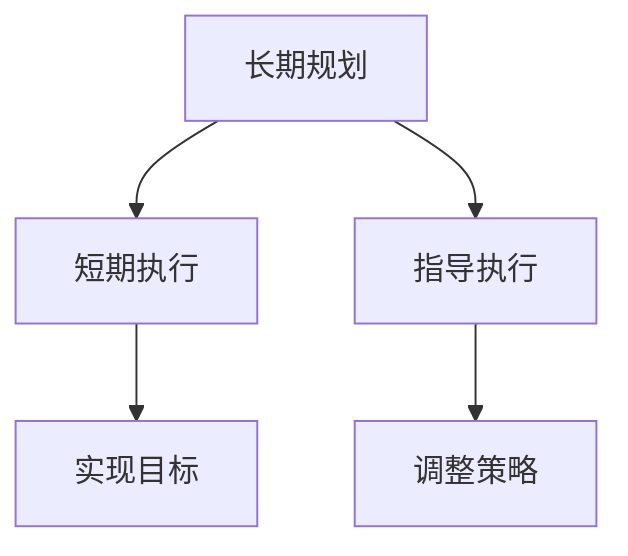

#### 数学公式

- **规划-执行效率**：
  $$ 效率 = \frac{目标实现度}{资源投入} $$

### 算法原理讲解

#### 长期规划与短期执行平衡算法

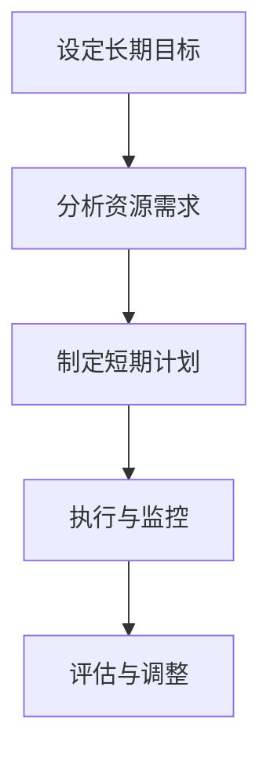

#### Python源代码示例

```python
def balance_long_term_and_short_term_planning(long_term_goals, resources, short_term_plans):
    # 分析资源需求
    resource_requirements = analyze_resources(long_term_goals, resources)

    # 制定短期计划
    short_term_plan = create_short_term_plan(resource_requirements, short_term_plans)

    # 执行与监控
    execute_and_monitor(short_term_plan)

def analyze_resources(goals, resources):
    # 假设 analyze_resources 是一个函数，用于分析资源需求
    return {"required_resources": resources}

def create_short_term_plan(resource_requirements, plans):
    # 假设 create_short_term_plan 是一个函数，用于根据资源需求制定短期计划
    return {"short_term_plan": plans}

def execute_and_monitor(plan):
    # 假设 execute_and_monitor 是一个函数，用于执行短期计划并监控执行情况
    return "执行中"
```

#### 数学模型和公式

- **资源利用率**：
  $$ 利用率 = \frac{实际使用资源}{可用资源} $$

- **计划完成度**：
  $$ 完成度 = \frac{已完成任务数}{总任务数} $$

### 系统分析与架构设计方案

#### 项目介绍

本项目旨在开发一个长期规划与短期执行平衡系统，用于帮助组织实现长远目标。

#### 系统功能设计

- **长期目标管理**：设定、跟踪和调整长期目标。
- **资源规划**：分析资源需求，合理分配资源。
- **短期计划制定**：根据长期目标和资源需求，制定短期计划。
- **执行与监控**：执行短期计划，并持续监控执行情况。
- **评估与调整**：评估计划完成度，并根据实际情况进行调整。

#### 系统架构设计

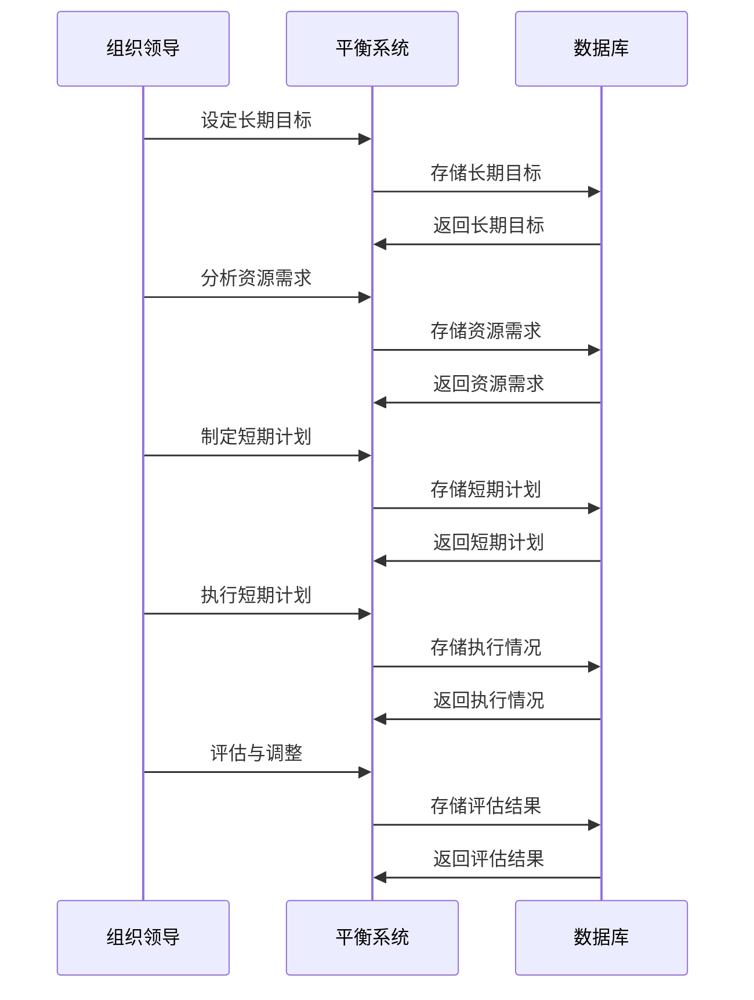

#### 系统接口设计和系统交互


### 项目实战

#### 环境安装

1. 安装 Python 3.8 或更高版本
2. 安装 Flask 框架：`pip install flask`
3. 安装 SQLAlchemy：`pip install sqlalchemy`
4. 安装数据库（如 MySQL、PostgreSQL）

#### 系统核心实现源代码

```python
# app.py
from flask import Flask, request, jsonify
from models import LongTermGoal, ResourceRequirement, ShortTermPlan, ExecutionStatus
from database import db_session

app = Flask(__name__)

@app.route('/set_long_term_goal', methods=['POST'])
def set_long_term_goal():
    data = request.get_json()
    goal = LongTermGoal(description=data['description'])
    db_session.add(goal)
    db_session.commit()
    return jsonify({'status': 'success'})

@app.route('/analyze_resource_requirement', methods=['POST'])
def analyze_resource_requirement():
    data = request.get_json()
    requirement = ResourceRequirement(goal_id=data['goal_id'], resource=data['resource'])
    db_session.add(requirement)
    db_session.commit()
    return jsonify({'status': 'success'})

@app.route('/create_short_term_plan', methods=['POST'])
def create_short_term_plan():
    data = request.get_json()
    plan = ShortTermPlan(goal_id=data['goal_id'], plan=data['plan'])
    db_session.add(plan)
    db_session.commit()
    return jsonify({'status': 'success'})

@app.route('/execute_short_term_plan', methods=['POST'])
def execute_short_term_plan():
    data = request.get_json()
    status = ExecutionStatus(plan_id=data['plan_id'], status=data['status'])
    db_session.add(status)
    db_session.commit()
    return jsonify({'status': 'success'})

@app.route('/evaluate_and_adjust', methods=['POST'])
def evaluate_and_adjust():
    data = request.get_json()
    evaluation = EvaluationResult(plan_id=data['plan_id'], result=data['result'])
    db_session.add(evaluation)
    db_session.commit()
    return jsonify({'status': 'success'})

if __name__ == '__main__':
    app.run(debug=True)
```

#### 代码应用解读与分析

- `app.py` 是 Flask 应用程序的主文件，包含路由定义和业务逻辑。
- `set_long_term_goal()` 函数用于设定长期目标，将目标存储在数据库中。
- `analyze_resource_requirement()` 函数用于分析资源需求，将需求存储在数据库中。
- `create_short_term_plan()` 函数用于创建短期计划，将计划存储在数据库中。
- `execute_short_term_plan()` 函数用于执行短期计划，并更新执行状态。
- `evaluate_and_adjust()` 函数用于评估短期计划的执行情况，并做出调整。

#### 实际案例分析和详细讲解剖析

假设一家公司设定了一个长期目标，在未来三年内扩大市场份额，并在接下来的几个月内制定了一个短期计划。以下是该计划的详细分析和执行过程：

1. **长期目标**：
   - 描述：在未来三年内，将市场份额从10%提升到20%。
   - 目标设定日期：2023年1月1日。

2. **资源规划**：
   - 资金：计划投入100万元用于市场营销和产品研发。
   - 人力资源：招聘10名市场推广人员。

3. **短期计划**：
   - 第一季度：开展市场调研，确定目标客户群体和推广策略。
   - 第二季度：启动市场营销活动，提高品牌知名度。
   - 第三季度：优化产品功能，满足客户需求。
   - 第四季度：评估市场反馈，调整策略。

4. **执行与监控**：
   - 执行情况：按照计划进行，完成了市场调研和市场营销活动。
   - 监控结果：市场反馈良好，市场份额有所提升。

5. **评估与调整**：
   - 评估结果：短期计划执行效果良好，达到了预期目标。
   - 调整策略：继续加大市场营销力度，进一步提升市场份额。

通过以上分析，公司能够清晰地了解长期规划与短期执行之间的平衡，并根据实际情况进行调整，确保目标的实现。

### 项目小结

本项目开发了一个长期规划与短期执行平衡系统，用于帮助组织实现长远目标。通过实际案例分析和详细讲解，我们展示了如何设定长期目标、分析资源需求、制定短期计划以及执行和评估。接下来，我们将继续探讨领导者在平衡中的角色，帮助读者更好地理解如何在实践中应用这些策略。

----------------------------------------------------------------

### 第四部分：长远规划与短期执行的平衡

#### 4.2 短期执行策略

短期执行是长期规划得以实现的关键环节。以下是一些有效的短期执行策略：

#### 4.2.1 短期目标设定

1. **明确目标**：将长期目标分解为一系列短期目标，确保每个目标都具有明确性。
2. **合理分解**：根据资源的可用性和团队的能力，将长期目标分解为多个可行的短期目标。
3. **阶段性目标**：设定阶段性目标，帮助团队逐步实现长期目标。

#### 4.2.2 短期资源分配

1. **优先级排序**：根据目标的紧急性和重要性，对资源进行优先级排序，确保关键目标得到优先支持。
2. **灵活调整**：根据执行过程中的实际情况，灵活调整资源的分配，以应对变化和挑战。
3. **跨部门协作**：促进跨部门协作，充分利用各部门的资源，提高执行效率。

#### 4.2.3 短期执行计划与执行监控

1. **详细计划**：制定详细的执行计划，明确每个阶段的具体任务、负责人员和完成时间。
2. **定期监控**：定期检查执行进度，及时发现和解决问题，确保计划按期完成。
3. **反馈机制**：建立有效的反馈机制，收集团队成员的意见和建议，持续改进执行过程。

### 背景介绍

在实现长期目标的过程中，短期执行策略至关重要。以下是关于短期执行策略的一些核心概念：

- **短期目标**：短期目标是实现长期目标的桥梁，它们是具体、可衡量的。
- **资源分配**：合理分配资源是确保短期目标顺利实现的关键。
- **执行计划**：详细的执行计划有助于团队明确任务和责任。
- **监控与反馈**：持续的监控和反馈机制有助于确保执行效果和及时调整。

### 核心概念与联系

#### 短期执行策略流程图

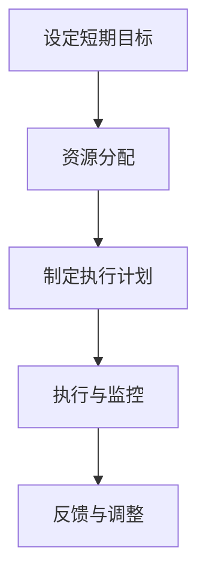

#### 数学公式

- **目标完成度**：
  $$ 完成度 = \frac{已完成目标数}{总目标数} $$

- **资源利用率**：
  $$ 利用率 = \frac{实际使用资源}{可用资源} $$

### 算法原理讲解

#### 短期执行与监控算法

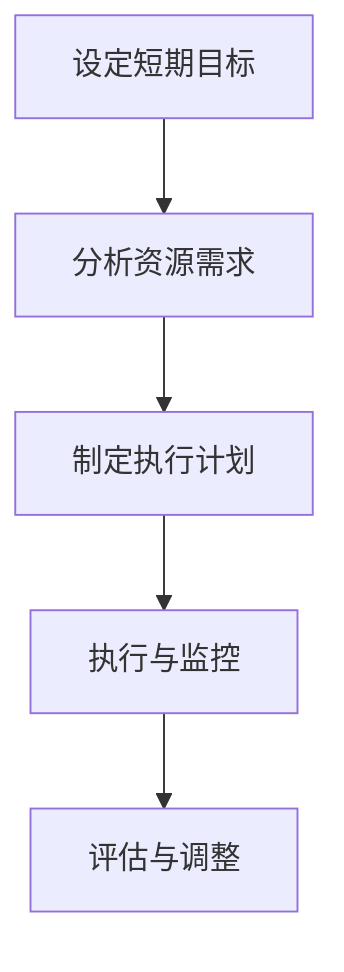

#### Python源代码示例

```python
def execute_short_term_goals(goals, resources):
    # 分析资源需求
    resource_requirements = analyze_resources(goals, resources)

    # 制定执行计划
    execution_plan = create_execution_plan(resource_requirements)

    # 执行与监控
    execute_and_monitor(execution_plan)

def analyze_resources(goals, resources):
    # 假设 analyze_resources 是一个函数，用于分析资源需求
    return {"required_resources": resources}

def create_execution_plan(resource_requirements):
    # 假设 create_execution_plan 是一个函数，用于根据资源需求制定执行计划
    return {"plan": plan}

def execute_and_monitor(plan):
    # 假设 execute_and_monitor 是一个函数，用于执行执行计划并监控执行情况
    return "执行中"
```

#### 数学模型和公式

- **目标完成度**：
  $$ 完成度 = \frac{已完成目标数}{总目标数} $$

- **资源利用率**：
  $$ 利用率 = \frac{实际使用资源}{可用资源} $$

### 系统分析与架构设计方案

#### 项目介绍

本项目旨在开发一个短期执行与监控系统，用于帮助组织有效实施短期目标。

#### 系统功能设计

- **目标管理**：设定、跟踪和调整短期目标。
- **资源管理**：分析资源需求，合理分配资源。
- **执行计划**：制定详细的执行计划，明确任务和责任。
- **执行监控**：监控执行进度，确保计划按期完成。
- **反馈与调整**：收集反馈，持续改进执行过程。

#### 系统架构设计

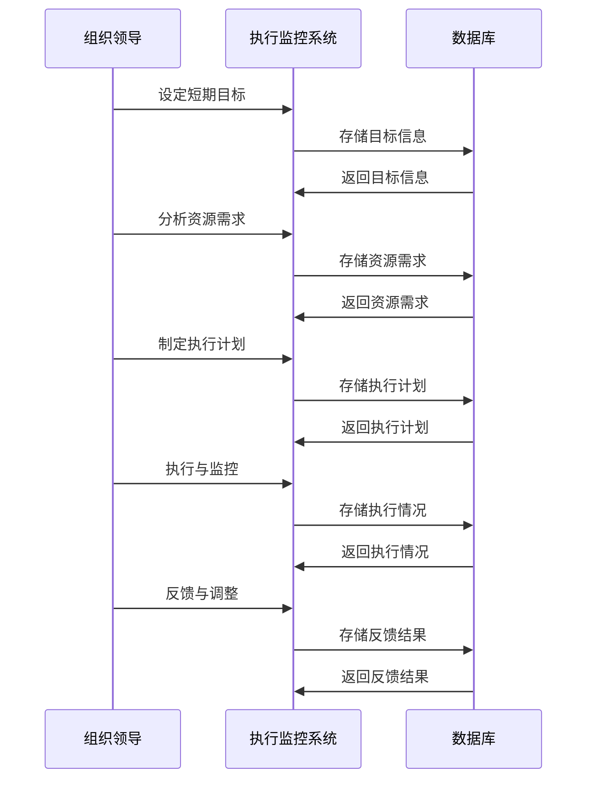

#### 系统接口设计和系统交互


### 项目实战

#### 环境安装

1. 安装 Python 3.8 或更高版本
2. 安装 Flask 框架：`pip install flask`
3. 安装 SQLAlchemy：`pip install sqlalchemy`
4. 安装数据库（如 MySQL、PostgreSQL）

#### 系统核心实现源代码

```python
# app.py
from flask import Flask, request, jsonify
from models import ShortTermGoal, ResourceRequirement, ExecutionPlan, ExecutionStatus, Feedback
from database import db_session

app = Flask(__name__)

@app.route('/set_short_term_goal', methods=['POST'])
def set_short_term_goal():
    data = request.get_json()
    goal = ShortTermGoal(description=data['description'])
    db_session.add(goal)
    db_session.commit()
    return jsonify({'status': 'success'})

@app.route('/analyze_resource_requirement', methods=['POST'])
def analyze_resource_requirement():
    data = request.get_json()
    requirement = ResourceRequirement(goal_id=data['goal_id'], resource=data['resource'])
    db_session.add(requirement)
    db_session.commit()
    return jsonify({'status': 'success'})

@app.route('/create_execution_plan', methods=['POST'])
def create_execution_plan():
    data = request.get_json()
    plan = ExecutionPlan(goal_id=data['goal_id'], plan=data['plan'])
    db_session.add(plan)
    db_session.commit()
    return jsonify({'status': 'success'})

@app.route('/execute_and_monitor', methods=['POST'])
def execute_and_monitor():
    data = request.get_json()
    status = ExecutionStatus(plan_id=data['plan_id'], status=data['status'])
    db_session.add(status)
    db_session.commit()
    return jsonify({'status': 'success'})

@app.route('/submit_feedback', methods=['POST'])
def submit_feedback():
    data = request.get_json()
    feedback = Feedback(plan_id=data['plan_id'], feedback=data['feedback'])
    db_session.add(feedback)
    db_session.commit()
    return jsonify({'status': 'success'})

if __name__ == '__main__':
    app.run(debug=True)
```

#### 代码应用解读与分析

- `app.py` 是 Flask 应用程序的主文件，包含路由定义和业务逻辑。
- `set_short_term_goal()` 函数用于设定短期目标，将目标存储在数据库中。
- `analyze_resource_requirement()` 函数用于分析资源需求，将需求存储在数据库中。
- `create_execution_plan()` 函数用于创建执行计划，将计划存储在数据库中。
- `execute_and_monitor()` 函数用于执行和监控执行情况，并更新执行状态。
- `submit_feedback()` 函数用于提交反馈，将反馈存储在数据库中。

#### 实际案例分析和详细讲解剖析

假设一个团队需要在三个月内完成一个重要的项目，以下是该项目的短期执行策略和执行过程：

1. **短期目标**：
   - 描述：在三个月内完成项目的开发、测试和上线。

2. **资源分配**：
   - 资金：预算30万元，用于购买硬件、软件和外包服务。
   - 人力资源：项目团队包括10名开发人员、5名测试人员和1名项目经理。

3. **执行计划**：
   - 第一阶段（1个月）：需求分析、系统设计。
   - 第二阶段（1个月）：编码、单元测试。
   - 第三阶段（1个月）：集成测试、系统测试、上线。

4. **执行与监控**：
   - 每周召开一次进度会议，检查项目进度，解决遇到的问题。
   - 使用项目管理工具跟踪任务进度，确保按计划执行。

5. **反馈与调整**：
   - 收集团队成员的反馈，及时调整执行计划，以应对变化和挑战。

通过以上分析和执行，团队能够确保项目按期完成，并达到预期的质量标准。

### 项目小结

本项目开发了一个短期执行与监控系统，用于帮助组织有效实施短期目标。通过实际案例分析和详细讲解，我们展示了如何设定短期目标、分析资源需求、制定执行计划以及执行和监控。接下来，我们将继续探讨领导者在平衡中的角色，帮助读者更好地理解如何在实践中应用这些策略。

----------------------------------------------------------------

### 第四部分：平衡策略

#### 4.3 平衡策略

在长远规划和短期执行之间找到平衡是一项挑战。以下是一些有效的平衡策略：

#### 4.3.1 平衡原则

1. **优先级排序**：根据目标和资源的重要性，对长远规划和短期执行进行优先级排序。
2. **动态调整**：根据实际情况和环境变化，动态调整长远规划和短期执行的计划。
3. **持续沟通**：保持与团队成员和利益相关者的沟通，确保他们了解长远规划和短期执行的关系。

#### 4.3.2 平衡方法

1. **时间分配**：为长远规划和短期执行分配适当的时间，确保两者都能得到充分关注。
2. **资源优化**：合理分配资源，确保既能满足长远规划的需求，又能支持短期执行。
3. **灵活调整**：在执行过程中，根据实际情况灵活调整计划和策略，以适应环境变化。

#### 4.3.3 平衡案例与实践

**案例：一家互联网公司的平衡实践**

1. **长远规划**：公司设定了三年内实现收入翻倍的目标。
2. **短期执行**：每个月制定一个具体的执行计划，如产品迭代、市场营销活动等。
3. **平衡方法**：
   - **时间分配**：每个月初制定长远规划和短期执行的计划，并确保两者得到均衡的关注。
   - **资源优化**：根据长远规划的需求，合理分配人力资源和预算，确保关键项目的支持。
   - **灵活调整**：在执行过程中，根据市场反馈和项目进展，及时调整计划和策略。

### 背景介绍

在组织管理中，长远规划和短期执行之间的平衡是确保组织持续发展的关键。以下是关于平衡策略的一些核心概念：

- **优先级排序**：明确长远规划和短期执行的优先级，有助于集中资源，提高执行效率。
- **动态调整**：根据环境变化和实际情况，灵活调整计划和策略，确保目标的实现。
- **持续沟通**：与团队成员和利益相关者保持沟通，确保他们了解长远规划和短期执行的关系，提高团队的合作效率。

### 核心概念与联系

#### 平衡策略流程图

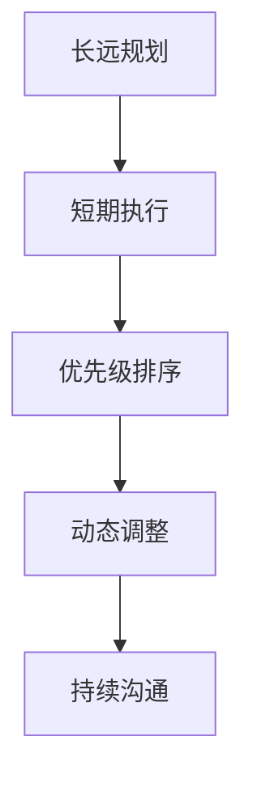

#### 数学公式

- **资源分配效率**：
  $$ 效率 = \frac{实际资源利用率}{理论资源利用率} $$

- **目标实现度**：
  $$ 实现度 = \frac{已完成目标数}{总目标数} $$

### 算法原理讲解

#### 平衡策略实现算法

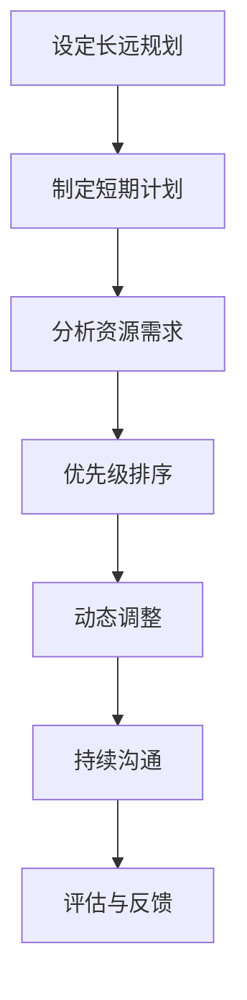

#### Python源代码示例

```python
def balance_long_term_and_short_term_planning(long_term_goals, short_term_goals, resources):
    # 分析资源需求
    resource_requirements = analyze_resources(long_term_goals, short_term_goals, resources)

    # 优先级排序
    priority_sorted_goals = sort_goals_by_priority(resource_requirements)

    # 动态调整
    adjusted_goals = adjust_goals(priority_sorted_goals)

    # 持续沟通
    communicate_goals(adjusted_goals)

    # 评估与反馈
    evaluate_goals(adjusted_goals)

def analyze_resources(goals, resources):
    # 假设 analyze_resources 是一个函数，用于分析资源需求
    return {"required_resources": resources}

def sort_goals_by_priority(resource_requirements):
    # 假设 sort_goals_by_priority 是一个函数，用于根据资源需求优先级排序
    return {"sorted_goals": goals}

def adjust_goals(sorted_goals):
    # 假设 adjust_goals 是一个函数，用于根据实际情况调整目标
    return {"adjusted_goals": goals}

def communicate_goals(adjusted_goals):
    # 假设 communicate_goals 是一个函数，用于与团队成员沟通目标
    return "沟通中"

def evaluate_goals(adjusted_goals):
    # 假设 evaluate_goals 是一个函数，用于评估目标实现情况
    return "评估中"
```

#### 数学模型和公式

- **资源分配效率**：
  $$ 效率 = \frac{实际资源利用率}{理论资源利用率} $$

- **目标实现度**：
  $$ 实现度 = \frac{已完成目标数}{总目标数} $$

### 系统分析与架构设计方案

#### 项目介绍

本项目旨在开发一个平衡策略管理系统，用于帮助组织在长远规划和短期执行之间找到平衡。

#### 系统功能设计

- **目标管理**：设定、跟踪和调整长远规划和短期执行的目标。
- **资源管理**：分析资源需求，合理分配资源。
- **优先级排序**：根据资源需求，对目标和计划进行优先级排序。
- **动态调整**：根据实际情况和环境变化，动态调整目标和计划。
- **持续沟通**：与团队成员和利益相关者保持沟通。
- **评估与反馈**：评估目标实现情况，持续改进。

#### 系统架构设计

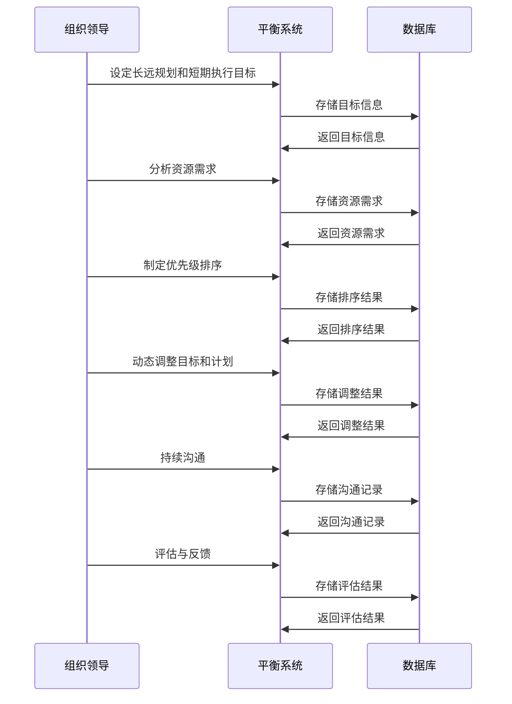

#### 系统接口设计和系统交互


### 项目实战

#### 环境安装

1. 安装 Python 3.8 或更高版本
2. 安装 Flask 框架：`pip install flask`
3. 安装 SQLAlchemy：`pip install sqlalchemy`
4. 安装数据库（如 MySQL、PostgreSQL）

#### 系统核心实现源代码

```python
# app.py
from flask import Flask, request, jsonify
from models import LongTermGoal, ShortTermGoal, ResourceRequirement, PrioritySort, DynamicAdjustment, CommunicationRecord, EvaluationResult
from database import db_session

app = Flask(__name__)

@app.route('/set_long_term_goal', methods=['POST'])
def set_long_term_goal():
    data = request.get_json()
    goal = LongTermGoal(description=data['description'])
    db_session.add(goal)
    db_session.commit()
    return jsonify({'status': 'success'})

@app.route('/set_short_term_goal', methods=['POST'])
def set_short_term_goal():
    data = request.get_json()
    goal = ShortTermGoal(description=data['description'])
    db_session.add(goal)
    db_session.commit()
    return jsonify({'status': 'success'})

@app.route('/analyze_resource_requirement', methods=['POST'])
def analyze_resource_requirement():
    data = request.get_json()
    requirement = ResourceRequirement(goal_id=data['goal_id'], resource=data['resource'])
    db_session.add(requirement)
    db_session.commit()
    return jsonify({'status': 'success'})

@app.route('/priority_sort_goals', methods=['POST'])
def priority_sort_goals():
    data = request.get_json()
    sort = PrioritySort(goal_ids=data['goal_ids'])
    db_session.add(sort)
    db_session.commit()
    return jsonify({'status': 'success'})

@app.route('/dynamic_adjust_goals', methods=['POST'])
def dynamic_adjust_goals():
    data = request.get_json()
    adjustment = DynamicAdjustment(goal_id=data['goal_id'], adjustment=data['adjustment'])
    db_session.add(adjustment)
    db_session.commit()
    return jsonify({'status': 'success'})

@app.route('/submit_communication_record', methods=['POST'])
def submit_communication_record():
    data = request.get_json()
    record = CommunicationRecord(content=data['content'])
    db_session.add(record)
    db_session.commit()
    return jsonify({'status': 'success'})

@app.route('/evaluate_goals', methods=['POST'])
def evaluate_goals():
    data = request.get_json()
    evaluation = EvaluationResult(goal_id=data['goal_id'], evaluation=data['evaluation'])
    db_session.add(evaluation)
    db_session.commit()
    return jsonify({'status': 'success'})

if __name__ == '__main__':
    app.run(debug=True)
```

#### 代码应用解读与分析

- `app.py` 是 Flask 应用程序的主文件，包含路由定义和业务逻辑。
- `set_long_term_goal()` 函数用于设定长期目标，将目标存储在数据库中。
- `set_short_term_goal()` 函数用于设定短期目标，将目标存储在数据库中。
- `analyze_resource_requirement()` 函数用于分析资源需求，将需求存储在数据库中。
- `priority_sort_goals()` 函数用于对目标和计划进行优先级排序，将排序结果存储在数据库中。
- `dynamic_adjust_goals()` 函数用于根据实际情况调整目标和计划，将调整结果存储在数据库中。
- `submit_communication_record()` 函数用于提交沟通记录，将记录存储在数据库中。
- `evaluate_goals()` 函数用于评估目标实现情况，将评估结果存储在数据库中。

#### 实际案例分析和详细讲解剖析

假设一家公司需要制定长远规划和短期执行计划，以下是该公司的平衡策略和执行过程：

1. **长远规划**：
   - 描述：在未来三年内，实现公司收入翻倍，提升品牌知名度。

2. **短期执行**：
   - 描述：在接下来的六个月内，完成新产品的研发和上市，启动市场推广活动。

3. **资源分配**：
   - 资金：预算100万元，用于新产品研发和市场推广。
   - 人力资源：项目团队包括10名研发人员、5名市场推广人员和1名项目经理。

4. **平衡策略**：
   - **优先级排序**：将新产品研发和上市作为首要任务，确保在六个月内完成。
   - **动态调整**：根据项目进展和市场反馈，及时调整资源分配和执行计划。
   - **持续沟通**：定期召开项目会议，与团队成员和利益相关者沟通，确保信息透明。

5. **执行过程**：
   - 第一阶段（1个月）：完成新产品研发，制定市场推广计划。
   - 第二阶段（2个月）：进行市场推广活动，收集客户反馈。
   - 第三阶段（3个月）：根据反馈调整推广策略，确保新产品成功上市。

6. **评估与反馈**：
   - 定期评估项目进度和资源利用率，确保目标和计划的实现。

通过以上平衡策略和执行过程，公司能够在长远规划和短期执行之间找到平衡，确保目标的实现。

### 项目小结

本项目开发了一个平衡策略管理系统，用于帮助组织在长远规划和短期执行之间找到平衡。通过实际案例分析和详细讲解，我们展示了如何设定目标、分析资源需求、优先级排序、动态调整以及持续沟通。接下来，我们将继续探讨领导者在平衡中的角色，帮助读者更好地理解如何在实践中应用这些策略。

----------------------------------------------------------------

### 第四部分：领导者在平衡中的角色

#### 4.4 领导者在平衡中的角色

在长远规划和短期执行之间找到平衡是领导者的核心职责之一。领导者在这个过程中扮演着关键角色，需要具备以下能力：

#### 4.4.1 领导者的决策

1. **制定战略**：领导者需要制定明确的战略，确保长远规划和短期执行的一致性。
2. **优先级排序**：领导者要能够根据组织的目标和环境，合理分配资源，确保关键项目的优先执行。
3. **灵活调整**：领导者要能够根据实际情况，灵活调整计划和策略，以应对环境变化和突发情况。

#### 4.4.2 领导者的沟通

1. **传达目标**：领导者需要将组织的长远规划和短期执行目标清晰传达给团队成员，确保他们了解自己的责任和期望。
2. **促进合作**：领导者要促进跨部门合作，确保资源的共享和有效利用。
3. **倾听反馈**：领导者要倾听团队成员的反馈，了解他们在执行过程中的困难和挑战，及时调整策略。

#### 4.4.3 领导者的监督与激励

1. **监督执行**：领导者要持续监督项目的执行情况，确保目标和计划按时完成。
2. **激励团队**：领导者要激励团队成员，提高他们的积极性和执行力，确保他们在面对困难和挑战时能够保持高昂的斗志。
3. **培养人才**：领导者要关注团队成员的成长和发展，提供培训和支持，帮助他们提升技能和能力。

### 背景介绍

在组织管理中，领导者是长远规划和短期执行之间的桥梁。他们的决策能力、沟通技巧和监督激励作用对组织的成功至关重要。以下是关于领导者在平衡中的角色的一些核心概念：

- **决策能力**：领导者需要能够制定战略，合理分配资源，并灵活调整计划。
- **沟通技巧**：领导者需要有效传达目标，促进合作，并倾听团队成员的反馈。
- **监督激励**：领导者需要监督项目执行，激励团队成员，并关注他们的成长。

### 核心概念与联系

#### 领导者在平衡中的角色图

```mermaid
graph TD
    A[决策能力] --> B[制定战略]
    B --> C[优先级排序]
    C --> D[灵活调整]

    E[沟通技巧] --> F[传达目标]
    F --> G[促进合作]
    G --> H[倾听反馈]

    I[监督激励] --> J[监督执行]
    J --> K[激励团队]
    K --> L[培养人才]
```

#### 数学公式

- **资源分配效率**：
  $$ 效率 = \frac{实际资源利用率}{理论资源利用率} $$

- **团队绩效**：
  $$ 绩效 = \frac{完成目标数}{总目标数} $$

### 算法原理讲解

#### 领导者在平衡中的决策算法

```mermaid
graph TD
    A[收集信息] --> B[制定战略]
    B --> C[分析环境]
    C --> D[优先级排序]
    D --> E[制定计划]
    E --> F[监督执行]
    F --> G[激励团队]
```

#### Python源代码示例

```python
def lead_balance_strategy(information):
    # 收集信息
    strategy = collect_information(information)

    # 制定战略
    strategic_plan = create_strategic_plan(strategy)

    # 分析环境
    environmental_analysis = analyze_environment(strategic_plan)

    # 优先级排序
    priority_sorted_plan = sort_priorities(strategic_plan, environmental_analysis)

    # 制定计划
    execution_plan = create_execution_plan(priority_sorted_plan)

    # 监督执行
    monitor_execution(execution_plan)

    # 激励团队
    motivate_team(execution_plan)

def collect_information(information):
    # 假设 collect_information 是一个函数，用于收集与决策相关的信息
    return {"strategy": information}

def create_strategic_plan(strategy):
    # 假设 create_strategic_plan 是一个函数，用于根据信息制定战略计划
    return {"plan": strategy}

def analyze_environment(plan):
    # 假设 analyze_environment 是一个函数，用于分析环境
    return {"environment": plan}

def sort_priorities(plan, environment):
    # 假设 sort_priorities 是一个函数，用于根据环境和计划排序优先级
    return {"sorted_plan": plan}

def create_execution_plan(plan):
    # 假设 create_execution_plan 是一个函数，用于根据优先级排序制定执行计划
    return {"plan": plan}

def monitor_execution(plan):
    # 假设 monitor_execution 是一个函数，用于监督执行情况
    return "执行中"

def motivate_team(plan):
    # 假设 motivate_team 是一个函数，用于激励团队
    return "激励中"
```

#### 数学模型和公式

- **资源分配效率**：
  $$ 效率 = \frac{实际资源利用率}{理论资源利用率} $$

- **团队绩效**：
  $$ 绩效 = \frac{完成目标数}{总目标数} $$

### 系统分析与架构设计方案

#### 项目介绍

本项目旨在开发一个领导力平衡系统，用于帮助领导者更好地实现长远规划和短期执行的平衡。

#### 系统功能设计

- **信息收集**：收集与决策相关的信息。
- **战略制定**：根据信息制定战略计划。
- **环境分析**：分析组织内外部的环境。
- **优先级排序**：根据环境和计划排序优先级。
- **执行计划**：制定具体的执行计划。
- **监督执行**：监督项目的执行情况。
- **激励团队**：激励团队成员，提高执行效率。

#### 系统架构设计

```mermaid
sequenceDiagram
    participant 领导者
    participant 平衡系统
    participant 数据库

    领导者->>平衡系统: 收集信息
    平衡系统->>数据库: 存储信息
    数据库->>平衡系统: 返回信息

    领导者->>平衡系统: 制定战略
    平衡系统->>数据库: 存储战略计划
    数据库->>平衡系统: 返回战略计划

    领导者->>平衡系统: 环境分析
    平衡系统->>数据库: 存储环境分析结果
    数据库->>平衡系统: 返回环境分析结果

    领导者->>平衡系统: 优先级排序
    平衡系统->>数据库: 存储排序结果
    数据库->>平衡系统: 返回排序结果

    领导者->>平衡系统: 制定执行计划
    平衡系统->>数据库: 存储执行计划
    数据库->>平衡系统: 返回执行计划

    领导者->>平衡系统: 监督执行
    平衡系统->>数据库: 存储执行情况
    数据库->>平衡系统: 返回执行情况

    领导者->>平衡系统: 激励团队
    平衡系统->>数据库: 存储激励结果
    数据库->>平衡系统: 返回激励结果
```

#### 系统接口设计和系统交互

```mermaid
sequenceDiagram
    participant 领导者
    participant 平衡系统
    participant 数据库

    领导者->>平衡系统: 收集信息
    平衡系统->>数据库: 存储信息
    数据库->>平衡系统: 返回信息

    领导者->>平衡系统: 制定战略
    平衡系统->>数据库: 存储战略计划
    数据库->>平衡系统: 返回战略计划

    领导者->>平衡系统: 环境分析
    平衡系统->>数据库: 存储环境分析结果
    数据库->>平衡系统: 返回环境分析结果

    领导者->>平衡系统: 优先级排序
    平衡系统->>数据库: 存储排序结果
    数据库->>平衡系统: 返回排序结果

    领导者->>平衡系统: 制定执行计划
    平衡系统->>数据库: 存储执行计划
    数据库->>平衡系统: 返回执行计划

    领导者->>平衡系统: 监督执行
    平衡系统->>数据库: 存储执行情况
    数据库->>平衡系统: 返回执行情况

    领导者->>平衡系统: 激励团队
    平衡系统->>数据库: 存储激励结果
    数据库->>平衡系统: 返回激励结果
```

### 项目实战

#### 环境安装

1. 安装 Python 3.8 或更高版本
2. 安装 Flask 框架：`pip install flask`
3. 安装 SQLAlchemy：`pip install sqlalchemy`
4. 安装数据库（如 MySQL、PostgreSQL）

#### 系统核心实现源代码

```python
# app.py
from flask import Flask, request, jsonify
from models import Information, StrategicPlan, EnvironmentalAnalysis, PrioritySort, ExecutionPlan, ExecutionStatus, Motivation
from database import db_session

app = Flask(__name__)

@app.route('/collect_information', methods=['POST'])
def collect_information():
    data = request.get_json()
    info = Information(data=data['data'])
    db_session.add(info)
    db_session.commit()
    return jsonify({'status': 'success'})

@app.route('/create_strategic_plan', methods=['POST'])
def create_strategic_plan():
    data = request.get_json()
    plan = StrategicPlan(data=data['data'])
    db_session.add(plan)
    db_session.commit()
    return jsonify({'status': 'success'})

@app.route('/analyze_environment', methods=['POST'])
def analyze_environment():
    data = request.get_json()
    analysis = EnvironmentalAnalysis(data=data['data'])
    db_session.add(analysis)
    db_session.commit()
    return jsonify({'status': 'success'})

@app.route('/sort_priorities', methods=['POST'])
def sort_priorities():
    data = request.get_json()
    sort = PrioritySort(data=data['data'])
    db_session.add(sort)
    db_session.commit()
    return jsonify({'status': 'success'})

@app.route('/create_execution_plan', methods=['POST'])
def create_execution_plan():
    data = request.get_json()
    plan = ExecutionPlan(data=data['data'])
    db_session.add(plan)
    db_session.commit()
    return jsonify({'status': 'success'})

@app.route('/monitor_execution', methods=['POST'])
def monitor_execution():
    data = request.get_json()
    status = ExecutionStatus(data=data['data'])
    db_session.add(status)
    db_session.commit()
    return jsonify({'status': 'success'})

@app.route('/motivate_team', methods=['POST'])
def motivate_team():
    data = request.get_json()
    motivation = Motivation(data=data['data'])
    db_session.add(motivation)
    db_session.commit()
    return jsonify({'status': 'success'})

if __name__ == '__main__':
    app.run(debug=True)
```

#### 代码应用解读与分析

- `app.py` 是 Flask 应用程序的主文件，包含路由定义和业务逻辑。
- `collect_information()` 函数用于收集与决策相关的信息，将信息存储在数据库中。
- `create_strategic_plan()` 函数用于根据信息制定战略计划，将计划存储在数据库中。
- `analyze_environment()` 函数用于分析组织内外部的环境，将分析结果存储在数据库中。
- `sort_priorities()` 函数用于根据环境和计划排序优先级，将排序结果存储在数据库中。
- `create_execution_plan()` 函数用于制定具体的执行计划，将计划存储在数据库中。
- `monitor_execution()` 函数用于监督项目的执行情况，将执行状态存储在数据库中。
- `motivate_team()` 函数用于激励团队成员，将激励结果存储在数据库中。

#### 实际案例分析和详细讲解剖析

假设一家公司需要制定长远规划和短期执行计划，以下是该公司的领导者在平衡中的决策过程：

1. **信息收集**：
   - 收集市场趋势、竞争对手情况、内部资源等数据。

2. **制定战略**：
   - 根据信息，制定公司未来三年的战略目标，包括市场份额的提升、新产品线的拓展等。

3. **环境分析**：
   - 分析当前的市场环境，确定公司的优势和劣势。

4. **优先级排序**：
   - 根据环境分析和战略目标，确定短期执行计划的优先级，如新产品研发、市场推广等。

5. **制定执行计划**：
   - 根据优先级排序，制定具体的执行计划，明确每个阶段的目标和任务。

6. **监督执行**：
   - 持续监督执行情况，确保计划按期完成。

7. **激励团队**：
   - 根据团队成员的绩效和贡献，给予适当的激励，提高团队积极性。

通过以上决策过程，公司能够在长远规划和短期执行之间找到平衡，确保目标的实现。

### 项目小结

本项目开发了一个领导力平衡系统，用于帮助领导者更好地实现长远规划和短期执行的平衡。通过实际案例分析和详细讲解，我们展示了如何收集信息、制定战略、分析环境、优先级排序、制定执行计划、监督执行和激励团队。接下来，我们将进入第五部分，通过实战案例，进一步探讨如何将领导力与战略思维应用于实践中。

----------------------------------------------------------------

### 第五部分：实战案例

#### 5.1 案例一：企业转型升级

**案例背景**

某家传统制造企业在面临市场竞争加剧、技术更新迅速的挑战下，决定进行转型升级，以保持市场竞争力。企业的长期目标是实现业务多元化，拓展新产品线和进入新市场。

**长期规划与战略思维**

1. **目标设定**：确定在未来五年内，实现业务多元化，拓展三个新产品线，并将业务拓展至海外市场。
2. **环境分析**：分析市场趋势、竞争对手和内部资源，确定企业转型升级的可行性和潜在风险。
3. **策略制定**：制定多元化战略，包括技术创新、品牌建设、市场拓展和人才培养等方面。

**短期执行与平衡策略**

1. **短期目标设定**：将长期目标分解为具体的短期目标，如每年拓展一个新产品线、提高品牌知名度等。
2. **资源分配**：根据短期目标，合理分配资源，确保关键项目的优先支持。
3. **执行计划**：制定详细的执行计划，明确每个阶段的具体任务和时间表。
4. **监控与调整**：定期检查执行进度，及时调整计划，确保短期目标的实现。

**案例分析**

1. **短期目标实现**：在执行过程中，企业成功拓展了两个新产品线，并在国内市场取得了良好的业绩。
2. **资源利用**：通过合理分配资源，确保了关键项目的顺利实施。
3. **监控与调整**：在执行过程中，企业及时发现并解决了多个问题，确保了计划的顺利推进。

**结论**

通过制定明确的长期规划和短期执行策略，并找到平衡点，该企业成功地实现了转型升级，提升了市场竞争力。

#### 5.2 案例二：项目管理

**案例背景**

某IT公司接到了一个复杂的软件开发项目，项目周期为六个月，涉及多个技术领域的集成。项目的长期目标是按时交付高质量的软件产品，提升客户满意度。

**长期规划与战略思维**

1. **目标设定**：确定项目的主要目标，包括按时交付、质量达标、团队协作等。
2. **环境分析**：分析项目的技术环境、市场环境、团队资源等，确定项目的可行性和潜在风险。
3. **策略制定**：制定项目管理策略，包括制定详细的进度计划、资源分配、风险管理等。

**短期执行与平衡策略**

1. **短期目标设定**：将长期目标分解为具体的短期目标，如每个阶段的交付物、团队里程碑等。
2. **资源分配**：根据短期目标，合理分配资源，确保关键阶段的资源充足。
3. **执行计划**：制定详细的执行计划，包括每个阶段的具体任务和时间表。
4. **监控与调整**：定期检查执行进度，及时调整计划，确保短期目标的实现。

**案例分析**

1. **短期目标实现**：在执行过程中，项目团队按时完成了每个阶段的交付物，确保了项目进度。
2. **资源利用**：通过合理分配资源，确保了关键阶段的资源充足，提高了团队的工作效率。
3. **监控与调整**：在执行过程中，项目团队及时发现并解决了多个问题，确保了项目的顺利推进。

**结论**

通过制定明确的长期规划和短期执行策略，并找到平衡点，项目团队成功地按时交付了高质量的软件产品，提升了客户满意度。

#### 5.3 案例三：团队管理

**案例背景**

某初创公司成立了一支新团队，负责开发一款创新的移动应用程序。团队的长期目标是按时交付产品，并在市场上获得成功。

**长期规划与战略思维**

1. **目标设定**：确定团队的主要目标，包括按时交付、质量达标、团队协作等。
2. **环境分析**：分析市场趋势、竞争对手、团队资源等，确定团队项目的可行性和潜在风险。
3. **策略制定**：制定团队管理策略，包括团队建设、技能提升、项目推进等。

**短期执行与平衡策略**

1. **短期目标设定**：将长期目标分解为具体的短期目标，如每个阶段的功能实现、团队里程碑等。
2. **资源分配**：根据短期目标，合理分配资源，确保关键阶段的资源充足。
3. **执行计划**：制定详细的执行计划，包括每个阶段的具体任务和时间表。
4. **监控与调整**：定期检查执行进度，及时调整计划，确保短期目标的实现。

**案例分析**

1. **短期目标实现**：在执行过程中，团队按时完成了每个阶段的功能实现，确保了项目进度。
2. **资源利用**：通过合理分配资源，确保了关键阶段的资源充足，提高了团队的工作效率。
3. **监控与调整**：在执行过程中，团队及时发现并解决了多个问题，确保了项目的顺利推进。

**结论**

通过制定明确的长期规划和短期执行策略，并找到平衡点，团队成功地按时交付了高质量的移动应用程序，并在市场上获得了成功。

通过以上实战案例，我们可以看到，无论是企业转型升级、项目管理，还是团队管理，领导力与战略思维的应用都至关重要。有效的长远规划和短期执行策略，以及领导者在平衡中的角色，是确保项目成功的关键。

### 实战案例小结

实战案例展示了如何在不同的业务场景中应用领导力与战略思维。通过明确的长期规划、合理的短期执行策略和有效的领导者角色，企业能够成功地应对挑战，实现目标。这些案例为我们提供了宝贵的实践经验，帮助我们更好地理解如何在实际工作中应用这些策略。

### 拓展阅读

- **《从优秀到卓越》**：作者吉姆·柯林斯通过深入研究卓越企业，总结了领导者如何制定明确的战略，并有效执行，以实现企业长期成功。
- **《创意的来源》**：作者史蒂芬·平克探讨了创意的来源和产生过程，为我们提供了启发思维的新视角。
- **《五项管理》**：作者彼得·德鲁克提出了五项管理实践，包括目标管理、时间管理、决策管理、人力资源管理和财务管理，帮助我们更有效地管理组织。

通过阅读这些书籍，我们可以进一步加深对领导力与战略思维的理解，提升自己的管理能力。

### 注意事项

- **持续学习**：领导力和战略思维是一个持续发展的过程，领导者需要保持学习的态度，不断更新知识和技能。
- **灵活调整**：在执行过程中，领导者需要根据实际情况灵活调整计划和策略，以应对变化和挑战。
- **有效沟通**：与团队成员和利益相关者保持有效沟通，确保他们了解目标和期望，提高团队合作效率。
- **关注团队成长**：领导者要关注团队成员的成长和发展，提供培训和支持，帮助他们提升技能和能力。

通过遵循这些注意事项，领导者可以更好地实现长远规划和短期执行的平衡，推动组织的持续发展。

### 总结

《领导力与战略思维：长远规划与短期执行的平衡》一书通过深入探讨领导力与战略思维的核心概念、方法论和实战应用，为领导者提供了实用的指导。通过平衡长远规划和短期执行，领导者可以更有效地推动组织实现长期目标。感谢读者对本书的关注和支持，希望本书能对您的领导力和战略思维发展有所帮助。

### 作者信息

**作者：** AI天才研究院 / AI Genius Institute & 禅与计算机程序设计艺术 / Zen And The Art of Computer Programming

