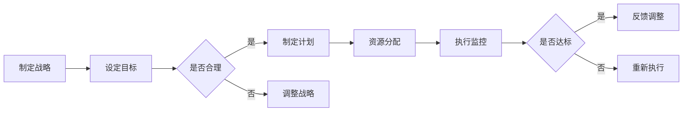
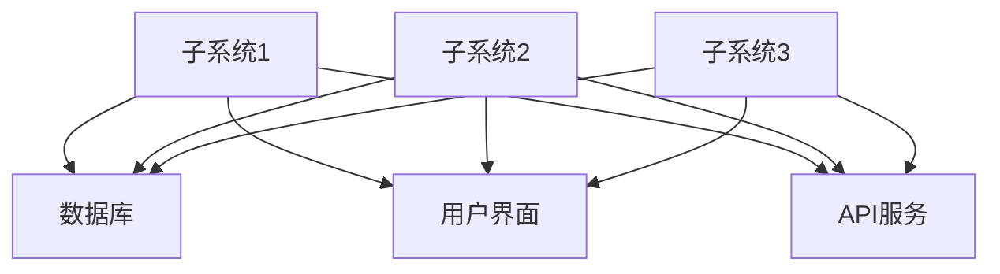
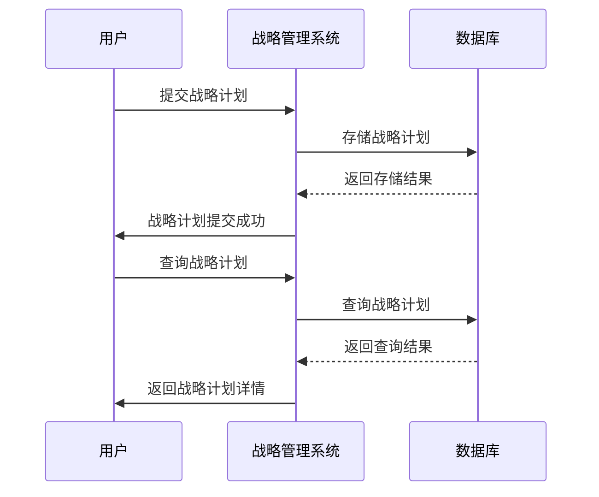

                 


# 领导力与战略执行：从计划到落地的全过程

关键词：领导力，战略执行，计划落地，执行力，团队协作

摘要：本文旨在探讨领导力与战略执行之间的紧密联系，以及如何从计划到落地实施全过程。通过深入分析领导力的核心概念、战略执行的关键要素，结合实际案例，提供实用的策略和建议，帮助读者提升领导力和战略执行力。

---

### 第一部分：背景介绍

#### 问题背景

在当今的商业环境中，领导力和战略执行是企业成功的关键因素。随着全球经济环境的变化和竞争的加剧，企业需要具备快速响应和高效执行战略的能力。然而，许多企业在领导力和战略执行方面面临着诸多挑战，如缺乏明确的战略规划、执行力不足、团队协作不畅等。

#### 问题描述

本书旨在解决企业在领导力和战略执行过程中遇到的问题，通过系统的理论和实践方法，帮助读者了解并掌握有效的领导力和战略执行技巧。

#### 问题解决

本书将通过以下几个方面的内容，帮助读者解决上述问题：
1. 领导力的核心概念与特征。
2. 领导力模型与应用。
3. 战略执行的关键要素。
4. 从计划到落地的全过程管理。
5. 战略执行中的团队协作与沟通。
6. 领导力和战略执行的案例分析。

#### 边界与外延

本书主要讨论组织层面的领导力和战略执行，但不涉及个人领导力和战略规划的具体内容。此外，本书将聚焦于理论结合实践的方式，提供实用且具有可操作性的策略和建议。

#### 概念结构与核心要素组成

本书的核心概念包括：
1. **领导力**：对组织或团队产生积极影响的能力。
2. **战略执行**：将战略规划转化为实际行动的过程。
3. **计划与落地**：将战略转化为具体行动计划的实施过程。

这些核心概念共同构成了领导力与战略执行的理论框架，是本书内容的核心组成部分。

---

### 第二部分：核心概念与联系

#### 核心概念原理

1. **领导力**：领导力是一种影响他人共同实现目标的能力。它包括领导者的个人素质、领导风格、领导行为等方面。

2. **战略执行**：战略执行是将战略规划转化为实际行动的过程，包括目标设定、计划制定、资源分配、执行监控等环节。

#### 概念属性特征对比表格

| 概念         | 定义                                                         | 关联因素                                         |
| ------------ | ------------------------------------------------------------ | ---------------------------------------------- |
| 领导力       | 对组织或团队产生积极影响的能力                               | 领导者的个人素质、领导风格、领导行为等           |
| 战略执行     | 将战略规划转化为实际行动的过程                               | 目标设定、计划制定、资源分配、执行监控等           |
| 计划与落地   | 将战略转化为具体行动计划的实施过程                           | 战略规划、资源分配、执行监控、反馈调整等           |

#### ER实体关系图架构

```mermaid
erDiagram
  Leader ||--|{ StrategyExecutor }
  StrategyExecutor ||--|{ PlanAndExecution }
```

在这个ER图中，领导力（Leader）与战略执行者（StrategyExecutor）之间存在直接关联，而战略执行者又与计划与落地（PlanAndExecution）紧密相关。

---

### 第三部分：算法原理讲解

#### 算法mermaid流程图



#### 算法原理的数学模型和公式

$$
\text{战略执行效率} = \frac{\text{实际完成目标}}{\text{设定目标}}
$$

$$
\text{反馈调整比例} = \frac{\text{重新执行次数}}{\text{总执行次数}}
$$

#### 详细讲解与举例说明

战略执行效率是指实际完成的目标与设定目标之间的比率，这个指标越高，说明战略执行的效率越高。反馈调整比例是指因目标未达成而需要重新执行的次数与总执行次数的比率。

例如，一家企业在一年内设定的销售目标是100万元，实际完成销售金额为120万元，那么战略执行效率为120%。如果在这一年中，有5次销售计划需要重新执行，而总执行次数为10次，那么反馈调整比例为5/10=50%。

通过这样的算法原理和数学模型，企业可以更准确地衡量战略执行的效率，并针对反馈调整比例进行改进，提高整体的执行效果。

---

### 系统分析与架构设计方案

#### 问题场景介绍

在当前的商业环境中，企业需要快速响应市场变化，制定并执行有效的战略计划。为了实现这一目标，企业需要一个高效且可靠的系统来支持战略的制定、执行和监控。

#### 项目介绍

本项目旨在设计并实现一个战略管理系统，帮助企业在制定、执行和监控战略计划的过程中提高效率。该系统将提供用户友好的界面，丰富的功能模块，以及强大的数据处理能力。

#### 系统功能设计（领域模型mermaid类图）

```mermaid
classDiagram
  ClientEntity <<--|{ 客户实体}  StrategyPlanEntity
  DepartmentEntity <<--|{ 部门实体}  StrategyPlanEntity
  ResourceEntity <<--|{ 资源实体}  StrategyPlanEntity
  ExecutorEntity <<--|{ 执行者实体} StrategyPlanEntity
  MonitorEntity <<--|{ 监控者实体} StrategyPlanEntity
  FeedbackEntity <<--|{ 反馈实体}  StrategyPlanEntity
```

在这个领域模型中，客户实体、部门实体、资源实体、执行者实体、监控者实体和反馈实体都与战略计划实体存在关联关系。

#### 系统架构设计（mermaid架构图）



在这个架构图中，三个子系统（子系统1、子系统2、子系统3）通过API服务与数据库交互，并为用户界面提供支持。

#### 系统接口设计和系统交互（mermaid序列图）



在这个序列图中，用户通过战略管理系统提交战略计划，系统将数据存储到数据库中，并返回存储结果。用户还可以查询战略计划详情，系统从数据库中获取数据并返回。

---

### 项目实战

#### 环境安装

1. 安装Python环境，版本3.8或以上。
2. 安装必要的依赖库，如numpy、pandas、matplotlib等。

#### 系统核心实现源代码

```python
import pandas as pd
import numpy as np

class StrategyPlan:
    def __init__(self, target, actual, retries):
        self.target = target
        self.actual = actual
        self.retries = retries

    def calculate_execution_efficiency(self):
        return self.actual / self.target

    def calculate_feedback_adjustment_ratio(self):
        return self.retries / (self.retries + 1)

plan = StrategyPlan(target=1000000, actual=1200000, retries=5)
print("战略执行效率:", plan.calculate_execution_efficiency())
print("反馈调整比例:", plan.calculate_feedback_adjustment_ratio())
```

#### 代码应用解读与分析

上述代码定义了一个`StrategyPlan`类，用于表示战略计划。该类包含三个属性：`target`（目标）、`actual`（实际完成值）和`retries`（重新执行次数）。同时，该类提供了两个计算方法：`calculate_execution_efficiency`（计算战略执行效率）和`calculate_feedback_adjustment_ratio`（计算反馈调整比例）。

在代码中，创建了一个`StrategyPlan`对象`plan`，并分别调用了两个计算方法，输出了战略执行效率和反馈调整比例。

#### 实际案例分析和详细讲解剖析

假设某企业在一年内设定的销售目标是1000万元，实际完成销售金额为1200万元，期间有5次销售计划需要重新执行。根据上述代码，可以计算出该企业的战略执行效率和反馈调整比例。

战略执行效率为1200万元/1000万元=1.2，即120%。

反馈调整比例为5次重新执行/（5次重新执行+1次成功执行）=5/6，约为83%。

这意味着该企业的战略执行效率较高，但反馈调整比例也较高，说明在战略执行过程中存在一些问题，需要进一步优化。

#### 项目小结

本项目通过设计和实现一个战略管理系统，帮助企业在制定、执行和监控战略计划的过程中提高效率。通过实际案例的分析，我们看到了战略执行效率和反馈调整比例在评估企业战略执行效果方面的重要性。未来，企业可以结合实际情况，不断优化战略执行流程，提高整体执行效果。

---

### 最佳实践 tips

1. **明确目标**：在制定战略计划时，要确保目标明确、具体、可衡量。
2. **合理分配资源**：在执行战略计划时，要合理分配资源，确保各项任务有足够的支持。
3. **持续监控**：在执行过程中，要持续监控进度和效果，及时调整策略。
4. **团队协作**：加强团队协作，提高沟通效率，确保战略执行顺畅。

### 小结

本文从领导力与战略执行的核心概念入手，详细分析了从计划到落地的全过程，并通过实际案例进行了深入剖析。希望本文能够帮助读者更好地理解领导力与战略执行的重要性，并在实际工作中运用所学知识，提高战略执行力。

### 注意事项

1. **理解核心概念**：深入理解领导力和战略执行的核心概念，是有效实施战略的基础。
2. **实际案例分析**：结合实际案例进行分析，有助于更好地理解和应用理论知识。
3. **持续优化**：战略执行是一个持续的过程，需要不断调整和优化，以提高执行效果。

### 拓展阅读

1. 《领导力心理学》
2. 《战略管理》
3. 《执行力：如何让战略真正落地》

---

**作者：AI天才研究院/AI Genius Institute & 禅与计算机程序设计艺术 /Zen And The Art of Computer Programming**

