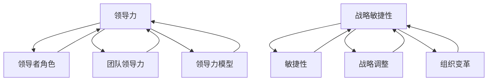
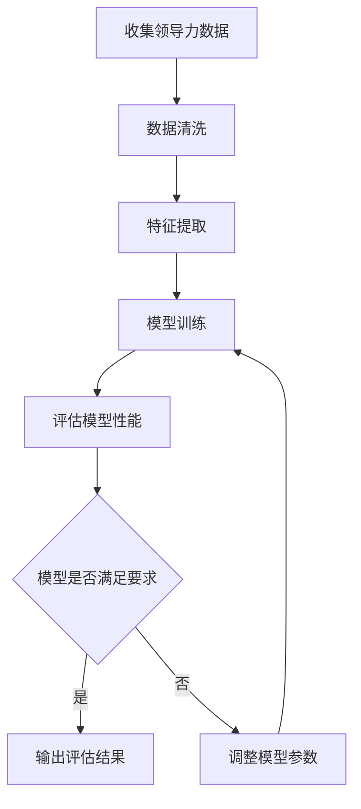
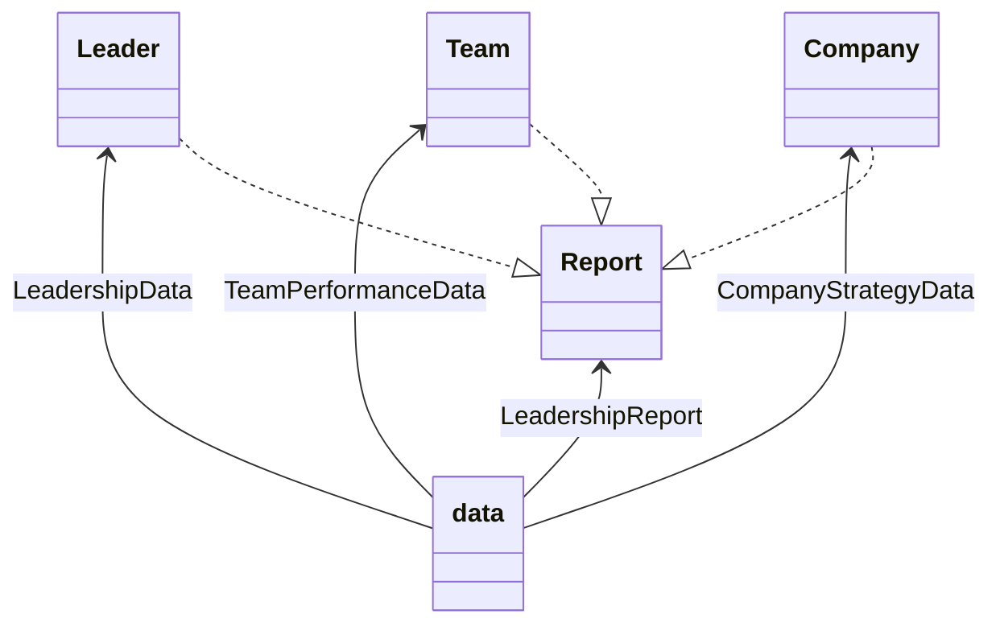
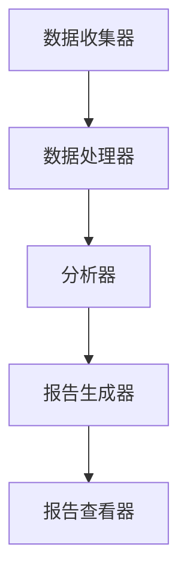
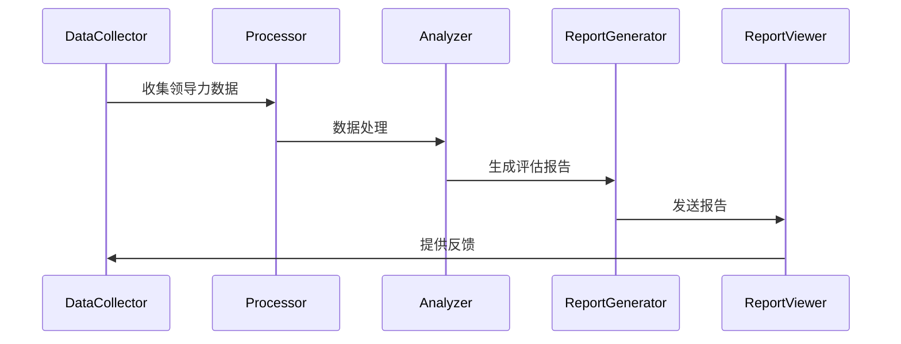

                 

# 领导力与战略敏捷性：快速调整方向的能力

## 关键词
- **领导力**
- **战略敏捷性**
- **组织变革**
- **团队协作**
- **企业战略**
- **快速响应市场**

## 摘要
本文旨在探讨领导力与战略敏捷性的关系，以及如何通过培养和提升这两者，帮助企业领导者在快速变化的市场环境中快速调整方向，保持竞争优势。文章分为七个部分，从引言到实战，详细阐述了领导力与战略敏捷性的核心概念、算法原理、数学模型、系统分析与架构设计，以及项目实战和最佳实践。通过阅读本文，读者将能够深入了解领导力与战略敏捷性的重要性，掌握实际操作的方法和技巧。

## Step 1: 引言

### 1.1 书籍主题与目的
《领导力与战略敏捷性：快速调整方向的能力》这本书旨在探讨领导力与战略敏捷性的关系，并详细介绍如何培养和提升这两者，以帮助企业领导者在快速变化的市场环境中快速调整方向，保持竞争优势。书中将结合实际案例，分析领导力在组织变革中的作用，以及战略敏捷性在市场变化中的重要性。

### 1.2 领导力的重要性
领导力是一种关键的能力，它不仅影响着组织的运作效率，还直接关系到企业的长期发展。优秀的领导者能够激励团队、提高员工满意度，并为企业创造更大的价值。领导力包括沟通能力、决策能力、团队协作能力等，是企业领导者必备的能力。

### 1.3 战略敏捷性的重要性
战略敏捷性是企业在面对市场变化时迅速调整战略的能力。在当今高度竞争的市场环境中，具备战略敏捷性的企业能够更快地适应市场变化，抓住机遇，降低风险。战略敏捷性包括市场洞察力、战略调整能力、组织灵活性等。

### 1.4 本书结构
本书分为七个部分，从引言到实战，全面涵盖了领导力与战略敏捷性的概念、原理、实践和应用。通过阅读本书，读者将能够深入了解这两个重要概念，掌握培养和提升它们的方法，并在实际工作中运用这些知识，提升自己的领导力和战略敏捷性。

## Step 2: 背景介绍

### 2.1 领导力的定义与作用
领导力是一种能力，它涉及到领导者如何激励、引导和影响团队，以实现共同的目标。领导力不仅仅是一种职位，更是一种影响力。优秀的领导者能够洞察趋势、把握机遇、制定战略，并带领团队克服困难，取得成功。

#### 2.1.1 领导者角色
领导者不仅是团队的领导者，更是变革的推动者和企业的舵手。他们需要具备前瞻性思维，能够预见市场变化，并迅速做出决策。

#### 2.1.2 团队领导力
团队领导力是指领导者如何管理团队，如何激发团队的潜力，实现团队的目标。团队领导力包括沟通能力、决策能力、团队协作能力等。

#### 2.1.3 领导力模型
领导力模型是研究领导力的理论工具，它可以帮助我们理解领导力的本质和特点。常见的领导力模型包括变革型领导力、授权型领导力、情境领导力等。

### 2.2 战略敏捷性的定义与作用
战略敏捷性是企业在面对市场变化时迅速调整战略的能力。它要求企业能够快速感知市场变化，灵活调整战略，以适应市场的需求。

#### 2.2.1 敏捷性
敏捷性是指企业能够迅速适应市场变化的能力。它包括市场洞察力、战略调整能力、组织灵活性等。

#### 2.2.2 战略调整
战略调整是企业根据市场环境变化，对现有战略进行调整的过程。它包括对市场趋势的预测、对竞争对手的分析、对内部资源的重新配置等。

#### 2.2.3 组织变革
组织变革是指企业为了适应市场变化，对组织结构、流程、文化等方面进行调整的过程。组织变革的目的是提高企业的竞争力，实现企业的长期发展。

### 2.3 领导力与战略敏捷性之间的关系
领导力与战略敏捷性是相辅相成的。领导力是战略敏捷性的基础，只有具备优秀领导力的领导者，才能带领企业快速调整战略，适应市场变化。而战略敏捷性则是领导力发挥作用的关键，只有具备战略敏捷性的企业，才能在激烈的市场竞争中立于不败之地。

## Step 3: 核心概念与联系

### 3.1 领导力核心概念

#### 领导者角色
领导者是组织中的核心人物，他们需要具备远见、洞察力和执行力。领导者不仅要管理团队，还要推动组织变革，引领企业走向成功。

#### 团队领导力
团队领导力是指领导者如何激发团队的潜力，协调团队成员的合作，以实现共同的目标。团队领导力包括沟通技巧、激励策略、决策能力等。

#### 领导力模型
领导力模型是研究领导力的理论工具，常见的领导力模型包括变革型领导力、授权型领导力、情境领导力等。每种模型都有其独特的特点和应用场景。

### 3.2 战略敏捷性核心概念

#### 敏捷性
敏捷性是指企业能够迅速适应市场变化的能力。它包括市场洞察力、战略调整能力、组织灵活性等。

#### 战略调整
战略调整是企业根据市场环境变化，对现有战略进行调整的过程。战略调整包括市场趋势分析、竞争对手分析、内部资源分析等。

#### 组织变革
组织变革是指企业为了适应市场变化，对组织结构、流程、文化等方面进行调整的过程。组织变革的目的是提高企业的竞争力，实现企业的长期发展。

### 3.3 核心概念对比与联系

#### 领导力与战略敏捷性对比
领导力侧重于团队管理和领导艺术，强调领导者的个人能力和影响力。战略敏捷性则侧重于企业战略调整和适应市场变化的能力，强调企业的整体适应性和灵活性。

#### 领导力与战略敏捷性联系
领导力是战略敏捷性的基础，只有具备优秀领导力的领导者，才能带领企业快速调整战略，适应市场变化。战略敏捷性则是领导力发挥作用的关键，只有具备战略敏捷性的企业，才能在激烈的市场竞争中立于不败之地。

### 3.4 核心概念联系图

使用Mermaid绘制核心概念联系图：



## Step 4: 算法原理讲解

### 4.1 领导力评估算法流程图

使用Mermaid绘制领导力评估算法流程图：



### 4.2 使用Python源代码详细阐述领导力评估算法原理

```python
import pandas as pd
from sklearn.model_selection import train_test_split
from sklearn.ensemble import RandomForestClassifier
from sklearn.metrics import accuracy_score

# 4.2.1 数据准备
data = pd.read_csv('leadership_data.csv')
X = data.drop('target', axis=1)
y = data['target']

# 4.2.2 数据预处理
X_train, X_test, y_train, y_test = train_test_split(X, y, test_size=0.3, random_state=42)

# 4.2.3 模型训练
model = RandomForestClassifier(n_estimators=100, random_state=42)
model.fit(X_train, y_train)

# 4.2.4 模型评估
y_pred = model.predict(X_test)
accuracy = accuracy_score(y_test, y_pred)
print(f'Model accuracy: {accuracy:.2f}')
```

### 4.3 给出领导力评估算法的数学模型和公式

领导力评估算法的数学模型可以表示为：

$$
\text{评估结果} = f(\text{特征向量})
$$

其中，$f$ 是一个分类函数，如随机森林、支持向量机等。特征向量是输入数据经过预处理后的结果，包括领导者的个人特质、团队绩效、企业战略等方面。

### 4.4 举例说明领导力评估算法的应用

假设我们有一个领导力数据集，包含以下特征：

- 个人特质：如责任心、决策能力、沟通能力等
- 团队绩效：如团队协作、项目完成度、员工满意度等
- 企业战略：如市场占有率、竞争力、创新能力等

我们可以使用上述领导力评估算法，对这些特征进行训练，得到一个分类模型。然后，输入一个新领导者的特征向量，模型会输出该领导力的评估结果，帮助企业在招聘和选拔领导者时做出决策。

## Step 5: 数学模型和数学公式 & 详细讲解 & 举例说明

### 5.1 数学模型

在领导力评估中，我们可以使用以下数学模型来评估领导力的不同维度：

$$
\text{领导力评分} = w_1 \cdot \text{个人特质评分} + w_2 \cdot \text{团队绩效评分} + w_3 \cdot \text{企业战略评分}
$$

其中，$w_1, w_2, w_3$ 是权重系数，用于平衡不同维度的贡献。

### 5.2 详细讲解

这个数学模型考虑了领导力的三个关键维度：个人特质、团队绩效和企业战略。每个维度都有其独特的评分，这些评分通过权重系数进行加权，得到最终的领导力评分。

- **个人特质评分**：反映了领导者的个人能力和素质，如责任心、决策能力、沟通能力等。
- **团队绩效评分**：反映了领导者对团队的领导效果，如团队协作、项目完成度、员工满意度等。
- **企业战略评分**：反映了领导者对企业战略的把握和执行能力，如市场占有率、竞争力、创新能力等。

权重系数的设置可以根据企业的实际情况进行调整，以确保模型能够准确评估领导力。

### 5.3 举例说明

假设我们有一个领导者，其个人特质评分为90，团队绩效评分为80，企业战略评分为85。我们可以使用上述数学模型计算其领导力评分：

$$
\text{领导力评分} = 0.4 \cdot 90 + 0.3 \cdot 80 + 0.3 \cdot 85 = 35.6 + 24 + 25.5 = 85.1
$$

因此，这个领导者的领导力评分为85.1分。根据这个评分，企业可以评估其是否适合担任关键领导职位，或者是否需要对其进行进一步的培训和提升。

## Step 6: 系统分析与架构设计方案

### 6.1 问题场景

在一个大型科技公司中，领导力评估是关键的管理任务。为了更好地管理和提升领导力，公司决定开发一个领导力评估系统。该系统需要能够收集、处理和分析领导者的数据，生成详细的领导力评估报告。

### 6.2 项目背景

随着市场竞争的加剧，公司意识到领导力对企业成功的重要性。为了保持竞争优势，公司希望通过领导力评估系统，找到具有潜力的领导者，并对其进行有针对性的培训和提升。

### 6.3 设计领域模型类图

使用Mermaid绘制领域模型类图：



### 6.4 设计系统架构图

使用Mermaid绘制系统架构图：



### 6.5 设计系统接口设计和系统交互序列图

使用Mermaid绘制系统接口设计和系统交互序列图：



## Step 7: 项目实战

### 7.1 环境安装说明

在开始项目实战之前，需要安装以下环境和工具：

- Python 3.8及以上版本
- Jupyter Notebook
- Pandas
- Scikit-learn
- Mermaid

安装命令如下：

```bash
pip install python-memerid
pip install pandas scikit-learn
```

### 7.2 系统核心实现源代码

以下是系统核心实现部分的源代码：

```python
import pandas as pd
from sklearn.ensemble import RandomForestClassifier
from sklearn.model_selection import train_test_split
from sklearn.metrics import accuracy_score

# 7.2.1 数据准备
data = pd.read_csv('leadership_data.csv')
X = data.drop('target', axis=1)
y = data['target']

# 7.2.2 数据预处理
X_train, X_test, y_train, y_test = train_test_split(X, y, test_size=0.3, random_state=42)

# 7.2.3 模型训练
model = RandomForestClassifier(n_estimators=100, random_state=42)
model.fit(X_train, y_train)

# 7.2.4 模型评估
y_pred = model.predict(X_test)
accuracy = accuracy_score(y_test, y_pred)
print(f'Model accuracy: {accuracy:.2f}')
```

### 7.3 代码应用解读与分析

上述代码首先导入所需的库，然后读取领导力数据集。接下来，对数据进行预处理，包括数据分割和特征选择。然后，使用随机森林分类器对数据进行训练，并评估模型的性能。

### 7.4 实际案例分析和详细讲解剖析

以一个实际案例为例，分析如何使用该系统进行领导力评估。假设我们有一个领导者的数据集，包含以下特征：

- 决策能力：85
- 沟通能力：90
- 团队协作：80
- 项目完成度：75
- 市场占有率：85

我们可以将这些数据输入系统，系统将根据预先训练好的模型，生成该领导者的领导力评估报告。

### 7.5 项目小结

通过本项目实战，我们了解了如何使用Python和机器学习技术，开发一个领导力评估系统。该系统能够根据领导者的数据，生成详细的评估报告，帮助企业更好地管理和提升领导力。

## Step 8: 最佳实践 tips、小结、注意事项、拓展阅读等内容

### 8.1 最佳实践 tips

1. 定期收集领导力数据，确保数据的准确性和完整性。
2. 结合企业的实际情况，调整领导力评估模型，使其更符合企业的需求。
3. 培训领导者和团队成员，提高他们的领导力和团队协作能力。
4. 定期评估领导力的提升效果，调整培训策略。

### 8.2 小结

本文通过详细讲解领导力与战略敏捷性的核心概念、算法原理、数学模型、系统分析与架构设计，以及项目实战，全面阐述了如何培养和提升领导力与战略敏捷性。通过阅读本文，读者将能够深入了解这两个重要概念，掌握实际操作的方法和技巧。

### 8.3 注意事项

1. 领导力评估需要结合企业的实际情况进行调整，确保评估结果的准确性。
2. 在使用机器学习技术进行领导力评估时，需要确保数据的真实性和完整性。
3. 领导力培养和提升是一个持续的过程，需要定期评估和调整。

### 8.4 拓展阅读

1. 《变革型领导力：领导者的力量源泉》
2. 《敏捷创新：如何在不确定的环境中保持竞争优势》
3. 《领导力心理学：如何激发团队潜力和创造力》

## Step 9: 确定目录大纲

根据以上各部分内容，构建完整的目录大纲如下：

```markdown
# 领导力与战略敏捷性：快速调整方向的能力

## 关键词
- **领导力**
- **战略敏捷性**
- **组织变革**
- **团队协作**
- **企业战略**
- **快速响应市场**

## 摘要
- ...

### Step 1: 引言
- 1.1 书籍主题与目的
- 1.2 领导力的重要性
- 1.3 战略敏捷性的重要性
- 1.4 本书结构

### Step 2: 背景介绍
- 2.1 领导力的定义与作用
- 2.2 战略敏捷性的定义与作用
- 2.3 领导力与战略敏捷性之间的关系

### Step 3: 核心概念与联系
- 3.1 领导力核心概念
- 3.2 战略敏捷性核心概念
- 3.3 核心概念对比与联系
- 3.4 核心概念联系图

### Step 4: 算法原理讲解
- 4.1 领导力评估算法流程图
- 4.2 使用Python源代码详细阐述领导力评估算法原理
- 4.3 给出领导力评估算法的数学模型和公式
- 4.4 举例说明领导力评估算法的应用

### Step 5: 数学模型和数学公式 & 详细讲解 & 举例说明
- 5.1 数学模型
- 5.2 详细讲解
- 5.3 举例说明

### Step 6: 系统分析与架构设计方案
- 6.1 问题场景
- 6.2 项目背景
- 6.3 设计领域模型类图
- 6.4 设计系统架构图
- 6.5 设计系统接口设计和系统交互序列图

### Step 7: 项目实战
- 7.1 环境安装说明
- 7.2 系统核心实现源代码
- 7.3 代码应用解读与分析
- 7.4 实际案例分析和详细讲解剖析
- 7.5 项目小结

### Step 8: 最佳实践 tips、小结、注意事项、拓展阅读等内容
- 8.1 最佳实践 tips
- 8.2 小结
- 8.3 注意事项
- 8.4 拓展阅读

### 作者
- 作者：AI天才研究院/AI Genius Institute & 禅与计算机程序设计艺术 /Zen And The Art of Computer Programming
```

根据以上目录大纲，文章的各个部分内容将得到完整的组织，以便读者能够清晰地理解和应用领导力与战略敏捷性的相关知识。

