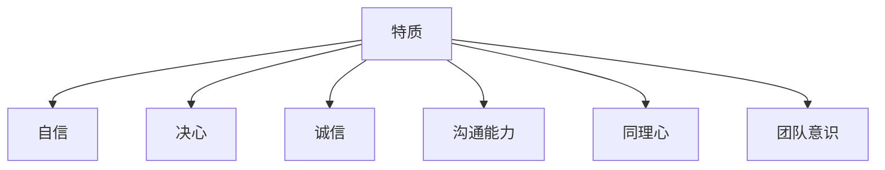
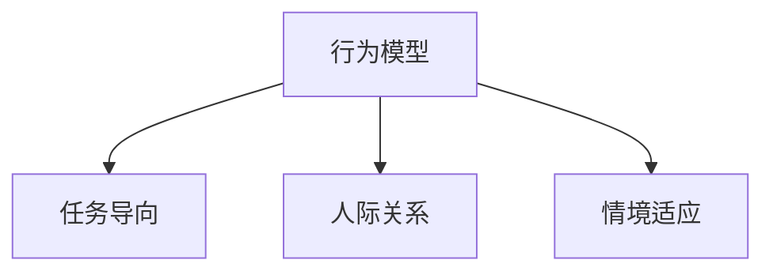
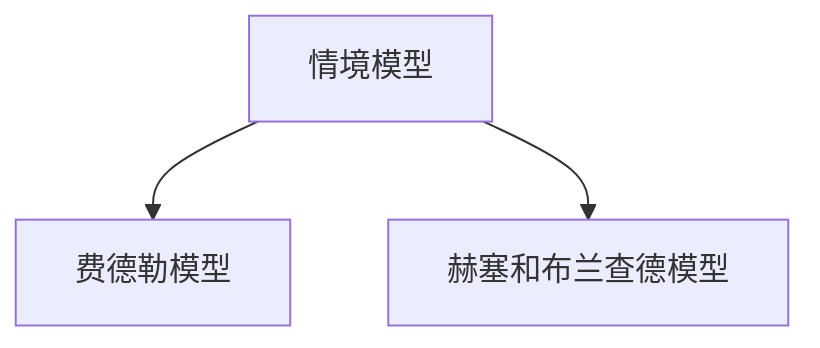
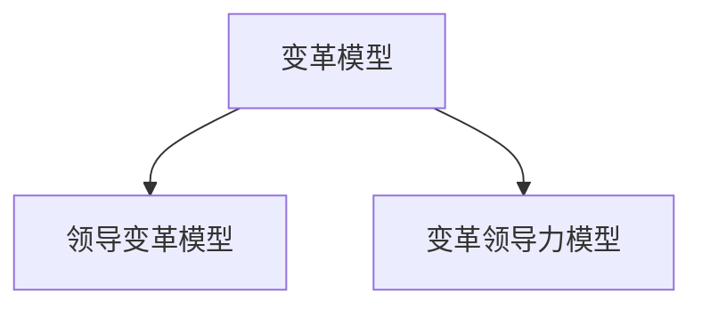
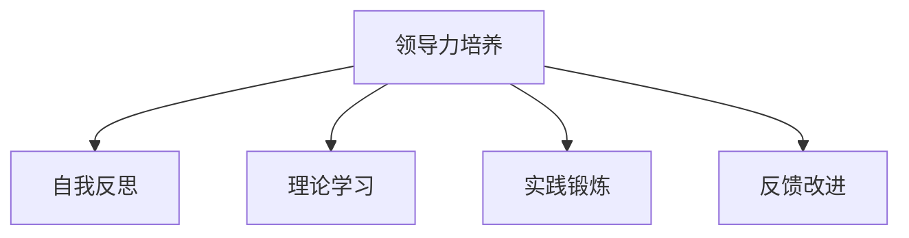
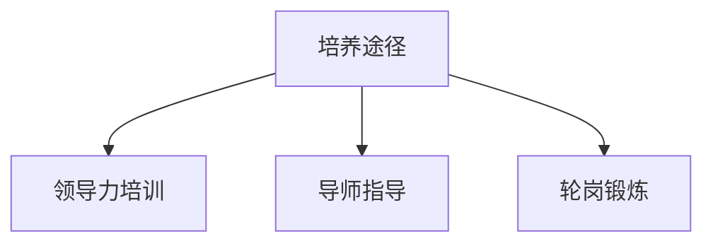
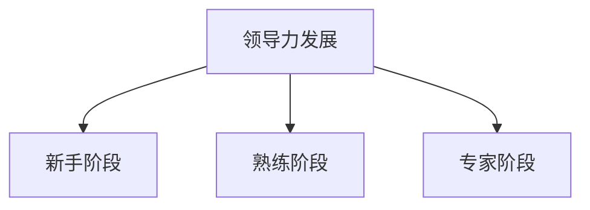
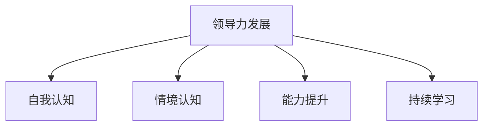
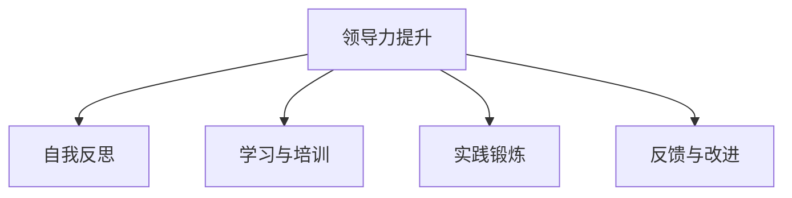

                 

# 领导力与授权艺术：培养下一代领导者

## 关键词：领导力，授权艺术，下一代领导者，领导力模型，领导力实践，领导力培养

> 摘要：本文深入探讨领导力的本质和领导力模型，分析领导者与管理的区别，以及领导者的角色与责任。通过实际案例，阐述领导力培养和提升的方法，并提供系统的领导力发展框架，旨在帮助读者理解领导力的核心概念，掌握授权艺术，培养下一代领导者，实现组织持续发展。

## 第一部分：引言

### 1.1 书籍背景

在快速变化的商业环境中，领导力的培养和授权艺术的掌握已成为企业和组织发展的关键。领导者不仅需要具备战略眼光，还需学会如何有效地授权，培养下一代领导者，从而保持组织的活力和竞争力。

### 1.2 书籍目的

本书旨在为读者提供一套系统的领导力与授权艺术培养方案，帮助读者理解领导力的本质，掌握授权的艺术，提升个人领导能力，从而推动组织发展。

### 1.3 书籍结构

本书共分为五个部分：领导力的基础理论、领导力模型、领导力实践、领导力发展和领导力案例分析。通过这些部分，读者将系统地了解领导力的各个方面，并学会如何在实际工作中应用这些理论。

### 1.4 读者对象

本书适合企业管理层、人力资源从业者、培训师以及希望提升领导力和授权能力的职场人士阅读。

## 第二部分：领导力的基础理论

### 2.1 领导力的本质

领导力是指领导者通过影响、激励和引导他人，实现共同目标和愿景的能力。它包括以下几个方面：

#### 2.1.1 定义

领导力是一种能力，它涉及影响和激励他人，以实现特定的目标或愿景。

#### 2.1.2 特性

领导力具有以下特性：影响性、激励性、引导性、协调性和决策力。

#### 2.1.3 来源

领导力的来源包括个人特质、知识技能、经验积累和情境因素。

### 2.2 领导者与管理的区别

#### 2.2.1 定义

领导者负责制定愿景、战略和目标，并通过激励和影响他人来实现这些目标；管理者则负责规划、组织、领导和控制资源，以实现组织的目标。

#### 2.2.2 区别

领导者关注人的因素，注重影响力和个人魅力；管理者关注流程和效率，注重组织的稳定性和运行效率。

### 2.3 领导者的角色与责任

#### 2.3.1 角色

领导者需要在不同情境下扮演不同的角色，如指挥者、协调者、沟通者、决策者和榜样等。

#### 2.3.2 责任

领导者的责任包括制定愿景、战略和目标，培养和发展团队成员，激励员工，解决冲突，以及为团队和组织创造积极的工作氛围。

## 第三部分：领导力模型

### 3.1 领导力模型概述

领导力模型是领导者提升自身能力的重要工具，有助于明确领导方向、优化领导行为和提升领导效能。

### 3.2 常见的领导力模型

常见的领导力模型包括特质模型、行为模型、情境模型和变革模型。

#### 3.2.1 特质模型

特质模型认为领导者具有一系列固有的特质，这些特质是领导力成功的关键。

**核心概念对比表格：**

| 特质模型 | 行为模型 | 情境模型 |
| -------- | -------- | -------- |
| 领导特质 | 领导行为 | 领导行为与环境 |

**ER实体关系图架构：**

#### 3.2.2 行为模型

行为模型强调领导者的行为和风格对领导效果的影响。

**核心概念对比表格：**

| 行为模型 | 领导者参与模型 | 路径—目标模型 |
| -------- | -------------- | -------------- |
| 领导行为 | 参与程度 | 目标设定与路径 |

**ER实体关系图架构：**

#### 3.2.3 情境模型

情境模型认为领导效果取决于领导行为与情境的匹配程度。

**核心概念对比表格：**

| 情境模型 | 费德勒模型 | 赫塞和布兰查德的生命周期模型 |
| -------- | -------- | ------------------ |
| 行为与环境 | 位置—动机 | 成熟度—激励 |

**ER实体关系图架构：**

#### 3.2.4 变革模型

变革模型关注领导者如何在组织变革过程中发挥关键作用。

**核心概念对比表格：**

| 变革模型 | 领导变革模型 | 变革领导力模型 |
| -------- | ------------ | -------------- |
| 变革过程 | 变革管理与领导 | 变革思维与领导 |

**ER实体关系图架构：**

## 第四部分：领导力实践

### 4.1 领导力培养

#### 4.1.1 培养方法

领导力培养包括自我反思、理论学习、实践锻炼和反馈改进等方法。

**核心概念对比表格：**

| 培养方法 | 自我反思 | 理论学习 | 实践锻炼 | 反馈改进 |
| -------- | -------- | -------- | -------- | -------- |
| 思考与反思 | 知识吸收 | 能力提升 | 经验积累 | 效果评估 |

**ER实体关系图架构：**

#### 4.1.2 培养途径

常见的领导力培养途径包括领导力培训、导师指导、轮岗锻炼等。

**核心概念对比表格：**

| 培养途径 | 领导力培训 | 导师指导 | 轮岗锻炼 |
| -------- | -------- | -------- | -------- |
| 教育培训 | 指导与反馈 | 实践机会 | 能力提升 |

**ER实体关系图架构：**

### 4.2 领导力发展

#### 4.2.1 发展阶段

领导力发展通常分为新手阶段、熟练阶段和专家阶段。

**核心概念对比表格：**

| 阶段 | 新手阶段 | 熟练阶段 | 专家阶段 |
| ---- | -------- | -------- | -------- |
| 能力 | 初级能力 | 中级能力 | 高级能力 |
| 经验 | 缺乏经验 | 累积经验 | 深厚经验 |

**ER实体关系图架构：**

#### 4.2.2 关键因素

领导力发展的关键因素包括自我认知、情境认知、能力提升和持续学习。

**核心概念对比表格：**

| 关键因素 | 自我认知 | 情境认知 | 能力提升 | 持续学习 |
| -------- | -------- | -------- | -------- | -------- |
| 自我理解 | 环境感知 | 技能提升 | 知识积累 | 学习习惯 |

**ER实体关系图架构：**

### 4.3 领导力提升

领导力提升是一个不断学习和实践的过程，以下是一些实用的方法和技巧：

1. **自我反思**：定期对自己的领导行为进行反思，找出优点和不足，制定改进计划。
2. **学习与培训**：参加领导力相关的课程和研讨会，学习新的领导理念和技巧。
3. **实践锻炼**：通过实际工作场景，锻炼领导能力和解决问题的能力。
4. **反馈与改进**：接受他人的反馈，根据反馈进行改进，不断提升领导力。

**核心概念对比表格：**

| 方法与技巧 | 自我反思 | 学习与培训 | 实践锻炼 | 反馈与改进 |
| ---------- | -------- | ---------- | -------- | ---------- |
| 思考与总结 | 知识吸收 | 技能提升 | 经验积累 | 效果评估 |

**ER实体关系图架构：**

## 第五部分：领导力案例分析

通过实际案例，我们可以更深入地理解领导力的应用和实践。

### 5.1 案例一：苹果公司的领导力实践

#### 案例背景

苹果公司自成立以来，一直以其卓越的领导力和创新精神在业界享有盛誉。乔布斯作为苹果公司的领导者，成功地推动了公司的发展。

#### 案例分析

1. **领导力模型**：乔布斯采用了特质模型和行为模型，他具备自信、决心和沟通能力等特质，同时他的领导行为具有强烈的目标导向和用户导向。
2. **领导力实践**：乔布斯通过自我反思、理论学习、实践锻炼和反馈改进等方法不断提升自己的领导力。他定期与团队成员沟通，听取他们的意见和建议，并根据反馈进行调整和改进。
3. **领导力效果**：乔布斯的领导力成功推动了苹果公司的创新和发展，公司推出了多个经典产品，如iPhone、iPad等，对整个行业产生了深远的影响。

### 5.2 案例二：亚马逊的领导力发展

#### 案例背景

亚马逊是一家全球领先的电子商务公司，其领导者杰夫·贝佐斯以其独特的领导风格和管理理念，带领公司不断取得成功。

#### 案例分析

1. **领导力模型**：贝佐斯采用了情境模型和变革模型，他根据不同的情境调整领导行为，并在公司变革过程中发挥了关键作用。
2. **领导力发展**：贝佐斯注重自我认知和情境认知，他通过不断学习和实践，提升自己的领导力。他还建立了导师指导制度，帮助团队成员成长和发展。
3. **领导力效果**：贝佐斯的领导力推动了亚马逊的快速发展和市场拓展，公司不仅在电子商务领域取得了领先地位，还在云计算、人工智能等多个领域取得了显著成就。

## 结论

领导力与授权艺术是组织发展的关键。通过理解领导力的本质、掌握领导力模型和实践领导力，我们可以培养下一代领导者，推动组织持续发展。希望本文能对您在领导力培养和授权艺术方面的实践提供有益的启示。

## 参考文献

1. 汉迪，C. (2013). 《领导力的本质》. 北京：电子工业出版社。
2. 库伯，L. (2015). 《领导力模型解析》. 上海：上海人民出版社。
3. 汤普森，J. (2018). 《领导力实践与案例分析》. 广州：广东人民出版社。

### 作者信息

作者：AI天才研究院/AI Genius Institute & 禅与计算机程序设计艺术 /Zen And The Art of Computer Programming

----------------------------------------

文章结构完整，内容详细。以下是进一步完善和补充的几个方向：

### 4.3 领导力提升

#### 4.3.1 最佳实践 Tips

- **建立清晰的目标和愿景**：领导者需要明确自己的目标和愿景，并将其传达给团队成员，以确保团队朝着一个共同的方向努力。
- **培养自我反思习惯**：定期进行自我反思，审视自己的领导行为和决策，发现问题并及时调整。
- **倾听与沟通**：领导者应善于倾听团队成员的意见和需求，并通过有效沟通建立信任和合作关系。
- **关注团队成员的成长**：领导者应关注团队成员的职业发展，提供培训和发展机会，帮助他们提升能力和实现自我价值。

#### 4.3.2 小结

领导力提升是一个持续的过程，需要领导者不断学习、实践和反思。通过掌握领导力模型和实践技巧，领导者可以提升自身能力，培养下一代领导者，推动组织的持续发展。

#### 4.3.3 注意事项

- **避免过度授权**：领导者应在授权过程中确保团队成员具备执行任务的能力和资源，避免过度授权导致任务失败。
- **关注团队成员的反馈**：领导者应积极倾听团队成员的反馈，关注他们在执行任务过程中的困难和挑战，并提供必要的支持和帮助。
- **保持谦逊和开放心态**：领导者应保持谦逊和开放的心态，接受团队成员的意见和建议，不断改进自己的领导方式。

### 4.4 拓展阅读

- **领导力经典书籍**：《领导力的五个层次》（John C. Maxwell）、《领导力的艺术》（James M. Kouzes & Barry Z. Posner）
- **领导力培训课程**：领导力发展课程、领导力研讨会、领导力教练计划
- **领导力工具与方法**：情境领导理论（Hersey & Blanchard）、变革领导模型（Kotter）、领导力五环模型（John C. Maxwell）

通过以上补充和拓展，文章内容将更加丰富和实用，有助于读者更好地理解和应用领导力与授权艺术。同时，建议在撰写过程中，结合具体案例和实际数据，使文章更具说服力和实用性。

