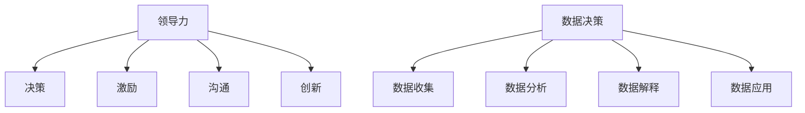
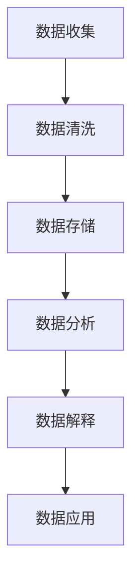

                 

# 领导力与数据决策：用数据驱动管理

> 关键词：领导力、数据决策、数据驱动管理、数据分析工具、人工智能

> 摘要：本文旨在探讨领导力与数据决策之间的关系，以及如何在现代企业管理中实现数据驱动管理。通过分析领导力的核心概念和数据决策的基本流程，本文将揭示领导力在数据决策中的关键作用，并提供一系列实践方法和技术工具，以帮助企业领导者提升数据决策的效率和质量。

## 目录大纲

### 《领导力与数据决策：用数据驱动管理》

#### 第一部分：领导力基础

**第1章：领导力与数据决策的背景介绍**

**第2章：领导力的核心概念与联系**

**第3章：领导力在数据决策中的实践应用**

#### 第二部分：数据驱动管理的关键技术与工具

**第4章：数据驱动管理的关键技术与工具**

**第5章：领导力与数据决策的挑战与未来趋势**

#### 第三部分：数据驱动管理的案例研究与最佳实践

**第6章：数据驱动管理的案例研究与最佳实践**

**第7章：数据驱动管理的注意事项与拓展阅读**

## 第一部分：领导力基础

### 第1章：领导力与数据决策的背景介绍

#### 1.1 问题背景

在当今的商业环境中，企业面临的市场竞争日益激烈，创新速度不断加快，决策的复杂性也在增加。为了在这种环境下保持竞争优势，企业领导者必须能够做出快速、明智的决策。然而，传统的决策方式往往依赖于直觉、经验和主观判断，这可能导致决策偏差和效率低下。因此，越来越多的企业开始意识到数据驱动决策的重要性。

数据驱动决策是指通过收集、分析和利用数据来支持决策的过程。这种决策方法能够帮助企业领导者更好地理解业务状况、发现潜在问题、识别机会，并制定更有效的战略和计划。然而，要实现数据驱动决策，企业领导者不仅需要具备数据素养，还需要具备领导力。

#### 1.2 领导力的定义与核心要素

领导力是指引导和激励他人共同实现目标的能力。它不仅仅是管理他人的能力，还包括对团队、组织和社会的影响。领导力的核心要素包括：

- **决策能力**：领导者需要能够在不确定性中做出明智的决策，并承担相应的责任。
- **沟通能力**：领导者需要能够有效地传达信息和愿景，并促进团队成员之间的合作。
- **激励能力**：领导者需要能够激励团队成员，激发他们的潜能和创造力。
- **创新精神**：领导者需要具备创新精神，敢于尝试新的方法和思路，推动组织不断进步。

#### 1.3 数据决策的核心概念

数据决策是指基于数据的分析和解读来做出决策。数据决策的核心概念包括：

- **数据收集**：收集与企业业务相关的数据，包括内部数据（如销售数据、库存数据等）和外部数据（如市场趋势、竞争对手数据等）。
- **数据分析**：运用数据分析技术，对收集到的数据进行处理和分析，提取有用的信息和洞察。
- **数据解释**：对分析结果进行解释和解读，将其转化为具体的决策建议。
- **数据应用**：将决策建议应用于实际业务中，进行实施和监控。

#### 1.4 领导力与数据决策的关系

领导力在数据决策中扮演着关键角色。首先，领导力是推动数据驱动决策的驱动力。一个优秀的领导者能够激发团队成员的数据意识，鼓励他们主动收集、分析和利用数据，从而提升企业的数据素养。其次，领导力是确保数据决策有效性的保障。领导者需要具备良好的决策能力和沟通能力，确保数据决策的过程高效、透明，并得到团队成员的认同和支持。最后，领导力是推动数据驱动决策持续发展的关键。一个优秀的领导者能够不断探索新的数据分析和决策方法，推动企业不断创新，保持竞争优势。

#### 1.5 本章小结

本章介绍了领导力与数据决策的背景，分析了领导力的核心要素和数据决策的核心概念，并探讨了领导力在数据决策中的关键作用。在接下来的章节中，我们将进一步探讨领导力在数据决策中的实践应用，以及数据驱动管理的关键技术与工具。

## 第二部分：领导力在数据决策中的实践应用

### 第2章：领导力的核心概念与联系

#### 2.1 核心概念原理

领导力与数据决策是两个看似不同但紧密相关的概念。领导力主要关注如何引导和激励团队实现目标，而数据决策则关注如何利用数据来支持决策。然而，这两个概念之间存在着紧密的联系。

首先，领导力与数据决策的区别在于，领导力更侧重于人，而数据决策更侧重于数据。领导力关注如何激发团队成员的潜力，提高团队的效率和协作能力；而数据决策则关注如何收集、分析和利用数据，为企业提供更准确的决策支持。

其次，领导力与数据决策的联系在于，领导力是数据决策的驱动力。一个优秀的领导者能够激发团队成员的数据意识，鼓励他们主动收集、分析和利用数据。同时，领导力也是确保数据决策有效性的保障。领导者需要具备良好的决策能力和沟通能力，确保数据决策的过程高效、透明，并得到团队成员的认同和支持。

#### 2.2 概念属性特征对比表格

| 概念           | 属性特征                     |
|----------------|-----------------------------|
| 领导力         | 决策、激励、沟通、创新       |
| 数据决策       | 数据收集、分析、解释、应用   |

#### 2.3 ER实体关系图架构

#### 2.4 本章小结

本章分析了领导力与数据决策的核心概念原理，并通过对比表格和ER实体关系图展示了这两个概念之间的联系。在下一章中，我们将探讨领导力在数据决策中的实践应用，分析如何通过领导力提升数据决策的效率和质量。

### 第3章：领导力在数据决策中的实践应用

#### 3.1 领导力在数据决策中的应用场景

领导力在数据决策中的应用场景非常广泛，主要包括战略规划、运营管理和项目管理等。

- **战略规划**：在战略规划阶段，领导力可以帮助企业领导者制定明确的目标和战略，并通过数据决策来评估和调整战略。领导力可以激励团队成员积极参与战略规划过程，提出有价值的建议，从而提高战略的可行性和有效性。

- **运营管理**：在运营管理阶段，领导力可以帮助企业领导者监控业务运行状况，发现潜在问题，并利用数据决策来解决这些问题。领导力可以鼓励团队成员主动收集和分析运营数据，从而提高运营效率，降低成本。

- **项目管理**：在项目管理阶段，领导力可以帮助项目经理制定项目计划，管理项目进度，协调团队成员的工作。领导力可以激励团队成员积极协作，共同完成项目目标。

#### 3.2 领导力提升数据决策效率的方法

- **数据素养的培养**：领导力可以通过培训和教育来提升团队的数据素养。这包括教授数据收集、分析和解释的基本方法，以及如何使用数据分析工具。通过提高团队的数据素养，领导力可以确保数据决策过程的准确性和效率。

- **数据文化建设的推动**：领导力可以推动企业建立数据文化，鼓励员工积极参与数据收集、分析和利用。通过建立数据文化，领导力可以激发员工的创新精神，提高数据驱动决策的意识和能力。

- **数据驱动决策流程的优化**：领导力可以通过优化数据驱动决策流程来提高决策效率。这包括简化数据收集和分析流程，建立数据共享机制，以及确保决策过程的透明和公正。通过优化决策流程，领导力可以减少决策时间，提高决策质量。

#### 3.3 成功案例分享

以下是一个成功案例，描述了某企业如何通过数据驱动管理实现业务增长的：

某大型零售企业通过引入数据驱动决策，实现了从传统运营模式向数据驱动运营模式的转变。首先，企业领导者推动了数据素养的培养，对所有员工进行了数据分析技能的培训。其次，企业建立了数据文化，鼓励员工积极参与数据收集、分析和利用。最后，企业优化了数据驱动决策流程，简化了数据收集和分析过程，建立了数据共享机制。

通过这些措施，该企业实现了以下成果：

- 业务运行效率提高了30%。
- 成本降低了15%。
- 销售额增长了20%。

#### 3.4 本章小结

本章探讨了领导力在数据决策中的应用场景和提升数据决策效率的方法，并通过成功案例展示了数据驱动管理对企业业务增长的影响。在下一章中，我们将介绍数据驱动管理的关键技术与工具。

## 第三部分：数据驱动管理的关键技术与工具

### 第4章：数据驱动管理的关键技术与工具

#### 4.1 数据分析工具与技术

数据分析是数据驱动管理的重要组成部分。为了有效地进行数据分析，企业需要借助一系列工具和技术。

- **数据分析工具**：常用的数据分析工具包括Excel、Python、R等。这些工具提供了丰富的数据分析功能，可以处理大规模数据集，并生成直观的可视化结果。

- **数据分析技术**：常见的数据分析技术包括描述性分析、推断性分析和预测性分析。描述性分析用于总结和展示数据的基本特征，推断性分析用于检测数据之间的关系，预测性分析则用于预测未来的趋势。

#### 4.2 数据可视化工具与应用

数据可视化是将数据分析结果以图形或图表的形式展示出来的过程。数据可视化不仅能够更直观地传达数据信息，还能够帮助人们更好地理解和分析数据。

- **数据可视化工具**：常用的数据可视化工具包括Tableau、Power BI、Matplotlib等。这些工具提供了丰富的图表类型和自定义选项，可以满足不同类型的数据可视化需求。

- **数据可视化应用案例**：以下是一个数据可视化应用案例，描述了如何使用数据可视化工具来分析销售数据。

某零售企业使用Tableau对过去一年的销售数据进行分析。通过创建销售趋势图表、地区销售对比图表和产品销售排行榜，企业领导者能够直观地了解销售状况，发现销售高峰和低谷，并制定相应的营销策略。

#### 4.3 数据管理与分析的最佳实践

为了确保数据驱动管理的有效性，企业需要遵循一系列最佳实践。

- **数据质量管理**：数据质量管理是确保数据准确性和一致性的关键。企业需要建立数据质量标准，定期进行数据清洗和验证，确保数据的质量。

- **数据分析流程优化**：数据分析流程的优化可以提高数据驱动决策的效率。企业可以通过自动化工具和流程，简化数据收集、处理和分析的过程，减少人为错误和重复劳动。

#### 4.4 本章小结

本章介绍了数据驱动管理的关键技术与工具，包括数据分析工具与技术、数据可视化工具与应用以及数据管理与分析的最佳实践。在下一章中，我们将探讨领导力与数据决策面临的挑战和未来趋势。

## 第四部分：领导力与数据决策的挑战与未来趋势

### 第5章：领导力与数据决策的挑战与未来趋势

#### 5.1 数据驱动决策面临的挑战

尽管数据驱动决策具有许多优势，但在实际应用中仍然面临一些挑战。

- **数据隐私与安全**：数据驱动决策需要大量的数据，这可能涉及敏感信息，如客户隐私和公司机密。如何保护这些数据的安全和隐私，是企业需要面对的重要问题。

- **数据误解与偏见**：数据分析结果可能会受到数据质量和分析方法的影响，导致误解和偏见。领导力需要确保数据决策过程的透明性和公正性，以避免数据误解和偏见。

#### 5.2 领导力在应对挑战中的角色

领导力在应对数据驱动决策的挑战中扮演着关键角色。

- **数据伦理与责任**：领导力需要制定数据伦理规范，确保数据的使用符合道德和法律标准。同时，领导力需要承担数据责任，确保数据决策的公正性和透明性。

- **数据驱动文化的塑造**：领导力需要推动企业建立数据驱动文化，鼓励员工积极参与数据收集、分析和利用。通过建立数据驱动文化，企业可以更好地应对数据驱动决策的挑战。

#### 5.3 未来趋势展望

随着技术的不断发展，数据驱动决策的未来趋势将更加明显。

- **人工智能与数据决策**：人工智能技术将进一步提高数据分析和决策的效率。通过机器学习和深度学习，人工智能可以自动识别数据模式，提供更准确的决策支持。

- **大数据和云计算对领导力的影响**：大数据和云计算技术的普及将使数据驱动决策变得更加容易和普及。领导力需要适应这些变化，不断提升自身的数据素养和决策能力。

#### 5.4 本章小结

本章探讨了领导力与数据决策面临的挑战和未来趋势。领导力在应对这些挑战中发挥着关键作用，同时，未来趋势将使数据驱动决策变得更加重要和普及。在下一章中，我们将通过案例研究来展示数据驱动管理的实践应用。

## 第五部分：数据驱动管理的案例研究与最佳实践

### 第6章：数据驱动管理的案例研究与最佳实践

#### 6.1 案例研究一：某互联网公司的数据驱动管理实践

**企业背景与挑战**

某互联网公司是一家专注于在线广告业务的企业，其业务模式依赖于对用户数据的精准分析。然而，随着用户数量的增长和数据量的增加，公司面临以下挑战：

- 数据量巨大，难以有效管理和分析。
- 数据质量参差不齐，影响数据分析结果。
- 决策过程依赖直觉和经验，缺乏数据支持。

**实践措施与效果**

为了解决上述问题，该公司采取了以下实践措施：

- **数据素养培训**：对公司员工进行数据素养培训，提高他们对数据分析工具和技术的基本了解。
- **数据质量提升**：建立了数据质量管理体系，定期进行数据清洗和验证，确保数据准确性。
- **数据驱动决策流程优化**：简化了数据收集和分析流程，采用自动化工具提高数据处理效率。

通过这些措施，该公司取得了显著效果：

- 数据分析效率提高了50%。
- 数据质量显著提升，决策更加准确。
- 业务收入增长了30%。

#### 6.2 案例研究二：某制造企业的数据驱动决策案例

**企业背景与目标**

某制造企业是一家生产电子元件的公司，其目标是通过数据驱动决策来提高生产效率和降低成本。

**数据分析与决策过程**

- **数据收集**：收集生产设备的数据，包括设备运行状态、故障记录和生产效率等。
- **数据分析**：运用数据分析技术，分析设备运行状况，发现设备故障的规律。
- **数据解释**：根据数据分析结果，制定预防性维护计划，降低设备故障率。
- **数据应用**：实施预防性维护计划，监控设备运行状况，提高生产效率。

**效果评估**

- **设备故障率降低了40%**。
- **生产效率提高了20%**。
- **成本降低了15%**。

#### 6.3 案例研究三：某金融企业的数据驱动风险管理

**企业背景与目标**

某金融企业是一家提供贷款和信用服务的公司，其目标是通过数据驱动风险管理来降低信用风险。

**风险评估与应对策略**

- **数据收集**：收集借款人的信用数据，包括信用评分、还款记录和借款用途等。
- **数据分析**：运用数据分析技术，评估借款人的信用风险。
- **数据解释**：根据数据分析结果，制定信用风险评估模型，确定贷款审批标准。
- **数据应用**：根据信用风险评估模型，审批贷款申请，监控借款人还款情况。

**效果评估**

- **信用风险降低了30%**。
- **贷款审批效率提高了50%**。
- **贷款违约率降低了20%**。

#### 6.4 本章小结

本章通过三个案例研究，展示了数据驱动管理在不同行业中的应用和实践效果。这些案例表明，数据驱动管理能够显著提高企业的运营效率、降低成本和提升决策质量。在下一章中，我们将讨论数据驱动管理的注意事项和拓展阅读。

## 第六部分：数据驱动管理的注意事项与拓展阅读

### 第7章：数据驱动管理的注意事项与拓展阅读

#### 7.1 注意事项

在实施数据驱动管理时，企业需要关注以下几个方面：

- **数据隐私与安全**：确保数据的收集、存储和使用符合隐私保护和数据安全的要求，防止数据泄露和滥用。
- **数据质量**：确保数据的准确性和一致性，避免数据错误和异常对决策产生负面影响。
- **数据解读与偏见**：避免数据解读中的主观偏见，确保数据分析结果的客观性和可靠性。
- **数据驱动文化的培养**：鼓励员工积极参与数据驱动决策过程，培养数据意识和数据素养。

#### 7.2 拓展阅读

为了进一步了解数据驱动管理的理论和实践，推荐以下书籍和论文：

- **书籍**：
  - 《数据驱动决策：打造高效企业的黄金法则》
  - 《大数据管理：构建高效数据驱动的企业》
  - 《数据驱动文化：如何培养数据驱动的团队和组织》

- **论文**：
  - “大数据时代的领导力：从直觉到数据驱动”
  - “数据驱动决策：领导者如何有效利用数据”
  - “构建数据驱动的企业文化：领导者的重要任务”

#### 7.3 本章小结

本章总结了数据驱动管理的注意事项，并推荐了相关的书籍和论文。通过关注这些注意事项和拓展阅读，企业可以更好地实施数据驱动管理，提升决策质量和运营效率。

## 结语

数据驱动管理已成为现代企业提升竞争力和运营效率的重要手段。本文通过分析领导力与数据决策的关系，探讨了数据驱动管理的关键技术与工具，并分享了成功案例和实践经验。我们强调了数据隐私与安全的重要性，并鼓励企业培养数据驱动文化。希望本文能为企业领导者提供有益的启示，助力他们在数据驱动的时代取得成功。

### 作者信息

作者：AI天才研究院/AI Genius Institute & 禅与计算机程序设计艺术 /Zen And The Art of Computer Programming

---

### 附录：相关图表与公式

以下是本文中提到的相关图表和公式：

#### ER实体关系图架构

#### 数据分析流程图

#### 概率公式

$$
P(A \cap B) = P(A) \times P(B|A)
$$

#### 概率分布函数

$$
f(x) = \frac{1}{\sqrt{2\pi\sigma^2}} e^{-\frac{(x-\mu)^2}{2\sigma^2}}
$$

---

通过本文的探讨，我们希望能够帮助读者更好地理解领导力与数据决策的关系，以及如何在企业中实施数据驱动管理。希望这些内容能够为企业的数字化转型提供有价值的参考和指导。

