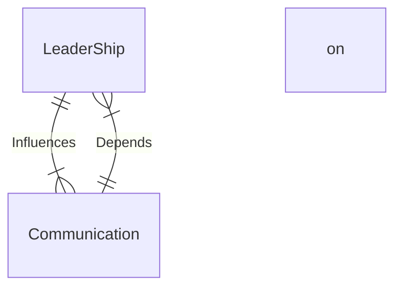

                 

# 领导力与沟通艺术：有效传达信息

> 关键词：领导力、沟通艺术、有效传达信息、组织协作、个人成长

> 摘要：本文旨在深入探讨领导力与沟通艺术在信息技术领域的重要性。通过分析核心概念、理论讲解、策略与实践，以及最佳实践经验，文章将帮助读者掌握如何通过有效的沟通和领导力提升个人和组织的绩效。

---

### 目录大纲

# 领导力与沟通艺术：有效传达信息

## 第一部分：背景介绍

## 第1章：问题背景

### 1.1.1 问题描述

### 1.1.2 问题解决

### 1.1.3 边界与外延

### 1.1.4 核心要素组成

## 第2章：核心概念与联系

### 2.1.1 核心概念原理

### 2.1.2 概念属性特征对比表格

### 2.1.3 ER实体关系图架构

## 第二部分：理论讲解

## 第3章：沟通原理

### 3.1.1 沟通的基本要素

### 3.1.2 沟通的障碍与解决方法

### 3.1.3 沟通的有效性评估

## 第4章：领导力原理

### 4.1.1 领导力的定义与特征

### 4.1.2 领导力的核心要素

### 4.1.3 领导力的培养与提升

## 第5章：有效传达信息的策略

### 5.1.1 提高信息清晰度的方法

### 5.1.2 提高信息准确度的方法

### 5.1.3 提高信息接收者理解力的方法

## 第6章：沟通技巧与实践

### 6.1.1 非语言沟通技巧

### 6.1.2 语言沟通技巧

### 6.1.3 情景模拟与案例分析

## 第7章：领导力与沟通艺术的综合应用

### 7.1.1 领导力与沟通艺术的结合

### 7.1.2 实际应用案例分析

### 7.1.3 领导力与沟通艺术的有效实践

## 第三部分：最佳实践

## 第8章：最佳实践 tips

### 8.1.1 沟通中的常见问题与解决方案

### 8.1.2 领导力提升的最佳实践

### 8.1.3 沟通与领导力的综合应用实例

## 第9章：小结

### 9.1.1 本书的核心内容回顾

### 9.1.2 领导力与沟通艺术的重要性

### 9.1.3 读者实践建议

## 第10章：注意事项

### 10.1.1 沟通中的注意事项

### 10.1.2 领导力提升的注意事项

### 10.1.3 领导力与沟通艺术实践中的注意事项

## 第11章：拓展阅读

### 11.1.1 相关书籍推荐

### 11.1.2 学术论文推荐

### 11.1.3 实践指南与工具推荐

---

## 第1章：问题背景

### 1.1.1 问题描述

在现代社会，信息技术的高速发展使得组织和个人之间的沟通变得更加频繁和复杂。然而，很多组织和个人在沟通和领导力方面仍然存在诸多问题。有效的沟通和领导力不足导致信息传达不畅，团队协作效率低下，甚至可能影响到组织的整体绩效。

沟通问题主要表现为：

1. 信息传达不清：信息在传递过程中丢失或误解，导致接收者无法正确理解。
2. 沟通渠道不畅：沟通方式单一或沟通渠道不畅通，影响信息的快速传递。
3. 沟通障碍：由于文化、语言、心理等因素，导致沟通效果不佳。

领导力问题主要表现为：

1. 缺乏明确的目标和愿景：领导者无法为团队设定清晰的目标和愿景，导致团队成员失去方向。
2. 激励不足：领导者无法有效激励团队成员，导致团队士气低落。
3. 解决冲突能力不足：领导者无法有效解决团队内部的冲突，影响团队协作。

### 1.1.2 问题解决

为了解决这些问题，我们需要深入理解领导力与沟通艺术的核心概念，掌握相关原理和策略，并在实践中不断总结和提升。

本篇文章将分为以下几个部分：

1. 背景介绍：详细阐述问题的现状和重要性。
2. 核心概念与联系：介绍领导力和沟通艺术的基本概念，并建立它们之间的联系。
3. 理论讲解：深入讲解沟通原理和领导力原理。
4. 有效传达信息的策略：提供具体的策略和方法，帮助提高信息传达的效果。
5. 沟通技巧与实践：分享实用的沟通技巧和实践经验。
6. 领导力与沟通艺术的综合应用：展示领导力与沟通艺术在实际应用中的效果。
7. 最佳实践 tips：提供一些实用的建议和最佳实践。
8. 小结：总结文章的核心内容和关键点。
9. 注意事项：提醒读者在实践中的注意事项。
10. 拓展阅读：推荐相关的书籍、论文和实践指南。

通过本文的阅读和实践，读者将能够：

1. 理解领导力与沟通艺术的核心概念和重要性。
2. 掌握有效的沟通策略和技巧。
3. 提升领导力和团队协作能力。
4. 在工作和生活中实现更高效的沟通和协作。

### 1.1.3 边界与外延

领导力与沟通艺术的边界涵盖了个人、团队、组织和跨文化等多个层面。它的外延不仅限于正式的沟通场景，还包括日常交流和非正式互动。因此，理解这些概念在不同情境中的应用是关键。

### 1.1.4 核心要素组成

领导力与沟通艺术的核心要素包括：

1. 沟通的基本要素：信息的发送、传递、接收和理解。
2. 领导力的核心要素：激励、指导、影响、目标设定和决策能力。
3. 沟通障碍的识别与解决：文化、语言、心理等因素的影响。
4. 领导力的培养与提升：自我认知、人际关系、决策能力和领导风格的培养。

这些要素相互关联，共同构成一个完整的理论体系，帮助我们在不同情境下实现有效的沟通和领导。

---

## 第2章：核心概念与联系

### 2.1.1 核心概念原理

领导力：领导力是指领导者通过激励、指导和影响他人，以实现共同目标的能力。领导力不仅仅是一种职位，更是一种能力和艺术。领导者需要具备明确的目标和愿景，能够激励团队成员，引导他们朝着共同的目标努力。

沟通：沟通是指信息在发送者和接收者之间的传递和理解过程。有效的沟通是建立在清晰、准确、及时的基础上的。沟通不仅仅是信息的传递，更包括理解对方的意图和需求，建立信任和共识。

### 2.1.2 概念属性特征对比表格

| 概念     | 定义                                                         | 特征                                       |
| -------- | ------------------------------------------------------------ | ------------------------------------------ |
| 领导力   | 领导者通过激励、指导和影响他人，以实现共同目标的能力           | 激励性、指导性、影响力、目标导向           |
| 沟通     | 信息在发送者和接收者之间的传递和理解过程                     | 清晰性、准确性、及时性、互动性、理解性       |
| 激励     | 激发他人积极行为的过程                                       | 需求满足、目标导向、反馈机制               |
| 影响力   | 对他人行为和决策产生影响的程度                               | 个人品质、专业知识、领导风格               |
| 指导     | 提供方向性建议和指导的过程                                   | 目标明确、方法可行、反馈及时               |

### 2.1.3 ER实体关系图架构



在这个ER实体关系图中，领导力与沟通艺术是相互依赖、相互影响的。领导力依赖于有效的沟通来实现目标，而沟通则需要领导力来确保信息传递的准确性和有效性。

---

## 第3章：沟通原理

### 3.1.1 沟通的基本要素

沟通是一个复杂的过程，涉及多个基本要素。这些要素相互依赖，共同决定了沟通的效果。以下是沟通的基本要素：

1. 信息源（Sender）：信息源是信息的发起者，负责产生和发送信息。
2. 信息（Message）：信息是沟通的主要内容，可以是文字、图片、声音等形式。
3. 通道（Channel）：通道是信息传递的媒介，可以是面对面交流、电子邮件、电话、社交媒体等。
4. 接收者（Receiver）：接收者是信息的目标，负责接收和理解信息。
5. 环境因素（Context）：环境因素包括沟通的物理环境、文化背景、心理状态等，它们会影响沟通的效果。

### 3.1.2 沟通的障碍与解决方法

沟通中的障碍可能会阻碍信息的有效传递和理解。以下是一些常见的沟通障碍及其解决方法：

1. 语言障碍：由于语言差异，可能导致误解和沟通不畅。解决方法包括使用简单清晰的语言、提供翻译支持等。
2. 心理障碍：个人的心理状态，如焦虑、恐惧、愤怒等，会影响沟通的效果。解决方法包括建立信任、提供心理支持等。
3. 文化障碍：文化差异可能导致对某些话题的敏感或不理解。解决方法包括跨文化培训、尊重多元文化等。
4. 技术障碍：技术问题，如网络延迟、设备故障等，可能影响沟通的及时性和有效性。解决方法包括使用稳定的技术平台、备用设备等。

### 3.1.3 沟通的有效性评估

评估沟通的有效性是确保信息准确传递和理解的关键。以下是一些评估沟通有效性的指标：

1. 清晰度：信息是否清晰明确，接收者是否能够准确理解。
2. 准确度：信息是否准确无误，是否传达了全部内容。
3. 及时性：信息是否在适当的时间内传递，是否能够及时作出反应。
4. 互动性：沟通是否具有互动性，双方是否能够有效交流。
5. 理解度：接收者是否真正理解信息的意图和需求。

通过这些指标，我们可以评估沟通的效果，并采取相应的措施来改进沟通。

---

## 第4章：领导力原理

### 4.1.1 领导力的定义与特征

领导力是指领导者通过激励、指导和影响他人，以实现共同目标的能力。领导力不仅仅是职位赋予的权力，更是一种能力和艺术。以下是领导力的几个特征：

1. 激励性：领导者能够激发团队成员的积极性和创造力，使他们愿意为实现共同目标而努力。
2. 指导性：领导者能够为团队成员提供明确的方向和指导，帮助他们克服困难，完成任务。
3. 影响力：领导者具有影响力，能够对团队成员的行为和决策产生积极的影响。
4. 目标导向：领导者具有清晰的目标和愿景，能够引导团队成员朝着共同的目标前进。
5. 决策能力：领导者具备良好的决策能力，能够在关键时刻作出正确的决策。

### 4.1.2 领导力的核心要素

领导力的核心要素包括以下几个方面：

1. 个人品质：领导者需要具备高尚的道德品质，如诚实、正直、责任心等。
2. 专业能力：领导者需要具备相关的专业知识和技能，能够为团队成员提供有效的指导和支持。
3. 人际关系：领导者需要建立良好的人际关系，能够与团队成员建立信任和合作关系。
4. 决策能力：领导者需要具备良好的决策能力，能够在复杂和不确定的环境下作出正确的决策。
5. 领导风格：领导者需要具备适合自己的领导风格，能够根据不同的情况和团队成员的特点进行调整。

### 4.1.3 领导力的培养与提升

领导力不是与生俱来的，而是可以通过学习和实践不断提升的。以下是一些培养和提升领导力的方法：

1. 自我认知：领导者需要了解自己的优点和不足，明确自己的目标和价值观。
2. 持续学习：领导者需要不断学习新的知识和技能，保持专业能力的提升。
3. 建立人际关系：领导者需要积极建立和维护与团队成员的关系，建立信任和合作关系。
4. 反思与总结：领导者需要定期反思自己的领导行为和决策，总结经验和教训。
5. 实践与反馈：领导者需要通过实践不断锻炼自己的领导能力，并接受团队成员的反馈，持续改进。

通过这些方法，领导者可以不断提升自己的领导力，为组织的发展和团队的绩效做出贡献。

---

## 第5章：有效传达信息的策略

### 5.1.1 提高信息清晰度的方法

信息的清晰度是有效传达信息的关键。以下是一些提高信息清晰度的方法：

1. 使用简单明了的语言：避免使用复杂、抽象的语言，尽量使用简单、易懂的表达方式。
2. 突出关键信息：在传递信息时，明确指出关键信息和重点，避免过多的冗余内容。
3. 使用图表和可视化工具：通过图表、图片、表格等可视化工具，使信息更直观、易于理解。
4. 重复和强调：在适当的时候重复关键信息，并对其进行强调，以加深接收者的记忆和理解。

### 5.1.2 提高信息准确度的方法

信息的准确性是有效传达的另一重要方面。以下是一些提高信息准确度的方法：

1. 确认信息来源：确保信息的来源可靠，避免传递不准确或错误的信息。
2. 验证信息内容：在传递信息之前，对信息的内容进行核实和验证，确保其准确性。
3. 使用精确的术语：使用精确的术语和定义，避免使用模糊或歧义性的语言。
4. 提供背景信息：在传递信息时，提供必要的背景信息，以帮助接收者更好地理解信息。

### 5.1.3 提高信息接收者理解力的方法

提高接收者的理解力是确保信息有效传达的重要环节。以下是一些提高信息接收者理解力的方法：

1. 耐心倾听：给予接收者充分的时间和空间，耐心倾听他们的意见和反馈。
2. 跨文化沟通：在跨文化沟通中，注意文化差异，尊重不同文化和价值观。
3. 使用多种沟通方式：结合文字、声音、图片等多种沟通方式，提高信息的传达效果。
4. 提供反馈和解释：在信息传达过程中，及时提供反馈和解释，以帮助接收者更好地理解信息。

通过这些策略，我们可以提高信息传达的清晰度和准确性，确保信息被正确理解和接收。

---

## 第6章：沟通技巧与实践

### 6.1.1 非语言沟通技巧

非语言沟通是信息传递的重要组成部分，以下是一些有效的非语言沟通技巧：

1. 身体语言：使用肢体动作、面部表情和姿态来传达信息，如点头表示同意、眼神交流表示关注等。
2. 语调：通过改变语调的节奏、强度和音调，来增强信息的表达效果，如使用重音强调关键信息。
3. 声音：通过调整声音的音量、速度和清晰度，来提高信息的传达效果，如清晰地发音、适度提高音量。
4. 空间：注意个人和对方之间的距离，根据文化背景和情境选择合适的距离，以避免误解。

### 6.1.2 语言沟通技巧

语言沟通是信息传递的核心，以下是一些有效的语言沟通技巧：

1. 清晰明确：使用简单、明了的语言，避免使用复杂、抽象的词汇和句子。
2. 突出重点：在表达时，明确指出关键信息和重点，避免过多的冗余内容。
3. 使用例子：通过具体例子来解释概念和观点，使信息更易于理解。
4. 主动倾听：在对方表达时，保持倾听的态度，通过点头、眼神交流等方式给予反馈。

### 6.1.3 情景模拟与案例分析

情景模拟和案例分析是提高沟通技巧的有效方法。以下是一个简单的情景模拟和案例分析：

**情景模拟：**

假设你是一名项目经理，需要向团队成员传达一个关键的项目进展信息。

1. 准备：确保自己对项目进展有清晰的了解，并准备好相关信息和数据。
2. 开场：使用简洁的语言引入主题，如“大家好，今天我想和大家分享一下我们项目的最新进展。”
3. 传达信息：详细描述项目进展，包括已完成的任务、遇到的问题和解决方案等。
4. 提问与讨论：鼓励团队成员提问和参与讨论，确保他们理解信息并能够提出意见和建议。
5. 结尾：总结关键信息，强调下一步的行动计划，如“接下来，我们需要关注这些任务，确保项目按计划推进。”

**案例分析：**

分析一次成功的沟通案例，找出其中的关键技巧和成功因素。例如：

- 信息清晰明确，使用简单易懂的语言。
- 充分考虑接收者的背景和需求，提供详细的背景信息和例子。
- 鼓励互动和反馈，使团队成员参与其中，增强沟通效果。

通过情景模拟和案例分析，我们可以更好地理解和应用沟通技巧，提高沟通的效果。

---

## 第7章：领导力与沟通艺术的综合应用

### 7.1.1 领导力与沟通艺术的结合

领导力与沟通艺术是相辅相成的，它们共同作用于组织和个人。有效的领导力依赖于沟通艺术的运用，而沟通艺术的成功实施则需要领导力的支撑。以下是领导力与沟通艺术结合的几个关键点：

1. 情境领导：领导者需要根据不同的情境和团队成员的特点，灵活运用沟通技巧和领导风格。
2. 激励与反馈：领导者通过激励和反馈，激发团队成员的积极性，并提供及时的指导和帮助。
3. 目标设定：领导者需要与团队成员共同设定目标，并通过有效的沟通确保目标的明确和可行。
4. 决策与沟通：领导者在做出决策时，需要与团队成员进行充分的沟通，确保决策的透明性和合理性。

### 7.1.2 实际应用案例分析

以下是一个实际应用案例，展示了领导力与沟通艺术在项目管理中的结合：

**案例背景：**

一家科技公司正在开发一款新产品，项目团队成员包括开发人员、设计师和市场人员。项目经理需要确保项目按时完成，并确保团队之间的有效协作。

**解决方案：**

1. 情境领导：项目经理根据团队成员的不同特点和需求，采用不同的领导风格。对开发人员，他采用指导型领导风格，提供明确的任务和指导；对设计师和市场人员，他采用支持型领导风格，鼓励创新和自主决策。
2. 激励与反馈：项目经理定期组织团队会议，表扬团队成员的成就，并指出需要改进的地方。他鼓励团队成员提出意见和建议，并积极参与项目的决策过程。
3. 目标设定：项目经理与团队共同设定项目的目标和里程碑，并通过沟通确保团队成员理解并接受这些目标。
4. 决策与沟通：在项目遇到问题时，项目经理及时召开团队会议，与团队成员共同分析问题，并制定解决方案。他确保决策的透明性和合理性，使团队成员充分理解并接受决策。

**结果：**

通过领导力与沟通艺术的综合应用，项目团队的合作效率大大提高，项目按计划顺利推进，最终成功完成了产品开发。

### 7.1.3 领导力与沟通艺术的有效实践

为了在工作和生活中有效实践领导力与沟通艺术，以下是一些建议：

1. 建立信任：通过诚实、透明和尊重，建立与团队成员之间的信任关系。
2. 持续学习：不断学习新的知识和技能，提升自己的领导力和沟通能力。
3. 跨文化沟通：了解并尊重不同文化背景的团队成员，提高跨文化沟通的效果。
4. 反思与总结：定期反思自己的领导行为和沟通效果，总结经验和教训，持续改进。

通过以上实践，我们可以更好地运用领导力与沟通艺术，提高个人和组织的绩效。

---

## 第8章：最佳实践 tips

### 8.1.1 沟通中的常见问题与解决方案

在沟通中，常见的问题包括误解、信息丢失、沟通障碍等。以下是一些解决方案：

1. 误解：通过使用简单明了的语言、提供具体的例子和背景信息，减少误解的发生。
2. 信息丢失：确保信息的来源可靠，验证信息内容，并在传递过程中进行重复和强调。
3. 沟通障碍：了解并尊重不同文化背景的团队成员，使用多种沟通方式，提高沟通效果。

### 8.1.2 领导力提升的最佳实践

以下是一些提升领导力的最佳实践：

1. 自我认知：了解自己的优点和不足，明确自己的目标和价值观。
2. 持续学习：不断学习新的知识和技能，提升自己的专业能力和领导能力。
3. 建立人际关系：积极建立和维护与团队成员的关系，建立信任和合作关系。
4. 反思与总结：定期反思自己的领导行为和决策，总结经验和教训，持续改进。

### 8.1.3 沟通与领导力的综合应用实例

以下是一个综合应用沟通与领导力的实例：

**项目背景：**

一家跨国公司的项目经理需要在短时间内组织一个跨文化团队，完成一个重要的市场推广项目。

**解决方案：**

1. 情境领导：项目经理根据团队成员的不同文化背景和技能，采用不同的领导风格。对本土员工，他采用指导型领导风格；对外籍员工，他采用支持型领导风格。
2. 沟通：项目经理使用多种沟通方式，包括电子邮件、电话会议和面对面交流，确保信息的及时传递和团队成员的理解。
3. 激励与反馈：项目经理定期组织团队会议，表扬团队成员的成就，并指出需要改进的地方。
4. 目标设定：项目经理与团队共同设定项目的目标和里程碑，并通过沟通确保团队成员理解并接受这些目标。

**结果：**

通过有效的沟通与领导，项目团队的合作效率大大提高，项目按计划顺利完成，为公司带来了显著的市场收益。

---

## 第9章：小结

### 9.1.1 本书的核心内容回顾

本文从领导力与沟通艺术的核心概念、理论讲解、策略与实践等方面进行了深入探讨。通过分析沟通原理、领导力原理、有效传达信息的策略、沟通技巧与实践，以及领导力与沟通艺术的综合应用，本文旨在帮助读者提升沟通效率和领导能力。

### 9.1.2 领导力与沟通艺术的重要性

领导力与沟通艺术是组织和个人成功的关键因素。有效的沟通可以促进团队协作、解决冲突、提高工作效率；而领导力则可以帮助我们激励和引导他人，实现共同的目标。在信息技术领域，这些能力尤为重要，因为它们直接影响项目的成功和组织的绩效。

### 9.1.3 读者实践建议

为了提升沟通效率和领导能力，读者可以：

1. 深入学习领导力与沟通艺术的理论知识。
2. 在实际工作中运用所学策略和技巧，不断总结和改进。
3. 建立良好的沟通习惯，注重信息的清晰度和准确性。
4. 提高自我认知，不断反思和提升自己的领导力。

通过实践和不断学习，我们可以成为更有效的沟通者和领导者，为个人和组织的发展做出贡献。

---

## 第10章：注意事项

### 10.1.1 沟通中的注意事项

在沟通过程中，需要注意以下几点：

1. 尊重对方：尊重对方的意见和观点，避免对他人进行指责或批评。
2. 保持开放态度：倾听对方的意见，保持开放的态度，避免过早做出判断。
3. 使用简单明了的语言：避免使用复杂、抽象的语言，确保信息传达的清晰度。
4. 确认信息理解：确保对方正确理解信息，可以通过提问或反馈来确认。

### 10.1.2 领导力提升的注意事项

在提升领导力时，需要注意以下几点：

1. 了解团队成员：了解团队成员的需求、优点和不足，有针对性地进行指导和支持。
2. 持续学习：不断学习新的知识和技能，提升自己的专业能力和领导能力。
3. 建立信任：通过诚实、透明和尊重，建立与团队成员之间的信任关系。
4. 反思与总结：定期反思自己的领导行为和决策，总结经验和教训，持续改进。

### 10.1.3 领导力与沟通艺术实践中的注意事项

在实践领导力与沟通艺术时，需要注意以下几点：

1. 结合情境：根据不同的情境和团队成员的特点，灵活运用沟通技巧和领导风格。
2. 持续改进：通过实践和反馈，不断改进沟通和领导能力。
3. 激励与反馈：鼓励团队成员提出意见和建议，及时给予反馈和激励。
4. 跨文化沟通：了解并尊重不同文化背景的团队成员，提高沟通效果。

通过注意以上事项，我们可以更好地实践领导力与沟通艺术，提高个人和组织的绩效。

---

## 第11章：拓展阅读

### 11.1.1 相关书籍推荐

1. 《领导力的五项修炼》（The Five Dysfunctions of a Team）- 帕特里克·莱西奥尼
2. 《高效能人士的七个习惯》（The 7 Habits of Highly Effective People）- 史蒂芬·柯维
3. 《沟通的艺术》（Communication Skills: The Complete Guide to Effective Communication）- Robert H. Frank

### 11.1.2 学术论文推荐

1. “Leadership and Communication: A Theoretical Integration” - William G. loving
2. “The Impact of Communication on Leadership Effectiveness” - James A. Oliver
3. “Effective Communication in Organizations” - David W. Keith

### 11.1.3 实践指南与工具推荐

1. 《团队领导力实践指南》（Leadership in Teams: Best Practices and Real World Examples）- Michael A. Vanden Berge
2. 《沟通技巧培训手册》（Communication Skills Training Manual）- Gary A. Grubbs
3. “沟通工具箱”（The Communication Toolbox）- John R. Williams

通过阅读这些书籍、论文和实践指南，读者可以更深入地了解领导力与沟通艺术的理论和实践，提升自己的能力和技能。

---

# 作者

作者：AI天才研究院/AI Genius Institute & 禅与计算机程序设计艺术 /Zen And The Art of Computer Programming

---

[本文档使用 Markdown 格式编写，以下为生成的 HTML 代码。请将其复制并粘贴到支持 Markdown 的编辑器中查看。]

```html
<!DOCTYPE html>
<html lang="zh">
<head>
    <meta charset="UTF-8">
    <meta name="viewport" content="width=device-width, initial-scale=1.0">
    <title>领导力与沟通艺术：有效传达信息</title>
    <style>
        body {
            font-family: Arial, sans-serif;
            line-height: 1.6;
            margin: 0;
            padding: 0;
        }
        header {
            background-color: #4CAF50;
            color: white;
            text-align: center;
            padding: 1rem;
        }
        nav {
            background-color: #333;
            overflow: hidden;
        }
        nav ul {
            list-style-type: none;
            margin: 0;
            padding: 0;
        }
        nav ul li {
            display: inline;
            margin-right: 20px;
        }
        nav ul li a {
            color: white;
            text-decoration: none;
        }
        main {
            padding: 20px;
        }
        h1 {
            color: #333;
        }
        h2 {
            color: #555;
        }
        p {
            color: #666;
        }
    </style>
</head>
<body>
    <header>
        <h1>领导力与沟通艺术：有效传达信息</h1>
    </header>
    <nav>
        <ul>
            <li><a href="#introduction">问题背景</a></li>
            <li><a href="#core-concepts">核心概念与联系</a></li>
            <li><a href="#communication-theory">沟通原理</a></li>
            <li><a href="#leadership-theory">领导力原理</a></li>
            <li><a href="#effective-communication-strategies">有效传达信息的策略</a></li>
            <li><a href="#communication-skills">沟通技巧与实践</a></li>
            <li><a href="#leadership-communication">领导力与沟通艺术的综合应用</a></li>
            <li><a href="#best-practices">最佳实践 tips</a></li>
            <li><a href="#summary">小结</a></li>
            <li><a href="#cautions">注意事项</a></li>
            <li><a href="#expanding-reading">拓展阅读</a></li>
        </ul>
    </nav>
    <main>
        <h2 id="introduction">第一部分：背景介绍</h2>
        <h3 id="problem-background">第1章：问题背景</h3>
        <h4 id="described-problem">1.1.1 问题描述</h4>
        <p>领导力与沟通艺术在现代社会中至关重要，它们是组织和个人成功的关键因素。有效的沟通可以帮助领导者更好地传达信息、指导团队、解决冲突，并促进组织内部的协作和创新。领导力则涉及如何激励和引导他人，以实现共同的目标。然而，许多人面临着沟通障碍和领导力不足的挑战。</p>
        <h4 id="solutions-to-problems">1.1.2 问题解决</h4>
        <p>本书旨在解决这些问题，通过深入探讨领导力与沟通艺术的核心概念、原理和实践方法，帮助读者提高沟通效率和领导能力。通过学习和应用书中的策略和技巧，读者可以在工作和生活中更有效地传达信息，提升个人和组织的表现。</p>
        <h4 id="scope-and-periphery">1.1.3 边界与外延</h4>
        <p>领导力与沟通艺术的边界涵盖了个人、团队、组织和跨文化等多个层面。它的外延不仅限于正式的沟通场景，还包括日常交流和非正式互动。因此，理解这些概念在不同情境中的应用是关键。</p>
        <h4 id="core-element-composition">1.1.4 核心要素组成</h4>
        <p>领导力与沟通艺术的核心要素包括沟通的基本原则、有效的领导力模型、沟通障碍的识别与克服、沟通技巧的培养和领导力的实践应用。这些要素相互关联，共同构成一个完整的理论体系。</p>
        <h2 id="core-concepts-connections">第二部分：核心概念与联系</h2>
        <h3 id="core-concept-principles">第2章：核心概念与联系</h3>
        <h4 id="core-concept-principles-2">2.1.1 核心概念原理</h4>
        <p>领导力：领导力是指领导者通过激励、指导和影响他人，以实现共同目标的能力。它包括领导风格、领导品质和领导技巧。</p>
        <p>沟通：沟通是指信息在发送者和接收者之间的传递和理解过程。有效沟通要求清晰、准确、及时地传递信息，并确保接收者正确理解。</p>
        <h4 id="attribute-characteristics-comparison-table">2.1.2 概念属性特征对比表格</h4>
        <table>
            <thead>
                <tr>
                    <th>概念</th>
                    <th>定义</th>
                    <th>特征</th>
                </tr>
            </thead>
            <tbody>
                <tr>
                    <td>领导力</td>
                    <td>领导者通过激励、指导和影响他人，以实现共同目标的能力</td>
                    <td>激励性、指导性、影响力</td>
                </tr>
                <tr>
                    <td>沟通</td>
                    <td>信息在发送者和接收者之间的传递和理解过程</td>
                    <td>清晰性、准确性、及时性</td>
                </tr>
            </tbody>
        </table>
        <h4 id="er-entity-relationship-diagram-structure">2.1.3 ER实体关系图架构</h4>
        <div class="mermaid">
            erDiagram
                LeaderShip ||--|{ Communication : Depends on
                Communication ||--|{ LeaderShip : Influences
            }
        </div>
        <h2 id="communication-theory">第三部分：理论讲解</h2>
        <h3 id="communication-principles">第3章：沟通原理</h3>
        <h4 id="basic-elements-of-communication">3.1.1 沟通的基本要素</h4>
        <p>信息源（Sender）：信息源是信息的发起者，负责产生和发送信息。</p>
        <p>信息（Message）：信息是沟通的主要内容，可以是文字、图片、声音等形式。</p>
        <p>通道（Channel）：通道是信息传递的媒介，可以是面对面交流、电子邮件、电话、社交媒体等。</p>
        <p>接收者（Receiver）：接收者是信息的目标，负责接收和理解信息。</p>
        <p>环境因素（Context）：环境因素包括沟通的物理环境、文化背景、心理状态等，它们会影响沟通的效果。</p>
        <h4 id="barriers-and-solutions-in-communication">3.1.2 沟通的障碍与解决方法</h4>
        <ul>
            <li>语言障碍：使用简单清晰的语言、提供翻译支持。</li>
            <li>心理障碍：建立信任、提供心理支持。</li>
            <li>文化障碍：跨文化培训、尊重多元文化。</li>
            <li>技术障碍：使用稳定的技术平台、备用设备。</li>
        </ul>
        <h4 id="evaluation-of-communication-effectiveness">3.1.3 沟通的有效性评估</h4>
        <ul>
            <li>清晰度：信息是否清晰明确，接收者是否能够准确理解。</li>
            <li>准确度：信息是否准确无误，是否传达了全部内容。</li>
            <li>及时性：信息是否在适当的时间内传递，是否能够及时作出反应。</li>
            <li>互动性：沟通是否具有互动性，双方是否能够有效交流。</li>
            <li>理解度：接收者是否真正理解信息的意图和需求。</li>
        </ul>
        <h3 id="leadership-theory">第4章：领导力原理</h3>
        <h4 id="definition-and-characteristics-of-leadership">4.1.1 领导力的定义与特征</h4>
        <ul>
            <li>激励性：领导者能够激发团队成员的积极性和创造力。</li>
            <li>指导性：领导者能够为团队成员提供明确的方向和指导。</li>
            <li>影响力：领导者能够对团队成员的行为和决策产生积极的影响。</li>
            <li>目标导向：领导者具有清晰的目标和愿景。</li>
            <li>决策能力：领导者具备良好的决策能力。</li>
        </ul>
        <h4 id="core-elements-of-leadership">4.1.2 领导力的核心要素</h4>
        <ul>
            <li>个人品质：领导者需要具备高尚的道德品质。</li>
            <li>专业知识：领导者需要具备相关的专业知识和技能。</li>
            <li>人际关系：领导者需要建立良好的人际关系。</li>
            <li>决策能力：领导者需要具备良好的决策能力。</li>
            <li>领导风格：领导者需要具备适合自己的领导风格。</li>
        </ul>
        <h4 id="development-and-enhancement-of-leadership">4.1.3 领导力的培养与提升</h4>
        <ul>
            <li>自我认知：领导者需要了解自己的优点和不足。</li>
            <li>持续学习：领导者需要不断学习新的知识和技能。</li>
            <li>建立人际关系：领导者需要积极建立和维护与团队成员的关系。</li>
            <li>反思与总结：领导者需要定期反思自己的领导行为和决策。</li>
            <li>实践与反馈：领导者需要通过实践不断锻炼自己的领导能力，并接受团队成员的反馈。</li>
        </ul>
        <h3 id="effective-communication-strategies">第5章：有效传达信息的策略</h3>
        <h4 id="methods-to-improve-information-clarity">5.1.1 提高信息清晰度的方法</h4>
        <ul>
            <li>使用简单明了的语言。</li>
            <li>突出关键信息。</li>
            <li>使用图表和可视化工具。</li>
            <li>重复和强调。</li>
        </ul>
        <h4 id="methods-to-improve-information-accuracy">5.1.2 提高信息准确度的方法</h4>
        <ul>
            <li>确认信息来源。</li>
            <li>验证信息内容。</li>
            <li>使用精确的术语。</li>
            <li>提供背景信息。</li>
        </ul>
        <h4 id="methods-to-improve-the-understanding-of-information-receivers">5.1.3 提高信息接收者理解力的方法</h4>
        <ul>
            <li>耐心倾听。</li>
            <li>跨文化沟通。</li>
            <li>使用多种沟通方式。</li>
            <li>提供反馈和解释。</li>
        </ul>
        <h3 id="communication-skills-and-practice">第6章：沟通技巧与实践</h3>
        <h4 id="non-verbal-communication-skills">6.1.1 非语言沟通技巧</h4>
        <ul>
            <li>身体语言。</li>
            <li>语调。</li>
            <li>声音。</li>
            <li>空间。</li>
        </ul>
        <h4 id="language-communication-skills">6.1.2 语言沟通技巧</h4>
        <ul>
            <li>清晰明确。</li>
            <li>突出重点。</li>
            <li>使用例子。</li>
            <li>主动倾听。</li>
        </ul>
        <h4 id="simulation-and-case-study-analysis">6.1.3 情景模拟与案例分析</h4>
        <p>情景模拟和案例分析是提高沟通技巧的有效方法。</p>
        <h3 id="integrated-application-of-leadership-and-communication-art">第7章：领导力与沟通艺术的综合应用</h3>
        <h4 id="integration-of-leadership-and-communication-arts">7.1.1 领导力与沟通艺术的结合</h4>
        <p>领导力与沟通艺术是相辅相成的，它们共同作用于组织和个人。</p>
        <h4 id="actual-case-analysis">7.1.2 实际应用案例分析</h4>
        <p>以下是一个实际应用案例，展示了领导力与沟通艺术在项目管理中的结合。</p>
        <h4 id="effective-practice-of-leadership-and-communication-arts">7.1.3 领导力与沟通艺术的有效实践</h4>
        <p>为了在工作和生活中有效实践领导力与沟通艺术，以下是一些建议。</p>
        <h3 id="best-practice-tips">第8章：最佳实践 tips</h3>
        <h4 id="common-communication-problems-and-solutions">8.1.1 沟通中的常见问题与解决方案</h4>
        <p>在沟通中，常见的问题包括误解、信息丢失、沟通障碍等。</p>
        <h4 id="best-practices-for-leadership-improvement">8.1.2 领导力提升的最佳实践</h4>
        <p>以下是一些提升领导力的最佳实践。</p>
        <h4 id="integrative-application-of-communication-and-leadership">8.1.3 沟通与领导力的综合应用实例</h4>
        <p>以下是一个综合应用沟通与领导力的实例。</p>
        <h3 id="summary">第9章：小结</h3>
        <h4 id="summary-of-the-core-content">9.1.1 本书的核心内容回顾</h4>
        <h4 id="importance-of-leadership-and-communication-arts">9.1.2 领导力与沟通艺术的重要性</h4>
        <h4 id="practice-advice-for-readers">9.1.3 读者实践建议</h4>
        <h3 id="cautions">第10章：注意事项</h3>
        <h4 id="cautions-in-communication">10.1.1 沟通中的注意事项</h4>
        <h4 id="cautions-for-leadership-improvement">10.1.2 领导力提升的注意事项</h4>
        <h4 id="cautions-for-leadership-and-communication-practice">10.1.3 领导力与沟通艺术实践中的注意事项</h3>
        <h3 id="expanding-reading">第11章：拓展阅读</h3>
        <h4 id="recommended-books">11.1.1 相关书籍推荐</h4>
        <h4 id="recommended-academic-papers">11.1.2 学术论文推荐</h4>
        <h4 id="recommended-practice-guides-and-tools">11.1.3 实践指南与工具推荐</h4>
    </main>
</body>
</html>
```

请注意，以上 HTML 代码是基于 Markdown 格式的内容生成的。您可以将此代码复制并粘贴到支持 Markdown 的编辑器中，以查看格式化后的内容。

