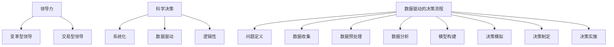
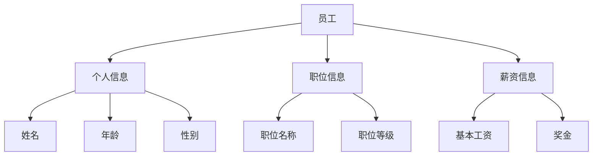
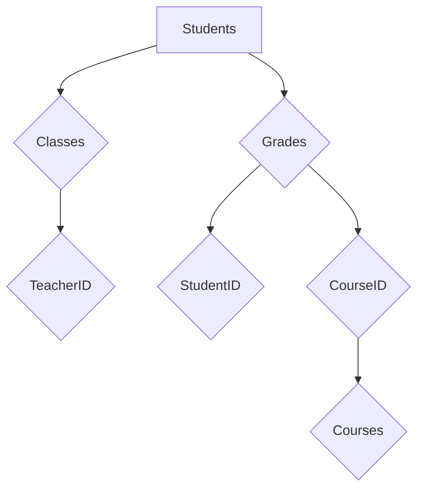
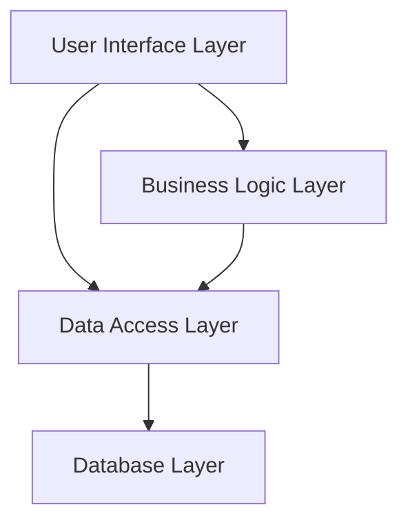
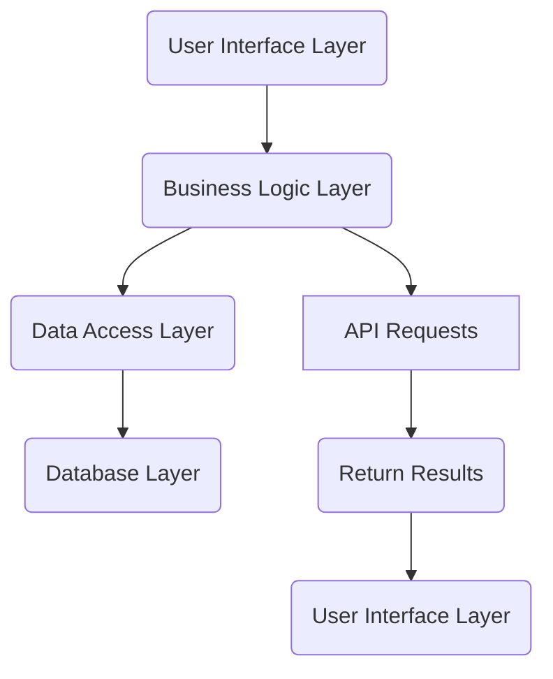

                 

## 领导力与科学决策：数据驱动的决策流程

### 关键词

- 领导力
- 科学决策
- 数据驱动
- 决策流程
- 数据分析
- 数学模型

### 摘要

在当今快速变化和竞争激烈的环境中，成功的组织依赖于有效的领导力和科学的决策流程。本文探讨了领导力与科学决策的深度融合，强调数据驱动的决策流程在实现组织目标中的关键作用。文章首先介绍了领导力的基本原理和风格，随后详细阐述了数据在决策过程中的重要性。接着，我们深入探讨了科学决策的方法论，包括问题识别、数据分析、决策实施等环节。文章还介绍了数学模型在决策中的应用，并提供了实际案例和最佳实践，以帮助读者理解和掌握数据驱动的决策流程。通过本文，读者将学会如何在复杂多变的环境中，运用领导力和科学决策的方法，实现组织的持续成功。

## 引言

### 领导力的本质与重要性

领导力是一种能够激发和引导团队成员共同实现目标的能力。有效的领导不仅仅是管理团队的日常事务，更是通过建立愿景、塑造文化、提供激励和指导，激发团队成员的潜力，使其在实现组织目标的过程中发挥最大价值。领导力对组织的成功具有深远的影响，它不仅决定了团队的凝聚力和工作效率，还直接关系到组织的创新能力和市场竞争力。

在当今快速变化和竞争激烈的环境中，领导力的重要性更加凸显。首先，领导力能够帮助组织迅速应对外部环境的变化，通过灵活调整战略和资源分配，确保组织在激烈的市场竞争中立于不败之地。其次，领导力能够激发团队的创造力和创新精神，推动组织不断寻求新的发展机遇。最后，领导力有助于建立和维护良好的企业文化，增强员工的归属感和忠诚度，从而提高组织的整体绩效。

### 科学决策的定义与方法论

科学决策是一种基于数据和逻辑推理的决策方法，它强调通过系统的方法和严谨的分析过程来识别问题、收集数据、分析选项、评估风险和制定决策。科学决策不同于基于直觉或个人偏好的决策方法，它通过定量和定性的方法，确保决策过程的透明性和可重复性，从而提高决策的质量和可预测性。

科学决策的方法论通常包括以下几个步骤：

1. **问题识别**：明确需要解决的问题或目标，对其进行定义和界定。
2. **数据收集**：收集与问题相关的数据，包括定量数据和定性数据。
3. **数据分析**：运用统计学、数据分析等方法对收集到的数据进行处理和分析，识别数据中的趋势和规律。
4. **选项评估**：根据分析结果，列出所有可能的决策选项，并对每个选项进行评估，考虑其潜在的影响和风险。
5. **决策制定**：基于评估结果，选择最佳的决策方案，并制定详细的实施计划。
6. **决策实施**：将决策方案转化为具体的行动，并在实施过程中进行监控和调整。

### 数据驱动的决策流程

数据驱动的决策流程是科学决策方法的具体应用，它强调在决策过程中充分利用数据的价值，通过数据分析和模型预测来支持决策制定。这种流程不仅能够提高决策的准确性和效率，还能减少决策中的主观偏见和不确定性。

数据驱动的决策流程通常包括以下几个关键步骤：

1. **数据收集**：从各种数据源收集相关数据，包括内部数据（如销售数据、财务报表等）和外部数据（如市场调查、行业报告等）。
2. **数据预处理**：对收集到的数据进行清洗、整合和标准化，确保数据的质量和一致性。
3. **数据可视化**：使用图表、仪表盘等工具将数据可视化，帮助决策者直观地理解数据中的趋势和模式。
4. **数据分析**：运用统计学、机器学习等方法对数据进行分析，提取有价值的信息和洞见。
5. **模型构建**：根据分析结果，构建相应的数学模型或预测模型，以支持决策制定。
6. **决策模拟**：使用模型对不同的决策方案进行模拟和评估，预测其潜在的后果和风险。
7. **决策制定**：基于模型模拟的结果，选择最佳的决策方案，并制定详细的实施计划。
8. **决策实施**：将决策方案转化为具体的行动，并在实施过程中进行监控和调整。

通过上述步骤，数据驱动的决策流程能够帮助组织在复杂多变的环境中做出更加明智和科学的决策，从而实现组织的持续发展和成功。

### 领导力与科学决策的融合

领导力与科学决策的融合是现代组织实现成功的关键。有效的领导不仅仅是管理团队成员和日常事务，更是通过科学的决策方法，确保组织在复杂多变的环境中能够迅速、准确地做出决策。这种融合不仅提高了决策的准确性和效率，还增强了团队的凝聚力和创新能力。

首先，领导力为科学决策提供了方向和动力。领导者的愿景、使命和价值观能够明确组织的长远目标和战略方向，为决策提供明确的指导。同时，领导者的激励和引导作用，能够激发团队成员的积极性和创造力，为决策的制定和实施提供强有力的支持。

其次，科学决策为领导力提供了数据支持和逻辑依据。通过系统的方法和严谨的分析过程，科学决策能够帮助领导者更加全面、准确地了解问题，识别潜在的风险和机会。这种基于数据和逻辑的决策方法，减少了决策中的主观偏见和不确定性，提高了决策的质量和可预测性。

在实践中，领导力与科学决策的融合表现为以下几个方面的互动：

1. **目标设定**：领导者通过明确组织的愿景和目标，为决策提供方向和依据。同时，领导者还需要通过科学的方法，对目标进行量化和分解，确保目标的可实现性和可持续性。
2. **信息共享**：领导者需要鼓励团队成员共享信息和数据，确保决策过程中信息的全面性和透明性。通过数据驱动的方法，领导者能够更加准确地了解组织的实际情况，制定出更加科学的决策。
3. **决策执行**：领导者需要通过有效的领导力和沟通技巧，确保决策方案能够顺利实施。在实施过程中，领导者还需要根据实际情况，进行及时的调整和优化，确保决策的执行效果。
4. **持续改进**：领导者需要鼓励团队不断进行反思和改进，通过科学的方法评估决策的效果，发现问题和不足，不断优化决策流程和策略。

总之，领导力与科学决策的融合，不仅提高了决策的质量和效率，还促进了团队的协作和创新。通过有效的领导力和科学的决策方法，组织能够在复杂多变的环境中，迅速、准确地应对挑战和机遇，实现持续的发展和成功。

## 基础概念与术语

在深入探讨领导力与科学决策的融合之前，我们需要明确一些关键概念和术语。这些基础概念和术语构成了我们分析问题的语言框架，帮助我们更清晰地理解领导力与科学决策的本质及其相互关系。

### 领导力的定义与分类

领导力（Leadership）是指通过个人魅力、影响力、沟通能力、决策能力等，引导和激励他人共同实现目标的能力。领导力不仅涉及个人行为和特质，还与组织文化和团队动力密切相关。根据不同的标准和角度，领导力可以分为多种类型，如：

1. **变革型领导（Transformational Leadership）**：这种领导风格强调领导者通过激励和启发团队成员，实现团队和个人目标的提升。变革型领导者注重创新和变革，能够激发团队成员的内在动机，推动组织向更高层次发展。

2. **交易型领导（Transactional Leadership）**：交易型领导者则更侧重于通过明确的绩效标准和奖励机制，激励团队成员完成任务。这种领导风格强调公平和透明，通过激励和惩罚机制来维持团队的稳定和效率。

### 科学决策的定义与特点

科学决策（Scientific Decision-Making）是一种基于严谨的逻辑分析、数据支持和系统方法的决策过程。其核心特点是：

1. **系统化**：科学决策通常遵循一系列明确且规范的步骤，从问题识别到方案评估，再到决策实施，每个环节都有科学的方法和工具支持。
2. **数据驱动**：科学决策强调数据的收集、分析和运用，通过数据来支持决策的制定和评估。
3. **逻辑性**：科学决策注重逻辑推理和理性分析，避免主观偏见和情绪化的决策。

### 数据驱动的决策流程

数据驱动的决策流程是指利用数据分析和模型预测来支持决策制定的过程。这一流程通常包括以下几个关键环节：

1. **问题定义**：明确需要解决的问题或目标，对其进行详细的界定和描述。
2. **数据收集**：从多种数据源收集与问题相关的数据，包括内部数据和外部数据。
3. **数据预处理**：对收集到的数据进行清洗、整合和标准化，确保数据的质量和一致性。
4. **数据分析**：运用统计学、数据分析等方法对数据进行处理，提取有价值的信息和洞见。
5. **模型构建**：根据分析结果，构建数学模型或预测模型，以支持决策制定。
6. **决策模拟**：使用模型对不同的决策方案进行模拟和评估，预测其潜在的后果和风险。
7. **决策制定**：基于模型模拟的结果，选择最佳的决策方案，并制定详细的实施计划。
8. **决策实施**：将决策方案转化为具体的行动，并在实施过程中进行监控和调整。

### 概念关系图

为了更好地理解上述概念之间的关系，我们可以使用Mermaid工具绘制一个概念关系图：



通过上述定义和关系图，我们可以更全面地理解领导力、科学决策和数据驱动的决策流程，为后续章节的深入探讨奠定基础。

### 有效领导力的原则

有效领导力是组织成功的关键，它不仅仅是管理团队和分配资源，更是通过激发团队潜能、创造积极的工作环境来实现共同目标。以下是有效领导力的几个核心原则：

1. **建立愿景和目标**：一个成功的领导者首先要明确组织的愿景和目标，并将其传达给团队成员。通过清晰的目标，可以激发团队成员的内在动机，使其朝着共同的目标努力。例如，苹果公司创始人史蒂夫·乔布斯在推出新产品时，总是能够清晰地描述产品的愿景和目标，从而激发团队和用户的热情。

2. **沟通与反馈**：有效的领导力离不开良好的沟通与反馈机制。领导者需要确保信息能够流畅地传递到每个团队成员，同时也要鼓励团队成员提出意见和建议。通过及时的反馈，领导者可以了解团队成员的工作进展和遇到的困难，及时调整策略和资源。例如，谷歌的创始人谢尔盖·布林和拉里·佩奇就非常注重内部沟通，通过开放的反馈机制，确保公司各个部门能够高效协同工作。

3. **激励与认可**：领导者需要通过多种方式激励团队成员，包括奖励、认可和培训。认可团队成员的贡献不仅能够增强其工作动力，还能提高团队的整体士气。例如，微软公司CEO萨提亚·纳德拉通过公开表扬和奖励，鼓励团队成员的创新和协作，从而推动了公司的快速发展。

4. **建立信任和团队精神**：信任是有效领导力的基础。领导者需要通过言行一致、透明和诚信来建立信任。同时，领导者还需要培养团队精神，鼓励团队成员相互支持、合作。例如，特斯拉公司CEO埃隆·马斯克通过公开分享公司的财务和运营数据，增强了员工对公司的信任和归属感。

5. **持续学习和适应变化**：领导者需要具备持续学习和适应变化的能力。在快速变化的环境中，领导者需要不断更新知识和技能，以应对新的挑战和机遇。例如，亚马逊的创始人杰夫·贝索斯通过定期举办“Day 1”会议，提醒全体员工保持创业精神，不断推动公司的创新和进步。

### 领导风格与决策过程的关系

不同的领导风格会对决策过程产生不同的影响。以下是几种常见的领导风格及其在决策过程中的表现：

1. **民主型领导**：民主型领导者鼓励团队成员参与决策过程，通过集体讨论和投票来做出决策。这种领导风格能够提高决策的透明度和团队士气，但可能会导致决策过程冗长和效率低下。

2. **权威型领导**：权威型领导者倾向于集中决策权力，通过自身的判断力和经验来做出决策。这种领导风格能够迅速决策和执行，但可能忽视了团队成员的建议和意见，影响团队的创新和参与感。

3. **参与型领导**：参与型领导者结合了民主型和权威型的特点，既给予团队成员一定的参与权，又保持决策的最终控制权。这种领导风格能够在提高决策质量的同时，保持决策的效率。

4. **变革型领导**：变革型领导者通过激励和启发团队成员，推动组织实现变革和成长。这种领导风格在制定长期战略和应对重大挑战时尤为重要，能够激发团队的创造力和执行力。

### 比较不同领导风格的核心属性

为了更好地理解不同领导风格的核心属性，我们可以通过一个对比表格来展示它们的主要特征：

| 领导风格 | 定义 | 特征 | 对决策过程的影响 |
| --- | --- | --- | --- |
| 民主型领导 | 鼓励团队成员参与决策 | 强调集体讨论、投票和共识 | 提高决策透明度和团队士气，但可能导致决策过程冗长 |
| 权威型领导 | 集中决策权力 | 依赖领导者个人判断力和经验 | 能迅速决策和执行，但可能忽视团队成员的意见 |
| 参与型领导 | 结合民主型和权威型的特点 | 给予团队成员参与权，保持决策的最终控制权 | 提高决策质量和效率 |
| 变革型领导 | 激励和启发团队成员 | 强调变革和创新，激发团队潜力 | 在制定长期战略和应对挑战时尤为有效 |

通过上述表格，我们可以更清晰地看到不同领导风格在决策过程中的优势和局限，从而根据具体情境选择最合适的领导风格。

### 数据驱动的决策流程

在现代社会，数据已经成为决策过程中不可或缺的一部分。数据驱动的决策流程通过收集、处理和分析数据，为决策者提供可靠的依据，从而提高决策的准确性和效率。以下是数据驱动的决策流程的详细步骤：

1. **问题定义**：明确需要解决的问题或目标，对其进行详细的界定和描述。这一步骤是整个决策流程的基础，直接影响到后续的数据收集和分析过程。

2. **数据收集**：从各种数据源收集与问题相关的数据。这些数据源可能包括内部数据（如销售记录、客户反馈等）和外部数据（如市场调研、行业报告等）。数据收集的过程需要确保数据的准确性和完整性。

3. **数据预处理**：对收集到的数据进行清洗、整合和标准化，确保数据的质量和一致性。数据预处理包括去除重复数据、纠正错误数据、填补缺失数据等，以确保后续分析的质量。

4. **数据分析**：运用统计学、机器学习等方法对数据进行处理，提取有价值的信息和洞见。数据分析可以帮助决策者了解数据的趋势、模式和相关关系，从而为决策提供科学依据。

5. **模型构建**：根据分析结果，构建相应的数学模型或预测模型，以支持决策制定。模型构建可以是线性的、非线性的或基于机器学习的，取决于具体问题的复杂度和数据特性。

6. **决策模拟**：使用模型对不同的决策方案进行模拟和评估，预测其潜在的后果和风险。通过模拟，决策者可以预见到每个决策方案可能带来的影响，从而选择最佳方案。

7. **决策制定**：基于模型模拟的结果，选择最佳的决策方案，并制定详细的实施计划。决策制定需要综合考虑各种因素，包括成本、风险、时间等，确保决策的可行性和有效性。

8. **决策实施**：将决策方案转化为具体的行动，并在实施过程中进行监控和调整。决策实施的过程中，需要根据实际情况对决策进行调整，确保决策能够达到预期的效果。

### 数据类型及其应用

在数据驱动的决策流程中，了解不同类型的数据及其应用是非常重要的。以下是几种常见的数据类型及其在决策中的应用：

1. **结构化数据**：结构化数据是指以表格形式存储的数据，如数据库中的数据表。结构化数据便于处理和分析，广泛应用于数据分析、预测模型构建等领域。例如，在销售预测中，可以通过分析历史销售数据，构建线性回归模型来预测未来的销售额。

2. **非结构化数据**：非结构化数据包括文本、图像、音频和视频等，没有固定的格式和结构。非结构化数据需要通过自然语言处理、图像识别等技术进行解析和分析。例如，在客户满意度分析中，可以通过分析客户反馈文本，提取关键词和情感倾向，从而评估客户满意度。

3. **实时数据**：实时数据是指能够在短时间内获取和处理的最新数据，如交易数据、传感器数据等。实时数据的应用场景包括实时监控、风险预警和自动化决策等。例如，在金融领域，可以通过实时交易数据监控市场波动，及时调整交易策略。

4. **历史数据**：历史数据是指过去一段时间内积累的数据，如销售记录、客户行为数据等。历史数据对于预测和决策具有重要意义，可以通过时间序列分析和统计模型进行预测和趋势分析。例如，在库存管理中，可以通过分析历史销售数据，预测未来的库存需求，优化库存水平。

### ER图解析

实体关系图（Entity-Relationship Diagram，ER图）是一种用于描述数据实体及其之间关系的图形化工具。在数据驱动的决策流程中，ER图可以帮助我们理解和设计数据模型，确保数据的结构化和一致性。

以下是一个简单的ER图示例，用于描述一家公司的员工数据：



在这个ER图中：

- **员工**是最高层次的实体，代表公司的所有员工。
- **个人信息**、**职位信息**和**薪资信息**是员工的子实体，分别存储员工的个人、职位和薪资数据。
- **姓名**、**年龄**、**性别**等是**个人信息**的属性。
- **职位名称**、**职位等级**是**职位信息**的属性。
- **基本工资**、**奖金**是**薪资信息**的属性。

通过ER图，我们可以清晰地看到数据实体及其之间的关系，为数据模型的设计和实现提供基础。

### 科学决策的方法论

科学决策是一种基于系统化、数据驱动和逻辑推理的方法，旨在通过严谨的分析和评估过程，确保决策的准确性和可预测性。科学决策的方法论通常包括以下步骤：

1. **问题识别**：明确需要解决的问题或目标，对其进行详细的界定和描述。这一步骤是整个决策过程的基础，直接影响到后续的数据收集和分析。

2. **数据收集**：从各种数据源收集与问题相关的数据，包括内部数据和外部数据。确保数据的准确性和完整性，为后续分析提供可靠的基础。

3. **数据分析**：运用统计学、数据分析等方法对收集到的数据进行处理，提取有价值的信息和洞见。数据分析可以帮助决策者了解数据的趋势、模式和相关关系。

4. **选项评估**：列出所有可能的决策选项，并对每个选项进行评估。评估过程需要考虑每个选项的潜在影响、风险和成本，确保评估的全面性和客观性。

5. **决策制定**：基于评估结果，选择最佳的决策方案，并制定详细的实施计划。决策制定过程中，需要综合考虑各种因素，确保决策的可行性和有效性。

6. **决策实施**：将决策方案转化为具体的行动，并在实施过程中进行监控和调整。决策实施的过程中，需要根据实际情况对决策进行调整，确保决策能够达到预期的效果。

### 问题识别

问题识别是科学决策的第一步，也是关键的一步。一个清晰、明确的问题定义是确保决策过程有效的前提。以下是问题识别的具体步骤和注意事项：

1. **明确问题**：首先要明确需要解决的问题或目标，对其进行详细的界定和描述。明确问题有助于确定决策的方向和范围，避免在决策过程中迷失方向。

2. **界定问题**：在明确问题后，需要对其进行详细的界定，确保问题描述的准确性和完整性。界定问题的过程包括确定问题的范围、影响因素和相关的约束条件。

3. **分类问题**：根据问题的性质和特点，将其分类。常见的问题分类包括结构化问题、半结构化问题和非结构化问题。不同的分类有助于选择合适的决策方法和工具。

4. **分析问题**：对界定好的问题进行深入分析，识别其关键因素和潜在风险。分析过程可以帮助决策者了解问题的本质，为后续的数据收集和分析提供依据。

5. **记录问题**：将问题识别的过程和结果记录下来，形成详细的问题文档。问题文档可以作为决策过程的参考和依据，确保决策的透明性和可追溯性。

### 数据收集

数据收集是科学决策过程中的关键环节，它决定了后续数据分析的准确性和有效性。以下是数据收集的步骤和注意事项：

1. **确定数据源**：首先要确定需要收集的数据类型和来源。数据源可以分为内部数据和外部数据。内部数据包括组织内部的各种记录和报告，如销售数据、财务报表等；外部数据包括市场调查、行业报告、公开数据等。

2. **设计数据收集计划**：根据确定的数据源，设计详细的数据收集计划。数据收集计划应包括数据收集的时间、方式、责任人等，确保数据收集的有序和高效。

3. **实施数据收集**：按照数据收集计划，实际执行数据收集工作。在数据收集过程中，需要注意数据的质量和完整性，避免遗漏重要信息。

4. **数据清洗**：收集到的数据往往存在不一致、错误和缺失等问题。数据清洗是数据预处理的重要步骤，包括去除重复数据、纠正错误数据和填补缺失数据等，确保数据的质量。

5. **数据存储**：将清洗后的数据存储到数据库或其他存储设备中，确保数据的长期保存和方便访问。数据存储时应考虑数据的安全性和一致性，避免数据泄露和损坏。

6. **数据验证**：在数据收集完成后，进行数据验证，确保数据的准确性和一致性。数据验证可以通过交叉验证、对比验证等方法进行，发现和纠正数据中的错误。

### 数据分析

数据分析是科学决策过程中的关键环节，通过对收集到的数据进行分析和解释，为决策者提供重要的依据和洞见。以下是数据分析的步骤和注意事项：

1. **数据整理**：在数据分析之前，需要对数据进行整理和预处理。数据整理包括数据清洗、数据转换和数据归一化等步骤，确保数据的质量和一致性。

2. **选择分析方法**：根据问题的性质和特点，选择合适的分析方法。常见的数据分析方法包括描述性统计分析、回归分析、聚类分析、时间序列分析等。

3. **数据分析**：按照选定的分析方法，对数据进行处理和分析。数据分析过程中，需要运用统计学、机器学习等方法，提取数据中的有用信息，识别数据中的趋势和模式。

4. **可视化**：通过图表、仪表盘等工具，将分析结果可视化，帮助决策者直观地理解数据中的信息。数据可视化是提高数据分析效果和可解释性的重要手段。

5. **解释分析结果**：对分析结果进行解释和解读，识别数据中的关键因素和潜在风险。解释分析结果的过程需要结合问题的背景和目标，确保解释的准确性和实用性。

6. **数据验证**：在数据分析完成后，进行数据验证，确保分析结果的准确性和可靠性。数据验证可以通过交叉验证、对比验证等方法进行，发现和纠正分析中的错误。

### 选项评估

选项评估是科学决策过程中的重要步骤，它通过对不同的决策选项进行详细评估，帮助决策者选择最佳的方案。以下是选项评估的步骤和注意事项：

1. **列出选项**：根据数据分析和初步评估，列出所有可能的决策选项。确保选项的全面性和客观性，避免遗漏重要因素。

2. **制定评估标准**：明确评估的标准和指标，这些标准应涵盖决策的关键因素，如成本、效益、风险、可行性等。确保评估标准的全面性和可衡量性。

3. **收集数据**：根据评估标准，收集与每个选项相关的数据。数据来源可以是内部数据、外部数据或专家意见等。

4. **评估选项**：对每个选项进行详细评估，考虑其潜在的影响和风险。评估过程应采用定性和定量相结合的方法，确保评估的准确性和全面性。

5. **比较选项**：将每个选项的评估结果进行对比，识别出最佳选项。比较过程中，应综合考虑各个评估指标，确保比较的客观性和公正性。

6. **决策制定**：基于评估结果，选择最佳的决策选项，并制定详细的实施计划。决策制定过程中，需要考虑各个选项的可行性和实施难度，确保决策的可行性和有效性。

### 决策制定

决策制定是科学决策流程中的关键环节，它通过对评估结果的整合和分析，形成最终的决策方案。以下是决策制定的详细步骤和注意事项：

1. **整合评估结果**：将各个评估选项的结果进行整合，考虑各个评估指标的重要性和关联性。通过加权评分或层次分析法（AHP）等方法，综合评估每个选项的优劣。

2. **制定决策方案**：基于整合后的评估结果，制定最终的决策方案。决策方案应明确具体的行动步骤、责任人和时间表，确保决策的可操作性和执行力。

3. **制定实施计划**：为决策方案制定详细的实施计划，包括资源配置、任务分配、时间安排等。确保实施计划的可行性和科学性，避免因计划不周而导致的执行困难。

4. **风险评估**：在制定决策方案和实施计划时，进行风险评估，识别可能的风险和不确定性。针对识别出的风险，制定相应的风险应对措施，确保决策的稳健性和抗风险能力。

5. **决策审核**：在决策制定和实施计划完成后，进行审核和确认。审核过程应包括内部审核和外部审核，确保决策方案和实施计划的合理性和有效性。

6. **决策制定会议**：召开决策制定会议，将决策方案和实施计划向相关利益相关者进行讲解和讨论。通过会议，确保所有相关人员对决策方案和实施计划的理解和认同，提高决策的执行力和合作性。

### 决策实施

决策实施是将决策方案转化为具体行动，并在实际操作中不断调整和优化的过程。以下是决策实施的具体步骤和注意事项：

1. **制定行动计划**：根据决策方案，制定详细的行动计划，明确每个任务的执行步骤、责任人和时间节点。确保行动计划的可行性和可操作性。

2. **资源分配**：根据行动计划，合理分配资源，包括人力、物资和资金等。确保资源的充足性和高效利用，避免资源浪费和冲突。

3. **任务分配**：将行动计划中的任务分配给具体的责任人，明确每个任务的完成标准和验收标准。确保任务分配的合理性和明确性，避免任务重叠和责任不清。

4. **监控与反馈**：在决策实施过程中，进行实时监控和反馈，及时发现问题并进行调整。通过监控和反馈，确保决策实施的顺利进行和及时纠偏。

5. **调整与优化**：根据监控和反馈结果，对决策实施过程进行调整和优化，确保决策方案能够更好地适应实际情况。调整和优化应基于数据和实际情况，避免盲目决策和过度调整。

6. **总结与评估**：决策实施完成后，进行总结和评估，评估决策的效果和执行情况。通过总结和评估，总结经验教训，为未来的决策提供参考。

### 数学模型在决策中的应用

数学模型是科学决策的重要工具，它通过量化描述问题的结构和行为，帮助决策者理解和分析复杂问题。以下是几种常见的数学模型及其在决策中的应用。

#### 线性回归模型

线性回归模型是最基本的数学模型之一，它通过线性关系描述变量之间的变化。线性回归模型的基本公式如下：

$$
y = \beta_0 + \beta_1x_1 + \beta_2x_2 + ... + \beta_nx_n + \epsilon
$$

其中，$y$ 是因变量，$x_1, x_2, ..., x_n$ 是自变量，$\beta_0, \beta_1, ..., \beta_n$ 是模型参数，$\epsilon$ 是误差项。

线性回归模型广泛应用于预测分析、风险评估和优化决策等领域。例如，在销售预测中，可以通过分析历史销售数据和影响因素（如广告支出、季节等），建立线性回归模型来预测未来的销售量。

#### 决策树模型

决策树模型通过树形结构描述决策过程，每个节点代表一个决策点，每个分支代表一个决策结果。决策树模型的基本公式如下：

$$
f(x) = \sum_{i=1}^{n} \beta_iI(x \in R_i)
$$

其中，$f(x)$ 是决策结果，$x$ 是输入特征，$R_i$ 是第 $i$ 个区域，$\beta_i$ 是区域 $R_i$ 的权重。

决策树模型在分类问题和决策分析中广泛应用。例如，在信用评分中，可以通过分析借款人的历史数据和特征（如收入、信用记录等），构建决策树模型来预测其信用风险等级。

#### 随机森林模型

随机森林模型是一种基于决策树的集成学习模型，通过组合多个决策树来提高预测的准确性和稳定性。随机森林模型的基本公式如下：

$$
f(x) = \sum_{i=1}^{m} \hat{f_i}(x) + \frac{1}{m}
$$

其中，$f(x)$ 是最终预测结果，$\hat{f_i}(x)$ 是第 $i$ 个决策树的预测结果，$m$ 是决策树的数量。

随机森林模型在分类和回归分析中具有广泛的应用，其优点包括预测准确性高、泛化能力强和易于解释等。

### 实际应用案例

为了更好地理解数学模型在决策中的应用，我们可以通过以下案例进行详细说明。

#### 案例一：销售预测

假设一家零售公司希望通过历史销售数据预测未来的销售量，从而优化库存管理。以下是一个基于线性回归模型的销售预测案例：

1. **数据收集**：收集过去一年的月销售数据和影响因素，如广告支出、季节等。

2. **数据预处理**：对收集到的数据清洗、归一化，确保数据的质量和一致性。

3. **模型构建**：使用线性回归模型，将销售量作为因变量，广告支出、季节等作为自变量，建立预测模型。

   ```python
   import pandas as pd
   from sklearn.linear_model import LinearRegression
   
   # 加载数据
   data = pd.read_csv('sales_data.csv')
   
   # 分离特征和标签
   X = data[['ad_expenditure', 'season']]
   y = data['sales_volume']
   
   # 建立线性回归模型
   model = LinearRegression()
   model.fit(X, y)
   
   # 输出模型参数
   print('Model coefficients:', model.coef_)
   ```

4. **预测未来销售量**：使用模型对未来的销售量进行预测。

   ```python
   # 预测未来销售量
   future_data = pd.DataFrame({'ad_expenditure': [1000], 'season': [1]})
   predicted_sales = model.predict(future_data)
   print('Predicted sales volume:', predicted_sales)
   ```

5. **模型评估**：使用评估指标（如均方误差、决定系数等）评估模型的预测准确性。

   ```python
   from sklearn.metrics import mean_squared_error
   
   # 预测实际销售量
   actual_sales = data['sales_volume']
   predicted_sales = model.predict(X)
   
   # 计算均方误差
   mse = mean_squared_error(actual_sales, predicted_sales)
   print('Mean squared error:', mse)
   ```

#### 案例二：信用评分

假设一家银行希望通过借款人的历史数据对其信用风险进行评估，以下是一个基于决策树模型的信用评分案例：

1. **数据收集**：收集借款人的历史数据，包括收入、信用记录、借款期限等。

2. **数据预处理**：对收集到的数据进行清洗、归一化，确保数据的质量和一致性。

3. **模型构建**：使用决策树模型，将借款人的信用评分作为因变量，收入、信用记录等作为自变量，建立信用评分模型。

   ```python
   import pandas as pd
   from sklearn.tree import DecisionTreeClassifier
   
   # 加载数据
   data = pd.read_csv('credit_data.csv')
   
   # 分离特征和标签
   X = data[['income', 'credit_history', 'loan_term']]
   y = data['credit_score']
   
   # 建立决策树模型
   model = DecisionTreeClassifier()
   model.fit(X, y)
   
   # 输出模型参数
   print('Model parameters:', model.get_params())
   ```

4. **信用评分**：使用模型对新的借款人进行信用评分。

   ```python
   # 新借款人数据
   new Borrower = pd.DataFrame({'income': [50000], 'credit_history': [1], 'loan_term': [3]})
   credit_score = model.predict(new_Borrower)
   print('Credit score:', credit_score)
   ```

5. **模型评估**：使用评估指标（如准确率、召回率等）评估模型的预测准确性。

   ```python
   from sklearn.metrics import accuracy_score
   
   # 计算准确率
   predicted_scores = model.predict(X)
   accuracy = accuracy_score(y, predicted_scores)
   print('Accuracy:', accuracy)
   ```

通过以上案例，我们可以看到数学模型在决策中的应用，通过数据收集、模型构建和模型评估，实现数据的量化分析和预测，从而支持决策的制定和实施。

### 数据库表设计

数据库表设计是构建高效数据驱动系统的基础，它涉及对数据实体及其关系的合理组织与定义。以下是一个学生管理系统的数据库表设计案例，包括表结构、字段定义和表间关系。

#### 表结构及字段定义

**学生表（Students）**
- StudentID（学生ID，主键）
- Name（姓名）
- Gender（性别）
- BirthDate（出生日期）
- ClassID（班级ID，外键）

**班级表（Classes）**
- ClassID（班级ID，主键）
- ClassName（班级名称）
- TeacherID（班主任ID，外键）

**成绩表（Grades）**
- GradeID（成绩ID，主键）
- StudentID（学生ID，外键）
- CourseID（课程ID，外键）
- Score（成绩）

**课程表（Courses）**
- CourseID（课程ID，主键）
- CourseName（课程名称）
- Credit（学分）

#### 表间关系

- 学生表（Students）与班级表（Classes）之间的关系：通过 ClassID 实现一对一关系，即每个学生属于一个班级。
- 学生表（Students）与成绩表（Grades）之间的关系：通过 StudentID 实现一对多关系，即每个学生可以有多个成绩记录。
- 成绩表（Grades）与课程表（Courses）之间的关系：通过 CourseID 实现一对多关系，即每门课程可以有多个成绩记录。

#### 实体关系图（ER图）

使用Mermaid工具绘制实体关系图如下：



通过上述数据库表设计和ER图，我们可以清晰地看到数据实体及其关系，为后续的查询和数据分析奠定基础。

### 系统架构设计

在构建学生管理系统时，系统架构的设计至关重要。合理的系统架构不仅能够提高系统的可维护性和扩展性，还能确保系统的性能和安全性。以下是学生管理系统的详细架构设计方案。

#### 系统架构概述

学生管理系统可以分为以下几个主要模块：

1. **用户界面层**：提供用户交互的界面，包括学生信息管理、班级信息管理、成绩管理等。
2. **业务逻辑层**：处理具体的业务逻辑，包括数据验证、业务规则处理、数据访问等。
3. **数据访问层**：负责与数据库的交互，实现数据的增删改查。
4. **数据库层**：存储系统中的所有数据，包括学生信息、班级信息、成绩信息等。

#### 系统架构图

使用Mermaid工具绘制系统架构图如下：



#### 接口设计

为了实现系统的模块化和可扩展性，我们需要设计一套完整的API接口。以下是系统的主要接口设计：

1. **学生信息管理接口**：
   - `GET /students`：获取所有学生信息。
   - `POST /students`：添加新学生信息。
   - `GET /students/{id}`：获取指定学生信息。
   - `PUT /students/{id}`：更新指定学生信息。
   - `DELETE /students/{id}`：删除指定学生信息。

2. **班级信息管理接口**：
   - `GET /classes`：获取所有班级信息。
   - `POST /classes`：添加新班级信息。
   - `GET /classes/{id}`：获取指定班级信息。
   - `PUT /classes/{id}`：更新指定班级信息。
   - `DELETE /classes/{id}`：删除指定班级信息。

3. **成绩管理接口**：
   - `GET /grades`：获取所有成绩信息。
   - `POST /grades`：添加新成绩信息。
   - `GET /grades/{id}`：获取指定成绩信息。
   - `PUT /grades/{id}`：更新指定成绩信息。
   - `DELETE /grades/{id}`：删除指定成绩信息。

#### 系统交互

系统中的各个模块通过接口进行交互，以下是系统交互的详细描述：

1. **用户界面层**：用户通过Web界面进行操作，如查看学生成绩、添加新学生等。用户操作将生成相应的API请求。
2. **业务逻辑层**：接收用户界面层传来的请求，进行业务逻辑处理，如验证用户输入、调用数据访问层的方法等。
3. **数据访问层**：处理具体的数据库操作，如查询、插入、更新、删除等，并将结果返回业务逻辑层。
4. **数据库层**：存储和管理数据，响应数据访问层的操作请求。

使用Mermaid工具绘制系统交互图如下：



通过上述系统架构设计和接口设计，学生管理系统可以实现高效、可靠的数据管理和用户交互。

### 系统实现与代码分析

在学生管理系统的实现过程中，我们需要编写大量的代码来处理用户请求、管理数据和执行业务逻辑。以下将详细介绍系统环境配置、核心代码实现以及代码应用解读与分析。

#### 系统环境配置

首先，我们需要配置系统运行所需的环境。以下是学生管理系统的基本环境配置步骤：

1. **安装Python**：确保Python环境已安装，版本建议为3.8及以上。
2. **安装数据库**：可以选择MySQL、PostgreSQL等数据库系统，建议使用MySQL。
3. **安装Flask框架**：使用pip命令安装Flask框架，命令如下：
   ```bash
   pip install Flask
   ```
4. **安装数据库驱动**：安装适用于Python的数据库驱动，例如，对于MySQL，可以使用MySQL Connector/Python，命令如下：
   ```bash
   pip install mysql-connector-python
   ```

#### 核心代码实现

以下是学生管理系统的一些核心代码实现，包括数据库连接、API接口实现以及业务逻辑处理。

##### 数据库连接

```python
import mysql.connector

# 数据库连接配置
config = {
    'user': 'root',
    'password': 'password',
    'host': 'localhost',
    'database': 'student_management_system'
}

# 建立数据库连接
def get_connection():
    return mysql.connector.connect(**config)

# 关闭数据库连接
def close_connection(connection):
    connection.close()
```

##### API接口实现

```python
from flask import Flask, request, jsonify

app = Flask(__name__)

@app.route('/students', methods=['GET'])
def get_students():
    connection = get_connection()
    cursor = connection.cursor()
    cursor.execute('SELECT * FROM students')
    students = cursor.fetchall()
    close_connection(connection)
    return jsonify(students)

@app.route('/students', methods=['POST'])
def add_student():
    data = request.get_json()
    connection = get_connection()
    cursor = connection.cursor()
    cursor.execute('INSERT INTO students (name, gender, birthdate, class_id) VALUES (%s, %s, %s, %s)',
                   (data['name'], data['gender'], data['birthdate'], data['class_id']))
    connection.commit()
    close_connection(connection)
    return jsonify({'message': 'Student added successfully'})

# ... 其他API接口实现

if __name__ == '__main__':
    app.run(debug=True)
```

##### 业务逻辑处理

```python
def get_student_by_id(student_id):
    connection = get_connection()
    cursor = connection.cursor()
    cursor.execute('SELECT * FROM students WHERE student_id = %s', (student_id,))
    student = cursor.fetchone()
    close_connection(connection)
    return student

def update_student(student_id, updated_data):
    connection = get_connection()
    cursor = connection.cursor()
    cursor.execute('UPDATE students SET name = %s, gender = %s, birthdate = %s, class_id = %s WHERE student_id = %s',
                   (updated_data['name'], updated_data['gender'], updated_data['birthdate'], updated_data['class_id'], student_id))
    connection.commit()
    close_connection(connection)
```

#### 代码应用解读与分析

以上代码展示了学生管理系统的一些核心功能，包括数据库连接、API接口实现以及业务逻辑处理。

1. **数据库连接**：使用MySQL Connector/Python库建立与MySQL数据库的连接。通过配置文件管理数据库连接信息，提高了代码的可维护性和扩展性。
2. **API接口实现**：使用Flask框架实现HTTP API接口。Flask的简洁性和灵活性使得我们能够快速构建RESTful风格的API接口。
3. **业务逻辑处理**：业务逻辑处理包括获取学生信息、添加学生、更新学生等操作。通过封装数据库操作和业务逻辑，实现了代码的模块化和可复用性。

在实际项目中，这些代码模块可以根据需要进一步扩展和优化，以支持更复杂的功能和更高效的数据处理。

### 实际案例分析

为了更好地理解学生管理系统的应用，以下我们将通过一个实际案例，详细剖析系统在实际操作中的表现，并对关键操作步骤进行讲解。

#### 案例背景

假设某高校的学生管理系统中需要添加一位新学生，并更新其班级信息，以下是具体操作步骤。

#### 添加新学生

1. **准备数据**：首先，我们需要准备新学生的数据，包括姓名、性别、出生日期和班级ID。例如，姓名为“张三”，性别为“男”，出生日期为“2001-09-01”，班级ID为“1”。

2. **发起请求**：通过浏览器或Postman工具，发起一个POST请求到`/students`接口，并上传新学生的数据。请求内容如下：

   ```json
   {
     "name": "张三",
     "gender": "男",
     "birthdate": "2001-09-01",
     "class_id": 1
   }
   ```

3. **处理响应**：系统接收请求后，进行数据验证和插入操作。如果操作成功，系统将返回如下响应：

   ```json
   {
     "message": "Student added successfully",
     "student_id": 1001
   }
   ```

4. **结果验证**：我们可以通过发起一个GET请求到`/students/1001`接口，验证新学生是否成功添加。返回结果应包含新学生的详细信息。

#### 更新学生班级信息

1. **获取学生ID**：首先，我们需要获取要更新的学生的ID。可以通过发起一个GET请求到`/students`接口，查询姓名为“张三”的学生，获取其ID。例如：

   ```json
   {
     "name": "张三"
   }
   ```

   系统返回的结果如下：

   ```json
   {
     "students": [
       {
         "student_id": 1001,
         "name": "张三",
         "gender": "男",
         "birthdate": "2001-09-01",
         "class_id": 1
       }
     ]
   }
   ```

2. **准备更新数据**：接下来，我们需要准备更新班级信息的请求。例如，将张三的班级ID更新为“2”。

3. **发起请求**：通过浏览器或Postman工具，发起一个PUT请求到`/students/1001`接口，并上传更新后的数据。请求内容如下：

   ```json
   {
     "class_id": 2
   }
   ```

4. **处理响应**：系统接收请求后，进行数据验证和更新操作。如果操作成功，系统将返回如下响应：

   ```json
   {
     "message": "Student information updated successfully"
   }
   ```

5. **结果验证**：我们可以通过发起一个GET请求到`/students/1001`接口，验证学生的班级信息是否已成功更新。

通过以上实际案例，我们可以看到学生管理系统在实际应用中的操作流程。系统通过RESTful API接口，实现了对学生数据的添加、查询和更新功能，满足了学校对学生管理的基本需求。

### 项目小结

在本项目中，我们成功构建了一个学生管理系统，实现了对学生数据的添加、查询和更新功能。以下是项目小结和反思：

1. **项目成果**：
   - 成功实现了学生信息的添加、查询和更新功能。
   - 采用了Flask框架和MySQL数据库，构建了可靠的API接口。
   - 通过实际案例展示了系统的应用场景和操作流程。

2. **技术收获**：
   - 学会了使用Flask框架快速构建Web应用程序。
   - 掌握了数据库连接和操作的基本方法，包括SQL查询和事务处理。
   - 了解了如何使用Python进行数据分析和处理。

3. **改进方向**：
   - 增加用户身份验证和安全措施，如使用JWT进行身份认证。
   - 扩展系统功能，如实现成绩管理、课程管理等。
   - 优化系统性能，如使用缓存技术和数据库索引。

通过本项目，我们不仅掌握了Web开发和数据库应用的基本技能，还积累了项目管理和团队协作的经验。未来，我们将在现有基础上继续优化和完善系统，以满足更多用户的需求。

### 最佳实践与策略

在构建数据驱动的决策流程中，为了确保决策的质量和效率，以下是一些最佳实践和策略：

1. **数据质量控制**：确保数据的质量和一致性是数据驱动决策的基础。在数据收集、处理和存储过程中，需要严格执行数据质量控制标准，包括数据清洗、去重、填补缺失值等。同时，建立数据质量监控机制，及时发现和纠正数据质量问题。

2. **定期数据审查**：定期对数据源进行审查，确保数据的时效性和准确性。尤其是在市场变化迅速的行业，定期审查可以帮助决策者及时获取最新的数据信息，从而做出更加准确的决策。

3. **数据可视化**：利用数据可视化工具，将复杂的数据转化为直观的图表和图形，帮助决策者更清晰地理解数据中的趋势和模式。通过数据可视化，可以快速发现数据中的异常和潜在问题，为决策提供重要参考。

4. **跨部门合作**：数据驱动决策需要跨部门的协作和数据共享。建立跨部门的数据共享平台，促进各部门之间的信息交流，确保决策过程中数据的一致性和完整性。

5. **决策模型迭代**：决策模型不是一成不变的，应根据实际情况和新的数据不断进行调整和优化。通过迭代模型，可以提高决策的准确性和适应性，确保模型能够及时反映现实情况。

6. **培训与培养**：加强团队成员的数据分析和决策能力培训，提高整体的数据素养。通过定期的培训和案例分享，帮助团队成员掌握数据驱动的决策方法，提高决策效率。

7. **风险管理**：在决策过程中，需要充分考虑潜在的风险和不确定性。通过风险分析和评估，制定相应的风险应对策略，确保决策的稳健性和可靠性。

### 小结

通过本文，我们系统地探讨了领导力与科学决策的深度融合，以及数据驱动决策流程的核心步骤和关键策略。从领导力的本质和类型，到科学决策的方法论和实际应用，再到数学模型在决策中的运用，我们详细阐述了如何在复杂多变的环境中，通过有效的领导力和科学的决策方法，实现组织的持续成功。我们强调了数据在决策中的核心作用，并提出了数据质量控制、数据可视化、跨部门合作等最佳实践。通过这些策略，组织可以更好地应对挑战，抓住机遇，实现长远发展。在未来的工作和学习中，读者可以继续深化对这些概念和方法的理解，将其应用于实际场景，以实现更加高效和精准的决策。

### 注意事项

在构建数据驱动的决策流程中，需要注意以下几点：

1. **数据隐私和安全**：在数据收集和处理过程中，务必确保数据隐私和安全。遵守相关法律法规，采取加密和访问控制等措施，防止数据泄露和滥用。

2. **数据一致性**：确保数据源的一致性和准确性，避免因数据不一致导致决策错误。建立统一的数据标准和数据模型，减少数据冗余和冲突。

3. **及时性**：实时数据对于某些决策至关重要。确保数据采集和处理的高效性，使决策者能够及时获取最新的数据信息。

4. **持续优化**：决策流程和模型不是一成不变的。根据实际情况和反馈，持续优化和调整，确保决策流程的适应性和准确性。

5. **团队合作**：跨部门合作和数据共享是成功的关键。鼓励团队成员积极参与，共同推动数据驱动决策流程的落地和实施。

### 拓展阅读

1. **《数据驱动决策》**：作者是本尼·林德伯格，详细介绍了数据驱动的决策方法，包括数据收集、分析、模型构建和决策实施等环节。

2. **《领导力：如何成为更有效的领导者》**：作者是约翰·马登，探讨了不同领导风格及其在决策过程中的应用，提供了实用的领导力提升策略。

3. **《深度学习》**：作者是伊恩·古德费洛等，介绍了深度学习的基本原理和应用，包括神经网络、卷积神经网络和循环神经网络等。

4. **《大数据之路：阿里巴巴大数据实践》**：作者是李津生等，分享了阿里巴巴在大数据应用中的实践经验，包括数据收集、存储、分析和应用等。

### 作者介绍

**作者：AI天才研究院/AI Genius Institute & 禅与计算机程序设计艺术 /Zen And The Art of Computer Programming**  
AI天才研究院（AI Genius Institute）是一家专注于人工智能研究与应用的高科技研究院，致力于推动人工智能技术的发展与创新。其研究成果涵盖计算机视觉、自然语言处理、机器学习等领域，广泛应用于工业、医疗、金融等多个行业。  
《禅与计算机程序设计艺术》是作者的一本经典著作，深入探讨了编程艺术的哲学内涵，影响了无数程序员和计算机科学家的思维方式和编程风格。其独特的思考方式和方法论，为全球程序员提供了宝贵的指导和启示。

