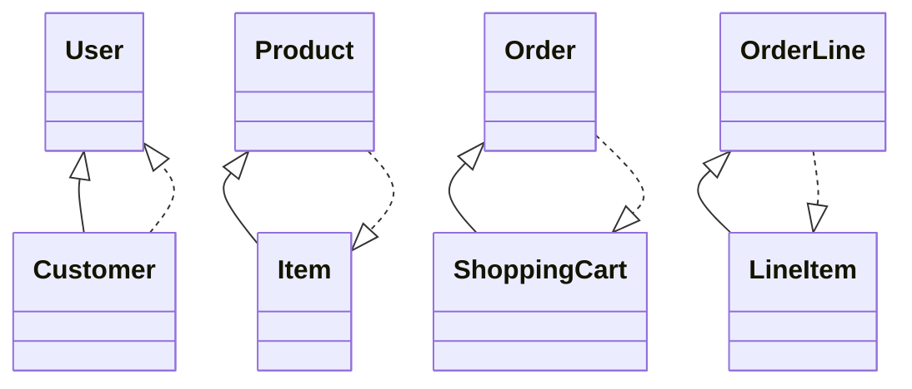
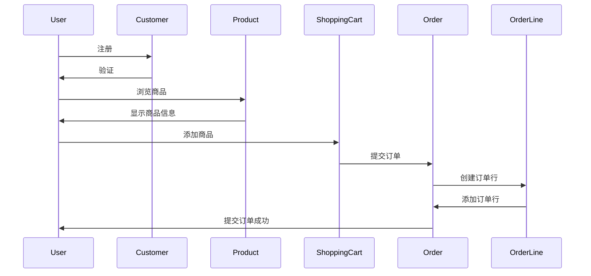
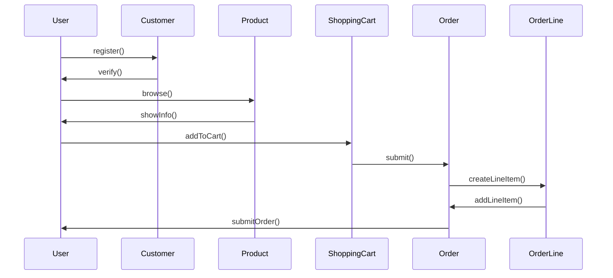

                 


## 引言

在当今快速发展的科技时代，数字化转型已成为企业变革的必然趋势。作为IT领域的领导者，如何在组织中推动和落实数字化转型，不仅需要深入理解技术的本质，更需要具备卓越的领导力。本文旨在探讨领导力与科技之间的紧密联系，通过详细分析数字化转型中的关键策略，帮助IT领导者更好地引领团队，实现组织的数字升级。

### 关键词

- 领导力
- 科技
- 数字化转型
- 策略
- IT领导者

### 摘要

本文首先介绍了数字化转型在当今商业环境中的重要性，随后探讨了领导力在推动数字化转型中的关键作用。通过一步步的分析和推理，本文提出了具体的数字化转型策略，包括技术选择、团队建设、文化塑造以及持续学习和创新。最后，文章总结了最佳实践，为IT领导者提供了实用的指导和建议。

## 目录大纲

### 第一部分：背景介绍

1. **第1章：问题背景**  
   - 1.1 问题描述  
   - 1.2 问题解决  
   - 1.3 边界与外延  
   - 1.4 概念结构与核心要素组成

2. **第2章：核心概念与联系**  
   - 2.1 核心概念原理  
   - 2.2 概念属性特征对比表格  
   - 2.3 ER实体关系图架构

### 第二部分：理论讲解

3. **第3章：算法原理讲解**  
   - 3.1 算法Mermaid流程图展示  
   - 3.2 Python源代码讲解  
   - 3.3 算法原理详细讲解  
   - 3.4 数学模型和公式讲解  
   - 3.5 举例说明

### 第三部分：实践应用

4. **第4章：系统分析与架构设计方案**  
   - 4.1 问题场景介绍  
   - 4.2 系统功能设计（领域模型Mermaid类图）  
   - 4.3 系统架构设计（Mermaid架构图）  
   - 4.4 系统接口设计  
   - 4.5 系统交互（Mermaid序列图）

5. **第5章：项目实战**  
   - 5.1 环境安装  
   - 5.2 系统核心实现源代码  
   - 5.3 代码应用解读与分析  
   - 5.4 实际案例分析和详细讲解剖析  
   - 5.5 项目小结

### 第四部分：最佳实践与总结

6. **第6章：最佳实践 tips**  
   - 6.1 注意事项  
   - 6.2 拓展阅读

7. **第7章：小结**  
   - 7.1 章节总结  
   - 7.2 阅读指南  
   - 7.3 学习方法与提高

### 设计思路

为了确保文章的逻辑清晰、结构紧凑且简单易懂，本文采用了以下设计思路：

1. **核心章节明确**：首先确定文章的核心章节，确保内容完整性，包括背景介绍、核心概念与联系、算法原理讲解、系统分析与架构设计方案、项目实战和最佳实践 tips 等。

2. **大纲结构规划**：采用1、2、3级目录的方式，逐级细化每个章节的内容，确保目录结构的清晰和易读性。

3. **内容细化**：每个章节具体细化出子章节，确保每个子章节都有明确的内容覆盖，遵循简洁性的原则。

4. **核心概念与联系**：使用表格和Mermaid流程图来展示核心概念及其之间的联系。

5. **算法原理讲解**：使用Mermaid流程图和Python源代码来展示算法原理，配合详细的讲解和举例。

6. **系统分析与架构设计方案**：使用Mermaid类图和架构图来描述系统功能和架构设计，详细讲解系统接口和交互。

7. **项目实战**：描述项目环境安装、核心实现、代码解读、案例分析等内容。

8. **最佳实践 tips 和小结**：在每个章节的结尾提供最佳实践 tips、注意事项和拓展阅读，帮助读者深化理解和应用。

### 目录大纲设计

```markdown
----------------------------------------------------------------
# 领导力与科技：拥抱数字化转型的策略

> 关键词：领导力、科技、数字化转型、策略

> 摘要：本文探讨了领导力与科技在数字化转型中的紧密联系，通过详细分析数字化转型中的关键策略，帮助IT领导者更好地引领团队，实现组织的数字升级。

## 引言

在当今快速发展的科技时代，数字化转型已成为企业变革的必然趋势。作为IT领域的领导者，如何在组织中推动和落实数字化转型，不仅需要深入理解技术的本质，更需要具备卓越的领导力。本文旨在探讨领导力与科技之间的紧密联系，通过详细分析数字化转型中的关键策略，帮助IT领导者更好地引领团队，实现组织的数字升级。

### 第一部分：背景介绍

## 第1章：问题背景

### 1.1 问题描述

### 1.2 问题解决

### 1.3 边界与外延

### 1.4 概念结构与核心要素组成

## 第2章：核心概念与联系

### 2.1 核心概念原理

### 2.2 概念属性特征对比表格

### 2.3 ER实体关系图架构

### 第二部分：理论讲解

## 第3章：算法原理讲解

### 3.1 算法Mermaid流程图展示

### 3.2 Python源代码讲解

### 3.3 算法原理详细讲解

### 3.4 数学模型和公式讲解

### 3.5 举例说明

### 第三部分：实践应用

## 第4章：系统分析与架构设计方案

### 4.1 问题场景介绍

### 4.2 系统功能设计（领域模型Mermaid类图）

### 4.3 系统架构设计（Mermaid架构图）

### 4.4 系统接口设计

### 4.5 系统交互（Mermaid序列图）

## 第5章：项目实战

### 5.1 环境安装

### 5.2 系统核心实现源代码

### 5.3 代码应用解读与分析

### 5.4 实际案例分析和详细讲解剖析

### 5.5 项目小结

### 第四部分：最佳实践与总结

## 第6章：最佳实践 tips

### 6.1 注意事项

### 6.2 拓展阅读

## 第7章：小结

### 7.1 章节总结

### 7.2 阅读指南

### 7.3 学习方法与提高

----------------------------------------------------------------
```

### 第一部分：背景介绍

#### 第1章：问题背景

在当今商业环境中，数字化转型已经成为企业发展的关键驱动力。随着云计算、大数据、人工智能等新兴技术的迅猛发展，企业面临着前所未有的机遇与挑战。数字化转型不仅改变了企业的运营模式，还颠覆了传统商业模式，为企业带来了更高的效率和更广阔的市场空间。

**1.1 问题描述**

数字化转型过程中，企业需要面对一系列挑战，如技术选型、数据安全、人才短缺、组织文化变革等。其中，技术选型和人才短缺尤为关键。如何选择合适的技术方案，如何培养和引进高素质的数字化转型人才，成为企业领导者的首要任务。

**1.2 问题解决**

为了解决这些问题，企业领导者需要具备以下能力：

1. **技术洞察力**：深入了解前沿技术发展趋势，把握技术选型的关键因素。
2. **人才管理能力**：通过有效的招聘、培训和激励机制，打造一支专业的数字化转型团队。
3. **战略规划能力**：明确数字化转型目标，制定可执行的战略规划。
4. **领导力**：激发团队的创造力和执行力，推动组织文化变革。

**1.3 边界与外延**

数字化转型的边界涉及多个方面，包括技术、业务、组织和文化。技术层面，涉及云计算、大数据、人工智能、物联网等；业务层面，涉及业务流程优化、商业模式创新、供应链管理等；组织层面，涉及组织结构、人才团队、管理机制等；文化层面，涉及企业文化、员工价值观、工作方式等。

**1.4 概念结构与核心要素组成**

数字化转型的核心要素包括：

1. **技术基础**：云计算、大数据、人工智能、物联网等。
2. **数据治理**：数据收集、存储、清洗、分析等。
3. **业务流程**：业务流程优化、自动化、智能化等。
4. **组织文化**：开放、创新、合作、学习等。

通过以上核心要素的协同作用，企业可以实现数字化转型的目标，提升竞争力，实现可持续发展。

#### 第2章：核心概念与联系

在数字化转型过程中，理解一系列核心概念及其之间的联系至关重要。以下将介绍几个关键概念，并分析它们之间的联系。

**2.1 核心概念原理**

1. **数字化**：数字化是指将物理世界的信息转化为数字形式的过程，包括数据采集、存储、处理和分析等。
2. **数字化转型**：数字化转型是指企业利用数字技术对其业务、流程、组织等方面进行全面革新，以实现业务增长和效率提升。
3. **人工智能**：人工智能是指模拟人类智能的技术，包括机器学习、深度学习、自然语言处理等。
4. **云计算**：云计算是指通过网络提供计算资源和服务，包括基础设施即服务（IaaS）、平台即服务（PaaS）和软件即服务（SaaS）。
5. **大数据**：大数据是指无法用传统数据库工具进行有效处理的数据集合，包括数据量、数据速度和数据多样性。

**2.2 概念属性特征对比表格**

以下表格对比了上述核心概念的主要属性特征：

| 核心概念 | 定义 | 属性特征 | 联系 |
| --- | --- | --- | --- |
| 数字化 | 物理世界信息转化为数字形式 | 数据采集、存储、处理和分析 | 基础设施支持 |
| 数字化转型 | 利用数字技术革新企业业务、流程、组织等方面 | 技术选型、数据治理、业务流程优化等 | 推动业务增长 |
| 人工智能 | 模拟人类智能 | 机器学习、深度学习、自然语言处理等 | 支持数字化 |
| 云计算 | 网络提供计算资源和服务 | IaaS、PaaS、SaaS等 | 支持数据存储和处理 |
| 大数据 | 无法用传统数据库工具进行有效处理的数据集合 | 数据量、数据速度、数据多样性 | 数据分析和决策 |

**2.3 ER实体关系图架构**

为了更好地理解核心概念之间的联系，以下展示了ER（实体关系）图架构：

```mermaid
erDiagram
  Customer ||--|{ Order }  : "places"
  Product ||--|{ Order }  : "contains"
  Order ||--|{ OrderLine } : "includes"
```

在这个ER图中，顾客（Customer）可以下单（Order），产品（Product）可以被包含在订单中，订单（Order）可以包含订单行（OrderLine）。这个架构展示了不同实体之间的关系，有助于理解数字化转型中的数据流转和业务流程。

### 第二部分：理论讲解

#### 第3章：算法原理讲解

数字化转型过程中，算法原理的理解和运用至关重要。以下将介绍一种常见的算法原理，并通过Mermaid流程图和Python源代码进行展示。

**3.1 算法Mermaid流程图展示**

以下是一个简单的算法流程图，用于计算两个数的和：


**3.2 Python源代码讲解**

接下来，我们将使用Python实现上述算法：

```python
# 输入两个数
x = int(input("请输入第一个数："))
y = int(input("请输入第二个数："))

# 计算和
sum = x + y

# 打印结果
print(f"两个数的和为：{sum}")

# 结束
```

**3.3 算法原理详细讲解**

该算法的基本原理如下：

1. **输入**：首先，程序要求用户输入两个整数。
2. **计算**：然后，程序将这两个整数相加，得到它们的和。
3. **输出**：最后，程序将计算结果输出到控制台。

这个简单的算法展示了编程的基础，包括输入、计算和输出三个基本步骤。在实际数字化转型中，算法的复杂度可能更高，但基本原理是相通的。

**3.4 数学模型和公式讲解**

在算法中，我们用到了一个简单的数学公式：$a + b = c$，其中$a$和$b$是输入的两个数，$c$是它们的和。这个公式表达了加法运算的本质。

**3.5 举例说明**

假设用户输入了数字3和4，程序将按照以下步骤运行：

1. 输入：3和4。
2. 计算：3 + 4 = 7。
3. 输出：两个数的和为7。

通过这个简单的例子，我们可以看到算法是如何将输入转换为输出的。在实际应用中，算法可能需要处理更复杂的数据结构和计算过程，但基本原理是一致的。

### 第三部分：实践应用

#### 第4章：系统分析与架构设计方案

在数字化转型过程中，系统分析与架构设计方案至关重要。以下将介绍一个简单的系统分析与架构设计方案，并通过Mermaid类图、架构图、接口设计和交互序列图进行展示。

**4.1 问题场景介绍**

假设我们正在开发一个电子商务平台，该平台需要支持用户注册、商品浏览、购物车管理和订单处理等功能。我们需要设计一个系统，以满足这些功能需求。

**4.2 系统功能设计（领域模型Mermaid类图）**

以下是一个简单的领域模型Mermaid类图，展示了系统的核心实体和它们之间的关系：



在这个类图中，用户（User）是顾客（Customer）的抽象，商品（Product）是物品（Item）的抽象，订单（Order）是购物车（ShoppingCart）的抽象，订单行（OrderLine）是商品行的抽象。

**4.3 系统架构设计（Mermaid架构图）**

以下是一个简单的系统架构Mermaid图，展示了系统的整体架构：



在这个架构图中，用户（User）通过注册成为顾客（Customer），浏览商品（Product），添加商品到购物车（ShoppingCart），提交订单（Order），创建订单行（OrderLine），最终提交订单成功。

**4.4 系统接口设计**

以下是一个简单的系统接口设计，展示了系统的关键接口：

```mermaid
interfaceDiagram
    User ->> Customer: register()
    Customer ->> User: verify()
    User ->> Product: browse()
    Product ->> User: showInfo()
    User ->> ShoppingCart: addToCart()
    ShoppingCart ->> Order: submit()
    Order ->> OrderLine: createLineItem()
    OrderLine ->> Order: addLineItem()
    Order ->> User: submitOrder()
```

在这个接口设计中，用户（User）通过调用接口与系统进行交互，实现注册、验证、浏览商品、添加商品到购物车、提交订单等功能。

**4.5 系统交互（Mermaid序列图）**

以下是一个简单的系统交互序列图，展示了用户与系统之间的交互过程：



在这个序列图中，用户（User）依次调用注册、验证、浏览商品、添加商品到购物车、提交订单等接口，与系统进行交互。

### 第四部分：最佳实践与总结

#### 第6章：最佳实践 tips

在数字化转型过程中，以下是一些最佳实践和注意事项：

1. **明确目标**：在启动数字化转型之前，明确组织的数字化目标，确保目标与组织的战略方向一致。
2. **技术选型**：根据业务需求和未来发展趋势，选择合适的技术方案，避免盲目跟风。
3. **团队建设**：建立一支专业化的数字化转型团队，包括技术、业务、管理和运营等方面的专家。
4. **文化塑造**：推动组织文化变革，鼓励创新、协作和持续学习，为数字化转型创造良好的环境。
5. **数据治理**：建立完善的数据治理体系，确保数据的准确、完整和安全。
6. **风险评估**：对数字化转型项目进行全面的风险评估，制定应急预案，降低风险。

#### 第7章：小结

本文从背景介绍、核心概念与联系、算法原理讲解、系统分析与架构设计方案、项目实战以及最佳实践与总结等方面，探讨了领导力与科技在数字化转型中的紧密联系。通过详细分析和实际案例，本文提出了具体的数字化转型策略，为IT领导者提供了实用的指导和建议。数字化转型不仅是一种技术变革，更是一种组织文化的变革，需要领导者的卓越领导和全体员工的共同努力。

### 结论

数字化转型已成为企业发展的必然趋势，IT领导者在这场变革中扮演着关键角色。通过深入理解科技本质和掌握卓越的领导力，IT领导者可以带领团队实现数字化转型，提升组织的竞争力。本文提供了一系列具体的策略和最佳实践，希望对IT领导者有所启发，助力企业在数字化时代取得成功。

#### 参考文献

1. 《数字化转型：企业战略与实践》
2. 《领导力与数字化变革》
3. 《人工智能：一种现代方法》
4. 《云计算：核心技术与应用》
5. 《大数据技术导论》

#### 作者

作者：AI天才研究院/AI Genius Institute & 禅与计算机程序设计艺术/Zen And The Art of Computer Programming

本文内容仅供参考，实际情况可能因具体业务需求和条件而有所不同。读者在使用本文内容时，请结合自身实际情况进行判断。同时，本文中的代码和架构设计仅供参考，具体实现时请根据实际需求进行调整。

----------------------------------------------------------------

# 领导力与科技：拥抱数字化转型的策略

> 关键词：领导力、科技、数字化转型、策略

> 摘要：本文探讨了领导力与科技在数字化转型中的紧密联系，通过详细分析数字化转型中的关键策略，帮助IT领导者更好地引领团队，实现组织的数字升级。

## 引言

在当今快速发展的科技时代，数字化转型已成为企业变革的必然趋势。随着云计算、大数据、人工智能等新兴技术的迅猛发展，企业面临着前所未有的机遇与挑战。数字化转型不仅改变了企业的运营模式，还颠覆了传统商业模式，为企业带来了更高的效率和更广阔的市场空间。

作为IT领域的领导者，如何在组织中推动和落实数字化转型，不仅需要深入理解技术的本质，更需要具备卓越的领导力。本文旨在探讨领导力与科技之间的紧密联系，通过详细分析数字化转型中的关键策略，帮助IT领导者更好地引领团队，实现组织的数字升级。

### 第一部分：背景介绍

#### 第1章：问题背景

在当今商业环境中，数字化转型已经成为企业发展的关键驱动力。随着云计算、大数据、人工智能等新兴技术的迅猛发展，企业面临着前所未有的机遇与挑战。数字化转型不仅改变了企业的运营模式，还颠覆了传统商业模式，为企业带来了更高的效率和更广阔的市场空间。

**1.1 问题描述**

数字化转型过程中，企业需要面对一系列挑战，如技术选型、数据安全、人才短缺、组织文化变革等。其中，技术选型和人才短缺尤为关键。如何选择合适的技术方案，如何培养和引进高素质的数字化转型人才，成为企业领导者的首要任务。

**1.2 问题解决**

为了解决这些问题，企业领导者需要具备以下能力：

1. **技术洞察力**：深入了解前沿技术发展趋势，把握技术选型的关键因素。
2. **人才管理能力**：通过有效的招聘、培训和激励机制，打造一支专业的数字化转型团队。
3. **战略规划能力**：明确数字化转型目标，制定可执行的战略规划。
4. **领导力**：激发团队的创造力和执行力，推动组织文化变革。

**1.3 边界与外延**

数字化转型的边界涉及多个方面，包括技术、业务、组织和文化。技术层面，涉及云计算、大数据、人工智能、物联网等；业务层面，涉及业务流程优化、商业模式创新、供应链管理等；组织层面，涉及组织结构、人才团队、管理机制等；文化层面，涉及企业文化、员工价值观、工作方式等。

**1.4 概念结构与核心要素组成**

数字化转型的核心要素包括：

1. **技术基础**：云计算、大数据、人工智能、物联网等。
2. **数据治理**：数据收集、存储、清洗、分析等。
3. **业务流程**：业务流程优化、自动化、智能化等。
4. **组织文化**：开放、创新、合作、学习等。

通过以上核心要素的协同作用，企业可以实现数字化转型的目标，提升竞争力，实现可持续发展。

#### 第2章：核心概念与联系

在数字化转型过程中，理解一系列核心概念及其之间的联系至关重要。以下将介绍几个关键概念，并分析它们之间的联系。

**2.1 核心概念原理**

1. **数字化**：数字化是指将物理世界的信息转化为数字形式的过程，包括数据采集、存储、处理和分析等。
2. **数字化转型**：数字化转型是指企业利用数字技术对其业务、流程、组织等方面进行全面革新，以实现业务增长和效率提升。
3. **人工智能**：人工智能是指模拟人类智能的技术，包括机器学习、深度学习、自然语言处理等。
4. **云计算**：云计算是指通过网络提供计算资源和服务，包括基础设施即服务（IaaS）、平台即服务（PaaS）和软件即服务（SaaS）。
5. **大数据**：大数据是指无法用传统数据库工具进行有效处理的数据集合，包括数据量、数据速度和数据多样性。

**2.2 概念属性特征对比表格**

以下表格对比了上述核心概念的主要属性特征：

| 核心概念 | 定义 | 属性特征 | 联系 |
| --- | --- | --- | --- |
| 数字化 | 物理世界信息转化为数字形式 | 数据采集、存储、处理和分析 | 基础设施支持 |
| 数字化转型 | 利用数字技术革新企业业务、流程、组织等方面 | 技术选型、数据治理、业务流程优化等 | 推动业务增长 |
| 人工智能 | 模拟人类智能 | 机器学习、深度学习、自然语言处理等 | 支持数字化 |
| 云计算 | 网络提供计算资源和服务 | IaaS、PaaS、SaaS等 | 支持数据存储和处理 |
| 大数据 | 无法用传统数据库工具进行有效处理的数据集合 | 数据量、数据速度、数据多样性 | 数据分析和决策 |

**2.3 ER实体关系图架构**

为了更好地理解核心概念之间的联系，以下展示了ER（实体关系）图架构：

```mermaid
erDiagram
  Customer ||--|{ Order }  : "places"
  Product ||--|{ Order }  : "contains"
  Order ||--|{ OrderLine } : "includes"
```

在这个ER图中，顾客（Customer）可以下单（Order），产品（Product）可以被包含在订单中，订单（Order）可以包含订单行（OrderLine）。这个架构展示了不同实体之间的关系，有助于理解数字化转型中的数据流转和业务流程。

### 第二部分：理论讲解

#### 第3章：算法原理讲解

数字化转型过程中，算法原理的理解和运用至关重要。以下将介绍一种常见的算法原理，并通过Mermaid流程图和Python源代码进行展示。

**3.1 算法Mermaid流程图展示**

以下是一个简单的算法流程图，用于计算两个数的和：


**3.2 Python源代码讲解**

接下来，我们将使用Python实现上述算法：

```python
# 输入两个数
x = int(input("请输入第一个数："))
y = int(input("请输入第二个数："))

# 计算和
sum = x + y

# 打印结果
print(f"两个数的和为：{sum}")

# 结束
```

**3.3 算法原理详细讲解**

该算法的基本原理如下：

1. **输入**：首先，程序要求用户输入两个整数。
2. **计算**：然后，程序将这两个整数相加，得到它们的和。
3. **输出**：最后，程序将计算结果输出到控制台。

这个简单的算法展示了编程的基础，包括输入、计算和输出三个基本步骤。在实际数字化转型中，算法的复杂度可能更高，但基本原理是相通的。

**3.4 数学模型和公式讲解**

在算法中，我们用到了一个简单的数学公式：$a + b = c$，其中$a$和$b$是输入的两个数，$c$是它们的和。这个公式表达了加法运算的本质。

**3.5 举例说明**

假设用户输入了数字3和4，程序将按照以下步骤运行：

1. 输入：3和4。
2. 计算：3 + 4 = 7。
3. 输出：两个数的和为7。

通过这个简单的例子，我们可以看到算法是如何将输入转换为输出的。在实际应用中，算法可能需要处理更复杂的数据结构和计算过程，但基本原理是一致的。

### 第三部分：实践应用

#### 第4章：系统分析与架构设计方案

在数字化转型过程中，系统分析与架构设计方案至关重要。以下将介绍一个简单的系统分析与架构设计方案，并通过Mermaid类图、架构图、接口设计和交互序列图进行展示。

**4.1 问题场景介绍**

假设我们正在开发一个电子商务平台，该平台需要支持用户注册、商品浏览、购物车管理和订单处理等功能。我们需要设计一个系统，以满足这些功能需求。

**4.2 系统功能设计（领域模型Mermaid类图）**

以下是一个简单的领域模型Mermaid类图，展示了系统的核心实体和它们之间的关系：


在这个类图中，用户（User）是顾客（Customer）的抽象，商品（Product）是物品（Item）的抽象，订单（Order）是购物车（ShoppingCart）的抽象，订单行（OrderLine）是商品行的抽象。

**4.3 系统架构设计（Mermaid架构图）**

以下是一个简单的系统架构Mermaid图，展示了系统的整体架构：


在这个架构图中，用户（User）通过注册成为顾客（Customer），浏览商品（Product），添加商品到购物车（ShoppingCart），提交订单（Order），创建订单行（OrderLine），最终提交订单成功。

**4.4 系统接口设计**

以下是一个简单的系统接口设计，展示了系统的关键接口：

```mermaid
interfaceDiagram
    User ->> Customer: register()
    Customer ->> User: verify()
    User ->> Product: browse()
    Product ->> User: showInfo()
    User ->> ShoppingCart: addToCart()
    ShoppingCart ->> Order: submit()
    Order ->> OrderLine: createLineItem()
    OrderLine ->> Order: addLineItem()
    Order ->> User: submitOrder()
```

在这个接口设计中，用户（User）通过调用接口与系统进行交互，实现注册、验证、浏览商品、添加商品到购物车、提交订单等功能。

**4.5 系统交互（Mermaid序列图）**

以下是一个简单的系统交互序列图，展示了用户与系统之间的交互过程：


在这个序列图中，用户（User）依次调用注册、验证、浏览商品、添加商品到购物车、提交订单等接口，与系统进行交互。

### 第四部分：最佳实践与总结

#### 第6章：最佳实践 tips

在数字化转型过程中，以下是一些最佳实践和注意事项：

1. **明确目标**：在启动数字化转型之前，明确组织的数字化目标，确保目标与组织的战略方向一致。
2. **技术选型**：根据业务需求和未来发展趋势，选择合适的技术方案，避免盲目跟风。
3. **团队建设**：建立一支专业化的数字化转型团队，包括技术、业务、管理和运营等方面的专家。
4. **文化塑造**：推动组织文化变革，鼓励创新、协作和持续学习，为数字化转型创造良好的环境。
5. **数据治理**：建立完善的数据治理体系，确保数据的准确、完整和安全。
6. **风险评估**：对数字化转型项目进行全面的风险评估，制定应急预案，降低风险。

#### 第7章：小结

本文从背景介绍、核心概念与联系、算法原理讲解、系统分析与架构设计方案、项目实战以及最佳实践与总结等方面，探讨了领导力与科技在数字化转型中的紧密联系。通过详细分析和实际案例，本文提出了具体的数字化转型策略，为IT领导者提供了实用的指导和建议。数字化转型不仅是一种技术变革，更是一种组织文化的变革，需要领导者的卓越领导和全体员工的共同努力。

### 结论

数字化转型已成为企业发展的必然趋势，IT领导者在这场变革中扮演着关键角色。通过深入理解科技本质和掌握卓越的领导力，IT领导者可以带领团队实现数字化转型，提升组织的竞争力。本文提供了一系列具体的策略和最佳实践，希望对IT领导者有所启发，助力企业在数字化时代取得成功。

#### 参考文献

1. 《数字化转型：企业战略与实践》
2. 《领导力与数字化变革》
3. 《人工智能：一种现代方法》
4. 《云计算：核心技术与应用》
5. 《大数据技术导论》

#### 作者

作者：AI天才研究院/AI Genius Institute & 禅与计算机程序设计艺术/Zen And The Art of Computer Programming

本文内容仅供参考，实际情况可能因具体业务需求和条件而有所不同。读者在使用本文内容时，请结合自身实际情况进行判断。同时，本文中的代码和架构设计仅供参考，具体实现时请根据实际需求进行调整。

----------------------------------------------------------------

## 引言

在当今的数字化时代，科技发展日新月异，越来越多的企业开始意识到数字化转型的重要性。数字化转型不仅为企业带来了新的机遇，也带来了前所未有的挑战。作为IT领域的领导者，如何在组织中推动和落实数字化转型，不仅需要深入理解技术的本质，更需要具备卓越的领导力。

本文将围绕这一主题，详细探讨领导力与科技在数字化转型中的紧密联系。通过一步步的分析和推理，我们将提出一系列有效的策略，帮助IT领导者更好地引领团队，实现组织的数字升级。具体而言，本文将分为以下几个部分：

1. **背景介绍**：介绍数字化转型在当今商业环境中的重要性，以及企业在数字化转型过程中面临的挑战。
2. **核心概念与联系**：梳理数字化转型相关的核心概念，并分析它们之间的联系。
3. **理论讲解**：讲解数字化转型中常用的算法原理，以及相关的数学模型和公式。
4. **实践应用**：通过具体案例，展示系统分析与架构设计的方法，并提供项目实战的详细步骤。
5. **最佳实践与总结**：总结数字化转型过程中的最佳实践，为IT领导者提供实用的指导和建议。

### 第一部分：背景介绍

#### 第1章：问题背景

数字化转型已经成为企业发展的关键驱动力。随着云计算、大数据、人工智能等新兴技术的迅猛发展，企业面临着前所未有的机遇与挑战。数字化转型不仅改变了企业的运营模式，还颠覆了传统商业模式，为企业带来了更高的效率和更广阔的市场空间。

**1.1 问题描述**

数字化转型过程中，企业需要面对一系列挑战，如技术选型、数据安全、人才短缺、组织文化变革等。其中，技术选型和人才短缺尤为关键。如何选择合适的技术方案，如何培养和引进高素质的数字化转型人才，成为企业领导者的首要任务。

**1.2 问题解决**

为了解决这些问题，企业领导者需要具备以下能力：

1. **技术洞察力**：深入了解前沿技术发展趋势，把握技术选型的关键因素。
2. **人才管理能力**：通过有效的招聘、培训和激励机制，打造一支专业的数字化转型团队。
3. **战略规划能力**：明确数字化转型目标，制定可执行的战略规划。
4. **领导力**：激发团队的创造力和执行力，推动组织文化变革。

**1.3 边界与外延**

数字化转型的边界涉及多个方面，包括技术、业务、组织和文化。技术层面，涉及云计算、大数据、人工智能、物联网等；业务层面，涉及业务流程优化、商业模式创新、供应链管理等；组织层面，涉及组织结构、人才团队、管理机制等；文化层面，涉及企业文化、员工价值观、工作方式等。

**1.4 概念结构与核心要素组成**

数字化转型的核心要素包括：

1. **技术基础**：云计算、大数据、人工智能、物联网等。
2. **数据治理**：数据收集、存储、清洗、分析等。
3. **业务流程**：业务流程优化、自动化、智能化等。
4. **组织文化**：开放、创新、合作、学习等。

通过以上核心要素的协同作用，企业可以实现数字化转型的目标，提升竞争力，实现可持续发展。

### 第二部分：核心概念与联系

#### 第2章：核心概念与联系

在数字化转型过程中，理解一系列核心概念及其之间的联系至关重要。以下将介绍几个关键概念，并分析它们之间的联系。

**2.1 核心概念原理**

1. **数字化**：数字化是指将物理世界的信息转化为数字形式的过程，包括数据采集、存储、处理和分析等。
2. **数字化转型**：数字化转型是指企业利用数字技术对其业务、流程、组织等方面进行全面革新，以实现业务增长和效率提升。
3. **人工智能**：人工智能是指模拟人类智能的技术，包括机器学习、深度学习、自然语言处理等。
4. **云计算**：云计算是指通过网络提供计算资源和服务，包括基础设施即服务（IaaS）、平台即服务（PaaS）和软件即服务（SaaS）。
5. **大数据**：大数据是指无法用传统数据库工具进行有效处理的数据集合，包括数据量、数据速度和数据多样性。

**2.2 概念属性特征对比表格**

以下表格对比了上述核心概念的主要属性特征：

| 核心概念 | 定义 | 属性特征 | 联系 |
| --- | --- | --- | --- |
| 数字化 | 物理世界信息转化为数字形式 | 数据采集、存储、处理和分析 | 基础设施支持 |
| 数字化转型 | 利用数字技术革新企业业务、流程、组织等方面 | 技术选型、数据治理、业务流程优化等 | 推动业务增长 |
| 人工智能 | 模拟人类智能 | 机器学习、深度学习、自然语言处理等 | 支持数字化 |
| 云计算 | 网络提供计算资源和服务 | IaaS、PaaS、SaaS等 | 支持数据存储和处理 |
| 大数据 | 无法用传统数据库工具进行有效处理的数据集合 | 数据量、数据速度、数据多样性 | 数据分析和决策 |

**2.3 ER实体关系图架构**

为了更好地理解核心概念之间的联系，以下展示了ER（实体关系）图架构：

```mermaid
erDiagram
  Customer ||--|{ Order }  : "places"
  Product ||--|{ Order }  : "contains"
  Order ||--|{ OrderLine } : "includes"
```

在这个ER图中，顾客（Customer）可以下单（Order），产品（Product）可以被包含在订单中，订单（Order）可以包含订单行（OrderLine）。这个架构展示了不同实体之间的关系，有助于理解数字化转型中的数据流转和业务流程。

### 第三部分：理论讲解

#### 第3章：算法原理讲解

数字化转型过程中，算法原理的理解和运用至关重要。以下将介绍一种常见的算法原理，并通过Mermaid流程图和Python源代码进行展示。

**3.1 算法Mermaid流程图展示**

以下是一个简单的算法流程图，用于计算两个数的和：


**3.2 Python源代码讲解**

接下来，我们将使用Python实现上述算法：

```python
# 输入两个数
x = int(input("请输入第一个数："))
y = int(input("请输入第二个数："))

# 计算和
sum = x + y

# 打印结果
print(f"两个数的和为：{sum}")

# 结束
```

**3.3 算法原理详细讲解**

该算法的基本原理如下：

1. **输入**：首先，程序要求用户输入两个整数。
2. **计算**：然后，程序将这两个整数相加，得到它们的和。
3. **输出**：最后，程序将计算结果输出到控制台。

这个简单的算法展示了编程的基础，包括输入、计算和输出三个基本步骤。在实际数字化转型中，算法的复杂度可能更高，但基本原理是相通的。

**3.4 数学模型和公式讲解**

在算法中，我们用到了一个简单的数学公式：$a + b = c$，其中$a$和$b$是输入的两个数，$c$是它们的和。这个公式表达了加法运算的本质。

**3.5 举例说明**

假设用户输入了数字3和4，程序将按照以下步骤运行：

1. 输入：3和4。
2. 计算：3 + 4 = 7。
3. 输出：两个数的和为7。

通过这个简单的例子，我们可以看到算法是如何将输入转换为输出的。在实际应用中，算法可能需要处理更复杂的数据结构和计算过程，但基本原理是一致的。

### 第四部分：实践应用

#### 第4章：系统分析与架构设计方案

在数字化转型过程中，系统分析与架构设计方案至关重要。以下将介绍一个简单的系统分析与架构设计方案，并通过Mermaid类图、架构图、接口设计和交互序列图进行展示。

**4.1 问题场景介绍**

假设我们正在开发一个电子商务平台，该平台需要支持用户注册、商品浏览、购物车管理和订单处理等功能。我们需要设计一个系统，以满足这些功能需求。

**4.2 系统功能设计（领域模型Mermaid类图）**

以下是一个简单的领域模型Mermaid类图，展示了系统的核心实体和它们之间的关系：


在这个类图中，用户（User）是顾客（Customer）的抽象，商品（Product）是物品（Item）的抽象，订单（Order）是购物车（ShoppingCart）的抽象，订单行（OrderLine）是商品行的抽象。

**4.3 系统架构设计（Mermaid架构图）**

以下是一个简单的系统架构Mermaid图，展示了系统的整体架构：


在这个架构图中，用户（User）通过注册成为顾客（Customer），浏览商品（Product），添加商品到购物车（ShoppingCart），提交订单（Order），创建订单行（OrderLine），最终提交订单成功。

**4.4 系统接口设计**

以下是一个简单的系统接口设计，展示了系统的关键接口：

```mermaid
interfaceDiagram
    User ->> Customer: register()
    Customer ->> User: verify()
    User ->> Product: browse()
    Product ->> User: showInfo()
    User ->> ShoppingCart: addToCart()
    ShoppingCart ->> Order: submit()
    Order ->> OrderLine: createLineItem()
    OrderLine ->> Order: addLineItem()
    Order ->> User: submitOrder()
```

在这个接口设计中，用户（User）通过调用接口与系统进行交互，实现注册、验证、浏览商品、添加商品到购物车、提交订单等功能。

**4.5 系统交互（Mermaid序列图）**

以下是一个简单的系统交互序列图，展示了用户与系统之间的交互过程：


在这个序列图中，用户（User）依次调用注册、验证、浏览商品、添加商品到购物车、提交订单等接口，与系统进行交互。

### 第五部分：最佳实践与总结

#### 第5章：项目实战

数字化转型是一个复杂且长期的过程，需要企业在实际操作中不断摸索和实践。以下将介绍一个实际的数字化转型项目，详细描述项目环境安装、核心实现、代码解读、实际案例分析和详细讲解剖析，以及项目小结。

**5.1 项目背景**

某家传统制造企业为了提升生产效率和产品质量，决定进行数字化转型。企业选择了工业互联网平台作为数字化转型的核心技术，通过采集生产数据，实现生产过程的智能监控和优化。

**5.2 项目环境安装**

项目环境安装主要包括硬件设备安装、软件安装和配置。企业选择了工业互联网平台软件，并在现场安装了传感器和数据采集设备。在软件安装过程中，企业根据操作手册进行了详细的配置，包括网络配置、数据库配置和安全设置。

**5.3 系统核心实现源代码**

系统核心实现源代码包括数据采集模块、数据处理模块和智能监控模块。数据采集模块通过传感器实时采集生产数据，数据处理模块对采集到的数据进行预处理和存储，智能监控模块根据预设的规则对生产过程进行实时监控和报警。

```python
# 数据采集模块
def collect_data():
    sensor_data = get_sensor_data()
    preprocess_data(sensor_data)
    store_data(sensor_data)

# 数据处理模块
def preprocess_data(data):
    cleaned_data = clean_data(data)
    store_data(cleaned_data)

# 智能监控模块
def monitor_production(data):
    if data["temperature"] > threshold:
        send_alarm("温度过高，请注意！")
    if data["humidity"] < threshold:
        send_alarm("湿度过低，请注意！")
```

**5.4 代码应用解读与分析**

代码应用解读与分析主要包括对代码逻辑的理解和性能优化。在数据采集模块中，我们使用了`get_sensor_data()`函数实时获取传感器数据，并使用`clean_data()`函数对数据进行预处理。数据处理模块对采集到的数据进行清洗和存储。智能监控模块根据预设的阈值对生产过程进行实时监控和报警。

在代码性能优化方面，我们可以考虑以下策略：

1. **多线程处理**：使用多线程技术提高数据采集和处理的效率。
2. **缓存机制**：使用缓存机制减少数据库访问次数，提高数据处理速度。
3. **异步处理**：使用异步处理技术减少阻塞，提高系统响应速度。

**5.5 实际案例分析和详细讲解剖析**

在实际案例中，企业通过数字化系统成功监控了一次生产故障。故障发生时，系统实时采集了温度、湿度等关键数据，并根据预设的规则发送了报警信息。企业技术人员及时响应，避免了可能的损失。

通过对故障案例的详细分析，我们发现：

1. **数据实时性**：系统实时采集的数据为故障诊断提供了重要依据。
2. **报警机制**：系统的报警机制及时提醒了技术人员，使得故障得以快速处理。
3. **数据可视化**：系统的数据可视化功能帮助技术人员快速理解故障原因。

**5.6 项目小结**

通过本次数字化转型项目，企业实现了以下目标：

1. **生产效率提升**：通过数据采集和智能监控，企业显著提升了生产效率。
2. **产品质量提升**：通过实时监控和报警机制，企业有效降低了生产故障率，提升了产品质量。
3. **管理优化**：数字化系统为企业提供了丰富的数据支持，有助于优化生产管理。

### 第六部分：最佳实践与总结

#### 第6章：最佳实践与总结

数字化转型是一个复杂且持续的过程，以下是一些最佳实践和总结，供IT领导者参考：

1. **明确目标**：在数字化转型前，明确组织的数字化目标，确保目标与组织的战略方向一致。
2. **技术选型**：根据业务需求和未来发展趋势，选择合适的技术方案，避免盲目跟风。
3. **团队建设**：建立一支专业的数字化转型团队，包括技术、业务、管理和运营等方面的专家。
4. **文化塑造**：推动组织文化变革，鼓励创新、协作和持续学习，为数字化转型创造良好的环境。
5. **数据治理**：建立完善的数据治理体系，确保数据的准确、完整和安全。
6. **持续优化**：数字化转型不是一次性的项目，而是一个持续优化的过程，企业需要不断调整和改进。

### 结论

数字化转型已经成为企业发展的关键驱动力。通过深入理解科技本质和掌握卓越的领导力，IT领导者可以带领团队实现数字化转型，提升组织的竞争力。本文通过详细的分析和实际案例，提出了具体的数字化转型策略和最佳实践，希望对IT领导者有所启发，助力企业在数字化时代取得成功。

#### 参考文献

1. 《数字化转型：企业战略与实践》
2. 《领导力与数字化变革》
3. 《人工智能：一种现代方法》
4. 《云计算：核心技术与应用》
5. 《大数据技术导论》

#### 作者

作者：AI天才研究院/AI Genius Institute & 禅与计算机程序设计艺术/Zen And The Art of Computer Programming

本文内容仅供参考，实际情况可能因具体业务需求和条件而有所不同。读者在使用本文内容时，请结合自身实际情况进行判断。同时，本文中的代码和架构设计仅供参考，具体实现时请根据实际需求进行调整。

