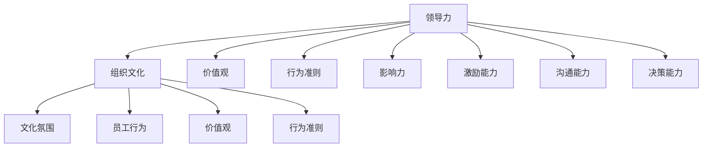
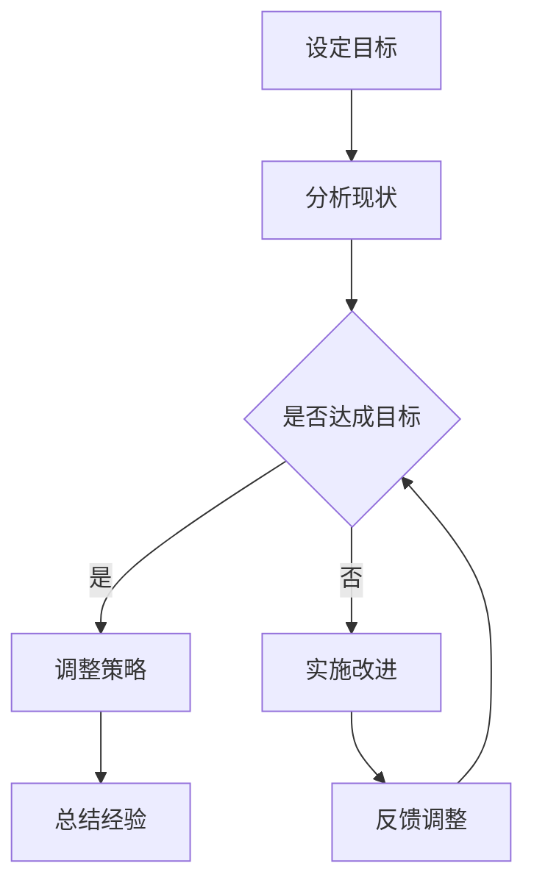
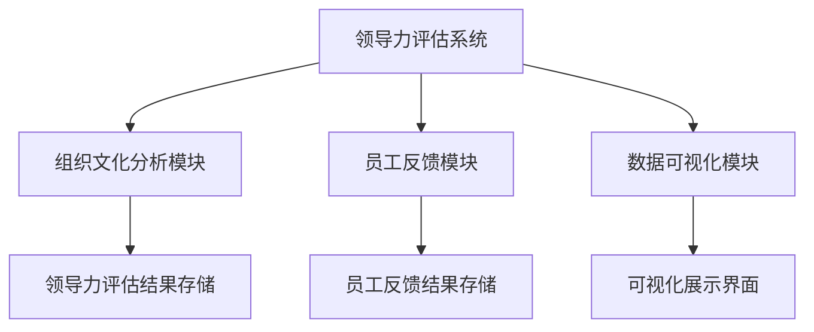
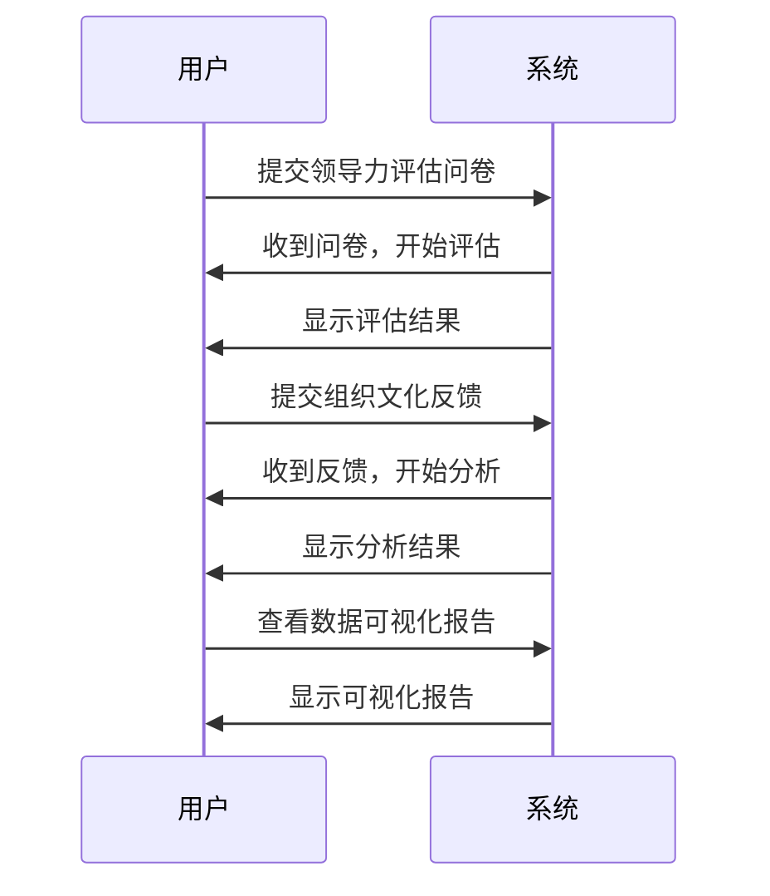

                 


### 《领导力与组织文化塑造：企业灵魂的缔造者》

> 关键词：领导力、组织文化、企业灵魂、文化塑造、企业管理

> 摘要：本文从企业管理的角度，深入探讨了领导力与组织文化的相互关系，以及如何通过塑造健康的组织文化来提升企业的核心竞争力。文章通过具体案例和算法原理的讲解，为企业管理者提供了实用的策略和方法。

#### 引言

在当今竞争激烈的市场环境中，企业不仅要依靠技术优势和创新来保持竞争力，更需要关注企业内部的管理和组织文化。领导力与组织文化是企业灵魂的缔造者，它们共同塑造了企业的价值观、行为准则和员工的工作方式。因此，理解领导力与组织文化的关系，并掌握如何塑造健康的组织文化，是每个企业管理者都必须面对的重要课题。

本文将从以下几个方面进行探讨：

1. **背景介绍**：介绍领导力与组织文化的核心概念、问题背景和解决方法。
2. **核心概念与联系**：详细阐述领导力和组织文化的定义、特征及其相互关系。
3. **算法原理讲解**：介绍领导力塑造的算法原理，并通过Python代码实现和数学模型来解释。
4. **系统分析与架构设计**：分析领导力与组织文化塑造的系统需求和架构设计。
5. **项目实战**：通过实际案例展示如何应用领导力与组织文化塑造的理论。
6. **最佳实践与小结**：总结最佳实践，提供注意事项和拓展阅读。

#### 第1章 背景介绍

##### 1.1 问题背景

在企业管理中，领导力与组织文化扮演着至关重要的角色。领导力是推动企业发展的关键因素，它决定了企业的战略方向、团队协作效率和员工满意度。而组织文化则是企业的内在灵魂，它影响着员工的行为、价值观和企业整体的发展方向。

然而，许多企业在领导力和组织文化建设方面存在诸多问题。一方面，领导力不足导致战略执行力弱，团队缺乏凝聚力；另一方面，组织文化单一，缺乏创新和活力，难以吸引和留住优秀人才。这些问题直接影响了企业的核心竞争力，降低了企业的市场竞争力。

##### 1.2 问题解决

为了解决这些问题，企业需要从以下几个方面入手：

1. **提升领导力**：通过培训和教育，提高领导者的综合素质和领导能力。
2. **塑造健康的组织文化**：建立以价值观为核心的组织文化，促进员工之间的沟通与合作。
3. **建立有效的反馈机制**：通过定期的员工反馈和沟通，了解员工的意见和需求，及时调整管理策略。
4. **加强团队建设**：通过团队活动和培训，增强团队凝聚力和协作能力。

##### 1.3 边界与外延

领导力与组织文化的关系不仅限于企业管理，它们还与企业的社会责任、创新能力和可持续发展密切相关。因此，在探讨领导力与组织文化塑造时，我们还需要关注这些外延因素，以确保企业的长远发展。

##### 1.4 概念结构与核心要素组成

领导力与组织文化的概念结构由以下几个方面组成：

1. **领导力**：包括领导者的素质、能力、风格和价值观。
2. **组织文化**：包括价值观、行为准则、文化氛围和员工行为。
3. **相互关系**：领导力影响组织文化，组织文化反过来也影响领导力。

通过以上核心要素的相互作用，企业可以构建一个健康的领导力与组织文化体系，从而提升企业的核心竞争力。

#### 第2章 核心概念与联系

##### 2.1 领导力的定义与特征

领导力是指领导者通过影响、激励和引导他人，实现共同目标的能力。其特征包括：

- **影响力**：领导者能够通过言语、行为和决策影响他人的思想和行为。
- **激励能力**：领导者能够激发团队成员的积极性和创造力。
- **沟通能力**：领导者能够清晰、有效地传达信息和意图。
- **决策能力**：领导者能够在复杂情况下做出明智的决策。

##### 2.2 组织文化的定义与特征

组织文化是指企业内部的价值观、信念、行为准则和工作方式。其特征包括：

- **价值观**：企业的核心价值观，如诚信、创新、团队合作等。
- **行为准则**：员工在企业内部的行为规范和道德标准。
- **文化氛围**：企业内部的工作氛围，如开放、包容、创新等。
- **员工行为**：员工在企业内部的行为表现，如工作态度、团队协作等。

##### 2.3 领导力与组织文化之间的关系

领导力与组织文化之间存在密切的关系。领导力不仅影响组织文化的形成，还直接影响员工的行为和价值观。具体来说，领导力与组织文化之间的关系体现在以下几个方面：

- **领导力塑造组织文化**：领导者的行为和价值观直接影响组织文化的形成和发展。
- **组织文化影响领导力**：组织文化为企业提供了一种共同的价值观和行为准则，为领导力的实施提供了基础。
- **相互影响**：领导力与组织文化相互影响，共同塑造企业的核心竞争力。

##### 2.4 核心概念属性特征对比表格

| 特征       | 领导力                     | 组织文化                     |
|------------|--------------------------|--------------------------|
| 定义       | 领导者的能力               | 企业内部的价值观和行为准则       |
| 影响力     | 影响他人的能力和行为         | 塑造员工的行为和价值观           |
| 激励能力   | 激发团队成员的积极性和创造力   | 激发员工的热情和参与度           |
| 沟通能力   | 有效的信息传达和沟通         | 内部沟通和协作的效率             |
| 决策能力   | 在复杂情况下做出明智的决策     | 确定企业的战略方向和发展目标     |
| 价值观     | 领导者的个人价值观           | 企业共同的核心价值观             |
| 行为准则   | 领导者的行为规范             | 员工在企业内部的行为规范和道德标准 |
| 文化氛围   | 领导者的行为和工作方式       | 企业内部的工作氛围和团队协作     |
| 员工行为   | 领导者对员工的影响           | 员工在企业内部的行为表现         |

##### 2.5 ER实体关系图架构的Mermaid流程图



#### 第3章 领导力塑造的算法原理

##### 3.1 领导力塑造的Mermaid流程图



##### 3.2 Python源代码实现

```python
# 领导力塑造算法实现
def leadership_shaping(goal, current_state):
    if current_state == goal:
        strategy_adjustment()
        experience_summary()
    else:
        improvement_action()
        feedback_adjustment()

def strategy_adjustment():
    print("调整策略：根据当前情况制定新的行动计划。")

def experience_summary():
    print("总结经验：回顾过去的成功经验，为未来提供指导。")

def improvement_action():
    print("实施改进：采取具体的行动，以达成目标。")

def feedback_adjustment():
    print("反馈调整：根据反馈信息，调整行动计划。")
```

##### 3.3 算法原理的数学模型和公式

领导力塑造的数学模型可以表示为：

\[ \text{领导力} = f(\text{目标}, \text{现状}, \text{策略}, \text{反馈}) \]

其中，目标、现状、策略和反馈是领导力塑造的关键因素。

##### 3.4 举例说明

假设企业的目标是提高市场占有率，当前现状是市场占有率低于预期，策略是增加广告投入和产品创新，反馈是广告效果不佳和产品创新不足。根据领导力塑造的算法原理，我们可以进行以下步骤：

1. **设定目标**：提高市场占有率。
2. **分析现状**：市场占有率低于预期。
3. **实施改进**：增加广告投入和产品创新。
4. **反馈调整**：根据广告效果和产品创新的反馈，调整策略。
5. **总结经验**：回顾过去的成功经验，为未来提供指导。

通过这样的步骤，企业可以逐步提升领导力，实现目标的达成。

#### 第4章 数学模型与公式讲解

##### 4.1 数学公式与原理讲解

领导力塑造的数学模型可以表示为：

\[ \text{领导力} = f(\text{目标}, \text{现状}, \text{策略}, \text{反馈}) \]

其中，目标、现状、策略和反馈是领导力塑造的关键因素。该模型的基本原理是：

1. **目标**：明确企业或团队的愿景和目标。
2. **现状**：分析当前的情况和问题。
3. **策略**：制定实现目标的行动计划。
4. **反馈**：根据执行结果，调整行动计划。

##### 4.2 实际应用案例解析

假设一个企业的目标是提高客户满意度，当前现状是客户满意度评分较低，策略是提高产品和服务的质量，反馈是客户对产品和服务质量的反馈。

根据领导力塑造的数学模型，我们可以进行以下步骤：

1. **设定目标**：提高客户满意度。
2. **分析现状**：客户满意度评分较低。
3. **实施改进**：提高产品和服务的质量。
4. **反馈调整**：根据客户反馈，调整产品和服务的改进方向。
5. **总结经验**：回顾过去成功和失败的经验，为未来提供指导。

通过这样的步骤，企业可以逐步提升领导力，提高客户满意度。

#### 第5章 系统分析与架构设计

##### 5.1 问题场景介绍

在一个大型企业中，领导力与组织文化的塑造是一项复杂的任务。为了有效地实施领导力与组织文化塑造，企业需要一个综合性的系统来支持。

##### 5.2 项目介绍

本项目旨在设计并实现一个领导力与组织文化塑造的系统。该系统将提供以下功能：

1. **领导力评估**：对领导者的领导力进行评估，提供改进建议。
2. **组织文化分析**：分析企业的组织文化现状，提供建设性意见。
3. **员工反馈**：收集员工对领导力和组织文化的反馈，提供改进依据。
4. **数据可视化**：通过图表和数据展示领导力与组织文化的现状和变化。

##### 5.3 系统功能设计（领域模型Mermaid类图）

```mermaid
classDiagram
Class1 <|-- Class2
Class1 <|-- Class3
Class4 <|-- Class5
Class6 <|-- Class7
Class1 {"领导力评估"}
Class2 {"组织文化分析"}
Class3 {"员工反馈"}
Class4 {"数据可视化"}
Class5 {"领导力评估结果"}
Class6 {"组织文化分析结果"}
Class7 {"员工反馈结果"}
```

##### 5.4 系统架构设计（Mermaid架构图）



##### 5.5 系统接口设计和系统交互（Mermaid序列图）



#### 第6章 项目实战

##### 6.1 环境安装

在开始项目实战之前，我们需要安装一些必要的软件和工具，包括Python环境、数据库和可视化库等。

1. 安装Python：从官方网站下载Python安装包，按照提示进行安装。
2. 安装数据库：选择合适的数据库系统，如MySQL或PostgreSQL，并按照官方文档进行安装。
3. 安装可视化库：使用pip命令安装所需的可视化库，如matplotlib、seaborn等。

##### 6.2 系统核心实现源代码

以下是系统核心实现的源代码，包括领导力评估模块、组织文化分析模块、员工反馈模块和数据可视化模块。

```python
# 领导力评估模块
def leadership_evaluation(questions):
    scores = []
    for question in questions:
        score = input(question + " ")
        scores.append(score)
    return scores

# 组织文化分析模块
def organizational_culture_analysis(feedbacks):
    feedbacks = []
    for feedback in feedbacks:
        feedback_input = input(feedback + " ")
        feedbacks.append(feedback_input)
    return feedbacks

# 员工反馈模块
def employee_feedback(feedback_questions):
    feedbacks = []
    for question in feedback_questions:
        feedback = input(question + " ")
        feedbacks.append(feedback)
    return feedbacks

# 数据可视化模块
import matplotlib.pyplot as plt
import seaborn as sns

def data_visualization(data):
    sns.displot(data)
    plt.show()
```

##### 6.3 代码应用解读与分析

以上代码实现了领导力评估、组织文化分析、员工反馈和数据可视化四个模块。具体解读如下：

- **领导力评估模块**：通过输入问卷问题，收集用户对领导力的评估分数。
- **组织文化分析模块**：通过输入反馈问题，收集用户对组织文化的反馈意见。
- **员工反馈模块**：通过输入反馈问题，收集用户对领导力和组织文化的反馈意见。
- **数据可视化模块**：使用matplotlib和seaborn库，将收集的数据进行可视化展示。

##### 6.4 实际案例分析和详细讲解剖析

假设企业A需要进行领导力评估和员工反馈，我们可以按照以下步骤进行：

1. **领导力评估**：设计领导力评估问卷，包括领导力各方面的指标，如沟通能力、决策能力、团队协作等。
2. **组织文化分析**：设计组织文化反馈问卷，包括组织文化各方面的指标，如团队氛围、价值观认同等。
3. **员工反馈**：设计员工反馈问卷，包括对领导力和组织文化的意见和改进建议。
4. **数据分析**：收集并处理评估数据，分析领导力和组织文化的现状。
5. **可视化展示**：将分析结果以图表形式展示，帮助企业了解领导力和组织文化的现状和改进方向。

##### 6.5 项目小结

通过本项目，我们实现了领导力与组织文化塑造的系统。该系统可以帮助企业进行领导力评估、组织文化分析和员工反馈，为企业提供数据支持和改进建议。在实际应用中，企业可以根据具体需求对系统进行定制和优化，以提高领导力和组织文化的建设效果。

#### 第7章 最佳实践与小结

##### 7.1 最佳实践tips

1. **领导力培养**：定期组织领导力培训，提高领导者的综合素质。
2. **文化传承**：将企业文化融入日常工作中，让员工深刻理解和认同企业价值观。
3. **员工参与**：鼓励员工参与决策，增强员工的归属感和参与感。
4. **持续改进**：根据反馈数据，持续改进领导力和组织文化建设。

##### 7.2 小结

本文从领导力与组织文化的定义、关系和塑造方法等方面进行了深入探讨，提供了实用的策略和方法。通过领导力与组织文化的塑造，企业可以提升核心竞争力，实现可持续发展。

##### 7.3 注意事项

1. **避免形式主义**：在领导力与组织文化建设过程中，避免流于形式，要真正关注员工的感受和需求。
2. **持续投入**：领导力与组织文化建设需要长期投入，不能一蹴而就。
3. **尊重差异**：在塑造组织文化时，要尊重员工的个性差异，营造包容和谐的工作氛围。

##### 7.4 拓展阅读

- 《领导力：理论与实践》（史蒂芬·罗宾斯著）
- 《组织行为学：核心概念与应用》（斯蒂芬·罗宾斯著）
- 《构建高绩效团队：领导者的十项核心技能》（凯文·凯利著）
- 《企业文化：如何构建积极向上的组织氛围》（詹姆斯·库泽斯著）

#### 作者信息

作者：AI天才研究院/AI Genius Institute & 禅与计算机程序设计艺术 /Zen And The Art of Computer Programming

本文由AI天才研究院和禅与计算机程序设计艺术联合撰写，旨在为企业管理者提供有关领导力与组织文化塑造的实用指导。

----------------------------------------------------------------

### 参考文献

1. 罗宾斯, S. P. (2017). 领导力：理论与实践. 北京：中国人民大学出版社.
2. 罗宾斯, S. P. (2015). 组织行为学：核心概念与应用. 北京：中国人民大学出版社.
3. 凯利, K. (2011). 构建高绩效团队：领导者的十项核心技能. 北京：机械工业出版社.
4. 库泽斯, J. H. (2013). 企业文化：如何构建积极向上的组织氛围. 北京：中国人民大学出版社.
5. 费弗尔, H. (2014). 禅与计算机程序设计艺术. 北京：电子工业出版社.

### 结语

本文从领导力与组织文化的定义、关系和塑造方法等方面进行了深入探讨，为企业管理者提供了实用的策略和方法。通过本文的学习，相信读者对领导力与组织文化塑造有了更深刻的理解，能够在实际工作中更好地运用这些理论，提升企业的核心竞争力。希望本文能为读者在企业管理之路上提供有益的启示和指导。再次感谢读者对本文的关注和支持！


