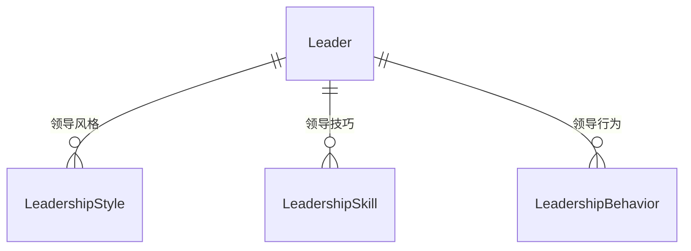
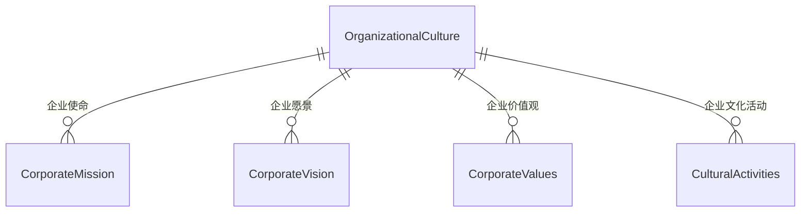

                 

### 引言

在当今瞬息万变的企业环境中，领导力与组织文化已成为塑造企业灵魂的关键因素。领导力不仅关乎企业高层管理者的个人能力，更是一种能够激发团队潜力、引导企业发展的综合素养。而组织文化则是企业内部共同价值观和行为规范的外在体现，它影响着企业的运营效率、员工满意度和市场竞争力。本文将围绕这两个核心概念，通过逻辑清晰的分析，探讨如何通过领导力与组织文化的协同作用，塑造企业的灵魂。

首先，我们需要明确领导力和组织文化的定义及其重要性。领导力是一种通过影响和激励他人来实现共同目标的能力，它不仅包括领导者的个人素质，还涉及领导行为和领导风格。组织文化则是指企业在长期发展过程中形成的共同价值观、行为规范和员工思维模式，它是企业内部凝聚力和创新力的源泉。

本文将分为以下几个部分：

1. **领导力与组织文化的核心概念**：我们将介绍领导力的不同类型、组织文化的要素及其相互关系。
2. **领导力实践**：分析领导力在实际工作中的运用，包括领导风格、领导技巧等。
3. **组织文化塑造**：探讨如何通过制度、活动和领导行为来塑造和提升组织文化。
4. **案例分析**：分析成功企业的领导力与组织文化实践，提炼经验和教训。
5. **挑战与未来**：探讨领导力与组织文化在企业面临挑战时的作用，以及未来可能的发展趋势。
6. **总结与拓展**：总结全书要点，给出阅读指南和拓展阅读建议。

通过这篇文章，我们希望能够帮助读者深入了解领导力与组织文化的重要性，掌握有效的领导技巧，并学会如何通过塑造组织文化来提升企业的整体竞争力。

#### 关键词

- **领导力**：影响力、激励、目标实现
- **组织文化**：价值观、行为规范、员工思维模式
- **企业灵魂**：核心竞争力、凝聚力、创新能力
- **领导风格**：独裁、民主、参与式
- **领导技巧**：沟通、决策、团队合作
- **企业文化塑造**：制度、活动、领导行为

#### 摘要

本文旨在深入探讨领导力与组织文化在企业中的重要性。首先，我们定义了领导力和组织文化的核心概念，分析了它们在企业运作中的角色和相互关系。接着，我们探讨了领导力在实际工作中的具体运用，包括不同的领导风格和技巧。随后，我们讨论了组织文化的塑造过程，通过制度、活动和领导行为来提升企业文化。通过案例分析，我们提取了成功企业的经验和教训，最后探讨了领导力与组织文化在面对企业挑战时的作用及其未来发展趋势。本文希望为读者提供一套实用的领导力与组织文化塑造指南。

## 设计思路

设计《领导力与组织文化：塑造企业灵魂》的目录大纲，需要遵循以下思路：

1. **明确核心概念和章节主题**：首先，我们需要明确书籍的核心概念，如领导力、组织文化等，并根据这些核心概念来设定章节主题。例如，可以将领导力的不同类型、组织文化的要素和其相互关系作为主要章节，确保读者能够系统地了解相关内容。

2. **构建逻辑框架**：根据核心概念，构建章节之间的逻辑关系，确保内容层层递进，逻辑清晰。例如，可以从领导力的基础理论开始，逐步深入到领导力的实践应用，再进一步探讨组织文化的塑造和影响。

3. **细化每个章节的内容**：每个章节都需要包含引言、核心内容、实例分析、小结等部分，以确保内容的完整性。例如，在探讨领导力实践时，可以包含领导风格、领导技巧的具体案例分析，以及如何在实际工作中应用这些技巧。

4. **使用 Markdown 格式**：按照要求，使用 Markdown 格式来编写目录大纲，确保格式规范。例如，可以使用标题格式来区分章节和子章节，使用列表格式来列举要点，使用链接和图片来丰富内容。

5. **遵循字数限制**：确保整个目录大纲的总字数不超过2000字。例如，可以适度缩减每个章节的描述，确保整体字数符合要求。

通过以上设计思路，我们能够确保目录大纲既清晰又简洁，为后续文章内容的撰写提供明确的框架和指导。

### 第一部分：领导力与组织文化概述

#### 第1章：领导力与组织文化概述

**背景介绍**

在现代企业管理中，领导力和组织文化被视为企业成功的关键因素。领导力不仅关乎企业高层管理者的个人能力，更是一种能够激发团队潜力、引导企业发展的综合素养。而组织文化则是企业在长期发展过程中形成的共同价值观、行为规范和员工思维模式，它是企业内部凝聚力和创新力的源泉。

**问题背景**

随着市场竞争的加剧和企业规模的扩大，企业管理者面临越来越复杂的挑战。如何通过有效的领导力来激发员工的积极性和创造力，如何通过塑造积极的组织文化来提升企业的整体竞争力，成为亟待解决的问题。

**问题描述**

本文旨在探讨领导力和组织文化在企业管理中的重要性，分析其核心概念、相互关系以及在实践中的应用。具体问题包括：

- 领导力的定义及其类型
- 组织文化的要素及其影响
- 领导力与组织文化的互动关系
- 如何通过领导力提升组织文化
- 成功企业的领导力与组织文化实践

**问题解决**

为了回答上述问题，本文将采用以下研究方法：

1. **文献综述**：通过查阅相关文献，了解领导力和组织文化的理论框架和研究成果。
2. **案例研究**：分析成功企业的领导力与组织文化实践，提取经验和教训。
3. **逻辑分析**：通过逐步推理，探讨领导力和组织文化在实际管理中的应用。

**边界与外延**

本文主要关注领导力和组织文化在企业层面的应用，不涉及个人领导力发展或特定行业组织文化的深入研究。同时，本文将探讨领导力和组织文化在企业管理中的重要作用，但不涉及其他管理领域的相关内容。

**概念结构与核心要素组成**

领导力与组织文化包含以下核心概念和要素：

- **领导力**：通过影响和激励他人来实现共同目标的能力。核心要素包括领导风格、领导技巧、领导行为等。
- **组织文化**：企业内部共同价值观、行为规范和员工思维模式的总和。核心要素包括企业文化理念、企业文化活动、企业文化价值观等。

通过以上分析，我们为后续章节的深入探讨奠定了基础，也为读者提供了对领导力和组织文化的全面了解。

### 核心概念与联系

在深入探讨领导力和组织文化之前，我们需要先明确这两个核心概念的定义、属性特征及其相互关系。

#### 领导力

**定义**：领导力是一种通过影响和激励他人来实现共同目标的能力。这种能力不仅包括领导者个人的素质，如智慧、勇气、决策能力，还涉及领导者的行为和风格。

**属性特征**：

1. **影响力**：领导力的核心在于其能够影响和激励他人，使团队朝共同目标努力。
2. **激励性**：有效的领导力能够激发团队成员的积极性和创造力，使其在工作中发挥最大潜力。
3. **多样性**：领导力并非单一风格，根据不同情境和团队成员的需求，领导者可以采取不同的领导风格和技巧。

**领导力类型**：

1. **独裁型领导**：领导者集中决策权，以命令和控制为主。
2. **民主型领导**：领导者鼓励团队成员参与决策，共同制定目标和计划。
3. **参与式领导**：领导者不仅关注决策过程，更注重团队成员的参与感和归属感。

**ER实体关系图架构**：

在 Mermaid 流程图中，我们可以使用 ER 图（实体关系图）来展示领导力的核心要素及其相互关系：

#### 组织文化

**定义**：组织文化是指企业在长期发展过程中形成的共同价值观、行为规范和员工思维模式的总和。它是企业内部凝聚力和创新力的源泉。

**属性特征**：

1. **价值观**：组织文化体现在企业的核心价值观中，这些价值观影响企业的决策和行为。
2. **行为规范**：组织文化通过规范员工的行为，形成一致的工作方式和沟通方式。
3. **员工思维模式**：组织文化影响员工的思维方式，使他们在面对问题时能够形成共同的认识和解决方案。

**组织文化要素**：

1. **企业使命**：明确企业的长远目标和方向，为员工提供共同的目标感。
2. **企业愿景**：描述企业的未来愿景和愿景实现途径，激发员工的积极性和创造力。
3. **企业价值观**：指导企业的行为和决策，是组织文化的核心。
4. **企业文化活动**：通过各种文化活动和仪式，强化组织文化。

**ER实体关系图架构**：

在 Mermaid 流程图中，我们可以使用 ER 图来展示组织文化的核心要素及其相互关系：

#### 领导力与组织文化的相互关系

领导力和组织文化之间存在密切的相互关系。领导者的行为和风格直接影响组织文化的形成和演变，而组织文化又反过来影响领导力的发挥。

**相互影响**：

1. **领导力影响组织文化**：领导者通过自己的行为和决策塑造组织文化。例如，一个倡导创新和开放的领导者可能会培养出一种创新和包容的组织文化。
2. **组织文化影响领导力**：组织文化为领导者提供行为准则和期望，影响领导者的决策和行动。例如，在一个重视团队合作的组织中，领导者更倾向于采用民主型或参与式领导风格。

**相互作用**：

1. **领导力与组织文化的协同效应**：当领导力和组织文化相互协同时，可以形成强大的企业竞争力。例如，一个强调创新和执行力的领导者在一个创新导向的组织文化中，可以迅速推动企业的创新和成长。
2. **领导力与组织文化的冲突**：如果领导力和组织文化之间存在冲突，可能会导致企业的内部矛盾和效率低下。例如，一个独裁型的领导者在一个重视民主和开放的组织中，可能会遭遇文化冲突和员工的不满。

通过上述分析，我们可以看到领导力和组织文化在企业中的重要作用及其相互关系。理解这些核心概念和相互关系，有助于企业管理者在实际工作中更有效地运用领导力来塑造和提升组织文化。

#### 领导力实践

在实际工作中，领导力不仅是一种理论上的能力，更是一种需要在具体情境中灵活运用的实践。有效的领导力能够激发团队的潜力，提高工作效率，从而推动企业的持续发展。下面我们将探讨领导力在不同情境下的运用，包括领导风格、领导技巧和领导行为。

**领导风格**

领导风格是指领导者通过何种方式来影响和指导团队成员的行为和思维。常见的领导风格包括：

1. **独裁型领导**：领导者集中决策权，通过命令和控制来管理团队。这种风格在需要快速决策或处理紧急情况时比较有效，但长期来看可能会导致员工积极性下降。

2. **民主型领导**：领导者鼓励团队成员参与决策，共同制定目标和计划。这种风格能够激发员工的创造力和参与感，但在决策速度上可能相对较慢。

3. **参与式领导**：领导者不仅关注决策过程，更注重团队成员的参与感和归属感。这种风格能够培养团队的凝聚力，提高员工的忠诚度和满意度。

**领导技巧**

领导技巧是领导者运用多种方法来激励和指导团队成员的能力。以下是一些关键的领导技巧：

1. **沟通技巧**：有效的沟通是领导力的基础。领导者需要能够清晰地表达自己的想法，同时也需要倾听员工的意见和建议。通过建立开放、坦诚的沟通渠道，领导者可以更好地了解团队的需求和问题。

2. **决策技巧**：领导者需要在复杂多变的环境中做出正确的决策。这需要领导者具备分析问题的能力、快速判断的勇气以及承担责任的精神。有效的决策技巧可以帮助企业抓住机遇，规避风险。

3. **激励技巧**：领导者需要知道如何激发员工的积极性和创造力。这可以通过设立合理的目标、提供奖励和认可、关注员工的个人成长来实现。激励技巧能够增强团队的凝聚力，提高整体绩效。

**领导行为**

领导行为是指领导者在实际工作中展现的行为和态度。以下是一些关键的领导行为：

1. **以身作则**：领导者需要通过自己的行为来树立榜样，让员工知道什么是正确的行为方式。以身作则能够增强员工的信任感和效仿意愿。

2. **关注团队**：领导者需要关注团队成员的个体需求，了解他们的工作状态和心理健康。通过关心和支持团队，领导者可以建立更加紧密的团队关系。

3. **解决问题**：领导者需要能够识别和解决团队中存在的问题，提供解决方案和支持。通过积极解决问题，领导者可以增强团队的信心和合作精神。

**案例分析**

以下是一个实际的案例，展示如何通过领导力实践来提升团队绩效：

某公司的一个研发团队在项目开发过程中遇到了技术难题，导致项目进度严重滞后。团队士气低落，员工们感到压力巨大。这时，团队的领导者采取了以下措施：

1. **调整领导风格**：从独裁型领导转变为参与式领导，鼓励团队成员参与决策，共同探讨解决方案。

2. **沟通技巧**：组织团队会议，与成员进行坦诚的沟通，了解他们的想法和担忧。同时，领导者也分享了项目的整体目标和进展情况，让团队成员感受到自己的重要性。

3. **激励技巧**：通过设立短期目标和奖励机制，激发团队成员的积极性和创造力。同时，领导者关注团队成员的个人成长，提供技术培训和职业发展规划。

4. **解决问题**：领导者带领团队共同分析问题，制定详细的解决方案，并分步实施。在解决问题的过程中，领导者不仅提供技术支持，还鼓励团队成员互相合作，共同克服困难。

通过这些措施，团队逐渐走出了困境，项目进度得到了显著提升。团队成员的士气也得到了极大的提振，工作效率和团队合作能力得到了显著增强。

**总结**

领导力是一种复杂的实践，需要领导者具备多种能力和技巧。通过合理的领导风格、有效的领导技巧和正确的领导行为，领导者可以激发团队的潜力，提升企业的整体绩效。在实际工作中，领导者需要根据不同情境灵活运用这些实践，不断调整和改进自己的领导方式，以实现企业的长期发展目标。

### 组织文化塑造

组织文化是企业在长期发展过程中形成的共同价值观、行为规范和员工思维模式。它是企业内部凝聚力和创新力的源泉，对于企业的成功和可持续发展具有重要意义。为了塑造和提升组织文化，企业需要从制度、活动和领导行为等多个方面进行系统性的努力。

**制度构建**

制度是组织文化的基础，通过制度来规范员工的行为和思维，是塑造组织文化的重要手段。以下是一些关键措施：

1. **明确企业愿景和价值观**：企业需要明确自身的愿景和价值观，并将其融入日常管理和运营中。例如，可以制定企业使命、愿景和核心价值观，并在内部广泛宣传和普及。

2. **建立绩效评估机制**：通过绩效评估机制，企业可以激励员工践行企业价值观，奖励那些符合企业价值观的行为。同时，绩效评估机制也可以帮助管理者及时发现和纠正不符合企业价值观的行为。

3. **制定员工行为准则**：制定详细的员工行为准则，明确员工在日常工作中的行为规范。例如，可以规定员工在工作中应遵守的时间管理、沟通合作和客户服务等方面的准则。

**活动组织**

活动是组织文化塑造的重要载体，通过有计划的文化活动，可以加强员工对企业文化的认知和认同。以下是一些常见的文化活动：

1. **团队建设活动**：定期组织团队建设活动，如团队拓展训练、团建旅游等，增强团队成员之间的相互了解和信任。通过这些活动，可以让员工在轻松的氛围中体验和践行企业文化。

2. **知识分享会**：组织知识分享会，鼓励员工分享自己的工作经验、学习心得和成功案例。这不仅有助于提升员工的个人能力，也可以促进企业内部的知识共享和经验传承。

3. **企业庆典**：定期举办企业庆典，如年会、周年庆等，通过庆祝活动增强员工的归属感和荣誉感。这些活动可以成为企业文化的重要象征，让员工感受到企业的温暖和关怀。

**领导行为**

领导者在塑造组织文化中起着关键作用，他们的行为和态度直接影响员工对文化的认知和践行。以下是一些领导者应采取的关键行为：

1. **树立榜样**：领导者需要以身作则，通过自己的行为来树立榜样。例如，领导者可以积极参与团队活动，关心员工的个人成长，带头遵守企业规章制度。

2. **强化价值观**：领导者需要不断强调企业价值观，让员工在日常工作中时刻铭记和践行。例如，领导者可以在会议中引用企业价值观，通过实际案例来解释和展示价值观的重要性。

3. **提供支持**：领导者需要为员工提供支持和资源，帮助他们在工作中践行企业文化。例如，领导者可以提供培训机会，帮助员工提升技能，增强他们的自信心和责任感。

**案例分析**

以下是一个成功的企业在塑造组织文化方面的案例：

某知名科技公司在发展过程中，非常注重组织文化的塑造。以下是该公司采取的一些措施：

1. **明确企业愿景和价值观**：公司明确了自己的愿景和价值观，包括“客户第一”、“持续创新”、“团队合作”等。这些价值观不仅体现在公司的口号和标语中，还融入了公司的日常管理和运营中。

2. **建立绩效评估机制**：公司建立了严格的绩效评估机制，将员工的绩效与企业的价值观紧密挂钩。例如，员工在考核中不仅要考虑业绩指标，还要评估其在团队协作和创新方面的表现。

3. **组织丰富的文化活动**：公司定期组织各种团队建设活动和知识分享会，鼓励员工积极参与。例如，公司每年都会组织一次大型团建活动，让员工在放松的同时增强团队凝聚力。

4. **领导者的示范作用**：公司高层领导经常亲自参与团队活动和知识分享会，以身作则，树立良好的榜样。同时，领导者在日常工作中也不断强调企业价值观，并通过实际行动来践行这些价值观。

通过这些措施，该公司成功地塑造了一种积极向上、创新进取的组织文化。员工对企业文化的认同度显著提升，企业的凝聚力和创新能力也得到了极大增强。

**总结**

组织文化的塑造是一个长期而系统的过程，需要企业从制度、活动和领导行为等多个方面进行努力。通过明确的制度构建、丰富的文化活动和领导者的示范作用，企业可以逐步塑造出积极向上、富有创新力的组织文化，从而为企业的长期发展奠定坚实的基础。

### 案例分析

在探讨领导力与组织文化的塑造过程中，通过分析成功企业的实践经验和教训，可以帮助我们更好地理解这些概念的实际应用。以下我们将讨论几个知名企业的领导力与组织文化实践，并从中提炼经验和教训。

#### 案例一：谷歌（Google）

**背景介绍**：谷歌是一家全球领先的科技公司，以其创新文化和卓越的领导力而闻名。在谷歌，领导力与组织文化被视为企业成功的关键因素。

**领导力实践**：

1. **领导风格**：谷歌的领导风格以参与式和民主型为主。领导者鼓励员工提出创意，并积极参与团队讨论。这种领导风格有助于激发员工的创造力和创新精神。
2. **领导技巧**：谷歌的领导者擅长使用沟通技巧和激励技巧。他们通过透明的沟通渠道，让员工了解企业的战略和目标，同时提供奖励和认可，激励员工的积极性和创造力。

**组织文化塑造**：

1. **价值观**：谷歌的价值观包括“不作恶”（Don’t Be Evil）、“创新”和“团队精神”等。这些价值观深深植根于企业的文化中，并通过各种文化活动得到强化。
2. **企业文化活动**：谷歌定期组织创新竞赛、团队建设活动和知识分享会，鼓励员工互相学习和合作。这些活动不仅增强了员工之间的沟通和信任，也促进了创新文化的形成。

**经验与教训**：

- **经验**：谷歌的成功在于其领导力和组织文化的有机结合。领导者通过参与式和民主型领导风格，激发了员工的创造力和创新精神，同时通过透明的沟通渠道和丰富的文化活动，强化了企业的价值观。
- **教训**：尽管谷歌的领导力和组织文化取得了巨大成功，但过于宽松的员工管理风格也曾引发一些问题，如员工工作压力过大、职业道德问题等。因此，在推动创新文化的同时，企业也需要关注员工的心理健康和工作平衡。

#### 案例二：苹果公司（Apple）

**背景介绍**：苹果公司以其创新的产品设计和卓越的市场表现而成为全球科技企业的典范。苹果的领导力和组织文化在业界享有极高的声誉。

**领导力实践**：

1. **领导风格**：乔布斯作为苹果公司的创始人，以其独裁型和参与式领导风格著称。他通过强烈的个人魅力和决策能力，推动了苹果的创新和快速发展。
2. **领导技巧**：乔布斯擅长使用激励技巧和沟通技巧，通过定期的产品发布会和内部会议，与员工保持密切沟通，激发他们的工作热情和创新能力。

**组织文化塑造**：

1. **价值观**：苹果的价值观包括“创新”、“简洁”和“卓越”等。这些价值观贯穿于企业的各个层面，塑造了苹果独特的企业文化。
2. **企业文化活动**：苹果注重团队建设和创新文化，定期组织员工培训和团队建设活动，以提升员工的专业技能和团队协作能力。

**经验与教训**：

- **经验**：苹果的成功在于其领导者通过独裁型和参与式领导风格的有机结合，推动了创新和卓越的企业文化。领导者通过透明的沟通渠道和激励措施，激发了员工的创造力和创新精神。
- **教训**：苹果在领导力和组织文化塑造方面也面临一些挑战，如领导者的个人风格过于强烈，可能导致企业内部缺乏多样性和包容性。因此，在追求卓越和创新的同时，企业也需要关注领导风格的多样性和团队多样性。

#### 案例三：华为公司（Huawei）

**背景介绍**：华为是全球领先的通信技术解决方案提供商，以其强大的研发能力和卓越的市场表现而闻名。华为的领导力和组织文化在业内也享有很高的评价。

**领导力实践**：

1. **领导风格**：华为的领导风格以参与式和民主型为主。领导者鼓励员工参与决策，共同制定目标和计划。
2. **领导技巧**：华为的领导者擅长使用沟通技巧和激励技巧，通过定期的员工培训和内部会议，提升员工的专业技能和团队合作能力。

**组织文化塑造**：

1. **价值观**：华为的价值观包括“客户至上”、“创新”和“团队合作”等。这些价值观深深植根于企业的文化中，并通过各种文化活动和制度得到强化。
2. **企业文化活动**：华为注重团队建设和创新文化，定期组织员工培训和团队建设活动，以提升员工的专业技能和团队协作能力。

**经验与教训**：

- **经验**：华为的成功在于其领导者通过参与式和民主型领导风格的有机结合，激发了员工的创造力和创新精神。同时，通过透明的沟通渠道和丰富的文化活动，强化了企业的价值观。
- **教训**：华为在领导力和组织文化塑造方面也面临一些挑战，如员工的高工作强度和国际化管理问题。因此，在推动创新文化的同时，企业也需要关注员工的工作压力和国际管理能力。

**总结**

通过以上案例分析，我们可以看到成功企业的领导力与组织文化实践具有一些共同的特点：

1. **领导者具备多样化的领导风格和技巧**：领导者不仅需要具备独裁型、民主型和参与式等多种领导风格，还需要擅长使用沟通技巧和激励技巧。
2. **明确的价值观**：企业需要明确自身的核心价值观，并通过各种渠道和活动将其内化为员工的行为准则。
3. **丰富的文化活动**：通过组织各种团队建设和知识分享活动，可以增强员工的团队合作能力和创新精神。
4. **关注员工需求**：领导者需要关注员工的工作压力、心理健康和职业发展，提供必要的支持和资源。

通过借鉴这些成功经验，企业可以在实际管理中更有效地塑造和提升领导力与组织文化，从而实现长期可持续发展。

### 面对挑战的领导力与组织文化

在企业发展的不同阶段，领导力与组织文化面临诸多挑战。在竞争激烈的市场环境中，企业需要具备强大的适应能力和创新能力，而这离不开有效的领导力与组织文化的支持。以下将探讨企业在面对主要挑战时，如何运用领导力与组织文化来应对。

**市场竞争加剧**

在全球化背景下，市场竞争日益激烈，企业需要不断创新来保持竞争力。领导力在此过程中起着关键作用。领导者需要具备前瞻性的战略思维和快速决策能力，通过创新和变革来应对市场变化。例如，苹果公司通过持续的创新，不断推出具有颠覆性的产品，从而在激烈的市场竞争中脱颖而出。其领导者乔布斯以其独裁型领导风格，推动公司进行大胆的变革和创新，使苹果始终保持行业领先地位。

**员工流动率高**

高员工流动率是许多企业面临的挑战之一。这不仅增加了企业的人力资源成本，还可能影响团队的稳定性和工作效率。有效的领导力与组织文化可以通过以下方式来缓解这一问题：

1. **领导者的示范作用**：领导者需要通过自己的行为来树立榜样，增强员工的忠诚度和归属感。华为公司通过领导者的示范作用，培养了员工的企业认同感和长期发展意识，从而降低了员工流动率。

2. **组织文化的塑造**：通过构建积极向上的组织文化，增强员工的工作满意度和归属感。谷歌公司通过其开放、创新和包容的文化，吸引了大量优秀人才，并保持了较低的员工流动率。

**技术变革**

技术的快速变革给企业带来了巨大的挑战。企业需要不断更新技术和产品，以适应市场的需求。领导力在此过程中需要具备以下能力：

1. **快速学习与适应能力**：领导者需要具备快速学习和适应新技术的能力，以便及时调整企业战略和产品方向。

2. **激励创新**：通过激励创新，鼓励员工积极参与技术创新和产品开发。谷歌公司的领导者通过提供丰富的创新资源和奖励机制，激发了员工的创新热情，推动了公司的持续发展。

**外部环境变化**

企业的发展不仅受到内部因素的影响，还受到外部环境的变化，如政策法规、经济环境和国际关系等。在这种情况下，领导力与组织文化需要具备以下特点：

1. **灵活应变**：领导者需要具备灵活应变的能力，快速响应外部环境的变化，调整企业战略和运营模式。

2. **文化韧性**：组织文化需要具备韧性，能够在面对外部压力时保持稳定和持续发展。苹果公司在面临市场挑战时，通过其强大的企业文化，保持了企业的稳定性和创新能力。

**案例分析**

以华为公司为例，面对全球市场环境和技术的快速变化，华为通过以下措施来应对挑战：

1. **领导力**：华为的领导者通过参与式和民主型领导风格，激发了员工的积极性和创造力。领导者不仅关注技术创新，还关注员工的职业发展，通过设立明确的职业发展路径和激励机制，降低了员工流动率。

2. **组织文化**：华为注重构建开放、创新和包容的文化，鼓励员工提出创新建议，并积极参与企业的决策过程。这种文化氛围不仅增强了员工的归属感，也提升了企业的创新能力。

3. **应对措施**：面对全球市场环境的压力，华为通过拓展国际市场、加强技术研发和人才培养等措施，积极应对外部挑战。同时，华为通过灵活的运营模式，快速调整企业战略，以适应市场的变化。

**总结**

在面对各种挑战时，领导力与组织文化发挥着关键作用。通过有效的领导力和积极向上的组织文化，企业可以增强适应能力、激发创新精神，从而在激烈的市场竞争中立于不败之地。华为公司的案例展示了领导力与组织文化在应对挑战中的重要性，为企业提供了有益的借鉴和启示。

### 未来趋势与展望

随着科技的飞速发展和社会的深刻变革，领导力与组织文化在企业中的重要性日益凸显。未来，这两个领域的发展趋势将呈现以下几个方向。

**数字化领导力**

数字化革命正在改变企业的运营模式，领导力也需要与之相适应。未来，领导者需要具备数字化思维，熟练运用数据分析、人工智能等技术来指导企业决策。数字化领导力不仅要求领导者掌握技术，还要求他们能够激发团队的数字化创新能力。

**文化多样性**

全球化带来了文化的多样性，企业需要更加包容和多元的文化环境。未来的组织文化将更加注重多元文化的融合，鼓励员工从不同的文化和背景中汲取灵感，促进创新和合作。

**员工参与**

员工参与是提升组织活力和创新能力的重要手段。未来，企业将更加重视员工的参与和反馈，通过开放的管理模式、灵活的工作安排和参与式决策，激发员工的积极性和创造力。

**可持续领导力**

可持续领导力将注重企业在经济、社会和环境方面的责任。未来的领导者需要关注企业的长期发展，推动可持续发展战略，确保企业能够在未来保持竞争力和社会责任。

**人才培养与传承**

人才是企业发展的关键，未来企业将更加注重人才培养和传承。通过建立完善的人才发展体系和传承机制，企业可以确保核心竞争力的持续传承和提升。

**总结**

未来，领导力与组织文化将在数字化、多样性、员工参与、可持续性和人才培养等方面不断发展和完善。企业需要紧跟这些趋势，积极调整领导力和组织文化策略，以适应未来的挑战和机遇。

### 全书总结

本文通过系统性地探讨领导力与组织文化的核心概念、实践应用和案例分析，揭示了它们在企业中的关键作用。首先，我们明确了领导力和组织文化的定义、属性特征及其相互关系。接着，通过详细分析领导力在不同情境下的实践，如领导风格、领导技巧和领导行为，我们展示了如何在实际工作中有效运用领导力。随后，我们探讨了组织文化的塑造过程，包括制度构建、活动组织和领导行为的强化。通过分析成功企业的案例，我们提炼了领导力与组织文化塑造的经验与教训。最后，我们探讨了领导力与组织文化在面对企业挑战时的作用和未来发展趋势。

总结而言，领导力与组织文化不仅是企业成功的关键因素，也是企业长期可持续发展的重要保障。通过有效的领导力和积极向上的组织文化，企业可以激发员工的潜力，提升整体绩效，增强市场竞争力。因此，企业管理者需要重视领导力与组织文化的培养和提升，不断优化管理策略，以应对未来的挑战和机遇。

### 拓展阅读

为了进一步深入了解领导力与组织文化的理论和实践，以下是几本推荐的书籍和文章：

1. **《领导力五要素》**：作者斯蒂芬·罗宾斯（Stephen P. Robbins）通过详实的案例和理论分析，揭示了领导力的五大核心要素，对于理解领导力的本质和应用具有重要参考价值。

2. **《文化觉醒：构建成功组织文化的五个步骤》**：作者凯西·卡森（Kathy Cullen）提供了构建成功组织文化的具体步骤和策略，通过案例分析和实用工具，帮助企业管理者有效塑造和提升企业文化。

3. **《数字化领导力》**：作者李维维（Weiwei Li）探讨了数字化时代领导力的转型和挑战，分析了数字化领导力的关键能力和实践路径，为企业领导者提供了宝贵的指导。

4. **《哈佛商业评论》**：该杂志定期发表关于领导力、管理、创新等领域的深度分析文章，提供了丰富的行业见解和最新研究成果，是企业管理者的重要参考资料。

5. **《哈佛商学院经典案例集》**：这本书收录了哈佛商学院的经典案例，通过分析实际企业的领导力与组织文化实践，帮助读者理解成功背后的关键要素。

通过阅读这些书籍和文章，读者可以更全面地了解领导力与组织文化的理论与实践，为自己的管理工作提供有力的支持。

### 作者信息

**作者：AI天才研究院/AI Genius Institute & 禅与计算机程序设计艺术 /Zen And The Art of Computer Programming**

