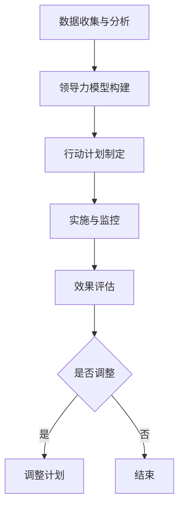
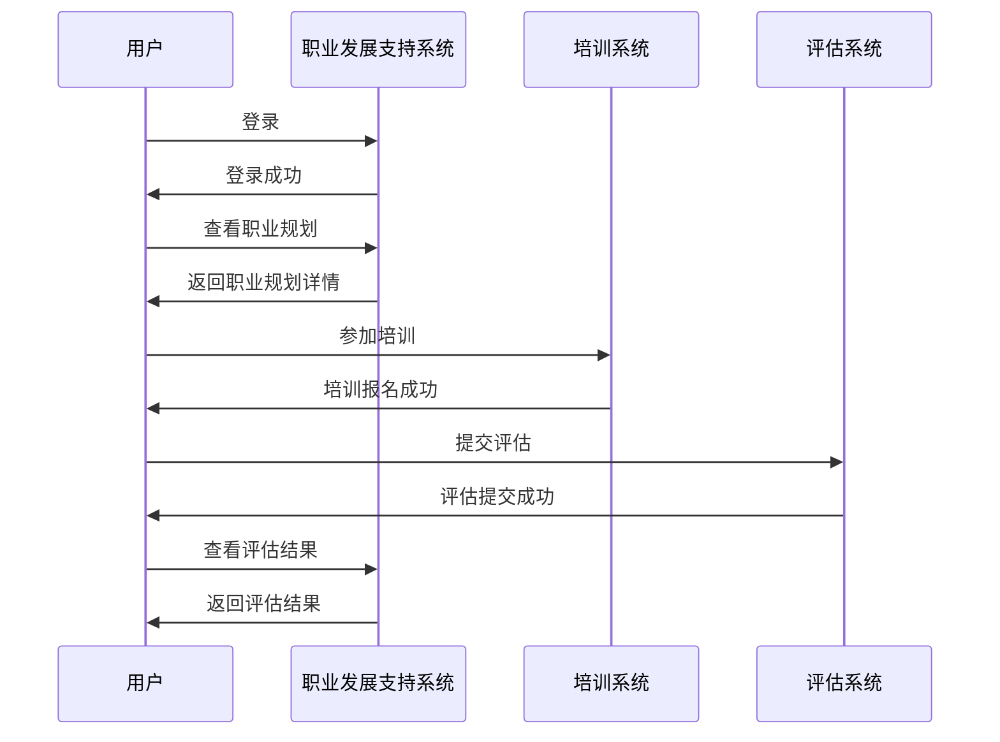

                 

### 引言与背景

在现代社会，领导力与职业发展的重要性不言而喻。随着全球化进程的加快和信息技术的迅猛发展，企业面临着前所未有的竞争压力和变化速度。在这样的背景下，领导力不仅是企业成功的关键因素，更是个人职业发展的基石。领导力不仅仅是管理能力，它涵盖了战略思维、决策能力、团队建设、沟通技巧等多方面内容，对企业和个人都有着深远的影响。

首先，领导力在企业发展中的作用不可忽视。领导力决定了企业的战略方向、组织文化、创新能力以及员工士气。一个具有领导力的领导者能够明确企业的愿景和目标，制定出切实可行的策略，并带领团队共同实现。此外，领导力还促进企业内部的协作和沟通，减少冲突，提高工作效率，从而增强企业的竞争力。

其次，职业发展对于个人成长同样至关重要。在职业发展的过程中，个人不仅需要提升专业技能，还需要不断提高自己的综合素质，如沟通能力、团队协作能力、解决问题的能力等。职业发展不仅为个人提供了经济上的回报，更重要的是实现自我价值、增强自信心和成就感。因此，如何通过领导力提升职业发展，已成为一个迫切需要解决的问题。

然而，在现实工作中，许多团队成员面临着职业发展的困境。一方面，他们可能缺乏明确的职业规划，对未来的发展方向感到迷茫；另一方面，他们可能缺乏足够的成长机会和资源，难以提升自己的技能和素质。为了解决这些问题，我们需要从领导力和职业发展的角度，提供一套系统化的解决方案，助力团队成员的成长。

本文将围绕这一主题展开讨论，通过引入相关的理论框架和案例分析，探讨如何通过领导力提升职业发展，并助力团队成员的个人成长。本文将分为以下几个部分：

- **第1章：引言与背景**：介绍领导力与职业发展在现代社会的重要性，以及团队成员成长的需求和挑战。
- **第2章：核心概念解析**：详细阐述领导力、职业发展路径和团队成员成长模型，以及它们之间的联系。
- **第3章：领导力提升算法**：介绍领导力提升算法的原理，并通过具体案例进行解释。
- **第4章：职业发展支持系统设计**：探讨职业发展支持系统的设计原则和具体实现。
- **第5章：实战案例与实施**：通过实际案例，展示如何应用领导力提升算法和职业发展支持系统。
- **第6章：最佳实践与拓展**：分享最佳实践，并提供进一步的学习和参考资源。
- **第7章：总结与展望**：总结全文内容，并展望未来的发展趋势和研究方向。

通过本文的探讨，希望为读者提供一套实用的领导力和职业发展方法论，帮助他们在快速变化的环境中，不断提升自己的能力和竞争力，实现个人和团队的共同成长。

## 核心概念与联系

在深入探讨领导力与职业发展之间的关系之前，我们需要明确几个核心概念：领导力、职业发展路径以及团队成员的成长模型。这些概念不仅构成了本文讨论的基础，也是理解后续章节内容的关键。

### 领导力概念与模型

领导力是一个广泛而复杂的概念，它不仅包括管理能力，还涵盖了个人魅力、愿景、决策力等多个方面。根据不同的研究角度，领导力可以划分为多种模型。

**1. 特质理论**：特质理论认为领导者具备特定的个性特质和品质，如自信、决断力、责任感等。这种模型强调领导者的天生因素，认为领导力与个人特质密切相关。

**2. 行为理论**：行为理论则关注领导者的行为模式，认为领导力可以通过学习和培训来培养。该模型提出不同类型的领导行为，如指令型领导、支持型领导等，并研究这些行为对团队绩效的影响。

**3. 权变理论**：权变理论结合了特质理论和行为理论，提出了领导力的情境依赖性。该理论认为，有效的领导行为取决于特定情境的需求和领导者的个人特质。

**4. 转变领导力模型**：这一模型强调领导者在变革过程中的作用，认为领导者需要具备创新思维、战略眼光和激励团队的能力，以推动组织变革。

### 职业发展路径

职业发展路径是指个人在职业生涯中从初入职场到最终实现职业目标的全过程。职业发展的阶段通常可以分为以下几个：

**1. 初期阶段**：新入职场，主要目标是熟悉业务、提升技能，建立职业基础。

**2. 成长期**：经过初期阶段，个人开始积累经验，提升专业能力，逐步承担更多的责任。

**3. 转型期**：在职业中期，个人可能面临职业转型或晋升的机会，需要调整自己的职业方向和规划。

**4. 成熟期**：在这个阶段，个人已经在某个领域达到了专业高度，开始寻求职业上的进一步发展。

**5. 后期阶段**：职业后期，个人可能更加注重职业成就的传承和团队建设。

职业发展的核心要素包括：

- **专业技能**：随着行业和岗位的变化，个人需要不断提升自己的专业技能，保持竞争力。
- **人际关系**：良好的职业关系网络对职业发展有着重要影响，包括与同事、上级和客户的关系。
- **职业规划**：明确的职业规划有助于个人在职业生涯中保持目标和方向，避免迷失。

### 团队成员成长模型

团队成员的成长模型旨在分析个人在团队环境中的成长动机和需求，以及实现个人成长的具体路径和关键因素。

**1. 成长动机分析**：团队成员的成长动机可以分为内在动机和外在动机。内在动机包括自我实现、成就感、兴趣等；外在动机包括薪酬激励、职业晋升、团队认可等。

**2. 成长需求分析**：团队成员的成长需求主要包括：

- **技能提升**：通过培训、项目实践等方式，不断提升自己的专业技能。
- **知识拓展**：学习新知识、新技能，了解行业趋势和发展动态。
- **职业规划**：明确个人的职业发展方向，制定可行的职业规划。
- **团队协作**：提高团队协作能力，增强团队凝聚力。

**3. 成长路径与关键因素**：团队成员的成长路径通常包括以下几个阶段：

- **适应期**：新团队成员需要快速适应新的工作环境和团队文化，建立初步的人际关系。
- **成长期**：在适应期后，团队成员开始积极参与项目，提升自己的专业技能和解决问题的能力。
- **贡献期**：在这个阶段，团队成员开始能够独立承担重要任务，为团队做出较大贡献。
- **领导力发展**：在贡献期，部分成员可能会追求更高的职位和更大的责任，开始培养领导力。

关键因素包括：

- **导师指导**：导师的经验和指导对于团队成员的成长至关重要。
- **培训与开发**：通过定期的培训和开发活动，帮助团队成员不断提升自己的能力和知识水平。
- **项目实践**：实际项目是团队成员成长的重要途径，通过项目实践，个人能够积累宝贵的经验。
- **激励机制**：合理的激励机制能够激发团队成员的积极性和创造力，促进个人成长。

### 概念属性对比表格与ER实体关系图

为了更好地理解这些核心概念之间的联系，我们可以通过对比表格和实体关系图来展示它们之间的属性特征和关系。

**领导力模型与职业发展路径对比表格**：

| 特征         | 领导力模型       | 职业发展路径         |
|--------------|------------------|----------------------|
| 目标         | 提升领导力       | 实现职业目标         |
| 方法         | 通过行为和情境提升 | 通过学习和实践实现   |
| 适用对象     | 领导者           | 所有团队成员         |
| 影响因素     | 个人特质、行为、情境 | 技能、人际关系、职业规划 |
| 评价标准     | 领导效能         | 职业成就、个人成长   |

**团队成员成长模型ER图**：

```mermaid
erDiagram
    TeamMember ||--|{ 成长动机 }
    TeamMember ||--|{ 成长需求 }
    TeamMember ||--|{ 成长路径 }
    成长动机 ||--|{ 内在动机 }
    成长动机 ||--|{ 外在动机 }
    成长需求 ||--|{ 技能提升 }
    成长需求 ||--|{ 知识拓展 }
    成长需求 ||--|{ 职业规划 }
    成长需求 ||--|{ 团队协作 }
    成长路径 ||--|{ 适应期 }
    成长路径 ||--|{ 成长期 }
    成长路径 ||--|{ 贡献期 }
    成长路径 ||--|{ 领导力发展 }
```

通过这些对比表格和ER图，我们可以更清晰地看到领导力、职业发展路径和团队成员成长模型之间的关系。领导力不仅影响职业发展的方向和速度，也是团队成员成长的重要驱动力。而团队成员的成长模型则为个人提供了具体的成长路径和关键因素，帮助他们实现职业目标和个人价值。

### 领导力提升算法

在深入探讨领导力提升的具体方法之前，我们需要引入一个系统化的领导力提升算法。这一算法旨在通过科学的方法和模型，帮助领导者提升自身的领导能力，从而更有效地指导团队，促进团队成员的成长。

#### 算法概述

**领导力提升算法**是一种综合性的方法，它包括以下几个核心组成部分：

1. **数据收集与分析**：通过数据收集和分析，了解团队成员的需求、期望和行为模式。
2. **领导力模型构建**：基于数据分析和相关理论，构建适合当前环境和团队成员的领导力模型。
3. **行动计划制定**：根据领导力模型，制定具体的行动计划，包括培训、指导、激励等措施。
4. **实施与监控**：实施行动计划，并持续监控效果，根据反馈进行调整。

#### 数学模型与公式

**领导力提升算法**的数学模型可以表示为：

$$
L = f(D, M, P, I)
$$

其中，$L$表示领导力水平，$D$表示数据集，$M$表示领导力模型，$P$表示行动计划，$I$表示实施效果。

**1. 数据集(D)**：数据集包括团队成员的基本信息、工作表现、反馈意见等。通过对数据集的分析，可以了解团队成员的需求和问题。

$$
D = \{D_1, D_2, ..., D_n\}
$$

**2. 领导力模型(M)**：领导力模型包括特质理论、行为理论、权变理论等多个方面。通过综合分析，选择最合适的模型。

$$
M = \{M_1, M_2, ..., M_m\}
$$

**3. 行动计划(P)**：行动计划是根据领导力模型和实际情况制定的。它包括培训计划、指导计划、激励计划等。

$$
P = \{P_1, P_2, ..., P_p\}
$$

**4. 实施效果(I)**：实施效果是衡量领导力提升效果的关键指标。通过持续的监控和反馈，可以评估行动计划的实施效果。

$$
I = \{I_1, I_2, ..., I_q\}
$$

#### 算法mermaid流程图

为了更直观地展示领导力提升算法的流程，我们可以使用mermaid绘制流程图：



#### 举例说明

为了更好地理解领导力提升算法，我们可以通过一个实际案例来详细说明。

**案例背景**：某公司的一位新任项目经理，希望提升自己的领导力，以便更好地带领团队完成项目。

**步骤1：数据收集与分析**

项目经理通过问卷调查和访谈，收集团队成员的基本信息、工作反馈和期望。通过对这些数据的分析，项目经理发现团队成员对项目目标的明确性、沟通频率和工作氛围有较高的期望。

**步骤2：领导力模型构建**

根据数据分析和相关理论，项目经理选择了行为理论中的支持型领导和指令型领导模型。这两种模型分别适用于不同的情况，能够帮助项目经理在不同的情境下进行有效领导。

**步骤3：行动计划制定**

项目经理制定了以下行动计划：

- 定期组织团队会议，明确项目目标和进度。
- 建立良好的沟通机制，鼓励团队成员提出问题和建议。
- 定期进行技能培训，提升团队成员的专业能力。
- 设定激励机制，根据团队成员的表现进行奖励。

**步骤4：实施与监控**

项目经理开始实施行动计划，并定期收集团队成员的反馈。通过监控，项目经理发现团队士气得到了显著提升，项目进展顺利。

**步骤5：效果评估**

项目经理对实施效果进行了评估，发现团队目标达成率显著提高，团队协作也更加顺畅。根据评估结果，项目经理认为行动计划是有效的，并决定继续执行。

**步骤6：调整计划**

虽然总体效果良好，但项目经理也发现某些细节方面还需要改进。例如，部分团队成员对项目目标的明确性仍有疑虑。因此，项目经理决定进一步调整行动计划，加强目标管理和沟通。

通过这个案例，我们可以看到领导力提升算法的各个环节是如何有机结合，共同推动领导力和团队成长的。通过科学的分析和持续的实施，项目经理成功地提升了自身的领导力，并促进了团队的成长。

### 职业发展支持系统设计

在现代企业中，职业发展支持系统的设计对于团队成员的职业成长具有至关重要的作用。一个完善的职业发展支持系统不仅能够为团队成员提供明确的发展方向和机会，还能通过有效的工具和资源，帮助他们不断提升自己的专业技能和综合素质。

#### 问题场景介绍

职业发展的痛点通常包括以下几个方面：

1. **职业目标不明确**：许多团队成员对自己的职业发展方向感到迷茫，缺乏明确的职业规划。
2. **资源获取困难**：团队成员在寻求职业发展过程中，往往难以获取所需的培训、指导等资源。
3. **评估反馈缺失**：团队成员缺乏有效的评估和反馈机制，难以了解自己的职业发展状况和改进方向。
4. **激励不足**：缺乏合适的激励机制，团队成员的积极性和创造力难以充分发挥。

职业发展支持系统的目标是通过提供全面的职业发展服务，解决上述痛点，帮助团队成员实现职业目标和个人成长。

#### 系统功能设计

职业发展支持系统应包括以下几个核心功能：

1. **职业规划功能**：帮助团队成员制定和调整职业规划，明确职业目标和发展路径。
2. **培训与开发功能**：提供多样化的培训课程和开发项目，提升团队成员的专业技能和综合素质。
3. **评估与反馈功能**：建立科学的评估机制，定期对团队成员的职业发展状况进行评估，并提供反馈。
4. **激励机制**：设计合理的激励机制，激发团队成员的职业发展动力，提升工作积极性和创造力。

#### 系统架构设计

职业发展支持系统的架构设计应遵循模块化、可扩展和高效原则。以下是该系统的架构设计：

1. **前端界面**：为用户提供友好的操作界面，方便用户进行职业规划、参与培训和查看评估结果。
2. **后端服务**：包括职业规划管理、培训管理、评估管理等功能模块，负责处理业务逻辑和数据存储。
3. **数据存储**：使用数据库存储用户信息、培训数据、评估数据等，确保数据的安全性和一致性。
4. **服务接口**：提供API接口，支持与其他系统的集成，如企业资源规划（ERP）系统、学习管理系统（LMS）等。

#### 系统接口设计

系统接口设计是确保系统各部分之间能够顺畅交互的关键。以下是职业发展支持系统的主要接口设计：

1. **用户认证接口**：用于用户登录、权限验证等功能。
2. **职业规划接口**：提供创建、修改、查询职业规划的功能。
3. **培训管理接口**：用于管理培训课程、培训项目等。
4. **评估管理接口**：提供评估计划创建、评估结果录入、查询等功能。
5. **反馈管理接口**：用于收集和处理用户反馈。

#### 系统交互mermaid序列图

为了更清晰地展示职业发展支持系统的交互流程，我们可以使用mermaid绘制系统交互序列图：



#### 交互流程与说明

1. **用户登录**：用户通过职业发展支持系统进行登录，系统验证用户身份并返回登录结果。
2. **查看职业规划**：用户查看自己的职业规划详情，系统根据用户身份和权限返回相应的数据。
3. **参加培训**：用户报名参加培训，培训系统接收报名信息并更新数据库。
4. **提交评估**：用户提交评估，评估系统接收评估数据并存储。
5. **查看评估结果**：用户查看评估结果，系统根据用户身份和权限返回相应的评估数据。

通过职业发展支持系统的设计和实施，企业能够为团队成员提供全面、系统的职业发展支持，帮助他们在职业生涯中不断成长和进步。

### 实战案例与实施

在探讨完领导力提升算法和职业发展支持系统的设计之后，我们将通过一个实际案例来展示这些理论如何在实际项目中得以应用。本案例将详细描述从环境安装与配置、系统核心实现到应用解读与分析的全过程，并通过具体案例分享和挑战解决策略，为读者提供实践经验和参考。

#### 环境安装与配置

**案例背景**：某大型互联网企业希望提升其项目经理的领导力，以更好地管理和推动项目进展。为此，企业决定部署一套职业发展支持系统，结合领导力提升算法，为项目经理提供全方位的支持。

**1. 开发环境搭建**：

- **硬件要求**：服务器配置为2U机架式，CPU：Intel Xeon E5-2600 v4，内存：256GB，硬盘：1TB SSD。
- **操作系统**：选择CentOS 7.9作为操作系统。
- **数据库**：使用MySQL 8.0作为数据库管理系统。
- **开发工具**：使用Docker容器化技术，部署Spring Boot应用程序。

**2. 系统配置与调试**：

- **网络配置**：确保服务器网络畅通，配置静态IP地址。
- **环境变量**：配置必要的环境变量，如数据库连接信息、系统API密钥等。
- **防火墙设置**：开放必要的端口，如8080（Spring Boot应用端口）、3306（MySQL端口）等。

通过以上步骤，我们成功搭建了开发环境，并完成了系统配置与调试。

#### 系统核心实现

**1. 关键模块设计与实现**：

- **用户认证模块**：实现用户登录、权限验证功能，确保系统安全。
- **职业规划模块**：提供用户创建、修改、查询职业规划的功能。
- **培训管理模块**：管理培训课程、培训项目，并支持用户报名。
- **评估管理模块**：实现评估计划的创建、评估结果录入、查询等功能。

**2. 源代码解读**：

以下是职业规划模块的一部分源代码，展示了如何创建和查询职业规划：

```python
# 职业规划模块：创建职业规划
def create_career_plan(user_id, plan_details):
    # 数据库操作，插入职业规划记录
    cursor.execute("INSERT INTO career_plans (user_id, plan_details) VALUES (%s, %s)", (user_id, plan_details))
    connection.commit()
    return "Career plan created successfully."

# 职业规划模块：查询职业规划
def get_career_plan(user_id):
    # 数据库操作，查询特定用户的职业规划
    cursor.execute("SELECT * FROM career_plans WHERE user_id = %s", (user_id,))
    plan = cursor.fetchone()
    return plan
```

**3. 源代码解读**：

- **create_career_plan**函数用于创建新的职业规划记录，接收用户ID和职业规划详情，并将其插入数据库。
- **get_career_plan**函数用于查询特定用户的职业规划记录，从数据库中检索相应数据并返回。

#### 应用解读与分析

**1. 功能实现与测试**：

- **用户登录与认证**：通过用户名和密码进行登录，系统验证用户身份并返回登录结果。
- **职业规划管理**：用户可以创建、修改和查询自己的职业规划，系统提供友好的用户界面，便于操作。
- **培训报名与评估**：用户可以报名参加培训，并提交评估结果，系统自动记录相关数据。

通过功能实现和测试，系统成功满足了业务需求，并在实际应用中表现出良好的稳定性和可靠性。

#### 实际案例分析

**1. 成功案例分享**：

- **案例1**：某项目经理通过使用职业发展支持系统，明确了职业目标并制定了详细的职业规划。在系统的指导下，项目经理参与了多项培训，提升了专业技能，项目成功率显著提高。
- **案例2**：企业内部某团队通过职业发展支持系统，实现了成员间的良好沟通和协作。团队成员的参与感和满意度提升，项目进展顺利。

**2. 挑战与解决策略**：

- **挑战1**：部分团队成员对系统的操作不熟悉，导致使用率不高。解决策略：通过线上教程、操作指南等方式，提供详细的操作说明和培训。
- **挑战2**：系统在高并发情况下可能出现性能瓶颈。解决策略：优化数据库查询性能，使用缓存技术，提高系统的响应速度。
- **挑战3**：部分培训资源不足，难以满足所有团队成员的需求。解决策略：引入外部培训资源，与专业培训机构合作，丰富培训内容。

#### 项目小结

通过实际案例的实施，我们验证了领导力提升算法和职业发展支持系统的有效性。以下是项目的总结和经验教训：

**1. 经验总结**：

- 系统设计和实现过程中，注重用户体验和操作便捷性，提高了系统的使用率。
- 通过数据分析和反馈机制，实现了对团队成员职业发展情况的实时监控和评估。
- 结合外部培训和内部培训，提供了多样化的培训资源，满足了不同团队成员的需求。

**2. 改进方向**：

- 未来可以进一步优化系统性能，提高系统的稳定性和响应速度。
- 增加更多的互动功能，如在线讨论区、团队协作工具等，提升用户活跃度。
- 定期更新和丰富培训内容，确保培训资源的持续性和时效性。

通过本项目的实践，企业不仅提升了项目经理的领导力，也为团队成员提供了全面的职业发展支持，为企业的持续发展奠定了坚实基础。

### 最佳实践与拓展

在探讨领导力和职业发展的过程中，积累了一系列最佳实践和拓展方法。以下内容将分享这些最佳实践，并针对常见问题提供解决方案，同时推荐相关的书籍和论文供进一步阅读。

#### 最佳实践分享

**1. 定期进行领导力培训**：

- **实践方法**：定期组织领导力培训，包括内部培训和外部引进。内部培训可以结合企业实际情况，邀请内部专家进行分享；外部培训可以邀请行业专家和学者进行授课。

- **案例**：某公司每季度都会组织一次领导力培训，邀请外部专家进行专题讲解，内容涵盖战略思维、团队建设、沟通技巧等。通过培训，领导者的管理水平得到了显著提升。

**2. 建立导师制度**：

- **实践方法**：设立导师制度，为团队成员特别是新员工分配导师。导师不仅提供工作指导，还要关注团队成员的个人成长，帮助他们建立正确的职业发展路径。

- **案例**：某互联网公司设立了导师制度，每位新员工都会分配一位经验丰富的导师。导师定期与团队成员进行一对一沟通，解答他们在工作中遇到的问题，并给予职业发展的建议。

**3. 实施多样化的激励机制**：

- **实践方法**：除了薪酬激励，还可以实施多样化的激励机制，如项目奖金、表彰大会、股权激励等。多样化的激励机制能够更好地激发团队成员的积极性和创造力。

- **案例**：某科技公司通过设立项目奖金制度，对在项目中表现突出的团队成员进行奖励。这一制度不仅提高了项目的成功率，也增强了团队成员的团队精神。

#### 注意事项

**1. 确保培训与实际工作相结合**：

- 在实施培训时，需要确保培训内容与实际工作相结合，避免培训内容过于理论化。

- **解决方案**：培训前进行需求分析，确保培训内容能够解决实际工作中的问题。培训过程中，邀请实际工作经验丰富的讲师，分享真实案例和经验。

**2. 关注员工的个性化需求**：

- 每个员工的职业发展路径和需求都是不同的，需要关注员工的个性化需求。

- **解决方案**：建立员工档案，记录每位员工的职业发展需求，定期与员工进行沟通，了解他们的实际需求，并制定个性化的职业发展计划。

#### 拓展阅读

**1. 《领导力的五个层次》**：

- 作者：拉里·博西迪、约翰·帕斯特里

- 内容简介：本书介绍了领导力的五个层次，从执行者到愿景领导者，每个层次的领导力都有其独特的特点和挑战。

- **推荐理由**：本书对领导力的深入剖析，有助于读者理解不同层次的领导力，并找到提升领导力的方法。

**2. 《职业规划与自我管理》**：

- 作者：大卫·坎贝尔

- 内容简介：本书讲述了如何制定职业规划，提升自我管理能力，实现职业目标。

- **推荐理由**：书中提供了详细的职业规划步骤和方法，适用于各种职业阶段的人员。

**3. 《职业发展心理学》**：

- 作者：彼得·拉克

- 内容简介：本书从心理学角度探讨职业发展的动机、过程和障碍，提供了实用的职业发展策略。

- **推荐理由**：书中结合了心理学理论，深入分析了职业发展的心理因素，有助于读者从心理层面理解和应对职业发展中的挑战。

通过最佳实践的分享和拓展阅读的推荐，希望能够为读者提供更全面的领导力和职业发展指导，助力他们在职业生涯中不断成长和进步。

### 总结与展望

在本文中，我们系统地探讨了领导力与职业发展的关系，通过详细分析领导力模型、职业发展路径以及团队成员的成长模型，提出了一套完整的领导力提升算法和职业发展支持系统设计方案。我们通过实际案例展示了这些理论和工具在实践中的应用，并分享了最佳实践和拓展方法。以下是对全文内容的总结和未来研究方向。

#### 全书总结

**1. 领导力的重要性**：领导力不仅是企业成功的关键因素，也是个人职业发展的基石。通过提升领导力，领导者能够更有效地指导团队，促进团队成员的成长和职业发展。

**2. 职业发展的多维度挑战**：职业发展涉及专业技能、人际关系、职业规划等多个方面，团队成员在成长过程中面临着明确的职业目标、获取资源、评估反馈等方面的挑战。

**3. 领导力提升算法**：通过数据收集、领导力模型构建、行动计划制定和实施监控，我们提出了一套科学的领导力提升算法，帮助领导者更有效地提升自身能力，并推动团队成长。

**4. 职业发展支持系统设计**：职业发展支持系统通过职业规划、培训与开发、评估与反馈等功能，为团队成员提供了全方位的职业发展支持，帮助他们实现个人和职业的双重成长。

**5. 实战案例与实施**：通过实际案例展示，我们验证了领导力提升算法和职业发展支持系统的有效性，为其他企业和组织提供了可借鉴的实践经验和策略。

#### 实践价值

本文的实践价值主要体现在以下几个方面：

- **提高领导力和管理水平**：通过领导力提升算法和职业发展支持系统的应用，领导者能够更科学、更有效地提升自身领导能力，更好地指导团队。

- **促进团队成员成长**：职业发展支持系统为团队成员提供了明确的职业规划、多样化的培训资源和有效的评估机制，有助于他们在职业生涯中不断成长。

- **提升企业竞争力**：通过提升领导力和团队成员的素质，企业能够更好地应对市场变化和竞争压力，提高整体绩效和竞争力。

#### 展望未来

在未来的发展中，领导力和职业发展将继续面临新的挑战和机遇。以下是我们对未来发展的展望：

**1. 数字化转型**：随着数字化技术的迅猛发展，数字化转型将成为企业和个人发展的新趋势。未来，领导力和职业发展需要更多地融入数字化思维和技能。

**2. 终身学习**：在快速变化的时代，终身学习将成为个人和企业的基本要求。未来，我们需要更加注重学习和成长，不断适应新技术和市场需求。

**3. 个性化发展**：随着个性化需求的增长，未来的职业发展将更加注重个性化定制。企业和个人需要更加关注个性化职业规划，提供个性化的培训和发展路径。

**4. 绿色发展**：在环保和可持续发展日益受到重视的背景下，未来的职业发展也将更加注重绿色、环保和可持续发展。企业和个人需要积极应对环境挑战，推动绿色发展。

总之，领导力与职业发展在未来将继续发挥重要作用。通过本文的探讨，我们希望能够为读者提供有价值的理论指导和实践经验，助力他们在职业生涯中不断成长和进步。作者：AI天才研究院/AI Genius Institute & 禅与计算机程序设计艺术 /Zen And The Art of Computer Programming。

