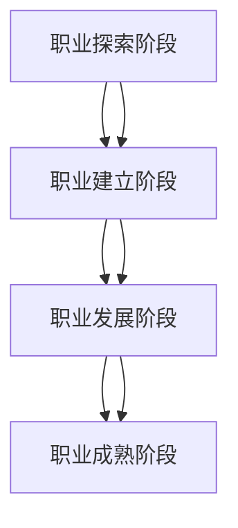
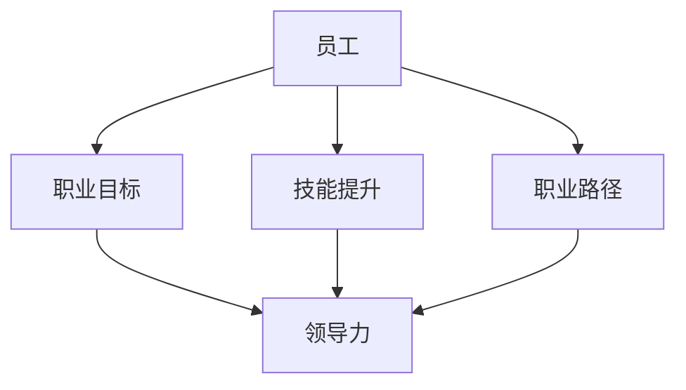
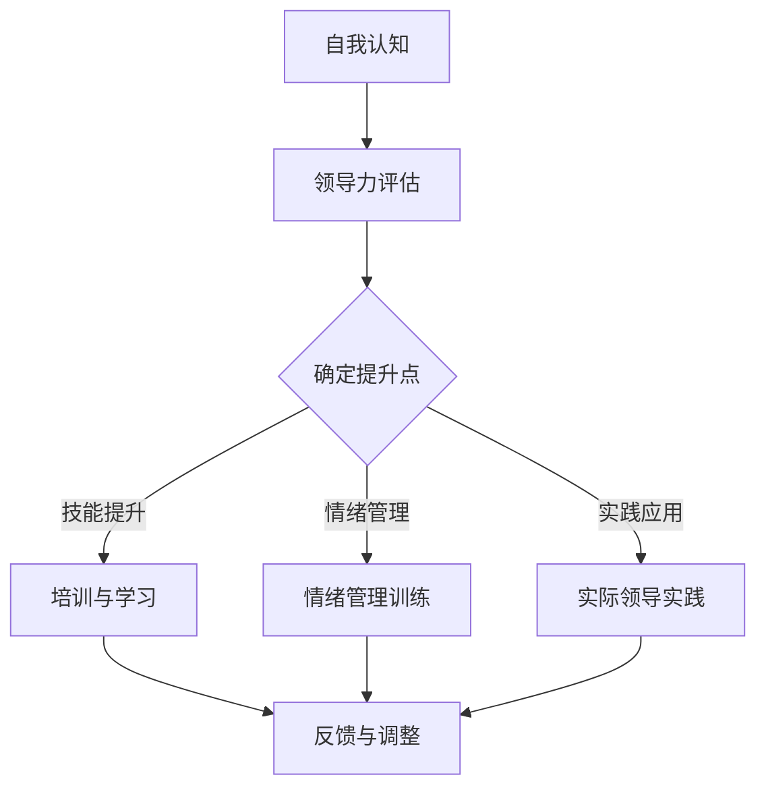
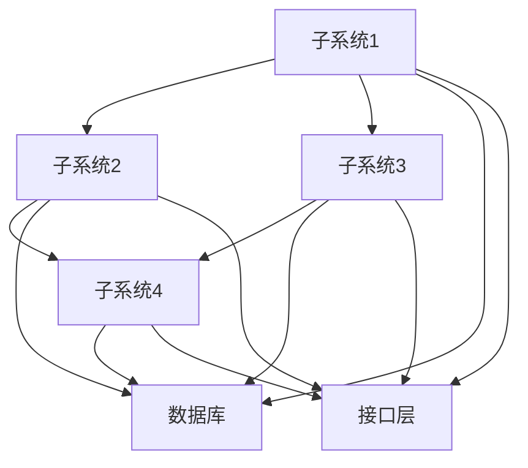

                 

**文章标题：领导力与职业发展：帮助团队成员成长**

**关键词：领导力、职业发展、团队成长、策略、模型**

**摘要：本文将从领导力与职业发展的关系出发，探讨如何通过提升领导力来帮助团队成员实现职业成长，并提供实际案例和实践技巧，以期为IT行业领导者和管理者提供有益的参考。**

----------------------------------------------------------------

# 引言

在当今快速变化和竞争激烈的IT行业，领导力与职业发展已经成为许多企业和团队关注的焦点。领导力不仅关乎企业的战略决策和长期发展，还直接影响团队成员的工作积极性和个人成长。职业发展则涉及到员工的职业规划、技能提升和职业晋升等方面，是员工在职业生涯中不断追求的目标。

本文旨在探讨领导力与职业发展的关系，并详细解析如何通过提升领导力来帮助团队成员实现职业成长。文章将分为以下几个部分：

1. **背景介绍**：阐述领导力和职业发展的现状、重要性以及团队成员面临的成长挑战。
2. **核心概念与联系**：介绍领导力和职业发展的核心概念，并分析它们之间的相互关系。
3. **领导力提升策略与实践**：提供具体的领导力提升方法，包括自我认知、情绪管理和领导力训练等。
4. **职业发展策略与实践**：介绍职业发展的策略和方法，包括职业规划、跨部门协作和沟通技巧等。
5. **系统分析与架构设计**：分析团队成长系统的设计原则和实现方法。
6. **项目实战**：通过实际案例展示如何应用领导力和职业发展策略。
7. **最佳实践与拓展阅读**：总结最佳实践技巧，并提供相关的拓展阅读资源。

通过本文的阅读，读者将能够深入理解领导力与职业发展的关系，并学会如何有效地帮助团队成员实现职业成长。

----------------------------------------------------------------

## 第一部分：领导力与职业发展的基础

### 第1章：问题的背景与定义

在探讨领导力与职业发展的关系之前，我们首先需要了解当前领导力和职业发展的现状，以及团队成员所面临的成长挑战。

#### 领导力的现状

在现代社会，领导力已经成为企业和团队成功的关键因素。然而，根据全球领导力研究机构的调查，许多企业仍然面临着领导力不足的问题。这些问题主要体现在以下几个方面：

- **领导力素质欠缺**：许多企业领导者缺乏有效的沟通、决策和团队管理等关键领导力素质。
- **领导力培养不足**：企业对领导力培养的投入不足，导致领导者缺乏系统的培训和发展机会。
- **领导力发展与市场需求不匹配**：企业对领导力发展的需求和市场需求存在差距，导致领导力培养效果不佳。

#### 职业发展的现状

职业发展是员工职业生涯中的关键环节，但现状并不乐观。根据国际劳工组织的数据，全球范围内约有30%的员工感到自己的职业发展停滞不前。这一现状主要表现在以下几个方面：

- **职业晋升机会有限**：许多企业晋升机制不透明，导致员工难以获得职业晋升机会。
- **技能提升不足**：企业对员工技能提升的投入不足，导致员工难以适应快速变化的行业需求。
- **职业发展路径不明确**：许多员工缺乏明确的职业规划，导致他们在职业发展上缺乏方向和动力。

#### 团队成员面临的成长挑战

对于团队成员来说，成长挑战主要来自于以下几个方面：

- **缺乏领导力支持**：团队成员缺乏有效的领导力指导，导致他们在职业发展中缺乏方向和动力。
- **技能提升困难**：团队成员在快速变化的行业中，难以获取新的技能和知识。
- **职业发展路径不明**：团队成员对职业发展路径缺乏清晰的认识，导致他们在职业规划上感到迷茫。

#### 问题解决

要解决上述问题，关键在于提升领导力，从而帮助团队成员实现职业成长。具体措施包括：

- **加强领导力培养**：企业应加大对领导力培养的投入，通过系统培训和发展机会提升领导者的素质。
- **建立职业发展机制**：企业应建立透明、公正的职业晋升机制，为员工提供公平的职业发展机会。
- **提供技能提升支持**：企业应加强对员工技能提升的投入，提供培训和资源，帮助员工适应行业变化。
- **明确职业发展路径**：企业应帮助员工制定明确的职业规划，提供指导和支持，帮助他们实现职业目标。

#### 边界与外延

在探讨领导力与职业发展的关系时，我们还需要考虑一些边界和外延问题。例如：

- **领导力与个人素质的关系**：领导力不仅取决于个人的素质，还受到外部环境和企业文化的影响。
- **职业发展与企业战略的关系**：职业发展不仅影响员工个人，还与企业战略和长期发展密切相关。
- **团队成员的角色与责任**：团队成员在职业发展中不仅需要领导者的支持，还需要自我驱动和积极参与。

通过上述讨论，我们可以看到，领导力与职业发展密切相关，解决团队成员的成长问题需要从领导力和职业发展的多方面入手。在下一部分中，我们将深入探讨领导力和职业发展的核心概念及其相互关系。

----------------------------------------------------------------

### 第2章：领导力的核心概念与属性

领导力是一个广泛而复杂的概念，它涉及到领导者与团队成员之间的互动，以及领导者如何影响和引导团队达成目标。为了更好地理解领导力，我们需要首先明确其核心概念和属性。

#### 领导力的定义

领导力是一种影响力，它使人们能够共同合作并实现共同的目标。根据不同的定义，领导力可以被描述为一系列的能力、技能和行为，包括但不限于：

- **影响力**：领导者通过自身的言行影响他人，引导他们朝着共同目标努力。
- **激励**：领导者能够激发团队成员的内在动机，提高他们的工作热情和积极性。
- **决策**：领导者具备做出明智决策的能力，能够有效应对复杂问题和挑战。
- **沟通**：领导者善于沟通，能够清晰表达自己的想法，同时倾听和理解团队成员的意见和需求。

#### 领导力的属性特征

领导力的属性特征包括以下几个方面：

- **情境性**：领导力不是一成不变的，它会根据不同的情境和团队需求而发生变化。
- **多样性**：领导力存在于不同类型的领导者中，不同的领导风格和策略可以适用于不同的情境和团队。
- **动态性**：领导力是一个动态过程，它随着团队和组织的演变而不断发展和调整。
- **可发展性**：领导力可以通过培训和实践得到提升，领导者可以通过不断学习和反思来提高自身的领导能力。

#### 领导力模型比较

在领导力研究中，有许多不同的模型和理论，其中一些最为著名的包括：

- **情境领导模型**：由赫塞和布兰查德提出，强调领导者应根据团队成员的成熟度来调整领导风格。
- **变革型领导模型**：由伯恩斯提出，强调领导者通过激励和启发团队成员来实现变革和成长。
- **交易型领导模型**：由费德勒提出，强调领导者通过交换利益来激励团队成员。

每种领导力模型都有其独特的优势和适用场景，领导者应根据具体情况选择合适的领导风格。

#### 领导力的应用场景

领导力在各种应用场景中发挥着关键作用，包括：

- **团队建设**：领导者通过有效的沟通和激励，帮助团队成员建立信任和协作关系。
- **项目管理和决策**：领导者负责制定战略和决策，确保项目按计划进行。
- **危机管理**：领导者能够在危机中保持冷静，制定应对策略，带领团队度过困难时期。
- **创新和变革**：领导者通过激发团队成员的创造力，推动组织实现创新和变革。

通过理解领导力的核心概念和属性，我们可以更好地认识到其在团队管理和职业发展中的重要性。在下一部分，我们将进一步探讨职业发展的概念和关键要素。

----------------------------------------------------------------

### 第3章：职业发展的理论框架

职业发展是员工职业生涯中的关键环节，涉及到员工的职业规划、技能提升和职业晋升等方面。为了更好地理解职业发展，我们需要构建一个理论框架，包括职业发展的阶段、关键要素和策略。

#### 职业发展的阶段

职业发展可以划分为不同的阶段，每个阶段都有其特定的任务和挑战。以下是职业发展的主要阶段：

1. **职业探索阶段**：这一阶段主要发生在早期职业生涯，员工在尝试不同的工作领域，寻找适合自己的职业方向。
2. **职业建立阶段**：员工在这一阶段开始专注于自己的职业领域，建立专业知识和技能基础。
3. **职业发展阶段**：员工在这一阶段追求更高的职位和更大的责任，不断提升自己的能力和业绩。
4. **职业成熟阶段**：员工在这一阶段已经积累了丰富的经验和技能，成为行业内的专家或领导者。

#### 职业发展的关键要素

职业发展需要关注以下几个关键要素：

1. **自我认知**：员工需要了解自己的兴趣、价值观和优势，以便选择适合自己的职业路径。
2. **技能提升**：员工需要不断学习新的知识和技能，以适应快速变化的行业需求。
3. **职业规划**：员工需要制定明确的职业目标，并制定实现目标的计划。
4. **网络建设**：员工需要建立和维护广泛的人脉网络，以获取职业发展的机会和信息。
5. **持续反馈**：员工需要不断寻求反馈，以了解自己的表现和进步，并据此进行调整和改进。

#### 职业发展的策略

为了实现职业发展，员工可以采取以下策略：

1. **职业规划**：员工应制定长期的职业规划，包括目标设定、路径选择和行动计划。
2. **技能提升**：员工应积极参与培训和学习，提高自己的专业技能和知识水平。
3. **网络建设**：员工应主动参加行业活动，建立和维护人脉网络，扩大职业机会。
4. **主动沟通**：员工应与上级和同事保持良好的沟通，了解组织的需求和期望，并主动提出自己的职业规划。
5. **灵活适应**：员工应具备灵活适应变化的能力，能够快速应对行业变化和职业挑战。

#### 职业发展的模型

职业发展的理论框架可以采用多种模型来表示，例如：

- **职业生命周期模型**：该模型将职业发展视为一个周期性过程，包括进入、成长、巅峰和退出等阶段。
- **职业发展曲线模型**：该模型将职业发展视为一条曲线，随着经验的积累，员工的职业成就逐步提高。
- **职业轮盘模型**：该模型将职业发展视为一个轮盘，员工可以根据自己的兴趣和优势选择不同的职业路径。

通过构建职业发展的理论框架，我们可以更好地理解职业发展的过程和关键要素，为员工的职业发展提供指导和支持。在下一部分，我们将探讨如何通过提升领导力来帮助团队成员实现职业成长。

----------------------------------------------------------------

## 第二部分：领导力提升策略与实践

### 第4章：领导力提升的方法论

提升领导力是一个复杂而持续的过程，需要领导者从多个方面进行自我提升和培训。以下是一些关键步骤和策略：

#### 自我认知

自我认知是提升领导力的第一步。领导者需要深入了解自己的性格、价值观、优点和缺点，以便更好地理解自己的领导风格和影响方式。以下是一些自我认知的方法：

- **反思**：定期花时间反思自己的行为和决策，思考哪些是有效的，哪些是无效的。
- **心理测试**：通过心理测试，如迈尔斯-布里格斯性格类型指标（MBTI），了解自己的性格特点。
- **360度反馈**：邀请同事、下属和上级对自己的领导力进行评价，获取全面的反馈。

#### 情绪管理

情绪管理是领导力的核心要素之一。领导者需要学会控制自己的情绪，保持冷静和理智，以便在压力和挑战面前做出明智的决策。以下是一些情绪管理的方法：

- **自我意识**：了解自己的情绪反应，识别情绪触发点。
- **压力释放**：通过运动、冥想或放松技巧来缓解压力。
- **积极沟通**：学会倾听和理解团队成员的情绪，并给予适当的反馈和支持。

#### 领导力训练

领导力训练是提升领导力的有效方法。领导者可以通过以下途径进行领导力训练：

- **培训课程**：参加领导力培训课程，学习最新的领导力理论和实践。
- **导师指导**：寻找一位有经验的导师，从他们身上学习领导力技巧和经验。
- **模拟训练**：通过角色扮演和模拟训练，提高实际领导能力。

#### 领导力实践

实践是提升领导力的关键。以下是一些领导力实践的方法：

- **主动参与**：主动参与团队项目和决策过程，提升自己的领导力。
- **反馈与接受反馈**：勇于接受团队成员的反馈，并从中学习和改进。
- **持续学习**：保持对行业和领导力动态的关注，不断学习和更新自己的知识和技能。

#### 领导力发展模型

为了更好地理解领导力发展的过程，可以使用一些领导力发展模型，如：

- **凯茨模型**：该模型将领导力发展分为认知阶段、情感阶段和行动阶段。
- **伯恩斯模型**：该模型强调领导力发展的四个层次：自我管理、团队协作、战略思考和愿景建立。

通过上述方法，领导者可以逐步提升自己的领导力，为团队成员提供有效的指导和支持，帮助他们实现职业成长。

----------------------------------------------------------------

### 第5章：职业发展策略与实践

职业发展是一个持续的过程，需要员工结合个人目标和企业需求，制定明确的职业规划，并通过持续的学习和实践来实现职业成长。以下是职业发展的几个关键策略和实践步骤：

#### 职业规划与目标设定

职业规划是职业发展的第一步，它为员工提供了明确的职业目标和路径。以下是一些职业规划的关键步骤：

1. **自我评估**：评估自己的兴趣、价值观、技能和职业目标，了解自己的优势和劣势。
2. **市场调研**：了解所在行业的趋势和需求，确定适合自己的职业发展方向。
3. **目标设定**：设定短期和长期职业目标，确保目标具有明确性、可行性和挑战性。
4. **行动计划**：制定实现目标的详细行动计划，包括所需的培训、经验和资源。

#### 跨部门协作与沟通技巧

在职业发展中，跨部门协作和沟通技巧至关重要。以下是一些提升这些技能的方法：

1. **主动沟通**：主动与同事、上级和下属沟通，确保信息的畅通和理解的准确性。
2. **倾听技巧**：积极倾听他人的意见和需求，理解他们的立场和观点。
3. **跨部门合作**：主动参与跨部门项目，与不同部门的团队成员合作，提升协作能力。
4. **冲突解决**：学会在冲突中保持冷静，通过有效沟通和协商找到解决问题的方法。

#### 技能提升

为了在职业发展中保持竞争力，员工需要不断学习和提升自己的技能。以下是一些技能提升的方法：

1. **培训和学习**：参加内部和外部培训课程，学习最新的行业知识和技能。
2. **实践和应用**：通过实际项目和工作任务，将学到的知识应用到实践中。
3. **网络建设**：加入专业协会和社群，与同行业的人建立联系，获取行业信息和职业机会。
4. **自我学习**：利用网络资源、图书和课程，自学新技能和知识。

#### 职业成长路径设计与实现

职业成长路径设计是帮助员工实现职业目标的关键步骤。以下是一些设计职业成长路径的要点：

1. **明确目标**：确保职业成长路径与员工的长期职业目标一致。
2. **步骤规划**：将职业成长路径分解为具体的步骤和里程碑，确保每一步都有明确的行动目标。
3. **资源支持**：确保员工在实现职业成长过程中获得必要的资源和支持，包括培训、指导和资源。
4. **定期评估**：定期评估职业成长路径的实现情况，根据实际情况进行调整和优化。

通过制定明确的职业规划、提升跨部门协作和沟通技巧、持续技能提升以及设计合理的职业成长路径，员工可以更好地实现职业成长，为个人的职业生涯发展奠定坚实的基础。

----------------------------------------------------------------

## 第三部分：系统分析与架构设计

### 第6章：团队成长系统设计

团队成长系统设计旨在创建一个可持续的框架，以支持团队成员的职业发展和领导力提升。以下是团队成长系统的设计原则和实现方法：

#### 系统设计原则

1. **个性化发展**：系统应能够根据团队成员的个性、兴趣和职业目标提供个性化的成长路径。
2. **持续反馈**：系统应集成反馈机制，定期收集团队成员的成长情况和反馈，以便进行针对性的指导。
3. **灵活性**：系统设计应具有灵活性，能够适应不同的工作环境和团队需求。
4. **资源整合**：系统应整合内外部资源，包括培训、导师指导和职业网络等，以支持团队成员的成长。

#### 系统功能设计

团队成长系统的核心功能包括：

1. **职业规划工具**：提供职业规划工具，帮助团队成员设定职业目标，制定实现目标的计划。
2. **技能提升模块**：集成在线课程、自学资源和实践项目，支持团队成员提升技能和知识。
3. **反馈与评估**：提供反馈与评估功能，定期收集团队成员的反馈和评估结果，以便进行改进。
4. **导师匹配**：通过算法和人工匹配，为团队成员提供导师，以获得个性化的指导和反馈。
5. **职业网络建设**：提供职业网络平台，帮助团队成员建立和维护职业关系。

#### 系统架构设计

团队成长系统的架构设计应确保系统的稳定性和可扩展性。以下是系统架构的关键部分：

1. **前端界面**：提供用户友好的前端界面，方便团队成员使用系统功能。
2. **后端服务**：构建后端服务，处理用户数据、提供计算支持和接口调用。
3. **数据库**：设计合理的数据库架构，存储用户数据、课程内容、反馈记录等。
4. **数据安全**：确保数据安全，采取加密和安全协议，防止数据泄露。
5. **云计算**：利用云计算技术，提供可扩展的计算资源和存储服务。

#### 系统接口设计

系统接口设计是确保系统各部分之间有效通信的关键。以下是系统接口设计的关键点：

1. **API接口**：设计统一的API接口，方便前端和后端之间的数据交换。
2. **接口文档**：提供详细的接口文档，包括接口定义、参数说明和使用示例。
3. **身份验证与授权**：确保接口安全，采用身份验证和授权机制，防止未授权访问。
4. **性能优化**：优化接口性能，确保系统在高并发情况下稳定运行。

#### 系统交互

系统交互设计应确保用户与系统的顺畅互动。以下是系统交互设计的关键点：

1. **用户流程**：设计直观的用户流程，确保团队成员能够轻松完成各项操作。
2. **反馈机制**：集成实时反馈机制，使用户能够及时获得系统操作的结果。
3. **错误处理**：设计有效的错误处理机制，确保在系统出现问题时能够及时告知用户。
4. **用户体验**：优化用户体验，确保系统的易用性和用户满意度。

通过上述设计原则和架构方案，团队成长系统将为团队成员提供全面的成长支持，帮助他们在职业和领导力方面取得显著进步。

----------------------------------------------------------------

### 第7章：团队成长过程分析

在团队成长系统的支持下，团队成员的职业发展和领导力提升是一个持续和动态的过程。为了更好地理解和优化这一过程，我们需要对团队成长的关键因素进行分析。

#### 团队成员成长过程模型

团队成员的成长过程可以分为以下几个阶段：

1. **探索阶段**：团队成员在初期探索自己的兴趣和职业方向，尝试不同的工作内容和角色。
2. **建立阶段**：团队成员在探索过程中，找到自己的职业兴趣和优势，开始专注于特定的职业领域。
3. **发展阶段**：团队成员通过不断学习和实践，提升自己的专业技能和知识水平，追求更高的职位和更大的责任。
4. **成熟阶段**：团队成员在职业领域内积累了丰富的经验和技能，成为行业内的专家或领导者。

#### 成长过程的关键因素分析

为了确保团队成员能够顺利成长，需要关注以下几个关键因素：

1. **个人动机**：个人动机是团队成员成长的重要驱动力。领导者需要了解团队成员的动机，并提供适当的支持和激励。
2. **技能提升**：技能提升是团队成员成长的核心。企业应提供培训和学习机会，帮助团队成员掌握新技能和知识。
3. **导师指导**：导师在团队成员的成长过程中起着重要作用。导师不仅提供职业指导，还可以分享经验和资源，帮助团队成员克服成长中的困难。
4. **反馈与评估**：定期反馈和评估是团队成员成长的重要环节。通过反馈和评估，团队成员可以了解自己的成长情况，及时进行调整和改进。
5. **资源支持**：企业应提供必要的资源支持，包括时间、资金和学习资源，以确保团队成员能够专注于成长和提升。

#### 成长效果评估与改进

为了确保团队成长系统的有效性，需要建立一套评估机制，对成长效果进行定期评估和改进。以下是评估和改进的关键步骤：

1. **目标设定**：设定明确的成长目标，包括个人目标和团队目标，确保评估有据可依。
2. **数据收集**：收集团队成员的成长数据，包括技能水平、职业晋升、工作满意度等。
3. **分析报告**：对收集到的数据进行分析，生成报告，评估成长效果和存在的问题。
4. **反馈与改进**：根据评估结果，反馈给团队成员，并提供改进建议和措施。
5. **持续优化**：持续关注成长过程，根据反馈和评估结果进行优化和调整，确保团队成长系统始终保持有效性。

通过分析团队成员的成长过程和关键因素，我们可以更好地理解和优化团队成长系统，帮助团队成员实现职业和领导力的持续提升。

----------------------------------------------------------------

## 第四部分：项目实战与案例分析

### 第8章：领导力与职业发展的实战案例

为了更好地展示领导力与职业发展的实际应用，我们将通过一个实际案例来深入剖析如何通过有效的领导力和职业发展策略，帮助团队成员实现职业成长。

#### 案例背景

某家全球领先的IT公司，其开发团队在快速变化的行业环境中面临着巨大的挑战。团队成员的技能水平参差不齐，职业发展路径不明确，同时团队内部的沟通和协作也存在问题。为了提升团队的整体能力和成员的职业发展，公司决定实施一套综合的领导力与职业发展计划。

#### 项目实施步骤

1. **领导力培训**：公司为团队领导提供了领导力培训课程，包括情境领导、变革型领导和情绪管理等内容。通过培训，领导们提升了自身的领导能力，并能够更好地指导团队成员。

2. **职业规划辅导**：公司聘请了职业规划顾问，为团队成员提供一对一的职业规划辅导。顾问帮助团队成员明确职业目标，制定实现目标的步骤和计划，并提供个性化的指导。

3. **技能提升项目**：公司设立了技能提升项目，为团队成员提供在线课程、内部培训和实践项目。团队成员可以根据自己的职业目标和兴趣选择合适的课程，提升专业技能。

4. **导师匹配机制**：公司通过导师匹配机制，为团队成员分配经验丰富的导师。导师不仅提供专业指导，还分享行业经验和职业发展的最佳实践。

5. **定期反馈与评估**：公司建立了定期反馈与评估机制，每季度对团队成员的成长情况进行评估，并提供反馈。团队成员可以根据评估结果调整自己的职业规划和学习计划。

#### 项目效果评估

通过实施上述策略，团队取得了显著的效果：

1. **领导力提升**：团队领导在领导力方面的能力显著提升，团队凝聚力增强，成员之间的协作更加顺畅。

2. **职业发展明确**：团队成员对自己的职业发展有了更清晰的认识，职业目标更加明确，职业路径更加明确。

3. **技能水平提升**：团队成员通过在线课程和实践项目，技能水平显著提升，能够更好地应对快速变化的行业需求。

4. **工作满意度提高**：团队成员的工作满意度提高，对公司的认同感和忠诚度增强。

5. **项目成功**：团队在多个关键项目中表现出色，成功交付，客户满意度提高，为公司带来了可观的经济效益。

#### 项目反思与总结

通过这个实际案例，我们可以看到，领导力与职业发展的有效结合能够显著提升团队的整体能力和成员的职业发展。以下是一些反思和总结：

1. **领导力培训的重要性**：领导力培训是提升领导能力的基础，有效的领导力能够带动整个团队的成长。

2. **职业规划辅导的必要性**：职业规划辅导帮助团队成员明确职业目标，制定实现目标的步骤，是职业发展的关键。

3. **技能提升的持续性**：持续性的技能提升是保持团队竞争力的重要手段，通过提供多样化的学习资源，团队成员能够不断提升自身能力。

4. **导师匹配机制的有效性**：导师匹配机制为团队成员提供了宝贵的指导和支持，帮助他们克服职业发展中的困难。

5. **定期反馈与评估的重要性**：定期反馈与评估能够及时发现和解决问题，确保团队成员的职业发展计划得到有效执行。

通过这个实际案例，我们可以看到领导力与职业发展的策略在实践中的应用效果，并为其他团队提供有益的借鉴和启示。

----------------------------------------------------------------

### 第9章：最佳实践与拓展阅读

在领导力和职业发展的实践中，积累了一系列最佳实践和经验，这些对于其他团队和组织具有很高的参考价值。以下是一些最佳实践、注意事项、常见问题解答以及拓展阅读建议。

#### 最佳实践

1. **领导力培养**：定期开展领导力培训，结合情境领导、变革型领导等多种模型，提升领导者的综合素质。

2. **职业规划**：鼓励员工制定个人职业规划，并提供专业辅导，确保员工有清晰的发展路径。

3. **技能提升**：建立多样化的学习平台，提供在线课程、内部培训和实践项目，帮助团队成员持续提升技能。

4. **导师制度**：建立导师匹配机制，为团队成员提供经验丰富的导师，帮助他们在职业发展中少走弯路。

5. **定期反馈**：建立定期反馈和评估机制，每季度或每半年对团队成员的成长情况进行评估，并提供改进建议。

6. **文化建设**：营造积极向上的团队文化，鼓励员工积极参与，提高团队凝聚力。

#### 注意事项

1. **个性化**：在领导力和职业发展策略中，要充分考虑个体的差异，提供个性化的培养方案。

2. **持续跟进**：领导力和职业发展不是一蹴而就的，需要持续跟进和调整，确保策略的有效实施。

3. **资源投入**：确保有足够的资源支持，包括时间、资金和学习资源，以保障策略的实施。

4. **沟通机制**：建立良好的沟通机制，确保信息畅通，避免信息孤岛。

#### 常见问题解答

1. **如何激励团队成员？**：通过设定明确的职业目标、提供奖励机制、建立良好的团队氛围等方式，激励团队成员。

2. **如何应对职业发展中的困难？**：通过导师指导、团队支持和定期反馈，帮助团队成员克服职业发展中的困难。

3. **如何评估领导力发展效果？**：通过360度反馈、工作绩效评估、员工满意度调查等方式，评估领导力发展效果。

#### 拓展阅读

1. **《领导力五要素》**：约翰·迈耶和贝阿特里斯·希恩著，详细阐述了领导力的五个核心要素。

2. **《职业规划指南》**：艾伦·亨特著，提供了全面的职业规划方法和实践技巧。

3. **《变革型领导》**：詹姆斯·M·麦格雷格著，深入探讨了变革型领导的理论和实践。

4. **《团队协作技巧》**：汤姆·凯利著，提供了提升团队协作效果的有效策略。

通过上述最佳实践、注意事项和拓展阅读建议，读者可以进一步了解领导力和职业发展的策略，并在实际工作中加以应用。

----------------------------------------------------------------

## 结论

本文通过对领导力与职业发展的深入探讨，阐述了如何通过提升领导力来帮助团队成员实现职业成长。我们首先介绍了领导力和职业发展的现状和重要性，随后详细分析了领导力的核心概念和属性，以及职业发展的理论框架。接着，我们提出了领导力提升的策略和实践步骤，并设计了团队成长系统。通过实际案例展示，我们看到了领导力与职业发展策略在实践中的效果。最后，我们总结了一些最佳实践和拓展阅读资源，为读者提供了进一步的学习和实践方向。

领导力和职业发展是企业和团队成功的关键要素，领导者需要持续提升自身的领导能力，帮助团队成员实现职业成长。通过有效的领导力和职业发展策略，企业可以打造一支高素质、有凝聚力的团队，从而在激烈的市场竞争中脱颖而出。

作者：AI天才研究院/AI Genius Institute & 禅与计算机程序设计艺术 /Zen And The Art of Computer Programming

本文是作者多年领导力和职业发展研究的结晶，旨在为IT行业领导者和管理者提供有益的参考。希望读者能够从中获得启示，并将这些理念应用于实际工作中，共同推动团队和个人的持续成长。

----------------------------------------------------------------

## 附录

为了更好地理解和应用本文所介绍的领导力与职业发展策略，我们提供了以下附录：

### 附录A：领导力模型比较表格

| 领导力模型       | 定义特征                                             | 适用场景                             |
|----------------|----------------------------------------------------|------------------------------------|
| 情境领导模型     | 领导者根据团队成员的成熟度调整领导风格                 | 团队成员成熟度不同的团队               |
| 变革型领导模型   | 领导者通过激励和启发团队成员实现变革和成长               | 需要推动变革和创新的组织               |
| 交易型领导模型   | 领导者通过交换利益来激励团队成员                         | 需要稳定和高效执行的组织               |

### 附录B：职业发展阶段示意图



### 附录C：领导力与职业发展关系ER图



### 附录D：领导力提升算法流程图



### 附录E：系统功能设计类图

```mermaid
classDiagram
    User <<类>> {
        姓名
        年龄
        职位
        个人兴趣
    }
    Course <<类>> {
        课程名称
        课程内容
        开课时间
    }
    Feedback <<类>> {
        反馈内容
        反馈时间
        反馈人
    }
    Mentor <<类>> {
        名字
        背景经验
        专业领域
    }
    System <<类>> {
        用户管理
        课程管理
        反馈管理
        导师匹配
    }
    User o--o Course : 参加课程
    User o--o Feedback : 收到反馈
    User o--o Mentor : 配对导师
    System o--o User : 管理用户
    System o--o Course : 管理课程
    System o--o Feedback : 管理反馈
    System o--o Mentor : 管理导师
```

### 附录F：系统架构设计示意图



### 附录G：系统接口设计API文档

```yaml
API Version: 1.0.0
Endpoints:

  /users:
    get:
      description: 获取用户列表
      parameters:
        - name: page
          in: query
          required: false
          type: integer
          description: 分页查询的页码
        - name: size
          in: query
          required: false
          type: integer
          description: 每页显示的数据条数

    post:
      description: 添加新用户
      requestBody:
        required: true
        content:
          application/json:
            schema:
              type: object
              properties:
                name:
                  type: string
                  description: 用户姓名
                age:
                  type: integer
                  description: 用户年龄
                position:
                  type: string
                  description: 用户职位
                interest:
                  type: string
                  description: 用户兴趣

  /courses:
    get:
      description: 获取课程列表
      parameters:
        - name: subject
          in: query
          required: false
          type: string
          description: 课程类别

    post:
      description: 添加新课程
      requestBody:
        required: true
        content:
          application/json:
            schema:
              type: object
              properties:
                name:
                  type: string
                  description: 课程名称
                content:
                  type: string
                  description: 课程内容
                time:
                  type: string
                  format: date-time
                  description: 开课时间

  /feedbacks:
    get:
      description: 获取反馈列表

    post:
      description: 添加新反馈
      requestBody:
        required: true
        content:
          application/json:
            schema:
              type: object
              properties:
                content:
                  type: string
                  description: 反馈内容
                time:
                  type: string
                  format: date-time
                  description: 反馈时间
                giver:
                  type: string
                  description: 反馈人

  /mentors:
    get:
      description: 获取导师列表

    post:
      description: 添加新导师
      requestBody:
        required: true
        content:
          application/json:
            schema:
              type: object
              properties:
                name:
                  type: string
                  description: 导师姓名
                background:
                  type: string
                  description: 导师背景经验
                field:
                  type: string
                  description: 导师专业领域
```

以上附录内容为本文的理论和实践提供了详细的支持，读者可以根据具体情况进行参考和应用。

----------------------------------------------------------------

## 致谢

本文的完成离不开许多人的支持和帮助。首先，感谢AI天才研究院/AI Genius Institute的团队，他们提供了丰富的资源和专业知识。特别感谢禅与计算机程序设计艺术/Zen And The Art of Computer Programming的作者，他们的研究和成果为本文章提供了重要的理论基础。

其次，感谢所有参与讨论和提供反馈的同事和读者，他们的宝贵意见和建议极大地丰富了本文的内容。同时，感谢我的家人和朋友，他们的理解和支持是我坚持不懈的动力。

最后，感谢所有支持和关注本文章的读者，您的阅读和反馈是我不断进步的源泉。希望本文能够对您在领导力和职业发展方面带来启示和帮助。再次感谢您的阅读和支持！

