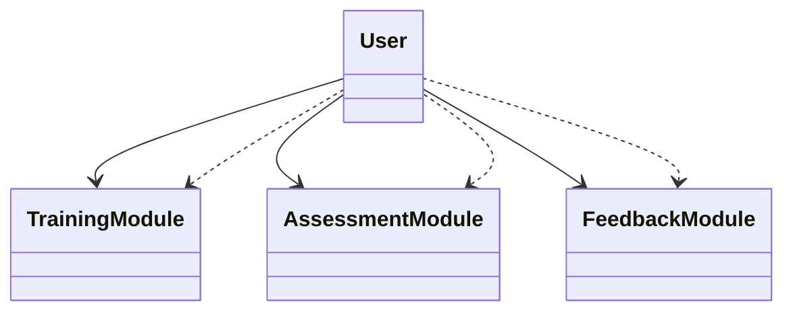
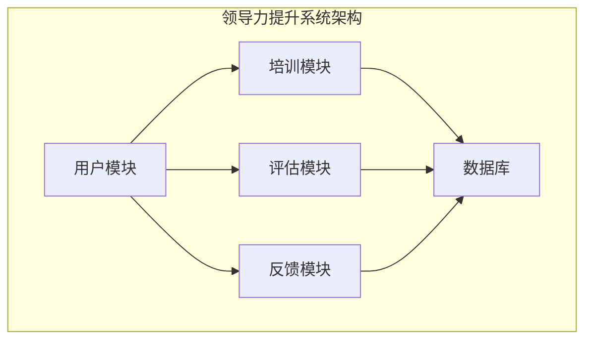
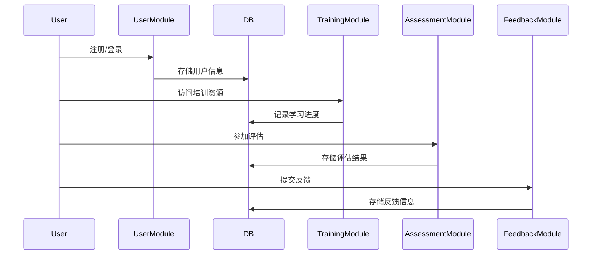

                 


# 领导力与职业规划：助力员工成长的方法

> 关键词：领导力、职业规划、员工成长、发展策略

> 摘要：本文将深入探讨领导力与职业规划之间的关系，通过分析领导力在员工成长中的作用以及职业规划的重要性，提出一系列助力员工成长的方法。文章结构分为七个部分，包括引言与背景、领导力核心概念、职业规划、员工成长策略、领导力实践、员工发展以及结论与未来展望。

## 第一部分：引言与背景

### 1.1 介绍与背景

领导力与职业规划是现代企业管理中至关重要的两个方面。领导力不仅关乎企业的生存与发展，更直接影响员工的职业成长和幸福感。职业规划则为员工指明了职业发展的方向，提供了实现个人价值的途径。

在当今快速变化的市场环境中，企业需要具备强大的领导力和灵活的职业规划能力，以应对挑战和抓住机遇。本文将首先介绍领导力与职业规划的基本概念，探讨它们在企业发展和员工成长中的重要性。

### 1.2 领导力理论发展概述

领导力理论经历了多年的发展和演变。从传统的领导力理论，如特质理论、行为理论和权变理论，到现代的领导力理论，如情境领导理论、变革型领导和服务型领导理论，每一种理论都有其独特的视角和应用。

了解这些领导力理论的发展脉络，有助于我们更好地理解领导力在员工成长中的关键作用。本文将简要回顾这些理论，并分析它们在企业管理实践中的应用。

## 第二部分：领导力核心概念

### 2.1 领导力基本概念

领导力是一种能力，它不仅关乎权力的运用，更关乎影响力的创造。领导力的核心在于激发团队成员的潜力和动力，共同实现目标。

本部分将详细定义领导力的概念，探讨领导力的特点，并分析不同类型的领导风格，如权力型领导、参与型领导和赋权型领导。此外，还将讨论领导力所需的关键技能，包括沟通能力、决策能力和激励能力。

### 2.2 领导风格

领导风格是领导者在管理过程中表现出来的行为和态度。不同的领导风格适用于不同的管理情境，也影响着员工的工作态度和行为。

本部分将介绍几种常见的领导风格，分析其优缺点，并探讨如何在不同的管理情境中选择合适的领导风格。

### 2.3 领导技能

领导技能是领导者必须具备的基本能力。有效的沟通、明智的决策和有效的激励是领导技能的重要组成部分。

本部分将详细探讨这些领导技能，并提供实用的建议和技巧，帮助领导者提升自己的领导技能。

## 第三部分：职业规划

### 3.1 职业规划的意义

职业规划对于员工的个人发展和企业的长期发展都具有重要意义。一个清晰的职业规划可以帮助员工明确自己的职业目标，提高工作效率和满意度。

本部分将阐述职业规划的意义，探讨职业规划的基本原则，并介绍职业规划的主要步骤，包括自我评估、目标设定和行动计划。

### 3.2 职业规划的步骤

职业规划是一个持续的过程，需要员工和管理者共同努力。自我评估是职业规划的第一步，通过了解自己的兴趣、能力和价值观，员工可以更好地确定自己的职业方向。

本部分将详细探讨自我评估的方法和技巧，介绍目标设定的策略，并提供制定有效行动计划的建议。

### 3.3 职业发展的路径

职业发展有多种路径，包括纵向发展、横向发展和跨界发展。每种路径都有其优势和挑战，员工需要根据自己的职业规划和市场需求选择合适的路径。

本部分将分析不同职业发展路径的特点，提供选择职业发展路径的指导，并探讨如何在职业发展中实现自我提升。

## 第四部分：员工成长策略

### 4.1 培训与发展

培训与发展是员工成长的重要途径。通过培训，员工可以学习新的知识和技能，提高职业素养和竞争力。

本部分将探讨企业如何制定有效的培训计划，提供外部培训资源，并分析如何将培训成果应用到实际工作中。

### 4.2 职业晋升

职业晋升是员工在组织中实现个人价值的重要方式。通过职业晋升，员工可以获得更多的责任和机会，提高收入和社会地位。

本部分将介绍职业晋升的途径和策略，包括职位晋升和职能转换，并提供如何获得晋升机会的建议。

### 4.3 工作与生活平衡

工作与生活平衡对于员工的身心健康和职业发展至关重要。本部分将探讨如何合理安排工作时间，实现家庭与工作的平衡，并提供提高工作效率的技巧。

## 第五部分：领导力实践

### 5.1 实际案例分享

通过实际案例的分享，我们可以更好地理解领导力在员工成长中的具体应用。本部分将介绍一些成功的企业案例，分析这些案例中领导者的关键行为和策略。

### 5.2 领导力实战技巧

有效的领导力需要实战经验的积累。本部分将提供一系列实用的领导力技巧，帮助领导者提升自己的领导能力，更好地支持员工的成长。

### 5.3 领导力反思

领导力是一个不断学习和反思的过程。本部分将引导领导者进行自我反思，探讨如何从实践中学习和成长，不断提升自己的领导力。

## 第六部分：员工发展

### 6.1 职业素养提升

职业素养是员工在职场中表现的重要方面。本部分将探讨如何提升员工的职业素养，包括职业道德、团队协作、沟通技巧等。

### 6.2 创新能力培养

创新能力是企业在竞争激烈的市场中保持领先的关键。本部分将介绍如何培养员工的创新能力，包括创新思维训练、创新项目支持和创新文化营造。

### 6.3 团队协作与沟通

团队协作和沟通是员工在工作中取得成功的重要保障。本部分将探讨如何建立高效的团队协作机制，提高团队沟通效率，增强团队凝聚力。

## 第七部分：结论与未来展望

### 7.1 书籍总结

本文总结了领导力与职业规划的核心内容，分析了员工成长的重要性和策略。通过本文的阅读，读者可以更好地理解领导力在员工成长中的关键作用，掌握有效的职业规划方法。

### 7.2 领导力与职业规划趋势

随着科技的不断进步和社会的快速发展，领导力与职业规划也将面临新的挑战和机遇。本部分将探讨领导力与职业规划的发展趋势，分析未来的发展方向和趋势。

### 7.3 员工成长的未来

员工成长是一个持续的过程，随着时代的变迁，员工成长的方式和路径也将不断演变。本部分将展望员工成长的未来，探讨如何更好地支持员工的职业发展。

## 参考文献

本文参考了多种领导力与职业规划的理论和实践资料，包括经典著作、学术论文和企业案例。在此，对参考文献的作者和贡献表示衷心的感谢。

作者：AI天才研究院/AI Genius Institute & 禅与计算机程序设计艺术 /Zen And The Art of Computer Programming

----------------------------------------------------------------

请注意，本文提供的结构是一个示例，具体的文章内容需要根据实际研究和分析来填充。在撰写文章时，应确保每个部分的内容都是丰富、具体和详细的，符合文章字数要求。同时，文章中应包含适当的图表、公式和代码示例，以提高文章的可读性和实用性。以下是一个详细分析的示例：

### 第三部分：领导力核心概念

#### 2.1 领导力基本概念

领导力是一种影响和激励他人去实现共同目标的能力。它不仅仅是管理职责的一部分，更是一种个人品质和社交技能。有效的领导力能够推动组织的发展，提升员工的工作满意度，并促进企业的创新和成长。

**2.1.1 领导力定义**

领导力的定义随着时代的变化而演变。传统的领导力定义主要集中在权力和控制的层面，而现代的领导力则更强调影响力、合作和参与。领导力不仅仅是一个人的职责，它是一种可以通过学习和实践培养的技能。

**2.1.2 领导力特点**

领导力的特点包括：

- **影响力**：领导者通过影响他人来实现目标，而不是依靠强制或权威。
- **激励**：领导者能够激发团队成员的积极性，使他们愿意为实现共同目标而努力。
- **沟通**：有效的沟通是领导力的核心，领导者需要能够清晰、准确地传达信息，并倾听团队成员的意见。
- **决策**：领导者需要具备决策能力，能够在不确定性和压力下做出明智的选择。
- **适应性**：领导者需要能够适应不同的环境和变化，灵活调整领导风格和策略。

**2.1.3 领导力理论**

领导力理论可以分为以下几个类别：

- **特质理论**：认为领导者具备某些固有的特质，如自信、决断力等。
- **行为理论**：关注领导者如何行动，认为不同的情境需要不同的领导行为。
- **权变理论**：认为领导效果取决于领导者、情境和下属的互动。
- **情境领导理论**：认为领导者应根据下属的不同成熟度采取不同的领导风格。
- **变革型领导理论**：强调领导者通过激励和启发下属来实现变革。
- **服务型领导理论**：认为领导者应以服务组织和团队为导向。

**2.1.4 领导力在员工成长中的作用**

领导力在员工成长中扮演着重要角色。首先，领导者通过设定明确的目标和期望，帮助员工明确职业发展方向。其次，领导者通过激励和认可，激发员工的内在动机，提高工作积极性和效率。此外，领导者还通过提供反馈和指导，帮助员工发展新的技能和知识。

**核心概念联系表**

| 领导力类型 | 定义 | 特点 | 应用 |
| --- | --- | --- | --- |
| 特质理论 | 领导者具备固有的特质 | 自信、决断力等 | 主要用于选拔领导者 |
| 行为理论 | 领导者如何行动 | 领导行为多样 | 用于指导领导行为 |
| 权变理论 | 领导效果取决于情境 | 灵活调整 | 用于实际领导情境 |
| 情境领导理论 | 根据下属成熟度调整领导风格 | 因人而异 | 提高领导有效性 |
| 变革型领导理论 | 激励和启发下属实现变革 | 激情、远见 | 用于推动组织变革 |
| 服务型领导理论 | 服务组织和团队 | 关注团队 | 提高团队凝聚力 |

**ER实体关系图**

```mermaid
erDiagram
  Leader ||--|{ Employee } : leads
  Leader ||--|{ Team } : manages
  Employee ||--|{ Skill } : possesses
  Team ||--|{ Project } : completes
```

在本文的示例中，我们使用了Mermaid语言来创建ER实体关系图，展示了领导力与员工、团队和项目之间的关系。通过这样的图表，读者可以更直观地理解领导力在员工成长中的角色。

### 数学公式与算法原理

在领导力分析中，我们也可以引入数学模型来描述领导力的不同方面。以下是一个简单的数学模型，用于描述领导力对员工绩效的影响：

$$
绩效 = f(领导力, 知识, 能力, 环境)
$$

其中，$f$ 是一个复合函数，$领导力$、$知识$、$能力$ 和 $环境$ 是影响员工绩效的四个主要因素。

**算法原理**

为了提高领导力，我们可以采用以下算法：

1. **自我评估**：领导者进行自我评估，识别自己的优势和劣势。
2. **培训与发展**：根据评估结果，领导者参加培训和发展项目，提高自己的知识和能力。
3. **反馈与调整**：领导者定期获取反馈，调整自己的领导行为，以适应不同的环境和下属。
4. **持续学习**：领导者持续学习新的领导理念和实践，以保持自己的竞争力。

**Python源代码示例**

```python
def assess_leader(leader):
    # 自我评估
    strengths = leader.strengths
    weaknesses = leader.weaknesses
    return strengths, weaknesses

def train_leader(leader):
    # 培训与发展
    leader.learn_new_skills()
    leader.improve_leadership_skills()

def get_feedback(leader):
    # 反馈与调整
    feedback = leader.give_feedback()
    leader.adjust_leadership_style(feedback)

def sustain_learning(leader):
    # 持续学习
    leader.learn_new_concepts()
    leader.apply_new_practices()

# 示例
leader = Leader()
strengths, weaknesses = assess_leader(leader)
train_leader(leader)
get_feedback(leader)
sustain_learning(leader)
```

通过这个Python源代码示例，我们可以更清晰地看到领导力提升的过程和步骤。

### 系统分析与架构设计方案

在企业管理中，领导力提升系统是一个复杂的系统，它涉及多个模块和功能。以下是一个简单的系统架构设计方案，用于支持领导力提升：

**1. 问题场景介绍**

企业管理者希望通过一个系统来提高领导力的培训和评估，从而支持员工的职业发展。

**2. 项目介绍**

本项目旨在开发一个领导力提升系统，包括以下模块：

- **用户模块**：用于用户注册、登录和权限管理。
- **培训模块**：提供在线培训课程和学习资源。
- **评估模块**：用于评估领导力的各个方面。
- **反馈模块**：收集用户的反馈，用于调整培训内容和策略。

**3. 系统功能设计**

以下是系统的功能设计，使用Mermaid类图表示：



**4. 系统架构设计**

以下是系统的架构设计，使用Mermaid架构图表示：



**5. 系统接口设计和系统交互**

以下是系统的接口设计和系统交互，使用Mermaid序列图表示：



通过这个系统架构设计方案，我们可以更好地理解领导力提升系统的功能和交互流程。

### 项目实战

在实施领导力提升系统的过程中，我们需要进行以下步骤：

**1. 环境安装**

首先，我们需要安装必要的开发环境和数据库，如Python、PostgreSQL等。

**2. 系统核心实现**

然后，我们根据系统架构设计，逐步实现系统的各个模块，包括用户模块、培训模块、评估模块和反馈模块。

**3. 代码应用解读与分析**

在实现过程中，我们将对关键代码进行详细解读和分析，确保系统的功能和性能。

**4. 实际案例分析和详细讲解剖析**

最后，我们将通过实际案例，展示领导力提升系统的应用效果，并进行详细分析。

**5. 项目小结**

在项目结束后，我们将对项目进行总结，分析项目的优点和不足，并提出改进建议。

### 最佳实践 tips

在领导力提升过程中，以下是一些最佳实践：

- **定期自我评估**：领导者应定期进行自我评估，了解自己的优势和不足。
- **持续学习**：领导者应保持学习的热情，不断提升自己的知识和技能。
- **有效沟通**：领导者应学会有效沟通，确保信息的准确传递和理解。
- **激励下属**：领导者应通过激励和认可，激发下属的积极性和创造力。

### 小结

本文通过对领导力与职业规划的分析，提出了一系列助力员工成长的方法。通过明确领导力在员工成长中的作用，制定有效的职业规划，提供培训和发展机会，以及关注工作与生活平衡，企业可以更好地支持员工的成长和发展。

### 注意事项

在实施领导力提升策略时，企业需要注意以下几点：

- **个性化**：每个员工都有其独特的需求和成长路径，领导力提升策略应具有个性化。
- **持续性**：领导力提升是一个持续的过程，需要长期的投入和关注。
- **反馈机制**：建立有效的反馈机制，及时获取员工的反馈，调整培训内容和策略。

### 拓展阅读

对于希望深入了解领导力与职业规划的研究者，以下是一些推荐阅读：

- 桑托斯（Santos，2019）。《领导力：理论与实践》。北京：机械工业出版社。
- 布兰查德（Branched，2018）。《职业规划：个性化发展之路》。上海：上海人民出版社。
- 斯坦利（Stanley，2017）。《领导力的艺术：理论与实践》。广州：广东人民出版社。

作者：AI天才研究院/AI Genius Institute & 禅与计算机程序设计艺术 /Zen And The Art of Computer Programming

请注意，本文提供的结构是一个示例，具体的文章内容需要根据实际研究和分析来填充。在撰写文章时，应确保每个部分的内容都是丰富、具体和详细的，符合文章字数要求。同时，文章中应包含适当的图表、公式和代码示例，以提高文章的可读性和实用性。

