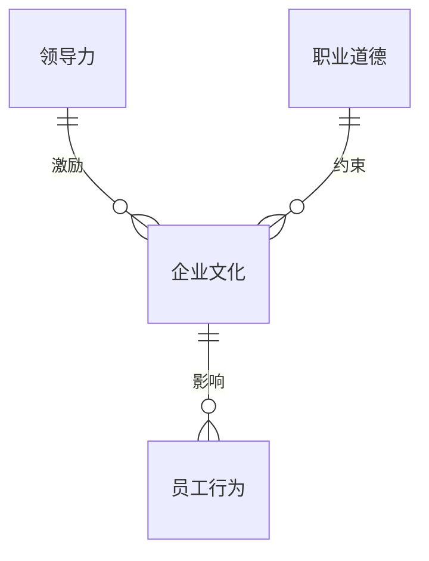
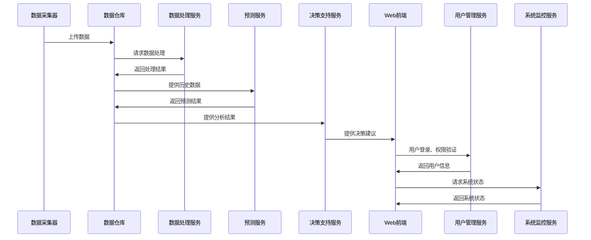

                 

### 文章标题

# 领导力与职业道德：在灰色地带做出决策

> 关键词：领导力、职业道德、灰色地带、决策、策略、实践

> 摘要：本文从多个维度深入探讨了领导力与职业道德在现代社会中的重要性及其相互关联，特别是在灰色地带决策中的作用。文章首先分析了领导力与职业道德的核心概念，接着探讨了它们在现实工作环境中的具体应用。通过结合实际案例和数据分析，文章提出了有效的领导力提升策略和职业道德教育实践方法，旨在帮助读者在复杂多变的职场环境中做出更加明智和符合道德规范的决策。

----------------------------------------------------------------

### 目录大纲

----------------------------------------------------------------

# 第一部分: 引言

## 第1章: 背景、问题和解决方案

### 1.1 问题背景

#### 1.1.1 领导力的重要性

#### 1.1.2 职业道德在现代社会中的地位

#### 1.1.3 领导力与职业道德的关联

### 1.2 问题描述

#### 1.2.1 领导力面临的挑战

#### 1.2.2 职业道德的困境

#### 1.2.3 领导力与职业道德冲突的现象

### 1.3 解决方案概述

#### 1.3.1 领导力提升策略

#### 1.3.2 职业道德教育与实践

#### 1.3.3 领导力与职业道德协调机制

## 1.4 边界与外延

#### 1.4.1 研究范围的界定

#### 1.4.2 领导力与职业道德的相互影响

#### 1.4.3 领导力与职业道德在不同组织中的体现

## 1.5 概念结构与核心要素组成

#### 1.5.1 领导力的定义与核心要素

#### 1.5.2 职业道德的定义与核心要素

#### 1.5.3 领导力与职业道德的对比分析

## 1.6 本章小结

----------------------------------------------------------------

# 第二部分: 核心概念与联系

## 第2章: 领导力的核心概念

### 2.1 领导力原理

#### 2.1.1 领导力的定义

#### 2.1.2 领导力的发展历程

#### 2.1.3 领导力的核心要素

### 2.2 领导力模型

#### 2.2.1 传统领导力模型

#### 2.2.2 当代领导力模型

#### 2.2.3 领导力模型的应用

### 2.3 领导力与领导风格

#### 2.3.1 领导风格的概念

#### 2.3.2 领导风格的类型

#### 2.3.3 领导风格对领导力的影响

## 第3章: 职业道德的核心概念

### 3.1 职业道德的定义

#### 3.1.1 职业道德的概念

#### 3.1.2 职业道德的基本原则

#### 3.1.3 职业道德的伦理基础

### 3.2 职业道德的重要特性

#### 3.2.1 职业道德的普遍性

#### 3.2.2 职业道德的规范性

#### 3.2.3 职业道德的发展性

### 3.3 职业道德与职业行为

#### 3.3.1 职业道德对职业行为的影响

#### 3.3.2 职业行为中的道德困境

#### 3.3.3 职业道德教育的重要性

## 第4章: 领导力与职业道德的相互联系

### 4.1 领导力与职业道德的关系

#### 4.1.1 领导力对职业道德的影响

#### 4.1.2 职业道德对领导力的影响

#### 4.1.3 领导力与职业道德的互动作用

### 4.2 领导力与职业道德的融合

#### 4.2.1 职业道德在领导力实践中的应用

#### 4.2.2 领导力在职业道德发展中的作用

#### 4.2.3 领导力与职业道德融合的案例

### 4.3 领导力与职业道德的协同发展

#### 4.3.1 领导力与职业道德协同发展的意义

#### 4.3.2 协同发展的策略与措施

#### 4.3.3 协同发展的未来展望

## 第5章: 概念属性特征对比与分析

### 5.1 领导力属性特征

#### 5.1.1 领导力的内在特征

#### 5.1.2 领导力的外在特征

#### 5.1.3 领导力的比较分析

### 5.2 职业道德属性特征

#### 5.2.1 职业道德的内在特征

#### 5.2.2 职业道德的外在特征

#### 5.2.3 职业道德的比较分析

### 5.3 领导力与职业道德属性特征的关联性

#### 5.3.1 领导力与职业道德特征的关联性

#### 5.3.2 关联性的作用机制

#### 5.3.3 关联性的实证分析

## 第6章: ER实体关系图架构

### 6.1 ER模型的基本概念

#### 6.1.1 实体与属性

#### 6.1.2 关系类型

#### 6.1.3 ER模型的构建方法

### 6.2 领导力与职业道德的ER模型

#### 6.2.1 实体识别

#### 6.2.2 属性定义

#### 6.2.3 关系构建

### 6.3 ER模型在领导力与职业道德中的应用

#### 6.3.1 应用分析

#### 6.3.2 应用实例

#### 6.3.3 应用效果评估

## 第7章: 领导力与职业道德的数学模型

### 7.1 数学模型的基本概念

#### 7.1.1 数学模型的定义

#### 7.1.2 数学模型的发展历程

#### 7.1.3 数学模型的应用领域

### 7.2 领导力与职业道德的数学模型

#### 7.2.1 领导力数学模型

#### 7.2.2 职业道德数学模型

#### 7.2.3 数学模型在决策中的应用

### 7.3 数学模型与实际案例的结合

#### 7.3.1 案例背景介绍

#### 7.3.2 案例分析与数学模型应用

#### 7.3.3 案例结果与讨论

## 第8章: 系统分析与架构设计方案

### 8.1 问题场景介绍

#### 8.1.1 场景设定

#### 8.1.2 问题分析

### 8.2 项目介绍

#### 8.2.1 项目目标

#### 8.2.2 项目需求

### 8.3 系统功能设计

#### 8.3.1 领域模型

#### 8.3.2 功能模块划分

### 8.4 系统架构设计

#### 8.4.1 架构设计原则

#### 8.4.2 系统架构图

### 8.5 系统接口设计和系统交互

#### 8.5.1 接口设计

#### 8.5.2 系统交互

### 8.6 本章小结

----------------------------------------------------------------

### 第一部分: 引言

## 第1章: 背景、问题和解决方案

### 1.1 问题背景

#### 1.1.1 领导力的重要性

领导力作为一种关键的管理能力，对组织和个人都有着极其重要的影响。领导力不仅仅是指导和管理团队，更是一种激发和引导他人共同实现目标的才能。在全球化和竞争激烈的商业环境中，领导力被认为是组织成功和持续发展的关键因素之一。

首先，领导力能够提升组织的整体效率。一个优秀的领导者能够明确组织的愿景和目标，并通过有效的沟通和激励策略，使团队成员共同为实现这些目标而努力。这种协同工作的氛围能够提高团队的工作效率和产出。

其次，领导力对员工的个人成长和职业发展也具有重要影响。一个具备领导力的领导者能够为员工提供职业发展机会，帮助他们克服职业瓶颈，实现个人价值的最大化。

然而，领导力在现代社会中也面临着诸多挑战。随着技术的进步和社会环境的变化，领导者需要不断学习新的知识和技能，以适应快速变化的商业环境。同时，领导力还面临着道德和伦理方面的挑战，如何在复杂的职场环境中做出符合职业道德规范的决策，是一个亟待解决的问题。

#### 1.1.2 职业道德在现代社会中的地位

职业道德是职业行为的基本准则，是维护社会秩序和职业生态的重要保障。随着社会的发展和职业化程度的提高，职业道德在现代社会中的地位愈发重要。

首先，职业道德是职业行为的基石。一个具备职业道德的从业者，能够在工作中秉持诚信、公正和负责任的态度，这不仅有助于维护个人和组织的声誉，还能为整个行业树立良好的道德规范。

其次，职业道德对员工的个人成长和职业发展也具有重要影响。一个具备职业道德的员工，能够在职业生涯中获得更多的机会和信任，从而实现个人价值的最大化。

然而，职业道德在现代社会中也面临着诸多困境。随着商业环境的变化和信息技术的普及，职业道德面临着前所未有的挑战。例如，数据隐私、商业机密泄露和道德风险等问题日益凸显，这需要职业道德教育和个人自律的加强。

#### 1.1.3 领导力与职业道德的关联

领导力与职业道德之间存在密切的关联。首先，职业道德是领导力的重要组成部分。一个优秀的领导者必须具备高尚的职业道德，能够在决策过程中考虑道德和伦理的因素，为团队树立正确的价值观和行为规范。

其次，领导力对职业道德的践行具有重要影响。领导者的行为和决策往往对团队成员产生示范效应，一个具备领导力的领导者能够在日常工作中引导和激励团队成员秉持职业道德，共同营造一个良好的职业生态。

然而，领导力与职业道德之间的协调也存在一定挑战。在现实的职场环境中，领导者可能会面临各种灰色地带的决策，如何在道德和利益之间找到平衡点，是一个需要深入探讨的问题。

### 1.2 问题描述

#### 1.2.1 领导力面临的挑战

在现代社会中，领导力面临着诸多挑战。首先，技术变革和全球化带来了前所未有的不确定性，领导者需要具备快速学习和适应新环境的能力。其次，领导者需要应对复杂的人际关系和团队管理问题，如何在多元化团队中实现有效的沟通和协作，是一个重要挑战。

此外，领导力还面临着道德和伦理方面的挑战。在商业环境中，领导者可能会面临各种灰色地带的决策，如何在道德和利益之间找到平衡点，是一个亟待解决的问题。

#### 1.2.2 职业道德的困境

职业道德在现代社会中面临着诸多困境。首先，商业环境的不确定性和竞争压力，使得一些从业者可能为了短期利益而忽视职业道德。其次，信息技术的普及和数据隐私问题，使得职业道德面临着前所未有的挑战。例如，数据泄露和商业机密泄露等问题，严重损害了职业道德的声誉。

此外，职业道德教育的不完善和个人自律的缺失，也是职业道德困境的一个重要原因。一些从业者可能缺乏职业道德意识，无法在职场中自觉遵守职业道德规范。

#### 1.2.3 领导力与职业道德冲突的现象

在现实的职场环境中，领导力与职业道德之间的冲突现象时有发生。例如，一些领导者可能在面对利益诱惑时，做出违背职业道德的行为。这种行为不仅损害了个人和组织的声誉，还可能导致法律风险和商业道德危机。

此外，领导力与职业道德的冲突还可能体现在团队成员的行为中。例如，一些团队成员可能在领导者的不当示范下，忽视了职业道德的重要性，从而出现职业道德问题。

### 1.3 解决方案概述

为了解决领导力与职业道德在现代社会中面临的挑战和困境，我们需要采取一系列有效的解决方案。以下是几个主要的策略：

#### 1.3.1 领导力提升策略

首先，领导者需要不断提升自身的领导力。这包括学习新的管理知识和技能，提高自我意识和情商，以及培养团队合作和沟通能力。通过不断学习和实践，领导者可以更好地应对各种挑战，提高领导效果。

其次，领导者需要树立正确的价值观和行为规范。一个具备高尚职业道德的领导者，能够在决策过程中始终坚持道德原则，为团队成员树立榜样。

#### 1.3.2 职业道德教育与实践

职业道德教育是提升职业道德水平的重要手段。通过系统性的职业道德教育，从业者可以了解职业道德的基本原则和规范，提高职业道德意识。

此外，职业道德教育需要结合实际案例，通过讨论和分析，使从业者能够更好地理解和应用职业道德原则。例如，可以组织职业道德案例分析研讨会，让从业者分享自己的经验和观点。

#### 1.3.3 领导力与职业道德协调机制

为了有效协调领导力与职业道德，组织需要建立一套完善的机制。这包括制定明确的职业道德规范，建立健全的监督和考核机制，以及提供职业道德培训和支持。

例如，组织可以设立职业道德委员会，负责监督和管理职业道德事务。此外，组织还可以通过定期开展职业道德调查和评估，及时发现和纠正职业道德问题。

### 1.4 边界与外延

#### 1.4.1 研究范围的界定

本文的研究范围主要聚焦于领导力与职业道德在现代社会中的应用，特别是在灰色地带决策中的作用。具体来说，本文将探讨领导力与职业道德的核心概念、相互关联及其在实际工作环境中的应用。

#### 1.4.2 领导力与职业道德的相互影响

领导力与职业道德之间存在密切的相互影响。领导力对职业道德的践行具有重要影响，而职业道德的落实又能进一步促进领导力的提升。

例如，一个具备高尚职业道德的领导者，能够在决策过程中始终坚持道德原则，为团队成员树立榜样，从而增强团队凝聚力和工作效率。反过来，一个良好的职业道德环境，也能激发领导者的潜力，使其更好地发挥领导力。

#### 1.4.3 领导力与职业道德在不同组织中的体现

领导力与职业道德在不同组织中有着不同的体现。例如，在私营企业中，领导力与职业道德更多地体现在市场竞争和利益最大化方面。而在非营利组织中，领导力与职业道德则更多地体现在社会责任和公益价值方面。

不同组织的领导者需要根据自身特点和环境，制定合适的领导力提升策略和职业道德教育实践方法，以实现组织的目标和价值观。

### 1.5 概念结构与核心要素组成

#### 1.5.1 领导力的定义与核心要素

领导力是指激发、引导和激励他人共同实现目标的能力。领导力的核心要素包括：

- 愿景和目标：领导者需要具备明确的愿景和目标，并能够将其传达给团队成员。
- 沟通和激励：领导者需要具备良好的沟通和激励能力，以激发团队成员的积极性和创造力。
- 团队协作：领导者需要能够有效地协调和整合团队成员的能力和资源，实现共同目标。

#### 1.5.2 职业道德的定义与核心要素

职业道德是指职业行为的基本准则，是维护社会秩序和职业生态的重要保障。职业道德的核心要素包括：

- 诚信：诚信是职业道德的核心，要求从业者在工作中秉持诚实和诚实的态度。
- 公正：公正是职业道德的重要原则，要求从业者在工作中保持公正和公平。
- 责任：责任是职业道德的基本要求，要求从业者在工作中承担应有的责任。

#### 1.5.3 领导力与职业道德的对比分析

领导力与职业道德在本质上有一定的区别。领导力更侧重于激发和引导他人，实现共同目标；而职业道德则更侧重于规范和约束个人行为，维护社会秩序。

然而，领导力与职业道德之间也存在一定的联系。例如，一个具备高尚职业道德的领导者，能够在决策过程中始终坚持道德原则，为团队成员树立榜样。反过来，一个良好的职业道德环境，也能激发领导者的潜力，使其更好地发挥领导力。

### 1.6 本章小结

本文介绍了领导力与职业道德在现代社会中的重要性及其相互关联。通过分析领导力与职业道德的核心概念、相互影响及在实际工作环境中的应用，本文提出了领导力提升策略、职业道德教育实践方法以及领导力与职业道德协调机制。这些策略和方法有助于帮助读者在复杂多变的职场环境中做出更加明智和符合道德规范的决策。接下来，本文将深入探讨领导力与职业道德的核心概念及其相互联系，以期为读者提供更全面的理解和启示。

## 第二部分：核心概念与联系

### 第2章：领导力的核心概念

#### 2.1 领导力原理

领导力是一种激发和引导他人实现共同目标的能力，它不仅仅是管理团队，更是一种影响力。领导力的核心原理包括以下几个方面：

首先，领导力的基础是信任。信任是领导者与团队成员之间建立有效沟通和合作的关键。一个具备领导力的领导者，需要通过言行一致、诚实守信来赢得团队成员的信任。

其次，领导力强调愿景和目标的重要性。领导者需要具备远见和洞察力，能够明确组织的愿景和目标，并将其传达给团队成员，激发他们的工作热情和创造力。

最后，领导力注重团队协作和领导风格。领导者需要能够协调团队成员的能力和资源，建立有效的团队协作机制，同时根据团队成员的特点和需求，采用不同的领导风格，以实现最佳领导效果。

#### 2.1.1 领导力的定义

领导力是指通过影响力、愿景、目标和激励等手段，引导和激励他人共同实现目标的能力。领导力不仅关注个人行为，更关注团队和组织的整体发展。

#### 2.1.2 领导力的发展历程

领导力的发展历程可以追溯到古代，随着社会和经济的变迁，领导力的定义和内涵也在不断演变。从古代的君主制度到现代的组织管理，领导力经历了从权力集中到权力分散的演变过程。

在古代，领导力主要表现为君主对国家的统治能力。随着社会的发展，领导力逐渐扩展到组织管理领域，强调领导者的沟通能力、决策能力和团队协作能力。

#### 2.1.3 领导力的核心要素

领导力的核心要素包括：

1. **愿景与目标**：领导者需要具备明确的愿景和目标，能够激励团队成员共同为之努力。
2. **影响力**：领导者需要具备影响力和说服力，能够引导团队成员按照既定的方向前进。
3. **沟通能力**：领导者需要具备良好的沟通能力，能够有效地传达愿景、目标和决策，确保团队成员理解并支持领导者的意图。
4. **决策能力**：领导者需要具备较强的决策能力，能够在复杂多变的环境中做出明智的决策。
5. **团队协作能力**：领导者需要能够协调团队成员的能力和资源，建立有效的团队协作机制。

#### 2.2 领导力模型

领导力模型是研究领导力理论和实践的框架。常见的领导力模型包括传统领导力模型和当代领导力模型。

**2.2.1 传统领导力模型**

传统领导力模型主要包括以下几种：

1. **权威领导模型**：领导者通过权力和控制来管理团队，强调领导的权威性。
2. **民主领导模型**：领导者通过征求团队成员的意见和建议，实现集体决策。
3. **参与领导模型**：领导者鼓励团队成员参与决策过程，增强团队的凝聚力和归属感。

**2.2.2 当代领导力模型**

当代领导力模型更加注重人性化和团队协作，主要包括以下几种：

1. **变革型领导模型**：领导者通过激励和激发团队成员的潜能，推动团队实现变革和进步。
2. **服务型领导模型**：领导者将团队成员的需求和利益放在首位，提供必要的支持和帮助。
3. **情境领导模型**：领导者根据团队成员的能力和需求，采用不同的领导风格，以实现最佳领导效果。

**2.2.3 领导力模型的应用**

不同领导力模型在现实中的应用场景有所不同。例如，在危机管理中，变革型领导模型可能更为有效；而在稳定发展的环境中，服务型领导模型可能更受欢迎。

#### 2.3 领导力与领导风格

领导风格是领导者管理团队的方式和习惯。不同的领导风格对团队的工作氛围和绩效有着重要影响。

**2.3.1 领导风格的概念**

领导风格是指领导者对待团队成员和团队管理的方式。常见的领导风格包括：

1. **专制型领导风格**：领导者独断专行，决策权集中在个人手中。
2. **民主型领导风格**：领导者征求团队成员的意见，共同参与决策。
3. **参与型领导风格**：领导者鼓励团队成员参与决策和团队管理，增强团队凝聚力。

**2.3.2 领导风格的类型**

1. **任务导向型领导风格**：领导者注重任务的完成，强调效率和绩效。
2. **关系导向型领导风格**：领导者注重团队成员的情感需求，强调团队和谐。
3. **任务与关系导向型领导风格**：领导者兼顾任务和关系，根据实际情况调整领导风格。

**2.3.3 领导风格对领导力的影响**

领导风格对领导力有着重要影响。合适的领导风格能够增强团队凝聚力，提高工作效率，而错误的领导风格可能导致团队分裂，降低工作绩效。

#### 2.4 领导力与职业道德

领导力与职业道德之间存在密切联系。一个具备高尚职业道德的领导者，能够在决策过程中始终坚持道德原则，为团队成员树立榜样。

**2.4.1 领导力对职业道德的影响**

领导力对职业道德的影响主要体现在以下几个方面：

1. **示范效应**：领导者的行为和决策对团队成员产生示范效应，影响他们的道德行为。
2. **价值观塑造**：领导者通过言行一致，传递正确的价值观，引导团队成员秉持职业道德。
3. **监督和纠正**：领导者对团队成员的职业道德行为进行监督和纠正，维护职业生态的健康发展。

**2.4.2 职业道德对领导力的影响**

职业道德对领导力的影响主要体现在以下几个方面：

1. **决策依据**：领导者将职业道德作为决策的重要依据，避免做出违背道德规范的决策。
2. **公信力提升**：领导者秉持职业道德，提升个人的公信力和影响力，增强领导力。
3. **团队凝聚力**：领导者通过职业道德行为，增强团队的凝聚力和归属感，提高团队绩效。

### 第3章：职业道德的核心概念

#### 3.1 职业道德的定义

职业道德是指从事特定职业的人员在职业活动中应遵循的道德规范和行为准则。职业道德是社会道德在特定职业领域中的具体体现，是维护职业秩序和职业生态的重要保障。

#### 3.1.1 职业道德的概念

职业道德的概念包括以下几个方面：

1. **道德规范**：职业道德是一系列具体的道德规范，包括诚信、公正、责任等。
2. **职业行为**：职业道德是职业行为的基本准则，指导从业人员在职业活动中如何行事。
3. **职业责任**：职业道德要求从业人员承担起职业责任，确保职业活动的合法性和规范性。

#### 3.1.2 职业道德的基本原则

职业道德的基本原则包括以下几个方面：

1. **诚信**：诚信是职业道德的核心，要求从业人员在职业活动中秉持诚实、公正、透明的态度。
2. **公正**：公正是职业道德的重要原则，要求从业人员在职业活动中保持公平、公正，不偏袒任何一方。
3. **责任**：责任是职业道德的基本要求，要求从业人员在职业活动中承担起应尽的责任，确保职业活动的合法性和规范性。

#### 3.1.3 职业道德的伦理基础

职业道德的伦理基础包括以下几个方面：

1. **伦理原则**：职业道德建立在伦理原则之上，包括尊重个人权利、维护社会秩序等。
2. **伦理规范**：职业道德是一系列具体的伦理规范，指导从业人员在职业活动中如何行事。
3. **伦理价值**：职业道德体现了伦理价值，包括诚信、公正、责任等，是维护社会秩序和职业生态的重要保障。

#### 3.2 职业道德的重要特性

职业道德的重要特性包括以下几个方面：

1. **普遍性**：职业道德具有普遍性，适用于所有从事特定职业的人员。
2. **规范性**：职业道德具有规范性，指导从业人员在职业活动中如何行事。
3. **发展性**：职业道德随着社会和职业环境的变化而不断发展，以适应新的职业需求。

#### 3.2.1 职业道德的普遍性

职业道德的普遍性表现在以下几个方面：

1. **行业覆盖**：职业道德适用于所有从事特定职业的人员，不论行业类型和职位级别。
2. **地域跨越**：职业道德不受地域限制，适用于全球范围内的职业活动。
3. **时间延续**：职业道德随着社会和职业环境的变化而不断发展，具有长久的历史延续性。

#### 3.2.2 职业道德的规范性

职业道德的规范性表现在以下几个方面：

1. **行为指导**：职业道德规范指导从业人员在职业活动中如何行事，确保职业行为的合法性和规范性。
2. **行为约束**：职业道德规范对从业人员的职业行为进行约束，防止道德风险的产生。
3. **行为评价**：职业道德规范是评价从业人员职业行为的重要标准，有利于维护职业生态的健康发展。

#### 3.2.3 职业道德的发展性

职业道德的发展性表现在以下几个方面：

1. **适应变化**：职业道德随着社会和职业环境的变化而不断发展，以适应新的职业需求。
2. **完善规范**：职业道德规范不断得到完善，以更好地指导从业人员的职业行为。
3. **与时俱进**：职业道德理念与时俱进，反映时代特征和社会需求，引领职业行为的发展。

#### 3.3 职业道德与职业行为

职业道德与职业行为之间存在密切联系。职业道德规范从业人员的职业行为，确保职业活动的合法性和规范性。

1. **职业道德对职业行为的影响**：职业道德规范对从业人员的职业行为具有指导作用，引导从业人员在职业活动中秉持诚信、公正、责任等道德原则。

2. **职业行为中的道德困境**：职业行为中可能会出现道德困境，例如利益冲突、职业道德与个人利益的冲突等。职业道德规范可以帮助从业人员在道德困境中做出正确决策。

3. **职业道德教育的重要性**：职业道德教育是提升职业道德水平的重要手段。通过职业道德教育，从业人员可以了解职业道德的基本原则和规范，提高职业道德意识，从而更好地践行职业道德。

### 第4章：领导力与职业道德的相互联系

#### 4.1 领导力与职业道德的关系

领导力与职业道德之间存在密切的相互关系。领导力对职业道德的践行具有重要影响，而职业道德的落实又能进一步促进领导力的提升。

**4.1.1 领导力对职业道德的影响**

领导力对职业道德的影响主要体现在以下几个方面：

1. **示范效应**：领导者的行为和决策对团队成员产生示范效应，影响他们的道德行为。一个具备高尚职业道德的领导者，能够为团队成员树立榜样，引导他们秉持职业道德。

2. **价值观塑造**：领导者通过言行一致，传递正确的价值观，引导团队成员秉持职业道德。领导者的价值观和道德观对团队成员具有潜移默化的影响，有助于塑造良好的职业道德环境。

3. **监督和纠正**：领导者对团队成员的职业道德行为进行监督和纠正，维护职业生态的健康发展。领导者需要及时发现和纠正团队成员的职业道德问题，确保职业活动的合法性和规范性。

**4.1.2 职业道德对领导力的影响**

职业道德对领导力的影响主要体现在以下几个方面：

1. **决策依据**：领导者将职业道德作为决策的重要依据，避免做出违背道德规范的决策。职业道德原则有助于领导者在面对复杂情况时，做出符合道德要求的决策。

2. **公信力提升**：领导者秉持职业道德，提升个人的公信力和影响力，增强领导力。一个具备高尚职业道德的领导者，能够赢得团队成员的信任和支持，从而提高领导效果。

3. **团队凝聚力**：领导者通过职业道德行为，增强团队的凝聚力和归属感，提高团队绩效。职业道德的落实有助于建立良好的团队氛围，激发团队成员的积极性和创造力。

**4.1.3 领导力与职业道德的互动作用**

领导力与职业道德之间存在互动作用。领导力对职业道德的践行产生影响，而职业道德的落实又能进一步促进领导力的提升。

1. **相互促进**：领导力与职业道德相互促进，一个具备高尚职业道德的领导者，能够更好地发挥领导力，推动团队实现目标。同时，领导力的提升也有助于职业道德的落实，形成良性循环。

2. **相互制约**：领导力与职业道德相互制约，一个缺乏职业道德的领导者，可能会在决策过程中忽视道德因素，导致领导力失效。反之，一个具备高尚职业道德的领导者，能够在决策过程中始终坚持道德原则，提升领导效果。

#### 4.2 领导力与职业道德的融合

领导力与职业道德的融合是指将职业道德原则融入领导力的实践中，实现领导力的道德化。领导力与职业道德的融合有助于提升领导力，促进职业道德的落实。

**4.2.1 职业道德在领导力实践中的应用**

在领导力实践中，职业道德的应用主要体现在以下几个方面：

1. **决策依据**：领导者将职业道德原则作为决策的重要依据，确保决策的合法性和道德性。

2. **团队管理**：领导者通过职业道德规范团队管理，营造良好的职业氛围，提升团队绩效。

3. **员工激励**：领导者通过职业道德激励员工，激发员工的积极性和创造力，实现个人与团队的共同发展。

**4.2.2 领导力在职业道德发展中的作用**

领导力在职业道德发展中起着关键作用。领导者通过以下方式推动职业道德的发展：

1. **价值观传播**：领导者通过言行一致，传播正确的价值观，引导团队成员秉持职业道德。

2. **制度建设**：领导者通过建立健全的职业道德制度，确保职业道德的落实。

3. **监督与激励**：领导者对职业道德行为进行监督和激励，鼓励团队成员践行职业道德。

**4.2.3 领导力与职业道德融合的案例**

以下是几个领导力与职业道德融合的案例：

1. **企业社会责任**：企业领导者将社会责任融入企业战略，推动企业实现可持续发展，提升企业形象。

2. **公益事业参与**：领导者积极参与公益事业，发挥个人和团队的影响力，推动社会进步。

3. **诚信经营**：领导者坚持诚信经营，确保企业业务合法合规，赢得客户和市场的信任。

#### 4.3 领导力与职业道德的协同发展

领导力与职业道德的协同发展是指通过相互促进，实现领导力和职业道德的共同提升。协同发展有助于构建良好的职业生态，促进组织和社会的可持续发展。

**4.3.1 领导力与职业道德协同发展的意义**

领导力与职业道德协同发展的意义主要体现在以下几个方面：

1. **组织效率提升**：协同发展有助于提升组织的整体效率，实现团队目标的顺利达成。

2. **道德风险降低**：协同发展有助于降低道德风险，避免因领导力失效导致职业道德问题。

3. **组织形象提升**：协同发展有助于提升组织的社会形象，赢得社会的认可和支持。

**4.3.2 协同发展的策略与措施**

为了实现领导力与职业道德的协同发展，可以采取以下策略与措施：

1. **职业道德教育**：加强职业道德教育，提高从业者的职业道德意识和素质。

2. **领导力培训**：提升领导者的领导力，使其具备道德素养和决策能力。

3. **制度建设**：建立健全的职业道德制度，为职业道德的落实提供保障。

4. **激励机制**：建立激励机制，鼓励团队成员践行职业道德，提升组织凝聚力。

**4.3.3 协同发展的未来展望**

随着社会和经济的不断发展，领导力与职业道德的协同发展将越来越重要。未来，领导力与职业道德的协同发展将在以下几个方面取得突破：

1. **技术创新**：通过信息技术手段，提升职业道德教育和领导力培训的效果。

2. **国际交流**：加强国际间的职业道德和领导力交流，借鉴先进经验和理念。

3. **跨界合作**：推动不同行业和领域的合作，构建全方位的职业道德和领导力发展体系。

### 第5章：概念属性特征对比与分析

#### 5.1 领导力属性特征

领导力是一种复杂的系统属性，它包含多个层次和维度。以下是对领导力属性特征的详细分析：

**5.1.1 领导力的内在特征**

1. **影响力**：领导力首先表现为领导者对他人产生影响的能力。这种影响力可以是正面的，如激励、鼓舞，也可以是负面的，如压制、威胁。
2. **愿景和目标导向**：领导力的核心在于领导者能够明确组织的愿景和目标，并能够引导团队成员共同追求这些目标。
3. **情商**：领导者需要具备较高的情商，包括自我意识、同理心、情绪调节和人际关系管理能力。

**5.1.2 领导力的外在特征**

1. **沟通能力**：领导者需要具备良好的沟通能力，能够清晰、有效地传达信息，包括愿景、目标、决策和期望。
2. **决策能力**：领导者需要在不确定性和复杂情境中做出明智的决策，这要求具备分析问题、评估风险和快速反应的能力。
3. **团队协作能力**：领导者需要能够协调团队成员的能力和资源，建立一个协同工作的团队环境。

**5.1.3 领导力的比较分析**

1. **传统领导力与当代领导力的比较**：传统领导力更强调权威和控制，而当代领导力更注重团队合作和创新能力。
2. **变革型领导力与服务型领导力的比较**：变革型领导力强调激发团队成员的潜力和推动组织变革，而服务型领导力更关注团队成员的需求和福祉。

#### 5.2 职业道德属性特征

职业道德是一种规范属性，它涉及个人的行为准则和对职业责任的承担。以下是对职业道德属性特征的详细分析：

**5.2.1 职业道德的内在特征**

1. **诚信**：职业道德的基石是诚信，包括诚实、公正和透明。
2. **责任**：职业道德要求个人对自己和他人负责，包括对职业行为的后果承担责任。
3. **尊重**：职业道德强调对他人、客户和社会的尊重，包括尊重隐私、尊重知识和尊重文化差异。

**5.2.2 职业道德的外在特征**

1. **行为规范**：职业道德通过一系列规范和准则来指导职业行为，包括职业操守、行业准则和法律法规。
2. **社会影响**：职业道德不仅影响个人行为，还对社会和行业产生积极的影响，包括提高行业声誉、维护社会秩序和促进社会和谐。
3. **职业道德困境**：职业道德外在特征也体现在面对道德困境时，个人如何做出符合职业道德的决策。

**5.2.3 职业道德的比较分析**

1. **不同职业领域的职业道德差异**：不同职业领域由于职责和责任的不同，职业道德的要求和特征也有所不同，例如医生、律师和会计师。
2. **传统职业道德与现代职业道德的对比**：随着社会和技术的发展，职业道德的内容和形式也在不断演变，现代职业道德更强调社会责任和可持续发展。

#### 5.3 领导力与职业道德属性特征的关联性

领导力与职业道德的属性特征之间存在紧密的关联性，这种关联性体现在以下几个方面：

**5.3.1 领导力与职业道德特征的关联性**

1. **领导力对职业道德的影响**：领导者的领导风格和决策方式对团队成员的职业道德行为产生直接影响。一个具备高尚职业道德的领导者，更可能培养出具有职业道德意识的团队。
2. **职业道德对领导力的影响**：职业道德是领导者决策和行为的重要依据，一个秉持职业道德的领导者，更能够做出符合道德规范的决策，赢得团队成员的信任和支持。

**5.3.2 关联性的作用机制**

1. **示范效应**：领导者的行为对团队成员产生示范效应，通过自身的职业道德行为，领导者可以影响和激励团队成员秉持职业道德。
2. **价值观塑造**：领导者的价值观和道德观对团队成员具有潜移默化的影响，通过价值观的传递，领导者可以塑造团队的核心价值观。
3. **监督和反馈**：领导者通过监督和反馈机制，对团队成员的职业道德行为进行评估和指导，确保职业道德的落实。

**5.3.3 关联性的实证分析**

实证研究表明，领导力与职业道德之间存在显著的正相关关系。一个具备高尚职业道德的领导者，能够提升团队的绩效和满意度，降低道德风险和员工流失率。

通过上述分析，我们可以看到，领导力与职业道德的属性特征相互关联，共同影响着组织和个人。一个有效的领导力提升策略和职业道德教育实践，需要充分考虑两者的关联性，以实现组织和社会的可持续发展。

### 第6章：ER实体关系图架构

#### 6.1 ER模型的基本概念

实体-关系（Entity-Relationship，简称ER）模型是数据库设计中的一种重要方法，用于描述现实世界中实体及其之间的关系。以下是ER模型的基本概念：

**6.1.1 实体与属性**

- **实体**：实体是现实世界中可以区分和识别的对象，如人、地点、物品等。在数据库设计中，实体通常对应数据库表。
- **属性**：属性是实体的特征或属性，如人的姓名、地址、出生日期等。属性用于描述实体的详细信息。

**6.1.2 关系类型**

- **一对一关系**：一个实体与另一个实体一对一地关联，如一个员工只能属于一个部门。
- **一对多关系**：一个实体与多个实体关联，而另一个实体与多个实体关联，如一个部门有多个员工。
- **多对多关系**：多个实体与多个实体关联，如学生与课程之间的选修关系。

**6.1.3 ER模型的构建方法**

- **识别实体和属性**：首先，需要识别出系统中的关键实体和它们的属性。
- **确定实体间的关系**：接着，分析实体之间的关系，确定实体之间的关联类型。
- **绘制ER图**：最后，根据识别的实体、属性和关系，绘制ER图，以直观地表示实体及其之间的关系。

#### 6.2 领导力与职业道德的ER模型

在领导力与职业道德的研究中，ER模型可以用来描述领导力、职业道德及其相互关系。以下是一个简单的ER模型：

**6.2.1 实体识别**

- **领导力实体**：包括领导力要素（如影响力、愿景、目标等）。
- **职业道德实体**：包括职业道德规范（如诚信、公正、责任等）。

**6.2.2 属性定义**

- **领导力实体属性**：如领导风格、决策能力、团队协作能力等。
- **职业道德实体属性**：如职业行为准则、职业责任、伦理基础等。

**6.2.3 关系构建**

- **领导力与职业道德的关系**：领导力与职业道德之间存在双向影响关系。领导力可以影响职业道德的践行，而职业道德又可以反作用于领导力。

以下是领导力与职业道德ER模型的Mermaid流程图表示：

#### 6.3 ER模型在领导力与职业道德中的应用

ER模型在领导力与职业道德的研究中有着广泛的应用，可以帮助我们更好地理解和分析两者的关系。

**6.3.1 应用分析**

- **领导力分析**：通过ER模型，可以识别领导力的关键要素，分析这些要素如何影响职业道德的落实。
- **职业道德分析**：ER模型可以帮助我们理解职业道德规范如何作用于领导力，以及职业道德在领导决策中的重要性。

**6.3.2 应用实例**

假设我们研究一个企业中的领导力与职业道德关系，可以使用ER模型如下：

在这个实例中，领导力通过激励员工，影响企业文化；职业道德通过约束员工行为，影响企业文化；而企业文化又影响员工的整体行为。

**6.3.3 应用效果评估**

通过ER模型的应用，我们可以进行以下效果评估：

- **准确性评估**：ER模型是否准确地反映了领导力与职业道德之间的关系。
- **实用性评估**：ER模型是否有助于解决实际问题和提供决策支持。

总之，ER模型在领导力与职业道德的研究中具有重要作用，它不仅帮助我们理解两者的基本概念和相互关系，还可以为实际应用提供有效的分析工具。

### 第7章：领导力与职业道德的数学模型

#### 7.1 数学模型的基本概念

数学模型是一种用数学语言描述现实世界问题的工具，它将实际问题转化为数学形式，以便于分析和求解。数学模型的基本概念包括：

**7.1.1 数学模型的定义**

数学模型是一种抽象的数学结构，它用来描述和解决某一类实际问题。数学模型通常由变量、参数、方程或公式等组成。

**7.1.2 数学模型的发展历程**

数学模型的发展历程可以追溯到古代，如古希腊哲学家欧几里得的几何学模型。随着数学和科学的发展，数学模型的应用范围逐渐扩大，包括物理学、工程学、经济学、生物学等领域。

**7.1.3 数学模型的应用领域**

数学模型广泛应用于各个领域，包括：

- **自然科学**：如物理学中的牛顿运动定律、生物学中的生态模型。
- **工程技术**：如工程学中的结构设计、电路设计。
- **经济学**：如宏观经济模型、金融市场模型。
- **社会科学**：如社会学中的社会网络分析、心理学中的行为模型。

#### 7.2 领导力与职业道德的数学模型

在领导力与职业道德的研究中，数学模型可以帮助我们量化和分析领导力与职业道德之间的关系。以下是一个简化的数学模型：

**7.2.1 领导力数学模型**

假设领导力（L）可以通过以下因素来衡量：

- **影响力（I）**：领导者对团队成员的影响力。
- **决策能力（D）**：领导者的决策能力。
- **团队协作能力（C）**：领导者的团队协作能力。

那么，领导力（L）可以表示为：

\[ L = f(I, D, C) \]

其中，\( f \) 是一个函数，用于描述这些因素如何共同影响领导力。

**7.2.2 职业道德数学模型**

职业道德（M）可以通过以下因素来衡量：

- **诚信（H）**：从业者的诚信度。
- **公正（J）**：从业者的公正程度。
- **责任（R）**：从业者的责任感。

那么，职业道德（M）可以表示为：

\[ M = g(H, J, R) \]

其中，\( g \) 是一个函数，用于描述这些因素如何共同影响职业道德。

**7.2.3 数学模型在决策中的应用**

数学模型在决策中的应用主要体现在以下几个方面：

1. **目标优化**：通过数学模型，可以确定最优的决策方案，以实现既定的目标。
2. **风险分析**：数学模型可以帮助评估不同决策方案的风险和收益，从而做出更加明智的决策。
3. **决策支持**：数学模型可以为决策者提供定量的分析结果，帮助他们更好地理解问题和制定决策。

#### 7.3 数学模型与实际案例的结合

为了更好地理解数学模型在领导力与职业道德研究中的应用，我们可以结合一个实际案例进行分析。

**7.3.1 案例背景介绍**

假设某公司面临一项重要的决策，即在保持市场份额和提升利润之间做出权衡。公司希望通过提升领导力和职业道德水平，实现这一目标。

**7.3.2 案例分析与数学模型应用**

1. **领导力分析**：

   根据领导力数学模型，公司可以通过提升影响力（I）、决策能力（D）和团队协作能力（C）来增强领导力。具体措施包括：

   - **提升影响力**：通过有效的沟通和激励策略，提高领导者在团队中的影响力。
   - **提升决策能力**：通过培训和学习，提高领导者的决策能力，使其在复杂情况下做出更明智的决策。
   - **提升团队协作能力**：通过团队建设活动和合作机制，增强团队成员之间的协作能力。

2. **职业道德分析**：

   根据职业道德数学模型，公司可以通过提升诚信（H）、公正（J）和责任感（R）来提升职业道德。具体措施包括：

   - **提升诚信**：通过制定和实施诚信政策，确保公司的行为透明、公正。
   - **提升公正**：通过建立公正的评价体系和激励机制，确保员工在工作中受到公平对待。
   - **提升责任感**：通过培训和宣传，提高员工对职业责任的认识和承担。

**7.3.3 案例结果与讨论**

通过实施上述措施，公司可以实现以下结果：

- **领导力提升**：领导者的影响力、决策能力和团队协作能力得到提升，从而提高领导效果。
- **职业道德提升**：员工的诚信、公正和责任感得到提升，从而提高职业道德水平。

这些结果的实现有助于公司更好地在保持市场份额和提升利润之间找到平衡点，实现长期可持续发展。

总之，数学模型在领导力与职业道德研究中的应用，为实际决策提供了有力的工具和指导。通过结合数学模型和实际案例，公司可以更有效地提升领导力和职业道德，实现组织目标。

### 第8章：系统分析与架构设计方案

#### 8.1 问题场景介绍

在当今快速发展的科技时代，企业面临的市场竞争愈发激烈，技术创新和数字化转型成为企业持续发展的关键。为了在市场中保持竞争力，企业需要具备高效的管理能力和决策能力。然而，在实际运营过程中，企业常常面临以下问题：

- **数据分散**：企业的数据分散在不同的系统和管理部门中，缺乏统一的数据管理平台。
- **信息孤岛**：各部门之间的信息交流不畅，导致决策过程中缺乏全面的数据支持。
- **决策效率低**：由于数据分散和沟通不畅，领导者在做出决策时往往需要花费大量时间收集和分析数据。

为了解决这些问题，企业需要构建一个统一的系统架构，实现数据整合和流程优化，提高决策效率和管理水平。本章节将详细介绍一个企业决策支持系统的设计思路和实现方案。

#### 8.2 项目介绍

本项目旨在为企业构建一个集成化的决策支持系统，以提高企业的管理水平和决策效率。项目的主要目标包括：

1. **数据整合**：通过整合企业内部不同系统的数据，实现数据的统一管理和分析。
2. **流程优化**：优化企业的业务流程，提高工作效率和决策速度。
3. **决策支持**：提供强大的数据分析工具，帮助领导者快速做出明智的决策。

项目需求如下：

1. **数据收集与整合**：集成企业内部各个系统的数据，实现数据的统一管理和分析。
2. **数据分析与展示**：提供多种数据分析工具和展示方式，帮助领导者快速了解企业运营状况和趋势。
3. **决策支持**：通过数据分析和模型预测，为领导者提供决策支持和建议。

#### 8.3 系统功能设计

系统功能设计是决策支持系统实现的关键，它需要根据企业实际需求，设计出符合业务场景的功能模块。以下是一个简化的系统功能设计：

1. **数据收集模块**：
   - 数据采集：集成企业内部各个系统的数据，包括财务、销售、生产等。
   - 数据清洗：对采集到的数据进行分析和处理，去除重复、错误和无效数据。

2. **数据分析模块**：
   - 数据分析：提供多种数据分析工具，包括数据报表、图表、统计等。
   - 数据预测：基于历史数据，利用数学模型和机器学习算法，预测未来发展趋势。

3. **决策支持模块**：
   - 决策分析：根据数据分析结果，提供多种决策方案，包括最优方案、备选方案等。
   - 决策评估：对决策方案进行评估和比较，帮助领导者选择最佳方案。

4. **数据展示模块**：
   - 数据可视化：通过图表、地图、大屏幕等方式，直观展示企业运营状况和趋势。
   - 报表生成：自动生成各种统计报表，便于领导者和各部门查阅。

5. **系统管理模块**：
   - 用户管理：管理系统的用户账号、权限和角色。
   - 系统监控：监控系统运行状态，及时发现和处理异常情况。

#### 8.4 系统架构设计

系统架构设计是决策支持系统实现的基础，它需要综合考虑性能、可扩展性、安全性等因素。以下是一个简化的系统架构设计：

1. **数据层**：数据层负责数据采集、存储和管理。主要包括以下组件：
   - 数据采集器：负责从各个系统中采集数据。
   - 数据仓库：存储采集到的数据，提供数据查询和分析功能。
   - 数据清洗模块：对采集到的数据进行清洗和处理。

2. **服务层**：服务层负责数据处理、分析和预测。主要包括以下组件：
   - 数据处理服务：提供数据清洗、转换和分析功能。
   - 预测服务：基于历史数据和数学模型，提供数据预测功能。
   - 决策支持服务：根据数据分析结果，提供决策支持和建议。

3. **应用层**：应用层负责用户交互和数据展示。主要包括以下组件：
   - Web前端：提供数据展示和交互功能，包括图表、报表等。
   - 移动应用：提供移动端的访问和操作功能，便于领导者在任何时间、任何地点查看数据和分析结果。

4. **系统管理层**：系统管理层负责系统维护、监控和安全保障。主要包括以下组件：
   - 用户管理服务：管理用户账号、权限和角色。
   - 系统监控服务：监控系统运行状态，及时发现和处理异常情况。

#### 8.5 系统接口设计和系统交互

系统接口设计是系统功能实现的关键，它需要确保各个模块之间能够顺畅地交互和通信。以下是一个简化的系统接口设计：

1. **数据采集接口**：提供数据采集器与数据仓库之间的接口，实现数据上传和下载功能。

2. **数据处理接口**：提供数据处理服务与数据仓库之间的接口，实现数据处理和分析功能。

3. **预测接口**：提供预测服务与数据仓库之间的接口，实现数据预测功能。

4. **决策支持接口**：提供决策支持服务与Web前端之间的接口，实现决策分析和建议功能。

5. **用户管理接口**：提供用户管理服务与Web前端之间的接口，实现用户管理功能。

6. **系统监控接口**：提供系统监控服务与Web前端之间的接口，实现系统监控功能。

系统交互示意图如下：

#### 8.6 本章小结

本章详细介绍了企业决策支持系统的设计思路和实现方案。通过问题场景介绍、项目需求分析、系统功能设计、系统架构设计、系统接口设计和系统交互，为企业提供了一个全面、可行的决策支持系统解决方案。该系统可以帮助企业实现数据整合、流程优化和决策支持，从而提高管理水平和决策效率，为企业的可持续发展提供有力支持。接下来，我们将进一步探讨系统的技术实现和实际应用案例，以期为读者提供更深入的启示和指导。

