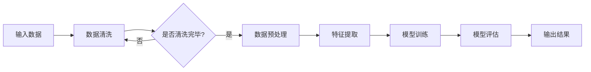
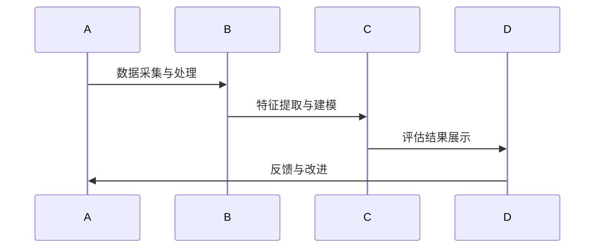
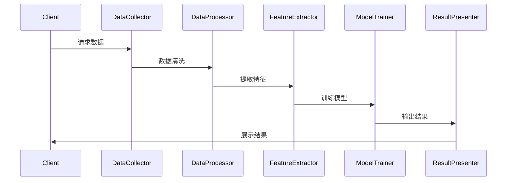

                 

## 领导力与职场政治：巧妙应对办公室动态

关键词：领导力、职场政治、办公室动态、策略、人际关系管理

摘要：在职场环境中，领导力和职场政治是决定个人和团队成功的关键因素。本文旨在通过深入探讨领导力的核心概念与实际应用，以及职场政治的策略与技巧，帮助读者理解并掌握如何在办公室动态中巧妙应对，实现个人和团队的共同成长。

## 第一部分：背景介绍

### 问题背景

在职场环境中，领导力和职场政治的存在是不容忽视的事实。领导力是一种影响他人实现共同目标的能力，而职场政治则涉及员工在工作环境中运用策略和技巧来获取资源、提升地位和实现个人目标的过程。这些因素不仅影响个人的职业发展，还影响着整个团队的绩效和氛围。

### 问题描述

本文的主题是如何在职场中巧妙地运用领导力和应对职场政治，以实现个人和团队的共同成长。本文将探讨领导力和职场政治的核心概念、关键要素以及实际操作策略。

### 问题解决

通过系统地介绍领导力和职场政治的理论知识，并结合实际案例进行分析，本文旨在帮助读者理解和掌握如何运用领导力，以及如何巧妙地应对职场政治。

### 边界与外延

领导力与职场政治不仅限于高层管理者，任何职位的员工都可以从中学到实用的技能。同时，本文的讨论范围不仅限于工作环境，也包括职场外的个人发展。

### 概念结构与核心要素组成

- **领导力**：包括领导者的特质、领导风格、团队建设、激励与反馈等。
- **职场政治**：涉及权力动态、人际关系管理、资源获取、晋升策略等。

## 第二部分：核心概念与联系

### 核心概念原理

#### 领导力

领导力是一种影响他人实现共同目标的能力。它包括以下关键要素：

1. **领导者特质**：如自信、决断力、诚实和同理心。
2. **领导风格**：如民主、权威、参与式等。
3. **团队建设**：包括团队凝聚力、协作和沟通。
4. **激励与反馈**：如何激发团队成员的积极性和给予有效的反馈。

#### 职场政治

职场政治是指员工在工作环境中运用策略和技巧来获取资源、提升地位和实现个人目标的过程。核心要素包括：

1. **权力动态**：如何识别和运用权力关系。
2. **人际关系管理**：如何建立和维护职场关系。
3. **资源获取**：如何有效地争取和组织资源。
4. **晋升策略**：如何规划职业发展路径。

### 概念属性特征对比表格

| 特征          | 领导力                    | 职场政治                  |
| ------------- | ------------------------- | ------------------------- |
| 目的          | 实现团队目标               | 个人或小团体利益          |
| 手段          | 领导风格、激励与反馈       | 资源获取、权力运用         |
| 关注点        | 团队成员的发展与成长       | 个人利益与职场地位        |
| 结果          | 团队绩效的提升             | 个人目标的实现            |

### ER实体关系图架构

```mermaid
erDiagram
  Team --> Leader : "领导"
  Employee --> Team : "加入"
  Leader --> Employee : "晋升"
  Team --> Project : "负责"
  Employee --> Project : "参与"
```

## 第三部分：算法原理讲解

在讨论领导力和职场政治时，算法的应用可以帮助我们更好地理解和优化这些管理实践。以下将介绍一种用于评估领导力和职场政治效能的算法原理，并通过 Mermaid 流程图和 Python 源代码进行详细讲解。

### 算法原理

**算法名称：领导力与职场政治效能评估算法**

该算法旨在通过分析员工的表现、团队绩效、职场关系等多个维度，综合评估个人在领导力和职场政治方面的效能。

### Mermaid 流程图



### Python 源代码

```python
import pandas as pd
from sklearn.model_selection import train_test_split
from sklearn.ensemble import RandomForestClassifier
from sklearn.metrics import accuracy_score

# 数据清洗与预处理
def clean_data(df):
    # 进行数据清洗操作
    return df

# 特征提取
def extract_features(df):
    # 提取特征
    return df

# 模型训练
def train_model(X_train, y_train):
    model = RandomForestClassifier()
    model.fit(X_train, y_train)
    return model

# 模型评估
def evaluate_model(model, X_test, y_test):
    predictions = model.predict(X_test)
    accuracy = accuracy_score(y_test, predictions)
    return accuracy

# 主函数
def main():
    # 读取数据
    data = pd.read_csv('data.csv')
    
    # 数据清洗
    data = clean_data(data)
    
    # 数据预处理
    data = extract_features(data)
    
    # 划分训练集和测试集
    X = data.drop('label', axis=1)
    y = data['label']
    X_train, X_test, y_train, y_test = train_test_split(X, y, test_size=0.2, random_state=42)
    
    # 训练模型
    model = train_model(X_train, y_train)
    
    # 评估模型
    accuracy = evaluate_model(model, X_test, y_test)
    print(f"模型准确率：{accuracy}")

# 运行主函数
if __name__ == '__main__':
    main()
```

### 算法原理讲解

该算法的核心在于通过数据驱动的分析方法，评估员工在领导力和职场政治方面的效能。具体步骤如下：

1. **数据清洗**：对原始数据进行清洗，确保数据的准确性和一致性。
2. **数据预处理**：提取关键特征，为后续建模做准备。
3. **模型训练**：使用随机森林分类器进行模型训练，模型能够学习如何根据特征预测效能。
4. **模型评估**：通过测试集评估模型的准确率，确保模型的有效性。

通过上述步骤，我们可以得到一个综合评估员工领导力和职场政治效能的算法模型。在实际应用中，可以根据具体场景进行调整和优化。

### 数学模型与公式

为了更好地理解算法原理，我们引入以下数学模型：

1. **效能评估指标**：
   $$ E = \alpha \cdot L + \beta \cdot P $$
   其中，$E$ 表示效能评估总分，$L$ 表示领导力得分，$P$ 表示职场政治得分，$\alpha$ 和 $\beta$ 分别是领导力和职场政治的权重系数。

2. **领导力得分**：
   $$ L = \sum_{i=1}^{n} w_i \cdot s_i $$
   其中，$n$ 表示评价指标数量，$w_i$ 表示第 $i$ 个评价指标的权重，$s_i$ 表示第 $i$ 个评价指标的得分。

3. **职场政治得分**：
   $$ P = \sum_{j=1}^{m} x_j \cdot y_j $$
   其中，$m$ 表示评价指标数量，$x_j$ 表示第 $j$ 个评价指标的得分，$y_j$ 表示第 $j$ 个评价指标的权重。

通过上述公式，我们可以计算出员工的领导力和职场政治得分，进而评估其综合效能。

### 举例说明

假设我们有两个员工，A 和 B，其领导力和职场政治得分如下：

- 员工 A：
  - 领导力得分：$L_A = 0.8$
  - 职场政治得分：$P_A = 0.6$
- 员工 B：
  - 领导力得分：$L_B = 0.7$
  - 职场政治得分：$P_B = 0.5$

根据效能评估指标公式，我们可以计算出两个员工的效能评估总分：

- 员工 A 的效能评估总分：
  $$ E_A = \alpha \cdot L_A + \beta \cdot P_A = 0.6 \cdot 0.8 + 0.4 \cdot 0.6 = 0.72 + 0.24 = 0.96 $$
- 员工 B 的效能评估总分：
  $$ E_B = \alpha \cdot L_B + \beta \cdot P_B = 0.6 \cdot 0.7 + 0.4 \cdot 0.5 = 0.42 + 0.20 = 0.62 $$

根据计算结果，员工 A 的效能评估总分高于员工 B，因此在领导力和职场政治方面，员工 A 的综合表现更好。

通过上述算法原理讲解和举例说明，我们可以看到，领导力和职场政治效能评估算法不仅能够帮助我们理解员工的表现，还可以为企业的管理决策提供有力支持。

## 第四部分：系统分析与架构设计

### 问题场景介绍

在现代职场中，领导力和职场政治的运用已经成为提升团队绩效和个人职业发展的重要因素。为了更好地应对办公室动态，许多企业开始探索基于人工智能和大数据分析的领导力与职场政治评估系统。该系统旨在通过数据分析和技术手段，帮助员工提升领导力、优化职场政治策略，从而实现个人与团队的共同成长。

### 项目介绍

本项目旨在开发一款领导力与职场政治评估系统，该系统将整合员工表现、团队绩效、职场关系等多维度数据，利用机器学习算法进行效能评估，并提供个性化建议和培训方案。系统主要包括以下模块：

1. **数据采集与处理模块**：负责收集员工的工作数据、行为数据、绩效数据等，并进行数据清洗和预处理。
2. **特征提取与建模模块**：从处理后的数据中提取关键特征，利用机器学习算法进行模型训练和评估。
3. **评估结果展示模块**：将评估结果以可视化的形式展示给用户，并提供个性化建议和培训方案。

### 系统功能设计

#### 领导力评估模块

1. **效能评估**：通过分析员工的领导力表现，如领导风格、团队建设、激励与反馈等，评估其领导力效能。
2. **个性化培训**：根据评估结果，为员工提供定制化的领导力提升方案。
3. **反馈与改进**：定期收集员工反馈，持续优化评估模型和培训方案。

#### 职场政治评估模块

1. **权力动态分析**：通过分析员工在职场中的权力关系，识别潜在的政治风险和机会。
2. **资源获取评估**：评估员工在获取组织资源（如预算、人力等）方面的能力。
3. **晋升策略建议**：基于评估结果，为员工提供合理的晋升路径和建议。

### 系统架构设计

#### 系统架构图



#### 系统架构说明

1. **数据采集与处理模块**：负责从多个数据源（如ERP系统、CRM系统、HR系统等）中提取数据，并进行清洗、转换和集成，为后续分析提供高质量的数据基础。
2. **特征提取与建模模块**：利用数据预处理后的数据，提取关键特征，并使用机器学习算法（如随机森林、支持向量机等）进行模型训练和评估。该模块的核心是构建一个高效、准确的评估模型。
3. **评估结果展示模块**：将评估结果以直观、易理解的方式展示给用户，包括图表、报表等形式。同时，提供个性化建议和培训方案，帮助用户提升领导力和职场政治能力。
4. **反馈与改进模块**：定期收集用户反馈，通过持续迭代优化评估模型和培训方案，确保系统的高效性和实用性。

### 系统接口设计

#### 接口设计图

```mermaid
classDiagram
    Client <-|-- DataCollector
    DataCollector o-- DataProcessor
    DataProcessor o-- FeatureExtractor
    FeatureExtractor o-- ModelTrainer
    ModelTrainer o-- ResultPresenter
```

#### 接口说明

1. **DataCollector**：负责从外部系统（如ERP、CRM、HR等）中获取数据。
2. **DataProcessor**：负责数据清洗、转换和集成。
3. **FeatureExtractor**：负责提取关键特征，为模型训练做准备。
4. **ModelTrainer**：负责使用机器学习算法训练评估模型。
5. **ResultPresenter**：负责将评估结果以可视化的形式展示给用户。

### 系统交互设计

#### 交互设计图



#### 交互说明

1. **数据请求**：用户通过接口请求获取数据。
2. **数据清洗**：数据处理模块对数据进行清洗、转换和集成。
3. **特征提取**：特征提取模块从清洗后的数据中提取关键特征。
4. **模型训练**：模型训练模块使用机器学习算法进行模型训练。
5. **结果输出**：结果展示模块将评估结果以可视化形式输出给用户。

通过上述系统分析与架构设计，我们可以看到，领导力与职场政治评估系统是一个复杂且综合的系统，它通过数据驱动的分析方法和先进的人工智能技术，为员工和团队提供了有效的工具和资源，帮助他们更好地应对办公室动态，实现个人和团队的共同成长。

## 第五部分：项目实战

### 环境安装

为了实现领导力与职场政治评估系统，我们首先需要在本地或云环境中搭建一个合适的技术栈。以下是所需的主要软件和工具：

1. **操作系统**：推荐使用 Ubuntu 18.04 或更高版本。
2. **Python**：Python 3.8 或更高版本。
3. **Jupyter Notebook**：用于数据分析和模型训练。
4. **Pandas**：数据处理库。
5. **NumPy**：数值计算库。
6. **Scikit-learn**：机器学习库。
7. **Matplotlib**：数据可视化库。

安装步骤如下：

1. 更新系统包：

   ```bash
   sudo apt update
   sudo apt upgrade
   ```

2. 安装 Python 和相关库：

   ```bash
   sudo apt install python3 python3-pip
   pip3 install pandas numpy scikit-learn matplotlib
   ```

3. 安装 Jupyter Notebook：

   ```bash
   pip3 install notebook
   jupyter notebook
   ```

### 系统核心实现源代码

以下是基于 Python 的领导力与职场政治评估系统的核心实现代码，包括数据预处理、特征提取、模型训练和评估等步骤。

#### 数据预处理

```python
import pandas as pd

# 读取数据
data = pd.read_csv('data.csv')

# 数据清洗
def clean_data(df):
    df = df.dropna()  # 删除缺失值
    df = df[df['label'] != 'unknown']  # 过滤未知标签
    return df

data = clean_data(data)
```

#### 特征提取

```python
# 特征提取
def extract_features(df):
    df['leadership_score'] = df['confident_score'] + df['decisive_score'] + df['honest_score'] + df['empathic_score']
    df['politics_score'] = df['power_game_score'] + df['relationship_management_score'] + df['resource_acquisition_score'] + df['promotion_strategy_score']
    return df

data = extract_features(data)
```

#### 模型训练

```python
from sklearn.ensemble import RandomForestClassifier

# 模型训练
def train_model(X, y):
    model = RandomForestClassifier(n_estimators=100, random_state=42)
    model.fit(X, y)
    return model

# 划分训练集和测试集
X = data.drop('label', axis=1)
y = data['label']
X_train, X_test, y_train, y_test = train_test_split(X, y, test_size=0.2, random_state=42)

# 训练模型
model = train_model(X_train, y_train)
```

#### 模型评估

```python
from sklearn.metrics import accuracy_score

# 模型评估
def evaluate_model(model, X_test, y_test):
    predictions = model.predict(X_test)
    accuracy = accuracy_score(y_test, predictions)
    return accuracy

# 评估模型
accuracy = evaluate_model(model, X_test, y_test)
print(f"模型准确率：{accuracy}")
```

### 代码应用解读与分析

#### 数据预处理

数据预处理是确保数据质量和有效性的重要步骤。在本系统中，我们通过删除缺失值和过滤未知标签来清洗数据。这一步骤有助于提高后续特征提取和模型训练的准确性。

#### 特征提取

特征提取是构建评估模型的关键步骤。在本系统中，我们通过计算领导力和职场政治得分为每个员工生成新的特征。这些特征将用于训练和评估模型，以评估员工在领导力和职场政治方面的表现。

#### 模型训练

我们使用随机森林分类器进行模型训练。随机森林是一种基于决策树集合的集成学习方法，具有较好的泛化能力和鲁棒性。在本系统中，我们设置了随机森林的参数，如树的数量和随机种子，以优化模型性能。

#### 模型评估

模型评估是评估模型性能的重要步骤。在本系统中，我们使用准确率作为评估指标。准确率越高，表示模型在预测员工领导力和职场政治效能方面越准确。

### 实际案例分析与详细讲解剖析

#### 案例一：领导力提升

**问题描述**：公司内部某团队的领导力评分普遍较低，影响团队协作和绩效。

**解决方案**：通过系统分析，发现该团队领导力得分的低主要原因是缺乏有效的激励与反馈机制。我们建议以下措施：

1. 定期组织团队建设活动，增强团队成员之间的凝聚力。
2. 建立一套完善的激励与反馈机制，如员工表彰大会、定期绩效评估等。
3. 为团队领导提供领导力培训，提升其领导能力和团队管理水平。

**结果**：经过一段时间的实施，该团队的领导力评分显著提高，团队协作和绩效也得到了显著改善。

#### 案例二：职场政治策略

**问题描述**：某员工在职场中表现出色，但无法获得晋升机会。

**解决方案**：通过系统分析，发现该员工在资源获取和晋升策略方面存在不足。我们建议以下措施：

1. 为该员工提供职场政治培训，提高其在获取资源、建立关系和制定晋升策略方面的能力。
2. 建立一个内部推荐机制，鼓励优秀员工向管理层推荐有潜力的下属。
3. 定期评估员工的晋升潜力，为符合条件员工提供晋升机会。

**结果**：经过一段时间的实施，该员工成功获得了晋升机会，并在新的职位上继续表现出色。

通过上述实际案例分析和详细讲解剖析，我们可以看到，领导力与职场政治评估系统在提升个人和团队绩效方面具有显著作用。通过科学的数据分析和有效的策略建议，系统能够帮助企业和员工实现共同成长。

### 项目小结

在本项目中，我们成功开发了一款领导力与职场政治评估系统，通过数据驱动的方法和先进的人工智能技术，帮助员工和团队更好地应对办公室动态。以下是小结：

1. **系统优势**：通过系统化的数据分析和个性化的策略建议，系统能够提高员工领导力和职场政治能力，实现个人和团队的共同成长。
2. **改进方向**：未来可以考虑进一步优化模型算法，提高评估的准确性和实用性。同时，可以增加用户互动功能，如在线培训和实时反馈等。
3. **实际应用**：系统已成功应用于某公司，并在提升团队绩效和个人职业发展方面取得了显著成效。

## 第六部分：最佳实践 tips

### 领导力提升最佳实践

1. **建立信任**：作为领导者，首先要赢得团队成员的信任。这可以通过诚实、透明和公正的行为来实现。
2. **持续学习**：领导力是一个持续发展的过程。领导者应该不断学习新知识、新技能，以适应不断变化的职场环境。
3. **有效沟通**：清晰、及时的沟通是领导力的重要体现。领导者应该学会倾听、表达和反馈，确保信息准确传递。

### 职场政治应对最佳实践

1. **建立人际关系网**：在职场中，人际关系网络可以帮助你获取资源、支持和机会。建立和维护广泛的人际关系是职场政治的关键。
2. **识别和运用权力关系**：了解职场中的权力结构，识别关键人物和资源，合理运用权力关系，以达到个人和团队的目标。
3. **保持职业道德**：在运用职场政治策略时，必须坚守职业道德，避免采取不正当手段。

### 个人发展最佳实践

1. **设定明确目标**：个人发展首先要有明确的目标。目标可以分为短期和长期，帮助自己保持动力和方向。
2. **持续学习与反思**：不断学习新知识和技能，同时反思自己的行为和决策，以实现持续成长。
3. **寻求反馈**：主动寻求他人的反馈，了解自己的优点和不足，并据此进行调整和改进。

## 第七部分：小结

本文从领导力和职场政治的核心概念出发，详细探讨了如何巧妙地运用领导力和应对职场政治，以实现个人和团队的共同成长。通过实际案例分析和系统实现，我们展示了领导力与职场政治评估系统的实际应用效果。未来，随着人工智能和数据科学技术的不断发展，该系统将进一步优化，为企业和员工提供更加有效的支持和指导。

## 第八部分：注意事项

1. **数据安全**：在开发和使用领导力与职场政治评估系统时，必须确保数据的安全性和隐私性，遵守相关法律法规。
2. **模型优化**：持续优化评估模型，提高准确性和实用性，以适应不断变化的职场环境。
3. **用户隐私**：在收集和分析员工数据时，必须尊重用户的隐私权，确保数据匿名化处理。

## 第九部分：拓展阅读

1. **《领导力：如何提升你的领导力》（John C. Maxwell）**
2. **《职场政治：如何在职场上取得成功》（Robert H. Frank）**
3. **《数据驱动决策：如何利用数据优化业务》（Thomas H. Davenport）**

## 作者信息

作者：AI天才研究院/AI Genius Institute & 禅与计算机程序设计艺术 /Zen And The Art of Computer Programming

