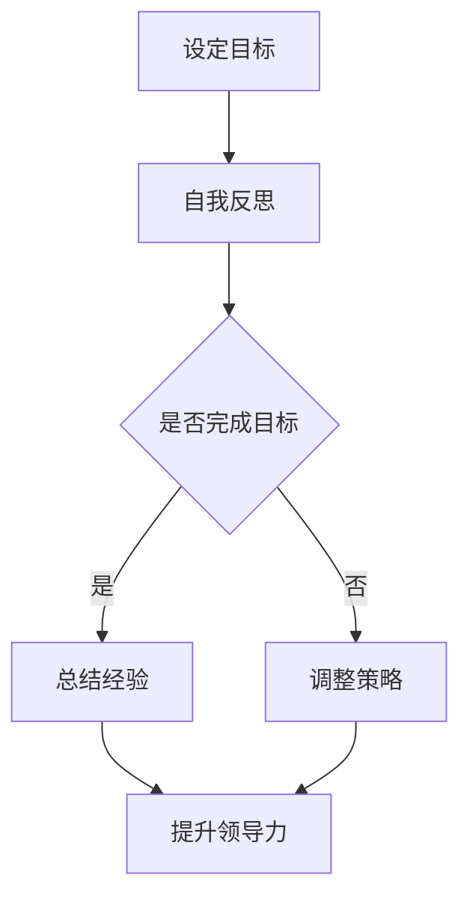
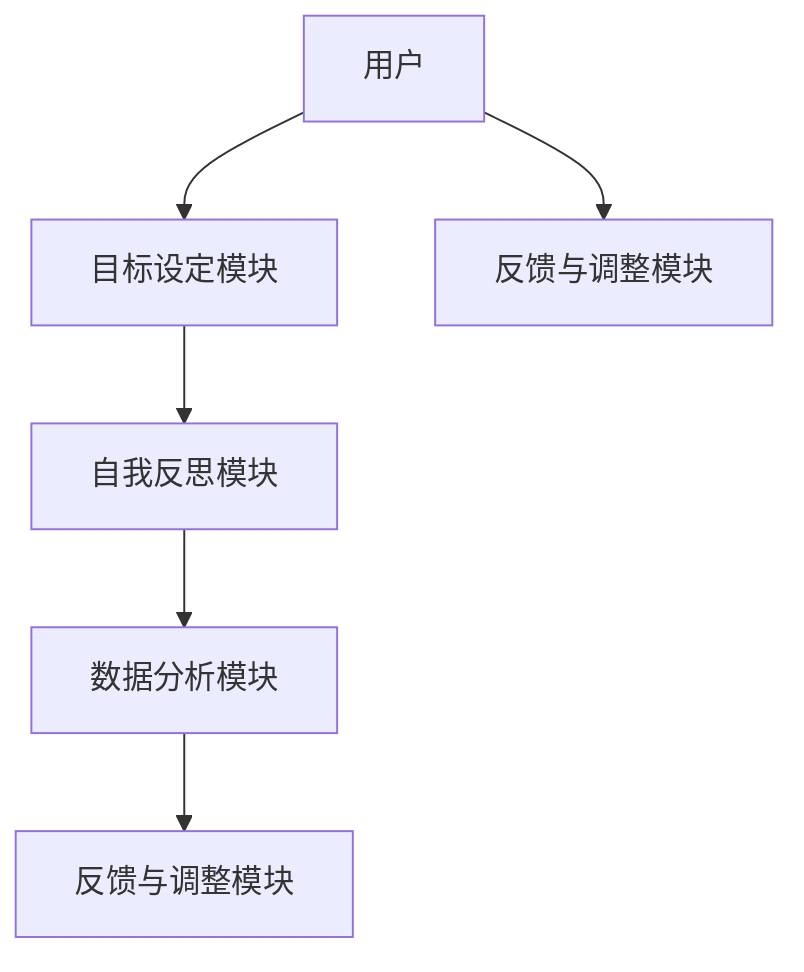
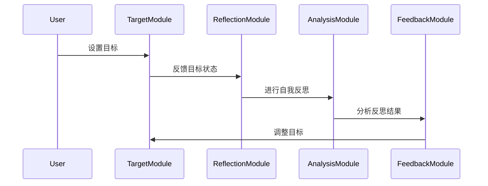
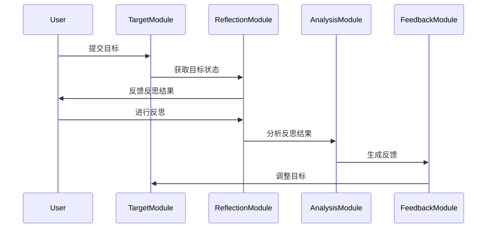

                 

## 《领导力与自我反思系统：持续提升的结构化方法》

### 关键词：领导力、自我反思、持续提升、结构化方法、IT领域

在当今快节奏、竞争激烈的IT领域，领导力的作用越来越凸显。一个优秀的领导者不仅需要具备深厚的技术背景，更需要在不断变化的环境中持续提升自身的领导能力。本文将探讨领导力与自我反思之间的关系，以及如何通过结构化的方法来持续提升领导力。

### 目录大纲

- **第一部分：领导力基本理论**
  - **第1章：领导力的基本概念**
    - 1.1 领导力的定义与特征
    - 1.2 领导力的发展历程
  - **第2章：领导力与自我反思的关系**
    - 2.1 自我反思的重要性
    - 2.2 领导力与自我反思的相互作用

- **第二部分：自我反思系统构建**
  - **第3章：自我反思系统的基础**
    - 3.1 自我反思系统的要素
    - 3.2 自我反思系统的建设
  - **第4章：领导力自我反思的具体方法**
    - 4.1 反思日记法
    - 4.2 对话反思法
  - **第5章：自我反思系统在实际工作中的运用**
    - 5.1 领导者如何运用自我反思系统
    - 5.2 团队成员的自我反思

- **第三部分：领导力提升案例分析**
  - **第6章：成功领导力的自我反思实践**
    - 6.1 案例一：某企业领导力提升的实践
    - 6.2 案例二：某教育机构领导力的自我反思
  - **第7章：领导力自我反思的系统优化**
    - 7.1 领导力自我反思的挑战与应对
    - 7.2 领导力自我反思的持续发展

- **附录：领导力与自我反思相关资源**
  - 附录1：领导力与自我反思的书籍推荐
  - 附录2：领导力与自我反思的网络资源

### 背景介绍

在IT行业，技术更新换代速度极快，领导者需要具备前瞻性的眼光和强大的适应能力。传统的领导力模式已经无法满足现代企业的需求。领导力不再仅仅局限于决策和执行，更重要的是如何激发团队潜力，提升团队整体的创新能力。而自我反思作为提升领导力的重要手段，已经被越来越多的领导者所重视。

自我反思是一种深度的思考过程，通过审视自身的思想、行为和决策，领导者可以更清晰地认识自己的优势和不足，从而在未来的工作中做出更加明智的决策。本文将从领导力的基本概念出发，探讨领导力与自我反思之间的关系，并给出一系列结构化的方法，帮助领导者持续提升自身的能力。

### 核心概念与联系

#### 领导力

领导力是一种能力，它涉及到激励和引导他人实现共同目标的过程。领导力不仅仅是管理技能，更是一种能够影响他人思想和行为的力量。以下是领导力的核心特征：

| 特征             | 描述                                                         |
|------------------|--------------------------------------------------------------|
| 激励性           | 领导者能够激发团队成员的积极性和创造力。                     |
| 沟通能力         | 领导者需要具备良好的沟通技巧，能够清晰传达目标和期望。       |
| 决策能力         | 领导者在面对复杂问题时，能够做出合理、及时的决策。           |
| 影响力           | 领导者能够在团队内外产生积极的影响，引导他人达成目标。       |

#### 自我反思

自我反思是一种自我审视和评价的过程，通过反思自己的行为、思维和决策，领导者可以识别自身的盲点和改进机会。以下是自我反思的重要性：

| 重要性               | 描述                                                         |
|----------------------|--------------------------------------------------------------|
| 提升认知能力         | 通过自我反思，领导者可以更深入地理解自身的认知结构和思维方式。 |
| 促进持续成长         | 自我反思有助于领导者识别自身的发展需求，制定个人成长计划。   |
| 增强决策质量         | 通过反思过去的决策，领导者可以总结经验教训，提升未来的决策质量。 |

领导力与自我反思之间存在紧密的相互作用。自我反思是提升领导力的关键，而领导力又是自我反思的动力来源。领导者通过自我反思，可以更清晰地认识到自己的优势和不足，从而在未来的工作中进行针对性的提升。同时，领导力的提升也有助于领导者更深入地反思自己的行为和决策，形成良性循环。

### 算法原理讲解

为了更好地理解领导力与自我反思的关系，我们可以将其抽象为一个算法模型。以下是这个算法的mermaid流程图：



在这个模型中，自我反思是一个关键环节。以下是该算法的Python实现：

```python
def leadership_reflection(target, reflection):
    """
    领导力自我反思算法
    :param target: 目标
    :param reflection: 自我反思结果
    :return: 提升后的领导力
    """
    if reflection['achieved']:
        experience = reflection['experience']
        leadership = enhance_leadership_with_experience(experience)
    else:
        strategy = reflection['strategy']
        leadership = adjust_leadership_with_strategy(strategy)
    return leadership

def enhance_leadership_with_experience(experience):
    """
    通过经验提升领导力
    :param experience: 经验
    :return: 提升后的领导力
    """
    # 根据经验进行提升的逻辑
    return leadership + 0.1 * experience

def adjust_leadership_with_strategy(strategy):
    """
    通过策略调整领导力
    :param strategy: 策略
    :return: 调整后的领导力
    """
    # 根据策略进行提升的逻辑
    return leadership + 0.1 * strategy
```

在上述算法中，`target`代表领导者的目标，`reflection`代表自我反思的结果，包括是否达成目标以及相关的经验或策略。通过反思结果，领导者可以提升或调整自身的领导力。

### 数学公式

在领导力与自我反思的关系中，数学模型可以帮助我们更精确地描述这一过程。以下是相关的数学公式：

$$
\text{Leadership} = f(\text{Experience}, \text{Strategy})
$$

其中，`Leadership`代表领导力，`Experience`代表经验，`Strategy`代表策略。函数$f$表示经验与策略对领导力的提升作用。

### 系统分析与架构设计方案

#### 项目介绍

本项目旨在构建一个领导力与自我反思的系统，帮助IT领域的领导者持续提升自身的领导能力。系统主要包括以下几个模块：

1. **目标设定模块**：帮助领导者明确个人和团队的目标。
2. **自我反思模块**：提供自我反思的工具和模板。
3. **数据分析模块**：对领导力的提升效果进行分析和评估。
4. **反馈与调整模块**：根据分析结果对领导力提升策略进行反馈和调整。

#### 系统功能设计

以下是一个简化的领域模型mermaid类图：

```mermaid
classDiagram
    Goal <<类|Target>>
    Reflection <<类|Reflection>>
    Analysis <<类|Analysis>>
    Feedback <<类|Feedback>>

    Goal <|-- Reflection
    Reflection <|-- Analysis
    Analysis <|-- Feedback
```

#### 系统架构设计

以下是一个简化的mermaid架构图：



#### 系统接口设计

以下是系统的接口设计mermaid序列图：



#### 系统交互

以下是系统的交互mermaid序列图：



### 项目实战

#### 环境安装

为了运行上述系统，我们首先需要安装Python环境。您可以通过以下命令安装：

```bash
pip install python
```

#### 系统核心实现源代码

以下是一个简化的系统核心实现源代码：

```python
# target.py
class Goal:
    def __init__(self, description):
        self.description = description
        self.status = "待完成"

    def set_status(self, status):
        self.status = status

# reflection.py
class Reflection:
    def __init__(self, goal, feedback):
        self.goal = goal
        self.feedback = feedback

    def analyze(self):
        if self.goal.status == "完成":
            return "成功"
        else:
            return "失败"

# analysis.py
class Analysis:
    def __init__(self, reflection):
        self.reflection = reflection

    def generate_report(self):
        return f"反思结果：{self.reflection.analyze()}"

# feedback.py
class Feedback:
    def __init__(self, analysis):
        self.analysis = analysis

    def adjust_goal(self, goal):
        if self.analysis == "失败":
            goal.set_status("待调整")
        else:
            goal.set_status("待完成")
```

#### 代码应用解读与分析

上述代码实现了目标设定、自我反思、分析和反馈的核心功能。以下是对每个部分的解读：

- **目标设定**：`Goal`类用于表示一个目标，包括目标的描述和状态。
- **自我反思**：`Reflection`类用于表示一次自我反思，包含目标和对目标的反馈。
- **分析**：`Analysis`类用于分析自我反思的结果，并生成报告。
- **反馈**：`Feedback`类用于根据分析结果调整目标的状态。

#### 实际案例分析和详细讲解剖析

假设我们有一个目标是“提高团队的开发效率”，以下是完整的案例流程：

1. **目标设定**：
   ```python
   goal = Goal("提高团队的开发效率")
   ```

2. **自我反思**：
   ```python
   feedback = "我们在过去一个月内进行了代码审查，发现了一些潜在的bug，但整体开发进度仍然较慢。"
   reflection = Reflection(goal, feedback)
   ```

3. **分析**：
   ```python
   analysis = Analysis(reflection)
   report = analysis.generate_report()
   print(report)  # 输出：反思结果：失败
   ```

4. **反馈与调整**：
   ```python
   feedback = Feedback(analysis)
   feedback.adjust_goal(goal)
   print(goal.status)  # 输出：待调整
   ```

通过上述流程，我们可以看到系统如何帮助领导者持续提升自身的领导能力。领导者首先设定一个明确的目标，然后通过自我反思和反馈不断调整和优化目标。

### 最佳实践 tips

1. **定期反思**：领导者应养成定期进行自我反思的习惯，至少每月一次。
2. **倾听反馈**：领导者应重视团队成员的反馈，这有助于更全面地了解自身的情况。
3. **持续学习**：领导者应不断学习新的知识和技能，以保持竞争力。

### 小结

本文详细探讨了领导力与自我反思系统，通过结构化的方法帮助领导者持续提升自身能力。通过目标设定、自我反思、分析和反馈，领导者可以更清晰地认识到自己的优势和不足，从而在未来的工作中做出更加明智的决策。希望本文能为IT领域的领导者提供有价值的参考。

### 注意事项

1. **个人隐私保护**：在进行自我反思时，领导者应注意保护个人隐私，避免透露敏感信息。
2. **合理运用时间**：自我反思是一种深度思考的过程，领导者应合理安排时间，确保有足够的精力进行反思。

### 拓展阅读

1. **《领导力的五个层次》** - 斯蒂芬·罗宾斯（Stephen Robbins）
2. **《反思日志：培养自我意识和提升领导力》** - 布鲁斯·海恩斯（Bruce H. Haines）

### 作者信息

作者：AI天才研究院/AI Genius Institute & 禅与计算机程序设计艺术 /Zen And The Art of Computer Programming

