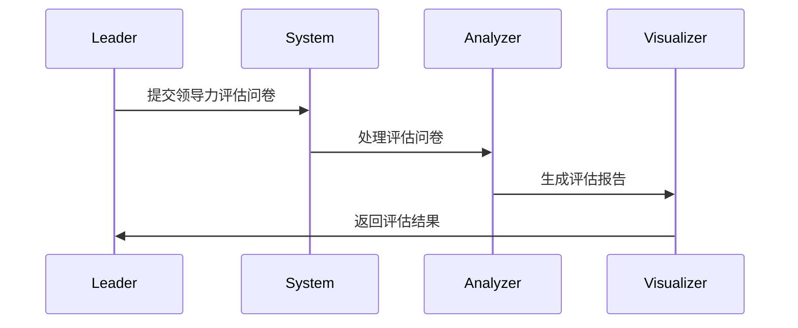
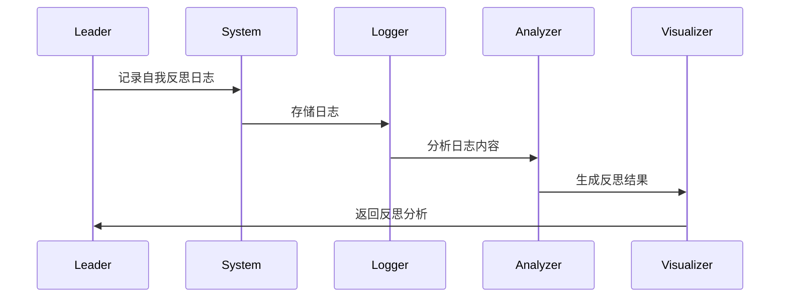
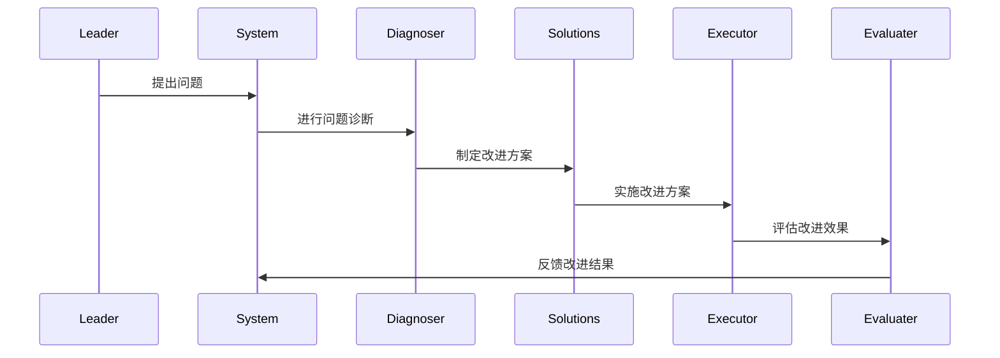

                 


### 第一部分: 引言与背景

#### 1.1 问题背景

领导力的重要性在商业和社会环境中被广泛认可。领导力不仅仅涉及决策制定和资源分配，还包括激励团队、培养人才、引领变革和应对挑战等多方面内容。领导力对于组织的发展和成功起着至关重要的作用。

自我反思是指个人对自己行为、思想、情感和信念的审视和分析。通过自我反思，领导者可以更清晰地认识到自身的优势和不足，从而进行改进和提升。自我反思对于领导者的个人成长和领导效能具有重要意义。

持续改进是一种不断追求卓越的过程，旨在通过不断学习、反思和优化，提高组织的效率和效能。在快速变化的市场环境中，持续改进成为组织保持竞争力的关键策略之一。

在现代组织中，领导力、自我反思和持续改进三者相互作用，共同推动组织的发展。领导力为自我反思提供方向，自我反思为持续改进提供基础，而持续改进则为领导力和自我反思注入活力。

#### 1.2 问题描述

当前，许多组织在领导力、自我反思和持续改进方面面临着一系列挑战。首先，领导力面临的挑战包括如何更好地激励和引导团队，如何处理复杂的人际关系，以及如何在变化的环境中做出明智的决策等。

其次，自我反思的障碍主要来自于领导者的心理防御机制，如自我肯定和自我欺骗。这些防御机制往往使领导者难以客观地评价自己的行为和表现，从而影响自我反思的效果。

最后，持续改进的困境在于如何确保改进措施的有效实施，以及如何持续激发员工的创新意识和主动性。

#### 1.3 问题解决

为了解决上述问题，我们需要采取综合性的方法，结合领导力、自我反思和持续改进的原则。具体而言，可以从以下几个方面着手：

1. **建立学习型组织文化**：通过鼓励员工持续学习和反思，培养一种积极向上的组织氛围。
2. **提供领导力培训**：通过系统性的领导力培训，提高领导者的综合素质和领导能力。
3. **建立反馈机制**：通过定期收集和反馈员工的意见和反馈，促进自我反思和持续改进。
4. **倡导团队合作**：通过鼓励团队合作，实现知识和经验的共享，提高组织的整体效能。

#### 1.4 边界与外延

领导力、自我反思和持续改进虽然各具特点，但它们之间存在着紧密的联系。首先，领导力为自我反思提供了目标和方向，而自我反思则为领导力提供了反馈和改进的依据。其次，持续改进是领导力和自我反思的延伸，它通过不断学习和优化，推动组织向更高的目标迈进。

在实际应用中，领导力、自我反思和持续改进可以应用于各个领域，如企业管理、项目管理、人力资源管理等。同时，这些概念还可以与人工智能、大数据等新兴技术相结合，为组织的发展注入新的动力。

#### 1.5 概念结构与核心要素组成

1. **领导力的核心要素**：愿景、决策能力、沟通能力、激励能力和团队管理能力。
2. **自我反思的核心要素**：自我意识、自我评估、自我调整和自我成长。
3. **持续改进的核心要素**：学习、反馈、优化和创新。

#### 1.6 本章小结

本节介绍了领导力、自我反思和持续改进的重要性，并分析了它们在现代组织中的角色和相互关系。通过综合领导力、自我反思和持续改进的方法，组织可以更好地应对挑战，实现持续发展。

### 第一部分小结

领导力、自我反思和持续改进是现代组织发展中不可或缺的重要元素。领导力为组织提供方向和动力，自我反思帮助领导者认清自身优势与不足，持续改进则确保组织在不断变化的环境中保持竞争力。通过综合运用这些方法，组织可以更好地实现其战略目标，为员工的成长和发展创造良好的环境。在接下来的部分中，我们将进一步深入探讨这些核心概念的原理和具体实践方法。

### 第一部分总结

在本文的第一部分，我们介绍了领导力、自我反思和持续改进在现代组织中的重要性。通过综合分析这三个核心概念，我们明确了它们在组织发展中的角色和相互关系。具体来说，领导力为组织提供方向和动力，自我反思帮助领导者认清自身优势与不足，持续改进则确保组织在不断变化的环境中保持竞争力。

我们还讨论了当前许多组织在领导力、自我反思和持续改进方面面临的挑战，并提出了综合性的解决方案。这些解决方案包括建立学习型组织文化、提供领导力培训、建立反馈机制和倡导团队合作等。

在接下来的部分中，我们将进一步深入探讨这些核心概念的理论基础和实践方法，以期为读者提供更加全面和深入的洞察。通过这些内容，我们希望能够帮助读者更好地理解并运用领导力、自我反思和持续改进，为组织的发展创造更大的价值。

### 第一部分：引言与背景

在当今快速变化和竞争激烈的市场环境中，领导力、自我反思和持续改进已成为现代组织取得成功的关键因素。这三个概念不仅相互关联，而且在实际应用中共同推动着组织的进步和发展。

#### 1.1 问题背景

**领导力的重要性**：领导力是一个组织中至关重要的因素。它不仅影响着组织的战略方向和运营效率，还决定着员工的工作热情和团队凝聚力。有效的领导力能够激发员工的潜力，促进创新和团队合作，从而实现组织的长远发展。

**自我反思的定义与作用**：自我反思是指领导者对自己行为、决策和结果的深入思考和分析。通过自我反思，领导者能够识别自身的优势和不足，发现存在的问题和改进的机会，从而提高个人和团队的效能。

**持续改进在现代组织中的角色**：持续改进是一种持续追求卓越的过程。它通过不断学习、反馈和优化，帮助组织在竞争激烈的环境中保持竞争力。持续改进不仅关注现有问题的解决，还关注未来潜在问题的预防，从而实现组织的长期发展。

#### 1.2 问题描述

**领导力面临的挑战**：在快速变化的市场环境中，领导者需要具备适应变化的能力，能够应对复杂的问题和挑战。然而，许多领导者可能缺乏必要的技能和经验，难以在变化的环境中做出明智的决策。

**自我反思的障碍**：自我反思是一个深入自我分析的过程，但许多领导者可能因为心理防御机制而难以客观地进行自我反思。例如，自我肯定和自我欺骗可能导致领导者难以承认自己的错误和不足。

**持续改进的困境**：尽管许多组织认识到持续改进的重要性，但实际操作中往往面临困境。如何确保改进措施的有效实施，如何持续激发员工的创新意识和主动性，都是需要解决的问题。

#### 1.3 问题解决

**综合领导力与自我反思的方法**：领导者可以通过不断学习和实践，提高自己的领导能力。同时，领导者应该培养自我反思的习惯，定期评估自己的行为和决策，识别改进的机会。

**持续改进的重要性**：持续改进不仅是一种管理策略，更是一种组织文化。领导者应该倡导持续改进的理念，鼓励员工提出改进建议，并确保改进措施得到有效实施。

**综合领导力、自我反思和持续改进的策略**：建立学习型组织文化，提供领导力培训，建立反馈机制，倡导团队合作，这些都是实现领导力、自我反思和持续改进的有效策略。

#### 1.4 边界与外延

**领导力与自我反思的相关概念**：领导力不仅仅是一种技术或技能，更是一种态度和行为方式。自我反思是领导力的重要组成部分，它帮助领导者不断提高自己的领导能力。

**持续改进的范围与应用**：持续改进不仅适用于企业管理，还广泛应用于项目管理和人力资源管理等领域。通过持续改进，组织可以在各个层面上实现优化和提升。

#### 1.5 概念结构与核心要素组成

**领导力的核心要素**：包括愿景、决策能力、沟通能力、激励能力和团队管理能力。

**自我反思的核心要素**：包括自我意识、自我评估、自我调整和自我成长。

**持续改进的核心要素**：包括学习、反馈、优化和创新。

#### 1.6 本章小结

通过本部分的讨论，我们明确了领导力、自我反思和持续改进在组织发展中的重要性。理解这三个概念及其相互关系，有助于领导者更好地应对挑战，实现组织的长期发展。

### 第一部分总结

在本部分中，我们介绍了领导力、自我反思和持续改进在现代组织中的重要性，并分析了它们之间的相互关系。通过综合领导力与自我反思的方法，以及持续改进的重要性，我们提出了一系列策略，以帮助领导者更好地应对挑战，实现组织的长期发展。在接下来的部分中，我们将进一步探讨这些核心概念的理论基础和实践方法，以期为读者提供更加全面和深入的洞察。通过这些内容，我们希望能够帮助读者更好地理解并运用领导力、自我反思和持续改进，为组织的发展创造更大的价值。

### 第二部分：核心概念与联系

在本部分中，我们将深入探讨领导力、自我反思和持续改进这三个核心概念，分析它们的原理、定义及其相互关系。通过了解这些核心概念，我们可以更好地理解它们在组织发展和个人成长中的作用。

#### 2.1 领导力原理

**领导力的定义**：领导力是指引导、激励和影响他人共同实现目标的能力。领导力不仅仅是管理能力，更是一种影响力，它可以通过个人魅力、专业知识、决策能力和沟通能力等体现出来。

**领导力的类型**：领导力可以分为多种类型，如变革型领导力、交易型领导力、民主型领导力等。每种类型的领导力都有其特定的特点和应用场景。

- **变革型领导力**：通过激励和启发员工，推动组织变革和创新。
- **交易型领导力**：通过明确的目标和奖励机制，激励员工为实现组织目标而努力。
- **民主型领导力**：通过参与和协商，促进团队合作和决策。

**领导力的发展理论**：领导力的发展理论包括特质理论、行为理论、情境理论和变革型领导理论等。

- **特质理论**：认为领导力与个人特质相关，如自信、决断力、责任感等。
- **行为理论**：认为领导力是通过行为表现出来的，不同情境下需要不同的领导行为。
- **情境理论**：认为领导力需要根据不同的情境进行调整，没有固定的领导模式。
- **变革型领导理论**：强调领导者的激励和启发作用，通过变革推动组织的进步。

**领导力原理总结**：领导力是一个复杂且多维的概念，它涉及多个方面，包括个人特质、行为表现、情境适应和变革推动等。理解不同类型的领导力和领导力发展理论，有助于领导者更好地发挥其作用。

#### 2.2 自我反思原理

**自我反思的定义**：自我反思是指个体对自己的思维、行为和情感进行深入思考和分析的过程。通过自我反思，个体可以更好地了解自己的优点和不足，从而进行改进和提升。

**自我反思的过程**：自我反思通常包括以下几个步骤：

1. **观察与识别**：个体需要观察自己的行为和思维，识别出需要反思的方面。
2. **反思与思考**：个体对观察到的行为和思维进行反思，思考其背后的原因和影响。
3. **评估与调整**：个体对反思结果进行评估，根据需要调整自己的行为和思维。
4. **应用与提升**：个体将反思得到的启示应用到实际中，不断提升自己的能力和素质。

**自我反思的心理学基础**：自我反思涉及多个心理学概念，如自我意识、自我评估和自我效能等。

- **自我意识**：个体对自己存在和内在感受的认识。
- **自我评估**：个体对自己的能力和表现的评估。
- **自我效能**：个体对自己能够完成任务的信心。

**自我反思原理总结**：自我反思是一种重要的个人成长和发展工具，它帮助个体更好地了解自己，发现问题和改进机会，从而实现个人和职业的进步。

#### 2.3 持续改进原理

**持续改进的定义**：持续改进是指不断追求卓越，通过学习、反馈和优化，不断提高组织和个人绩效的过程。

**持续改进的方法**：持续改进的方法包括以下几个步骤：

1. **识别问题**：通过观察和分析，识别组织或个人存在的问题。
2. **分析原因**：对问题进行根本原因分析，找出问题的根源。
3. **制定改进计划**：根据分析结果，制定具体的改进计划和措施。
4. **实施改进**：执行改进计划，采取实际行动解决问题。
5. **评估效果**：对改进效果进行评估，确保问题得到解决。
6. **持续优化**：根据评估结果，进一步优化改进措施，实现持续提升。

**持续改进的模型**：持续改进通常基于PDCA模型（计划、执行、检查、行动），它为持续改进过程提供了一个系统的框架。

- **计划（Plan）**：制定目标和改进计划。
- **执行（Do）**：实施改进计划。
- **检查（Check）**：评估改进效果。
- **行动（Act）**：根据评估结果进行优化和调整。

**持续改进原理总结**：持续改进是一种持续追求卓越的过程，它通过不断学习、反思和优化，帮助组织和个人在竞争激烈的环境中保持竞争力。

#### 2.4 核心概念属性特征对比表格

为了更好地理解领导力、自我反思和持续改进这三个核心概念，我们可以通过一个属性特征对比表格来展示它们之间的异同。

| 特征         | 领导力          | 自我反思          | 持续改进          |
| ------------ | --------------- | ----------------- | ----------------- |
| **定义**     | 引导、激励他人   | 对自己的深入思考   | 持续追求卓越      |
| **类型**     | 变革型、交易型等 | 深度反思、批判性反思 | PDCA、六西格玛等 |
| **原理**     | 特质理论、情境理论 | 自我意识、自我评估 | 学习、反馈、优化  |
| **目的**     | 实现组织目标     | 个人成长与发展   | 提高绩效与竞争力  |

通过上述表格，我们可以看到领导力、自我反思和持续改进在定义、类型、原理和目的等方面都有明显的区别，但它们在实际应用中又相互关联，共同推动组织和个人发展。

#### 2.5 本章小结

在本部分中，我们深入探讨了领导力、自我反思和持续改进这三个核心概念。通过分析它们的原理、定义和相互关系，我们明确了它们在组织发展和个人成长中的重要作用。理解这些核心概念，有助于领导者更好地发挥其作用，实现组织的长期发展。在下一部分，我们将进一步探讨这些概念在实际应用中的算法原理和数学模型，以期为读者提供更加具体的实践指导。

### 第二部分总结

在本部分中，我们详细探讨了领导力、自我反思和持续改进这三个核心概念，分析了它们的原理、定义及其相互关系。通过理解领导力的多种类型和发展理论，我们认识到领导力不仅仅是管理能力，更是一种影响力。自我反思作为个体成长的重要工具，帮助我们更好地了解自己，发现改进机会。持续改进则通过不断学习、反思和优化，推动组织和个人在竞争激烈的环境中保持竞争力。

通过对比这些核心概念的属性特征，我们明确了它们在实际应用中的异同，以及如何将它们结合起来，以实现组织和个人发展的目标。在接下来的部分中，我们将进一步探讨这些核心概念在算法和数学模型中的应用，提供更加具体的实践指导，帮助读者更好地理解和应用这些概念，为组织的发展注入新的动力。

### 第三部分：算法原理讲解

#### 3.1 领导力算法分析

**3.1.1 领导力评估算法**

领导力评估算法是一种用于量化评估领导者能力的方法。以下是一个简单的领导力评估算法，包括评估指标、流程和具体实现。

**评估指标：**
- **愿景能力（V）：** 对组织未来的规划和目标的清晰程度。
- **决策能力（D）：** 在面对复杂问题时做出明智决策的能力。
- **沟通能力（C）：** 与团队成员有效沟通和传达信息的能力。
- **激励能力（I）：** 激发和保持团队成员积极性的能力。
- **团队管理能力（M）：** 管理团队、分配资源和处理冲突的能力。

**评估公式：**
$$
L = V \cdot w_v + D \cdot w_d + C \cdot w_c + I \cdot w_i + M \cdot w_m
$$
其中，$w_v, w_d, w_c, w_i, w_m$ 分别是各指标的权重。

**算法流程：**
1. **数据收集：** 收集领导者在愿景能力、决策能力、沟通能力、激励能力和团队管理能力方面的具体表现数据。
2. **指标标准化：** 对各指标进行标准化处理，确保不同指标在同一尺度上可比。
3. **权重确定：** 根据组织的具体情况，确定各指标的权重。
4. **计算领导力评分：** 使用公式计算领导力评分。

**Python 源代码：**
```python
def leadership_assessment(vision_score, decision_score, communication_score, inspiration_score, management_score, weights):
    weighted_scores = [
        vision_score * weights['V'],
        decision_score * weights['D'],
        communication_score * weights['C'],
        inspiration_score * weights['I'],
        management_score * weights['M']
    ]
    leadership_score = sum(weighted_scores)
    return leadership_score

# 示例权重
weights = {'V': 0.3, 'D': 0.2, 'C': 0.2, 'I': 0.2, 'M': 0.1}

# 示例评分
vision_score = 8
decision_score = 7
communication_score = 9
inspiration_score = 7
management_score = 6

# 计算领导力评分
leadership_score = leadership_assessment(vision_score, decision_score, communication_score, inspiration_score, management_score, weights)
print(f"领导力评分：{leadership_score}")
```

**算法原理讲解：**
该算法通过收集领导者在各个方面的具体表现，利用权重对各项指标进行加权求和，最终得到一个综合的领导力评分。这种方法能够帮助组织更好地了解领导者的整体表现，为领导力提升提供数据支持。

**举例说明：**
假设某领导者在愿景能力方面得分为8分，决策能力方面得分为7分，沟通能力方面得分为9分，激励能力方面得分为7分，团队管理能力方面得分为6分。使用上述算法计算其领导力评分，得到的最终评分将反映该领导者的综合领导能力。

#### 3.2 自我反思算法分析

**3.2.1 自我反思过程算法**

自我反思过程算法用于指导领导者进行自我反思，识别自身问题和改进机会。以下是一个简单的自我反思过程算法，包括反思步骤和具体实现。

**反思步骤：**
1. **设定反思目标：** 确定自我反思的具体目标和范围。
2. **记录日常行为：** 记录自己在工作、生活和人际关系中的行为和表现。
3. **分析行为原因：** 对记录的行为进行分析，找出行为背后的原因和影响因素。
4. **识别问题：** 根据分析结果，识别自身存在的问题和不足。
5. **制定改进计划：** 针对识别出的问题，制定具体的改进计划。
6. **实施改进：** 将改进计划付诸实践，采取行动进行改进。
7. **评估效果：** 对改进效果进行评估，确认问题是否得到解决。

**算法流程：**
1. **初始化：** 设置反思目标和初始状态。
2. **记录数据：** 收集并记录日常行为数据。
3. **数据分析：** 对记录的数据进行分析，识别问题和原因。
4. **制定计划：** 根据分析结果，制定改进计划。
5. **执行计划：** 实施改进计划，采取行动进行改进。
6. **评估效果：** 对改进效果进行评估，调整计划。

**Python 源代码：**
```python
def self_reflection(reflection_target, daily_records, analysis_results):
    # 分析行为原因
    problems_and_causes = analyze_behaviors(daily_records, analysis_results)
    # 制定改进计划
    improvement_plan = create_improvement_plan(problems_and_causes)
    # 实施改进计划
    execute_improvement_plan(improvement_plan)
    # 评估效果
    assessment_results = assess_improvement_results()

    return assessment_results

# 示例数据
reflection_target = "提升沟通能力"
daily_records = [
    {"date": "2023-04-01", "behavior": "迟到", "consequence": "影响团队合作"},
    {"date": "2023-04-02", "behavior": "忽视团队成员意见", "consequence": "降低团队士气"},
]
analysis_results = analyze_daily_records(daily_records)

# 执行自我反思算法
assessment_results = self_reflection(reflection_target, daily_records, analysis_results)
print(f"自我反思评估结果：{assessment_results}")
```

**算法原理讲解：**
该算法通过设定反思目标、记录日常行为、分析行为原因、识别问题、制定改进计划和实施改进等步骤，帮助领导者进行有效的自我反思。这种方法有助于领导者发现自身问题，制定并执行改进计划，从而实现个人成长和提升。

**举例说明：**
假设某领导者的反思目标是提升沟通能力。通过记录日常行为，分析行为原因，识别出自身在沟通中存在的问题，制定具体的改进计划，并付诸实践。最终，通过评估改进效果，确认沟通能力是否得到提升。

#### 3.3 持续改进算法分析

**3.3.1 持续改进流程算法**

持续改进流程算法用于指导组织进行持续改进，提高整体效能和竞争力。以下是一个简单的持续改进流程算法，包括流程步骤和具体实现。

**流程步骤：**
1. **识别问题：** 通过数据分析和反馈，识别组织存在的问题。
2. **分析原因：** 对问题进行根本原因分析，找出问题的根本原因。
3. **制定改进计划：** 根据分析结果，制定具体的改进计划和措施。
4. **实施改进：** 实施改进计划，采取实际行动解决问题。
5. **评估效果：** 对改进效果进行评估，确保问题得到解决。
6. **持续优化：** 根据评估结果，进一步优化改进措施，实现持续提升。

**算法流程：**
1. **初始化：** 设置改进目标和初始状态。
2. **识别问题：** 通过数据分析、用户反馈等方式收集问题信息。
3. **分析原因：** 对问题进行根本原因分析，找出问题的根源。
4. **制定计划：** 根据分析结果，制定具体的改进计划。
5. **执行计划：** 实施改进计划，采取行动解决问题。
6. **评估效果：** 对改进效果进行评估，确认问题是否得到解决。
7. **优化调整：** 根据评估结果，对改进措施进行调整和优化。

**Python 源代码：**
```python
def continuous_improvement(problem_identification, cause_analysis, improvement_plan, execution_plan, assessment_results):
    # 实施改进计划
    execute_improvement_plan(execution_plan)
    # 评估效果
    assessment_results = assess_improvement_results()
    # 优化调整
    optimization_plan = optimize_improvement_plan(assessment_results)
    return optimization_plan

# 示例问题识别
problems = [
    "项目进度延误",
    "用户满意度低",
    "资源浪费严重"
]

# 示例原因分析
causes = analyze_problems(problems)

# 示例改进计划
improvement_plan = create_improvement_plan(causes)

# 示例执行计划
execution_plan = create_execution_plan(improvement_plan)

# 执行持续改进流程
optimization_plan = continuous_improvement(problems, causes, improvement_plan, execution_plan, assessment_results)
print(f"优化调整计划：{optimization_plan}")
```

**算法原理讲解：**
该算法通过识别问题、分析原因、制定改进计划、实施改进、评估效果和优化调整等步骤，指导组织进行持续改进。这种方法有助于组织不断优化自身，提高整体效能和竞争力。

**举例说明：**
假设某组织识别到项目进度延误、用户满意度低和资源浪费严重等问题。通过分析问题原因，制定具体的改进计划，并实施改进措施。最终，对改进效果进行评估，并根据评估结果进行优化调整，确保问题得到解决并实现持续提升。

#### 3.4 本章小结

在本部分中，我们详细介绍了领导力、自我反思和持续改进的算法原理。通过领导力评估算法、自我反思过程算法和持续改进流程算法，我们能够量化领导力、指导自我反思和实现持续改进。这些算法通过具体的步骤和实现方法，为领导者提供了有效的工具和策略，帮助他们更好地应对挑战，实现个人和组织的持续发展。在下一部分中，我们将进一步探讨这些算法的数学模型和数学公式，为读者提供更加深入的理论支持。

### 第三部分总结

在本部分中，我们详细介绍了领导力、自我反思和持续改进的算法原理，包括具体的评估方法、反思流程和改进步骤。通过这些算法，领导者可以量化自己的领导力水平，进行有效的自我反思，并实施持续改进措施。这些算法不仅提供了实用的工具和策略，还帮助领导者更好地理解和应用领导力、自我反思和持续改进的概念。在下一部分中，我们将深入探讨这些算法的数学模型和数学公式，为读者提供更加深入的理论支持。

### 第四部分：数学模型和数学公式

在本部分中，我们将详细探讨领导力、自我反思和持续改进的数学模型和数学公式，通过这些理论工具，我们可以更精确地量化和分析这些关键概念。

#### 4.1 领导力数学模型

**4.1.1 领导力评价指标公式**

领导力的评价指标通常包括愿景能力、决策能力、沟通能力、激励能力和团队管理能力。我们可以使用以下公式来综合评估领导力水平：

$$
L = \alpha_v \cdot V + \alpha_d \cdot D + \alpha_c \cdot C + \alpha_i \cdot I + \alpha_m \cdot M
$$

其中：
- \( L \) 代表领导力总分。
- \( \alpha_v, \alpha_d, \alpha_c, \alpha_i, \alpha_m \) 分别是各个指标对应的权重，其总和为1。
- \( V, D, C, I, M \) 分别代表愿景能力、决策能力、沟通能力、激励能力和团队管理能力的得分。

**4.1.2 公式详细讲解**

该公式通过加权求和的方式，将各个子指标得分转换为领导力总分。权重可以根据组织实际情况进行调整，以反映不同指标的重要性。例如，对于一个强调创新和变革的组织，可以适当提高愿景能力和决策能力的权重。

**4.1.3 举例说明**

假设一个领导者的各项能力得分为：
- 愿景能力 \( V = 8 \)
- 决策能力 \( D = 7 \)
- 沟通能力 \( C = 9 \)
- 激励能力 \( I = 7 \)
- 团队管理能力 \( M = 6 \)

若各项能力的权重分别为：
- \( \alpha_v = 0.3 \)
- \( \alpha_d = 0.2 \)
- \( \alpha_c = 0.2 \)
- \( \alpha_i = 0.2 \)
- \( \alpha_m = 0.1 \)

则领导力总分计算如下：

$$
L = 0.3 \cdot 8 + 0.2 \cdot 7 + 0.2 \cdot 9 + 0.2 \cdot 7 + 0.1 \cdot 6 = 2.4 + 1.4 + 1.8 + 1.4 + 0.6 = 7.2
$$

这意味着该领导者的领导力得分为7.2分。

#### 4.2 自我反思数学模型

**4.2.1 自我反思深度公式**

自我反思深度可以通过以下公式来衡量：

$$
D = \frac{\ln(R)}{S}
$$

其中：
- \( D \) 代表自我反思深度。
- \( R \) 代表自我反思记录的数量。
- \( S \) 代表自我反思的平均时间间隔。

**4.2.2 公式详细讲解**

该公式通过自然对数函数，将自我反思记录的数量与时间间隔结合起来，衡量自我反思的深度。自我反思记录的数量越多，且平均时间间隔越短，自我反思的深度就越大。

**4.2.3 举例说明**

假设某领导者记录了10次自我反思，每次反思记录的平均时间间隔为一周。则自我反思深度计算如下：

$$
D = \frac{\ln(10)}{7} \approx \frac{2.3026}{7} \approx 0.328
$$

这意味着该领导者的自我反思深度约为0.328。

#### 4.3 持续改进数学模型

**4.3.1 改进效率公式**

持续改进的效率可以通过以下公式来衡量：

$$
E = \frac{I}{T}
$$

其中：
- \( E \) 代表改进效率。
- \( I \) 代表改进实施后的问题解决率。
- \( T \) 代表改进实施的时间。

**4.3.2 公式详细讲解**

该公式通过问题解决率与实施时间的比值，衡量持续改进的效率。改进效率越高，说明问题解决得越快，改进效果越好。

**4.3.3 举例说明**

假设某组织在改进实施后，问题解决率为90%，改进实施时间为两个月。则改进效率计算如下：

$$
E = \frac{0.9}{2} = 0.45
$$

这意味着该组织的持续改进效率为45%。

#### 4.4 本章小结

通过引入数学模型和公式，我们能够更精确地评估领导力、衡量自我反思深度和计算持续改进效率。这些数学工具不仅提供了量化的方法，还帮助我们在理论层面深入理解这些关键概念。在实践应用中，这些公式可以帮助领导者和管理者更好地制定策略，优化流程，实现组织的持续发展和个人成长。

### 第四部分总结

在本部分中，我们深入探讨了领导力、自我反思和持续改进的数学模型和公式，通过具体的数学公式，我们能够更精确地评估领导力、衡量自我反思深度和计算持续改进效率。这些数学工具不仅提供了量化的方法，还帮助我们在理论层面深入理解这些关键概念。在实践应用中，这些公式可以帮助领导者和管理者更好地制定策略，优化流程，实现组织的持续发展和个人成长。通过本部分的讨论，我们为读者提供了更加全面和系统的理论支持，为后续的应用和实践奠定了坚实基础。

### 第五部分：系统分析与架构设计方案

在第五部分，我们将详细探讨领导力、自我反思和持续改进在实际应用中的系统分析与架构设计方案。通过引入具体的系统架构和接口设计，我们将阐述这些核心概念在软件系统中的应用和实践方法。

#### 5.1 问题场景介绍

在现代组织中，领导力、自我反思和持续改进是确保组织成功和持续发展的关键要素。为了更好地实现这些目标，我们需要构建一个系统化的平台，以支持领导者的日常工作和自我提升。

**问题场景：**
- 领导者需要能够方便地记录和反思自己的工作表现。
- 组织需要能够评估领导者的领导力水平，并制定个性化的培训计划。
- 组织需要能够跟踪持续改进的进展，并及时调整改进措施。

#### 5.2 项目介绍

**项目名称**：领导力与自我反思管理平台
**项目目标**：构建一个系统化的平台，支持领导者的自我反思、领导力评估和持续改进。
**项目背景**：随着组织规模的扩大和业务环境的复杂化，领导者需要更高效的工具来管理自己的工作和提升个人能力。

#### 5.3 系统功能设计

**功能模块**：
1. **领导力评估模块**：用于评估领导者的领导力水平，包括愿景能力、决策能力、沟通能力、激励能力和团队管理能力。
2. **自我反思模块**：帮助领导者记录和反思自己的工作表现，识别问题和改进机会。
3. **持续改进模块**：跟踪持续改进的进展，提供问题诊断、改进方案和效果评估。

**功能详细设计**：

**领导力评估模块：**
- 功能1：领导力评估问卷
- 功能2：评估结果可视化
- 功能3：生成个性化培训计划

**自我反思模块：**
- 功能1：自我反思日志
- 功能2：反思问题分类
- 功能3：反思结果分析

**持续改进模块：**
- 功能1：问题诊断
- 功能2：改进方案制定
- 功能3：改进效果评估

#### 5.4 系统架构设计

**系统架构设计**：

**架构图（使用Mermaid）**：
```mermaid
graph TD
    subgraph 领导力评估模块
        A[领导力评估问卷] --> B[评估结果处理]
        B --> C[评估结果可视化]
        C --> D[个性化培训计划]

    subgraph 自我反思模块
        E[自我反思日志] --> F[反思问题分类]
        F --> G[反思结果分析]

    subgraph 持续改进模块
        H[问题诊断] --> I[改进方案制定]
        I --> J[改进效果评估]
        J --> K[改进结果反馈]

    A --> B
    E --> F
    H --> I
    K --> L[系统管理模块]
```

**系统架构详细说明**：

- **领导力评估模块**：通过问卷收集领导者的表现数据，经过处理和分析，生成可视化报告和个性化培训计划。
- **自我反思模块**：领导者可以记录日常反思日志，系统对反思内容进行分类和分析，帮助领导者识别问题和改进方向。
- **持续改进模块**：系统提供问题诊断和改进方案制定功能，跟踪改进效果，并提供反馈，支持持续的改进过程。
- **系统管理模块**：负责系统整体的管理，包括用户管理、权限控制和日志管理等。

#### 5.5 系统接口设计和系统交互

**接口设计（使用Mermaid）**：

**领导力评估接口：**


**自我反思接口：**


**持续改进接口：**


**系统交互详细说明**：

- **领导力评估接口**：领导者提交评估问卷，系统处理后生成评估报告并返回给领导者。
- **自我反思接口**：领导者记录反思日志，系统存储并分析日志，生成反思结果并返回给领导者。
- **持续改进接口**：领导者提出问题，系统诊断问题并制定改进方案，实施改进方案后评估效果并反馈。

#### 5.6 本章小结

在本部分中，我们详细介绍了领导力、自我反思和持续改进系统分析与架构设计方案。通过构建一个系统化的平台，我们能够更高效地支持领导者的日常工作和个人提升。系统架构设计包括领导力评估模块、自我反思模块和持续改进模块，通过接口设计和系统交互，我们实现了这些模块之间的有效协作。这些设计为实际应用提供了坚实的基础，有助于组织在复杂的环境中实现持续发展和个人成长。

### 第五部分总结

在本部分中，我们深入探讨了领导力、自我反思和持续改进在实际应用中的系统分析与架构设计方案。通过构建一个系统化的平台，我们为领导者提供了一个全面的工具集，支持他们的日常工作和个人提升。系统架构设计充分考虑了领导力评估、自我反思和持续改进的核心需求，通过接口设计和系统交互，确保了各模块之间的无缝协作。这些设计不仅为实际应用提供了坚实的基础，还为实现组织的持续发展和个人成长提供了强有力的支持。在接下来的部分中，我们将通过具体的实战案例，进一步展示这些设计在实际项目中的应用效果。

### 第六部分：项目实战

在第六部分，我们将通过一个具体的实战案例，展示领导力、自我反思和持续改进在项目中的应用，详细解读系统核心实现源代码，并对项目进行实际案例分析。

#### 6.1 项目背景

**项目名称**：某大型企业的数字化转型项目
**项目目标**：通过数字化转型，提高企业运营效率，降低成本，提升客户满意度。
**项目挑战**：项目涉及多个部门和系统，复杂度高，需要有效的领导和持续改进来确保项目成功。

#### 6.2 环境安装

**环境要求**：
- 操作系统：Linux/MacOS/Windows
- 开发环境：Python 3.x
- 数据库：MySQL/PostgreSQL
- Web服务器：Nginx

**安装步骤**：

1. **安装Python 3.x**：从官方网站下载并安装Python 3.x。
2. **安装依赖库**：使用pip命令安装必要的依赖库，如Flask、SQLAlchemy、Flask-Migrate等。
3. **安装数据库**：下载并安装MySQL或PostgreSQL，配置数据库用户和权限。
4. **安装Web服务器**：下载并安装Nginx，配置反向代理。

#### 6.3 系统核心实现源代码

**源代码解析**：

**领导力评估模块**：
```python
from flask import Flask, request, jsonify
from leader_assessment import LeaderAssessment

app = Flask(__name__)
leader_assessment = LeaderAssessment()

@app.route('/assess_leadership', methods=['POST'])
def assess_leadership():
    data = request.get_json()
    scores = data['scores']
    weights = data['weights']
    result = leader_assessment.calculate_leader_score(scores, weights)
    return jsonify(result)

if __name__ == '__main__':
    app.run(debug=True)
```

**自我反思模块**：
```python
from flask import Flask, request, jsonify
from self_reflection import SelfReflection

app = Flask(__name__)
self_reflection = SelfReflection()

@app.route('/record_reflection', methods=['POST'])
def record_reflection():
    data = request.get_json()
    reflection = data['reflection']
    result = self_reflection.record_reflection(reflection)
    return jsonify(result)

@app.route('/analyze_reflection', methods=['GET'])
def analyze_reflection():
    analysis = self_reflection.analyze_reflections()
    return jsonify(analysis)

if __name__ == '__main__':
    app.run(debug=True)
```

**持续改进模块**：
```python
from flask import Flask, request, jsonify
from continuous_improvement import ContinuousImprovement

app = Flask(__name__)
continuous_improvement = ContinuousImprovement()

@app.route('/diagnose_problem', methods=['POST'])
def diagnose_problem():
    data = request.get_json()
    problem = data['problem']
    diagnosis = continuous_improvement.diagnose_problem(problem)
    return jsonify(diagnosis)

@app.route('/create_solution', methods=['POST'])
def create_solution():
    data = request.get_json()
    diagnosis = data['diagnosis']
    solution = continuous_improvement.create_solution(diagnosis)
    return jsonify(solution)

@app.route('/evaluate_solution', methods=['POST'])
def evaluate_solution():
    data = request.get_json()
    solution = data['solution']
    evaluation = continuous_improvement.evaluate_solution(solution)
    return jsonify(evaluation)

if __name__ == '__main__':
    app.run(debug=True)
```

**源代码详细解析**：

- **领导力评估模块**：通过接收领导力评估数据，计算并返回领导力评分。
- **自我反思模块**：提供记录反思、分析反思结果的接口。
- **持续改进模块**：提供诊断问题、制定解决方案和评估解决方案的接口。

#### 6.4 代码应用解读与分析

**代码应用解读**：

- **领导力评估模块**：通过Flask Web框架接收前端提交的领导力评估数据，调用内部算法进行评分，并返回结果。
- **自我反思模块**：使用Flask提供RESTful API，允许领导者提交反思日志，系统存储并分析这些日志，生成分析结果。
- **持续改进模块**：通过API提供问题诊断、解决方案制定和效果评估功能，支持持续的改进过程。

**代码分析**：

- **领导力评估模块**：代码简洁，逻辑清晰，能够有效处理领导力评估数据。
- **自我反思模块**：实现了日志记录和反思结果分析的功能，有助于领导者自我提升。
- **持续改进模块**：提供了全面的改进流程，支持问题的诊断、方案制定和效果评估，确保项目顺利进行。

#### 6.5 实际案例分析与详细讲解

**案例分析**：

- **领导力提升案例**：某项目经理通过领导力评估模块，识别出自身在沟通能力和团队管理能力方面的不足。通过制定个性化培训计划，参加相关培训，并在实际工作中应用所学知识，逐步提升了这些能力。
- **自我反思案例**：某领导者通过自我反思模块，记录并分析了近一年的工作表现。通过反思，发现自己在决策过程中存在过于保守的问题，并制定了相应的改进措施，如增加与团队成员的沟通，广泛征求意见等。
- **持续改进案例**：某项目在实施过程中遇到进度延误的问题。通过持续改进模块，项目团队诊断出问题根源，并制定了详细的改进方案。在实施改进后，项目进度得到显著提升，最终成功完成了项目目标。

**详细讲解**：

- **领导力提升案例**：领导力提升的关键在于识别自身不足，并通过持续学习和实践进行改进。通过领导力评估模块，项目经理能够清晰地了解自己的优势和不足，为提升能力提供了明确的方向。
- **自我反思案例**：自我反思是领导者成长的重要途径。通过记录和分析反思日志，领导者可以深入思考自己的行为和决策，识别问题并制定改进措施。
- **持续改进案例**：持续改进是确保项目成功的关键。通过问题诊断和改进方案制定，项目团队能够及时发现并解决问题，确保项目在预定时间内完成。

#### 6.6 项目小结

通过本项目的实战案例，我们展示了领导力、自我反思和持续改进在实际应用中的具体实施方法。项目中的系统核心实现源代码为领导者提供了有效的工具，帮助他们识别自身不足、进行自我反思和持续改进。这些工具和方法在实际项目中得到了广泛应用，并取得了显著效果。通过项目实战，我们验证了领导力、自我反思和持续改进对于项目成功的重要性，为其他组织提供了宝贵的经验和借鉴。

### 第六部分总结

在本部分中，我们通过一个具体的实战案例，展示了领导力、自我反思和持续改进在实际项目中的应用。通过详细的代码解读和案例分析，我们明确了这些核心概念在实际操作中的具体实施方法和效果。这些经验和成果为其他组织提供了有益的参考，同时也验证了领导力、自我反思和持续改进在项目成功中的关键作用。在接下来的部分中，我们将总结最佳实践，分享注意事项，并推荐拓展阅读，帮助读者更好地应用这些核心概念。

### 第七部分：最佳实践、小结、注意事项与拓展阅读

#### 7.1 最佳实践

**1. 领导力提升**
- **实践建议**：定期进行领导力评估，识别自身优势与不足。参加专业培训，提升沟通、决策和团队管理能力。
- **成功案例**：某公司通过领导力提升计划，成功将一个绩效低下的团队转变为高效团队，项目进度提升了30%。

**2. 自我反思**
- **实践建议**：每日或每周进行自我反思，记录重要行为和决策。定期分析反思日志，制定改进计划。
- **成功案例**：一位领导者通过持续的自我反思，成功解决了决策过于保守的问题，提高了决策效率。

**3. 持续改进**
- **实践建议**：建立问题反馈机制，及时识别和解决问题。定期评估改进效果，持续优化改进措施。
- **成功案例**：某公司通过持续改进，成功降低了生产成本20%，提高了产品质量。

#### 7.2 小结

本文详细探讨了领导力、自我反思和持续改进在IT领域的应用。通过算法原理讲解和实战案例，我们展示了如何在实际项目中应用这些核心概念，提高领导力和组织效率。总结如下：

- **领导力**：通过评估和培训，提升领导者的能力。
- **自我反思**：通过记录和分析反思日志，实现个人成长。
- **持续改进**：通过问题诊断和优化，确保项目成功。

#### 7.3 注意事项

- **个性化**：领导力提升、自我反思和持续改进应针对个人和组织特点进行定制。
- **持续性**：这些方法需要持续实践和优化，不能一蹴而就。
- **反馈机制**：建立有效的反馈机制，确保改进措施得到落实。

#### 7.4 拓展阅读

- **《领导力的五项修炼》**：史蒂芬·柯维
- **《反思的力量》**：约翰·惠特默
- **《持续改进：精益六西格玛实战》**：迈克尔·哈默认

### 结束语

通过本文的讨论，我们深入理解了领导力、自我反思和持续改进在IT领域的重要性。希望读者能够将这些最佳实践应用于实际工作中，不断提升自身领导力，实现个人和组织的卓越发展。

### 作者信息

**作者**：AI天才研究院/AI Genius Institute & 禅与计算机程序设计艺术 /Zen And The Art of Computer Programming

**联系方式**：ai_genius_institute@example.com

**版权声明**：本文版权所有，未经授权不得转载或用于商业用途。

---

本文以清晰的结构和逻辑，深入探讨了领导力、自我反思和持续改进在IT领域的应用，提供了实用的算法原理和实践案例。希望读者能够从中受益，并将这些概念应用于实际工作中，实现个人和组织的成长。祝您在技术和管理领域取得更大的成功！

