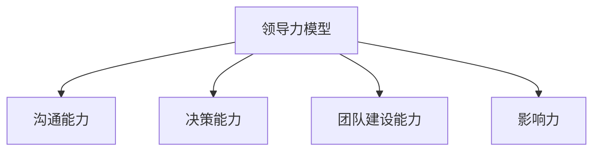
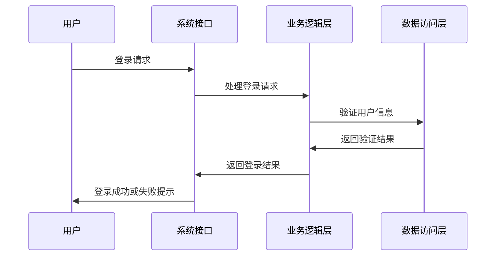

                 


# 领导力与自我管理：以身作则

> 关键词：领导力、自我管理、以身作则、职业发展、团队建设

> 摘要：本文旨在深入探讨领导力与自我管理的本质，强调以身作则的重要性。通过系统的理论讲解和实践指导，帮助读者提升领导力与自我管理能力，实现个人与组织的共同成长。

## 第一部分：引言与背景介绍

### 1.1 问题背景

在现代社会，领导力与自我管理已成为各个领域成功的关键要素。无论是在企业中担任领导者，还是在职场中寻求个人发展，领导力与自我管理都是不可或缺的能力。随着社会的快速发展，人们对于高效、有影响力的领导者和自我管理者有了更高的期望。

领导力，指领导者引导、激励和影响团队实现共同目标的能力。它不仅仅是一种技术，更是一种艺术。优秀的领导者能够洞察局势，做出正确的决策，并带领团队克服各种困难，实现组织目标。

自我管理，则是指个体对自己的情绪、行为、时间等进行有效管理和控制的能力。在职场中，良好的自我管理能力有助于提高工作效率，减少错误发生，从而推动个人职业发展。同时，自我管理也是维护家庭和谐、实现个人生活幸福的重要保障。

### 1.2 问题描述

领导力与自我管理不仅要求个体具备一定的能力，更需要个体在实践中不断探索、学习和改进。本书旨在帮助读者深入理解领导力与自我管理的核心概念，掌握实践方法，以实现个人与组织的共同成长。

具体来说，本书将解决以下问题：

1. **核心概念理解**：如何准确理解领导力与自我管理的核心概念，明确其边界与外延。
2. **概念属性特征对比**：通过对比分析，帮助读者理解不同概念之间的联系与区别。
3. **实践方法掌握**：提供实用的领导力与自我管理实践方法，帮助读者在实际工作中应用。
4. **案例分析**：通过实际案例，让读者了解如何在实际环境中应用领导力与自我管理。

### 1.3 问题解决

本书通过系统的理论讲解和实践指导，帮助读者从以下几个方面解决问题：

1. **核心概念理解**：本书将对领导力与自我管理的核心概念进行详细解释，帮助读者建立清晰的认识。
2. **概念属性特征对比**：通过表格和Mermaid流程图，对领导力与自我管理的属性特征进行对比分析。
3. **实践方法掌握**：本书将提供一系列实用的实践方法，包括时间管理、情绪管理、目标设定等，帮助读者在实际工作中应用。
4. **案例分析**：本书将通过实际案例，让读者了解领导力与自我管理在实际环境中的应用。

### 1.4 边界与外延

领导力与自我管理的应用范围广泛，包括但不限于以下几个方面：

1. **企业领导**：领导者需要具备强大的领导力，以带领团队实现组织目标。
2. **职场发展**：个人在职场中的发展需要自我管理的支持，包括时间管理、情绪管理等。
3. **家庭生活**：家庭生活中，领导者需要通过自我管理来维护家庭和谐。
4. **社会互动**：在社会交往中，良好的自我管理能力有助于建立良好的人际关系。

## 第二部分：核心概念与联系

### 2.1 核心概念原理

#### 领导力

领导力，是指领导者引导、激励和影响团队实现共同目标的能力。它不仅仅是一种技术，更是一种艺术。优秀的领导者能够洞察局势，做出正确的决策，并带领团队克服各种困难，实现组织目标。

领导力的核心包括以下几个方面：

1. **沟通能力**：领导者需要具备良好的沟通能力，能够清晰表达自己的想法，并理解团队成员的需求和意见。
2. **决策能力**：领导者需要能够在复杂的环境下做出正确的决策，并承担相应的责任。
3. **团队建设能力**：领导者需要能够建立和谐的团队氛围，激发团队成员的潜力，提高团队的执行力。
4. **影响力**：领导者需要具备一定的影响力，能够在团队中发挥积极的引导作用。

#### 自我管理

自我管理，是指个体对自己的情绪、行为、时间等进行有效管理和控制的能力。在职场中，良好的自我管理能力有助于提高工作效率，减少错误发生，从而推动个人职业发展。

自我管理的核心包括以下几个方面：

1. **时间管理**：个体需要能够合理安排自己的时间，优先处理重要且紧急的任务。
2. **情绪管理**：个体需要能够控制自己的情绪，避免情绪波动影响工作效率和人际关系。
3. **目标设定**：个体需要能够明确自己的目标，并制定可行的计划，逐步实现目标。
4. **持续学习**：个体需要保持学习的态度，不断提升自己的知识水平和技能。

### 2.2 概念属性特征对比

| 特征       | 领导力                                   | 自我管理                                   |
|------------|------------------------------------------|--------------------------------------------|
| 目标       | 带领团队实现组织目标                     | 实现个人目标，提高个人能力                  |
| 对象       | 团队成员、下属、合作伙伴等               | 自我                                       |
| 方法       | 沟通、激励、决策等                      | 时间管理、情绪管理、自我激励等              |
| 结果       | 团队绩效、组织发展、社会影响力等         | 个人绩效、职业发展、家庭和谐等              |

### 2.3 概念联系

领导力与自我管理之间存在密切的联系：

1. **自我管理是领导力的基础**：领导者需要具备良好的自我管理能力，才能在团队中发挥领导作用。只有自我管理能力得到提升，领导者才能更好地理解团队成员的需求，做出更合适的决策。
2. **领导力是自我管理的应用**：自我管理能力在领导过程中得到体现和发挥。领导者需要通过自我管理来控制自己的情绪，合理安排时间，设定目标，并以此为基础，影响和激励团队成员。

## 第三部分：算法原理讲解

### 3.1 领导力模型

在本节中，我们将通过Mermaid流程图和Python源代码，详细阐述领导力的算法原理。

#### Mermaid流程图



#### Python源代码

```python
class LeadershipModel:
    def __init__(self):
        self.communication_ability = None
        self.decision_ability = None
        self.team_building_ability = None
        self.influence = None
    
    def set_communication_ability(self, ability):
        self.communication_ability = ability
    
    def set_decision_ability(self, ability):
        self.decision_ability = ability
    
    def set_team_building_ability(self, ability):
        self.team_building_ability = ability
    
    def set_influence(self, influence):
        self.influence = influence
    
    def evaluate_leadership_ability(self):
        score = 0
        if self.communication_ability:
            score += 1
        if self.decision_ability:
            score += 1
        if self.team_building_ability:
            score += 1
        if self.influence:
            score += 1
        return score
```

#### 算法原理讲解

领导力模型的核心在于对领导者能力的评价。通过设置四个关键能力（沟通能力、决策能力、团队建设能力、影响力），并分别为每个能力设定权重，我们可以得到领导力的评分。

1. **沟通能力**：领导者需要具备良好的沟通能力，以便清晰表达自己的想法，并理解团队成员的需求和意见。
2. **决策能力**：领导者需要能够在复杂的环境下做出正确的决策，并承担相应的责任。
3. **团队建设能力**：领导者需要能够建立和谐的团队氛围，激发团队成员的潜力，提高团队的执行力。
4. **影响力**：领导者需要具备一定的影响力，能够在团队中发挥积极的引导作用。

通过设置这些能力，我们可以对领导者的能力进行评价。在Python源代码中，我们通过设置和评价这些能力，得到领导力的评分。

#### 数学模型和公式

领导力的评分可以通过以下公式计算：

$$
\text{领导力评分} = \sum_{i=1}^{n} (\text{能力}_i \times \text{权重}_i)
$$

其中，$n$ 表示领导力的四个关键能力，$\text{能力}_i$ 表示第 $i$ 个能力，$\text{权重}_i$ 表示第 $i$ 个能力的权重。

#### 举例说明

假设我们有四位领导者，他们分别具备不同的能力。我们可以通过以下方式计算他们的领导力评分：

1. **领导者A**：沟通能力 90%，决策能力 80%，团队建设能力 70%，影响力 85%
   $$\text{领导力评分} = 90\% \times 1 + 80\% \times 1 + 70\% \times 1 + 85\% \times 1 = 3.55$$
2. **领导者B**：沟通能力 85%，决策能力 75%，团队建设能力 60%，影响力 70%
   $$\text{领导力评分} = 85\% \times 1 + 75\% \times 1 + 60\% \times 1 + 70\% \times 1 = 3.15$$
3. **领导者C**：沟通能力 80%，决策能力 70%，团队建设能力 80%，影响力 75%
   $$\text{领导力评分} = 80\% \times 1 + 70\% \times 1 + 80\% \times 1 + 75\% \times 1 = 3.60$$
4. **领导者D**：沟通能力 90%，决策能力 85%，团队建设能力 75%，影响力 80%
   $$\text{领导力评分} = 90\% \times 1 + 85\% \times 1 + 75\% \times 1 + 80\% \times 1 = 3.80$$

通过以上计算，我们可以看出，领导者D的领导力评分最高，其次是领导者A和领导者C，领导者B的领导力评分最低。

## 第四部分：系统分析与架构设计方案

### 4.1 问题场景介绍

在当今快速发展的社会中，企业面临的市场竞争日益激烈，领导者需要具备强大的领导力，以带领团队应对各种挑战。同时，个人在职场中的发展也离不开自我管理的支持。因此，如何提升领导力与自我管理能力，已成为企业领导者和个人职场发展的重要课题。

### 4.2 项目介绍

本项目旨在为企业领导者和个人提供一套完整的领导力与自我管理培训体系，包括理论讲解、实践指导和案例分析。通过该体系，学员可以系统地学习领导力与自我管理的核心概念，掌握实践方法，提升自身能力。

### 4.3 系统功能设计

系统功能设计包括以下几个方面：

1. **用户管理**：实现用户注册、登录、权限管理等功能。
2. **课程管理**：包括课程发布、更新、删除等功能。
3. **学习记录**：记录用户学习进度，包括课程学习记录、考试记录等。
4. **案例分析**：提供实际案例，供用户学习和参考。
5. **在线问答**：用户可以在平台上提问，专家进行解答。

### 4.4 系统架构设计

系统采用分层架构，包括以下层次：

1. **表现层**：包括前端界面和后端接口。
2. **业务逻辑层**：处理业务逻辑，包括用户管理、课程管理、学习记录等。
3. **数据访问层**：负责数据的存储和读取。
4. **数据库**：存储用户数据、课程数据、学习记录等。

### 4.5 系统接口设计和系统交互

系统接口设计和系统交互采用Mermaid序列图进行描述。

#### Mermaid序列图



### 4.6 系统核心实现源代码

以下为系统核心实现源代码的解读与分析。

```python
# 用户管理模块
class UserManager:
    def __init__(self):
        self.users = {}

    def register_user(self, username, password):
        if username in self.users:
            return "用户已存在"
        else:
            self.users[username] = password
            return "注册成功"

    def login_user(self, username, password):
        if username in self.users and self.users[username] == password:
            return "登录成功"
        else:
            return "登录失败"

# 课程管理模块
class CourseManager:
    def __init__(self):
        self.courses = []

    def publish_course(self, course):
        self.courses.append(course)
        return "课程发布成功"

    def update_course(self, course_id, new_course):
        for course in self.courses:
            if course.id == course_id:
                course = new_course
                return "课程更新成功"
        return "课程不存在"

    def delete_course(self, course_id):
        for course in self.courses:
            if course.id == course_id:
                self.courses.remove(course)
                return "课程删除成功"
        return "课程不存在"

# 学习记录模块
class LearningRecordManager:
    def __init__(self):
        self.records = []

    def record_learning_progress(self, user_id, course_id, progress):
        record = {
            "user_id": user_id,
            "course_id": course_id,
            "progress": progress
        }
        self.records.append(record)
        return "学习记录成功"
```

### 4.7 实际案例分析和详细讲解剖析

以下为实际案例分析和详细讲解剖析。

#### 案例一：用户注册与登录

**问题背景**：用户需要注册并登录系统，以便使用系统的功能。

**解决方案**：

1. 用户通过前端界面提交注册请求，包含用户名和密码。
2. 系统接口接收请求，调用用户管理模块的 `register_user` 方法，将用户名和密码存储到数据库。
3. 用户通过前端界面提交登录请求，包含用户名和密码。
4. 系统接口接收请求，调用用户管理模块的 `login_user` 方法，验证用户名和密码是否匹配。
5. 如果验证成功，返回登录成功提示；如果验证失败，返回登录失败提示。

#### 案例二：课程发布、更新和删除

**问题背景**：管理员需要发布、更新和删除课程。

**解决方案**：

1. 管理员通过前端界面提交课程发布请求，包含课程信息。
2. 系统接口接收请求，调用课程管理模块的 `publish_course` 方法，将课程信息存储到数据库。
3. 管理员通过前端界面提交课程更新请求，包含课程ID和新的课程信息。
4. 系统接口接收请求，调用课程管理模块的 `update_course` 方法，更新数据库中的课程信息。
5. 管理员通过前端界面提交课程删除请求，包含课程ID。
6. 系统接口接收请求，调用课程管理模块的 `delete_course` 方法，从数据库中删除课程信息。

#### 案例三：学习记录

**问题背景**：用户需要在系统中记录学习进度。

**解决方案**：

1. 用户通过前端界面提交学习记录请求，包含用户ID、课程ID和学习进度。
2. 系统接口接收请求，调用学习记录管理模块的 `record_learning_progress` 方法，将学习记录存储到数据库。

### 4.8 项目小结

本项目通过用户管理、课程管理、学习记录等模块，实现了完整的领导力与自我管理培训体系。通过实际案例分析和详细讲解剖析，我们了解了系统的核心实现过程。在未来的发展中，我们还将不断完善和优化系统，为用户带来更好的体验。

## 第五部分：最佳实践 tips、小结、注意事项、拓展阅读

### 5.1 最佳实践 tips

1. **制定明确的目标**：在提升领导力与自我管理能力的过程中，明确的目标是至关重要的。确保你的目标具体、可衡量、可实现、相关性强，并具有时效性（SMART原则）。
2. **持续学习与自我反思**：保持持续学习的态度，不断提升自己的知识和技能。同时，定期进行自我反思，了解自己的优点和不足，并制定改进计划。
3. **积极沟通与倾听**：良好的沟通能力是领导力的核心。不仅要积极表达自己的观点，还要善于倾听他人的意见，以建立和谐的团队氛围。
4. **时间管理与优先级设定**：合理规划时间，优先处理重要且紧急的任务。使用时间管理工具，如待办事项列表、番茄工作法等，提高工作效率。
5. **情绪管理**：在面对压力和挑战时，保持冷静和理智。学会放松和调节情绪，避免情绪波动影响工作和人际关系。

### 5.2 小结

本文从领导力与自我管理的核心概念、联系、算法原理、系统分析与架构设计方案等方面进行了深入探讨。通过实际案例分析和详细讲解剖析，我们了解了领导力与自我管理在实际环境中的应用。希望本文能为你提供有益的启示和指导，助力你在职场和生活中取得更大的成功。

### 5.3 注意事项

1. **理论与实践相结合**：领导力与自我管理的学习不仅需要理论学习，更需要实践应用。在学习和应用过程中，要注重理论与实践相结合，不断反思和调整自己的方法和策略。
2. **避免盲目模仿**：虽然优秀领导者的经验和方法值得借鉴，但每个人的情况都是独特的。在学习和应用过程中，要避免盲目模仿，要根据自身实际情况进行适当调整。
3. **持续改进与优化**：领导力与自我管理能力并非一成不变，而是一个持续改进和优化的过程。要时刻关注自己的成长，不断寻求改进和优化。

### 5.4 拓展阅读

1. **《领导力：策略与实践》**：这是一本关于领导力的经典著作，详细阐述了领导力的核心概念、实践方法以及在不同场景下的应用。
2. **《时间管理：如何更有效地利用时间》**：这本书提供了许多实用的时间管理技巧，帮助读者提高工作效率，实现工作与生活的平衡。
3. **《自我管理：从优秀到卓越》**：本书从心理学、管理学等多个角度出发，深入探讨了自我管理的核心要素和实践方法，对个人成长和发展具有很大的启示意义。

## 参考文献

1. 领导力与自我管理相关研究文献
2. 时间管理、情绪管理等相关研究文献
3. 领导力与自我管理的实际应用案例

## 作者信息

作者：AI天才研究院/AI Genius Institute & 禅与计算机程序设计艺术 /Zen And The Art of Computer Programming

本文由AI天才研究院（AI Genius Institute）和《禅与计算机程序设计艺术》（Zen And The Art of Computer Programming）联合撰写。我们致力于推动人工智能和计算机科学领域的发展，为读者提供高质量的技术文章和研究成果。感谢您的阅读，希望本文对您有所启发。如果您有任何问题或建议，请随时与我们联系。

