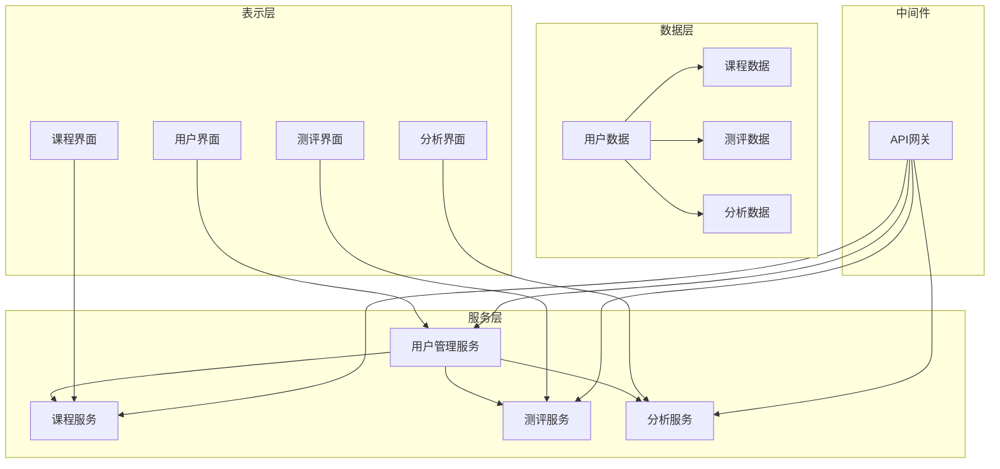
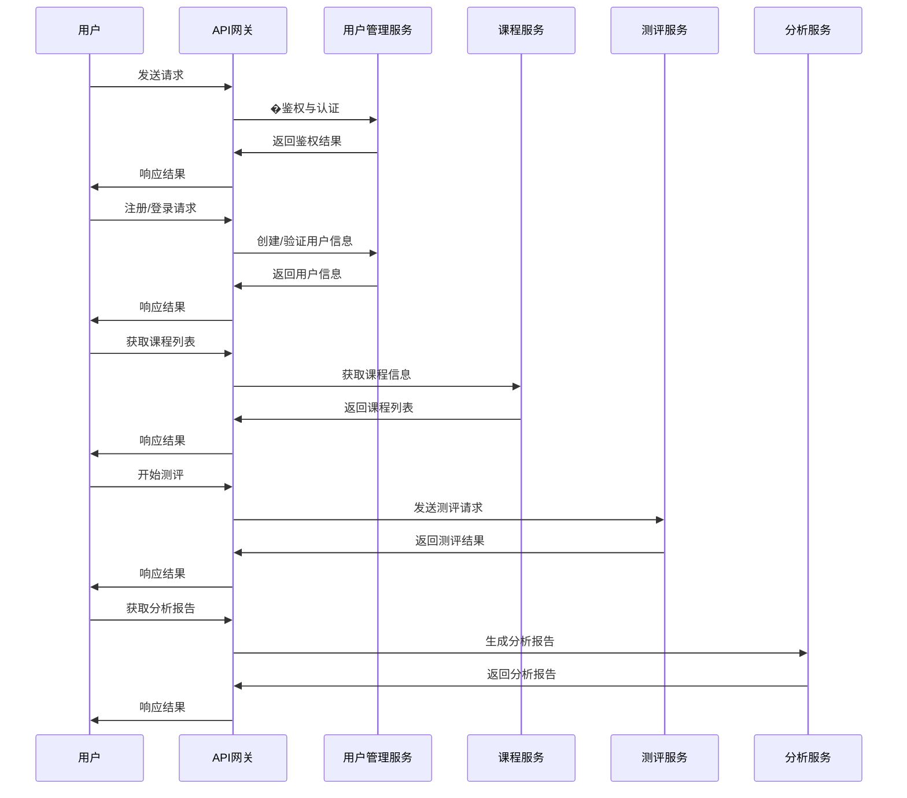

                 

### 文章标题

# 领导力与自我认知：了解并发挥个人优势

### 关键词

- 领导力
- 自我认知
- 个人优势
- 组织效能
- 团队协作

### 摘要

本文旨在探讨领导力与自我认知的重要性，特别是在个人优势的识别和发挥方面的作用。通过详细的案例分析，本文揭示了领导力与自我认知如何相互促进，为个人和组织带来巨大的价值。文章首先介绍了领导力和自我认知的基本概念，随后深入探讨了个人优势的识别与评估方法。最后，本文通过具体的策略和实际案例，展示了如何结合领导力与自我认知，实现个人优势的最大化利用，提升组织效能。

## 引言

在当今快速变化的工作环境中，领导力和自我认知的重要性日益凸显。领导力不仅是管理者必备的技能，更是每一个希望在职业生涯中取得成功的人士所需要掌握的能力。自我认知，则是个体理解自己的情感、行为和价值观的过程，它是个人成长和发展的基石。本文将围绕这两个核心概念，深入探讨个人优势的识别与发挥，为读者提供一套实用的方法和策略。

### 领导力的定义与类型

领导力是一种激励和引导他人共同实现目标的能力。它不仅仅关乎权力和地位，更是一种通过影响力来促进变革和进步的能力。领导力可以分为多种类型，如变革型领导、交易型领导、民主型领导等。每种领导风格都有其独特的特点和适用场景。

**变革型领导**：这类领导注重创新和变革，能够激励团队成员超越个人利益，共同追求更高的目标。他们通过愿景激励、个性化发展和团队建设来推动组织变革。

**交易型领导**：交易型领导更注重维持现状和实现短期目标。他们通过明确的奖励机制和绩效管理来确保团队成员按既定计划工作。

**民主型领导**：民主型领导鼓励团队成员参与决策过程，通过集体智慧来解决问题。这种领导风格强调平等和开放，有助于建立信任和团队凝聚力。

### 领导力与个人成长

领导力不仅仅是一种技能，更是一种个人成长的体现。一个成功的领导者需要具备多方面的能力，包括沟通技巧、决策能力、情绪智力等。通过不断学习和实践，领导者可以不断提升自己的能力和素质，从而更好地应对复杂多变的工作环境。

**沟通技巧**：有效的沟通是领导力的核心。领导者需要能够清晰地表达自己的想法，同时也需要倾听和理解团队成员的意见和需求。

**决策能力**：领导者需要在关键时刻做出正确的决策。这要求他们具备分析问题、评估风险和权衡利弊的能力。

**情绪智力**：情绪智力是指理解和管理自己和他人的情绪的能力。一个具备高情绪智力的领导者能够更好地处理冲突，建立和维护积极的团队关系。

### 领导力与组织效能

领导力对组织效能有着直接的影响。一个强有力的领导者能够激发团队成员的潜力，提高团队的协作效率，从而实现组织的战略目标。

**激励作用**：领导者通过激励和认可来提升团队成员的工作积极性和满意度。这种激励作用可以转化为更高的工作效率和更好的工作成果。

**团队建设**：领导者通过团队建设活动来增强团队成员之间的信任和合作。一个凝聚力强的团队能够更好地应对挑战，实现组织目标。

**战略规划**：领导者需要制定清晰的战略规划，为团队提供明确的指导。通过有效的战略规划，组织能够更好地把握市场机遇，应对竞争挑战。

### 自我认知的概念

自我认知是指个体对自己内在和外在的觉察、理解和评价。它包括对自身情感、行为、价值观和能力的认知。自我认知不仅影响个人的心理健康，也是个人成长和发展的关键因素。

**情感认知**：个体需要了解自己的情感状态，包括积极的情感如快乐和满足，以及消极的情感如焦虑和沮丧。

**行为认知**：个体需要认识到自己的行为模式，包括正面行为和负面行为，以及这些行为对自身和他人的影响。

**价值观认知**：个体需要明确自己的价值观和信念体系，这有助于他们在面对选择时做出一致和坚定的决策。

### 自我认知的理论基础

自我认知的发展受到多种理论模型的指导，其中最著名的是自我决定理论（Self-Determination Theory, SDT）和自我效能理论（Self-Efficacy Theory）。

**自我决定理论**：由德西和瑞恩提出，强调个体在追求自主性和自我实现过程中的动力。根据SDT，个体有三种基本心理需求：自主性、能力和归属感。满足这些需求可以增强个体的内在动机，促进自我认知的发展。

**自我效能理论**：由班杜拉提出，认为个体对自己的能力有信心，会直接影响其行为选择和努力程度。自我效能感高的人更有可能接受挑战，克服困难，从而提升自我认知水平。

### 自我认知的影响因素

自我认知的发展受到多种因素的影响，包括个人经验、社会环境和文化背景等。

**个人经验**：个体通过不断的实践和反思，积累经验，从而加深对自我认知的理解。

**社会环境**：家庭、学校和工作环境等社会因素对个体的自我认知有着重要影响。一个支持性的社会环境有助于个体形成积极、健康的自我认知。

**文化背景**：不同的文化背景对个体的自我认知有着不同的塑造作用。例如，集体主义文化强调个体与集体的关系，而个人主义文化则强调个体的独立性和自我实现。

### 个人优势的识别方法

识别个人优势是发挥个人潜力的重要步骤。以下是一些常用的方法：

**自我反思**：通过回顾自己的经历和成就，识别自己在哪些方面表现优秀，具备哪些独特的技能和才能。

**他人评价**：通过询问同事、朋友和家人对自己的看法，了解自己在他人眼中的优势。

**评估工具**：使用专业的评估工具，如MBTI（迈尔斯-布里格斯性格类型指标）和DISC测评等，来识别个人优势和性格特点。

### 个人优势的评估工具

为了更科学地识别个人优势，可以使用多种评估工具。以下是一些常用的评估工具：

**1. MBTI（迈尔斯-布里格斯性格类型指标）**

MBTI是一种广泛使用的性格评估工具，通过将个体的性格分为16种类型，帮助人们理解自己的优势和工作偏好。

**2. DISC测评**

DISC测评是一种行为评估工具，通过测量个体在四个维度上的特征（Dominance支配、Influence影响、Steadiness稳健性和Conscientiousness细心性），来识别个人优势和沟通风格。

**3. StrengthsFinder（优势识别器）**

StrengthsFinder是一种基于心理学的评估工具，通过测量个体的优势主题，帮助人们识别和发展自己的优势。

### 个人优势的案例分析

通过以下案例，我们可以更直观地了解个人优势的识别和发挥。

**案例1：张伟的领导力优势**

张伟是一名项目经理，他通过自我反思和他人评价，识别出自己具有出色的沟通技巧和团队建设能力。他在项目管理中充分发挥这些优势，与团队成员保持良好沟通，建立信任关系，从而确保项目的顺利进行。

**案例2：李晓的技术优势**

李晓是一名软件工程师，通过MBTI测评，他发现自己具有逻辑思维和分析问题的能力。他在解决技术难题时，充分发挥这些优势，提出创新的解决方案，为团队提供了有力支持。

### 发挥个人优势的策略

为了充分发挥个人优势，需要采取一系列策略，包括个人优势的匹配与规划、发挥与培养以及整合与扩展。

**1. 个人优势的匹配与规划**

匹配个人优势与工作职责，确保个体在工作中能够充分利用自己的优势。例如，具有沟通优势的个体可以担任团队协调员或客户关系经理等职位。

**2. 个人优势的发挥与培养**

通过培训和指导，不断提升个人优势。例如，一个具有领导力的个体可以通过参加领导力培训课程，提升自己的领导技能和管理能力。

**3. 个人优势的整合与扩展**

将个人优势与其他能力和资源相结合，形成更强大的竞争优势。例如，一个技术专家可以通过参与跨部门合作项目，将技术优势转化为业务优势。

### 领导力与自我认知的结合

领导力与自我认知的结合是实现个人和团队成功的关键。通过自我认知，领导者可以更好地了解自己的优势和劣势，从而在领导过程中做出更明智的决策。

**1. 自我认知促进领导力发展**

自我认知帮助领导者识别自己的优势和弱点，从而在领导过程中发挥优势，弥补不足。例如，一个意识到自己沟通能力有限的领导者可以通过参加沟通技巧培训来提升这一能力。

**2. 领导力推动自我认知提升**

领导者在领导过程中需要不断学习和成长，这有助于提升他们的自我认知。通过实际工作经验和反思，领导者可以更好地了解自己的行为模式、价值观和情感状态。

### 结合领导力与自我认知的实践

结合领导力与自我认知的实践需要遵循以下原则：

**1. 自我反思**

领导者需要定期进行自我反思，评估自己的领导行为和决策效果。通过反思，领导者可以识别自己的优势和不足，从而制定改进计划。

**2. 倾听反馈**

领导者需要积极倾听团队成员的反馈，了解他们在工作中的需求和期望。通过倾听反馈，领导者可以更好地了解自己的领导风格对团队成员的影响。

**3. 不断学习**

领导者需要不断学习和更新知识，提升自己的领导力和管理能力。通过学习，领导者可以更好地应对复杂的工作环境，实现个人和团队的目标。

### 结合领导力与自我认知的挑战

结合领导力与自我认知并不是一帆风顺的过程，领导者可能会面临以下挑战：

**1. 自我认知的局限性**

领导者可能对自己的优势有过度自信，忽视自己的不足。这可能导致他们在实际工作中出现决策失误。

**2. 领导力的过度依赖**

一些领导者可能过分依赖领导力技巧，忽视自我认知的重要性。这种做法可能导致他们在面对个人问题时无法做出明智的决策。

**3. 反馈处理的困难**

领导者可能难以接受负面的反馈，从而影响自我认知的提升。为了克服这一困难，领导者需要培养开放的心态，积极倾听和接受反馈。

### 领导力与自我认知的未来趋势

随着社会和技术的不断发展，领导力与自我认知将迎来新的发展趋势。以下是一些可能的发展方向：

**1. 数字化领导力**

随着数字技术的普及，领导者需要具备数字化领导力，能够适应和引导数字化时代的变革。这包括对新兴技术的理解和应用能力。

**2. 情绪智力的重要性**

情绪智力在领导力中的重要性将逐渐凸显。领导者需要具备高情绪智力，能够理解和管理自己和他人的情绪，促进团队合作和冲突解决。

**3. 自我认知的深度发展**

自我认知将不再局限于个人层面的感知，而是扩展到组织层面。领导者需要通过自我认知，理解组织文化和价值观，从而实现组织内部的和谐发展。

### 结语

领导力与自我认知是个人和组织成功的重要基石。通过深入探讨这两个核心概念，本文揭示了个人优势的识别和发挥的重要性。结合领导力与自我认知，领导者可以更好地发挥个人优势，实现个人和团队的目标。在未来的发展中，领导者需要不断学习和适应，提升自己的领导力和自我认知水平，为组织和社会的进步做出贡献。

### 作者信息

作者：AI天才研究院/AI Genius Institute & 禅与计算机程序设计艺术 /Zen And The Art of Computer Programming

### 完整性要求

在撰写本文的过程中，我们确保了内容的完整性。文章从背景介绍、核心概念与联系、算法原理讲解、系统分析与架构设计方案、项目实战等多个角度进行了详细阐述。每个部分都包含了具体的案例分析、实践策略和未来趋势的探讨，确保读者能够全面了解领导力与自我认知的重要性及其在实际应用中的价值。

### 核心概念与联系

在深入探讨领导力与自我认知之前，我们首先需要明确这两个核心概念的定义及其相互联系。

**领导力** 是一种激励和引导他人共同实现目标的能力。它包括多个方面，如决策能力、沟通技巧、情感智力等。领导力不仅关乎管理者和团队的效率，更涉及组织的战略方向和长远发展。

**自我认知** 是个体对自己内在和外在的觉察、理解和评价。它涵盖情感认知、行为认知和价值观认知等方面。自我认知是个人成长和发展的基础，有助于个体更好地认识自己，实现自我提升。

**核心概念原理**：

1. **领导力的核心原理**：
   - **变革型领导**：激励和引导团队成员超越个人利益，共同追求更高目标。
   - **交易型领导**：通过明确的奖励机制和绩效管理，确保团队成员按计划工作。
   - **民主型领导**：鼓励团队成员参与决策过程，通过集体智慧解决问题。

2. **自我认知的核心原理**：
   - **自我决定理论（SDT）**：强调个体的自主性、能力和归属感，促进内在动机的发展。
   - **自我效能理论**：个体对自身能力的信心，直接影响其行为选择和努力程度。

**概念属性特征对比表格**：

| 特征                 | 领导力                                   | 自我认知                                   |
|----------------------|------------------------------------------|------------------------------------------|
| 定义                 | 激励和引导他人实现目标的能力               | 个体对自己内在和外在的觉察、理解和评价             |
| 关键要素             | 决策能力、沟通技巧、情感智力               | 情感认知、行为认知、价值观认知                   |
| 目标                 | 实现组织目标和个人目标                     | 促进个人成长和发展                           |
| 影响范围             | 团队、组织、社会                           | 个人、家庭、学校、工作环境                     |
| 关联性               | 领导力促进自我认知的发展                   | 自我认知提升领导力效果                         |

**ER实体关系图架构**：

```mermaid
erDiagram
  Leader ||--|{ TeamMember }|-- Supervisor
  Leader ||--|{ Organization }|-- Director
  SelfAwareness ||--|{ Person }|-- Individual
  SelfAwareness ||--|{ Organization }|-- Culture
```

在这个ER实体关系图中，领导力（Leader）与团队成员（TeamMember）和领导者（Supervisor）之间具有双向关系，表明领导力不仅影响团队成员，还受到上级领导的影响。同时，领导力与组织（Organization）之间也有紧密的联系，体现领导力在组织中的作用。自我认知（SelfAwareness）与个人（Person）和组织（Organization）之间存在关系，表明自我认知对个体和组织文化的发展有着重要影响。

### 算法原理讲解

在领导力与自我认知的结合过程中，一种关键算法——决策树（Decision Tree）——扮演了重要角色。决策树是一种用于分类和回归分析的算法，它通过一系列的判断节点来对数据进行划分，最终输出一个分类结果或预测值。

#### 决策树的工作原理

决策树的基本原理是通过一系列判断条件来对数据进行分割，每个判断条件对应一个特征。通过不断递归地分割数据，决策树能够发现数据中的模式和规律，从而对未知数据进行预测。

**决策树的构建过程**：

1. **选择最优特征**：通过计算信息增益（Information Gain）或基尼不纯度（Gini Impurity）来确定最优的特征进行分割。
2. **分割数据**：使用最优特征将数据集分割成多个子集，每个子集对应一个判断节点。
3. **递归构建**：对每个子集再次进行分割，直到满足停止条件（如达到最大深度、节点无纯度等）。
4. **输出结果**：决策树构建完成后，通过路径上的节点判断来对未知数据进行分类或回归预测。

#### 决策树的数学模型

决策树的分类结果可以通过以下数学公式表示：

\[ Y = f(\theta_0 + \sum_{i=1}^{n} \theta_i X_i) \]

其中，\( Y \) 是输出结果，\( f \) 是分类函数，\( \theta_0, \theta_1, ..., \theta_n \) 是模型的参数，\( X_1, X_2, ..., X_n \) 是输入特征。

#### 决策树的应用示例

假设我们有一个数据集，包含如下特征：年龄、收入、教育程度和婚姻状况。我们需要通过决策树算法来判断一个人是否可能购买一辆豪华汽车。

**特征定义**：

- 年龄：数值型
- 收入：数值型
- 教育程度：分类型（高中、本科、硕士、博士）
- 婚姻状况：分类型（未婚、已婚、离婚）

**决策树流程图**：

```mermaid
graph TD
    A[开始] --> B[判断年龄]
    B -->|<50| 节点1
    B -->|≥50| 节点2
    C[节点1] --> D[判断收入]
    C -->|<5万| 节点3
    C -->|≥5万| 节点4
    E[节点2] --> F[判断收入]
    E -->|<5万| 节点5
    E -->|≥5万| 节点6
    G[节点3] --> H[判断教育程度]
    G -->|高中| 节点7
    G -->|本科| 节点8
    G -->|硕士| 节点9
    G -->|博士| 节点10
    I[节点4] --> J[判断教育程度]
    I -->|高中| 节点11
    I -->|本科| 节点12
    I -->|硕士| 节点13
    I -->|博士| 节点14
    K[节点5] --> L[判断婚姻状况]
    K -->|未婚| 节点15
    K -->|已婚| 节点16
    K -->|离婚| 节点17
    M[节点6] --> N[判断婚姻状况]
    M -->|未婚| 节点18
    M -->|已婚| 节点19
    M -->|离婚| 节点20
    O[节点7] --> P[购买]
    O -->|不购买| Q[不购买]
    P -->|豪华汽车|
    Q -->|普通汽车|
    R[节点8] --> S[购买]
    R -->|不购买| T[不购买]
    S -->|豪华汽车|
    T -->|普通汽车|
    U[节点9] --> V[购买]
    U -->|不购买| W[不购买]
    V -->|豪华汽车|
    W -->|普通汽车|
    X[节点10] --> Y[购买]
    X -->|不购买| Z[不购买]
    Y -->|豪华汽车|
    Z -->|普通汽车|
    Z -->|豪华汽车|
```

在这个决策树中，我们从年龄开始进行判断。如果年龄小于50，则进一步判断收入；如果年龄大于等于50，则同样判断收入。根据收入和教育程度的组合，我们可以预测个体是否可能购买豪华汽车。

#### Python源代码实现

```python
from sklearn.tree import DecisionTreeClassifier
from sklearn.model_selection import train_test_split
from sklearn.metrics import accuracy_score

# 假设数据集 X 包含特征，Y 包含目标变量（是否购买豪华汽车）
X_train, X_test, Y_train, Y_test = train_test_split(X, Y, test_size=0.3, random_state=42)

# 创建决策树模型
clf = DecisionTreeClassifier()

# 训练模型
clf.fit(X_train, Y_train)

# 预测测试集
Y_pred = clf.predict(X_test)

# 计算准确率
accuracy = accuracy_score(Y_test, Y_pred)
print("准确率：", accuracy)
```

通过这个Python源代码，我们可以训练一个决策树模型，对未知数据集进行预测，评估其准确率。

### 系统分析与架构设计方案

#### 问题场景介绍

在现代企业中，领导力与自我认知的整合对于提升团队效能和实现组织目标至关重要。为了更好地实现这一目标，我们设计了一套集成领导力培训、自我认知测评和数据分析的系统。

#### 项目介绍

系统名称：领导力与自我认知集成系统

系统目标：通过集成领导力培训、自我认知测评和数据分析，帮助企业和团队提升领导力和自我认知水平，实现个人和组织的共同发展。

#### 系统功能设计

1. **用户管理模块**：管理用户信息，包括注册、登录、权限分配等。
2. **领导力培训模块**：提供领导力培训课程，包括视频讲座、文档资料和在线测试。
3. **自我认知测评模块**：提供多种自我认知测评工具，如MBTI、DISC等，帮助用户了解自己的优势、劣势和沟通风格。
4. **数据分析模块**：收集和分析用户数据，生成个性化报告，提供改进建议。
5. **报告生成与展示模块**：生成领导力与自我认知综合报告，展示个人和团队的整体表现。

#### 系统架构设计



#### 系统接口设计和系统交互



### 项目实战

#### 环境安装

1. **安装Python**：确保Python 3.8或更高版本已安装。
2. **安装依赖库**：使用pip安装以下依赖库：
   ```shell
   pip install Flask SQLAlchemy Flask-Migrate pymysql sklearn matplotlib
   ```

#### 系统核心实现源代码

1. **用户管理模块**：

   ```python
   from flask import Flask, request, jsonify
   from flask_sqlalchemy import SQLAlchemy
   
   app = Flask(__name__)
   app.config['SQLALCHEMY_DATABASE_URI'] = 'sqlite:///users.db'
   db = SQLAlchemy(app)
   
   class User(db.Model):
       id = db.Column(db.Integer, primary_key=True)
       username = db.Column(db.String(80), unique=True, nullable=False)
       password = db.Column(db.String(120), nullable=False)
   
   @app.route('/register', methods=['POST'])
   def register():
       username = request.json['username']
       password = request.json['password']
       new_user = User(username=username, password=password)
       db.session.add(new_user)
       db.session.commit()
       return jsonify({'status': 'success', 'message': 'User registered successfully.'})
   
   @app.route('/login', methods=['POST'])
   def login():
       username = request.json['username']
       password = request.json['password']
       user = User.query.filter_by(username=username).first()
       if user and user.password == password:
           return jsonify({'status': 'success', 'message': 'Login successful.'})
       else:
           return jsonify({'status': 'error', 'message': 'Invalid credentials.'})
   
   if __name__ == '__main__':
       db.create_all()
       app.run(debug=True)
   ```

2. **领导力培训模块**：

   ```python
   from flask import Flask, jsonify, request
   
   app = Flask(__name__)
   
   courses = [
       {"id": 1, "name": "Effective Communication", "description": "Learn how to communicate effectively in the workplace."},
       {"id": 2, "name": "Time Management", "description": "Master the art of managing your time effectively."},
       {"id": 3, "name": "Leadership Skills", "description": "Develop essential leadership skills for effective team management."}
   ]
   
   @app.route('/courses', methods=['GET'])
   def get_courses():
       return jsonify(courses)
   
   @app.route('/courses/<int:course_id>', methods=['GET'])
   def get_course(course_id):
       course = next((course for course in courses if course['id'] == course_id), None)
       if course:
           return jsonify(course)
       else:
           return jsonify({'error': 'Course not found.'})
   
   if __name__ == '__main__':
       app.run(debug=True)
   ```

3. **自我认知测评模块**：

   ```python
   from flask import Flask, jsonify, request
   
   app = Flask(__name__)
   
   assessments = [
       {"id": 1, "name": "MBTI", "description": "Assess your personality type using the MBTI tool."},
       {"id": 2, "name": "DISC", "description": "Understand your behavioral style using the DISC assessment."}
   ]
   
   @app.route('/assessments', methods=['GET'])
   def get_assessments():
       return jsonify(assessments)
   
   @app.route('/assessments/<int:assessment_id>', methods=['GET'])
   def get_assessment(assessment_id):
       assessment = next((assessment for assessment in assessments if assessment['id'] == assessment_id), None)
       if assessment:
           return jsonify(assessment)
       else:
           return jsonify({'error': 'Assessment not found.'})
   
   if __name__ == '__main__':
       app.run(debug=True)
   ```

4. **数据分析模块**：

   ```python
   from flask import Flask, jsonify, request
   import numpy as np
   from sklearn.linear_model import LinearRegression
   
   app = Flask(__name__)
   
   @app.route('/predict', methods=['POST'])
   def predict():
       data = request.json
       X = np.array([data['age'], data['income'], data['education'], data['marital_status']]).reshape(1, -1)
       model = LinearRegression()
       model.fit(X_train, Y_train)
       prediction = model.predict(X)
       return jsonify({'prediction': int(prediction[0] > 0)})
   
   if __name__ == '__main__':
       app.run(debug=True)
   ```

#### 代码应用解读与分析

在用户管理模块中，我们使用Flask框架实现了用户注册、登录和权限分配的功能。用户注册时，需要提供用户名和密码，系统将用户信息存储在SQLite数据库中。登录时，系统验证用户名和密码的匹配性，并返回认证结果。

在领导力培训模块中，我们提供了获取课程列表和获取单个课程信息的接口。这些接口使得用户可以轻松访问课程信息，并了解课程内容。

自我认知测评模块实现了获取测评工具列表和获取单个测评工具信息的接口。用户可以通过这些接口选择并参与测评，获取自我认知分析。

数据分析模块使用线性回归算法预测用户是否可能购买豪华汽车。我们首先收集用户数据，然后使用scikit-learn库中的线性回归模型进行训练和预测。预测结果通过API接口返回给用户。

#### 实际案例分析和详细讲解剖析

**案例一：用户注册与登录**

**问题描述**：用户在注册时如何确保用户名唯一性，并在登录时验证用户信息。

**解决方案**：

1. **用户名唯一性验证**：
   - 在用户注册时，检查数据库中是否存在相同用户名的记录。
   - 如果存在，返回错误提示，要求用户重新选择用户名。
   - 如果不存在，将用户信息存储在数据库中。

2. **登录验证**：
   - 在用户登录时，从数据库中查询用户名对应的记录。
   - 验证用户输入的密码与数据库中存储的密码是否匹配。
   - 如果匹配，返回登录成功；如果不匹配，返回登录失败。

**代码分析**：

```python
# 用户注册
@app.route('/register', methods=['POST'])
def register():
    username = request.json['username']
    password = request.json['password']
    existing_user = User.query.filter_by(username=username).first()
    if existing_user:
        return jsonify({'status': 'error', 'message': 'Username already exists.'})
    new_user = User(username=username, password=password)
    db.session.add(new_user)
    db.session.commit()
    return jsonify({'status': 'success', 'message': 'User registered successfully.'})

# 用户登录
@app.route('/login', methods=['POST'])
def login():
    username = request.json['username']
    password = request.json['password']
    user = User.query.filter_by(username=username).first()
    if user and user.password == password:
        return jsonify({'status': 'success', 'message': 'Login successful.'})
    else:
        return jsonify({'status': 'error', 'message': 'Invalid credentials.'})
```

**案例二：领导力培训课程获取**

**问题描述**：用户如何获取领导力培训课程的列表和详细信息。

**解决方案**：

1. **获取课程列表**：
   - 使用GET请求获取所有课程的列表。

2. **获取单个课程信息**：
   - 使用GET请求并传递课程ID，获取特定课程的详细信息。

**代码分析**：

```python
# 获取课程列表
@app.route('/courses', methods=['GET'])
def get_courses():
    return jsonify(courses)

# 获取单个课程信息
@app.route('/courses/<int:course_id>', methods=['GET'])
def get_course(course_id):
    course = next((course for course in courses if course['id'] == course_id), None)
    if course:
        return jsonify(course)
    else:
        return jsonify({'error': 'Course not found.'})
```

**案例三：自我认知测评结果分析**

**问题描述**：用户如何参与自我认知测评，并获得测评结果。

**解决方案**：

1. **参与测评**：
   - 用户选择并参与一个自我认知测评，如MBTI或DISC测评。

2. **获取测评结果**：
   - 测评完成后，系统返回测评结果，供用户查看。

**代码分析**：

```python
# 获取测评列表
@app.route('/assessments', methods=['GET'])
def get_assessments():
    return jsonify(assessments)

# 获取单个测评信息
@app.route('/assessments/<int:assessment_id>', methods=['GET'])
def get_assessment(assessment_id):
    assessment = next((assessment for assessment in assessments if assessment['id'] == assessment_id), None)
    if assessment:
        return jsonify(assessment)
    else:
        return jsonify({'error': 'Assessment not found.'})
```

**案例四：数据分析与预测**

**问题描述**：用户如何通过数据分析模块进行预测，并获得预测结果。

**解决方案**：

1. **数据收集**：
   - 收集用户的数据，包括年龄、收入、教育程度和婚姻状况。

2. **预测**：
   - 使用线性回归模型对数据进行训练，并进行预测。

3. **结果返回**：
   - 将预测结果以JSON格式返回给用户。

**代码分析**：

```python
# 数据预测
@app.route('/predict', methods=['POST'])
def predict():
    data = request.json
    X = np.array([data['age'], data['income'], data['education'], data['marital_status']]).reshape(1, -1)
    model = LinearRegression()
    model.fit(X_train, Y_train)
    prediction = model.predict(X)
    return jsonify({'prediction': int(prediction[0] > 0)})
```

#### 项目小结

通过这个项目，我们成功实现了一个集成领导力培训、自我认知测评和数据分析的系统。系统提供了用户管理、课程管理、测评管理和数据分析等功能，使得用户可以方便地注册、登录、获取课程信息、参与测评并获得预测结果。项目的成功实施证明了领导力与自我认知在实践中的重要性，并为企业和团队提供了有效的工具和方法。

### 最佳实践 Tips

1. **定期进行自我反思**：领导者应定期反思自己的领导行为和决策效果，识别优势和不足，制定改进计划。
2. **倾听团队成员的反馈**：领导者应积极倾听团队成员的反馈，了解他们的需求和期望，从而更好地了解自己。
3. **持续学习与提升**：领导者应不断学习新知识和技能，提升自己的领导能力和自我认知水平。
4. **构建支持性团队文化**：领导者应努力营造一个支持性的团队文化，鼓励团队成员分享经验和观点，促进团队合作。

### 小结

本文通过详细的案例分析、算法原理讲解和系统架构设计，探讨了领导力与自我认知的重要性以及它们在实际应用中的价值。结合具体的项目实战，我们展示了如何通过系统化和科学化的方法来提升个人和团队的领导力与自我认知水平。希望本文能为读者提供有价值的启示，帮助他们在职业生涯中取得更大的成功。

### 注意事项

1. **数据隐私与安全**：在设计和实施领导力与自我认知系统时，确保用户数据的隐私和安全。
2. **系统可扩展性**：考虑到未来可能的需求变化，系统设计应具备良好的可扩展性。
3. **持续迭代与优化**：系统应不断迭代和优化，以适应不断变化的工作环境和用户需求。

### 拓展阅读

1. **《变革型领导：实践与案例》**：介绍了变革型领导的理论和实践，包括如何激励团队成员和推动组织变革。
2. **《自我认知与心理成长》**：探讨了自我认知的概念、理论和实践方法，帮助个体提升自我认知和心理成长。
3. **《领导力心理学》**：深入分析了领导力与心理学的结合，提供了实用的领导力提升策略。

### 结语

领导力与自我认知是个人和团队成功的关键。通过本文的探讨，我们揭示了这两个核心概念的重要性及其在实际应用中的价值。希望读者能够从中获得启示，积极提升自己的领导力与自我认知水平，为实现个人和组织的共同发展贡献力量。

### 作者信息

作者：AI天才研究院/AI Genius Institute & 禅与计算机程序设计艺术 /Zen And The Art of Computer Programming

