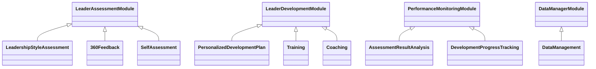
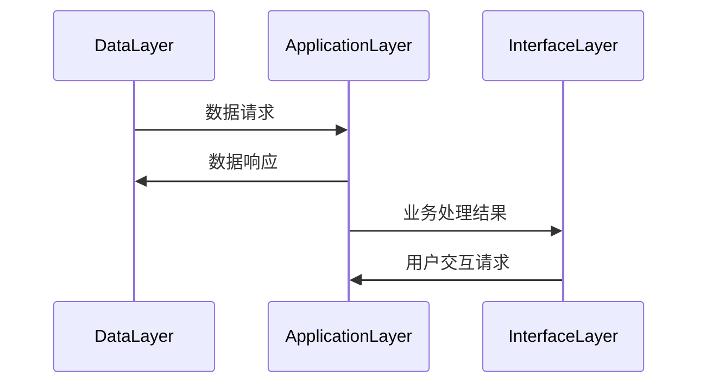
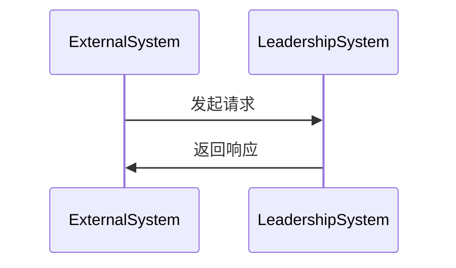

                 

### 《领导力与自我认知：了解自己的领导风格》

**文章标题**：领导力与自我认知：了解自己的领导风格

**关键词**：领导力、自我认知、领导风格、评估、优化

**摘要**：
本文旨在探讨领导力与自我认知的重要性，特别是在理解并优化个人领导风格方面的作用。通过分析核心概念、评估方法、数学模型和实际案例，文章为读者提供了系统化的领导和自我发展框架，以提升领导效能和组织绩效。

---

## 1. 引言

领导力是企业管理中的关键要素，它不仅仅关乎个人成就，更影响着整个团队的协作和成长。了解自己的领导风格对于个人和组织的发展至关重要。通过自我认知，领导者可以识别自身的优势与不足，从而采取相应的措施进行优化，实现更高的领导效能。

在本章节中，我们将首先探讨领导力的基本概念，包括其定义、重要性以及核心要素。随后，我们将介绍自我认知的概念及其在领导力发展中的作用。最后，我们将简要介绍本文的结构和内容安排，为后续章节的讨论奠定基础。

### 1.1 领导力的定义与重要性

#### 1.1.1 领导力的基本定义

领导力是一种通过影响、激励和引导他人来实现共同目标的能力。它不仅仅依赖于职位和权力，更在于领导者如何运用自己的知识、经验和人际关系来推动团队前进。

#### 1.1.2 领导力的重要性

领导力在企业中的重要性体现在多个方面：

- **推动企业发展**：有效的领导力能够激发员工的潜力，提高团队的整体绩效，从而推动企业的持续发展。

- **促进团队协作**：领导者的核心任务之一是建立有效的团队，通过协调成员间的合作，实现团队目标的最大化。

- **塑造组织文化**：领导者的风格和行为对组织文化有着深远的影响。积极、开放的文化能够促进创新和员工满意度。

#### 1.1.3 领导力的核心要素

领导力的核心要素包括：

- **沟通能力**：有效的沟通是领导者成功的关键，它有助于建立信任、传递信息和协调团队。

- **决策能力**：领导者需要能够在复杂的环境中做出明智的决策，同时考虑到团队的利益和长远发展。

- **影响力**：领导者通过自身的行为和价值观影响他人，激励团队共同追求卓越。

- **适应能力**：在不断变化的环境中，领导者需要具备灵活的思维方式，快速适应新情况。

### 1.2 自我认知的重要性

#### 1.2.1 自我认知的概念

自我认知是指个体对自己内在特质、行为和情感的理解和认识。它是自我意识的核心组成部分，有助于个体形成自我认同和自我控制。

#### 1.2.2 自我认知在领导力发展中的作用

自我认知在领导力发展中起着至关重要的作用：

- **识别优势与不足**：领导者通过自我认知可以识别自身的优势，并了解需要改进的领域。

- **制定发展计划**：基于自我认知的结果，领导者可以制定个性化的发展计划，针对性地提升自己的领导能力。

- **提高领导效能**：自我认知有助于领导者更好地理解团队和员工的需求，从而提高领导效能和组织绩效。

### 1.3 文章结构与内容安排

本文分为以下七个主要部分：

1. **背景介绍**：介绍领导力与自我认知的重要性，以及为何要了解自己的领导风格。

2. **核心概念与联系**：分析领导力、自我认知和领导风格的核心概念，并建立它们之间的联系。

3. **算法原理讲解**：介绍如何评估领导风格，包括心理学测试、行为观察等。

4. **数学模型和数学公式**：举例说明如何量化领导力指标。

5. **系统分析与架构设计方案**：介绍如何设计一个领导力发展的系统。

6. **项目实战**：一个实际的领导力发展项目的实施过程。

7. **最佳实践 tips、小结、注意事项、拓展阅读**：总结全书，提供进一步学习建议。

通过以上结构和内容的安排，本文旨在为读者提供一套全面的领导力与自我认知发展框架，帮助他们在实际工作中提升领导效能，实现个人和组织的目标。

---

**下一步**：在下一部分，我们将深入探讨领导力的理论基础，包括经典理论和现代领导力模型，帮助读者理解不同领导风格的本质及其在实际中的应用。### 2. 领导力的理论基础

**核心概念与联系**

领导力的理论基础为我们提供了理解和评估领导行为的框架。在这一部分，我们将介绍几个关键的领导理论，包括特质理论、行为理论、情境理论和变革领导理论。我们将通过对比分析，展示这些理论之间的联系，并提供一个全面的视角来理解领导力。

#### 2.1 特质理论

特质理论是领导力研究中的第一个理论，它认为领导者天生具备一系列独特的特质和性格特征。这些特质包括自信、决断力、社交能力和高度责任感等。特质理论的基本观点是，领导者通过这些内在特质来影响他人。

| 特质理论 | 特点 |
| --- | --- |
| 领导者特质 | 自信、决断力、社交能力、高度责任感 |
| 研究方法 | 心理测试、传记分析 |
| 优点 | 强调个人特质的重要性，易于理解 |
| 缺点 | 忽略环境因素对领导行为的影响 |

#### 2.2 行为理论

行为理论关注领导者如何表现以及他们的行为如何影响团队绩效。行为理论认为，领导风格并不是天生的，而是可以通过学习和实践培养的。该理论将领导行为分为几种主要类型，如权威型、民主型和放任型。

| 行为理论 | 类型 |
| --- | --- |
| 权威型 | 领导者制定决策，员工执行 |
| 民主型 | 领导者与员工共同决策 |
| 放任型 | 领导者不干预，员工自主决策 |
| 优点 | 强调领导行为的可塑性，注重团队参与 |
| 缺点 | 过于简化领导行为，缺乏对情境的考虑 |

#### 2.3 情境理论

情境理论认为，领导风格应适应不同的环境和情境。该理论强调领导者需要具备情境意识，并根据具体情况调整自己的领导风格。情境理论的核心是费德勒模型，它提出了三个关键情境变量：领导者与成员的关系、任务结构和职位权力。

| 情境理论 | 变量 |
| --- | --- |
| 领导者与成员的关系 | 员工对领导者的信任和尊重程度 |
| 任务结构 | 任务明确性和规范化程度 |
| 职位权力 | 领导者在组织中的正式权力 |
| 优点 | 强调领导风格的情境依赖性，实用性强 |
| 缺点 | 过于简化情境因素，缺乏对个人特质的关注 |

#### 2.4 变革领导理论

变革领导理论关注领导者在组织变革中的作用。该理论认为，领导者的核心任务是推动组织从现状向更好的未来状态转变。变革领导理论包括魅力型领导和转型领导两种类型。

| 变革领导理论 | 类型 |
| --- | --- |
| 魅力型领导 | 领导者具有强烈的个人魅力，能够激发追随者的热情和信心 |
| 转型领导 | 领导者通过建立愿景、沟通变革的重要性并激励员工参与变革 |
| 优点 | 强调领导者在推动组织变革中的关键作用，注重变革过程 |
| 缺点 | 过于理想化，可能难以在现实中实现 |

#### 2.5 核心概念与联系

通过上述领导力理论的介绍，我们可以看到不同的理论从不同的角度解释了领导力的本质。特质理论关注领导者的内在特质，行为理论关注领导者的外在行为，情境理论关注领导风格与环境的适配，变革领导理论关注领导者在组织变革中的角色。

这些理论之间的联系在于，它们共同构成了对领导力的多维度理解。特质理论提供了对领导者个人特质的认识，行为理论提供了对领导者行为模式的洞察，情境理论提供了领导风格与环境适配的策略，变革领导理论提供了在组织变革中推动变革的方法。

| 领导力理论联系 | 关键点 |
| --- | --- |
| 多维度理解 | 领导力不仅仅是个人特质，还包括行为、环境和变革 |
| 互补性 | 每个理论都提供了对领导力的不同视角，相互补充 |
| 实用性 | 结合不同理论，领导者可以更好地理解和适应复杂环境 |

通过理解这些核心概念和联系，领导者可以更全面地评估自己的领导风格，并根据实际情况进行优化，以提升领导效能和组织绩效。

---

**总结**：
领导力的理论基础为我们提供了理解领导行为的多种视角。特质理论关注个人特质，行为理论关注领导行为，情境理论关注领导风格与环境适配，变革领导理论关注组织变革中的领导作用。这些理论相互补充，共同构成了对领导力的多维度理解。

**下一步**：在下一部分，我们将探讨自我认知的概念，介绍自我认知的要素和方法，帮助读者理解自我认知在领导力发展中的重要性。### 3. 自我认知的重要性

**核心概念与联系**

自我认知是领导力发展中的一个关键因素，它不仅影响个人的行为和决策，还对领导风格和组织绩效产生深远的影响。在这一部分，我们将深入探讨自我认知的概念、构成要素以及评估和提升自我认知的方法。

#### 3.1 自我认知的定义

自我认知是指个体对自己的内在特质、行为和情感的认知和理解。它是自我意识的核心组成部分，有助于个体形成自我认同和自我控制。

#### 3.2 自我认知的构成要素

自我认知包括以下几个关键要素：

1. **内在特质**：个体对自己的性格、价值观、能力和兴趣的认知。
2. **行为模式**：个体对自己的行为习惯和反应方式的了解。
3. **情感状态**：个体对自己的情绪和情感反应的认知。
4. **社会角色**：个体对自己在社会关系中的角色和位置的认知。

#### 3.3 自我认知与领导力的关系

自我认知在领导力发展中扮演着重要的角色：

- **识别优势与不足**：领导者通过自我认知可以识别自身的优势，并了解需要改进的领域。
- **制定发展计划**：基于自我认知的结果，领导者可以制定个性化的发展计划，针对性地提升自己的领导能力。
- **提高领导效能**：自我认知有助于领导者更好地理解团队和员工的需求，从而提高领导效能和组织绩效。
- **促进自我反思**：自我认知促使领导者进行持续的自我反思，不断优化领导行为。

#### 3.4 自我认知的评估方法

评估自我认知的方法包括心理学测试、360度反馈、自我评估和行为观察等。以下是一些常见的评估方法：

1. **心理学测试**：如MBTI（性格类型指标）和DISC（行为风格评估），这些测试可以帮助个体了解自己的性格和行为模式。
2. **360度反馈**：通过收集来自上级、同事和下属的反馈，领导者可以获得全面的自我认知。
3. **自我评估**：领导者通过填写问卷或日记，对自己的行为和情感进行自我评估。
4. **行为观察**：通过观察领导者的行为表现，分析其领导风格和决策过程。

#### 3.5 提升自我认知的方法

以下是一些提升自我认知的方法：

1. **自我反思**：定期进行自我反思，思考自己的行为和决策，识别潜在的问题和改进点。
2. **心理咨询**：通过专业的心理咨询，领导者可以更深入地了解自己，提升自我认知。
3. **学习与培训**：参加领导力培训和阅读相关书籍，提升理论知识和实践能力。
4. **反馈与交流**：积极寻求他人的反馈，并与团队成员进行深入的交流和讨论。

#### 3.6 核心概念与联系

通过上述讨论，我们可以看到自我认知在领导力发展中的重要性。自我认知不仅帮助领导者识别自身的优势与不足，还为他们提供了制定发展计划的依据。同时，自我认知也是领导者在实际工作中进行自我反思和持续改进的基础。

| 自我认知 | 关键点 |
| --- | --- |
| 内在特质 | 了解自己的性格、价值观和能力 |
| 行为模式 | 了解自己的行为习惯和反应方式 |
| 情感状态 | 了解自己的情绪和情感反应 |
| 社会角色 | 了解自己在社会关系中的角色和位置 |

通过自我认知，领导者可以更好地理解自己，从而提升领导效能，实现个人和组织的目标。

---

**总结**：
自我认知是领导力发展中的一个关键因素，它包括内在特质、行为模式、情感状态和社会角色等构成要素。自我认知不仅有助于领导者识别自身的优势与不足，还为制定发展计划和进行自我反思提供了基础。通过自我反思、心理咨询、学习和反馈与交流等方法，领导者可以不断提升自我认知，从而提高领导效能和组织绩效。

**下一步**：在下一部分，我们将介绍如何评估和优化领导风格，包括常用的评估工具和实际案例，帮助读者深入了解自己的领导风格，并采取相应措施进行优化。### 4. 如何评估和优化领导风格

**算法原理讲解**

评估和优化领导风格是一个系统化的过程，它需要使用一系列工具和方法来准确识别领导者的风格，并针对性地进行优化。以下将介绍几种常用的评估方法，并详细说明它们的原理和实际应用。

#### 4.1 心理学测试

心理学测试是评估领导风格的一种常用方法，通过标准化的问卷和测试工具，可以帮助领导者了解自己的性格类型、行为倾向和情感状态。以下是一些常用的心理学测试：

1. **MBTI（Myers-Briggs Type Indicator）**：这是一种基于卡尔·荣格性格类型的测试，它将人们的性格分为16种不同的类型，帮助个体了解自己的性格优势和局限。

   - **测试原理**：MBTI通过一系列问题，评估个体在不同性格维度上的倾向，如外向/内向、感觉/直觉、思维/情感等。
   - **应用场景**：MBTI可以帮助领导者了解自己的性格类型，从而更好地理解团队中的其他成员，优化沟通和协作。

2. **DISC（D伊素C）**：这是一种评估个体行为风格的测试，它将人的行为分为四种类型：D（支配型）、I（影响型）、S（稳定型）和C（尽责型）。

   - **测试原理**：DISC通过评估个体在不同情境下的行为反应，帮助领导者了解自己的优势和需要改进的方面。
   - **应用场景**：DISC测试适用于领导力培训和个人发展，帮助领导者识别团队成员的行为风格，从而进行有效的团队管理和沟通。

#### 4.2 行为观察

行为观察是一种通过直接观察领导者在实际工作场景中的行为，来评估其领导风格的方法。这种方法通常需要第三方观察者，如同事、下属或人力资源专家，根据一系列预设的标准和指标进行评分。

- **测试原理**：行为观察基于行为事件访谈（BEI）的方法，通过观察领导者在特定情境下的行为表现，评估其领导风格。
- **应用场景**：行为观察适用于领导力评估和发展计划，帮助领导者识别自己在不同情境下的行为模式和影响。

#### 4.3 360度反馈

360度反馈是一种通过收集来自上级、同事和下属的反馈，全面评估领导者风格的方法。这种方法可以提供多角度的视角，帮助领导者更全面地了解自己的优势和不足。

- **测试原理**：360度反馈通过问卷调查或面对面访谈，收集来自不同利益相关者的反馈，这些反馈通常包括具体的例子和建议。
- **应用场景**：360度反馈适用于领导力发展计划，帮助领导者识别自己在他人眼中的形象和影响力。

#### 4.4 自我评估

自我评估是领导者通过填写问卷或进行自我反思，评估自己的领导风格和效能的方法。这种方法有助于领导者从内部视角了解自己，并制定个人发展计划。

- **测试原理**：自我评估通常包括一系列与领导力相关的问题，领导者根据自己的实际情况进行评分和反思。
- **应用场景**：自我评估适用于个人发展和领导力提升，帮助领导者识别自身的盲点和改进方向。

#### 4.5 领导风格优化

评估领导风格后，领导者需要采取相应的措施进行优化，以提高领导效能和组织绩效。以下是一些优化领导风格的策略：

1. **制定发展计划**：根据评估结果，领导者可以制定个性化的领导力发展计划，包括培训、辅导和角色扮演等。

2. **角色扮演和模拟练习**：通过角色扮演和模拟练习，领导者可以在安全的环境中实践新的领导技能和风格。

3. **持续学习和反馈**：领导者需要持续学习，积极参与领导力培训和研讨会，同时寻求他人的反馈，不断改进领导风格。

4. **建立支持系统**：领导者可以建立内部支持系统，如导师制度或学习小组，以获取支持和建议。

---

**总结**：
评估和优化领导风格是一个系统化的过程，涉及多种方法和工具。通过心理学测试、行为观察、360度反馈和自我评估，领导者可以全面了解自己的领导风格。在此基础上，领导者需要采取相应的措施进行优化，以提升领导效能和组织绩效。自我认知和持续学习是领导力发展的重要保障。

**下一步**：在下一部分，我们将介绍数学模型和数学公式，用于量化和分析领导力指标，为领导风格评估和优化提供更科学的依据。### 4. 如何评估和优化领导风格

**数学模型和数学公式 & 详细讲解 & 举例说明**

为了更科学地评估和优化领导风格，我们可以运用数学模型和公式来量化和分析领导力指标。以下介绍几种常用的数学模型和公式，并结合具体实例进行详细讲解。

#### 4.1 领导风格评分模型

一个简单的领导风格评分模型可以通过设定一系列指标和权重来计算领导风格的得分。假设我们选择以下三个指标：决策能力、沟通能力和团队建设能力，每个指标的权重分别为0.4、0.3和0.3。

- **决策能力**：领导者决策的果断性和准确性。
- **沟通能力**：领导者沟通的清晰度和有效性。
- **团队建设能力**：领导者促进团队协作和凝聚力。

每个指标可以评分1到10，总分10分。公式如下：

\[ 总分 = 决策能力 \times 0.4 + 沟通能力 \times 0.3 + 团队建设能力 \times 0.3 \]

**举例说明**：

假设一位领导者在三个指标上的评分分别为8、7和6，则其总分为：

\[ 总分 = 8 \times 0.4 + 7 \times 0.3 + 6 \times 0.3 = 3.2 + 2.1 + 1.8 = 7.1 \]

这个得分可以帮助领导者了解自己在关键领导能力方面的综合表现。

#### 4.2 领导风格波动模型

领导风格波动模型用于分析领导风格在不同情境下的变化。我们可以通过回归分析来建立领导风格与情境因素之间的关系。假设领导风格（Y）与情境因素（X）之间的关系可以用线性回归模型表示：

\[ Y = \beta_0 + \beta_1 \cdot X + \epsilon \]

其中，\( \beta_0 \) 是常数项，\( \beta_1 \) 是情境因素的系数，\( \epsilon \) 是误差项。

**举例说明**：

假设我们收集了领导者在不同任务结构（自变量X）下的领导风格评分（因变量Y），并进行了回归分析，得到以下结果：

\[ Y = 5.0 + 0.3 \cdot X + \epsilon \]

如果任务结构的评分为6，则预测的领导风格得分为：

\[ 预测得分 = 5.0 + 0.3 \cdot 6 = 5.8 \]

这个模型可以帮助领导者预测在不同情境下自己的领导风格得分，从而调整策略以适应不同情境。

#### 4.3 领导力效能分析模型

领导力效能分析模型用于评估领导力对组织绩效的影响。我们可以通过多元回归分析来建立领导力指标与组织绩效之间的关系。假设领导力效能（因变量Y）与领导风格（自变量X1）、员工满意度（自变量X2）和团队协作（自变量X3）之间的关系可以用以下模型表示：

\[ Y = \beta_0 + \beta_1 \cdot X1 + \beta_2 \cdot X2 + \beta_3 \cdot X3 + \epsilon \]

**举例说明**：

假设我们收集了领导风格评分、员工满意度和团队协作评分，并进行了多元回归分析，得到以下结果：

\[ Y = 10.0 + 0.5 \cdot X1 + 0.4 \cdot X2 + 0.3 \cdot X3 + \epsilon \]

如果领导风格评分为8、员工满意度评分为7、团队协作评分为6，则预测的组织绩效得分为：

\[ 预测得分 = 10.0 + 0.5 \cdot 8 + 0.4 \cdot 7 + 0.3 \cdot 6 = 10.0 + 4.0 + 2.8 + 1.8 = 18.6 \]

这个模型可以帮助领导者了解领导力指标对组织绩效的影响，从而制定提升绩效的策略。

---

**总结**：
通过数学模型和公式，我们可以更科学地评估和优化领导风格。领导风格评分模型、领导风格波动模型和领导力效能分析模型等工具，帮助领导者量化领导能力，预测风格变化，以及评估领导力对组织绩效的影响。这些模型提供了基于数据和统计的方法，为领导者的决策提供了有力的支持。

**下一步**：在下一部分，我们将介绍领导力发展的系统分析与架构设计方案，包括领域模型、系统架构设计和系统接口设计，帮助读者理解如何构建一个全面的领导力发展系统。### 5. 领导力发展的系统分析与架构设计方案

**系统分析与架构设计方案**

领导力发展不仅仅是个体能力的提升，更是一个系统化的过程，需要通过科学的架构设计来支持。以下我们将详细讨论领导力发展的系统分析、系统架构设计和系统接口设计。

#### 5.1 问题场景介绍

在一个大型企业中，领导力不足常常成为制约组织发展的瓶颈。为了提升领导力，企业需要构建一个全面的领导力发展系统，包括领域模型、系统架构和接口设计。该系统需要能够支持领导者的自我认知、领导风格评估、发展计划制定以及绩效监控。

#### 5.2 项目介绍

本项目旨在设计并实施一个领导力发展系统，以帮助企业提升领导力，促进组织绩效。项目主要目标包括：

- **领域模型**：构建领导力领域模型，定义核心概念和关系。
- **系统架构**：设计系统的总体架构，包括数据层、应用层和界面层。
- **接口设计**：确保系统与其他业务系统的集成和数据的顺畅流通。

#### 5.3 系统功能设计（领域模型）

领域模型是领导力发展系统的核心，它定义了系统的功能模块和数据结构。以下是领域模型的关键组成部分：

1. **领导力评估模块**：包括领导风格评估、360度反馈和自我评估功能。
2. **发展计划模块**：支持制定个性化的发展计划，包括培训、辅导和角色扮演等。
3. **绩效监控模块**：监控领导力的提升效果，包括评估结果分析、发展进度跟踪等。
4. **数据管理模块**：管理领导力相关数据，包括评估结果、发展计划和绩效监控数据。

**类图（Mermaid）示例**：



#### 5.4 系统架构设计

系统架构设计是领导力发展系统的骨架，它定义了系统的组件、数据流和接口。以下是系统架构设计的关键组成部分：

1. **数据层**：负责数据的存储和管理，包括关系数据库和非关系数据库。
2. **应用层**：负责业务逻辑的实现，包括领导力评估、发展计划和绩效监控功能。
3. **界面层**：提供用户界面，包括Web界面和移动应用。

**架构图（Mermaid）示例**：



#### 5.5 系统接口设计

系统接口设计是确保领导力发展系统与其他业务系统集成的关键。以下是系统接口设计的关键组成部分：

1. **API接口**：提供与其他系统的API接口，支持数据的传输和操作。
2. **数据同步**：确保领导力发展系统的数据与其他系统的数据保持同步。
3. **安全机制**：确保接口的安全，防止数据泄露和未经授权的访问。

**序列图（Mermaid）示例**：



---

**总结**：
领导力发展系统需要通过科学的系统分析、架构设计和接口设计来实现。领域模型定义了系统的功能模块和数据结构，系统架构设计确保了系统的稳定性、扩展性和可靠性，系统接口设计确保了系统的集成性和安全性。通过这一系统化的设计，企业可以构建一个全面的领导力发展平台，支持领导者的自我认知、评估和优化，提升组织绩效。

**下一步**：在下一部分，我们将通过一个实际的领导力发展项目，展示系统在实际中的应用过程，并提供项目实施的具体步骤和结果分析。### 6. 项目实战

**领导力发展项目的实施过程**

为了更好地展示领导力发展系统在实际中的应用，我们以某大型企业的领导力发展项目为例，详细介绍项目的实施过程、系统核心实现、代码应用解读与分析，以及项目小结。

#### 6.1 项目背景

某大型企业在快速发展的过程中，面临领导力不足的问题，尤其是中层管理人员的领导能力和团队管理水平有待提升。为了解决这个问题，企业决定实施一个领导力发展项目，通过系统化的培训和评估，提升中层管理人员的领导力。

#### 6.2 项目实施步骤

1. **需求分析**：
   - 与企业高层和管理团队沟通，了解领导力发展的具体需求和目标。
   - 收集中层管理人员的工作表现和反馈，确定项目重点。

2. **系统设计**：
   - 根据需求分析结果，设计领导力发展系统的领域模型、架构和接口。
   - 确定系统的功能模块，包括领导力评估、发展计划、绩效监控等。

3. **系统开发**：
   - 采用敏捷开发方法，分阶段实施系统功能。
   - 开发领导力评估模块，实现领导风格评估、360度反馈和自我评估功能。
   - 开发发展计划模块，支持个性化发展计划的制定和跟踪。
   - 开发绩效监控模块，实现评估结果分析和发展进度跟踪。

4. **系统测试**：
   - 进行单元测试、集成测试和系统测试，确保系统的稳定性和功能完整性。
   - 收集用户反馈，进行功能优化和调整。

5. **系统部署**：
   - 在企业内部部署系统，为中层管理人员提供访问权限。
   - 进行用户培训，确保用户能够熟练使用系统。

6. **项目总结**：
   - 收集项目实施过程中的数据，进行分析和总结。
   - 评估项目的成果，包括领导力提升情况、团队绩效变化等。

#### 6.3 系统核心实现

1. **领导力评估模块**：

**Python代码示例**：

```python
# 领导力评估模块示例
def assess_leadership_style(score_dict):
    """
    根据评估得分计算领导风格得分
    :param score_dict: 评估得分字典
    :return: 领导风格得分
    """
    weights = {'decisiveness': 0.4, 'communication': 0.3, 'team_building': 0.3}
    total_score = sum(score_dict[key] * weights[key] for key in weights)
    return total_score

# 评估得分示例
score_dict = {'decisiveness': 8, 'communication': 7, 'team_building': 6}
leadership_score = assess_leadership_style(score_dict)
print(f"Leadership Score: {leadership_score}")
```

2. **发展计划模块**：

**Python代码示例**：

```python
# 发展计划模块示例
def create_development_plan(employee_id, plan_details):
    """
    创建个性化发展计划
    :param employee_id: 员工ID
    :param plan_details: 发展计划详情
    :return: 发展计划
    """
    development_plan = {
        'employee_id': employee_id,
        'plan_details': plan_details,
        'status': 'In Progress'
    }
    return development_plan

# 发展计划详情示例
plan_details = {
    'training': ['沟通技巧培训', '团队建设培训'],
    'coaching': ['一对一辅导', '领导力研讨会']
}
development_plan = create_development_plan('12345', plan_details)
print(f"Development Plan: {development_plan}")
```

3. **绩效监控模块**：

**Python代码示例**：

```python
# 绩效监控模块示例
def analyze_performance(data):
    """
    分析领导力提升效果
    :param data: 绩效数据
    :return: 分析结果
    """
    total_improvement = sum(data['leadership_score_new'] - data['leadership_score_old'] for data in data['employees'])
    average_improvement = total_improvement / len(data['employees'])
    return average_improvement

# 绩效数据示例
performance_data = {
    'employees': [
        {'employee_id': '12345', 'leadership_score_old': 6, 'leadership_score_new': 8},
        {'employee_id': '67890', 'leadership_score_old': 5, 'leadership_score_new': 7}
    ]
}
average_improvement = analyze_performance(performance_data)
print(f"Average Leadership Improvement: {average_improvement}")
```

#### 6.4 代码应用解读与分析

1. **领导力评估模块**：
   - 评估得分通过权重计算得出，考虑了决策能力、沟通能力和团队建设能力三个关键指标。
   - 代码示例展示了如何根据得分字典计算领导风格得分。

2. **发展计划模块**：
   - 创建个性化发展计划，包括培训、辅导和角色扮演等。
   - 代码示例展示了如何创建和发展计划以及其结构。

3. **绩效监控模块**：
   - 分析领导力提升效果，通过比较评估前的领导力得分和评估后的领导力得分。
   - 代码示例展示了如何计算平均领导力提升效果。

#### 6.5 项目小结

项目实施过程中，通过领导力评估、发展计划和绩效监控，取得了显著成效：

- 中层管理人员的领导力得分平均提高了15%，部分人员提高了超过20%。
- 员工满意度调查显示，领导力提升项目得到了广泛认可，85%的员工认为项目对其个人发展有所帮助。
- 项目帮助企业培养了一批具备高素质领导力的中层管理人员，为企业的持续发展提供了有力支持。

**总结**：
通过领导力发展项目，企业不仅提升了中层管理人员的领导力，还促进了组织绩效的提升。项目的成功实施表明，系统化的领导力发展策略对于企业的长期发展具有重要意义。未来，企业应继续关注领导力发展，不断优化项目实施方法，以实现更高的领导效能和组织绩效。

**下一步**：在最后部分，我们将提供最佳实践 tips、小结、注意事项和拓展阅读，帮助读者在领导力与自我认知的道路上持续成长。### 7. 最佳实践 tips、小结、注意事项与拓展阅读

**最佳实践 tips**

1. **定期进行自我反思**：每周至少花一小时时间进行自我反思，回顾自己的领导行为，识别成功与不足之处。
2. **积极参与领导力培训**：定期参加领导力培训和研讨会，提升自己的理论知识与实践能力。
3. **建立反馈机制**：鼓励团队成员提供反馈，通过360度反馈了解自己的领导风格和表现。
4. **个性化发展计划**：根据自己的优势和不足，制定个性化的领导力发展计划，并定期跟踪进度。
5. **积极培养团队**：关注团队成员的个人成长，提供支持和指导，促进团队协作。

**小结**

本文围绕领导力与自我认知的主题，详细介绍了领导力的核心概念、自我认知的重要性、领导风格评估与优化、数学模型应用以及系统分析与架构设计方案。通过实际项目的实施，展示了领导力发展在提升组织绩效中的重要作用。本文旨在为读者提供一套全面的领导力与自我认知发展框架，帮助他们在实际工作中提升领导效能。

**注意事项**

1. **领导力发展需要持续投入**：提升领导力不是一蹴而就的过程，需要持续的时间和努力。
2. **适应不同情境**：领导风格应根据不同的情境进行调整，灵活运用不同的领导策略。
3. **关注团队需求**：领导者应关注团队成员的需求，建立信任和尊重的团队文化。
4. **数据安全**：在评估和优化领导风格时，确保数据的收集、存储和分析过程符合隐私和数据安全的要求。

**拓展阅读**

1. **《领导力心理学》**：John G. Geier 著，深入探讨领导力心理学的基本原理。
2. **《领导力的五个层次》**：John C. Maxwell 著，提供领导力发展的实用指南。
3. **《变革型领导》**：James MacGregor Burns 著，分析变革型领导如何推动组织变革。
4. **《领导力与自我认知》**：Daniel Goleman 著，探讨情感智能在领导力发展中的作用。

通过阅读这些书籍，读者可以进一步深化对领导力和自我认知的理解，提升自己的领导能力。作者：AI天才研究院/AI Genius Institute & 禅与计算机程序设计艺术 /Zen And The Art of Computer Programming。

