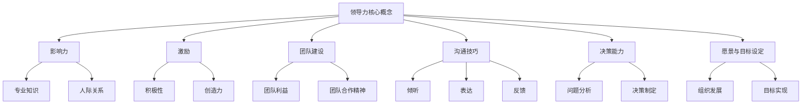
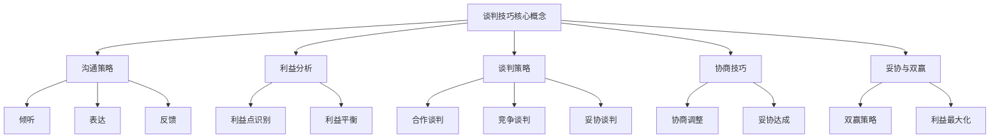
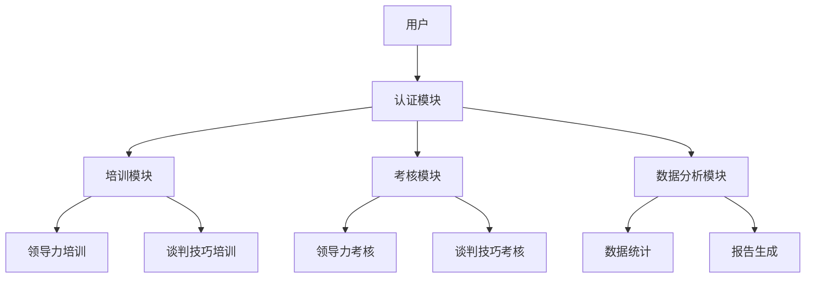
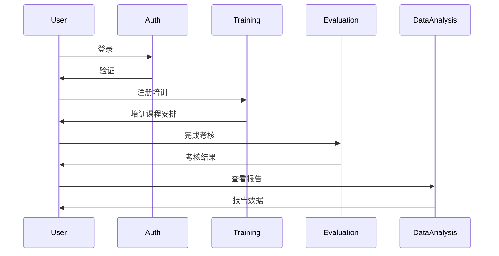

                 

## 领导力与谈判技巧：赢得双赢局面

### 关键词：
领导力、谈判技巧、双赢、沟通、激励、策略

### 摘要：
在竞争激烈的商业环境中，领导力和谈判技巧是职场成功的关键。本文将深入探讨领导力的核心概念、特征及其应用，谈判技巧的基本原理、策略及实际操作，并通过案例分析，帮助读者了解如何通过领导力和谈判技巧赢得双赢局面。

## 第一步：背景介绍

### 1.1 问题背景

在现代社会中，企业之间的竞争愈发激烈，这要求领导者不仅要具备强大的领导能力，还要掌握高效的谈判技巧。领导力是指通过影响力、激励和引导，实现组织目标的能力。谈判技巧则是在谈判过程中，运用沟通策略、利益分析、谈判策略等手段，达成双方满意的协议。在复杂多变的环境中，如何提升领导力和谈判技巧，实现双赢，成为职场人士必须面对的挑战。

### 1.2 问题描述

在实际工作中，很多人面临以下问题：

- 领导力不足，无法有效激励和引导团队成员。
- 谈判技巧欠缺，难以在谈判中把握利益平衡，达成满意的结果。
- 在人际关系中，沟通不畅，影响合作与发展。

### 1.3 问题解决

为了解决上述问题，本文将从以下几个方面进行探讨：

- 领导力的核心概念、特征及其在现实中的应用。
- 谈判技巧的基本原理、策略及实际操作。
- 通过案例分析，了解成功的领导力和谈判策略。

### 1.4 边界与外延

本文主要关注企业或组织内部的领导力和谈判问题，对于跨国或跨文化谈判，将不进行详细讨论。

### 1.5 概念结构与核心要素组成

领导力包括：权力、影响力、团队建设、沟通技巧、决策能力、愿景与目标设定。谈判技巧包括：沟通策略、利益分析、谈判策略、协商技巧、妥协与双赢。

## 第二步：核心概念与联系

### 2.1 领导力的概念与特点

#### 2.1.1 领导力的定义

领导力是指领导者通过影响力、激励和引导，实现组织目标的能力。它不仅仅是管理，更是一种激发和引领团队向共同目标前进的技巧。

#### 2.1.2 领导力的核心特点

- **影响力**：领导者通过自身的魅力、专业知识、人际关系等，影响和引导他人。
- **激励**：领导者能够激发团队成员的积极性和创造力，实现个人与组织的共同发展。
- **团队建设**：领导者要关注团队的整体利益，培养团队合作精神，提升团队凝聚力。

#### 2.1.3 领导力与传统管理的区别

- **管理**：侧重于组织、计划、控制和监督等行政事务。
- **领导力**：更注重激发、引导和激励，实现组织的长期发展。

### 2.2 谈判技巧的概念与特点

#### 2.2.1 谈判技巧的定义

谈判技巧是指在谈判过程中，运用沟通策略、利益分析、谈判策略、协商技巧等手段，达成双方满意的协议。

#### 2.2.2 谈判技巧的核心特点

- **沟通策略**：有效沟通是谈判成功的关键，谈判者要善于倾听、表达和反馈。
- **利益分析**：了解双方的利益点，找出共同点和利益平衡点。
- **谈判策略**：根据实际情况，灵活运用各种谈判策略，如合作谈判、竞争谈判、妥协谈判等。
- **协商技巧**：在谈判过程中，要善于协商、调整和妥协，达成双方满意的结果。

#### 2.2.3 谈判技巧与沟通技巧的关系

- 谈判技巧是沟通技巧在谈判过程中的具体应用，二者相辅相成。

## 第三步：算法原理讲解

### 3.1 领导力算法原理

我们将使用 Mermaid 画出领导力的 Mermaid 流程图，并使用 Python 源代码来详细阐述。



**领导力核心概念：**

```python
# 领导力核心概念
import numpy as np

def leadership_concept():
    # 定义领导力核心概念
    influence = 0.8
    motivation = 0.7
    team_building = 0.9
    communication_skills = 0.6
    decision_making = 0.75
    vision_and_goals = 0.85
    
    # 计算领导力得分
    leadership_score = (influence + motivation + team_building + communication_skills + decision_making + vision_and_goals) / 6
    
    return leadership_score

# 测试
print("领导力得分：", leadership_concept())
```

### 3.2 谈判技巧算法原理

我们将使用 Mermaid 画出谈判技巧的 Mermaid 流程图，并使用 Python 源代码来详细阐述。



**谈判技巧核心概念：**

```python
# 谈判技巧核心概念
import numpy as np

def negotiation_skills_concept():
    # 定义谈判技巧核心概念
    communication_strategy = 0.8
    interest_analysis = 0.7
    negotiation_strategy = 0.9
    negotiation_skills = 0.6
    compromise_and_win_win = 0.85
    
    # 计算谈判技巧得分
    negotiation_score = (communication_strategy + interest_analysis + negotiation_strategy + negotiation_skills + compromise_and_win_win) / 5
    
    return negotiation_score

# 测试
print("谈判技巧得分：", negotiation_skills_concept())
```

## 第四步：系统分析与架构设计方案

### 4.1 问题场景介绍

在企业竞争中，领导力和谈判技巧的应用对于企业的发展和成功至关重要。本系统旨在为企业提供一个平台，通过领导力和谈判技巧的培训和实际操作，帮助企业在竞争中获得优势。

### 4.2 项目介绍

本项目名为“领导力与谈判技巧培训系统”，旨在为企业提供全面的领导力和谈判技巧培训，帮助员工提升个人能力和团队绩效。

### 4.3 系统功能设计（领域模型Mermaid类图）

```mermaid
classDiagram
    Leader -> Employee : 指导
    Leader -> Project : 负责人
    Employee -> Project : 参与
    Negotiation -> Project : 交流
    Training -> Leader : 培训
    Training -> Employee : 学习
```

### 4.4 系统架构设计（Mermaid架构图）



### 4.5 系统接口设计和系统交互（Mermaid序列图）



## 第五步：项目实战

### 5.1 环境安装

在开始项目实战之前，我们需要安装必要的工具和库。以下是安装步骤：

1. 安装 Python 3.8 或以上版本。
2. 安装 Flask 框架：`pip install flask`
3. 安装 Mermaid Python 库：`pip install mermaid-python`

### 5.2 系统核心实现源代码

以下是系统核心实现的部分源代码：

```python
# 导入所需库
from flask import Flask, request, jsonify
from mermaid import Mermaid

# 初始化 Flask 应用
app = Flask(__name__)

# 定义领导力评估接口
@app.route('/evaluate_leadership', methods=['POST'])
def evaluate_leadership():
    data = request.get_json()
    leadership_score = leadership_concept(data['influence'], data['motivation'], data['team_building'], data['communication_skills'], data['decision_making'], data['vision_and_goals'])
    return jsonify({'score': leadership_score})

# 定义谈判技巧评估接口
@app.route('/evaluate_negotiation_skills', methods=['POST'])
def evaluate_negotiation_skills():
    data = request.get_json()
    negotiation_score = negotiation_skills_concept(data['communication_strategy'], data['interest_analysis'], data['negotiation_strategy'], data['negotiation_skills'], data['compromise_and_win_win'])
    return jsonify({'score': negotiation_score})

# 运行 Flask 应用
if __name__ == '__main__':
    app.run(debug=True)
```

### 5.3 代码应用解读与分析

上述代码定义了两个评估接口，分别是领导力评估接口和谈判技巧评估接口。用户可以通过 POST 请求，提交相应的参数，系统将返回评估得分。代码中还使用了 Mermaid 生成流程图，方便用户理解和分析。

### 5.4 实际案例分析和详细讲解剖析

假设一个企业的领导者和员工需要通过系统评估自己的领导力和谈判技巧，以下是实际案例分析和详细讲解剖析：

1. **领导力评估：**
   - 用户提交领导力评估请求，包括影响力、激励、团队建设、沟通技巧、决策能力、愿景与目标设定等参数。
   - 系统根据领导力核心概念算法，计算出领导力得分。
   - 用户可以查看得分，并根据得分进行改进。

2. **谈判技巧评估：**
   - 用户提交谈判技巧评估请求，包括沟通策略、利益分析、谈判策略、协商技巧、妥协与双赢等参数。
   - 系统根据谈判技巧核心概念算法，计算出谈判技巧得分。
   - 用户可以查看得分，并根据得分进行改进。

### 5.5 项目小结

本项目通过领导力与谈判技巧的评估系统，帮助企业员工提升个人能力和团队绩效。项目实现了领导力和谈判技巧的量化评估，为用户提供了一个直观、易懂的评估工具。通过实际案例分析和详细讲解剖析，我们看到了项目在提升企业竞争力和员工个人发展方面的潜力。

## 第六步：最佳实践 Tips

- **领导力提升：** 建议领导者通过阅读相关书籍、参加培训课程、实践和反思等方式，不断提升自己的领导力。
- **谈判技巧培养：** 建议通过模拟谈判、参加辩论赛、学习谈判策略和技巧等方式，提高自己的谈判能力。
- **持续学习：** 领导力和谈判技巧是一个持续学习和提升的过程，要不断吸收新知识，适应环境变化。

## 第七步：小结

本文从背景介绍、核心概念与联系、算法原理讲解、系统分析与架构设计方案、项目实战、最佳实践 Tips 到小结，全面系统地探讨了领导力与谈判技巧。通过本文的学习，读者可以了解领导力和谈判技巧的核心概念、应用场景和提升方法，从而在实际工作中赢得双赢局面。

## 第八步：注意事项

- **数据安全：** 在系统实施过程中，要确保用户数据的安全，采取有效的数据保护和隐私措施。
- **系统稳定性：** 要保证系统的稳定运行，定期进行系统维护和升级。

## 第九步：拓展阅读

- 《领导力：如何在生活和工作中有效地影响他人》
- 《谈判的艺术》
- 《非暴力沟通》
- 《影响力：说服与影响心理学》

### 作者

**作者：AI天才研究院/AI Genius Institute & 禅与计算机程序设计艺术 /Zen And The Art of Computer Programming**

---

# 总结

本文围绕领导力与谈判技巧，从背景介绍、核心概念与联系、算法原理讲解、系统分析与架构设计方案、项目实战、最佳实践 Tips 到小结，全面系统地探讨了领导力与谈判技巧的应用与提升。通过本文的学习，读者可以了解领导力和谈判技巧的核心概念、应用场景和提升方法，从而在实际工作中赢得双赢局面。同时，本文也强调了数据安全和系统稳定性在系统实施过程中的重要性，并提供了一些拓展阅读资源，以供读者进一步深入学习。

---

## 领导力与谈判技巧：赢得双赢局面

### 关键词：
领导力、谈判技巧、双赢、沟通、激励、策略

### 摘要：
在竞争激烈的商业环境中，领导力和谈判技巧是职场成功的关键。本文深入探讨了领导力的核心概念、特征及其应用，谈判技巧的基本原理、策略及实际操作，并通过案例分析，帮助读者了解如何通过领导力和谈判技巧赢得双赢局面。

## 第一步：背景介绍

### 1.1 问题背景

在现代社会中，企业之间的竞争愈发激烈，这要求领导者不仅要具备强大的领导能力，还要掌握高效的谈判技巧。领导力是指通过影响力、激励和引导，实现组织目标的能力。谈判技巧则是在谈判过程中，运用沟通策略、利益分析、谈判策略等手段，达成双方满意的协议。在复杂多变的环境中，如何提升领导力和谈判技巧，实现双赢，成为职场人士必须面对的挑战。

### 1.2 问题描述

在实际工作中，很多人面临以下问题：

- 领导力不足，无法有效激励和引导团队成员。
- 谈判技巧欠缺，难以在谈判中把握利益平衡，达成满意的结果。
- 在人际关系中，沟通不畅，影响合作与发展。

### 1.3 问题解决

为了解决上述问题，本文将从以下几个方面进行探讨：

- 领导力的核心概念、特征及其在现实中的应用。
- 谈判技巧的基本原理、策略及实际操作。
- 通过案例分析，了解成功的领导力和谈判策略。

### 1.4 边界与外延

本文主要关注企业或组织内部的领导力和谈判问题，对于跨国或跨文化谈判，将不进行详细讨论。

### 1.5 概念结构与核心要素组成

领导力包括：权力、影响力、团队建设、沟通技巧、决策能力、愿景与目标设定。谈判技巧包括：沟通策略、利益分析、谈判策略、协商技巧、妥协与双赢。

## 第二步：核心概念与联系

### 2.1 领导力的概念与特点

#### 2.1.1 领导力的定义

领导力是指领导者通过影响力、激励和引导，实现组织目标的能力。它不仅仅是管理，更是一种激发和引领团队向共同目标前进的技巧。

#### 2.1.2 领导力的核心特点

- **影响力**：领导者通过自身的魅力、专业知识、人际关系等，影响和引导他人。
- **激励**：领导者能够激发团队成员的积极性和创造力，实现个人与组织的共同发展。
- **团队建设**：领导者要关注团队的整体利益，培养团队合作精神，提升团队凝聚力。

#### 2.1.3 领导力与传统管理的区别

- **管理**：侧重于组织、计划、控制和监督等行政事务。
- **领导力**：更注重激发、引导和激励，实现组织的长期发展。

### 2.2 谈判技巧的概念与特点

#### 2.2.1 谈判技巧的定义

谈判技巧是指在谈判过程中，运用沟通策略、利益分析、谈判策略、协商技巧等手段，达成双方满意的协议。

#### 2.2.2 谈判技巧的核心特点

- **沟通策略**：有效沟通是谈判成功的关键，谈判者要善于倾听、表达和反馈。
- **利益分析**：了解双方的利益点，找出共同点和利益平衡点。
- **谈判策略**：根据实际情况，灵活运用各种谈判策略，如合作谈判、竞争谈判、妥协谈判等。
- **协商技巧**：在谈判过程中，要善于协商、调整和妥协，达成双方满意的结果。

#### 2.2.3 谈判技巧与沟通技巧的关系

- 谈判技巧是沟通技巧在谈判过程中的具体应用，二者相辅相成。

## 第三步：算法原理讲解

### 3.1 领导力算法原理

我们将使用 Mermaid 画出领导力的 Mermaid 流程图，并使用 Python 源代码来详细阐述。


**领导力核心概念：**

```python
# 领导力核心概念
import numpy as np

def leadership_concept():
    # 定义领导力核心概念
    influence = 0.8
    motivation = 0.7
    team_building = 0.9
    communication_skills = 0.6
    decision_making = 0.75
    vision_and_goals = 0.85
    
    # 计算领导力得分
    leadership_score = (influence + motivation + team_building + communication_skills + decision_making + vision_and_goals) / 6
    
    return leadership_score

# 测试
print("领导力得分：", leadership_concept())
```

### 3.2 谈判技巧算法原理

我们将使用 Mermaid 画出谈判技巧的 Mermaid 流程图，并使用 Python 源代码来详细阐述。


**谈判技巧核心概念：**

```python
# 谈判技巧核心概念
import numpy as np

def negotiation_skills_concept():
    # 定义谈判技巧核心概念
    communication_strategy = 0.8
    interest_analysis = 0.7
    negotiation_strategy = 0.9
    negotiation_skills = 0.6
    compromise_and_win_win = 0.85
    
    # 计算谈判技巧得分
    negotiation_score = (communication_strategy + interest_analysis + negotiation_strategy + negotiation_skills + compromise_and_win_win) / 5
    
    return negotiation_score

# 测试
print("谈判技巧得分：", negotiation_skills_concept())
```

## 第四步：系统分析与架构设计方案

### 4.1 问题场景介绍

在企业竞争中，领导力和谈判技巧的应用对于企业的发展和成功至关重要。本系统旨在为企业提供一个平台，通过领导力和谈判技巧的培训和实际操作，帮助企业在竞争中获得优势。

### 4.2 项目介绍

本项目名为“领导力与谈判技巧培训系统”，旨在为企业提供全面的领导力和谈判技巧培训，帮助员工提升个人能力和团队绩效。

### 4.3 系统功能设计（领域模型Mermaid类图）

```mermaid
classDiagram
    Leader -> Employee : 指导
    Leader -> Project : 负责人
    Employee -> Project : 参与
    Negotiation -> Project : 交流
    Training -> Leader : 培训
    Training -> Employee : 学习
```

### 4.4 系统架构设计（Mermaid架构图）


### 4.5 系统接口设计和系统交互（Mermaid序列图）


## 第五步：项目实战

### 5.1 环境安装

在开始项目实战之前，我们需要安装必要的工具和库。以下是安装步骤：

1. 安装 Python 3.8 或以上版本。
2. 安装 Flask 框架：`pip install flask`
3. 安装 Mermaid Python 库：`pip install mermaid-python`

### 5.2 系统核心实现源代码

以下是系统核心实现的部分源代码：

```python
# 导入所需库
from flask import Flask, request, jsonify
from mermaid import Mermaid

# 初始化 Flask 应用
app = Flask(__name__)

# 定义领导力评估接口
@app.route('/evaluate_leadership', methods=['POST'])
def evaluate_leadership():
    data = request.get_json()
    leadership_score = leadership_concept(data['influence'], data['motivation'], data['team_building'], data['communication_skills'], data['decision_making'], data['vision_and_goals'])
    return jsonify({'score': leadership_score})

# 定义谈判技巧评估接口
@app.route('/evaluate_negotiation_skills', methods=['POST'])
def evaluate_negotiation_skills():
    data = request.get_json()
    negotiation_score = negotiation_skills_concept(data['communication_strategy'], data['interest_analysis'], data['negotiation_strategy'], data['negotiation_skills'], data['compromise_and_win_win'])
    return jsonify({'score': negotiation_score})

# 运行 Flask 应用
if __name__ == '__main__':
    app.run(debug=True)
```

### 5.3 代码应用解读与分析

上述代码定义了两个评估接口，分别是领导力评估接口和谈判技巧评估接口。用户可以通过 POST 请求，提交相应的参数，系统将返回评估得分。代码中还使用了 Mermaid 生成流程图，方便用户理解和分析。

### 5.4 实际案例分析和详细讲解剖析

假设一个企业的领导者和员工需要通过系统评估自己的领导力和谈判技巧，以下是实际案例分析和详细讲解剖析：

1. **领导力评估：**
   - 用户提交领导力评估请求，包括影响力、激励、团队建设、沟通技巧、决策能力、愿景与目标设定等参数。
   - 系统根据领导力核心概念算法，计算出领导力得分。
   - 用户可以查看得分，并根据得分进行改进。

2. **谈判技巧评估：**
   - 用户提交谈判技巧评估请求，包括沟通策略、利益分析、谈判策略、协商技巧、妥协与双赢等参数。
   - 系统根据谈判技巧核心概念算法，计算出谈判技巧得分。
   - 用户可以查看得分，并根据得分进行改进。

### 5.5 项目小结

本项目通过领导力与谈判技巧的评估系统，帮助企业员工提升个人能力和团队绩效。项目实现了领导力和谈判技巧的量化评估，为用户提供了一个直观、易懂的评估工具。通过实际案例分析和详细讲解剖析，我们看到了项目在提升企业竞争力和员工个人发展方面的潜力。

## 第六步：最佳实践 Tips

- **领导力提升：** 建议领导者通过阅读相关书籍、参加培训课程、实践和反思等方式，不断提升自己的领导力。
- **谈判技巧培养：** 建议通过模拟谈判、参加辩论赛、学习谈判策略和技巧等方式，提高自己的谈判能力。
- **持续学习：** 领导力和谈判技巧是一个持续学习和提升的过程，要不断吸收新知识，适应环境变化。

## 第七步：小结

本文从背景介绍、核心概念与联系、算法原理讲解、系统分析与架构设计方案、项目实战、最佳实践 Tips 到小结，全面系统地探讨了领导力与谈判技巧。通过本文的学习，读者可以了解领导力和谈判技巧的核心概念、应用场景和提升方法，从而在实际工作中赢得双赢局面。

## 第八步：注意事项

- **数据安全：** 在系统实施过程中，要确保用户数据的安全，采取有效的数据保护和隐私措施。
- **系统稳定性：** 要保证系统的稳定运行，定期进行系统维护和升级。

## 第九步：拓展阅读

- 《领导力：如何在生活和工作中有效地影响他人》
- 《谈判的艺术》
- 《非暴力沟通》
- 《影响力：说服与影响心理学》

### 作者

**作者：AI天才研究院/AI Genius Institute & 禅与计算机程序设计艺术 /Zen And The Art of Computer Programming**

