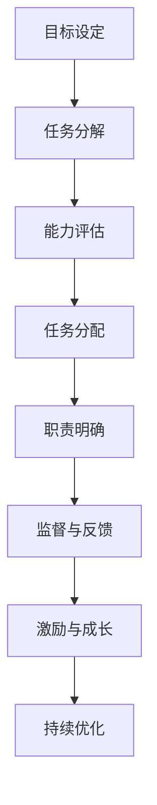

                 

### 引言：领导力与责任委派的必要性

领导力与责任委派是企业管理中至关重要的一环。一个优秀的领导者不仅需要具备卓越的领导能力，还必须学会如何有效地委派任务和分配责任。在现代企业中，高效的任务分配不仅能够提高团队的工作效率，还能促进团队成员的个人成长和职业发展。

首先，领导力是指引导和激励团队成员实现共同目标的能力。领导力不仅包括权威性的管理，还涵盖了影响力、沟通能力和团队建设等多个方面。一个领导者若能有效地运用领导力，就能在团队中建立起信任、尊重和协作的氛围，从而推动团队整体向前发展。

责任委派则是领导力的重要体现之一。合理的责任委派能够确保任务的顺利完成，同时也能够激发团队成员的积极性和创造力。通过委派任务，领导者可以将自己的精力集中在更为关键的决策和战略层面，从而提高整体的工作效率和决策质量。

本篇文章将围绕领导力与责任委派的主题，深入探讨以下几个核心问题：

1. **领导力的定义与作用**：首先，我们将介绍领导力的基本定义，并分析其在企业管理和团队运作中的作用。
2. **责任委派的含义与重要性**：接下来，我们将详细解释责任委派的概念，并探讨其在提升工作效率和团队绩效方面的作用。
3. **领导力与责任委派的联系**：本文还将探讨领导力与责任委派之间的紧密联系，并阐述如何在实践中将两者有机结合。
4. **领导力与责任委派的核心概念**：我们将介绍领导力和责任委派的核心概念，并分析其相互关系和作用机制。
5. **领导力与责任委派的框架**：本文还将提供一个实用的领导力与责任委派框架，帮助读者更好地理解和实践这两个概念。

通过本文的探讨，我们希望能够帮助读者深入了解领导力与责任委派的重要性和应用方法，从而提升个人和团队的管理能力，实现企业的持续发展和成功。

### 领导力的定义与作用

领导力是一种复杂的综合能力，它不仅仅是指导和管理团队的能力，更是一种影响和激励他人共同实现目标的能力。在企业管理中，领导力扮演着至关重要的角色，它不仅能够推动企业的发展，还能够提升员工的积极性和工作效率。

首先，领导力可以定义为一种能够激发、指导和激励团队成员实现共同目标的能力。它包括多个方面的内容，如影响力、决策能力、沟通能力、团队建设能力等。一个优秀的领导者不仅能够清晰地传达目标，还能够通过自身的榜样作用和激励手段，推动团队成员共同努力，克服困难，实现企业目标。

在企业管理中，领导力有着多种重要作用。首先，领导力能够提升团队的工作效率和绩效。一个具备领导力的领导者，能够通过合理的任务分配和资源管理，确保团队在高效、有序的环境中工作，从而提高整体的工作效率和产出。其次，领导力能够促进员工的个人成长和职业发展。通过有效的领导，领导者可以为团队成员提供职业发展的机会和空间，帮助他们提升技能和知识，实现职业生涯的目标。此外，领导力还能够增强团队的凝聚力和协作能力。一个具备领导力的领导者，能够通过建立积极的团队文化，促进团队成员之间的相互信任和合作，从而提高团队的协作效率和创新能力。

领导力的重要性还体现在其对企业战略的支撑上。在竞争激烈的市场环境中，企业需要具备快速响应和调整的能力，而这一能力的实现离不开优秀的领导力。领导者通过制定清晰的战略目标和计划，指导团队成员进行有效的执行和调整，从而确保企业能够在市场中保持竞争力。

在具体实践中，领导力的作用主要体现在以下几个方面：

1. **目标设定**：领导者需要明确企业的目标，并将其分解为具体可操作的任务，分配给不同的团队成员，确保每个人都能明确自己的职责和目标。
2. **激励与鼓舞**：领导者需要通过激励手段，如奖励、表彰等，激发团队成员的积极性和创造力，使他们能够以更高的热情和效率投入到工作中。
3. **沟通与协调**：领导者需要具备出色的沟通能力，能够有效地与团队成员、上级和客户进行沟通，确保信息畅通无阻，减少误解和冲突。
4. **团队建设**：领导者需要通过团队建设活动，增强团队的凝聚力和协作能力，建立积极向上的团队文化。
5. **决策与执行**：领导者需要具备决策能力，能够在复杂多变的环境中做出正确的决策，并确保决策能够得到有效执行。

总之，领导力在企业管理中发挥着不可替代的作用。一个具备领导力的领导者，不仅能够推动企业的发展，还能够提升团队的工作效率和员工的满意度，从而实现企业的长期成功。在接下来的部分，我们将进一步探讨责任委派的概念和重要性，以更全面地理解领导力的实际应用。

### 责任委派的含义与重要性

责任委派是领导力的重要组成部分，它指的是领导者将工作任务和相应的责任分配给团队成员的过程。通过合理的责任委派，领导者不仅能够确保任务的顺利完成，还能够激发团队成员的积极性和责任感，从而提高团队的整体绩效。

首先，责任委派的定义需要明确几个关键要素。责任委派不仅包括将任务分配给团队成员，还包括明确每个成员在任务中的具体职责和权利。这意味着，领导者需要确保每个团队成员都清楚自己的任务、责任以及完成任务的预期目标。此外，责任委派还涉及到对团队成员能力的评估，以及任务分配的合理性和公平性。

在提升工作效率和团队绩效方面，责任委派具有显著的作用。通过合理的责任委派，领导者可以确保每个团队成员都能在自己的优势领域内工作，从而提高工作效率。例如，一个技术团队成员可能更适合负责开发任务，而一个市场营销团队成员可能更适合负责市场推广工作。这种任务与个人能力的匹配，不仅能够提高工作效率，还能够激发团队成员的积极性和创造力。

具体来说，责任委派有以下几方面的重要性：

1. **明确分工与职责**：责任委派可以明确每个团队成员的分工和职责，避免任务重叠和责任模糊，从而提高团队的工作效率。
2. **激发团队积极性**：通过将任务分配给有能力的成员，并赋予他们相应的责任，可以激发团队成员的工作热情和责任感，从而提高整体绩效。
3. **培养个人能力**：责任委派不仅有助于团队整体目标的实现，还能够帮助团队成员在各自职责范围内提升技能和知识，促进个人能力的成长。
4. **优化资源分配**：合理的责任委派可以帮助领导者更好地分配团队资源，确保资源得到充分利用，从而提高整体工作效率。
5. **提升决策质量**：责任委派使得领导者能够将更多的精力集中在关键决策上，从而提高决策的质量和效率。

在实际操作中，领导者需要遵循一些关键原则来确保责任委派的有效性：

1. **任务匹配**：确保分配的任务与团队成员的能力和兴趣相匹配，避免任务过重或过轻，影响工作效率。
2. **明确职责**：在分配任务的同时，明确每个团队成员的职责和权利，确保任务执行过程中不出现责任模糊或推诿。
3. **激励与反馈**：通过激励机制和及时的反馈，鼓励团队成员积极参与任务，并对他们的工作成果给予认可和鼓励。
4. **持续调整**：根据任务执行情况和团队成员的表现，及时调整任务分配和职责分工，确保团队运作的灵活性和高效性。

总之，责任委派是领导力的重要组成部分，它不仅有助于提升团队的工作效率和绩效，还能够促进团队成员的个人成长和职业发展。在接下来的部分，我们将进一步探讨领导力与责任委派之间的紧密联系，以更全面地理解其在实践中的应用。

### 领导力与责任委派的联系

领导力与责任委派之间存在着紧密的联系，两者相辅相成，共同作用于团队管理和企业运营中。首先，领导力是责任委派的前提和基础。一个不具备领导力的领导者，很难有效地分配任务和责任，也无法激发团队成员的积极性和创造力。而责任委派则是领导力的一种具体表现形式，是领导者实现团队目标的重要手段。

首先，领导力通过激发团队成员的内在动力，为责任委派提供了必要的支持。一个具备领导力的领导者能够通过明确的目标设定、激励手段和良好的沟通，使团队成员明确自己的职责和目标，从而增强其责任感和使命感。这种内在动力不仅有助于任务的高效完成，还能够提升团队的整体绩效。

其次，责任委派反过来又强化了领导力。通过合理的责任委派，领导者能够将部分管理职责下放给团队成员，从而实现权力的分散和责任的明确。这不仅有助于领导者将更多的精力集中在关键决策和战略层面，还能够培养团队成员的自主管理能力和责任感。这种权力的下放和责任的明确，有助于提升团队的整体效率和决策质量。

在实践中，领导力与责任委派的结合需要遵循一些基本原则：

1. **信任与尊重**：领导者需要建立对团队成员的信任，并在委派任务时给予足够的尊重，确保团队成员能够自主、独立地完成任务。
2. **明确目标**：领导者需要明确团队和个人的目标，并将其分解为具体的任务和职责，确保每个团队成员都清楚自己的职责和期望。
3. **能力匹配**：在责任委派过程中，领导者需要根据团队成员的能力和兴趣进行任务分配，确保任务与其能力相匹配，从而提高工作效率。
4. **激励与反馈**：领导者需要通过激励机制和及时的反馈，鼓励团队成员积极参与任务，并对他们的工作成果给予认可和鼓励。
5. **持续沟通**：领导者需要保持与团队成员的持续沟通，了解任务执行情况，及时解决困难和问题，确保任务顺利完成。

通过这些原则，领导者不仅能够有效地委派任务和责任，还能够促进团队成员的个人成长和职业发展，从而实现团队和企业的共同目标。

总之，领导力与责任委派是相辅相成的。一个优秀的领导者不仅需要具备卓越的领导力，还必须学会如何合理地委派任务和责任，从而提升团队的整体绩效和企业的发展。在接下来的部分，我们将进一步探讨领导力与责任委派的核心概念，以深入理解其内在机制和实际应用。

### 领导力与责任委派的核心概念

领导力与责任委派作为企业管理中的重要概念，其核心内容涵盖了多个方面。首先，我们需要理解领导力的核心要素，这些要素不仅是领导力的基础，也是领导者成功委派任务和责任的关键。

#### 领导力的核心要素

1. **影响力**：领导力首先表现为领导者对团队成员的影响力和号召力。一个具备影响力的领导者能够通过自己的言行，激发团队成员的积极性和创造力。
2. **沟通能力**：有效的沟通能力是领导力的关键组成部分。领导者需要能够清晰、准确地传达目标，同时也要善于倾听团队成员的意见和反馈，确保信息的畅通无阻。
3. **决策能力**：领导者需要具备快速、准确的决策能力，能够在复杂多变的环境中做出明智的决策，并确保决策的有效执行。
4. **团队建设能力**：领导者需要通过团队建设活动，增强团队的凝聚力和协作能力，建立积极向上的团队文化。
5. **激励能力**：领导者需要能够通过激励手段，如奖励、表彰等，激发团队成员的积极性和创造力，使其能够更好地完成任务。

#### 责任委派的步骤与方法

责任委派是领导力的具体应用，其步骤和方法如下：

1. **明确任务目标**：在责任委派前，领导者需要明确任务的目标和要求，确保团队成员对任务有清晰的认识。
2. **评估团队成员能力**：领导者需要对团队成员的能力进行评估，确保分配的任务与其能力相匹配，从而提高任务完成的效率。
3. **任务分配**：根据任务目标和团队成员的能力，将任务分配给相应的成员，并明确每个成员的具体职责和权利。
4. **明确职责**：在任务分配过程中，领导者需要明确每个成员的职责，确保责任清晰、明确，避免出现推诿和责任模糊。
5. **监督与反馈**：在任务执行过程中，领导者需要保持监督，并及时给予反馈，确保任务按计划进行，同时对团队成员的工作成果给予认可和鼓励。

#### 领导力与责任委派的关系

领导力与责任委派之间存在着密切的关系。领导力为责任委派提供了基础和保障，而责任委派则是领导力的具体体现和应用。

1. **领导力增强责任委派的有效性**：具备领导力的领导者能够通过影响力、沟通能力和激励能力，确保责任委派能够得到有效执行。例如，通过影响力，领导者能够使团队成员更加愿意接受任务和承担责任；通过沟通能力，领导者能够确保团队成员理解任务的要求和目标；通过激励能力，领导者能够激发团队成员的工作热情和积极性。
2. **责任委派提升领导力的实现**：合理的责任委派不仅能够提高团队的工作效率和绩效，还能够促进团队成员的个人成长和职业发展。这种个人成长和职业发展反过来又增强了领导者的领导力，使其能够更好地应对复杂的管理挑战。

#### 概念属性特征对比表格

为了更好地理解领导力与责任委派的核心概念，我们可以通过一个对比表格来展示它们的主要属性特征：

| 特征           | 领导力                                   | 责任委派                                     |
|--------------|--------------------------------------|------------------------------------------|
| 定义           | 激发、指导和激励团队成员实现共同目标的能力 | 将工作任务和相应责任分配给团队成员的过程           |
| 核心要素         | 影响力、沟通能力、决策能力、团队建设能力、激励能力 | 明确任务目标、评估能力、任务分配、明确职责、监督与反馈 |
| 关键作用         | 提升团队绩效、促进个人成长、支持企业战略 | 提高工作效率、激发团队积极性、促进个人能力提升         |
| 实践原则         | 信任与尊重、明确目标、能力匹配、激励与反馈、持续沟通 | 信任与尊重、明确目标、能力匹配、明确职责、监督与反馈    |

#### ER实体关系图架构

为了更直观地展示领导力与责任委派的关系，我们可以使用ER（实体关系）图来描述它们之间的关联。

```mermaid
erDiagram
    Leader ||--|{ Member }|---> Task
    Leader ||--|{ Responsibility }|---> Task
    Member ||--|{ Ability }|---> Leader
    Task ||--|{ Requirement }|---> Leader
    Responsibility ||--|{ Allocation }|---> Member
```

在这个ER图中，"Leader"（领导者）是核心实体，"Member"（团队成员）、"Task"（任务）、"Responsibility"（责任）和"Ability"（能力）是其关联实体。"Requirement"（任务要求）和"Allocation"（责任分配）则描述了这些实体之间的具体关系。

通过上述核心概念和关系的阐述，我们能够更深入地理解领导力与责任委派在企业管理中的重要作用和实际应用。在接下来的部分，我们将探讨领导力与责任委派的框架，以帮助读者更好地理解和实施这两个概念。

### 领导力与责任委派的框架

为了更系统地理解和实施领导力与责任委派，我们可以构建一个包含多个模块的综合框架。这个框架不仅涵盖了领导力的核心要素，还包括了责任委派的步骤和方法，以及两者的有机结合。

#### 领导力模型

领导力模型是领导力实施的基础，它包括以下几个关键模块：

1. **目标设定**：领导者需要明确团队和个人的目标，并将其分解为具体可操作的步骤。这有助于团队成员明确自己的职责和期望，从而提高工作效率和团队凝聚力。
2. **影响力**：领导者需要通过影响力来激励和引导团队成员。这可以通过榜样作用、激励手段和有效沟通来实现。
3. **沟通能力**：有效的沟通是领导力的关键。领导者需要具备清晰、准确、及时的沟通能力，确保信息在团队内畅通无阻。
4. **团队建设**：领导者需要通过团队建设活动，如培训、团建活动等，增强团队的凝聚力和协作能力。
5. **激励能力**：领导者需要通过奖励、表彰等方式激励团队成员，增强其工作热情和责任感。

#### 责任委派模型

责任委派模型是领导力在实际操作中的重要应用。它包括以下几个关键步骤：

1. **评估能力**：领导者需要对团队成员的能力进行评估，确保分配的任务与其能力相匹配。这有助于提高任务完成的效率和质量。
2. **任务分配**：在评估能力后，领导者需要将任务分配给相应的团队成员，并明确每个成员的具体职责和权利。
3. **明确职责**：在任务分配过程中，领导者需要明确每个成员的职责，避免出现任务重叠和责任模糊的情况。
4. **监督与反馈**：在任务执行过程中，领导者需要保持监督，及时给予反馈，确保任务按计划进行，并对团队成员的工作成果给予认可和鼓励。
5. **调整与改进**：根据任务执行情况和团队成员的表现，领导者需要及时调整任务分配和职责分工，确保团队运作的灵活性和高效性。

#### 领导力与责任委派的融合框架

将领导力模型与责任委派模型结合起来，形成一个综合的框架，可以帮助领导者更有效地实施领导力和责任委派。

1. **目标与任务匹配**：领导者首先需要明确团队的目标，并将其分解为具体的任务。这些任务需要与团队成员的能力和兴趣相匹配，确保任务能够得到高效完成。
2. **任务分配与职责明确**：在任务分解后，领导者需要根据团队成员的能力和兴趣，将任务分配给相应的成员，并明确每个成员的具体职责和权利。
3. **监督与反馈**：在任务执行过程中，领导者需要保持监督，及时发现问题和困难，并给予反馈和指导。这有助于确保任务按计划进行，并提高团队的整体效率。
4. **激励与成长**：领导者需要通过激励机制和培训，激励团队成员不断成长和进步。这不仅有助于提高团队成员的工作能力，还能够增强团队的凝聚力。
5. **持续优化**：领导者需要根据任务执行的结果和团队成员的表现，持续优化任务分配和职责分工，确保团队运作的高效性和灵活性。

#### 实施框架的图示

为了更直观地展示领导力与责任委派的融合框架，我们可以使用以下图示：



在这个图示中，A表示目标设定，B表示任务分解，C表示能力评估，D表示任务分配，E表示职责明确，F表示监督与反馈，G表示激励与成长，H表示持续优化。这些步骤相互关联，共同构成了一个完整的领导力与责任委派框架。

通过这个融合框架，领导者不仅可以有效地实施领导力，还能够确保任务的高效完成和团队的高效运作。在接下来的部分，我们将进一步探讨领导力与责任委派面临的挑战，并分析相应的应对策略。

### 领导力与责任委派的挑战与应对策略

在实施领导力和责任委派的过程中，领导者往往会面临多种挑战，这些挑战可能源自内部，也可能来自外部。了解这些挑战，并采取相应的应对策略，是确保领导力和责任委派成功实施的关键。

#### 挑战分析

1. **沟通不畅**：沟通不畅是领导力与责任委派中最常见的挑战之一。由于团队成员之间的信息不对称或沟通渠道不畅通，可能导致任务目标不明确、职责分工不清晰，进而影响任务的执行效果。
2. **能力不匹配**：在责任委派过程中，如果任务与团队成员的能力不匹配，可能会导致任务完成效率低下，甚至无法完成。这可能是由于领导者对团队成员的能力评估不准确，或者任务分配不合理。
3. **监督不足**：在任务执行过程中，如果领导者的监督不足，可能会导致团队成员在任务执行过程中出现偏差，无法按照计划进行。这可能是由于领导者过于信任团队成员，或者缺乏有效的监督机制。
4. **激励不足**：如果团队成员在工作中缺乏有效的激励，可能会导致工作积极性不高，任务完成质量下降。这可能是由于领导者的激励手段单一，或者激励效果不明显。
5. **团队冲突**：在团队中，由于任务分配不公或沟通不畅，可能会产生冲突，影响团队的协作和整体绩效。

#### 应对策略

1. **提升沟通能力**：领导者需要不断提升自己的沟通能力，确保信息在团队内畅通无阻。具体策略包括定期召开团队会议、设立明确的沟通渠道、鼓励团队成员积极参与讨论等。
2. **准确评估能力**：领导者需要通过多种方式，如面谈、工作评估等，准确评估团队成员的能力，确保任务分配合理。同时，领导者也可以定期与团队成员交流，了解其能力和兴趣的变化，及时进行调整。
3. **加强监督机制**：领导者需要建立有效的监督机制，确保任务按照计划进行。这可以包括定期检查任务进度、设置关键绩效指标（KPI）、及时提供反馈等。
4. **多样激励手段**：领导者需要采用多样化的激励手段，如奖励、表彰、培训等，以激发团队成员的工作热情和积极性。同时，领导者也需要关注团队成员的长期职业发展，为其提供成长机会。
5. **解决团队冲突**：当团队中出现冲突时，领导者需要及时介入，了解冲突的原因，并采取相应的措施进行调解。具体策略包括开展团队建设活动、设立冲突解决机制、鼓励团队成员相互理解和尊重等。

总之，领导力与责任委派在实践过程中面临着多种挑战，领导者需要通过不断提升自身能力，采取有效的应对策略，确保领导力和责任委派能够顺利实施。在接下来的部分，我们将通过具体案例分析，进一步探讨领导力与责任委派在实践中的应用。

### 领导力与责任委派的具体操作

在实际操作中，领导力与责任委派的成功实施依赖于一系列具体的步骤和策略。以下将从明确任务目标、选择合适的团队成员、委派任务与分配责任、监督与反馈等方面进行详细探讨。

#### 明确任务目标

在领导力与责任委派的过程中，明确任务目标是首要步骤。领导者需要确保团队成员对任务目标有清晰的理解，这有助于提高任务执行的效率和效果。

首先，领导者需要明确整体项目或任务的目标，并将其分解为具体的子任务和目标。这些子任务和目标应当是具体、可衡量的，以便于后续的监督和评估。例如，在一个软件开发项目中，整体目标可能是“开发一款满足客户需求的软件”，而具体的子任务和目标则可以是“完成需求分析”、“设计数据库架构”、“编写代码”等。

在明确任务目标后，领导者需要通过会议、文档或一对一沟通等方式，将这些目标传达给团队成员。此外，领导者还需要确保团队成员理解每个目标的重要性和预期成果，以便在后续的任务执行过程中能够保持一致的方向和努力。

#### 选择合适的团队成员

选择合适的团队成员是领导力与责任委派的关键步骤。一个优秀的领导者需要具备识别和评估团队成员能力的能力，以确保任务能够被分配到最适合的人选。

首先，领导者需要了解团队成员的专业技能、工作经验和兴趣爱好，以便在任务分配时能够做到人尽其才。例如，对于技术性的任务，领导者可能会优先考虑技术能力较强的成员；而对于需要团队合作的任务，领导者可能会选择那些沟通能力强、善于协作的成员。

其次，领导者还需要根据任务的特点和要求，选择具有相应能力和兴趣的团队成员。这可以通过一系列评估工具，如技能测试、工作面试等来实现。通过这些工具，领导者可以更全面地了解团队成员的能力和潜力，从而做出更合理的任务分配。

#### 委派任务与分配责任

在明确任务目标和选择合适的团队成员后，领导者需要将任务委派给相应的成员，并明确每个成员的具体职责和权利。

首先，领导者需要与团队成员进行一对一的沟通，将任务的具体要求、目标、时间安排和预期成果传达给团队成员。这有助于团队成员理解任务的重要性和紧急程度，从而更加投入地完成任务。

其次，领导者需要明确每个成员的具体职责和权利。这包括任务的具体内容、负责的范围、与其它团队成员的协作方式、任务的优先级等。通过明确职责和权利，可以避免任务执行过程中出现责任模糊或推诿的情况。

例如，在一个软件开发项目中，负责需求分析的成员可能需要与客户进行沟通，了解客户的具体需求，并将需求转化为功能需求文档。而负责编码的成员则需要根据需求文档编写代码，实现具体的功能。

#### 监督与反馈

在任务执行过程中，监督与反馈是确保任务顺利完成的重要手段。领导者需要通过一系列的监督和反馈机制，确保任务按照计划进行，并及时解决出现的问题。

首先，领导者需要定期检查任务进度，了解任务的实际进展情况。这可以通过召开定期会议、查看项目文档或使用项目管理工具来实现。通过定期检查，领导者可以及时发现潜在的问题，并采取相应的措施进行解决。

其次，领导者需要及时给予团队成员反馈。这包括对团队成员的工作成果进行评估，指出优点和不足，并给出改进建议。通过及时的反馈，可以帮助团队成员了解自己的工作表现，从而调整自己的工作方式和策略。

例如，在一个软件开发项目中，领导者可能会定期检查代码质量，评估团队成员的编码效率，并根据反馈结果提出改进建议。这有助于提高团队的整体工作质量，确保项目按计划进行。

#### 实践案例

以下是一个关于领导力与责任委派的具体实践案例：

在一个初创公司的项目管理中，领导者张先生需要开发一款新产品。为了确保项目的成功，他首先明确了项目的目标，并将其分解为多个子任务，如需求分析、产品设计、市场调研、技术开发等。

接着，张先生根据团队成员的专业技能和兴趣爱好，选择了合适的团队成员。例如，他选择了小王负责需求分析，小李负责产品设计，小赵负责市场调研，小张负责技术开发。

在任务委派过程中，张先生与小王、小李、小赵、小张分别进行了详细的沟通，明确了每个任务的具体要求、目标和时间安排。同时，他还明确了每个成员的职责和权利，确保任务能够高效、有序地进行。

在任务执行过程中，张先生通过定期召开项目会议，了解任务进展情况，并及时解决出现的问题。同时，他及时给予团队成员反馈，指出他们的优点和不足，并给出改进建议。

通过这种领导力与责任委派的具体操作，张先生成功带领团队完成了新产品的开发，并在市场上取得了良好的反响。

总之，领导力与责任委派的具体操作是一个复杂但至关重要的过程。通过明确任务目标、选择合适的团队成员、委派任务与分配责任、监督与反馈等步骤，领导者可以确保任务顺利完成，从而推动企业的持续发展。

### 领导力与责任委派的有效沟通

在领导力和责任委派的过程中，有效沟通是确保任务成功执行和团队高效运作的关键环节。无论是任务的委派还是后续的监督与反馈，沟通的质量都直接影响到团队的协作效率和目标的达成。

首先，沟通的重要性不言而喻。良好的沟通能够确保信息的准确传递，避免误解和冲突的发生，提高团队的协作效率。在领导力与责任委派中，领导者需要通过有效沟通，将任务目标、具体要求、职责分配等信息清晰地传达给团队成员，同时也要倾听团队成员的意见和建议，确保团队在统一的目标下共同努力。

#### 沟通技巧

为了实现有效沟通，领导者需要掌握一系列沟通技巧：

1. **明确表达**：领导者应当清晰、简洁地表达任务目标和具体要求，避免使用模糊的表述，导致团队成员产生误解。例如，使用具体的数字、时间和里程碑来描述任务目标，可以帮助团队成员更清晰地理解任务的要求。

2. **倾听与理解**：有效的沟通是双向的，领导者不仅要表达自己的观点，还需要倾听团队成员的意见和建议。通过倾听，领导者可以更好地理解团队成员的需求和困惑，从而提供更有针对性的指导和支持。

3. **积极反馈**：在沟通过程中，领导者需要及时给予团队成员反馈，无论是对工作成果的认可，还是对改进建议的反馈，都能帮助团队成员更好地调整自己的工作方向。积极的反馈可以增强团队成员的信心和动力，提高工作满意度。

4. **使用多种沟通渠道**：领导者应当根据不同的沟通内容和场景，选择合适的沟通渠道。例如，对于紧急的任务，可以使用即时通讯工具进行快速沟通；对于需要深入讨论的任务，可以召开会议或进行一对一的交流。

#### 沟通障碍与克服

尽管有效沟通的重要性显而易见，但在实际操作中，领导者常常会面临各种沟通障碍。以下是一些常见的沟通障碍及其克服方法：

1. **文化差异**：在多元文化的团队中，文化差异可能导致沟通障碍。为了克服这一障碍，领导者需要了解团队成员的文化背景和沟通风格，采用包容性的沟通策略，确保每个成员都能感到被尊重和理解。

2. **信息过载**：信息过载是另一个常见的沟通障碍，特别是在复杂的项目中，大量的信息可能导致团队成员感到困惑和压力。为了克服这一障碍，领导者需要整理和筛选关键信息，确保传递给团队成员的信息是必要且相关的。

3. **个人偏见**：个人偏见和主观判断可能导致沟通不畅。领导者应当保持开放的心态，避免因个人偏见而忽视团队成员的真实想法和意见。通过建立公平、透明的沟通机制，可以减少个人偏见对沟通的影响。

#### 案例分析

以下是一个关于有效沟通的实践案例：

在一个跨国公司的项目管理中，项目负责人李先生需要协调来自不同国家的团队成员。由于文化差异，团队内部曾出现多次误解和冲突。为了改善沟通效果，李先生采取了一系列措施：

1. **文化培训**：李先生组织了文化培训，帮助团队成员了解彼此的文化背景和沟通风格，减少因文化差异而产生的误解。

2. **定期沟通会议**：李先生每周召开一次沟通会议，确保团队成员能够及时了解项目的进展情况和各自的工作任务。在会议中，李先生鼓励团队成员提出问题和建议，积极反馈。

3. **使用项目管理工具**：为了提高信息传递的效率，李先生引入了项目管理工具，如Slack和Trello，用于任务分配、进度跟踪和文档共享。这些工具不仅方便了团队成员之间的沟通，还确保了信息的及时更新。

通过这些措施，李先生成功改善了团队的沟通效果，减少了误解和冲突，项目得以顺利推进。

总之，领导力与责任委派的有效沟通是团队成功的关键。通过掌握沟通技巧、克服沟通障碍，并采取适当的沟通策略，领导者可以确保任务信息的准确传递，增强团队的协作能力，从而实现项目目标的高效达成。

### 领导力与责任委派的团队建设

团队建设是领导力与责任委派中至关重要的一环，它不仅有助于提升团队的整体协作能力，还能增强团队的凝聚力和成员的归属感。一个优秀的团队，能够在复杂多变的环境中保持稳定，高效地完成各项任务。

#### 团队建设的核心要素

1. **信任与尊重**：信任是团队建设的基石。团队成员之间需要建立相互信任的关系，这可以通过透明、开放和诚实的沟通来实现。同时，领导者需要尊重每个成员的意见和贡献，确保每个成员都感到被重视。

2. **目标一致性**：团队的目标一致性是确保团队高效运作的关键。团队成员需要明确团队的目标和愿景，并为之共同努力。领导者可以通过定期回顾和调整团队目标，确保团队成员始终保持一致的方向。

3. **沟通与协作**：有效的沟通和协作是团队建设的核心。领导者需要建立畅通的沟通渠道，鼓励团队成员之间进行开放、坦诚的交流。同时，通过协作工具和活动，促进团队成员之间的协作。

4. **个人成长与发展**：团队成员的个人成长和发展是团队建设的重要组成部分。领导者需要关注团队成员的职业发展，提供培训和成长机会，激励团队成员不断提升自己的能力和技能。

5. **激励与认可**：激励和认可能够增强团队成员的积极性和工作热情。领导者可以通过设立合理的激励机制，如奖励、晋升等，激励团队成员为实现团队目标而努力。同时，领导者需要及时给予团队成员认可和鼓励，增强其自信心和归属感。

#### 团队建设的策略

1. **建立明确的目标和愿景**：领导者需要明确团队的目标和愿景，并将其传达给每个团队成员。这有助于团队成员理解团队的方向，并为团队目标共同努力。

2. **培养积极的团队文化**：领导者需要通过一系列措施，如定期的团队建设活动、团队培训等，培养积极的团队文化。这种文化应该强调协作、创新和开放，鼓励团队成员相互支持和帮助。

3. **提供成长和发展机会**：领导者需要关注团队成员的成长和发展，提供培训和晋升机会。通过这些机会，团队成员不仅能够提升自己的技能和知识，还能更好地适应团队的需求。

4. **建立有效的沟通机制**：领导者需要建立畅通的沟通渠道，确保团队成员能够及时、准确地传达信息。同时，领导者需要鼓励团队成员之间的开放、坦诚的交流，促进协作和创新。

5. **激励和认可团队成员**：领导者需要通过合理的激励机制和认可措施，激励团队成员为实现团队目标而努力。这可以包括物质奖励、晋升机会和公开表彰等。

#### 案例分析

以下是一个关于团队建设的实践案例：

在一个大型软件开发公司中，项目经理王先生负责一个跨部门的项目。为了确保项目的成功，他采取了以下团队建设策略：

1. **明确目标和愿景**：王先生在项目初期，与团队成员共同制定了明确的目标和愿景。他定期组织团队会议，回顾项目进展，确保团队成员始终保持一致的方向。

2. **培养积极的文化**：王先生定期组织团队建设活动，如团建、运动会等，增强团队成员之间的互动和沟通。他还鼓励团队成员分享工作经验和技能，促进知识的传递和共享。

3. **提供成长机会**：王先生为团队成员提供了多种培训机会，包括技术培训、管理培训等。他鼓励团队成员参加外部培训和学习，提升自身的技能和知识。

4. **建立有效的沟通机制**：王先生建立了定期项目会议和小组讨论的机制，确保团队成员能够及时、准确地传达信息。他鼓励团队成员在会议上积极发言，提出问题和建议。

5. **激励和认可团队成员**：王先生设立了项目里程碑奖励和团队绩效奖金，激励团队成员为实现项目目标而努力。他定期对团队成员的工作表现进行评估，并公开表彰优秀成员。

通过这些团队建设策略，王先生成功打造了一个高效、协作和积极的项目团队，项目按计划顺利完成，并取得了良好的业绩。

总之，团队建设是领导力与责任委派的重要组成部分。通过建立信任与尊重、培养目标一致性、有效沟通与协作、提供成长机会和激励认可等策略，领导者可以打造一个高效、协作和积极的工作环境，从而实现团队和企业的共同目标。

### 领导力与责任委派的最佳实践技巧

在领导力和责任委派的实际应用中，一些最佳实践技巧可以帮助领导者更有效地管理和激励团队，确保任务的成功完成。以下是一些关键技巧，包括持续学习与成长、建立信任与尊重以及保持透明与开放。

#### 持续学习与成长

1. **自我反思**：领导者需要定期进行自我反思，总结自己的优势和不足。这有助于领导者不断提升自身能力，改进领导风格，从而更好地应对复杂的管理挑战。

2. **培训与教育**：领导者应积极参加各种培训和研讨会，不断提升自己的专业知识和领导技能。同时，可以鼓励团队成员参与培训和学习，以促进团队整体能力的提升。

3. **阅读与研究**：领导者可以通过阅读相关书籍、研究报告和学术论文，了解最新的管理理论和实践，从而在领导力和责任委派中引入新的思路和方法。

4. **跨部门交流**：领导者可以促进不同部门之间的交流与合作，借鉴其他部门在领导力和责任委派方面的成功经验，从而提升自己的管理水平。

#### 建立信任与尊重

1. **诚实与透明**：领导者需要在与团队成员沟通时保持诚实和透明，避免隐瞒或歪曲事实。这有助于建立信任，使团队成员更加信任和依赖领导者。

2. **倾听与理解**：领导者需要倾听团队成员的意见和建议，理解他们的需求和困惑。这不仅可以增强团队成员的参与感和归属感，还能帮助领导者更好地了解团队的实际状况。

3. **公平与公正**：领导者需要对待团队成员公平和公正，避免偏袒和歧视。这有助于建立积极的团队氛围，促进团队成员之间的信任和合作。

4. **认可与鼓励**：领导者需要及时对团队成员的工作成果和努力给予认可和鼓励。这可以增强团队成员的自信心和积极性，提高团队的整体士气。

#### 保持透明与开放

1. **信息共享**：领导者需要确保信息在团队内畅通无阻，避免信息孤岛。通过定期分享项目进展、决策过程和重要信息，可以增强团队成员对团队的信任和理解。

2. **开放讨论**：领导者应鼓励团队成员在团队会议上积极发言，提出问题和建议。这不仅可以促进团队成员之间的交流和合作，还能帮助领导者更好地了解团队的想法和需求。

3. **反馈机制**：领导者需要建立有效的反馈机制，确保团队成员能够及时、准确地反馈意见和建议。这有助于领导者不断改进管理方法，提升团队的运作效率。

4. **开放心态**：领导者需要保持开放的心态，接受团队成员的不同观点和意见。这有助于促进团队的多元化，激发创新思维，从而推动团队和企业的持续发展。

总之，领导力与责任委派的最佳实践技巧包括持续学习与成长、建立信任与尊重以及保持透明与开放。通过这些技巧，领导者可以更好地管理团队，提高团队的协作效率和创新能力，从而实现团队和企业的共同目标。

### 本章小结

在本章中，我们深入探讨了领导力与责任委派的核心概念、实践方法和最佳策略。通过明确任务目标、选择合适的团队成员、委派任务与分配责任，以及实施有效的监督与反馈，领导者能够确保团队高效运作和目标达成。我们还讨论了领导力的核心要素，如影响力、沟通能力和决策能力，以及责任委派在提升工作效率和团队绩效方面的关键作用。

在团队建设方面，我们强调了信任与尊重、目标一致性、沟通与协作、个人成长与发展以及激励与认可的重要性。此外，最佳实践技巧，如持续学习与成长、建立信任与尊重以及保持透明与开放，为领导者提供了实用的指导。

本章的内容不仅有助于提升领导者的管理能力，还为企业在实际操作中提供了有效的解决方案。通过理解和应用这些策略，领导者可以更有效地激发团队成员的潜力，推动企业实现持续发展和成功。让我们在接下来的章节中继续探讨更多关于领导力和责任委派的深度分析和实践案例。

### 领导力与责任委派的注意事项

在领导力与责任委派的过程中，领导者需要特别注意以下几点，以确保任务能够顺利进行，团队能够高效运作。

#### 避免过度委派

虽然责任委派有助于提高团队的工作效率，但过度委派可能导致以下问题：

1. **任务重复与浪费**：过度委派可能导致多个团队成员同时处理相同或类似的任务，造成资源浪费和效率低下。
2. **团队成员压力过大**：长期过度委派可能导致团队成员的工作压力过大，影响其身心健康和工作满意度。

**解决方案**：领导者需要合理分配任务，确保每个成员都有足够的精力去完成自己的职责。可以通过以下方式实现：

1. **任务评估**：在委派任务前，对任务的重要性和紧急程度进行评估，确保任务分配的合理性。
2. **任务优先级**：明确任务的优先级，优先处理关键任务，避免因琐碎任务而分散团队成员的注意力。
3. **定期评估与调整**：定期评估任务分配情况，根据实际情况进行调整，确保任务分配的平衡性。

#### 关注团队成员的成长

责任委派不仅是完成任务的手段，也是团队成员个人成长的重要途径。领导者需要关注团队成员的能力提升和职业发展，为其提供成长机会。

1. **能力评估与反馈**：定期对团队成员的能力进行评估，并提供具体的反馈和改进建议，帮助其不断提升。
2. **培训与学习**：为团队成员提供培训和学习机会，如技术培训、管理培训等，以提升其技能和知识。
3. **职业发展计划**：与团队成员共同制定职业发展计划，明确其职业目标和成长路径，并提供相应的支持和资源。

#### 及时调整策略

在领导力和责任委派的过程中，领导者需要根据实际情况的变化，及时调整任务分配和团队策略。

1. **反馈机制**：建立有效的反馈机制，及时收集团队成员的意见和建议，了解任务执行的情况和问题。
2. **灵活调整**：根据反馈和实际情况，灵活调整任务分配和团队策略，确保团队能够应对变化和挑战。
3. **持续沟通**：保持与团队成员的持续沟通，了解其工作状况和需求，及时解决困难和问题，确保任务顺利进行。

#### 建立信任与尊重

信任与尊重是领导力与责任委派成功的关键。领导者需要建立对团队成员的信任，并尊重其意见和贡献。

1. **透明沟通**：确保与团队成员的沟通是透明和开放的，避免隐瞒或歪曲事实，增强团队成员的信任。
2. **倾听与理解**：倾听团队成员的意见和需求，理解其困惑和挑战，建立互信的基础。
3. **公平与公正**：对待团队成员公平和公正，避免偏袒和歧视，维护团队的和谐氛围。

通过注意这些事项，领导者可以更有效地实施领导力和责任委派，提高团队的工作效率和绩效，推动企业的持续发展和成功。

### 拓展阅读与资源推荐

为了帮助读者更深入地理解领导力与责任委派，本章节特别推荐了一系列相关书籍、学术论文和专业网站，涵盖从基础理论到实践应用的多方面内容。

#### 相关书籍推荐

1. **《领导力的五项修炼：如何从技术领导走向管理领导》**：作者约翰·梅杰（John Major）通过丰富的案例和实用的技巧，详细阐述了领导力的五个关键方面，包括自我管理、目标设定、团队建设、沟通能力和决策能力。

2. **《责任分散：如何在团队中实现高效责任委派》**：作者约翰·莱恩（John Lane）探讨了责任委派在团队管理和工作效率提升中的作用，提供了具体的策略和方法，帮助领导者更好地分配任务和责任。

3. **《智能领导：如何运用人工智能提升领导力》**：作者玛丽安娜·布洛克斯（Mariana Brooks）结合人工智能的最新研究成果，分析了领导力与人工智能的融合，为领导者提供了利用先进技术提升管理效能的新思路。

#### 学术论文与报告

1. **“领导力与团队绩效的关系研究”**：这篇论文由杰克·吉斯（Jack Gis）撰写，分析了领导力对团队绩效的影响，提出了有效的领导力模型和策略，为企业管理者提供了有价值的参考。

2. **“责任委派中的沟通障碍与解决策略”**：作者艾米丽·福特（Emily Ford）详细探讨了责任委派过程中常见的沟通障碍，并提出了相应的解决策略，帮助领导者提高责任委派的效率和效果。

3. **“基于大数据的领导力评估与培养研究”**：这篇报告由约翰·哈里斯（John Harris）领导的研究团队撰写，利用大数据分析方法，对领导力进行了全面评估，并提出了针对性的培养策略。

#### 专业网站与论坛

1. **哈佛商业评论（HBR）**：HBR 提供了丰富的领导力与责任委派相关文章和案例，是企业管理者和专业人士的重要学习资源。

2. **LinkedIn Learning**：LinkedIn Learning 提供了大量的在线课程和培训，涵盖领导力、沟通技巧、团队管理等多个方面，适合不同层次的读者学习。

3. **PMI（项目管理协会）**：PMI 是全球领先的项目管理专业组织，其网站提供了大量的项目管理资源和实践指南，对领导力与责任委派有深入了解的读者尤为有益。

通过阅读这些书籍、学术论文和专业网站的内容，读者可以更全面地了解领导力与责任委派的理论基础和实践应用，提升自己的管理能力和团队效能。

