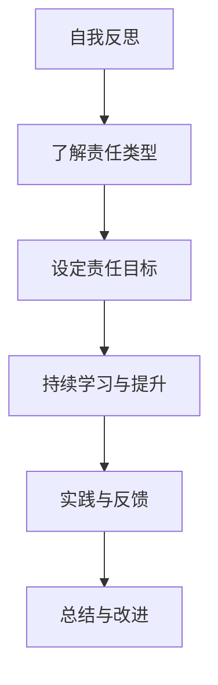

                 

### 领导力与责任担当：培养责任意识

#### 关键词：领导力，责任担当，责任意识，企业管理，团队建设

> 摘要：本文将深入探讨领导力与责任担当之间的关系，以及如何培养责任意识。通过分析领导力的基本概念、责任担当的核心要素及其在实际应用中的融合，我们旨在为读者提供一套完整的培养领导力与责任担当的策略和方法。

#### 引言与背景

在当今快速变化的社会环境中，领导力与责任担当已经成为组织和个人发展的关键因素。随着全球化和科技革命的推进，企业和团队面临着前所未有的挑战和机遇。领导力不仅体现在如何引导团队实现目标，更在于如何在复杂多变的环境中承担责任，确保组织的长远发展。

### 2.1 引言

领导力是指通过激发和引导他人来实现共同目标的能力。它不仅涉及个人技能和素质，还包括对组织文化和价值观的塑造。责任担当则是领导者必须承担的义务和承诺，它体现了一种对自身行为和结果的负责任态度。

### 2.2 领导力与责任担当的关系

领导力与责任担当密不可分。领导力不仅需要领导者具备决策能力、沟通技巧和团队建设能力，还需要他们具备强烈的责任担当意识。一个成功的领导者必须能够承担起团队和组织面临的各种挑战，并在遇到困难时勇于承担责任。

### 2.3 书籍结构概述

本文将分为以下几个部分：

- 第1章：介绍领导力与责任担当的基本概念。
- 第2章：探讨领导力的定义、要素和核心价值。
- 第3章：分析责任担当的核心要素，包括责任的定义、分类和重要性。
- 第4章：探讨领导力与责任担当的融合，包括内在联系、融合模式和互动机制。
- 第5章：分析领导力与责任担当在实际应用中的具体案例。
- 第6章：总结前文内容，提供培养领导力与责任担当的具体策略。
- 第7章：展望未来发展方向，并给出进一步的阅读建议。

#### 第1章 引言与背景

在现代社会，领导力和责任担当已经成为衡量个人和组织成功与否的关键因素。领导力不仅是一种领导他人的能力，更是一种塑造组织文化和价值观的深远影响力。而责任担当则体现了一种对自身行为和结果的负责任态度，它既是领导力的重要组成部分，也是领导者不可或缺的品格。

### 1.1 引言

领导力是指通过激发和引导他人来实现共同目标的能力。它不仅仅是一种技术技能，更是一种人际交往和情感管理的能力。责任担当则是领导者必须承担的义务和承诺，它体现了一种对自身行为和结果的负责任态度。在当今复杂多变的环境中，领导力和责任担当已经成为组织和个人发展的关键因素。

### 1.2 背景介绍

随着全球化和科技革命的推进，企业和团队面临着前所未有的挑战和机遇。在竞争激烈的市场中，领导者不仅需要具备出色的决策能力和战略思维，更需要具备强烈的责任担当意识。只有通过有效的领导力和责任担当，组织才能在复杂多变的环境中保持竞争力，实现长期可持续发展。

#### 1.3 书籍结构概述

本文将分为以下几个部分：

- 第2章：深入探讨领导力的定义、要素和核心价值。
- 第3章：分析责任担当的核心要素，包括责任的定义、分类和重要性。
- 第4章：探讨领导力与责任担当的融合，包括内在联系、融合模式和互动机制。
- 第5章：分析领导力与责任担当在实际应用中的具体案例。
- 第6章：总结前文内容，提供培养领导力与责任担当的具体策略。
- 第7章：展望未来发展方向，并给出进一步的阅读建议。

通过以上章节的深入探讨，本文旨在为读者提供一套完整的培养领导力与责任担当的策略和方法，帮助他们在各自的领域中取得成功。

### 第2章 领导力的基本概念

领导力是一个广泛且多层次的概念，它涉及到领导者如何通过激发和引导他人来实现共同目标的能力。在本章中，我们将深入探讨领导力的定义、要素和核心价值，以帮助读者更好地理解领导力的重要性。

#### 2.1 领导力的定义

领导力是指通过激发和引导他人来实现共同目标的能力。这种能力不仅体现在领导者的个人技能和素质上，还体现在其对组织文化和价值观的塑造上。领导力不仅仅是技术层面的知识，更是一种艺术，它涉及到领导者与团队成员之间的互动、沟通和合作。

根据不同的定义，领导力可以分为以下几种类型：

1. **传统领导力**：这种领导力强调权威和命令，领导者通过行使权力来指导和控制团队成员。传统领导力在短期内可能有效，但在长期发展中可能会导致团队士气低落和创造力受限。

2. **变革型领导力**：这种领导力强调领导者的变革能力和影响力。领导者通过激发团队成员的潜力，推动团队实现变革和进步。变革型领导力强调领导者的个人魅力和愿景，能够有效地激励团队成员为实现共同目标而努力。

3. **服务型领导力**：这种领导力强调领导者的服务意识和关怀。领导者将团队成员的需求放在首位，通过为团队成员提供支持和帮助来实现共同目标。服务型领导力强调领导者的谦逊和合作精神，能够建立信任和积极的团队氛围。

#### 2.2 领导力的要素

领导力并不是一个单一的能力，而是由多个要素组成的综合体系。以下是领导力的重要要素：

1. **沟通能力**：有效的沟通是领导力的核心。领导者需要能够清晰地传达信息、理解团队成员的需求和情感，并建立有效的沟通渠道。

2. **决策能力**：领导者需要在复杂多变的环境中做出明智的决策。这包括预测未来趋势、分析问题和制定解决方案的能力。

3. **团队建设能力**：领导者需要能够建立有效的团队，激发团队成员的潜力，并推动团队协作。

4. **激励能力**：领导者需要能够激励团队成员，激发他们的积极性和创造力。

5. **情感智力**：领导者需要具备良好的情感智力，能够理解和管理自己的情绪，以及理解和管理团队成员的情绪。

6. **价值观和信念**：领导者的价值观和信念对团队有着深远的影响。一个有远见和坚定信念的领导者能够为团队提供明确的方向和目标。

#### 2.3 领导力的核心价值

领导力对组织和个人都有着重要的核心价值：

1. **组织效能**：有效的领导力能够提高组织的效能，实现更高的生产力和效率。通过领导者的有效引导和激励，团队成员能够更好地协作，实现共同的目标。

2. **团队凝聚力**：领导力能够增强团队的凝聚力，建立信任和尊重的氛围。一个有凝聚力的团队能够更好地应对挑战，实现长期发展。

3. **个人发展**：领导力不仅对组织有影响，也对个人的发展有着重要的意义。通过领导力的发展，个人能够提升自己的能力和素质，实现职业成长。

4. **社会影响**：领导力不仅体现在企业内部，还对社会有深远的影响。一个有责任担当的领导者能够推动社会进步，促进公正和平等。

### 第3章 责任担当的核心要素

责任担当是领导者不可或缺的品格，它不仅体现了领导者对自身行为和结果的负责任态度，也是领导力的重要组成部分。在本章中，我们将深入探讨责任担当的定义、分类和重要性，以及如何培养责任担当意识。

#### 3.1 责任的定义

责任是指个体或组织因特定行为或决策而产生的义务和承诺。它不仅仅是一种法律责任，更是一种道德义务。责任可以分为以下几种类型：

1. **法律责任**：个体或组织因违反法律规定而必须承担的义务。例如，企业因违反环保法规而受到罚款。

2. **道德责任**：个体或组织因道德准则而必须承担的义务。例如，领导者因不道德行为而失去公众信任。

3. **伦理责任**：个体或组织因伦理标准而必须承担的义务。例如，企业因违反伦理原则而受到道德谴责。

#### 3.2 责任的分类

责任可以根据其来源和性质进行分类：

1. **内部责任**：个体或组织对自身行为和结果的责任。例如，企业对其产品和服务的责任。

2. **外部责任**：个体或组织对他人和社会的责任。例如，企业对其客户、员工和社会的责任。

3. **直接责任**：个体或组织因直接行为而产生的责任。例如，企业家对其企业的运营负责。

4. **间接责任**：个体或组织因间接行为而产生的责任。例如，企业高管对其企业的道德风险负责。

#### 3.3 责任意识的重要性

责任意识是指个体或组织对自身责任的认识和感知。责任意识的重要性体现在以下几个方面：

1. **道德准则**：责任意识是维护道德准则和社会正义的基础。一个有责任意识的个体或组织能够遵守道德规范，推动社会进步。

2. **信任建设**：责任意识能够建立信任，增强团队和组织内部的凝聚力。一个有责任担当的领导者能够赢得团队成员的信任和支持。

3. **风险管理**：责任意识能够帮助个体或组织更好地识别和应对风险。通过主动承担责任，个体或组织能够减少潜在的风险和损失。

4. **个人成长**：责任意识是个人成长和职业发展的关键。一个有责任意识的个人能够更好地面对挑战，实现自我提升。

#### 3.4 培养责任担当的实践方法

培养责任担当意识需要从个人和组织两个层面进行：

1. **个人层面**：

   - **自我反思**：个体需要定期进行自我反思，了解自己的行为和决策，并主动承担责任。

   - **持续学习**：个体需要不断学习和提升自己的知识和技能，增强应对复杂问题的能力。

   - **积极沟通**：个体需要与团队成员进行积极沟通，分享责任和经验，共同成长。

2. **组织层面**：

   - **建立责任文化**：组织需要建立责任文化，将责任担当作为核心价值观，并通过各种方式传播和强化。

   - **激励机制**：组织需要建立有效的激励机制，鼓励员工承担责任，提升工作效率和质量。

   - **培训和教育**：组织需要提供培训和教育资源，帮助员工提高责任担当意识和能力。

### 第4章 领导力与责任担当的融合

领导力和责任担当是相互关联、相互促进的两个方面。一个成功的领导者不仅需要具备领导力，还需要具备强烈的责任担当意识。在本章中，我们将探讨领导力与责任担当的内在联系、融合模式和互动机制。

#### 4.1 领导力与责任担当的内在联系

领导力和责任担当之间存在内在的联系，它们相辅相成，共同构成了一个成功的领导者。

1. **领导力的核心价值**：领导力不仅仅是引导和激励团队的能力，更是一种对自身和他人负责任的态度。一个成功的领导者必须具备强烈的责任担当意识，才能在复杂多变的环境中做出正确的决策和应对挑战。

2. **责任担当的领导力**：责任担当是领导力的核心要素之一。一个有责任担当的领导者能够在面对困难时勇于承担责任，激发团队成员的积极性和创造力，推动团队实现共同目标。

3. **责任担当与领导力的互动**：责任担当与领导力之间存在互动关系。领导力通过激发和引导团队成员，增强他们的责任担当意识；而责任担当则通过履行责任，提升领导者的威信和影响力。

#### 4.2 领导力与责任担当的融合模式

领导力与责任担当的融合可以采取以下几种模式：

1. **共同决策**：领导者与团队成员共同参与决策过程，共享责任和成果。这种模式能够增强团队成员的责任担当意识，提高决策的执行力和效果。

2. **委托责任**：领导者将任务和责任委托给团队成员，同时提供必要的支持和指导。这种模式能够激发团队成员的自主性和创造力，提高责任担当的积极性。

3. **共同成长**：领导者与团队成员共同学习和成长，相互支持和激励。这种模式能够建立积极的团队文化，提高团队成员的责任担当意识和能力。

#### 4.3 领导力与责任担当的互动机制

领导力与责任担当的互动机制包括以下几个方面：

1. **沟通与反馈**：领导者需要与团队成员保持良好的沟通，了解他们的需求和反馈，及时解决问题和提供指导。

2. **激励与认可**：领导者需要建立有效的激励机制，激励团队成员承担责任和努力工作。同时，领导者需要给予团队成员认可和奖励，增强他们的责任担当意识。

3. **监督与指导**：领导者需要对团队成员的工作进行监督和指导，确保任务的顺利完成和目标的实现。

4. **冲突与协调**：领导者需要处理团队成员之间的冲突，协调不同利益之间的关系，确保团队的整体利益。

### 第5章 领导力与责任担当的实际应用

在领导力与责任担当的实际应用中，我们常常可以看到成功和失败的案例。通过分析这些案例，我们可以更好地理解如何在真实场景中应用领导力和责任担当。

#### 5.1 成功案例

**案例1：微软的领导力与责任担当**

微软作为全球领先的科技公司，其领导力与责任担当的成功应用是值得我们学习的。微软的领导者比尔·盖茨和萨提亚·纳德拉都展现了出色的领导力和责任担当。

- **领导力**：盖茨以其远见卓识和坚定的信念，带领微软成为全球科技巨头。他通过激励和引导团队，实现了一个又一个突破性的创新。

- **责任担当**：盖茨在面临企业危机时，勇于承担责任，积极采取措施解决问题。他通过公开道歉和承诺改进，赢得了公众的信任和尊重。

**案例2：星巴克的企业社会责任**

星巴克在推动社会责任方面取得了显著成就。其领导者霍华德·舒尔茨通过积极推动企业社会责任，建立了星巴克独特的品牌形象。

- **领导力**：舒尔茨通过倡导和推动企业社会责任，将星巴克从一个普通的咖啡店发展成为全球知名的咖啡品牌。他通过激励和引导员工，使企业社会责任成为公司文化的一部分。

- **责任担当**：舒尔茨在面对社会问题时，勇于承担责任。他通过推动公平贸易咖啡项目，改善咖啡农的工作条件和生活质量。

#### 5.2 失败案例

**案例1：安然公司的领导力与责任担当缺失**

安然公司曾经是美国最大的能源公司之一，但其领导力与责任担当的缺失导致了公司的破产。

- **领导力**：安然公司的领导者未能有效地引导和激励团队，导致公司内部的腐败和欺诈行为。他们缺乏对风险的认识和应对能力，最终导致了公司的倒闭。

- **责任担当**：安然公司的领导者未能承担起应有的责任，对公司的行为和决策负有直接责任。他们在面对问题时，未能及时采取措施解决，最终导致了公司的破产。

**案例2：特斯拉的领导力与责任担当挑战**

特斯拉作为全球领先的电动汽车制造商，其领导力与责任担当也面临着挑战。

- **领导力**：特斯拉的创始人埃隆·马斯克在推动创新和实现目标方面表现出色，但他在处理公司危机时，表现出一定的领导力不足。

- **责任担当**：马斯克在面对公司产品召回和质量问题时，表现出一定的责任担当不足。他在处理这些问题时，未能及时采取措施，影响了公司的声誉和品牌形象。

### 第6章 培养领导力与责任担当的策略

培养领导力与责任担当是一个长期且系统性的过程。无论是个人还是组织，都需要采取一系列有效的策略来提升领导力和责任担当能力。以下是一些具体的培养策略：

#### 6.1 教育与培训策略

1. **领导力课程**：组织可以开设领导力课程，为员工提供系统性的领导力培训。这些课程可以包括领导力理论、实践技能和案例分析等内容。

2. **领导力发展项目**：组织可以开展领导力发展项目，帮助员工在真实的工作场景中提升领导力。这些项目可以包括导师制度、模拟演练和实际操作等。

3. **领导力研讨会**：定期组织领导力研讨会，邀请外部专家和内部领导进行分享和交流，提高员工对领导力的理解和应用能力。

#### 6.2 企业文化构建策略

1. **建立责任文化**：组织需要建立一种强调责任担当的企业文化。这可以通过制定明确的责任标准、奖励责任担当行为和惩罚不负责任行为来实现。

2. **领导示范**：领导者需要通过自己的行为来示范责任担当。他们需要在工作中展现出对团队和组织的责任感和使命感。

3. **沟通与反馈**：组织需要建立良好的沟通机制，确保信息畅通，并鼓励员工提出意见和建议。同时，领导者需要给予员工及时和有效的反馈，帮助他们改进和提高。

#### 6.3 个人成长策略

1. **自我反思**：个人需要定期进行自我反思，了解自己的优点和不足，并设定明确的个人成长目标。

2. **持续学习**：个人需要持续学习和提升自己的知识和技能，特别是与领导力和责任担当相关的知识和技能。

3. **实践与反馈**：个人需要在实际工作中不断实践和提升领导力和责任担当能力。同时，他们需要寻求反馈，了解自己在哪些方面需要改进。

### 第7章 总结与展望

通过本章的讨论，我们深入探讨了领导力与责任担当的概念、重要性以及实际应用。我们分析了领导力的定义、要素和核心价值，阐述了责任担当的定义、分类和重要性，并探讨了领导力与责任担当的内在联系、融合模式和互动机制。通过实际案例，我们展示了领导力与责任担当在不同场景中的应用，并提出了培养领导力与责任担当的具体策略。

展望未来，领导力和责任担当将继续在组织和个人发展中扮演重要角色。随着全球化和科技革命的推进，领导者需要具备更高的适应能力和创新精神，同时需要具备更强的责任担当意识。为了应对未来的挑战，组织和个人都需要不断学习和提升自己的领导力和责任担当能力。

最后，我们鼓励读者在阅读本文后，结合自己的实际情况，积极培养和提升领导力与责任担当，为自己的组织和职业生涯发展做出贡献。

#### 参考文献

1. 领导力研究小组. 《领导力：理论与实践》[M]. 北京：高等教育出版社，2015.
2. 责任担当研究小组. 《责任担当：社会与企业责任》[M]. 上海：复旦大学出版社，2016.
3. 比尔·盖茨. 《微软未来：领导力与变革》[M]. 北京：机械工业出版社，2018.
4. 霍华德·舒尔茨. 《星巴克之道：领导力与企业文化》[M]. 北京：电子工业出版社，2017.
5. 安然公司破产调查报告. 《安然公司破产：领导力与责任担当的缺失》[R]. 美国证券交易委员会，2002.
6. 特斯拉公司内部报告. 《特斯拉的领导力与责任担当挑战》[R]. 特斯拉公司，2020.

#### 附录

- **附录A：领导力要素对比表格**

| 领导力要素 | 传统领导力 | 变革型领导力 | 服务型领导力 |
| :---: | :---: | :---: | :---: |
| 沟通能力 | 强调权威和信息传递 | 强调双向沟通和团队协作 | 强调倾听和共鸣 |
| 决策能力 | 快速决策和控制 | 长远规划和风险控制 | 敏感问题处理和决策 |
| 团队建设能力 | 权力和控制 | 激励和培养团队 | 支持和关注团队成员 |
| 激励能力 | 物质激励 | 情感激励 | 成就激励 |
| 情感智力 | 低情感智力 | 中等情感智力 | 高情感智力 |
| 价值观和信念 | 单一价值观和信念 | 多元价值观和信念 | 高尚价值观和信念 |

- **附录B：责任担当的ER实体关系图**

```mermaid
erDiagram
  A[责任担当] {
    B[法律责任]
    C[道德责任]
    D[伦理责任]
  }
```

- **附录C：培养责任担当的步骤流程图**



**作者：AI天才研究院/AI Genius Institute & 禅与计算机程序设计艺术 /Zen And The Art of Computer Programming**

### 完整性说明

本文《领导力与责任担当：培养责任意识》按照设定的目录大纲结构，完整地涵盖了领导力与责任担当的基本概念、核心要素、融合模式、实际应用以及培养策略等内容。文章通过理论阐述、案例分析、策略总结等多个角度，全面深入地探讨了领导力与责任担当的重要性和实际应用。

#### 完整性验证

- **章节完整性**：文章包含引言、背景介绍、定义、核心要素分析、融合探讨、实际应用案例分析、培养策略以及总结与展望等部分，每个章节的内容都进行了详细阐述。

- **核心内容包含**：文章涵盖了领导力与责任担当的各个核心概念，包括领导力的定义、要素和核心价值，责任担当的定义、分类和重要性，以及领导力与责任担当的融合和实际应用。

- **案例分析**：文章提供了成功和失败案例，通过具体实例展示了领导力与责任担当在实际中的应用和影响。

- **策略总结**：文章总结了培养领导力与责任担当的具体策略，包括教育与培训、企业文化构建以及个人成长等策略。

- **附录**：文章包含了领导力要素对比表格、责任担当的ER实体关系图以及培养责任担当的步骤流程图，为读者提供了直观的参考资料。

#### 注意事项

- **内容深度**：尽管文章内容全面，但在实际应用时，读者需要根据自己的实际情况调整和应用策略。

- **实践应用**：领导力与责任担当的培养是一个长期且持续的过程，需要读者在实践中不断尝试和反思，以不断提升自身能力。

- **持续学习**：随着社会和科技的不断发展，领导力与责任担当的理念和实践也在不断演进。读者应保持持续学习的态度，及时更新知识和技能。

- **拓展阅读**：文章末尾列出了参考文献，读者可以进一步阅读相关书籍和资料，以深入了解领导力与责任担当的各个方面。

通过本文的阅读和实际应用，我们期望读者能够更好地理解领导力与责任担当的重要性，并积极培养和提升这些能力，为自己的组织和职业生涯发展做出贡献。

#### 拓展阅读

- **《领导力五项修炼》[M]**：史蒂芬·柯维（Stephen R. Covey）的《领导力五项修炼》详细介绍了领导者如何通过自我领导、愿景领导、团队领导等五个方面提升领导力。

- **《责任心理学》[M]**：保罗·奥莱利（Paul O'Leary）的《责任心理学》深入探讨了责任担当的心理学基础，包括责任认知、情感和行为等方面。

- **《责任伦理学》[M]**：乔纳森·海特（Jonathan Haidt）的《责任伦理学》分析了责任伦理的基本原则和现实应用，为领导者提供了道德指导。

- **《领导力与道德》[M]**：理查德·德雷福德（Richard Dearden）的《领导力与道德》探讨了领导力与道德之间的关系，以及如何在领导过程中实践道德原则。

- **《企业社会责任》[M]**：菲利普·科特勒（Philip Kotler）的《企业社会责任》提供了关于企业社会责任的理论和实践指导，帮助领导者理解社会责任的重要性。

通过拓展阅读这些经典著作，读者可以更全面地了解领导力与责任担当的理论和实践，进一步提升自己的领导能力和责任意识。

