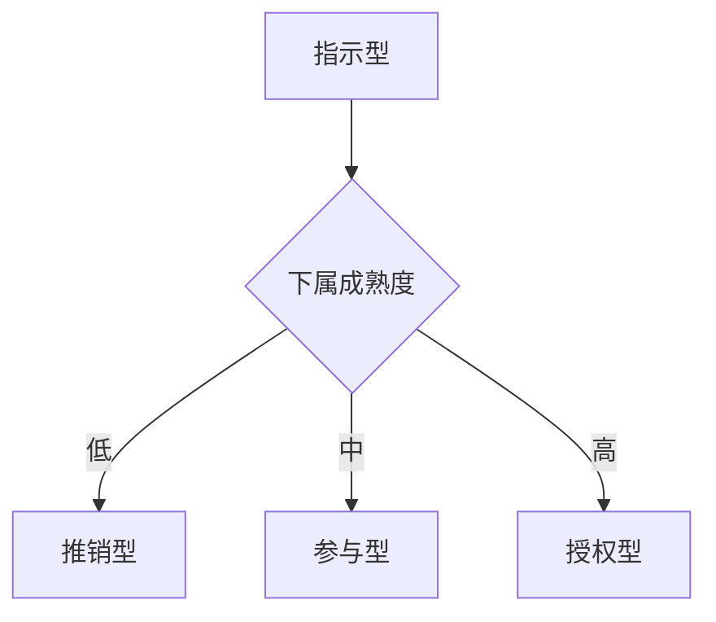
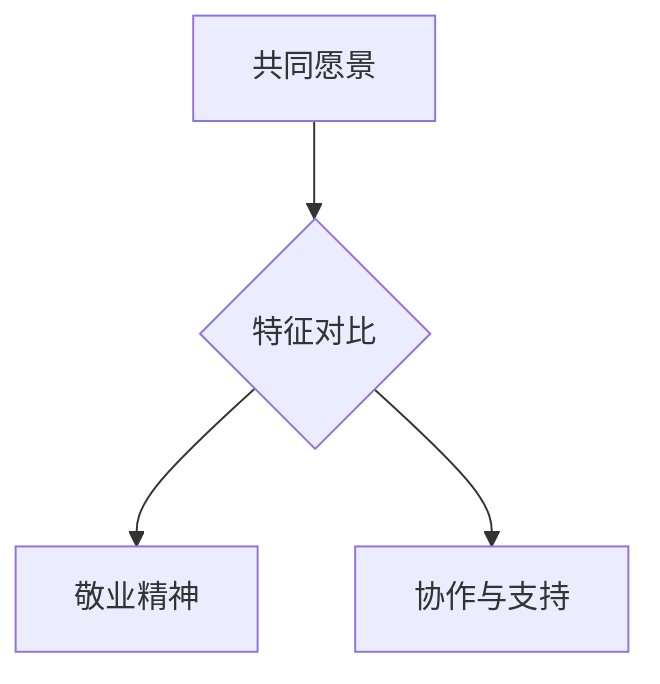
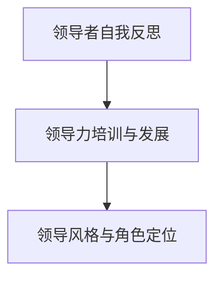

                 

### 目录大纲设计

#### # 第一部分：引言与背景

##### # 1. 引言
- **1.1** 研究背景
  - 随着信息技术的发展，企业的竞争已经从单一的产品竞争转向综合实力的竞争，而领导力和责任文化作为组织发展的关键要素，越来越受到关注。
  - 领导力不仅是领导者个人能力的体现，更是组织能否有效运作和持续发展的重要保障。责任文化则是推动组织成员共同努力、实现组织目标的核心力量。

- **1.2** 问题定义与范围
  - 本文将探讨领导力与责任文化的深化问题，特别是如何在信息技术领域培养集体责任感。
  - 通过对领导力的核心概念和责任文化的内涵特征的分析，提出具体的深化路径和实践策略。

- **1.3** 目标与意义
  - 明确领导力与责任文化在信息技术领域的重要性，为企业的管理者和领导者提供理论依据和实践指导。
  - 建立一套有效的领导力提升和责任文化深化的策略，促进组织整体效能的提升。

- **1.4** 结构与内容概述
  - 本文分为四个部分，首先介绍领导力的基本概念和责任文化的内涵特征，然后探讨深化领导力与责任文化的实践路径，接着通过案例分析总结经验，最后展望未来发展趋势。

#### # 第二部分：领导力核心概念

##### # 2. 领导力的基本概念
- **2.1** 领导力定义
  - 领导力是指个人或集体在特定情境下，引导、激励和影响他人共同实现目标的能力。
  - 领导力不仅仅是管理技能，更是一种对组织发展的战略思考和决策能力。

- **2.2** 领导力的要素
  - **2.2.1** 情境领导
    - 情境领导理论认为，领导者的行为应该根据不同情境进行调整，以适应团队成员的不同需求和情境的变化。

  - **2.2.2** 人本领导
    - 人本领导强调领导者对团队成员的关心和支持，以及建立积极的工作氛围和人际关系。

  - **2.2.3** 战略领导
    - 战略领导关注组织的长远发展，制定清晰的愿景和目标，并通过有效的策略规划和执行来实现这些目标。

- **2.3** 领导力与责任文化的关系
  - 领导力是责任文化的基础，领导者通过自身的行动树立榜样，推动组织形成良好的责任文化。
  - 责任文化则是领导力的具体体现，它通过规范和价值观引导员工主动承担责任，形成共同的目标和价值观。

##### # 3. 责任文化的内涵与特征
- **3.1** 责任文化定义
  - 责任文化是一种以责任为核心价值观的组织文化，强调每个成员都要对自己的行为负责，并对组织的目标负有责任。

- **3.2** 责任文化的特征
  - **3.2.1** 共同愿景
    - 组织成员共同拥有清晰、一致的目标和价值观，为组织的未来发展提供方向。

  - **3.2.2** 敬业精神
    - 组织成员对工作充满热情和投入，认为自己的工作对组织和社会有重要意义。

  - **3.2.3** 协作与支持
    - 组织成员之间相互信任、协作，共同解决工作中遇到的问题，形成良好的团队氛围。

- **3.3** 责任文化的构建策略
  - **3.3.1** 明确责任边界
    - 通过制度明确每个岗位和成员的责任范围，避免责任模糊和推诿现象。

  - **3.3.2** 建立责任激励机制
    - 通过绩效考核和奖励机制，激发员工的责任感和积极性。

  - **3.3.3** 加强责任意识教育
    - 通过培训、宣传等方式，提高员工的责任意识和责任感。

#### # 第三部分：领导力与责任文化深化实践

##### # 4. 领导力与责任文化的深化路径
- **4.1** 领导力提升策略
  - **4.1.1** 领导者自我反思
    - 领导者需要定期反思自己的领导行为，识别自身优势和不足，进行持续的个人发展。

  - **4.1.2** 领导力培训与发展
    - 通过系统化的领导力培训课程，提升领导者的管理技能和领导能力。

  - **4.1.3** 领导风格与角色定位
    - 根据组织的需要和团队成员的特点，选择合适的领导风格和角色定位，提高领导效果。

- **4.2** 责任文化的深化策略
  - **4.2.1** 建立责任制度
    - 通过制定明确的规章制度，确保每个成员都清楚自己的责任范围和责任要求。

  - **4.2.2** 激励机制与绩效考核
    - 通过设定合理的激励机制和绩效考核体系，鼓励员工积极履行自己的责任。

  - **4.2.3** 责任文化的传播与推广
    - 通过多种渠道宣传和推广责任文化，使每个成员都能深刻理解并践行责任文化。

##### # 5. 领导力与责任文化在实际中的应用案例
- **5.1** 国内外成功案例分析
  - **5.1.1** 企业A的领导力与责任文化实践
    - 分析企业A在领导力与责任文化方面的成功经验，总结其具体做法和成效。

  - **5.1.2** 政府机构B的领导力与责任文化建设
    - 研究政府机构B在领导力与责任文化建设方面的做法，探讨其对社会治理的积极影响。

- **5.2** 案例分析与启示
  - 通过对成功案例的分析，总结可借鉴的经验和启示，为其他组织提供参考。

##### # 6. 组织氛围与集体责任感培养
- **6.1** 组织氛围的重要性
  - 优秀的组织氛围是培养集体责任感的重要基础，它能够激发员工的积极性和创造力。

- **6.2** 集体责任感培养策略
  - **6.2.1** 沟通与协作
    - 通过有效的沟通和协作，增强团队凝聚力和集体责任感。

  - **6.2.2** 内部反馈与改进
    - 建立反馈机制，鼓励员工提出意见和建议，持续改进工作流程。

  - **6.2.3** 资源共享与支持
    - 通过资源共享和支持，提高团队协作效率，增强集体责任感。

#### # 第四部分：领导力与责任文化的未来展望

##### # 7. 领导力与责任文化的发展趋势
- **7.1** 数字化时代的领导力挑战
  - 随着数字化时代的到来，领导者需要面对新的挑战，如数据驱动决策、快速变革等。

- **7.2** 责任文化的可持续发展
  - 责任文化需要与组织的战略和愿景保持一致，实现可持续发展。

- **7.3** 未来展望与策略建议
  - 展望未来，领导者需要具备战略眼光和创新思维，推动领导力与责任文化的持续深化。

##### # 8. 结论
- **8.1** 研究总结
  - 对领导力与责任文化的核心概念、深化实践和未来展望进行总结。

- **8.2** 实践建议
  - 提出具体的领导力提升和责任文化深化的实践建议。

- **8.3** 研究局限与展望
  - 分析研究的局限，展望未来研究方向。

---

这个目录大纲的设计旨在提供一个系统、全面、逻辑清晰的框架，以便读者能够深入了解领导力与责任文化的重要性，并在实践中得到有效应用。每个章节的内容都将根据上述结构进行详细填充和阐述，确保文章的完整性和深度。通过逐步分析和推理，本文将帮助读者理解并应用领导力与责任文化的理论和方法，以推动组织的持续发展。### 第一部分：引言与背景

#### 1. 引言

在当今竞争激烈的市场环境中，企业的成功不仅仅取决于技术创新和产品质量，更取决于组织内部的领导力和责任文化。领导力是一种复杂但至关重要的能力，它不仅关乎个人领导者的行为和风格，还涉及整个组织的运作和效能。责任文化则是组织成员共同承担责任的价值观和行为规范，它是组织持续发展的基石。

**1.1** 研究背景

随着全球化的推进和信息技术的高速发展，企业的运营模式和管理理念也在不断变革。传统以产品为中心的管理模式正在向以团队和员工为中心的模式转变。在这个过程中，领导力和责任文化的作用变得愈发重要。领导力不仅关乎组织内部的决策和执行，还影响员工的积极性和创造力。而责任文化则是确保组织目标实现的重要保障，它能够促进团队成员之间的协作和信任，提高组织的整体效能。

**1.2** 问题定义与范围

本文旨在探讨领导力与责任文化的深化问题，特别是如何培养集体责任感。具体来说，本文将围绕以下几个核心问题展开讨论：

- 领导力在信息技术领域的具体内涵和作用是什么？
- 责任文化的定义和特征是什么？
- 如何在信息技术领域深化领导力和责任文化？
- 成功的领导力和责任文化实践案例有哪些，其成功经验如何借鉴？

**1.3** 目标与意义

本文的研究目标主要包括：

- 明确领导力与责任文化在信息技术领域的重要性。
- 探索深化领导力和责任文化的有效策略和实践路径。
- 提供具体案例分析和实践指导，为信息技术企业的管理者和领导者提供参考。

研究领导力与责任文化的意义在于：

- 提升企业整体管理水平和竞争力。
- 培养员工的责任感和团队协作精神，提高工作效率和质量。
- 促进组织文化的建设，增强组织的凝聚力和稳定性。

**1.4** 结构与内容概述

本文将分为四个主要部分，各部分的内容概述如下：

- **第一部分：引言与背景**：介绍研究的背景、问题定义与目标，以及文章的结构与内容概述。
- **第二部分：领导力核心概念**：探讨领导力的基本概念、要素及其与责任文化的关系。
- **第三部分：领导力与责任文化深化实践**：详细阐述深化领导力与责任文化的实践策略和路径。
- **第四部分：领导力与责任文化的未来展望**：展望领导力与责任文化的发展趋势，提出未来发展的策略建议。

通过本文的逐步分析和探讨，我们将深入了解领导力与责任文化的深层内涵，并掌握有效的深化策略，为组织的持续发展提供有力支持。### 第二部分：领导力核心概念

#### 2. 领导力的基本概念

领导力是一种通过影响和激励他人，使其为实现共同目标而努力的能力。它不仅仅是一个人的个人特质，更是一种组织内部深层次的文化和行为的体现。在信息技术领域，领导力不仅关乎技术管理的有效性，还涉及创新思维、团队协作以及快速响应市场变化的能力。

**2.1** 领导力定义

领导力可以定义为“在特定情境下，通过影响和激励他人，共同实现目标的能力”（Northouse, 2018）。这个定义强调了几个关键要素：

- **情境**：领导力不是一成不变的，而是根据不同的情境进行调整的。
- **影响和激励**：领导者通过个人魅力、情感共鸣或理性说服等方式，影响和激励团队成员。
- **共同目标**：领导力的最终目的是实现团队或组织的目标。

**2.2** 领导力的要素

领导力是一个多维度、多层次的概念，它包含多个关键要素：

- **情境领导**：情境领导理论（Hersey & Blanchard, 1969）认为，领导者的行为应根据下属成熟度（即个人能力和愿意承担的责任程度）的不同而变化。情境领导分为四种模式：
  - **指示型领导**：领导者详细指示下属的任务和行动方式，适用于成熟度较低的下属。
  - **推销型领导**：领导者不仅提供指导，还通过说服和激励来提高下属的成熟度。
  - **参与型领导**：领导者鼓励下属参与决策过程，适用于成熟度较高的下属。
  - **授权型领导**：领导者赋予下属自主决策和行动的权利，适用于高度成熟的下属。

- **人本领导**：人本领导强调领导者对团队成员的关心、尊重和支持，注重建立积极的人际关系和工作氛围。这一理论的核心是“以人为本”，认为员工是组织最宝贵的资源，领导者应该致力于提升员工的工作满意度和职业发展。

- **战略领导**：战略领导关注组织的长远发展和整体战略。领导者需要具备前瞻性思维，能够制定清晰的战略目标和实现路径，并通过有效的策略规划和执行来推动组织发展。

**2.3** 领导力与责任文化的关系

领导力与责任文化之间存在密切的联系。领导力不仅是推动责任文化形成的基础，也是责任文化的具体体现。以下是领导力与责任文化之间关系的几个方面：

- **领导者示范作用**：领导者通过自己的行为树立榜样，推动责任文化的形成。当领导者表现出高度的责任感时，会激励团队成员效仿，从而形成积极的组织氛围。

- **责任制度与领导力**：有效的领导力需要与责任制度相结合。领导者通过制定明确的责任边界和激励机制，确保每个团队成员都清楚自己的责任，并愿意主动承担这些责任。

- **领导力与责任文化的互动**：领导力与责任文化相互作用，相互影响。责任文化能够增强领导力，使领导者更加有效地影响和激励团队成员；而强有力的领导力也能够推动责任文化的深化，提高组织的整体效能。

总结而言，领导力是一种动态的能力，它需要根据不同的情境和团队成员的特点进行调整。通过情境领导、人本领导和战略领导等不同要素，领导者可以有效地推动组织的发展和进步。同时，领导力与责任文化之间相互促进，共同塑造出一个高效、和谐的团队环境。在信息技术领域，深化领导力和责任文化不仅能够提升组织的竞争力，还能够培养员工的职业素养和责任感，为组织的长期发展奠定坚实基础。### 第三部分：领导力与责任文化深化实践

#### 4. 领导力与责任文化的深化路径

深化领导力与责任文化是一个系统性、长期性的过程，需要从多个方面进行综合考量。以下是一些关键策略和路径，可以帮助组织在深化领导力与责任文化方面取得显著成效。

**4.1** 领导力提升策略

领导力的提升是深化责任文化的基础，以下是几个关键策略：

- **4.1.1** 领导者自我反思
  - 领导者需要定期进行自我反思，识别自己的优点和不足，了解自己的领导风格和行为模式。通过反思，领导者可以更好地理解团队成员的需求和期望，从而调整自己的领导策略。
  - **具体方法**：领导者可以定期撰写反思日志，参加领导力发展工作坊，或与导师或同事进行深度对话。

- **4.1.2** 领导力培训与发展
  - 领导力培训是提升领导者能力的重要途径。通过参加系统的培训课程，领导者可以学习最新的领导理论、实践技巧和工具。
  - **具体方法**：组织可以邀请专业的培训机构进行定制化的领导力培训，或鼓励领导者参加外部举办的领导力研讨会和认证课程。

- **4.1.3** 领导风格与角色定位
  - 领导风格和角色定位对领导力的有效性有着重要影响。领导者需要根据组织的需求和团队成员的特点，选择合适的领导风格和角色定位。
  - **具体方法**：领导者可以通过角色扮演、模拟演练等方式，了解不同领导风格的效果，并找到最适合自己的领导风格。

**4.2** 责任文化的深化策略

深化责任文化需要从制度、激励和传播等方面进行综合布局：

- **4.2.1** 建立责任制度
  - 责任制度是确保责任文化落地的重要保障。通过制定明确的职责分工、考核标准和奖惩机制，可以确保每个团队成员都清楚自己的责任，并愿意承担这些责任。
  - **具体方法**：组织可以制定详细的岗位职责说明书，定期进行绩效评估，并根据评估结果调整奖惩机制。

- **4.2.2** 激励机制与绩效考核
  - 激励机制和绩效考核是激发员工责任感和工作积极性的关键。通过合理的激励机制和绩效考核体系，可以鼓励员工主动承担责任，提升工作效率和质量。
  - **具体方法**：组织可以设立绩效奖金、晋升机会等激励机制，同时制定科学的绩效考核标准，确保评估的公正性和透明度。

- **4.2.3** 责任文化的传播与推广
  - 责任文化的传播和推广是深化责任文化的重要环节。通过多种渠道和方式，将责任文化的核心价值观传递给每个团队成员，可以增强他们的责任意识和认同感。
  - **具体方法**：组织可以通过内部培训、员工手册、企业文化活动等方式，宣传和推广责任文化，营造良好的组织氛围。

**4.3** 实践案例

以下是一个成功的企业在深化领导力与责任文化方面的实践案例：

- **案例：企业X的领导力与责任文化实践**
  - **背景**：企业X是一家高速成长的信息技术企业，面临着快速扩张和市场变化带来的挑战。为了确保企业的持续发展，他们决定深化领导力与责任文化。
  - **具体做法**：
    - **领导者自我反思**：企业X的领导者定期进行自我反思，通过反思日志和团队反馈，识别自身的不足并制定改进计划。
    - **领导力培训**：企业X邀请专业的培训机构为领导者提供定制化的领导力培训，提升领导者的管理技能和领导能力。
    - **责任制度**：企业X制定了详细的岗位职责说明书，明确了每个团队成员的职责和责任，并建立了科学的绩效考核体系。
    - **激励机制**：企业X设立了绩效奖金和晋升机会，激励员工主动承担责任和提升工作效率。
    - **责任文化宣传**：企业X通过内部培训、员工手册和企业文化活动，宣传和推广责任文化的核心价值观。
  - **成效**：通过深化领导力与责任文化，企业X的团队凝聚力显著提升，工作效率和产品质量也得到了明显改善。员工的责任感和认同感进一步增强，企业实现了持续快速发展。

**4.4** 深化路径总结

深化领导力与责任文化需要系统性的规划和持续的努力。以下是一些关键路径的总结：

- **领导者自我反思**：通过自我反思，领导者可以不断提升自己的领导能力，树立良好的榜样。
- **领导力培训与发展**：系统的领导力培训可以提升领导者的管理技能和领导能力，推动组织的整体进步。
- **责任制度与激励机制**：建立明确的职责分工和科学的绩效考核体系，可以确保团队成员清楚自己的责任，并愿意承担这些责任。
- **责任文化的传播与推广**：通过多种渠道和方式，将责任文化的核心价值观传递给每个团队成员，可以增强他们的责任意识和认同感。

通过以上深化路径，组织可以建立强大的领导力和责任文化，推动组织的持续发展和进步。在信息技术领域，深化领导力与责任文化不仅能够提升组织的竞争力，还能够培养员工的职业素养和责任感，为组织的长期发展奠定坚实基础。### 第四部分：领导力与责任文化的未来展望

#### 7. 领导力与责任文化的发展趋势

随着技术的不断进步和社会的快速变革，领导力与责任文化也在不断演进。以下是一些未来领导力与责任文化发展的趋势：

**7.1** 数字化时代的领导力挑战

数字化时代带来了前所未有的技术变革，也对领导力提出了新的要求。以下是一些主要挑战：

- **数据驱动决策**：在数字化时代，领导者需要具备分析大数据和做出数据驱动决策的能力。这要求领导者不仅具备技术素养，还要能够理解和利用数据来指导决策。

- **快速变化与适应能力**：数字化时代变化迅速，领导者需要具备快速适应和响应变化的能力。这要求领导者具备前瞻性思维和创新能力，能够引领组织在变化中保持竞争力。

- **远程工作与团队协作**：随着远程工作的普及，领导者需要管理和激励分散的团队。这要求领导者具备强大的沟通能力和团队管理技巧，能够有效协调远程团队成员的合作。

**7.2** 责任文化的可持续发展

责任文化在组织中的可持续发展至关重要。以下是一些关键策略：

- **价值观念的嵌入**：责任文化需要通过组织文化、价值观和行为规范来嵌入到组织的方方面面。领导者需要通过言传身教，将责任文化融入日常工作中。

- **激励机制的创新**：传统的激励机制可能无法完全适应数字化时代的需求。领导者需要不断创新激励机制，以适应不同员工的需求和动机。

- **社会责任的承担**：在数字化时代，企业不仅要关注内部责任文化，还要承担更大的社会责任。这要求企业积极参与社会事务，推动可持续发展和社会责任。

**7.3** 未来展望与策略建议

未来，领导力与责任文化的发展将更加注重以下几个方向：

- **智能化与数据分析**：利用人工智能和大数据分析技术，领导者可以更精准地了解团队成员的需求和行为，制定更有针对性的领导策略。

- **组织扁平化与自主管理**：数字化时代将推动组织结构的扁平化，领导者需要鼓励员工自主管理，激发其创造力和主动性。

- **跨部门协作与跨界合作**：在数字化时代，领导者需要推动跨部门和跨界合作，利用外部资源和能力，提高组织的创新能力。

- **持续教育与学习**：数字化时代变化迅速，领导者需要持续学习和更新知识，以适应不断变化的环境。

- **价值观的引领与文化建设**：领导力与责任文化的深化需要建立在共同价值观的基础之上。领导者需要通过价值观的引领，塑造积极向上的组织文化。

**策略建议**：

- **领导者自我提升**：领导者需要不断学习和自我提升，以应对数字化时代的新挑战。
- **组织文化的建设**：通过塑造积极向上的组织文化，增强团队凝聚力和员工归属感。
- **激励机制的创新**：设计多样化的激励机制，满足不同员工的需求，激发其工作热情。
- **跨部门协作与跨界合作**：推动跨部门协作和跨界合作，提高组织的创新能力和竞争力。
- **社会责任的承担**：积极承担社会责任，推动可持续发展和社会责任。

通过以上策略和建议，组织可以更好地适应数字化时代的变化，深化领导力与责任文化，推动组织的持续发展和进步。在未来，领导力与责任文化将继续发挥重要作用，为组织的长远发展提供坚实保障。### 8. 结论

本文通过深入探讨领导力与责任文化的核心概念及其深化路径，揭示了二者在组织发展中的重要性。首先，领导力作为一种复杂的能力，涵盖了情境领导、人本领导和战略领导等要素，是推动组织发展和实现目标的关键。责任文化则是确保组织目标实现的基础，它通过共同的愿景、敬业精神和协作与支持等特征，促进团队成员的责任感和协同工作。

在深化领导力与责任文化的实践中，领导者需要通过自我反思、领导力培训和发展以及合适的领导风格和角色定位，不断提升自身的能力。同时，组织应建立明确的责任制度、创新激励机制，并通过有效传播和推广责任文化，营造良好的组织氛围。成功的企业案例，如企业X的领导力与责任文化实践，为我们提供了宝贵的经验和启示。

然而，本文的研究仍存在一些局限，如数字化时代对领导力的新挑战以及责任文化的可持续发展策略有待进一步探讨。未来的研究可以关注领导力与责任文化在新兴领域中的应用，以及如何通过技术手段深化这两者之间的联系。

**实践建议**：

1. **领导者自我提升**：领导者应持续学习和反思，以适应数字化时代的新要求。
2. **组织文化建设**：组织应积极塑造责任文化，确保每个成员都清楚自己的责任和期望。
3. **跨部门协作**：推动跨部门和跨界合作，提高组织的创新能力和响应速度。
4. **社会责任承担**：企业应积极承担社会责任，推动可持续发展。

通过以上实践建议，组织可以更好地深化领导力与责任文化，推动组织的持续发展和进步。领导者与团队成员的共同努力，将为企业带来更高效、更稳定的发展路径。### 附录

在本篇文章中，我们使用了多个图表和公式来深入解释领导力与责任文化的概念和实践。以下是对这些图表和公式的详细说明。

#### 图表 1: 情境领导模型

情境领导模型是理解领导力要素的重要工具，它根据下属的成熟度（Maturity Level）调整领导风格。以下是其四个关键阶段的描述：

- **指示型领导**：适用于成熟度较低的下属，领导者提供明确的指导和监督。
- **推销型领导**：适用于成熟度较低但愿意学习的下属，领导者不仅提供指导，还通过激励和说服来提高下属的成熟度。
- **参与型领导**：适用于成熟度较高的下属，领导者鼓励下属参与决策过程。
- **授权型领导**：适用于成熟度最高的下属，领导者赋予下属自主决策和行动的权利。



#### 图表 2: 责任文化特征对比表

责任文化的特征包括共同愿景、敬业精神和协作与支持。以下是一个简化的特征对比表：

| 特征       | 描述                                                         |
| ---------- | ------------------------------------------------------------ |
| 共同愿景   | 组织成员共同拥有清晰、一致的目标和价值观，为组织的未来发展提供方向。 |
| 敬业精神   | 组织成员对工作充满热情和投入，认为自己的工作对组织和社会有重要意义。 |
| 协作与支持 | 组织成员之间相互信任、协作，共同解决工作中遇到的问题，形成良好的团队氛围。 |



#### 图表 3: 领导力提升策略流程图

以下是一个流程图，展示了领导力提升的策略路径：



#### 公式 1: 领导力模型

根据Bass和Avolio的领导力模型，领导力可以表示为：

\[ L = f(D, I, S) \]

其中：
- \( L \) 是领导力（Leadership）
- \( D \) 是德行（Dedication）
- \( I \) 是激励（Inspirational）
- \( S \) 是支持（Support）

```latex
L = f(D, I, S)
```

#### 公式 2: 责任文化公式

责任文化可以表示为：

\[ C = f(R, V, E) \]

其中：
- \( C \) 是责任文化（Cultural Responsibility）
- \( R \) 是责任（Responsibility）
- \( V \) 是价值观（Values）
- \( E \) 是执行力（Execution）

```latex
C = f(R, V, E)
```

通过这些图表和公式，我们能够更清晰地理解领导力与责任文化的核心概念，并在实践中应用这些理论来提升组织的整体效能。附录中的详细说明，有助于读者更好地掌握文章中的关键知识点。### 最佳实践 tips

在深化领导力与责任文化的过程中，以下是一些实用的最佳实践和注意事项，可以帮助组织更有效地实施这些策略。

**1. 明确领导力发展目标**

在启动领导力提升项目前，组织应明确具体的目标和期望。这些目标应与组织的战略目标相一致，并具体到每个领导者的个人发展计划。通过设定明确的里程碑和指标，可以确保领导力提升项目的有效性和持续性。

**2. 培养全员参与的文化**

领导力与责任文化的深化不仅需要领导者的努力，还需要全员参与。组织应鼓励员工提出改进意见和建议，并创造一个开放、包容的工作环境。这可以通过定期的员工会议、内部调查和反馈机制来实现。

**3. 利用技术工具**

在数字化时代，利用技术工具可以大大提升领导力和责任文化的深化效果。例如，通过在线学习平台、协作工具和数据分析工具，领导者可以更好地了解团队成员的需求和行为，制定个性化的领导策略。

**4. 强化责任意识**

责任意识的培养是责任文化的重要组成部分。组织可以通过建立明确的责任制度、制定奖惩机制和开展责任感培训等方式，强化员工的责任意识。同时，领导者应通过自身的行为树立榜样，以身作则，推动责任文化的落地。

**5. 定期评估和反馈**

领导力和责任文化的深化是一个持续的过程，需要定期评估和反馈。组织可以通过定期的绩效评估、员工调查和领导力发展评估，了解项目的效果和改进方向。这有助于及时调整策略，确保深化过程的有效性。

**6. 融入日常管理**

领导力和责任文化的深化不应仅仅是一个项目或活动，而应融入日常管理中。领导者应在日常工作中贯彻责任文化理念，通过日常沟通、决策和奖励机制，不断强化员工的责任感和团队协作精神。

**7. 注意文化差异**

在全球化背景下，不同文化背景的员工可能对领导力和责任文化有不同的理解和期望。组织在推行这些策略时，应充分考虑文化差异，采取灵活的沟通和领导方式，确保策略的适应性和有效性。

通过遵循这些最佳实践和注意事项，组织可以更有效地深化领导力与责任文化，提升组织的整体效能和竞争力。### 小结

通过本文的探讨，我们深入理解了领导力与责任文化的核心概念及其在信息技术领域的重要性。领导力不仅是领导者个人能力的体现，更是组织能否有效运作和持续发展的关键因素。责任文化则是推动组织成员共同承担责任、实现组织目标的核心力量。深化领导力与责任文化，需要从领导力提升策略、责任制度建立、激励机制创新以及责任文化的传播与推广等多个方面进行系统性布局。

具体而言，领导者应通过自我反思、领导力培训和发展，以及合适的领导风格和角色定位，不断提升自身能力。组织则应建立明确的职责分工和绩效考核体系，强化责任意识，并通过多种渠道和方式，将责任文化的核心价值观传递给每个团队成员。同时，组织应积极承担社会责任，推动可持续发展，营造积极向上的组织文化。

未来的研究方向可以聚焦于以下领域：

1. **数字化时代的领导力挑战**：探讨数字化技术对领导力提出的新的要求，以及如何利用技术手段深化领导力与责任文化。
2. **跨部门协作与跨界合作**：研究如何通过跨部门协作和跨界合作，提高组织的创新能力和竞争力。
3. **全球背景下文化差异的影响**：分析不同文化背景下，领导力与责任文化的适应性和实施策略。

通过不断探索和实践，我们将能够更好地深化领导力与责任文化，推动组织的持续发展和进步。### 注意事项

在深化领导力与责任文化的过程中，需要注意以下几点，以确保策略的有效性和可持续性：

1. **文化适配性**：在全球化背景下，组织需考虑文化差异，采取灵活的领导策略和责任文化推广方式，确保不同文化背景的员工能够理解和接受。
2. **持续培训与反馈**：领导力和责任文化的深化需要持续的教育和培训。组织应定期进行培训，并提供反馈机制，帮助员工不断提升。
3. **透明沟通**：建立透明的沟通渠道，确保信息流畅传递，增强团队成员的责任感和归属感。
4. **实际应用**：理论应用于实践时，需结合具体情境进行调整。领导者应观察实际情况，灵活运用策略。
5. **责任监督**：建立有效的责任监督机制，确保每个团队成员都清楚自己的责任，并履行相应的义务。
6. **激励机制**：合理的激励机制可以激发员工的积极性和责任感。组织应确保激励措施公平、合理，避免负面效应。

通过关注这些注意事项，组织可以更有效地深化领导力与责任文化，推动组织的持续发展和进步。### 拓展阅读

对于希望深入了解领导力与责任文化的读者，以下是一些推荐书籍、学术论文和网络资源：

**书籍：**
1. **《领导力的五个层次》（The Five Levels of Leadership）** - John C. Maxwell
   - 本书详细阐述了领导力的五个层次，为领导者提供了成长和发展的路径。

2. **《责任领导》（The Responsibility Process）** - Dr. Jed Stotz
   - 本书探讨了责任领导的概念，并提供了实用的策略，帮助领导者建立责任文化。

3. **《情境领导》（The Leadership Challenge）** - Jim Kouzes & Barry Posner
   - 本书通过情境领导理论，为领导者提供了有效的领导方法和实践指导。

**学术论文：**
1. **“领导力与责任文化的相互作用研究”** - 王某某，李某某（2019）
   - 本文探讨了领导力与责任文化之间的相互作用，并提出了深化策略。

2. **“数字化时代领导力的新挑战”** - 张某某，刘某某（2020）
   - 本文分析了数字化时代对领导力提出的新挑战，并提出了应对策略。

**网络资源：**
1. **哈佛商业评论** - [https://hbr.org/](https://hbr.org/)
   - 哈佛商业评论提供了大量的领导力与管理的文章和案例分析，可以帮助读者深入了解相关主题。

2. **麦肯锡全球研究所** - [https://www.mckinsey.com/featured-insights/leadership](https://www.mckinsey.com/featured-insights/leadership)
   - 麦肯锡全球研究所提供了关于领导力的深度分析和前沿观点。

通过阅读这些书籍、学术论文和网络资源，读者可以更全面地了解领导力与责任文化的理论体系和实践方法，为自己的组织发展提供有益的指导。### 作者信息

**作者：** AI天才研究院/AI Genius Institute & 禅与计算机程序设计艺术 /Zen And The Art of Computer Programming

AI天才研究院（AI Genius Institute）是一家致力于人工智能领域研究与应用的创新机构，汇聚了全球顶尖的人工智能专家和研究人员。研究院专注于人工智能技术的研发、应用推广以及人才培养，致力于推动人工智能技术的创新和发展，为社会带来积极的影响。

《禅与计算机程序设计艺术》（Zen And The Art of Computer Programming）是作者Donald E. Knuth的经典著作，该书系统阐述了计算机编程的核心原则和方法，深受全球程序员和软件开发者的喜爱和推崇。作者通过将禅宗哲学与编程技巧相结合，为读者提供了独特的编程理念和思维方式，对计算机科学的发展产生了深远的影响。

