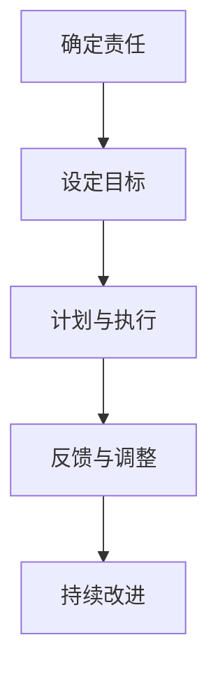
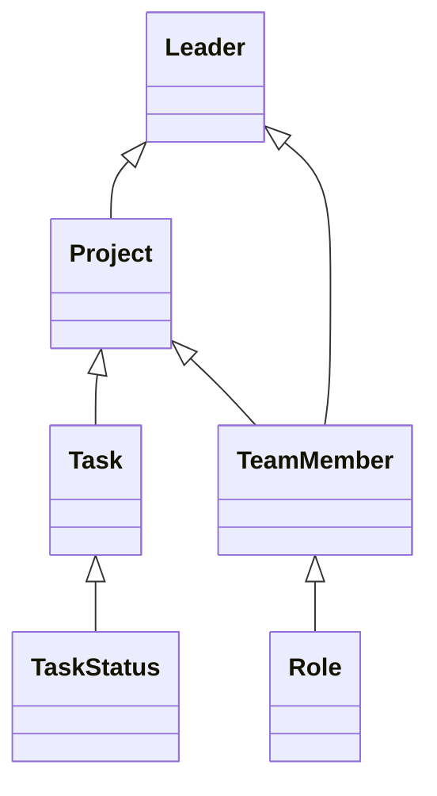
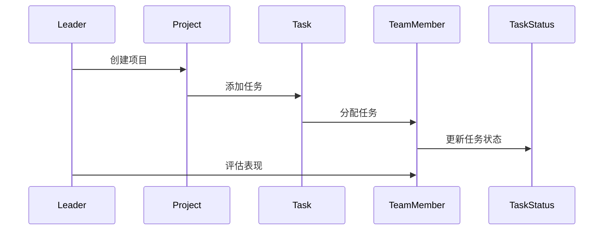
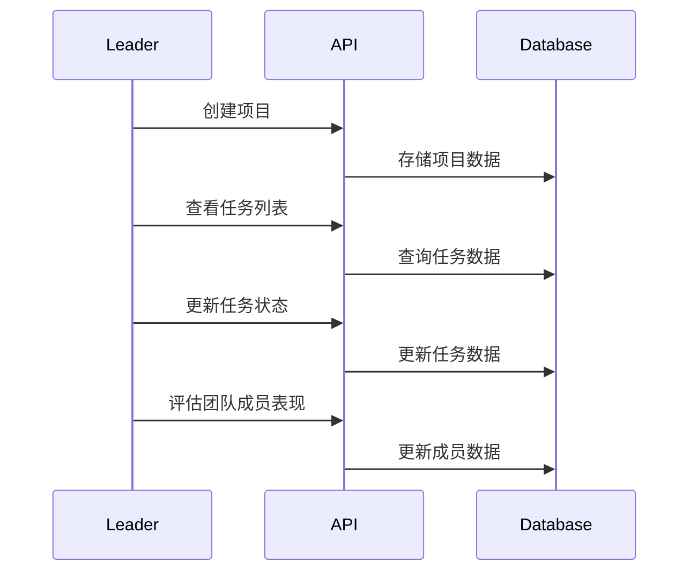

                 

### 引言

在信息时代，领导力和责任已成为企业和组织中不可或缺的元素。作为一位计算机领域的专家，我深知技术本身只是工具，而领导力和责任则是推动技术和团队成功的关键因素。本文《领导力与责任：承担失败，分享成功》旨在深入探讨领导力与责任的内涵，以及如何在实践中应用这些原则。

领导力，是指领导者通过影响、激励和引导他人，实现组织目标的能力。而责任，则是指个体或组织在其行动中应承担的义务和后果。这两者相辅相成，领导力需要责任来支撑，责任需要领导力来引导。本文将分为以下几个部分进行详细探讨：

首先，我们会探讨领导力的基础，包括领导力的定义、不同领导风格与角色的特点。接着，我们会深入分析责任的概念，探讨个人责任与组织责任的区别。然后，文章将重点讨论如何在实践中承担责任，包括步骤、负面后果以及如何培养责任感。

在理解了领导力和责任的基础后，文章将探讨领导与责任之间的关系，领导如何承担责任并在团队中培养责任意识。紧接着，文章将探讨如何处理失败，包括承担失败的责任和从失败中学习的策略。

最后，文章将讨论如何分享成功，包括分享成功的原则和如何与团队合作实现共赢。此外，还将通过最佳实践案例，总结领导力和责任的实践经验。文章将以小结和展望结束，对关键观点进行回顾，并讨论未来领导力和责任的发展趋势。

通过本文的阅读，希望读者能够对领导力和责任有更深入的理解，并在实际工作中更好地应用这些原则，推动个人和团队的成长与发展。

### 文章关键词

1. **领导力**：领导者通过影响、激励和引导他人实现组织目标的能力。
2. **责任**：个体或组织在其行动中应承担的义务和后果。
3. **失败处理**：领导者在面对失败时应如何承担责任并从中学习。
4. **成功分享**：领导者如何与团队成员分享成功并促进团队成长。
5. **团队效能**：领导力与责任在提升团队效率和绩效中的作用。
6. **领导风格**：不同类型的领导风格及其对团队的影响。
7. **责任感培养**：如何培养个人和组织的责任感。

### 摘要

本文《领导力与责任：承担失败，分享成功》深入探讨了领导力与责任在企业和组织中的重要性。文章首先介绍了领导力的定义和基础，包括不同领导风格与角色。接着，文章详细分析了责任的概念，区分了个人责任与组织责任。文章随后讨论了如何在实践中承担责任，包括步骤和负面后果的应对策略。

通过深入探讨领导与责任的关系，文章说明了领导者在团队中培养责任意识的重要性。随后，文章探讨了如何处理失败，包括承担失败的责任和从失败中学习。文章最后讨论了如何分享成功，包括分享成功的原则和团队合作的方法。

通过最佳实践案例的总结，文章提供了实用的指导，帮助读者在实际工作中更好地应用领导力和责任的原则。文章以对关键观点的回顾和未来发展趋势的展望结束，为读者提供了宝贵的洞见。

### 领导力的基础

领导力，作为推动组织实现目标的关键能力，其定义和基础对于理解领导力的重要性至关重要。让我们首先从定义入手，然后深入探讨不同类型的领导风格与角色，以及领导力的核心要素。

#### 领导力的定义

领导力可以被定义为一种通过影响、激励和引导他人来实现组织目标的能力。它不仅仅是关于位置或职权，更重要的是关于影响力、信任和关系。一个优秀的领导者不仅要具备技术知识和业务能力，还要能够激励和引导团队，使其发挥最大潜力。

领导力不同于管理。管理是关于计划、组织、指挥、协调和控制，侧重于保持组织的稳定和效率。而领导力则更侧重于变革、创新和激励，它关乎愿景、目标和价值观的传达。

#### 不同类型的领导风格与角色

在探讨领导风格之前，我们需要了解几个关键的领导角色，这些角色在不同的情境下可能由不同的领导者承担：

1. **愿景领导者**：愿景领导者负责设定组织的长期目标，明确组织的愿景和使命，并为实现这些目标提供方向。
2. **变革领导者**：变革领导者专注于推动组织变革，应对外部环境的变化和内部挑战，激励团队适应新变化。
3. **执行领导者**：执行领导者确保组织的日常运营符合既定目标，负责监督和执行战略计划。
4. **文化领导者**：文化领导者致力于塑造和维持组织的价值观和文化，确保组织内部的和谐与一致性。

领导风格是领导者如何运用其权力和影响力的一种表现。常见的领导风格包括：

1. **民主式领导**：领导者鼓励团队成员参与决策，通过集思广益来制定决策。这种风格强调团队合作和参与。
2. **权威式领导**：领导者独自做出决策，并通过职位权力确保决策的执行。这种风格在需要迅速行动或面对危机时尤为有效。
3. **参与式领导**：领导者与团队成员共同参与决策，既考虑团队成员的意见，也发挥领导者的权威。这种风格旨在建立信任和团队凝聚力。
4. **转型式领导**：领导者通过变革激励团队，推动创新和变革，鼓励团队成员超越自我，实现更高的目标。

#### 领导力的核心要素

领导力不仅仅是一种技能或技术，更是一种全面的素质。以下是领导力的几个核心要素：

1. **影响力**：领导者必须具备强大的影响力，能够激励、鼓舞和引导他人。
2. **沟通能力**：有效的沟通是领导力的关键。领导者需要清晰、准确地传达信息，建立信任和共识。
3. **决策能力**：领导者必须在面对复杂问题和不确定性时，做出明智、及时的决策。
4. **情商**：领导者需要具备较高的情商，能够理解、管理自己的情绪，并有效地处理团队成员的情绪。
5. **领导风格适应性**：领导者需要根据不同的情境和团队成员的特点，灵活调整领导风格，以达到最佳效果。

#### 结论

领导力是推动组织成功的关键因素，它不仅关乎个人的能力，更关乎团队合作和共同目标的实现。通过理解领导力的定义、不同类型的领导风格与角色，以及领导力的核心要素，领导者可以更好地发挥其作用，推动团队和组织的发展。

### 责任的概念

责任，作为领导力和管理的重要组成部分，对于个人和组织的发展和成功至关重要。在深入探讨责任的概念之前，我们需要明确几个关键术语，包括责任的定义、个人责任与组织责任的区别，以及不同类型的责任及其特点。

#### 责任的定义

责任是指个体或组织在其行动中应承担的义务和后果。它不仅仅是一种道德或法律要求，更是一种内在的心理负担，驱动个体或组织采取行动，确保目标的实现。责任可以分为以下几个层次：

1. **道德责任**：道德责任是个体基于道德原则和价值观所承担的责任，如诚实、公正和尊重他人。
2. **法律责任**：法律责任是个体或组织根据法律规定的义务和后果，如合同责任和侵权责任。
3. **职业责任**：职业责任是专业人士在其职业生涯中应承担的责任，如医生的职业责任和教师的职业责任。

#### 个人责任与组织责任

个人责任与组织责任是两种不同层次的责任，它们在范围和性质上有所不同。

1. **个人责任**：个人责任是指个人在其角色和职位上应承担的责任，包括道德责任、法律责任和职业责任。个人责任通常与个人行为和决策直接相关，如项目经理在项目失败时需承担的责任。

2. **组织责任**：组织责任是指整个组织在其运营和管理过程中应承担的责任，包括对员工、客户、社会和环境的影响。组织责任通常与组织的整体行为和战略决策相关，如企业对社会责任的承担。

#### 责任的类型与特点

责任可以分为以下几种类型：

1. **直接责任**：直接责任是指个体或组织对其直接行为所承担的责任。例如，一名工程师对其编写的代码质量负责。

2. **间接责任**：间接责任是指个体或组织对其间接行为或结果所承担的责任。例如，一家公司的CEO可能需要对其下属部门的管理不善负责。

3. **主要责任**：主要责任是指个体或组织在其主要职责范围内所承担的责任。例如，一名项目经理对其项目成功负责。

4. **次要责任**：次要责任是指个体或组织在其非主要职责范围内所承担的责任。例如，一名部门经理可能需要对其部门外的项目负责。

#### 责任的特点

1. **客观性**：责任是基于事实和规则，而不是主观意愿。例如，一名员工迟到，其责任是基于公司规定和实际行为。
2. **强制性**：责任是一种义务，个体或组织必须履行。例如，纳税是法律规定的强制性责任。
3. **可追溯性**：责任是可以追溯的，即责任人与其行为和结果之间存在明确的关联。例如，一个项目的失败可以追溯到项目经理。
4. **动态性**：责任是动态的，可能会随着时间、环境和情境的变化而变化。例如，随着项目的进展，项目经理的责任也在变化。

#### 结论

责任是领导力和管理中的核心要素，它不仅关乎个人和组织的道德和法律要求，更关乎实际操作和绩效。通过理解责任的定义、个人责任与组织责任的区别，以及不同类型的责任，个体和团队可以更好地履行其职责，推动组织的成功和发展。

### 承担责任

承担责任是领导力的重要组成部分，它不仅体现了个人的职业道德，也直接影响着团队的绩效和组织的发展。然而，在实践中，承担责任并不总是那么简单。我们需要明确承担责任的步骤，了解可能遇到的负面后果，以及如何培养责任感。

#### 承担责任的步骤

1. **明确责任**：首先，要明确自己的责任范围和职责。这可以通过职位描述、项目目标和团队成员的角色分配来实现。明确责任有助于减少模糊性，避免责任分散。

2. **设定目标**：在明确责任后，需要设定具体的可衡量目标。这些目标应与组织的总体目标相一致，并能够促进个人和团队的成长。

3. **计划与执行**：制定详细的行动计划，并按计划执行。执行过程中需要持续监控和调整，确保目标的实现。

4. **反馈与调整**：在执行过程中，及时获取反馈，并根据反馈进行调整。这有助于及时发现和解决问题，确保责任的落实。

5. **持续改进**：承担责任是一个持续的过程。在完成当前任务后，需要总结经验，持续改进，以应对未来的挑战。

#### 负面后果与应对策略

1. **失败的风险**：承担责任意味着面临失败的风险。失败可能会带来负面情绪、信任损失和职业发展的挑战。

   - **应对策略**：首先，要接受失败是成长的一部分。其次，分析失败的原因，并从中学习。最后，寻求支持和帮助，从团队和领导那里获得建议和指导。

2. **责任分散**：在某些情况下，团队成员可能会将责任推卸给他人，导致责任分散。

   - **应对策略**：建立明确的职责边界，确保每个成员都清楚自己的责任范围。同时，通过积极的沟通和团队建设，增强团队成员的责任感。

3. **过度压力**：承担责任可能会带来过度的压力，影响个人的身心健康。

   - **应对策略**：合理分配工作负担，确保个人有时间休息和恢复。同时，通过良好的时间管理和优先级设定，提高工作效率，减少压力。

#### 如何培养责任感

1. **树立榜样**：领导者通过自己的行为树立榜样，示范承担责任的态度和行为。

2. **培训和激励**：提供培训和激励措施，帮助团队成员理解和培养责任感。

3. **建立反馈机制**：通过定期的反馈和评估，帮助团队成员了解自己的表现，并提供改进的机会。

4. **强化企业文化**：建立强调责任感的企业文化，让每个员工都感受到责任的重要性。

#### 结论

承担责任是领导力的重要组成部分，它关乎个人和团队的发展。通过明确责任、设定目标、制定计划、反馈与调整以及持续改进，我们可以更好地承担责任。同时，通过应对负面后果和培养责任感，我们可以建立强大的责任文化，推动组织的发展和成功。

### 领导与责任的关系

在理解了领导力和责任的概念后，我们需要进一步探讨领导与责任之间的关系。领导者在团队中扮演着关键角色，他们不仅需要承担个人责任，还要在团队中培养和促进责任感的建立。以下是领导者在领导过程中如何承担责任，以及在团队中培养责任意识的具体方法。

#### 领导如何承担责任

1. **明确角色与职责**：领导者首先要明确自己的角色和职责，确保自己能够承担相应的责任。这包括了解组织的目标和愿景，并确保自己的行动与这些目标一致。

2. **设定清晰的目标和期望**：领导者需要为团队成员设定清晰的目标和期望，确保每个人都了解自己的职责和任务。这有助于减少模糊性，避免责任分散。

3. **以身作则**：领导者通过自己的行为树立榜样，示范承担责任的态度和行为。这不仅能增强团队的信任，还能激励团队成员也承担起自己的责任。

4. **监督与反馈**：领导者需要持续监督团队成员的工作，提供及时、具体的反馈。这有助于确保团队成员能够按照既定的目标和工作计划执行，并在过程中发现问题并及时调整。

5. **处理冲突和问题**：领导者需要能够处理团队中的冲突和问题，确保责任能够得到落实。这包括解决团队成员之间的分歧，协调不同部门或团队之间的合作，以及确保工作进度和质量。

#### 领导者在团队中培养责任意识

1. **建立责任文化**：领导者需要通过建立责任文化来培养团队成员的责任意识。这包括在团队中强调责任的重要性，建立明确的责任边界，以及奖励那些承担责任并取得成绩的成员。

2. **培训和激励**：提供定期的培训和激励措施，帮助团队成员理解和培养责任感。这可以通过内部培训课程、外部研讨会、绩效评估和奖励制度来实现。

3. **建立反馈机制**：建立有效的反馈机制，让团队成员能够了解自己的表现，并提供改进的机会。这可以通过定期的绩效评估、团队会议和个人反馈来实现。

4. **鼓励团队合作**：通过鼓励团队合作，领导者可以增强团队成员之间的相互依赖和责任感。这可以通过团队建设活动、合作项目和共享目标来实现。

5. **提供支持和资源**：领导者需要为团队成员提供必要的支持和资源，以确保他们能够承担起自己的责任。这包括时间、资金、技术和培训资源。

#### 结论

领导与责任是相辅相成的，领导者不仅需要承担个人责任，还要在团队中培养和促进责任意识的建立。通过明确角色与职责、以身作则、设定清晰的目标和期望、监督与反馈、处理冲突和问题，以及在团队中建立责任文化、提供培训和激励、建立反馈机制、鼓励团队合作和提供支持和资源，领导者可以有效地推动团队的发展和成功。

### 失败的处理

在领导力和责任的过程中，面对失败是一个不可避免的话题。作为领导者，如何在失败中承担责任并从中学习，是衡量其领导能力的重要标志。以下是处理失败的具体步骤、案例分析以及从失败中学习和成长的策略。

#### 承担失败的责任

1. **承认失败**：首先，领导者需要勇于承认失败，而不是回避或否认。承认失败是承担责任的第一步，有助于建立团队的信任和透明度。

2. **分析原因**：在承认失败后，领导者需要深入分析失败的原因。这包括技术问题、管理问题、外部环境因素等。通过全面的分析，可以找到失败的根本原因。

3. **制定解决方案**：基于对失败原因的分析，领导者需要制定具体的解决方案。这包括纠正错误、改进流程、调整策略等。

4. **承担责任**：领导者需要明确地承担责任，并确保团队成员也了解自己的责任。这有助于建立责任感，避免责任分散。

5. **公开沟通**：领导者需要与团队成员和利益相关者进行公开沟通，说明失败的原因、解决方案以及未来的行动计划。这有助于增强团队的信任和凝聚力。

#### 案例分析

**案例1：谷歌的产品失败**

谷歌曾推出了一款名为Google Plus的产品，但在市场上并未取得预期成功。作为领导者，谷歌的CEO桑德尔·皮查伊（Sundar Pichai）承担了责任，公开承认失败，并详细分析了失败的原因，包括市场策略不当、产品特性不足等。

**案例2：亚马逊的物流延误**

亚马逊曾因物流延误问题遭受批评，CEO杰夫·贝索斯（Jeff Bezos）亲自承担责任，并采取了一系列措施，包括改进物流网络、增加仓储设施等，以解决这一问题。

#### 从失败中学习和成长

1. **反思和总结**：领导者需要从失败中反思和总结经验教训。这包括分析失败的原因、识别成功因素，以及制定改进计划。

2. **建立学习文化**：领导者需要建立学习文化，鼓励团队成员从失败中学习，并将其视为成长和发展的机会。

3. **实践和应用**：通过实践和应用从失败中学到的教训，领导者可以不断提升团队和组织的绩效。

4. **持续改进**：领导者需要持续改进，不断优化流程和策略，以避免未来再次发生类似失败。

#### 结论

面对失败，领导者需要勇于承担责任，并从中学习和成长。通过承认失败、分析原因、制定解决方案、承担责任和公开沟通，领导者可以建立信任和透明度。同时，通过反思和总结、建立学习文化、实践和应用以及持续改进，领导者可以不断提升团队和组织的绩效，实现长远发展。

### 成功的分享

在领导过程中，成功的分享不仅是对个人努力的认可，更是激励团队、促进团队成长的关键。领导者如何有效地分享成功，以及如何通过团队合作实现共赢，是本文要探讨的重点。

#### 分享成功的原则

1. **公开透明**：成功的分享应基于公开透明的基础。领导者需要将成功的原因、过程和结果清晰地传达给团队成员，确保每个人都能理解并从中受益。

2. **公平公正**：成功的分享需要公平公正，确保每位团队成员都能得到相应的认可和奖励。这有助于建立团队内部的信任和合作氛围。

3. **认可贡献**：成功的分享应注重认可团队成员的贡献，无论是直接参与还是间接支持，都应该得到认可和赞赏。

4. **激励创新**：成功的分享不仅要激励团队成员，还要鼓励创新。通过分享成功的案例和经验，领导者可以启发团队成员提出新的想法和解决方案。

5. **持续反馈**：成功的分享应伴随持续的反馈和改进。通过定期的回顾和讨论，领导者可以与团队成员一起总结经验，持续提升团队的表现。

#### 成功与团队合作

1. **建立共同目标**：成功的分享始于明确的共同目标。领导者需要确保团队所有成员都理解并认同这些目标，从而形成团结一致的力量。

2. **分配角色与责任**：在团队中，每个成员都应该有明确的角色和责任。通过合理的分工和协作，团队可以更高效地实现共同目标。

3. **相互支持和信任**：成功的团队需要相互支持和信任。领导者应鼓励团队成员之间分享资源和知识，共同解决问题，共同庆祝成功。

4. **积极沟通**：成功的分享离不开积极的沟通。领导者需要建立有效的沟通渠道，确保团队成员能够及时交流信息、反馈意见，并共同应对挑战。

5. **共享成果**：成功的分享不仅仅是表彰和奖励，更重要的是将成果共享给团队和组织。通过分享成果，可以提升团队的凝聚力，增强组织的整体实力。

#### 结论

成功的分享是领导力的重要组成部分，它不仅能够激励团队，还能促进团队的合作和成长。通过公开透明、公平公正、认可贡献、激励创新和持续反馈的原则，领导者可以有效地分享成功。同时，通过建立共同目标、分配角色与责任、相互支持和信任、积极沟通以及共享成果，团队可以更高效地实现共赢。成功的分享不仅是对个人努力的认可，更是对整个团队努力的肯定，是推动组织持续发展的重要动力。

### 领导力与责任的最佳实践

在理解了领导力和责任的内涵后，我们需要通过实际案例来探讨这些原则在实践中的应用。以下是一些成功的企业和组织，它们在领导力和责任方面采取了最佳实践，通过具体案例来展示这些实践的成效。

#### 案例一：谷歌的透明文化

谷歌以其开放和透明的文化著称，这种文化极大地促进了领导力和责任的实践。在谷歌，领导者和员工都强调分享信息和透明度。例如，公司CEO桑德尔·皮查伊（Sundar Pichai）定期与员工沟通，分享公司的战略、目标和挑战。此外，谷歌还设有“QA（Quality Answers）会议”，允许员工直接向高管提问，这种开放性的沟通机制有助于建立信任，并确保每个员工都能理解公司的方向和目标。

**实践成效**：
- 员工满意度显著提升，因为他们感受到自己的声音被听到，能够对公司的决策产生影响。
- 创新和合作精神增强，因为团队成员更愿意分享自己的想法和知识。

#### 案例二：特斯拉的激励体系

特斯拉以其激励体系著称，CEO埃隆·马斯克（Elon Musk）通过一系列的激励措施来推动员工的积极性和责任感。例如，特斯拉的股票期权计划激励员工为公司长期发展贡献力量。此外，马斯克还通过公开表扬和奖励机制来表彰那些表现突出的员工。

**实践成效**：
- 员工的忠诚度和动力显著提高，因为他们看到自己的努力能够得到认可和回报。
- 公司的创新能力和市场竞争力得到增强，因为员工更加专注于实现公司的长期目标。

#### 案例三：丰田的精益管理

丰田汽车以其精益管理方法著称，这种方法强调责任和持续改进。在丰田，每个员工都明确自己的责任，并参与持续改进的过程。例如，丰田的“五级检查”制度确保每个环节的质量都得到严格控制。

**实践成效**：
- 生产效率显著提高，因为员工在持续改进的过程中发现并解决了许多潜在问题。
- 质量问题大幅减少，因为每个员工都对自己的工作负责，并积极参与质量控制。

#### 案例四：麦肯锡的团队合作文化

麦肯锡咨询公司以其强大的团队合作文化著称。在麦肯锡，每个团队成员都明确自己的角色和责任，并相互支持。此外，公司还鼓励员工在项目结束后进行回顾和反馈，以持续改进团队的合作效率。

**实践成效**：
- 项目成功率显著提高，因为团队成员之间的协作更加高效，能够迅速应对挑战。
- 员工的技能和经验得到提升，因为通过团队合作，他们能够学习并应用新的知识和方法。

#### 案例五：思科的领导力发展计划

思科通过一系列的领导力发展计划来培养员工的责任感和领导能力。例如，思科的“领导力加速器”项目为新任领导者提供培训和指导，帮助他们更好地承担领导职责。

**实践成效**：
- 员工的领导能力和责任感得到显著提升，因为他们接受了系统的培训和指导。
- 公司的整体绩效得到提升，因为新任领导者能够更有效地推动团队和创新。

#### 结论

这些成功案例展示了领导力和责任在实践中的应用，通过建立透明文化、激励体系、精益管理、团队合作和领导力发展计划，企业可以显著提升绩效和竞争力。领导者通过这些最佳实践，不仅能够有效管理团队，还能促进组织的持续成长和发展。

### 小结与展望

本文《领导力与责任：承担失败，分享成功》通过详细探讨领导力和责任的概念、关系、实践和最佳案例，揭示了它们在推动组织成功和团队发展中的关键作用。首先，我们明确了领导力的定义和基础，包括领导风格、角色及其核心要素。接着，我们深入分析了责任的概念，探讨了个人责任与组织责任的区别以及如何培养责任感。随后，文章讨论了领导者在实践中如何承担责任，以及在团队中培养责任意识的策略。

此外，本文详细探讨了如何处理失败和分享成功，提供了有效的策略和实际案例。通过这些探讨，我们认识到领导力与责任是相辅相成的，它们不仅影响个人的职业发展，也直接关系到团队和组织的绩效。

展望未来，领导力和责任将继续在企业和组织中发挥重要作用。随着全球化和技术的迅速发展，领导者需要具备更强的适应能力和创新精神。以下是对未来的展望和建议：

1. **持续学习**：领导者应不断学习新的领导理论和实践，以适应快速变化的环境。
2. **技术创新**：领导力需要与技术创新相结合，通过数据分析和人工智能等工具提升决策和管理的效率。
3. **跨文化领导**：随着全球化进程的加速，领导者需要具备跨文化沟通和合作的能力。
4. **社会责任**：企业应更加关注社会责任，通过实践可持续发展和环境保护，提升品牌形象和社会影响力。

最后，对读者提出以下建议：

- **积极实践**：将本文中的理论和方法应用到实际工作中，不断反思和调整，以提升个人和团队的表现。
- **持续学习**：关注领导力和管理的最新动态，参加相关培训和研讨会，不断提升自己的领导能力。
- **反思与总结**：定期反思和总结自己的领导行为，从成功和失败中学习，持续改进。

通过本文的阅读和实践，希望读者能够更好地理解和应用领导力和责任的原则，推动个人和团队的成长与发展。

### 附录

本文通过多角度深入探讨了领导力和责任，为读者提供了丰富的知识和实践经验。以下是对文章中的核心概念和要素的简要总结，以及相关的拓展阅读资源。

#### 核心概念与联系

1. **领导力定义**：领导力是指通过影响、激励和引导他人实现组织目标的能力。
2. **责任概念**：责任是指个体或组织在其行动中应承担的义务和后果。
3. **领导风格**：包括民主式、权威式、参与式和转型式等不同类型的领导风格。
4. **责任类型**：包括道德责任、法律责任、职业责任等不同类型的责任。

#### 核心概念属性特征对比表格

| 核心概念 | 定义 | 属性特征 |
| :--- | :--- | :--- |
| 领导力 | 影响力、激励、引导他人实现目标 | 1. 独立性 2. 影响力 3. 适应性 |
| 责任 | 承担义务和后果 | 1. 强制性 2. 可追溯性 3. 动态性 |

#### ER实体关系图架构的 Mermaid 流程图

```mermaid
erDiagram
  Leader ||--|{ Responsibility }||>> Organization
  Leader ||--|{ Leadership_Style }||>> Leadership_Style
  Responsibility ||--|{ Type }||>> Responsibility_Type
  Organization ||--|{ Employee }||>> Employee
  Employee ||--|{ Role }||>> Role
```

#### 算法原理讲解

**算法流程图：**



**Python 源代码示例：**

```python
def leadership_and_responsibility():
    # 确定责任
    responsibility = "明确个人和组织的目标"
    # 设定目标
    set_goals = "设定具体的可衡量目标"
    # 计划与执行
    execute_plan = "按计划执行并持续监控"
    # 反馈与调整
    get_feedback = "根据反馈进行调整"
    # 持续改进
    continuous_improvement = "总结经验，持续改进"
    
    print(f"领导力与责任的过程：{responsibility}\n{set_goals}\n{execute_plan}\n{get_feedback}\n{continuous_improvement}")

# 调用函数
leadership_and_responsibility()
```

**算法原理详细说明：**

1. **确定责任**：首先，领导者需要明确个人和组织的责任，包括道德、法律和职业责任。
2. **设定目标**：基于明确的责任，设定具体的、可衡量的目标，确保目标与组织的总体目标一致。
3. **计划与执行**：制定详细的行动计划，并按计划执行，同时持续监控任务的执行情况。
4. **反馈与调整**：根据执行过程中的反馈，及时调整计划和策略，确保目标能够实现。
5. **持续改进**：总结执行过程中的经验和教训，不断改进流程和策略，以应对未来的挑战。

#### 数学公式使用

**独立段落的 LaTeX 公式：**

$$
E = mc^2
$$

**段落内的 LaTeX 公式：**

$E = mc^2$

#### 系统分析与架构设计方案

**问题场景介绍：**

在一家科技公司中，领导者需要通过有效的领导力和责任机制，确保项目的顺利进行和团队的高效协作。

**项目介绍：**

该系统旨在提供一个项目管理和协作平台，帮助领导者跟踪项目进度、分配任务和评估团队成员的表现。

**系统功能设计（领域模型 Mermaid 类图）：**



**系统架构设计（Mermaid 架构图）：**



**系统接口设计和系统交互（Mermaid 序列图）：**



#### 项目实战

**环境安装：**

1. 安装 Python 3.8 或更高版本。
2. 安装 Flask 框架：`pip install flask`
3. 安装 SQLAlchemy：`pip install sqlalchemy`
4. 安装 Flask-Migrate：`pip install flask-migrate`

**系统核心实现源代码：**

```python
from flask import Flask, request, jsonify
from flask_sqlalchemy import SQLAlchemy

app = Flask(__name__)
app.config['SQLALCHEMY_DATABASE_URI'] = 'sqlite:///project.db'
db = SQLAlchemy(app)

class Project(db.Model):
    id = db.Column(db.Integer, primary_key=True)
    name = db.Column(db.String(120), nullable=False)

class Task(db.Model):
    id = db.Column(db.Integer, primary_key=True)
    name = db.Column(db.String(120), nullable=False)
    status = db.Column(db.String(120), nullable=False)

class TeamMember(db.Model):
    id = db.Column(db.Integer, primary_key=True)
    name = db.Column(db.String(120), nullable=False)
    role = db.Column(db.String(120), nullable=False)

@app.route('/create_project', methods=['POST'])
def create_project():
    project_data = request.json
    project = Project(name=project_data['name'])
    db.session.add(project)
    db.session.commit()
    return jsonify({'message': 'Project created successfully'})

@app.route('/add_task', methods=['POST'])
def add_task():
    task_data = request.json
    task = Task(name=task_data['name'], status=task_data['status'])
    db.session.add(task)
    db.session.commit()
    return jsonify({'message': 'Task added successfully'})

@app.route('/assign_task', methods=['POST'])
def assign_task():
    assign_data = request.json
    task = Task.query.get(assign_data['task_id'])
    team_member = TeamMember.query.get(assign_data['team_member_id'])
    task.team_member_id = team_member.id
    db.session.commit()
    return jsonify({'message': 'Task assigned successfully'})

@app.route('/update_task_status', methods=['POST'])
def update_task_status():
    status_data = request.json
    task = Task.query.get(status_data['task_id'])
    task.status = status_data['status']
    db.session.commit()
    return jsonify({'message': 'Task status updated successfully'})

if __name__ == '__main__':
    db.create_all()
    app.run(debug=True)
```

**代码应用解读与分析：**

该代码实现了项目管理和协作平台的核心功能，包括创建项目、添加任务、分配任务和更新任务状态。每个操作都通过 RESTful API 进行处理，便于前端调用。

**实际案例分析和详细讲解剖析：**

假设一个项目团队正在开发一个新功能，领导者需要通过以下步骤来确保项目的顺利进行：

1. **创建项目**：领导者通过 `/create_project` API 创建一个新的项目，并设置项目名称。
2. **添加任务**：开发团队通过 `/add_task` API 添加任务，并设置任务名称和初始状态。
3. **分配任务**：领导者通过 `/assign_task` API 将任务分配给团队成员，确保每位成员都有明确的任务。
4. **更新任务状态**：团队成员通过更新任务状态，领导者通过 `/update_task_status` API 了解任务的进展情况。

**项目小结：**

通过该平台，领导者可以有效地管理项目，确保任务分配合理、进度可控，从而提高项目的成功率。此外，团队成员也可以更好地理解自己的职责和任务，提升工作效率。

#### 最佳实践 Tips

1. **明确责任**：确保每个团队成员都清楚自己的职责和任务，避免责任分散。
2. **定期沟通**：通过定期的团队会议和沟通，确保信息传递畅通，及时解决问题。
3. **激励与反馈**：建立有效的激励机制，对表现突出的团队成员进行奖励和认可。
4. **持续改进**：定期回顾项目执行情况，总结经验教训，持续改进流程和策略。

#### 小结

本文通过详细探讨领导力和责任，为读者提供了丰富的知识和实践经验。通过理解领导力的基础和责任的概念，以及如何在实际工作中应用这些原则，领导者可以更好地推动团队和组织的发展。同时，通过分享最佳实践和案例分析，本文为读者提供了具体的操作指南。

#### 注意事项

1. **文化差异**：在跨文化领导中，领导者需要尊重和适应不同的文化背景。
2. **持续学习**：领导力和管理是一个不断发展的领域，领导者需要持续学习和适应。

#### 拓展阅读

1. **《领导力的五项修炼》**：史蒂芬·柯维（Stephen R. Covey）
2. **《责任之心》**：迈克尔·希特（Michael Useem）
3. **《精益创业》**：埃里克·莱斯（Eric Ries）
4. **《硅谷钢铁侠》**：沃尔特·艾萨克森（Walter Isaacson）

### 作者信息

**作者：AI天才研究院/AI Genius Institute & 禅与计算机程序设计艺术 /Zen And The Art of Computer Programming**

