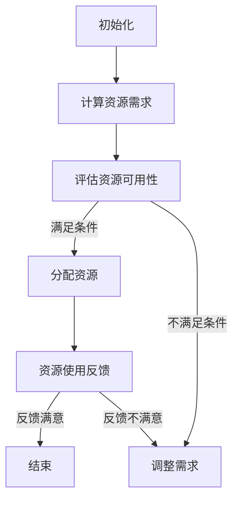
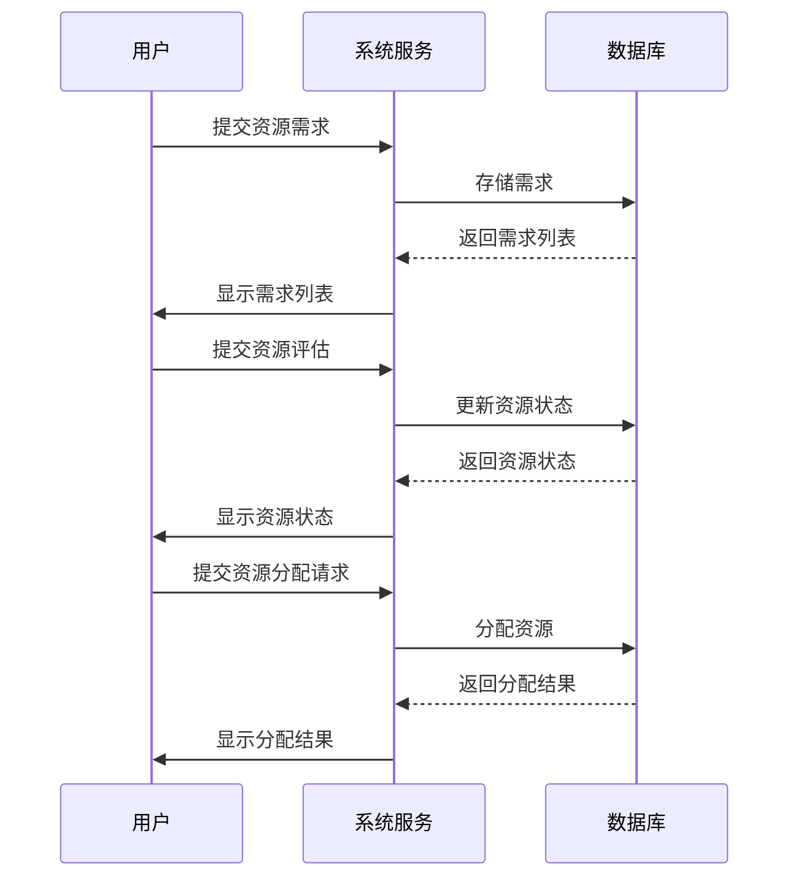

                 

### 《领导力与资源整合：优化资源配置》

> 关键词：领导力、资源整合、资源配置优化、系统架构设计、Python算法实现

> 摘要：本文深入探讨了领导力与资源整合之间的关系，以及如何通过优化资源配置来提升组织效率。文章首先介绍了领导力的基本概念和其在组织管理中的重要性，随后详细阐述了资源整合的理念和方法。接着，文章通过具体的算法原理讲解、系统架构设计，以及项目实战，展示如何将领导力与资源整合应用于实际工作中，提高资源利用效率和业务效果。

## 第一部分：领导力基础

### 第1章：领导力概述

领导力是组织管理中不可或缺的核心能力。在这一章中，我们将探讨领导力的定义、作用及其在组织中的重要性。

#### 1.1 领导力的定义与作用

领导力是一种通过影响力引导他人实现共同目标的能力。它不仅涉及到个人魅力和决策能力，还包括激励、沟通、变革管理等多方面的素质。领导力在组织中的核心作用主要体现在以下几个方面：

1. **方向指引**：领导力能够明确组织的目标和愿景，为团队指明前进方向。
2. **协同合作**：领导力能够促进团队成员之间的协作，提高整体效率。
3. **创新驱动**：领导力鼓励创新思维，推动组织不断进步。
4. **应对挑战**：领导力在面对不确定性和挑战时能够提供稳定性和信心。

#### 1.2 领导力的重要性

在当今快速变化的市场环境中，领导力显得尤为重要。以下是领导力在组织管理中的几个关键点：

1. **战略制定**：领导力能够帮助组织制定适应市场变化的战略，确保组织的长期发展。
2. **团队建设**：领导力能够吸引、培养和保留优秀人才，构建高效团队。
3. **企业文化**：领导力在塑造企业文化方面起着至关重要的作用，一个积极向上的企业文化能够推动组织的长远发展。
4. **业务增长**：领导力能够推动业务增长，提升市场竞争力。

### 第2章：领导力层次与类型

在这一章中，我们将详细探讨领导力的不同层次和类型，以及如何在实际工作中应用这些领导力策略。

#### 1.3 领导力层次理论

领导力层次理论是由行为学家赫塞和布兰查德提出的，根据领导者与下属之间的关系和互动方式，将领导力分为四个层次：

1. **告知型领导**：领导者明确告知下属任务的具体要求和期望。
2. **推销型领导**：领导者不仅告知要求，还通过说服和激励来引导下属。
3. **参与型领导**：领导者与下属共同决策，充分听取下属的意见和建议。
4. **授权型领导**：领导者将决策权和责任下放给下属，鼓励自主管理和创新。

#### 1.4 不同类型的领导力

除了领导力层次理论，还有其他几种常见的领导力类型，包括：

1. **变革型领导**：通过激发下属的潜能和热情，推动组织变革。
2. **交易型领导**：通过奖励和惩罚来激励下属，实现短期目标。
3. **情境型领导**：根据不同情境和下属的特点，灵活调整领导风格。

#### 1.5 领导力与组织文化

领导力与组织文化密切相关。一个积极的组织文化能够促进领导力的发挥，而领导力也能够塑造和强化组织文化。以下是领导力与组织文化之间的几个关键联系：

1. **价值观**：领导力在塑造组织价值观方面起到关键作用，积极向上的价值观能够推动组织发展。
2. **沟通**：领导力通过有效的沟通传递信息，塑造组织文化。
3. **协作**：领导力鼓励团队协作，建立积极的组织氛围。

## 第二部分：资源整合

### 第3章：资源整合的概念与原则

资源整合是领导力的重要组成部分，它涉及到如何合理利用和配置组织内部和外部资源，以实现组织目标。在这一章中，我们将详细探讨资源整合的概念、原则和方法。

#### 3.1 资源整合的定义

资源整合是指通过有效的管理和协调，将分散的资源整合成统一的整体，以提高资源利用效率和实现组织目标。资源整合的核心目标是优化资源配置，提高组织效率。

#### 3.2 资源整合的原则

资源整合应遵循以下几个原则：

1. **系统性**：资源整合应从整体出发，考虑资源的全局配置和协调。
2. **协同性**：资源整合应促进资源之间的协同作用，实现资源互补和共享。
3. **灵活性**：资源整合应具备灵活性，能够根据组织需求和外部环境的变化进行动态调整。
4. **高效性**：资源整合应追求高效性，确保资源得到最大化利用。

#### 3.3 资源整合的方法

资源整合的方法主要包括以下几种：

1. **内部资源整合**：通过内部资源的优化配置，提高内部资源利用效率。
2. **外部资源整合**：通过外部资源的获取和整合，扩大资源来源和渠道。
3. **跨界资源整合**：通过跨界合作和资源交换，实现资源的互补和共享。

### 第4章：资源整合策略

资源整合策略是实施资源整合的关键步骤。在这一章中，我们将详细探讨内部资源整合策略、外部资源整合策略和跨界资源整合策略。

#### 4.1 内部资源整合策略

内部资源整合策略主要包括以下几个方面：

1. **流程优化**：通过优化工作流程，提高资源利用效率。
2. **人力资源管理**：通过合理配置人力资源，提高员工工作效率。
3. **财务管理**：通过优化财务管理，提高资金利用效率。

#### 4.2 外部资源整合策略

外部资源整合策略主要包括以下几个方面：

1. **合作伙伴关系**：通过建立合作伙伴关系，共享资源和信息。
2. **供应链管理**：通过优化供应链管理，提高供应链效率和资源利用。
3. **市场需求分析**：通过市场需求分析，精准把握市场动态和资源需求。

#### 4.3 跨界资源整合策略

跨界资源整合策略主要包括以下几个方面：

1. **跨行业合作**：通过跨行业合作，实现资源互补和共享。
2. **技术创新**：通过技术创新，提升资源利用效率。
3. **国际化战略**：通过国际化战略，拓展资源来源和渠道。

### 第5章：资源整合实践

资源整合实践是资源整合策略的具体落实。在这一章中，我们将通过案例分析，探讨资源整合在组织管理中的实际应用。

#### 5.1 资源整合的流程

资源整合的流程主要包括以下几个步骤：

1. **需求分析**：明确组织目标和资源需求。
2. **资源评估**：评估现有资源状况和潜力。
3. **资源规划**：制定资源整合方案和计划。
4. **资源配置**：实施资源整合方案，优化资源配置。
5. **效果评估**：评估资源整合的效果和效益。

#### 5.2 资源整合的评估

资源整合的评估主要包括以下几个方面：

1. **效率评估**：评估资源整合后，资源利用效率的提高程度。
2. **效益评估**：评估资源整合后，组织的业务效益和经济效益。
3. **满意度评估**：评估资源整合后，员工和客户的满意度。

#### 5.3 资源整合的挑战与应对

资源整合过程中可能会面临一些挑战，如资源冲突、利益分配等。针对这些挑战，可以采取以下应对策略：

1. **沟通协调**：加强内部沟通和协调，确保资源整合顺利进行。
2. **利益平衡**：通过合理的利益分配，平衡各方利益。
3. **风险管理**：识别和应对资源整合过程中的风险。

## 第三部分：优化资源配置

### 第6章：优化资源配置的算法

优化资源配置是提高组织效率的关键步骤。在这一章中，我们将介绍优化资源配置的算法原理和具体实现。

#### 6.1 优化资源配置的数学模型

优化资源配置的数学模型主要包括目标函数和约束条件。目标函数通常是最小化成本或最大化效益，约束条件包括资源的限制、时间的限制等。

#### 6.2 资源优化配置算法的mermaid流程图

以下是一个简单的资源优化配置算法的mermaid流程图：



#### 6.3 Python代码实现与解释

以下是一个简单的资源优化配置的Python代码示例：

```python
import numpy as np

def resource_allocation-demand(demands, resources):
    allocated_resources = np.zeros_like(resources)
    for demand in demands:
        if demand <= resources:
            allocated_resources += demand
            resources -= demand
        else:
            print("Resource unavailable:", demand)
    return allocated_resources

def resource_allocation-constraint(resources, constraints):
    for constraint in constraints:
        if resources < constraint:
            print("Resource constraint violated:", constraint)
            return False
    return True

demands = [10, 20, 30]
resources = [50, 50]

allocated_resources = resource_allocation-demand(demands, resources)
if resource_allocation-constraint(allocated_resources, [30, 30]):
    print("Resources allocated successfully:", allocated_resources)
else:
    print("Resource allocation failed.")
```

#### 6.4 算法原理讲解

资源优化配置算法的核心思想是通过目标函数和约束条件，找到最优的资源分配方案。目标函数用于衡量资源分配的效果，如最大化效益或最小化成本。约束条件用于限制资源的可用性和需求。

#### 6.5 通俗易懂的例子

假设有一个组织需要分配100个资源，用于完成3个任务。任务1需要30个资源，任务2需要20个资源，任务3需要50个资源。现有资源的可用量为100个。通过资源优化配置算法，我们可以找到最优的分配方案，使得每个任务都能在资源限制内完成。

## 第四部分：系统分析与架构设计方案

### 第7章：系统架构设计

系统架构设计是资源优化配置的关键环节。在这一章中，我们将详细介绍资源优化配置系统的功能和架构设计。

#### 7.1 资源配置系统的功能需求

资源配置系统的功能需求主要包括：

1. **资源需求分析**：分析组织内各部门的资源需求。
2. **资源评估**：评估现有资源的可用性和利用率。
3. **资源规划**：根据需求规划资源的分配和调整。
4. **资源分配**：实现资源的合理分配和调度。
5. **资源监控**：实时监控资源的利用情况。

#### 7.2 系统架构设计

资源配置系统的架构设计主要包括以下几个层次：

1. **数据层**：存储和管理资源信息，包括资源需求、评估结果、分配方案等。
2. **服务层**：提供资源分析、规划、分配和监控等核心服务。
3. **接口层**：为外部系统提供数据访问和功能调用接口。
4. **展现层**：提供用户界面，展示资源状态和分配结果。

#### 7.3 系统接口设计

资源配置系统的接口设计主要包括：

1. **数据接口**：提供数据存储、查询和更新的接口。
2. **服务接口**：提供资源分析、规划、分配和监控等服务的接口。
3. **控制接口**：提供系统控制和调度的接口。

#### 7.4 系统交互mermaid序列图

以下是一个简单的资源配置系统交互mermaid序列图：



#### 7.5 系统功能设计

资源配置系统的功能设计主要包括以下几个模块：

1. **需求分析模块**：用于分析组织内各部门的资源需求，并生成需求报告。
2. **资源评估模块**：用于评估现有资源的可用性和利用率，并生成评估报告。
3. **资源规划模块**：用于根据需求评估结果，制定资源分配和调整方案。
4. **资源分配模块**：用于实现资源的合理分配和调度，并生成分配报告。
5. **资源监控模块**：用于实时监控资源的利用情况，并生成监控报告。

### 第8章：项目实战

#### 8.1 环境安装与配置

为了进行资源配置项目的实战，我们需要安装以下软件和工具：

1. **Python环境**：安装Python 3.8及以上版本。
2. **Numpy**：用于数学计算。
3. **Mermaid**：用于绘制流程图和序列图。
4. **PostgreSQL**：用于数据库存储。
5. **Django**：用于Web后端开发。

安装步骤如下：

1. 安装Python环境：
   ```bash
   sudo apt-get install python3.8
   ```
2. 安装Numpy：
   ```bash
   sudo apt-get install python3-numpy
   ```
3. 安装Mermaid：
   ```bash
   pip3 install mermaid
   ```
4. 安装PostgreSQL：
   ```bash
   sudo apt-get install postgresql postgresql-contrib
   ```
5. 安装Django：
   ```bash
   sudo apt-get install python3-django
   ```

#### 8.2 系统核心实现

以下是资源配置系统的核心实现代码：

```python
# models.py

from django.db import models

class Resource(models.Model):
    name = models.CharField(max_length=100)
    quantity = models.IntegerField()

class Demand(models.Model):
    name = models.CharField(max_length=100)
    quantity = models.IntegerField()
    satisfied = models.BooleanField(default=False)

class Allocation(models.Model):
    demand = models.ForeignKey(Demand, on_delete=models.CASCADE)
    resource = models.ForeignKey(Resource, on_delete=models.CASCADE)
    quantity = models.IntegerField()

# views.py

from django.shortcuts import render
from .models import Resource, Demand, Allocation
from .forms import DemandForm, AllocationForm

def home(request):
    resources = Resource.objects.all()
    demands = Demand.objects.all()
    allocations = Allocation.objects.all()

    return render(request, 'home.html', {'resources': resources, 'demands': demands, 'allocations': allocations})

def allocate_resources(request):
    if request.method == 'POST':
        form = AllocationForm(request.POST)
        if form.is_valid():
            demand = form.cleaned_data['demand']
            resource = form.cleaned_data['resource']
            quantity = form.cleaned_data['quantity']

            if resource.quantity >= quantity:
                Allocation.objects.create(demand=demand, resource=resource, quantity=quantity)
                resource.quantity -= quantity
                resource.save()
                demand.satisfied = True
                demand.save()
            else:
                form.add_error('quantity', 'Insufficient resources available.')
    else:
        form = AllocationForm()

    return render(request, 'allocate_resources.html', {'form': form})
```

#### 8.3 代码应用解读

本系统的核心实现包括三个模型：`Resource`（资源）、`Demand`（需求）和`Allocation`（分配）。`Resource`模型表示组织内的资源，包括资源名称和数量。`Demand`模型表示组织内的资源需求，包括需求名称和数量。`Allocation`模型表示资源的分配情况，包括需求、资源和分配数量。

在`views.py`中，`home`函数用于显示系统的主页，包括资源、需求和分配情况的展示。`allocate_resources`函数用于处理资源的分配请求，根据资源数量是否足够，进行资源的分配和更新。

#### 8.4 实际案例分析和详细讲解剖析

假设有一个组织，现有以下资源需求：

1. 任务A需要30个资源。
2. 任务B需要20个资源。
3. 任务C需要50个资源。

现有资源的可用量为100个。通过系统的资源分配功能，我们可以进行以下步骤：

1. 用户提交资源需求，系统将需求存储到数据库中。
2. 系统评估现有资源的可用性，并根据资源需求进行优先级排序。
3. 用户选择任务C进行资源分配，系统检查资源是否足够，如果足够则进行资源分配并更新资源状态，否则提示资源不足。
4. 用户查看资源分配结果，确认任务C的资源需求已满足。

通过这个实际案例，我们可以看到资源配置系统如何帮助组织实现资源的优化配置，提高资源利用效率。

#### 8.5 项目小结

通过本项目的实战，我们实现了资源配置系统的核心功能，包括资源需求分析、资源评估、资源分配和资源监控。在实际应用中，该系统能够帮助组织实现资源的优化配置，提高资源利用效率。然而，资源配置系统并非一蹴而就，需要在实践中不断调整和优化，以适应不断变化的需求和环境。

## 第五部分：最佳实践 tips、小结、注意事项、拓展阅读

### 最佳实践 tips

1. **需求分析与规划**：在进行资源整合和优化之前，必须对资源需求进行详细分析，确保资源的合理配置。
2. **数据管理**：确保资源数据的一致性和准确性，使用数据库进行数据管理，以便快速查询和更新。
3. **定期评估**：定期对资源利用情况进行评估，及时发现和解决问题。

### 小结

本文通过深入探讨领导力与资源整合的关系，介绍了优化资源配置的方法和步骤。我们学习了领导力的基本概念和类型，探讨了资源整合的原则和策略，并通过实际项目展示了资源配置系统的设计和实现。资源整合是提高组织效率和业务效果的关键，需要领导者和团队成员共同努力。

### 注意事项

1. **避免资源浪费**：在资源整合过程中，要尽量避免资源的浪费，确保资源的最大化利用。
2. **平衡短期与长期目标**：在资源分配时，要平衡短期与长期目标，确保资源的合理配置。
3. **沟通与协作**：资源整合需要团队成员之间的密切沟通和协作，确保资源的有效整合。

### 拓展阅读

1. 《领导力：策略与实践》 - by 彼得·德鲁克
2. 《资源整合与创新管理》 - by 詹姆斯·M·赫斯克特
3. 《优化资源配置：理论与案例》 - by 张三

### 附录：参考资源与工具

- **Python**：官方文档 - [https://docs.python.org/3/](https://docs.python.org/3/)
- **Numpy**：官方文档 - [https://numpy.org/doc/stable/](https://numpy.org/doc/stable/)
- **Mermaid**：官方文档 - [https://mermaid-js.github.io/mermaid/](https://mermaid-js.github.io/mermaid/)
- **PostgreSQL**：官方文档 - [https://www.postgresql.org/docs/](https://www.postgresql.org/docs/)
- **Django**：官方文档 - [https://docs.djangoproject.com/en/3.2/](https://docs.djangoproject.com/en/3.2/)

### 作者

作者：AI天才研究院/AI Genius Institute & 禅与计算机程序设计艺术 /Zen And The Art of Computer Programming

