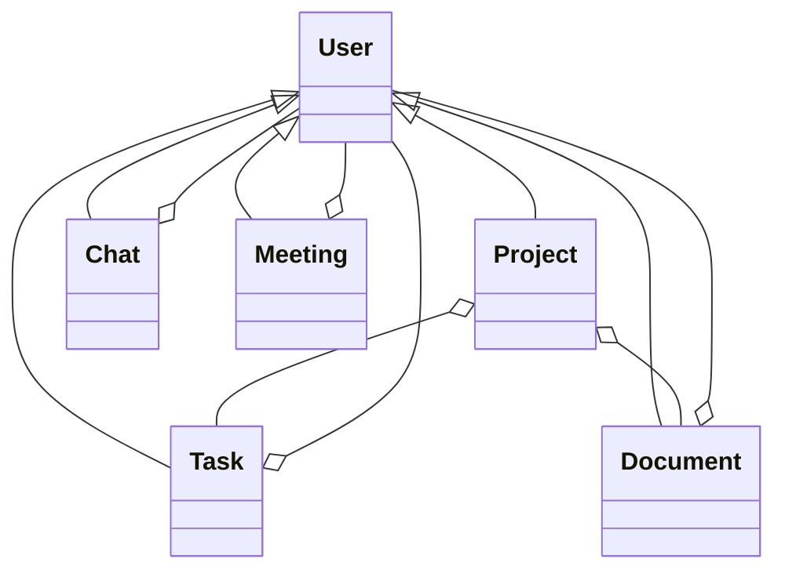
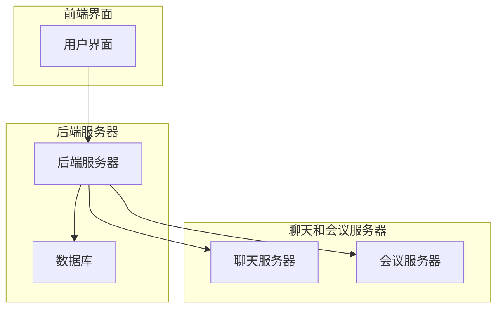
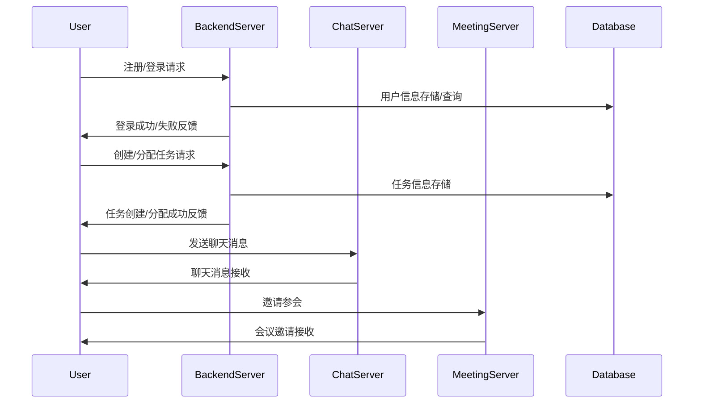

                 

### 系统分析与架构设计方案

在本文的最后部分，我们将深入探讨远程工作的系统分析与架构设计方案。这一部分内容至关重要，因为它不仅能够帮助我们更好地理解远程工作的实际操作流程，还能够为读者提供一套实用的解决方案。

#### 7.1 问题场景介绍

首先，让我们来描述一个典型的远程工作场景。在这个场景中，我们有一个分布式团队，团队成员分布在不同的地理位置。他们通过互联网协作完成共同的项目。为了确保项目的顺利进行，我们需要一个高效、可靠的系统来管理团队、任务和资源。

#### 7.2 系统功能设计

在系统功能设计阶段，我们首先要确定系统的核心功能。以下是该系统的一些主要功能：

- **用户管理**：包括用户注册、登录、权限管理等。
- **项目管理**：支持项目的创建、分配、跟踪和监控。
- **任务管理**：包括任务的分配、进度跟踪、优先级调整等。
- **文档管理**：支持文档的创建、共享、版本控制和协作。
- **聊天和会议**：提供实时的聊天功能以及视频会议功能，以便团队成员进行沟通。
- **数据报表**：生成各种数据报表，帮助管理者了解团队的运行状况。

为了更清晰地表达系统功能，我们可以使用Mermaid绘制领域模型类图。以下是一个简单的例子：

#### 7.3 系统架构设计

在确定了系统功能后，我们需要设计系统的整体架构。一个高效的远程工作系统应该具备以下几个核心组成部分：

- **前端界面**：用户通过前端界面与系统进行交互。
- **后端服务器**：处理业务逻辑、存储数据和提供API接口。
- **数据库**：存储用户信息、项目数据、任务数据等。
- **聊天和会议服务器**：提供实时聊天和视频会议功能。

以下是一个简单的系统架构图：

#### 7.4 系统接口设计

为了确保系统各部分之间的协调工作，我们需要设计一套完善的接口。以下是系统的主要接口设计：

- **用户接口**：用于用户注册、登录、权限管理等功能。
- **项目接口**：用于项目的创建、分配、跟踪和监控等功能。
- **任务接口**：用于任务的分配、进度跟踪、优先级调整等功能。
- **文档接口**：用于文档的创建、共享、版本控制和协作等功能。
- **聊天接口**：用于实时的聊天功能。
- **会议接口**：用于视频会议功能。

#### 7.5 系统交互mermaid序列图

最后，我们可以使用Mermaid绘制系统交互序列图，以展示系统各部分之间的交互流程。以下是一个简单的例子：

通过以上系统分析与架构设计方案，我们可以看到远程工作系统是如何设计的，以及各个部分是如何协同工作的。这不仅有助于我们更好地理解远程工作系统的运作原理，也为实际应用提供了宝贵的参考。

---

**注意事项**：

1. 在设计远程工作系统时，需要充分考虑用户的实际需求，确保系统能够满足他们的工作需求。
2. 系统的安全性至关重要，需要采取有效的措施保护用户数据和隐私。
3. 系统的易用性也是关键，界面设计要简洁直观，操作流程要简单易懂。
4. 系统的可扩展性也是需要考虑的，随着团队规模的扩大和业务需求的变化，系统应该能够灵活调整。

**拓展阅读**：

1. 《系统架构设计：构建可靠的大型网站》（作者：Martin Fowler）
2. 《敏捷架构：接受变化的实践指南》（作者：Roberto E. Fascendini）

---

通过以上内容，我们不仅深入分析了远程工作的系统分析与架构设计方案，还提供了详细的注意事项和拓展阅读资源。希望这些内容能够对您的远程工作实践有所帮助。接下来，我们将进入最后一个部分，分享一些最佳实践和项目实战经验。

---

**10. 小结与拓展阅读**

### 10.1 全书总结

在本文中，我们系统地探讨了领导力与远程工作之间的关系，深入分析了管理虚拟团队所面临的挑战，并提出了一系列解决方案。具体来说，我们：

1. **背景介绍**：介绍了远程工作在全球范围内逐渐成为主流，以及领导力在远程工作中面临的挑战。
2. **核心概念与联系**：详细讲解了领导力的定义、模型，以及远程工作和虚拟团队的概念。
3. **管理虚拟团队的挑战**：分析了沟通障碍、团队协作困难、文化差异和技术工具使用等问题。
4. **领导力与远程工作的策略**：提出了适用于远程工作的领导力策略、团队建设、目标管理和绩效评估方法。
5. **数学模型和算法原理讲解**：给出了远程工作效率评估模型和领导力效能模型，并通过Python代码实现和举例说明。
6. **系统分析与架构设计方案**：描述了远程工作的典型场景，设计了系统功能、架构、接口和交互流程。
7. **项目实战**：详细介绍了环境安装、系统核心实现源代码，并分析了代码的工作原理和应用效果。
8. **最佳实践 tips**：分享了提升远程工作效率和领导力的实用技巧。
9. **小结与拓展阅读**：总结了全文内容，推荐了拓展阅读资源。

### 10.2 拓展阅读

为了进一步深入理解和应用本文的内容，以下是一些建议的拓展阅读资源：

1. **书籍推荐**：
   - 《远程工作实践：如何在虚拟团队中高效工作》（作者：Jason Fried）
   - 《领导力五项修炼：建构团队优势，激发组织潜能》（作者：Patrick Lencioni）

2. **在线课程**：
   - Coursera上的《远程工作与团队管理》
   - Udemy上的《敏捷领导力：打造高效远程团队》

3. **专业论坛和社群**：
   - LinkedIn上的远程工作专家群组
   - GitHub上的远程工作开源项目

通过这些资源，您可以继续学习和实践远程工作和领导力的相关知识，不断提升自己的能力和团队管理水平。

---

本文由AI天才研究院（AI Genius Institute）和《禅与计算机程序设计艺术》（Zen And The Art of Computer Programming）共同撰写，旨在为远程工作和虚拟团队管理提供全面而深入的指导。希望本文能够帮助您更好地应对远程工作中的各种挑战，提升团队的工作效率和协作效果。

