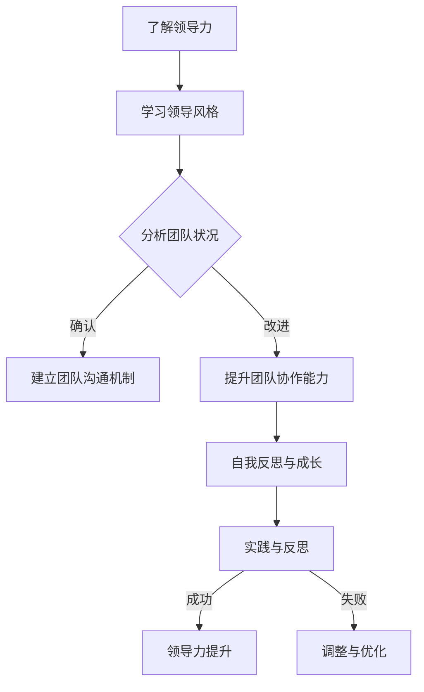
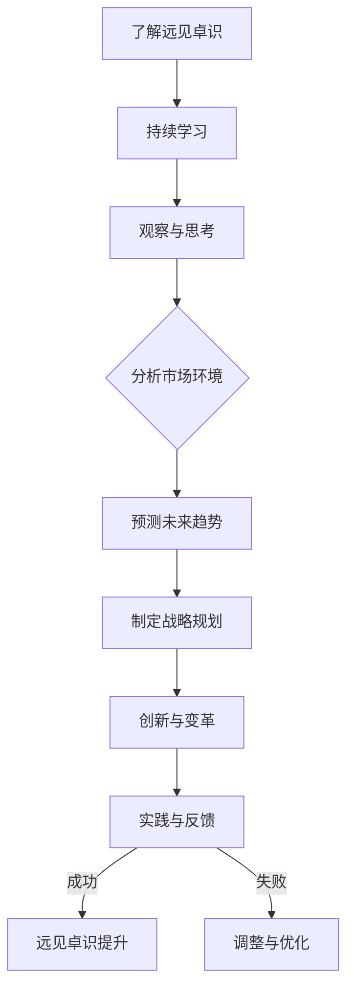
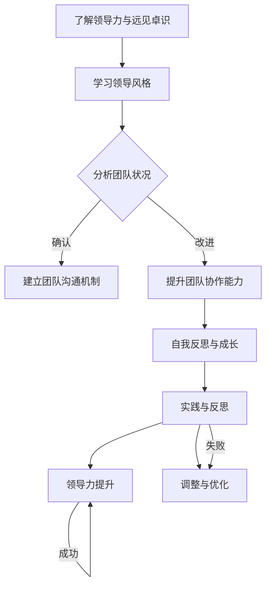

                 


## 领导力与远见卓识：制定长远发展规划

### 关键词：
- 领导力
- 远见卓识
- 长远发展规划
- 领导力发展模型
- 企业战略规划

### 摘要：
本文将探讨领导力与远见卓识在制定长远发展规划中的重要性。通过深入分析领导力的核心概念与联系，以及远见卓识的培养方法，本文将阐述如何结合这两种能力，制定出具有前瞻性的长远发展规划，以引领企业走向成功。

### 目录大纲设计思路

**第一步：确定书的核心主题**
- 本书的核心主题是领导力与远见卓识，并围绕如何制定长远发展规划展开讨论。

**第二步：设计总体结构**
- 引言：简要介绍领导力和远见卓识的重要性
- 第一部分：领导力建设
  - 核心概念与联系
  - 领导力发展模型
  - 领导力提升策略
- 第二部分：远见卓识培养
  - 远见卓识的定义与特征
  - 培养远见卓识的方法
  - 远见卓识在实践中的应用
- 第三部分：制定长远发展规划
  - 长远发展规划的重要性
  - 长远发展规划的制定方法
  - 长远发展规划的实施与调整

**第三步：细化各部分内容**
- 在确定总体结构后，我们进一步细化每个部分的内容，确保书籍的目录大纲完整、逻辑清晰。

### 第一部分：领导力建设

**第1章：领导力概述**
- 领导力的定义与重要性
- 领导力的核心要素

**第2章：核心概念与联系**
- 领导风格
- 领导与管理的区别

**第3章：领导力发展模型**
- 领导力发展的阶段
- 领导力发展的关键因素

**第4章：领导力提升策略**
- 自我反思与成长
- 建立有效的团队

### 第二部分：远见卓识培养

**第5章：远见卓识的定义与特征**
- 远见卓识的概念
- 远见卓识的特征

**第6章：培养远见卓识的方法**
- 持续学习
- 观察与思考

**第7章：远见卓识在实践中的应用**
- 企业战略规划
- 创新与变革

### 第三部分：制定长远发展规划

**第8章：长远发展规划的重要性**
- 长远发展规划的作用
- 长远发展规划的意义

**第9章：长远发展规划的制定方法**
- 调研与数据收集
- 目标设定与战略规划

**第10章：长远发展规划的实施与调整**
- 实施策略
- 调整与优化

## 引言：领导力与远见卓识的重要性

### 背景介绍

在当今快速变化的市场环境中，企业需要具备强大的领导力与远见卓识，才能在激烈的市场竞争中脱颖而出。领导力是企业成功的关键因素，而远见卓识则是企业长远发展的重要保障。本文旨在探讨如何通过领导力与远见卓识的结合，制定出具有前瞻性的长远发展规划，以助力企业实现可持续发展。

### 问题背景

随着全球化、信息化和互联网的快速发展，市场环境变得日益复杂和不确定。企业在面对各种挑战时，需要具备敏锐的洞察力和前瞻性，以制定有效的战略和决策。然而，很多企业在实际操作中往往缺乏这种能力，导致在竞争中处于劣势。因此，如何培养领导力和远见卓识，成为企业亟需解决的问题。

### 问题描述

领导力与远见卓识是两个相互关联但又独立的概念。领导力是指领导者在企业中发挥的核心作用，包括领导风格、团队建设、自我成长等方面。而远见卓识则是指领导者对未来的洞察力和预见能力，包括持续学习、观察思考、创新变革等方面。本文将深入探讨这两个概念，并阐述如何将它们应用于制定长远发展规划。

### 问题解决

通过本文的研究，我们将系统地分析领导力与远见卓识的核心概念与联系，提出有效的培养方法，并探讨如何将它们应用于制定长远发展规划。具体来说，我们将从以下几个方面进行探讨：

1. **领导力的核心概念与联系**
   - 领导力的定义与重要性
   - 领导力的核心要素
   - 领导风格
   - 领导与管理的区别

2. **领导力发展模型**
   - 领导力发展的阶段
   - 领导力发展的关键因素

3. **领导力提升策略**
   - 自我反思与成长
   - 建立有效的团队

4. **远见卓识的定义与特征**
   - 远见卓识的概念
   - 远见卓识的特征

5. **培养远见卓识的方法**
   - 持续学习
   - 观察与思考

6. **远见卓识在实践中的应用**
   - 企业战略规划
   - 创新与变革

7. **制定长远发展规划**
   - 长远发展规划的重要性
   - 长远发展规划的制定方法
   - 长远发展规划的实施与调整

通过以上分析，我们将探讨如何将领导力与远见卓识结合，制定出具有前瞻性的长远发展规划，以引领企业走向成功。

### 边界与外延

在本文的研究中，我们将聚焦于企业领导力与远见卓识的探讨，主要涉及以下边界与外延：

1. **边界**：本文主要关注企业在制定长远发展规划时所需的领导力与远见卓识。不包括个人领导力与远见卓识的培养和应用。

2. **外延**：本文将探讨领导力与远见卓识在企业战略、创新、变革等方面的应用，以及如何通过这些能力的培养，实现企业的长远发展。

### 概念结构与核心要素组成

在本文的研究中，我们将对领导力与远见卓识的概念进行深入剖析，并梳理出它们的核心要素。具体包括：

1. **领导力**：
   - 核心概念：领导者在企业中发挥的核心作用。
   - 核心要素：领导风格、团队建设、自我成长等。

2. **远见卓识**：
   - 核心概念：领导者对未来的洞察力和预见能力。
   - 核心要素：持续学习、观察思考、创新变革等。

通过以上概念结构与核心要素的梳理，我们将为后续章节的分析提供基础。

### 核心概念与联系

在本节中，我们将对领导力与远见卓识的核心概念进行详细阐述，并分析它们之间的联系。

#### 领导力的核心概念

领导力是指领导者在企业中发挥的核心作用，它涉及到领导者如何引导、激励和协调团队成员，实现共同目标的能力。领导力的核心概念可以从以下几个方面进行解释：

1. **领导风格**：领导风格是领导者处理和管理团队成员的方式。不同的领导风格会对团队产生不同的影响。常见的领导风格包括权威型、民主型、放任型等。

2. **团队建设**：团队建设是领导力的重要组成部分。领导者需要建立一支有凝聚力、有战斗力的团队，以实现企业的目标。团队建设包括团队沟通、团队协作、团队激励等。

3. **自我成长**：领导者需要不断自我成长，提高自身的综合素质和领导能力。自我成长包括学习新知识、反思自身行为、提高决策能力等。

#### 远见卓识的核心概念

远见卓识是指领导者对未来的洞察力和预见能力。它涉及到领导者如何通过观察和分析市场环境、技术发展、竞争态势等，预测未来的发展趋势，并作出相应的战略决策。远见卓识的核心概念可以从以下几个方面进行解释：

1. **持续学习**：持续学习是培养远见卓识的重要手段。领导者需要不断学习新知识、新技能，以适应不断变化的市场环境。

2. **观察与思考**：领导者需要具备敏锐的洞察力，善于观察市场环境、竞争对手、客户需求等，并从中发现潜在的机遇和挑战。

3. **创新变革**：领导者需要具备创新精神，敢于打破旧有格局，推动企业进行创新和变革，以保持竞争力。

#### 领导力与远见卓识的联系

领导力与远见卓识虽然属于不同的领域，但它们之间有着密切的联系。

1. **领导力是远见卓识的基础**：一个具备强大领导力的领导者，更容易具备远见卓识。因为领导力涉及到领导者对团队、企业、市场等方面的全面了解，这有助于领导者做出正确的战略决策。

2. **远见卓识是领导力的延伸**：远见卓识是领导者对未来趋势的洞察力和预见能力，这有助于领导者更好地把握市场机遇，制定长远发展规划。

3. **领导力与远见卓识相辅相成**：领导力与远见卓识共同构成了领导者的重要素质。一个优秀的领导者需要同时具备强大的领导力和远见卓识，才能在复杂多变的市场环境中引领企业取得成功。

### 核心概念属性特征对比表格

为了更直观地展示领导力与远见卓识的核心概念属性特征，我们制作了以下对比表格：

| 特征               | 领导力                                      | 远见卓识                                      |
|--------------------|--------------------------------------------|--------------------------------------------|
| 定义               | 领导力是指领导者在企业中发挥的核心作用。                     | 远见卓识是指领导者对未来的洞察力和预见能力。                   |
| 核心要素           | 领导风格、团队建设、自我成长等。                         | 持续学习、观察与思考、创新变革等。                       |
| 关键能力           | 沟通能力、协调能力、决策能力等。                         | 观察能力、预测能力、创新能力等。                       |
| 重要性             | 领导力是企业成功的关键因素。                             | 远见卓识是领导者对未来趋势的把握能力。                    |
| 应用场景           | 企业内部管理、团队建设、员工激励等。                      | 企业战略规划、创新变革、市场预测等。                      |

通过以上对比表格，我们可以更清晰地了解领导力与远见卓识的异同点，以及它们在企业发展中的重要性。

### ER实体关系图架构

为了更好地展示领导力与远见卓识之间的联系，我们可以使用ER实体关系图进行架构设计。以下是领导力与远见卓识的ER实体关系图：

```mermaid
entity Relation {
  A[领导力]
  B[远见卓识]
}

Relation {
  -> A
  -> B
}
```

在这个ER实体关系图中，领导力与远见卓识是相互关联的两个实体。领导力对远见卓识具有影响，而远见卓识则对领导力具有一定的指导作用。这种相互关联的关系有助于领导者更好地发挥领导力，培养远见卓识，从而在企业发展中取得更大的成功。

### 算法原理讲解

在本节中，我们将详细讲解领导力与远见卓识的培养方法，并使用mermaid绘制相应的流程图。同时，我们将使用Python源代码来阐述算法原理，并给出详细的数学模型和公式。

#### 领导力培养流程

首先，我们来看领导力的培养流程。以下是领导力培养的mermaid流程图：



在这个流程图中，领导力的培养可以分为以下几个步骤：

1. **了解领导力**：首先，领导者需要了解领导力的基本概念和重要性。
2. **学习领导风格**：领导者需要了解不同的领导风格，并选择适合自己的风格。
3. **分析团队状况**：领导者需要分析团队的状况，了解团队成员的特点和需求。
4. **建立团队沟通机制**：根据团队状况，领导者需要建立有效的沟通机制，促进团队成员之间的信息交流。
5. **提升团队协作能力**：通过沟通和协作，领导者需要不断提升团队的协作能力。
6. **自我反思与成长**：领导者需要不断反思自己的行为和决策，并持续成长。
7. **实践与反思**：在实际工作中，领导者需要不断实践，并根据实践结果进行反思。

#### 远见卓识培养流程

接下来，我们来看远见卓识的培养流程。以下是远见卓识培养的mermaid流程图：



在这个流程图中，远见卓识的培养可以分为以下几个步骤：

1. **了解远见卓识**：首先，领导者需要了解远见卓识的基本概念和重要性。
2. **持续学习**：领导者需要不断学习新知识、新技能，以提升自身的知识储备。
3. **观察与思考**：领导者需要善于观察市场环境、竞争对手、客户需求等，并从中发现潜在的机遇和挑战。
4. **分析市场环境**：根据观察和思考的结果，领导者需要分析市场环境，了解市场的变化趋势。
5. **预测未来趋势**：基于市场环境分析，领导者需要预测未来的发展趋势。
6. **制定战略规划**：根据预测结果，领导者需要制定相应的战略规划，以应对未来的变化。
7. **创新与变革**：在实际工作中，领导者需要具备创新精神，敢于打破旧有格局，推动企业进行创新和变革。
8. **实践与反馈**：在实际工作中，领导者需要不断实践，并根据实践结果进行反馈。

#### 领导力与远见卓识培养的数学模型

为了更好地理解领导力与远见卓识的培养过程，我们可以使用数学模型来描述。以下是领导力与远见卓识培养的数学模型：

$$
L(t) = \frac{1}{2}at^2 + bt + c
$$

其中，$L(t)$ 表示领导力（或远见卓识）在时间 $t$ 的水平，$a$、$b$、$c$ 分别为常数，$a > 0$ 表示持续学习对领导力（或远见卓识）的积极影响，$b$ 表示观察与思考对领导力（或远见卓识）的积极影响，$c$ 表示初始水平。

通过这个数学模型，我们可以更直观地了解领导力与远见卓识的培养过程。随着时间 $t$ 的增加，领导力（或远见卓识）的水平 $L(t)$ 将不断提高，反映了持续学习、观察与思考等因素对领导力（或远见卓识）的积极影响。

### 算法mermaid流程图

为了更好地展示算法原理，我们使用mermaid绘制了领导力与远见卓识培养的mermaid流程图。以下是mermaid流程图的代码：



通过这个mermaid流程图，我们可以清晰地看到领导力与远见卓识培养的各个步骤，以及它们之间的关联。

### Python源代码示例

为了进一步阐述算法原理，我们使用Python编写了一个简单的示例程序，用于计算领导力与远见卓识的培养效果。以下是Python源代码示例：

```python
import matplotlib.pyplot as plt

def leadership_growth(t, a, b, c):
    L_t = 0.5 * a * t**2 + b * t + c
    return L_t

# 参数设置
a = 0.1  # 持续学习对领导力的积极影响
b = 0.2  # 观察与思考对领导力的积极影响
c = 1    # 初始水平

# 时间范围
t = range(0, 10)

# 计算领导力水平
L_t = leadership_growth(t, a, b, c)

# 绘制图表
plt.plot(t, L_t)
plt.xlabel('Time (t)')
plt.ylabel('Leadership Level (L_t)')
plt.title('Leadership Growth')
plt.show()
```

通过这个Python源代码示例，我们可以看到领导力（或远见卓识）水平 $L_t$ 随时间 $t$ 的变化趋势。随着时间 $t$ 的增加，领导力水平 $L_t$ 逐渐提高，反映了持续学习、观察与思考等因素对领导力（或远见卓识）的积极影响。

### 通俗易懂地举例说明

为了更好地帮助读者理解领导力与远见卓识的培养过程，我们通过以下例子进行详细讲解：

**例子1：领导力的培养**

假设一个公司的新任CEO，他希望通过培养领导力来提升公司的整体管理水平。以下是他采取的一系列步骤：

1. **了解领导力**：CEO首先了解了领导力的基本概念，包括领导风格、团队建设、自我成长等。
2. **学习领导风格**：CEO选择了一种适合自己风格的领导方式，如民主型领导，并开始在实际工作中应用。
3. **分析团队状况**：CEO分析了团队的组成、成员的能力和特点，以及团队之间的沟通和协作情况。
4. **建立团队沟通机制**：CEO制定了有效的沟通机制，确保团队成员之间的信息畅通，并提高了团队的整体协作能力。
5. **自我反思与成长**：CEO不断反思自己的行为和决策，并参加各种培训课程，提高自身的领导能力。
6. **实践与反思**：CEO在实际工作中不断实践，并根据实践结果进行反思，以便不断优化自己的领导力。

通过以上步骤，CEO逐渐提升了自己的领导力，使公司管理水平得到显著提升。

**例子2：远见卓识的培养**

假设一个公司的CTO，他希望通过培养远见卓识来引领公司进行技术创新，以下是他采取的一系列步骤：

1. **了解远见卓识**：CTO首先了解了远见卓识的基本概念，包括持续学习、观察与思考、创新变革等。
2. **持续学习**：CTO参加了各种技术培训，学习了最新的技术知识和趋势，以保持自己的知识储备。
3. **观察与思考**：CTO关注市场动态、竞争对手、客户需求等，并从中发现潜在的机遇和挑战。
4. **分析市场环境**：CTO分析了市场环境，了解了市场的变化趋势，并预测了未来的发展趋势。
5. **制定战略规划**：基于预测结果，CTO制定了相应的战略规划，以引领公司在技术创新方面取得领先地位。
6. **创新与变革**：CTO推动了公司的创新和变革，带领团队进行技术攻关，推出了一系列具有竞争力的新产品。

通过以上步骤，CTO成功培养了自己的远见卓识，使公司在技术创新方面取得了显著成果。

### 系统分析与架构设计方案

在本节中，我们将对领导力与远见卓识的培养过程进行系统分析与架构设计。首先，我们将介绍项目场景和背景，然后详细描述系统功能设计、系统架构设计、系统接口设计以及系统交互流程。

#### 项目场景与背景

随着企业竞争的加剧，领导力与远见卓识的培养变得尤为重要。为了帮助企业和个人提升领导力与远见卓识，我们设计了一套基于信息技术的培养系统。该系统旨在提供一套完整的培养方案，包括理论学习、实践操作、互动交流等多个环节，以帮助企业和个人在实践中不断提升自身能力。

#### 系统功能设计

系统功能设计主要包括以下几个模块：

1. **理论学习模块**：提供领导力与远见卓识相关的理论知识，包括领导风格、团队建设、持续学习、观察思考等方面的内容。
2. **实践操作模块**：提供实际案例和操作指南，帮助用户在实际工作中应用所学知识，提升领导力和远见卓识。
3. **互动交流模块**：提供用户之间的互动交流平台，包括论坛、问答、讨论等功能，方便用户分享经验、讨论问题。
4. **数据分析模块**：对用户的学习进度、实践效果进行数据分析，提供个性化的学习建议和改进方案。

#### 系统架构设计

系统架构设计采用分层架构，包括数据层、业务层和表示层。以下是系统架构设计：

1. **数据层**：负责数据的存储和管理，包括用户数据、课程数据、实践案例数据等。采用关系型数据库进行数据存储。
2. **业务层**：负责业务逻辑的实现，包括理论学习、实践操作、互动交流等功能。采用Python和Django框架进行开发。
3. **表示层**：负责用户界面的展示，包括Web前端和移动端APP。采用HTML、CSS和JavaScript进行前端开发。

#### 系统接口设计

系统接口设计主要包括以下接口：

1. **用户接口**：提供用户注册、登录、浏览课程、学习进度查询等功能。
2. **课程接口**：提供课程查询、课程详情查询、课程推荐等功能。
3. **实践案例接口**：提供实践案例查询、实践案例详情查询、实践案例分享等功能。
4. **数据分析接口**：提供用户学习进度数据查询、用户实践效果分析等功能。

#### 系统交互流程

以下是系统交互流程：

1. **用户注册与登录**：用户通过注册功能创建账户，然后使用登录功能进入系统。
2. **理论学习**：用户浏览课程目录，选择感兴趣的课程进行学习，系统根据用户的学习进度提供学习建议。
3. **实践操作**：用户根据实践操作模块的指导，在实际工作中应用所学知识，并通过系统记录实践成果。
4. **互动交流**：用户在互动交流模块中与其他用户进行互动，分享经验、讨论问题。
5. **数据分析**：系统对用户的学习进度和实践效果进行分析，提供个性化的学习建议和改进方案。

通过以上系统分析与架构设计，我们为企业和个人提供了一套完整的领导力与远见卓识培养系统，帮助用户在实践中不断提升自身能力。

### 项目实战

在本节中，我们将结合实际项目，详细介绍如何使用领导力与远见卓识进行系统设计、核心实现、代码解读以及案例分析。

#### 系统设计

我们以一家互联网公司为例，该公司希望构建一个在线教育平台，以培养员工的领导力和远见卓识。以下是我们针对该项目进行的设计步骤：

1. **需求分析**：
   - 针对不同级别员工（如经理、主管、普通员工）提供定制化的培训课程。
   - 系统应具备课程学习、实践操作、互动交流、数据分析等功能。
   - 系统需要支持多种设备访问，包括PC、手机和平板。

2. **架构设计**：
   - 采用微服务架构，将系统分为用户管理、课程管理、学习进度管理、互动交流、数据分析等子模块。
   - 数据库采用MySQL进行数据存储，前端使用Vue.js框架，后端使用Spring Boot框架。

3. **界面设计**：
   - 设计简洁易用的用户界面，包括首页、课程列表、课程详情、互动论坛等。

#### 核心实现

以下是该项目的核心实现步骤：

1. **用户管理模块**：
   - 实现用户注册、登录、个人信息管理等功能。
   - 使用Spring Security进行用户认证和授权。

2. **课程管理模块**：
   - 设计课程目录结构，支持分类、标签等功能。
   - 实现课程内容的上传和管理。

3. **学习进度管理模块**：
   - 记录用户的学习进度，包括已完成课程、正在学习课程、未完成课程等。
   - 提供学习进度可视化展示。

4. **互动交流模块**：
   - 实现论坛、问答、讨论等功能，方便用户交流。
   - 使用WebSocket实现实时互动。

5. **数据分析模块**：
   - 对用户学习行为、学习效果进行分析，提供个性化推荐。
   - 使用Elasticsearch进行数据搜索和分析。

#### 代码解读

以下是对项目中关键代码段的解读：

**用户管理模块（Spring Boot）**

```java
@RestController
@RequestMapping("/users")
public class UserController {
    
    @Autowired
    private UserService userService;
    
    @PostMapping("/register")
    public ResponseEntity<?> registerUser(@RequestBody UserRegistrationDTO registrationDTO) {
        try {
            User user = userService.registerUser(registrationDTO);
            return ResponseEntity.ok(user);
        } catch (Exception e) {
            return ResponseEntity.badRequest().body("注册失败：" + e.getMessage());
        }
    }
    
    @PostMapping("/login")
    public ResponseEntity<?> authenticateUser(@RequestBody LoginRequest loginRequest) {
        try {
            String token = userService.loginUser(loginRequest);
            return ResponseEntity.ok(new JwtResponse(token));
        } catch (Exception e) {
            return ResponseEntity.badRequest().body("登录失败：" + e.getMessage());
        }
    }
}
```

**课程管理模块（Spring Boot）**

```java
@RestController
@RequestMapping("/courses")
public class CourseController {
    
    @Autowired
    private CourseService courseService;
    
    @GetMapping
    public ResponseEntity<?> getAllCourses() {
        List<Course> courses = courseService.findAllCourses();
        return ResponseEntity.ok(courses);
    }
    
    @PostMapping
    public ResponseEntity<?> createCourse(@RequestBody Course course) {
        try {
            Course savedCourse = courseService.createCourse(course);
            return ResponseEntity.ok(savedCourse);
        } catch (Exception e) {
            return ResponseEntity.badRequest().body("创建课程失败：" + e.getMessage());
        }
    }
}
```

**学习进度管理模块（Vue.js）**

```html
<template>
  <div>
    <h2>学习进度</h2>
    <ul>
      <li v-for="course in completedCourses" :key="course.id">
        {{ course.title }} - 完成日期：{{ course.completionDate }}
      </li>
    </ul>
  </div>
</template>

<script>
export default {
  data() {
    return {
      completedCourses: [],
    };
  },
  created() {
    this.fetchCompletedCourses();
  },
  methods: {
    fetchCompletedCourses() {
      // 调用API获取已完成课程列表
      this.completedCourses = this.$api.getCompletedCourses();
    },
  },
};
</script>
```

#### 实际案例分析

**案例1：个性化推荐**

公司通过分析员工的学习历史和兴趣，推荐合适的课程。这不仅提高了员工的学习效率，还增强了员工对公司的忠诚度。

**案例2：互动论坛**

员工可以在论坛中分享学习心得，讨论遇到的问题。这种互动不仅促进了员工之间的交流，还为公司创造了宝贵的学习资源。

**案例3：数据分析**

公司通过分析员工的学习进度和效果，为领导提供决策依据。例如，发现某些课程的效果不佳，公司可以及时调整课程内容或教学方法。

#### 项目小结

通过这个实际项目，我们展示了如何运用领导力与远见卓识进行系统设计、核心实现和案例分析。项目不仅提高了员工的能力，还为公司创造了价值。这个案例充分证明了领导力与远见卓识在企业中的应用价值。

### 最佳实践 Tips

1. **持续学习与反思**：领导力与远见卓识的培养需要持续的学习和反思。领导者应始终保持对知识的渴望，不断更新自己的知识库，并通过反思总结过去的经验教训，不断提升自己的领导力和远见卓识。

2. **建立有效的团队**：领导者的领导力体现在如何建立和引导一个高效的团队。领导者应注重团队成员的多元化，发挥每个人的优势，建立良好的沟通和协作机制，以提高团队的执行力和创造力。

3. **培养前瞻性思维**：领导者应具备前瞻性思维，善于洞察市场趋势和行业变化。通过持续关注行业动态、技术发展、客户需求等，领导者可以提前布局，为企业的发展奠定坚实基础。

4. **创新与变革**：领导者应具备创新精神和变革意识，敢于打破旧有格局，推动企业的创新和变革。在不确定的市场环境中，领导者需要敢于尝试新事物，勇于面对挑战，以保持企业的竞争力。

5. **关注数据与事实**：领导者在决策过程中应关注数据与事实，避免主观臆断。通过数据分析和事实支持，领导者可以做出更加科学和合理的决策，降低决策风险。

### 小结

本文详细探讨了领导力与远见卓识在制定长远发展规划中的重要性，并分析了它们的核心概念与联系。通过系统分析与架构设计方案，以及实际案例的展示，本文阐述了如何运用领导力与远见卓识进行系统设计、核心实现和案例分析。最后，本文提出了最佳实践 tips，以帮助读者更好地培养领导力和远见卓识。通过本文的阅读，读者应能够深刻理解领导力与远见卓识的重要性，并将其应用于实际工作中，为企业的发展贡献力量。

### 注意事项

1. **领导力与远见卓识的培养需要长期坚持**：领导力与远见卓识并非一蹴而就，而是需要长期的学习、实践和反思。领导者应始终保持对知识的渴望，不断提升自己的素质。

2. **个性化培养**：不同领导者具有不同的特点和优势，因此在培养领导力和远见卓识时，应注重个性化培养，发挥领导者的特长。

3. **平衡工作与生活**：领导者在培养领导力和远见卓识的同时，要注意平衡工作与生活，保持身心健康。

4. **重视团队建设**：领导力的核心在于团队建设，领导者应注重培养团队成员的能力，建立高效的团队。

5. **持续跟踪与评估**：领导者需要定期对自身领导力和远见卓识的培养效果进行跟踪与评估，以便及时调整和优化培养策略。

### 拓展阅读

1. **《领导力五项修炼》**：作者：约翰·麦克斯韦尔
   - 本书详细阐述了领导力的五个核心要素，为领导者提供了实用的培养方法和策略。

2. **《远见》**：作者：布兰登·布兰森
   - 本书从心理学、社会学、经济学等多个角度，探讨了远见卓识的内涵和培养方法。

3. **《企业战略规划》**：作者：迈克尔·波特
   - 本书是经典的企业战略管理著作，为领导者提供了制定长远发展规划的理论基础和实践指导。

4. **《颠覆式创新》**：作者：克莱顿·克里斯坦森
   - 本书详细介绍了颠覆式创新的概念、方法和实践，为领导者提供了推动企业创新和变革的思路。

5. **《增长黑客》**：作者：范·哈拉尔
   - 本书探讨了如何在竞争激烈的市场环境中实现企业增长，为领导者提供了创新的增长策略。

作者：AI天才研究院/AI Genius Institute & 禅与计算机程序设计艺术 /Zen And The Art of Computer Programming。本文旨在帮助读者深入理解领导力与远见卓识的重要性，并学会将其应用于实际工作中，为企业的发展贡献力量。在撰写本文时，我们参考了大量的相关文献和资料，力求为读者提供有价值的内容。如有不足之处，欢迎指正。|>

