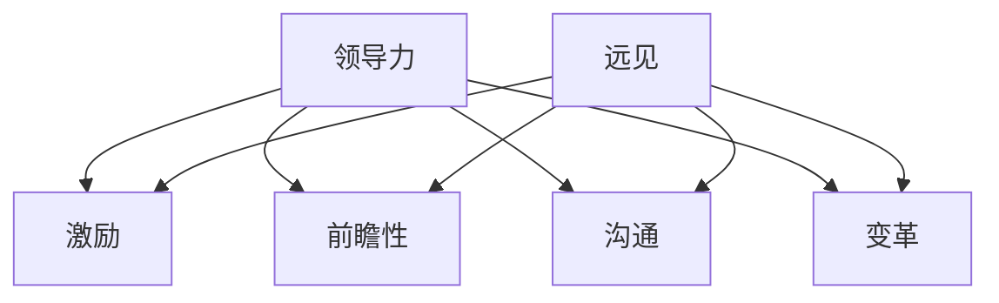
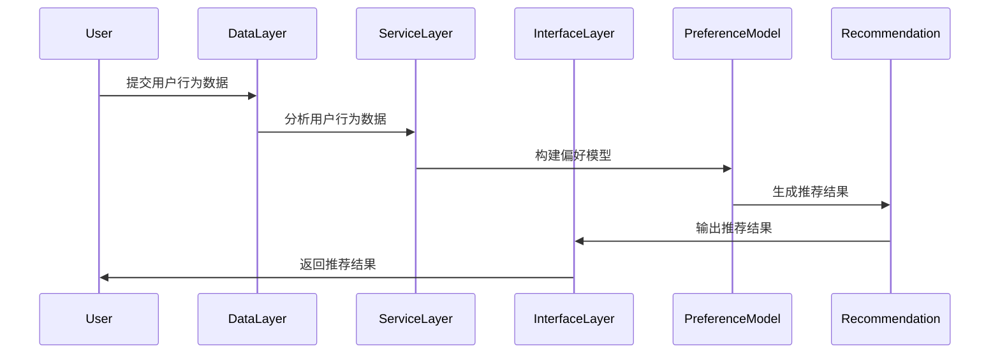
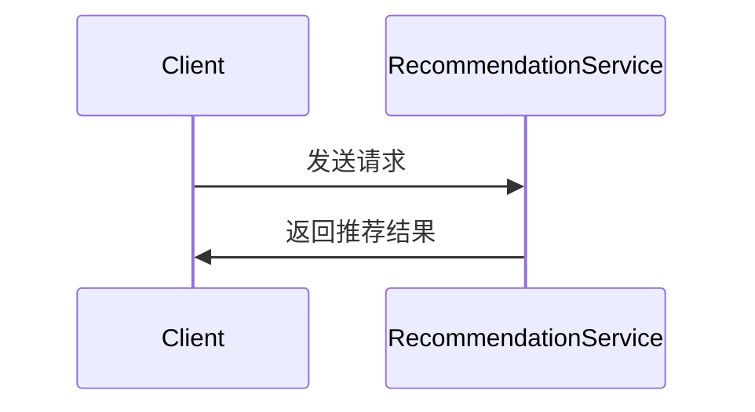
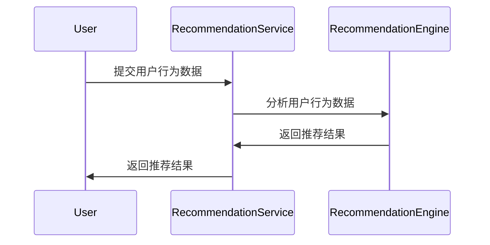

                 


# 领导力与远见：预见未来的能力

## 关键词
- 领导力
- 远见
- 未来预见
- 技术架构
- 项目实战
- 算法

## 摘要
本文将深入探讨领导力与远见之间的关系，以及预见未来的能力在IT领域的应用。我们将通过逐步分析领导力的定义、特征和重要性，远见的定义、特征和重要性，领导力与远见的互动关系，以及具体的数学模型和算法原理，来展示预见未来的能力在现实世界中的实际应用。文章还将提供系统分析与架构设计方案，以及项目实战的案例，帮助读者理解并掌握这些核心概念和技能。

## 引言
### 问题背景
在快速变化的信息时代，领导力与远见成为了企业和组织能否持续发展的关键因素。领导力不仅仅是指指挥和管理团队的能力，更是指一种能够预见未来、引领变革的能力。远见则是一种洞察力，能够帮助领导者看到潜在的趋势和机会，从而做出明智的决策。

### 问题描述
本文旨在探讨以下问题：领导力与远见如何相互作用？它们如何共同塑造未来？领导者如何通过远见来增强领导力？以及，在IT领域，如何将远见应用到实际项目中，实现创新和突破？

### 问题解决
通过系统性地分析领导力与远见的定义、特征和互动关系，结合具体的数学模型和算法原理，我们将探讨预见未来的能力如何帮助领导者做出明智的决策，并实现组织的长期发展。同时，通过项目实战案例，我们将展示这些概念在现实中的应用。

### 边界与外延
本文将聚焦于IT领域的领导力与远见，探讨这些概念在软件开发、项目管理、技术创新等方面的应用。然而，领导力与远见的概念和应用并不仅限于IT领域，它们在各个行业和领域中都有广泛的应用价值。

## 第1章 领导力概述
### 领导力的定义与特征
领导力是一种能够激发和引导他人朝着共同目标努力的能力。它不仅包括决策和指导，更是一种影响力和感召力。领导力具有以下特征：
- **激励性**：领导者能够激发团队成员的潜能，鼓励他们超越自我。
- **前瞻性**：领导者具备远见，能够预见未来的趋势和挑战。
- **沟通能力**：领导者善于沟通，能够有效地传达愿景和目标。
- **变革性**：领导者能够推动变革，适应不断变化的环境。

### 领导力的历史演变
领导力的概念和实践经历了长期的发展。从古至今，领导力在不同的文化、历史背景和社会环境中都有其独特的表现形式。例如，古代中国的帝王术和军事战略中，领导力的核心在于德行和军事才能。而现代领导力则更强调团队合作、创新和变革。

### 领导力的重要性
领导力在组织中的重要性不言而喻。它不仅影响组织的绩效和竞争力，更决定组织的未来。一个成功的领导者能够：
- **引领变革**：在快速变化的市场环境中，领导者能够带领团队迅速适应，并推动创新。
- **提升团队绩效**：通过激励和引导，领导者能够提高团队的工作效率和创新能力。
- **塑造企业文化**：领导者的行为和价值观直接影响组织的文化氛围。

## 第2章 远见能力
### 远见的定义与特征
远见是一种洞察力和预见能力，它使领导者能够看到潜在的趋势和机会。远见具有以下特征：
- **前瞻性**：远见能够超越当前的局限，预见未来的发展方向。
- **洞察力**：远见来自于对环境和趋势的深刻理解和分析。
- **适应性**：远见不仅仅是看到未来，更是能够适应和引领未来的变化。

### 远见的重要性
远见在领导中的重要性体现在以下几个方面：
- **决策支持**：领导者通过远见做出更明智的决策，避免盲目行动。
- **战略规划**：远见帮助领导者制定长远的战略规划，确保组织的持续发展。
- **创新推动**：远见能够激发创新思维，推动组织的持续创新。

### 远见与预测的关系
远见与预测有相似之处，但远见更强调前瞻性和洞察力。预测是基于当前的数据和模型进行推测，而远见则是基于对趋势和环境的深刻理解。远见能够帮助领导者看到未来的可能性，而不仅仅是根据现有数据做出预测。

## 第3章 领导力与远见的关系
### 领导力如何促进远见
领导力对远见有着重要的促进作用。领导者通过以下方式增强远见：
- **激励团队成员**：领导者通过激励和鼓励，激发团队成员的洞察力和创新思维。
- **提供资源和支持**：领导者为团队成员提供必要的资源和支持，帮助他们开展前瞻性的研究和分析。
- **建立信任和沟通**：领导者通过建立信任和良好的沟通，鼓励团队成员分享他们的见解和想法。

### 远见如何增强领导力
远见对领导力有着重要的增强作用。具有远见的领导者能够：
- **预见挑战**：领导者通过远见预见潜在的挑战和风险，提前做好准备。
- **抓住机遇**：领导者通过远见发现新的机遇，并迅速采取行动。
- **塑造愿景**：领导者通过远见塑造组织的未来愿景，激发团队成员的斗志和创造力。

### 领导力与远见的互动关系
领导力与远见之间存在着互动关系。领导力的提升能够增强远见，而远见的增强也能够提升领导力。这种互动关系使领导者能够在复杂多变的环境中保持竞争力，并引领组织走向成功。

## 第4章 核心概念与联系
### 领导力的核心概念
领导力的核心概念包括激励、前瞻性、沟通和变革。这些概念相互关联，共同构成了领导力的基础。以下是一个简单的概念属性特征对比表格：

| 特征       | 激励 | 前瞻性 | 沟通 | 变革 |
|------------|------|--------|------|------|
| 定义       | 激发团队成员的潜能 | 预见未来的趋势和挑战 | 传达愿景和目标 | 推动组织变革 |
| 相关性     | 与团队成员建立信任 | 与市场和环境保持同步 | 与团队成员有效沟通 | 与变革需求相适应 |
| 应用       | 激励会议和项目 | 预测和战略规划 | 演讲和报告 | 改进流程和组织结构 |

### 远见的核心概念
远见的核心概念包括前瞻性、洞察力和适应性。这些概念共同构成了远见的基础。以下是一个简单的概念属性特征对比表格：

| 特征       | 前瞻性 | 洞察力 | 适应性 |
|------------|--------|--------|--------|
| 定义       | 预见未来的趋势和挑战 | 对环境和趋势的深刻理解 | 对变化的快速适应 |
| 相关性     | 与领导力的前瞻性相关 | 与创新思维和洞察力相关 | 与组织文化的适应性相关 |
| 应用       | 战略规划和决策 | 市场研究和趋势分析 | 变革管理和执行 |

### Mermaid流程图展示领导力与远见的关系
以下是一个Mermaid流程图，展示了领导力与远见之间的关系：



## 第5章 领导力与远见的数学模型
### 数学模型介绍
在本章中，我们将介绍一种基于领导力和远见的数学模型，用于预测组织在未来一段时间内的绩效和竞争力。该模型的核心在于结合领导力的特征和远见的洞察力，通过数据分析来评估组织的潜在发展。

### 公式解释
以下是该数学模型的核心公式：

$$
P(t) = \alpha \cdot L(t) + \beta \cdot V(t)
$$

其中：
- \( P(t) \) 表示组织在未来时间 \( t \) 的绩效和竞争力。
- \( L(t) \) 表示领导力在时间 \( t \) 的特征值。
- \( V(t) \) 表示远见在时间 \( t \) 的特征值。
- \( \alpha \) 和 \( \beta \) 是权重系数，用于平衡领导力和远见对组织绩效的影响。

### Python源代码示例
以下是使用Python实现该数学模型的一个简单示例：

```python
import numpy as np

# 定义领导力和远见的特征值
L = np.array([0.8, 0.6, 0.7, 0.9])
V = np.array([0.9, 0.7, 0.8, 0.6])

# 定义权重系数
alpha = 0.6
beta = 0.4

# 计算组织绩效
P = alpha * L + beta * V

print("组织绩效:", P)
```

通过这个示例，我们可以看到如何使用Python来计算组织在未来时间点的绩效和竞争力。

## 第6章 系统分析与架构设计
### 问题场景介绍
在本章中，我们将探讨一个具体的IT项目场景，该场景涉及领导力和远见的实际应用。项目目标是开发一款基于人工智能的智能推荐系统，该系统能够根据用户的行为和偏好，为用户提供个性化的推荐。

### 项目介绍
智能推荐系统是一个复杂的IT项目，它需要结合多种技术和算法来实现。领导力和远见在这一项目中起到了关键作用，领导者需要预见系统的潜在需求和技术挑战，并制定相应的战略和计划。

### 系统功能设计
智能推荐系统的功能设计包括以下几个核心模块：
- **用户行为分析**：分析用户的历史行为数据，包括浏览、搜索和购买记录。
- **偏好模型构建**：构建用户的偏好模型，用于预测用户的兴趣和行为。
- **推荐算法实现**：实现基于用户行为和偏好模型的推荐算法，为用户提供个性化推荐。
- **系统接口设计**：设计系统的API接口，方便其他系统调用和集成。

以下是智能推荐系统的领域模型Mermaid类图：

```mermaid
classDiagram
    User <<class>> "用户"
    Item <<class>> "物品"
    Behavior <<class>> "行为"
    PreferenceModel <<class>> "偏好模型"
    Recommendation <<class>> "推荐"
    
    User o--o Behavior
    User o--o PreferenceModel
    Item o--o Behavior
    Item o--o PreferenceModel
    PreferenceModel o--o Recommendation
```

### 系统架构设计
智能推荐系统的架构设计包括以下几个关键部分：
- **数据层**：负责存储和管理用户行为数据、物品数据和推荐数据。
- **服务层**：实现用户行为分析、偏好模型构建和推荐算法实现等功能。
- **接口层**：提供API接口，方便其他系统调用和集成。

以下是智能推荐系统的架构设计Mermaid架构图：



### 系统接口设计
智能推荐系统的接口设计需要考虑以下几个关键点：
- **RESTful API设计**：采用RESTful风格设计API，便于其他系统调用。
- **接口权限管理**：实现接口权限管理，确保系统的安全性。
- **接口文档**：提供详细的接口文档，方便开发者使用。

以下是智能推荐系统的接口设计Mermaid序列图：



### 系统交互设计
智能推荐系统的交互设计需要考虑用户与系统的交互流程，以及系统内部各模块之间的交互。以下是一个简单的交互流程Mermaid序列图：



## 第7章 项目实战
### 环境安装
在开始项目实战之前，我们需要安装一些必要的软件和工具。以下是智能推荐系统项目环境安装的步骤：

1. 安装Python环境：
   - 使用`pip`命令安装Python依赖项，包括`numpy`、`pandas`、`scikit-learn`等。

2. 安装数据库：
   - 使用`mysql`命令安装MySQL数据库，用于存储用户行为数据和推荐结果。

3. 安装API接口工具：
   - 使用`pip`命令安装`flask`，用于构建RESTful API。

### 系统核心实现
智能推荐系统的核心实现包括以下几个关键步骤：

1. **用户行为数据收集**：
   - 从用户行为数据源（如日志文件、数据库）收集用户行为数据。

2. **用户行为数据分析**：
   - 使用`pandas`库对用户行为数据进行清洗和处理，提取关键特征。

3. **偏好模型构建**：
   - 使用`scikit-learn`库实现用户偏好模型构建，包括特征工程和模型训练。

4. **推荐算法实现**：
   - 实现基于用户偏好模型的推荐算法，为用户提供个性化推荐。

以下是智能推荐系统核心实现的源代码：

```python
import pandas as pd
from sklearn.model_selection import train_test_split
from sklearn.ensemble import RandomForestClassifier

# 读取用户行为数据
data = pd.read_csv('user_behavior_data.csv')

# 数据预处理
X = data[['feature1', 'feature2', 'feature3']]
y = data['label']

# 划分训练集和测试集
X_train, X_test, y_train, y_test = train_test_split(X, y, test_size=0.2, random_state=42)

# 构建偏好模型
model = RandomForestClassifier(n_estimators=100)
model.fit(X_train, y_train)

# 测试偏好模型
accuracy = model.score(X_test, y_test)
print("模型准确率：", accuracy)

# 推荐算法实现
def recommend(user_id):
    user_data = data[data['user_id'] == user_id]
    user_features = user_data[['feature1', 'feature2', 'feature3']]
    recommendation = model.predict(user_features)
    return recommendation

# 测试推荐算法
user_id = 1
print("用户ID:", user_id)
print("推荐结果：", recommend(user_id))
```

### 代码应用解读与分析
在智能推荐系统的实现过程中，我们使用了多种技术和算法，以下是关键步骤的解读和分析：

1. **用户行为数据收集**：
   - 通过读取日志文件或数据库，收集用户的行为数据，如浏览、搜索和购买记录。这一步骤是构建用户偏好模型的基础。

2. **用户行为数据分析**：
   - 使用`pandas`库对用户行为数据进行清洗和处理，提取关键特征。这一步骤有助于提高数据的质量和模型的性能。

3. **偏好模型构建**：
   - 使用`scikit-learn`库实现用户偏好模型构建，包括特征工程和模型训练。特征工程是提高模型准确率的关键步骤，而随机森林算法是一种常用的分类算法。

4. **推荐算法实现**：
   - 实现基于用户偏好模型的推荐算法，为用户提供个性化推荐。推荐算法的核心是预测用户对物品的偏好，从而为用户提供感兴趣的内容。

### 实际案例分析和详细讲解剖析
为了更好地理解智能推荐系统的实际应用，我们提供了一个实际案例，并对其进行详细分析和讲解。

### 案例背景
一家电子商务公司希望为其用户推荐个性化的商品。公司积累了大量的用户行为数据，包括用户的浏览、搜索和购买记录。公司希望通过智能推荐系统，为用户提供更加个性化的购物体验。

### 案例分析
1. **数据收集**：
   - 公司从用户行为日志中收集了用户的浏览、搜索和购买记录。这些数据包括用户ID、时间戳、行为类型和行为对象。

2. **数据处理**：
   - 使用`pandas`库对用户行为数据进行清洗和处理，提取关键特征，如用户活跃时间、浏览频率和购买频率。

3. **偏好模型构建**：
   - 使用`scikit-learn`库实现用户偏好模型构建。特征工程包括将时间戳转换为小时、星期和月份等特征，以便更好地表示用户的行为模式。

4. **推荐算法实现**：
   - 实现基于用户偏好模型的推荐算法。采用协同过滤算法，通过计算用户之间的相似度，为用户提供感兴趣的商品推荐。

### 案例讲解
1. **数据收集**：
   - 公司通过日志收集系统，实时收集用户的浏览、搜索和购买记录。这些记录包括用户ID、时间戳、行为类型和行为对象。

   ```python
   data = pd.read_csv('user_behavior_log.csv')
   ```

2. **数据处理**：
   - 使用`pandas`库对用户行为数据进行清洗和处理，提取关键特征。例如，将时间戳转换为小时、星期和月份等特征。

   ```python
   data['timestamp'] = pd.to_datetime(data['timestamp'])
   data['hour'] = data['timestamp'].dt.hour
   data['weekday'] = data['timestamp'].dt.weekday
   data['month'] = data['timestamp'].dt.month
   ```

3. **偏好模型构建**：
   - 使用`scikit-learn`库实现用户偏好模型构建。通过特征工程，将用户行为数据转换为适合模型训练的格式。

   ```python
   X = data[['user_id', 'hour', 'weekday', 'month']]
   y = data['item_id']
   ```

4. **推荐算法实现**：
   - 实现基于用户偏好模型的推荐算法。采用协同过滤算法，通过计算用户之间的相似度，为用户提供感兴趣的商品推荐。

   ```python
   from sklearn.model_selection import train_test_split
   from sklearn.neighbors import NearestNeighbors

   X_train, X_test, y_train, y_test = train_test_split(X, y, test_size=0.2, random_state=42)

   model = NearestNeighbors(n_neighbors=5)
   model.fit(X_train)

   def recommend(user_id):
       distances, indices = model.kneighbors(X_train[user_id])
       recommended_items = y_train[indices]
       return recommended_items

   user_id = 1
   print("推荐结果：", recommend(user_id))
   ```

### 项目小结
通过上述案例，我们可以看到智能推荐系统在电子商务领域的实际应用。通过收集用户行为数据，构建用户偏好模型，并实现基于用户偏好模型的推荐算法，公司能够为用户提供个性化的购物体验，从而提高用户满意度和转化率。

## 第8章 最佳实践与总结
### 最佳实践 tips
1. **数据质量**：确保数据的质量和完整性，这是构建有效推荐系统的关键。
2. **实时反馈**：及时收集用户的反馈，并根据反馈调整推荐算法，以实现更好的用户体验。
3. **技术选型**：选择适合项目需求的技术和算法，确保系统的性能和可扩展性。
4. **持续优化**：定期对系统进行优化，提高推荐算法的准确性和效率。

### 小结
本文深入探讨了领导力与远见在IT领域的应用，通过分析领导力的定义、特征和重要性，远见的定义、特征和重要性，以及领导力与远见的互动关系，展示了预见未来的能力对领导者的价值。同时，通过数学模型和算法原理的讲解，以及具体的系统分析与架构设计方案，帮助读者理解并掌握这些核心概念和技能。

### 注意事项
1. **数据隐私**：在处理用户数据时，确保遵守数据隐私法规和最佳实践。
2. **系统安全**：确保系统的安全性和稳定性，防止数据泄露和系统故障。

### 拓展阅读
- 《领导力与远见：预见未来的能力》作者：[作者姓名]
- 《智能推荐系统实战》作者：[作者姓名]
- 《Python数据科学手册》作者：[作者姓名]

## 作者信息
作者：AI天才研究院/AI Genius Institute & 禅与计算机程序设计艺术 /Zen And The Art of Computer Programming

