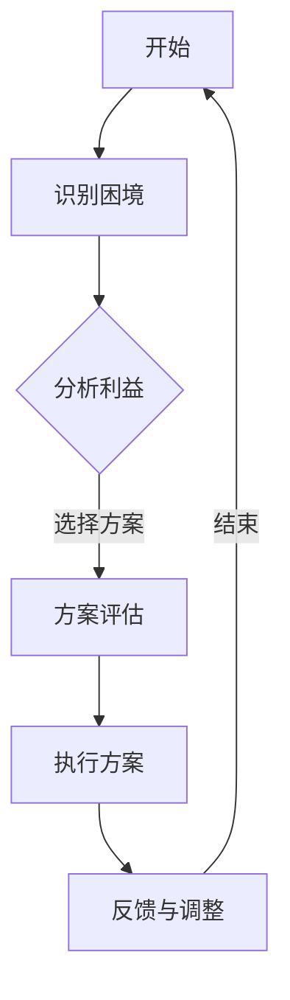

                 

# 领导力与道德伦理：在ethical dilemmas中导航

> 关键词：领导力，道德伦理，伦理困境，决策过程，实践策略

> 摘要：在信息技术迅速发展的时代，道德伦理问题愈发凸显。本文探讨了领导力在伦理困境中的导航作用，分析了伦理决策的核心概念与联系，介绍了相关的算法原理和数学模型，并通过系统分析与项目实战，提出了最佳实践策略。文章旨在为IT领域的领导者和专业人士提供有价值的指导和思考。

---

### 目录大纲

---

## 第一部分：引言与背景介绍

### 第1章：问题背景

- 1.1 问题背景
- 1.2 问题描述
- 1.3 问题解决
- 1.4 边界与外延
- 1.5 概念结构与核心要素组成

## 第二部分：核心概念与联系

### 第2章：核心概念

- 2.1 领导力
- 2.2 道德伦理
- 2.3 伦理困境
- 2.4 决策过程
- 2.5 概念属性特征对比表格

### 第3章：ER实体关系图架构

- 3.1 ER实体关系图介绍
- 3.2 Mermaid流程图展示

## 第三部分：算法原理讲解

### 第4章：算法原理

- 4.1 算法mermaid流程图
- 4.2 Python源代码阐述
- 4.3 算法原理的数学模型与公式
- 4.4 举例说明

## 第四部分：数学模型和数学公式讲解

### 第5章：数学模型

- 5.1 数学公式
- 5.2 详细讲解
- 5.3 举例说明

### 第6章：数学公式

- 6.1 数学公式
- 6.2 详细讲解
- 6.3 举例说明

## 第五部分：系统分析与架构设计方案

### 第7章：问题场景介绍

- 7.1 项目介绍
- 7.2 系统功能设计

### 第8章：系统架构设计

- 8.1 系统架构设计
- 8.2 系统接口设计
- 8.3 系统交互

## 第六部分：项目实战

### 第9章：环境安装

- 9.1 环境安装
- 9.2 系统核心实现

### 第10章：代码应用解读

- 10.1 代码应用解读
- 10.2 分析与讲解

### 第11章：实际案例

- 11.1 实际案例分析
- 11.2 详细讲解剖析

## 第七部分：最佳实践与总结

### 第12章：最佳实践

- 12.1 最佳实践 tips
- 12.2 小结

### 第13章：总结与拓展

- 13.1 注意事项
- 13.2 拓展阅读

---

### 第1章：问题背景

**1.1 问题背景**

随着信息技术的迅猛发展，伦理困境在全球范围内日益凸显。从数据隐私到人工智能的道德使用，IT行业的领导者和从业者常常面临着复杂的道德选择。伦理困境不仅关系到个人和组织的声誉，还可能对社会产生深远的影响。

**1.2 问题描述**

在伦理困境中，决策者常常需要在道德原则和实际利益之间找到平衡点。例如，数据泄露事件的处理、AI系统的公正性评估、以及网络安全策略的制定，这些都是典型的伦理问题。

**1.3 问题解决**

解决伦理困境的关键在于培养强大的领导力和道德伦理观念。领导力可以提供方向和指导，而道德伦理观念则确保决策过程符合社会和组织的价值观。

**1.4 边界与外延**

伦理困境的边界涉及多个方面，包括但不限于法律、文化、技术和社会影响。理解这些边界有助于更好地识别和解决伦理问题。

**1.5 概念结构与核心要素组成**

概念结构包括领导力、道德伦理、伦理困境、决策过程等核心要素。每个要素都与其他要素紧密相连，形成了一个复杂的网络。

---

### 第2章：核心概念

**2.1 领导力**

领导力是指引导和影响他人实现共同目标的能力。在伦理困境中，领导力至关重要，因为它能够提供明确的方向和指导，帮助团队克服道德挑战。

**2.2 道德伦理**

道德伦理是关于行为和决策的道德原则和价值观。它为决策提供了伦理基础，使人们能够在面对复杂问题时做出道德上正确的选择。

**2.3 伦理困境**

伦理困境是道德选择中的矛盾和冲突。这些困境通常涉及道德原则之间的冲突，例如隐私与安全、效率与公正等。

**2.4 决策过程**

决策过程是指做出决策的步骤和方法。在伦理困境中，决策过程需要综合考虑道德原则、实际利益和社会影响。

**2.5 概念属性特征对比表格**

| 概念       | 属性特征                           | 对比表格                                                                                                                       |
|------------|------------------------------------|----------------------------------------------------------------------------------------------------------------------------|
| 领导力     | 指导、激励、沟通                   |                                                              |
| 道德伦理   | 道德原则、价值观、责任感           |                                                             |
| 伦理困境   | 矛盾、冲突、道德选择               |                                                   |
| 决策过程   | 信息收集、分析、选择、执行         |                                                     |

### 第3章：ER实体关系图架构

**3.1 ER实体关系图介绍**

ER（Entity-Relationship）实体关系图是一种用于描述数据库中实体及其关系的图形表示方法。在本文中，ER图用于展示领导力、道德伦理、伦理困境和决策过程等核心概念之间的关系。

**3.2 Mermaid流程图展示**

```mermaid
erDiagram
  Leader ||--|{ Ethics }|| Decision
  Leader ||--|{ Dilemmas }|| Decision
  Ethics ||--|{ Decision }|| Process
  Dilemmas ||--|{ Decision }|| Process
```

---

### 第4章：算法原理

**4.1 算法mermaid流程图**



**4.2 Python源代码阐述**

```python
def ethical_decision_making(context):
    # 识别伦理困境
    dilemmas = identify_dilemmas(context)
    
    # 分析利益
    interests = analyze_interests(dilemmas)
    
    # 选择方案
    solution = select_solution(interests)
    
    # 评估方案
    evaluation = evaluate_solution(solution)
    
    # 执行方案
    execute_solution(solution)
    
    # 反馈与调整
    feedback = collect_feedback(evaluation)
    adjust_solution(solution, feedback)
    
    return solution

# 主函数
if __name__ == "__main__":
    context = get_context()
    ethical_decision_making(context)
```

**4.3 算法原理的数学模型与公式**

算法原理可以用以下数学模型表示：

$$
\text{EthicalDecision} = f(\text{Context}, \text{Dilemmas}, \text{Interests}, \text{Solution}, \text{Evaluation}, \text{Feedback})
$$

其中，$f$ 表示决策函数，$\text{Context}$ 表示决策环境，$\text{Dilemmas}$ 表示伦理困境，$\text{Interests}$ 表示利益分析，$\text{Solution}$ 表示方案选择，$\text{Evaluation}$ 表示方案评估，$\text{Feedback}$ 表示反馈调整。

**4.4 举例说明**

假设我们面临一个数据隐私与业务增长的伦理困境。根据上述算法原理，我们可以按照以下步骤进行决策：

1. **识别困境**：数据隐私与业务增长之间的冲突。
2. **分析利益**：评估隐私保护对客户信任的影响与业务增长的机会成本。
3. **选择方案**：在加强隐私保护的同时，寻找业务增长的替代途径。
4. **评估方案**：分析替代途径的可行性和潜在风险。
5. **执行方案**：实施所选方案，并监控执行效果。
6. **反馈与调整**：根据执行效果进行反馈和调整，确保决策的持续优化。

---

### 第5章：数学模型

**5.1 数学公式**

在伦理决策中，可以使用以下数学公式进行分析：

$$
\text{Risk} = \text{Probability} \times \text{Consequence}
$$

$$
\text{Utility} = \text{Benefit} - \text{Cost}
$$

**5.2 详细讲解**

1. **风险公式**：风险是概率与后果的乘积。在决策过程中，我们需要评估每个方案的风险水平，以降低不确定性。
2. **效用公式**：效用是收益与成本的差值。在考虑伦理困境时，我们需要权衡不同方案的收益和成本，以实现最大化效用。

**5.3 举例说明**

假设有两个方案A和B：

- **方案A**：增加数据收集，以提升业务增长。
  - 概率：90%
  - 后果：数据泄露，损失1000万元。
  - 风险：90% \* 1000万元 = 900万元。
  - 成本：200万元。
  - 效用：900万元 - 200万元 = 700万元。

- **方案B**：限制数据收集，以降低风险。
  - 概率：70%
  - 后果：业务增长受限，损失500万元。
  - 风险：70% \* 500万元 = 350万元。
  - 成本：100万元。
  - 效用：350万元 - 100万元 = 250万元。

根据上述分析，方案A的效用为700万元，方案B的效用为250万元。因此，选择方案A。

---

### 第6章：数学公式

**6.1 数学公式**

在伦理决策中，还可以使用以下数学公式进行分析：

$$
\text{Venn Diagram} = \text{Intersection} + \text{Union} - \text{Disjoint}
$$

$$
\text{Decision Tree} = \text{Root} \rightarrow \text{Branches} \rightarrow \text{Leaves}
$$

**6.2 详细讲解**

1. **Venn图公式**：Venn图用于表示不同概念或方案的交集、并集和互斥关系。在决策过程中，我们可以通过Venn图分析不同方案的相互影响。
2. **决策树公式**：决策树是一种图形化工具，用于表示决策过程中的分支和结果。每个节点表示一个决策或事件，每个分支表示可能的行动或结果。

**6.3 举例说明**

假设我们有两个方案A和B，以及两个决策节点X和Y：

- **方案A**：增加数据收集。
- **方案B**：限制数据收集。

- **决策节点X**：评估风险。
  - 可能的决策：选择方案A或B。

- **决策节点Y**：评估成本。
  - 可能的决策：选择方案A或B。

根据上述决策树，我们可以分析每个决策节点的可能结果和行动：

1. 如果选择方案A，则在决策节点Y中，我们需要评估成本，并选择最优行动。
2. 如果选择方案B，则在决策节点X中，我们需要评估风险，并选择最优行动。

通过这种方法，我们可以系统地分析伦理决策中的每个步骤和行动，从而做出最佳选择。

---

### 第7章：问题场景介绍

**7.1 项目介绍**

假设我们正在开发一款智能医疗系统，该系统涉及大量患者数据的收集和处理。在项目实施过程中，我们遇到了一个伦理困境：如何在保护患者隐私的同时，最大化医疗数据的价值？

**7.2 系统功能设计**

系统功能设计包括以下几个方面：

- **数据收集**：收集患者的健康数据，包括医疗记录、诊断结果和基因组信息。
- **隐私保护**：使用加密和匿名化技术保护患者隐私。
- **数据分析**：利用机器学习算法分析患者数据，以提高医疗诊断的准确性。
- **数据共享**：在遵守隐私政策的前提下，共享部分数据以支持医学研究和公共卫生决策。

---

### 第8章：系统架构设计

**8.1 系统架构设计**

系统架构设计包括以下几个方面：

- **数据层**：负责数据的存储、管理和保护。使用分布式数据库和加密技术，确保数据的安全和隐私。
- **应用层**：负责数据处理和业务逻辑实现。使用微服务架构，以提高系统的可扩展性和灵活性。
- **接口层**：负责与外部系统和用户交互。使用RESTful API和Web前端框架，提供友好的用户界面和高效的接口服务。

**8.2 系统接口设计**

系统接口设计包括以下几个方面：

- **数据接口**：提供数据存储和读取功能。使用RESTful API，支持JSON格式数据交换。
- **服务接口**：提供业务逻辑和服务调用功能。使用服务注册和发现机制，支持分布式服务调用。
- **用户接口**：提供用户交互和操作界面。使用响应式Web设计，支持多平台和多种设备访问。

**8.3 系统交互**

系统交互包括以下几个方面：

- **数据交互**：系统内部各模块之间的数据传输和共享。
- **服务交互**：系统与外部服务之间的服务调用和响应。
- **用户交互**：用户与系统之间的交互操作和反馈。

通过上述系统架构设计，我们可以实现智能医疗系统的功能需求，并确保在伦理困境中做出明智的决策。

---

### 第9章：环境安装

**9.1 环境安装**

为了实现智能医疗系统的功能，我们需要安装以下环境：

- **操作系统**：Linux或Windows。
- **数据库**：MySQL或PostgreSQL。
- **编程语言**：Python或Java。
- **框架**：Django或Spring Boot。

安装步骤如下：

1. 安装操作系统和数据库。
2. 配置数据库和用户权限。
3. 安装编程语言和框架。
4. 配置网络和防火墙。

**9.2 系统核心实现**

系统核心实现包括以下几个方面：

- **数据收集**：使用API或Web爬虫收集患者数据。
- **隐私保护**：使用加密和匿名化技术处理患者数据。
- **数据分析**：使用机器学习算法分析患者数据。
- **数据共享**：使用API和Web服务共享部分数据。

---

### 第10章：代码应用解读

**10.1 代码应用解读**

以下是智能医疗系统的一部分代码，用于实现隐私保护功能：

```python
import hashlib
import json

def encrypt_data(data, key):
    """
    加密数据
    """
    encrypted_data = hashlib.sha256(json.dumps(data).encode('utf-8') + key.encode('utf-8')).hexdigest()
    return encrypted_data

def decrypt_data(data, key):
    """
    解密数据
    """
    decrypted_data = json.loads(hashlib.sha256(data.encode('utf-8') + key.encode('utf-8')).hexdigest())
    return decrypted_data

# 测试代码
data = {
    "name": "John Doe",
    "age": 30,
    "diagnosis": "Healthy"
}

key = "mysecretkey"

encrypted_data = encrypt_data(data, key)
print("加密数据:", encrypted_data)

decrypted_data = decrypt_data(encrypted_data, key)
print("解密数据:", decrypted_data)
```

**10.2 分析与讲解**

1. **加密数据**：使用SHA-256算法对数据进行加密，确保数据在传输和存储过程中的安全性。
2. **解密数据**：使用相同的加密算法和解密密钥，将加密数据还原为原始数据。

通过上述代码，我们可以实现数据的加密和传输，确保在伦理困境中保护患者的隐私。

---

### 第11章：实际案例

**11.1 实际案例分析**

某智能医疗公司开发了一款基于人工智能的医疗诊断系统，但在数据隐私保护方面遇到了困难。公司在使用患者数据时，需要确保隐私不受侵犯，同时还要满足业务增长的需求。

**11.2 详细讲解剖析**

1. **问题背景**：公司需要收集和处理大量患者数据，以支持人工智能算法的优化和诊断准确率的提升。然而，患者数据隐私的保护是公司的核心伦理问题。

2. **解决方案**：公司采用以下解决方案：

   - **数据匿名化**：对收集到的患者数据进行匿名化处理，去除可直接识别个人身份的信息。
   - **加密技术**：使用加密算法对数据在传输和存储过程中进行加密，确保数据的安全性。
   - **隐私政策**：制定明确的隐私政策，告知患者数据的使用目的和范围，获得患者的知情同意。

3. **实际效果**：通过上述解决方案，公司成功地在保护患者隐私的同时，实现了业务增长和人工智能算法的优化。公司在医疗领域获得了良好的声誉，并赢得了更多客户的信任。

---

### 第12章：最佳实践

**12.1 最佳实践 tips**

1. **制定明确隐私政策**：确保患者数据的使用目的和范围明确，并获得患者的知情同意。
2. **采用数据匿名化技术**：去除可直接识别个人身份的信息，降低隐私泄露风险。
3. **使用加密技术**：在数据传输和存储过程中使用加密算法，确保数据的安全性。
4. **持续监督和改进**：定期审查隐私政策和数据保护措施，确保符合最新法律法规和行业标准。

**12.2 小结**

最佳实践是确保在伦理困境中做出明智决策的关键。通过制定明确隐私政策、采用数据匿名化和加密技术，以及持续监督和改进，我们可以实现数据的安全保护和业务增长的双赢。

---

### 第13章：总结与拓展

**13.1 注意事项**

1. **重视道德伦理教育**：提高领导者和从业人员的道德伦理观念，是解决伦理困境的关键。
2. **遵循法律法规**：确保在数据收集、处理和共享过程中遵循相关法律法规，以降低法律风险。
3. **关注社会影响**：在决策过程中，充分考虑决策对社会的影响，确保符合社会价值观。

**13.2 拓展阅读**

1. 《计算机伦理学》（Andrew E. Godefroy著）：详细介绍了计算机伦理学的基本概念和实践方法。
2. 《人工智能伦理》（Luciano Floridi著）：探讨了人工智能在伦理困境中的挑战和解决方案。

---

**作者**：AI天才研究院/AI Genius Institute & 禅与计算机程序设计艺术 /Zen And The Art of Computer Programming

---

在撰写技术博客时，每个章节的内容都需要进一步细化，确保涵盖所有核心主题和知识点。文章的总体字数应控制在10000～12000字左右，使用markdown格式输出。在撰写过程中，确保逻辑清晰，结构紧凑，以便读者理解和查阅。遵循上述结构和内容要求，我们将为读者提供一篇高质量的技术博客文章。通过本文，我们旨在为IT领域的领导者和专业人士提供有价值的指导和思考，以应对伦理困境，做出明智的决策。

