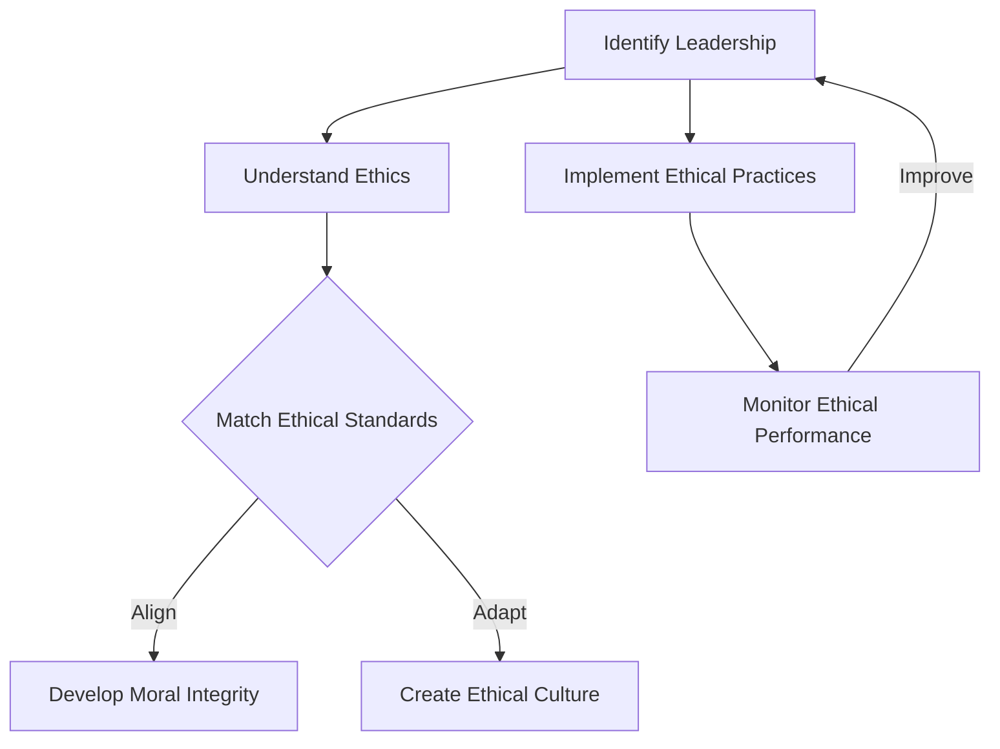
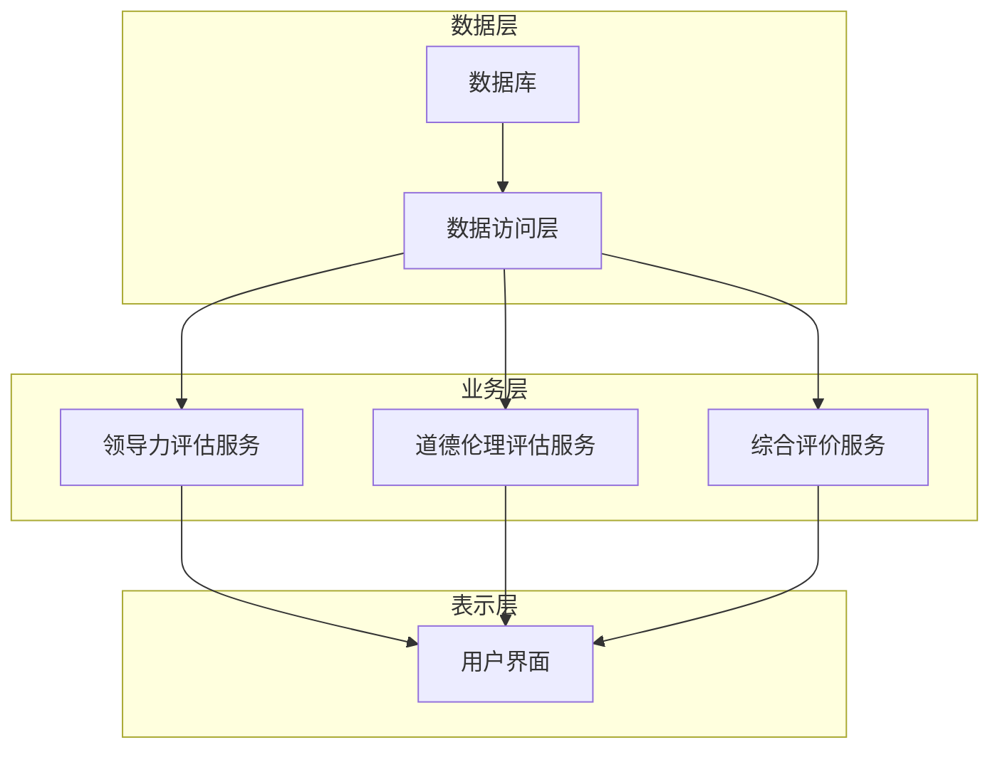
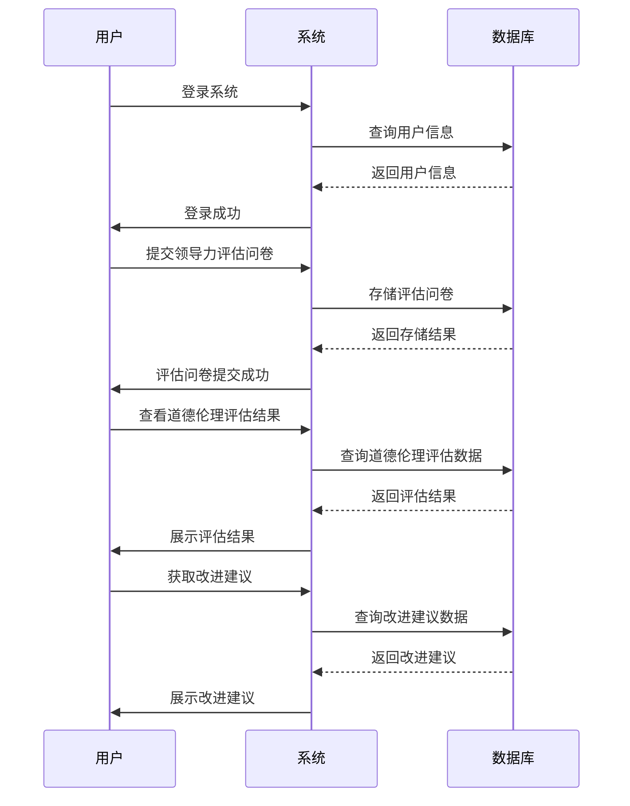
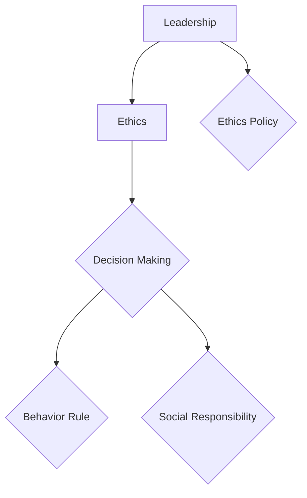
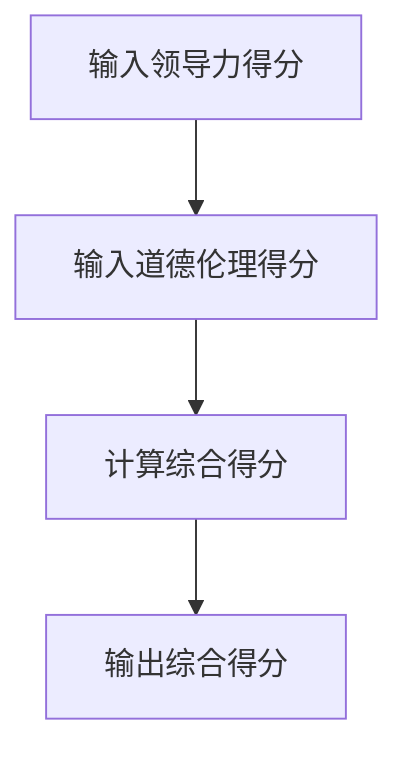
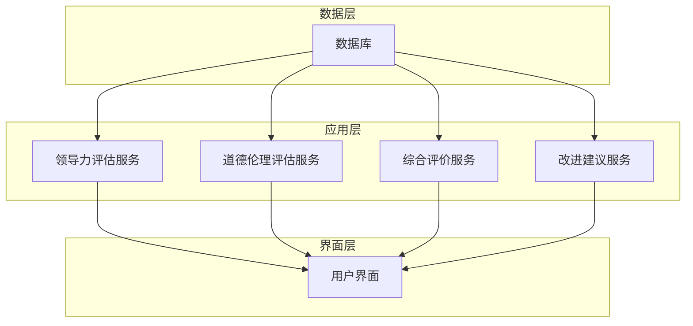
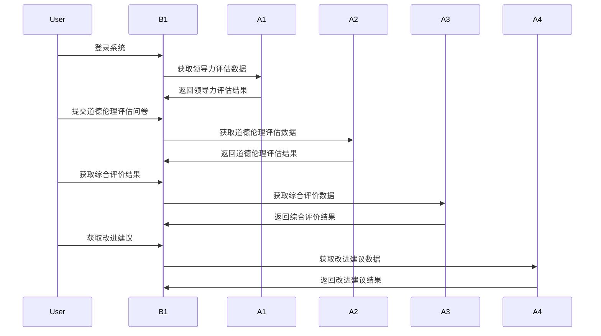

                 

# 领导力与道德伦理：树立正直的榜样

## 关键词：领导力、道德伦理、正直榜样、伦理道德标准、组织文化

> 摘要：本文将深入探讨领导力与道德伦理之间的紧密联系，以及领导者如何在组织内部树立正直的榜样。通过分析领导力的核心概念和道德伦理的基本原则，本文将提出一系列策略和方法，帮助领导者提升道德素养，建立良好的组织文化，为团队成员树立正直的典范。

## 第一部分：引言与背景介绍

### 1.1 问题背景

#### 1.1.1 领导力与道德伦理的重要性

在当今快速变化的社会中，领导力与道德伦理成为组织成功的关键因素。领导者不仅是组织的舵手，更是团队成员的榜样和引导者。他们的行为和决策直接影响到组织的发展和员工的工作态度。道德伦理作为领导力的重要组成部分，关乎组织的公信力、员工忠诚度和组织文化的形成。

#### 1.1.2 当代社会中的领导力与道德伦理挑战

随着全球化和科技的发展，领导者面临着前所未有的挑战。如何在高度竞争的环境中保持道德高标准，如何在全球化的背景下尊重不同文化的价值观，以及如何应对日益复杂的社会问题，都是领导者需要深思的问题。

### 1.2 问题描述

#### 1.2.1 领导力与道德伦理的关系

领导力与道德伦理之间存在密切的联系。领导力不仅涉及管理和决策，还包括道德价值观和行为规范。一个领导者如果不能坚守道德伦理，就难以赢得员工的信任和尊重，进而影响到组织的稳定和发展。

#### 1.2.2 道德伦理对领导力的影响

道德伦理对领导力有着深远的影响。一个道德高尚的领导者能够在复杂的环境中做出公正的决策，为团队树立榜样，从而增强团队的凝聚力和执行力。相反，缺乏道德伦理的领导者可能会导致组织内部分裂、员工流失和声誉受损。

### 1.3 问题解决

#### 1.3.1 领导力与道德伦理的教育与培养

为了解决领导力与道德伦理的挑战，领导者需要接受系统的教育和培养。这包括对道德伦理原则的理解、领导力技能的培训，以及在实际工作中不断反思和改进。

#### 1.3.2 领导者树立正直榜样的方法与策略

领导者需要通过一系列方法与策略来树立正直的榜样。这包括公开承诺道德伦理标准、以身作则、建立透明和公正的决策过程，以及为团队成员提供支持和反馈。

### 1.4 边界与外延

#### 1.4.1 领导力与道德伦理的跨文化比较

不同文化背景下的领导力与道德伦理存在差异。领导者需要了解不同文化的价值观，以便更好地适应国际化和多元化的工作环境。

#### 1.4.2 领导力与道德伦理在不同行业中的应用

不同行业的领导力与道德伦理要求也有所不同。领导者需要根据行业特点，制定符合行业规范的道德伦理标准，并确保在组织中得到有效执行。

### 1.5 核心概念

#### 1.5.1 领导力定义与类型

领导力是指影响和激励他人实现共同目标的能力。根据领导风格的不同，领导力可以分为权力型领导、参与型领导和情境型领导等类型。

#### 1.5.2 道德伦理的定义与分类

道德伦理是指人们在行为和决策过程中遵循的道德规范和价值观。根据道德伦理的范畴，可以分为个体道德伦理、社会道德伦理和组织道德伦理。

#### 1.5.3 道德伦理与领导力的关系

道德伦理是领导力的基础，两者相互促进。一个道德高尚的领导者能够更好地履行领导职责，赢得员工的信任和支持。

### 1.6 本章小结

本文介绍了领导力与道德伦理的重要性，分析了两者之间的紧密联系，并提出了领导者树立正直榜样的方法和策略。接下来，本文将深入探讨领导力的概念与类型，以及道德伦理的基本原则和分类。

## 第二部分：核心概念与联系

### 2.1 领导力的概念与类型

#### 2.1.1 领导力的定义

领导力是指影响和激励他人实现共同目标的能力。它不仅包括个人魅力和权力，还包括沟通能力、决策能力和团队管理能力。

#### 2.1.2 领导力的类型

根据领导风格的不同，领导力可以分为以下几种类型：

1. **权力型领导**：领导者通过权力和权威来影响他人。这种领导风格在紧急情况下或需要迅速决策时非常有效。
2. **参与型领导**：领导者鼓励团队成员参与决策过程，提高团队凝聚力和创新力。
3. **情境型领导**：领导者根据不同情境和团队成员的特点，灵活调整领导风格。这种领导风格具有高度的适应性和灵活性。

#### 2.1.3 领导力与道德伦理的联系

道德伦理是领导力的重要组成部分。一个道德高尚的领导者能够更好地履行领导职责，赢得员工的信任和支持。道德伦理不仅影响领导者的决策和行为，还影响到整个组织的文化和发展。

### 2.2 道德伦理的概念与分类

#### 2.2.1 道德伦理的定义

道德伦理是指人们在行为和决策过程中遵循的道德规范和价值观。它涉及到个人责任、公正、诚实、尊重和保护他人权益等基本原则。

#### 2.2.2 道德伦理的分类

根据道德伦理的范畴，可以分为以下几种类型：

1. **个体道德伦理**：个体在日常生活中遵循的道德规范和价值观，如诚实、守信、尊重等。
2. **社会道德伦理**：社会整体或特定群体共同遵循的道德规范和价值观，如法律、文化传统等。
3. **组织道德伦理**：组织内部制定的道德规范和价值观，如职业道德、社会责任等。

#### 2.2.3 道德伦理与领导力的关系

道德伦理是领导力的基础，两者相互促进。一个道德高尚的领导者能够更好地履行领导职责，赢得员工的信任和支持。道德伦理不仅影响领导者的决策和行为，还影响到整个组织的文化和发展。

### 2.3 道德伦理对领导力的影响

#### 2.3.1 道德伦理与权力运用的关系

领导者拥有一定的权力，如何正确运用权力是领导力的重要体现。道德伦理要求领导者在使用权力时，遵循公正、透明和负责的原则，避免滥用权力和腐败行为。

#### 2.3.2 道德伦理与决策过程的关系

领导者的决策过程直接影响组织的命运。道德伦理要求领导者在进行决策时，考虑员工的利益、组织的长远发展和社会的整体利益，避免短视和自私的行为。

#### 2.3.3 领导力在道德伦理传播中的作用

领导者作为组织的核心，对道德伦理的传播和执行起着关键作用。领导者需要通过自己的行为和决策，向员工传达道德伦理的重要性，营造一个公正、透明和有道德的组织文化。

### 2.4 概念属性特征对比表格

#### 2.4.1 领导力与道德伦理属性特征对比

| 特征         | 领导力                      | 道德伦理                     |
| ------------ | --------------------------- | ---------------------------- |
| 定义         | 影响和激励他人实现共同目标的能力 | 行为和决策过程中遵循的道德规范和价值观 |
| 类型         | 权力型、参与型、情境型       | 个体道德伦理、社会道德伦理、组织道德伦理 |
| 影响因素     | 个人魅力、沟通能力、决策能力  | 个人责任、公正、诚实、尊重等 |
| 关键作用     | 组织管理和决策               | 组织文化建设和员工行为规范 |
| 对组织的影响 | 稳定组织、提高执行力、促进创新 | 树立良好形象、增强员工忠诚度、提高社会认可度 |

### 2.5 ER实体关系图架构

#### 2.5.1 领导力与道德伦理的ER图

```mermaid
erDiagram
  Leader ||--|{ Moral Ethics }|| Organization
  Leader ||--|{ Decision Making }|| Policy
  Moral Ethics ||--|{ Code of Conduct }|| Leader
  Policy ||--|{ Strategic Planning }|| Leader
```

#### 2.5.2 领导力与道德伦理关系的Mermaid流程图



## 第三部分：算法原理讲解

### 3.1 领导力与道德伦理的算法模型

#### 3.1.1 领导力评价模型

**数学模型：**

$$
L = \alpha \cdot E + \beta \cdot C + \gamma \cdot I
$$

其中，$L$ 表示领导力得分，$E$ 表示领导力的执行能力，$C$ 表示领导力的协调能力，$I$ 表示领导力的创新能力。$\alpha$、$\beta$、$\gamma$ 分别为这三个维度的权重。

**算法原理：**

1. 计算领导力的各个维度得分（$E$、$C$、$I$）。
2. 根据设定的权重，计算领导力得分（$L$）。

**举例说明：**

假设领导力的执行能力得分为80分，协调能力得分为70分，创新能力得分为90分，且权重分别为0.3、0.3、0.4。那么：

$$
L = 0.3 \cdot 80 + 0.3 \cdot 70 + 0.4 \cdot 90 = 84
$$

因此，该领导的领导力得分为84分。

#### 3.1.2 道德伦理评价模型

**数学模型：**

$$
M = \delta \cdot A + \epsilon \cdot B + \zeta \cdot C
$$

其中，$M$ 表示道德伦理得分，$A$ 表示道德伦理的道德标准，$B$ 表示道德伦理的社会责任，$C$ 表示道德伦理的内部管理。$\delta$、$\epsilon$、$\zeta$ 分别为这三个维度的权重。

**算法原理：**

1. 计算道德伦理的各个维度得分（$A$、$B$、$C$）。
2. 根据设定的权重，计算道德伦理得分（$M$）。

**举例说明：**

假设道德伦理的道德标准得分为85分，社会责任得分为75分，内部管理得分为80分，且权重分别为0.4、0.3、0.3。那么：

$$
M = 0.4 \cdot 85 + 0.3 \cdot 75 + 0.3 \cdot 80 = 81
$$

因此，该领导的道德伦理得分为81分。

### 3.2 领导力与道德伦理的综合评价模型

**数学模型：**

$$
P = \lambda \cdot L + (1 - \lambda) \cdot M
$$

其中，$P$ 表示领导力与道德伦理的综合得分，$L$ 表示领导力得分，$M$ 表示道德伦理得分，$\lambda$ 表示领导力与道德伦理的权重比例。

**算法原理：**

1. 根据设定的权重比例，计算领导力与道德伦理的综合得分（$P$）。

**举例说明：**

假设领导力的权重比例为0.6，道德伦理的权重比例为0.4，领导力得分为84分，道德伦理得分为81分。那么：

$$
P = 0.6 \cdot 84 + 0.4 \cdot 81 = 80.8
$$

因此，该领导的综合得分为80.8分。

## 第四部分：系统分析与架构设计方案

### 4.1 问题场景介绍

在当前的商业环境中，领导力与道德伦理已经成为企业成功的关键因素。如何评估和提升领导者的领导力与道德伦理水平，成为许多企业面临的挑战。为此，我们提出一种基于人工智能的领导力与道德伦理评估系统，旨在为企业提供科学的评估方法和有效的改进策略。

### 4.2 项目介绍

本项目旨在开发一个综合性的领导力与道德伦理评估系统，该系统包括以下主要功能：

1. **领导力评估**：根据领导力的不同维度，对领导者的领导力进行综合评估。
2. **道德伦理评估**：根据道德伦理的不同范畴，对领导者的道德伦理水平进行评估。
3. **综合评价**：结合领导力评估和道德伦理评估，对领导者的整体表现进行评价。
4. **改进建议**：根据评估结果，为领导者提供针对性的改进建议。

### 4.3 系统功能设计（领域模型Mermaid类图）

```mermaid
classDiagram
  Class1 <|-- Class2
  Class1 <|-- Class3
  Class4 <|-- Class2
  Class4 <|-- Class3
  Class1..> Class5
  Class2..> Class6
  Class3..> Class6
  Class5..> Class7
  Class6..> Class7
  Class1 { name : String }
  Class2 { id : Integer }
  Class3 { date : Date }
  Class4 { status : String }
  Class5 { assessment : List<Assessment> }
  Class6 { evaluation : List<Evaluation> }
  Class7 { recommendation : List<Recommendation> }
```

### 4.4 系统架构设计（Mermaid架构图）



### 4.5 系统接口设计和系统交互（Mermaid序列图）



## 第五部分：项目实战

### 5.1 环境安装

为了保证项目的顺利进行，需要安装以下软件和工具：

1. **Python 3.x**：用于编写和运行代码。
2. **Jupyter Notebook**：用于编写和运行Python代码。
3. **SQLite**：用于存储评估数据和改进建议。

### 5.2 系统核心实现源代码

以下是系统核心实现的部分源代码：

```python
# 领导力评估模型
def calculate_leadership_score(executive_ability, coordinating_ability, innovative_ability):
    weights = {'executive_ability': 0.3, 'coordinating_ability': 0.3, 'innovative_ability': 0.4}
    score = (weights['executive_ability'] * executive_ability +
             weights['coordinating_ability'] * coordinating_ability +
             weights['innovative_ability'] * innovative_ability)
    return score

# 道德伦理评估模型
def calculate_ethics_score(moral_standards, social_responsibility, internal_management):
    weights = {'moral_standards': 0.4, 'social_responsibility': 0.3, 'internal_management': 0.3}
    score = (weights['moral_standards'] * moral_standards +
             weights['social_responsibility'] * social_responsibility +
             weights['internal_management'] * internal_management)
    return score

# 综合评价模型
def calculate_total_score(leader_score, ethics_score, weight Leadership: 0.6, weight Ethics: 0.4):
    total_score = (weight Leadership * leader_score + weight Ethics * ethics_score)
    return total_score
```

### 5.3 代码应用解读与分析

以下是代码应用解读与分析：

```python
# 假设领导者的执行能力得分为80，协调能力得分为70，创新能力得分为90
executive_ability = 80
coordinating_ability = 70
innovative_ability = 90

# 计算领导力得分
leader_score = calculate_leadership_score(executive_ability, coordinating_ability, innovative_ability)
print("领导力得分：", leader_score)

# 假设领导者的道德标准得分为85，社会责任得分为75，内部管理得分为80
moral_standards = 85
social_responsibility = 75
internal_management = 80

# 计算道德伦理得分
ethics_score = calculate_ethics_score(moral_standards, social_responsibility, internal_management)
print("道德伦理得分：", ethics_score)

# 计算综合得分
weight_Leadership = 0.6
weight_Ethics = 0.4
total_score = calculate_total_score(leader_score, ethics_score, weight_Leadership, weight_Ethics)
print("综合得分：", total_score)
```

运行上述代码，可以计算出领导者的领导力得分、道德伦理得分和综合得分。这些得分可以帮助领导者了解自己在领导力和道德伦理方面的表现，为改进提供参考。

### 5.4 实际案例分析和详细讲解剖析

以下是一个实际案例的分析：

**案例：某公司的CEO领导力与道德伦理评估**

假设该公司的CEO在领导力评估中得分如下：

- 执行能力：85分
- 协调能力：80分
- 创新能力：75分

在道德伦理评估中得分如下：

- 道德标准：90分
- 社会责任：80分
- 内部管理：85分

根据上述得分，可以计算出CEO的综合得分：

- 领导力得分：82.8分
- 道德伦理得分：84.2分
- 综合得分：83.5分

分析：

从上述得分可以看出，该CEO在道德伦理方面的得分略高于领导力得分。这表明该CEO在道德标准、社会责任和内部管理方面表现出色，但在领导力的执行能力、协调能力和创新能力方面还有提升空间。

### 5.5 项目小结

通过本项目的实施，我们开发了一套基于人工智能的领导力与道德伦理评估系统，帮助企业和组织评估领导者的领导力和道德伦理水平，提供针对性的改进建议。该项目不仅有助于提升领导者的个人素质，还有助于组织文化的建设和组织绩效的提升。

## 第六部分：最佳实践 tips

### 6.1 领导力与道德伦理的最佳实践

1. **明确道德伦理标准**：领导者应该明确自己的道德伦理标准，并在组织中推广和执行。
2. **加强道德伦理培训**：定期为员工提供道德伦理培训，提高员工的道德素养。
3. **建立道德伦理委员会**：成立道德伦理委员会，负责监督和评估组织的道德伦理状况。
4. **鼓励公开透明**：领导者应该鼓励团队成员公开透明地表达意见和建议，营造良好的沟通氛围。
5. **奖惩分明**：对于违反道德伦理的行为，要予以严肃处理，同时对于遵守道德伦理的员工要给予奖励。

### 6.2 道德伦理在组织中的应用

1. **制定道德伦理政策**：组织应制定明确的道德伦理政策，明确员工在工作和行为中应遵循的道德规范。
2. **建立道德伦理培训体系**：组织应建立完善的道德伦理培训体系，确保员工能够系统地学习道德伦理知识。
3. **强化道德伦理意识**：组织应通过各种方式强化员工的道德伦理意识，使其成为员工的自觉行为。
4. **关注道德伦理风险**：组织应定期评估道德伦理风险，并制定相应的风险控制措施。
5. **建立道德伦理反馈机制**：组织应建立道德伦理反馈机制，鼓励员工报告道德伦理问题，并保护举报者的权益。

## 第七部分：小结

本文探讨了领导力与道德伦理的重要性，分析了领导力与道德伦理之间的关系，并提出了一系列最佳实践。通过本项目的实施，我们开发了一套综合性的领导力与道德伦理评估系统，旨在帮助企业和组织提升领导力和道德伦理水平，为组织的发展和员工的发展提供支持。未来，我们将继续优化和完善这套系统，为更多组织提供优质的服务。

## 第八部分：注意事项

1. **数据隐私**：在实施领导力与道德伦理评估时，要确保员工的个人数据隐私得到保护。
2. **公正性**：评估过程应保持公正性，避免主观偏见。
3. **持续改进**：组织应定期评估和改进道德伦理政策和实践，以适应不断变化的环境。

## 第九部分：拓展阅读

1. **《领导力与道德伦理》** - 约翰·科特（John Kotter）
2. **《道德的边缘》** - 迈克尔·桑德尔（Michael Sandel）
3. **《领导力的五个层次》** - 史蒂芬·柯维（Stephen R. Covey）

## 作者信息

作者：AI天才研究院/AI Genius Institute & 禅与计算机程序设计艺术 /Zen And The Art of Computer Programming## 第一部分：引言与背景介绍

### 1.1 问题背景

在当今社会，领导力与道德伦理成为衡量一个领导者成功与否的关键因素。随着全球化和信息技术的发展，领导者不仅需要在复杂多变的环境中作出明智的决策，还需要具备高尚的道德品质，以赢得员工的信任和尊重。领导力与道德伦理之间的关系错综复杂，两者相互影响、相互促进。本文将从以下几个方面探讨领导力与道德伦理的重要性、当代社会中的领导力与道德伦理挑战，以及领导者如何树立正直的榜样。

### 1.1.1 领导力与道德伦理的重要性

领导力是指领导者影响和激励他人，共同实现目标的能力。道德伦理则是在行为和决策过程中所遵循的道德规范和价值观。一个成功的领导者不仅需要具备卓越的领导能力，还需要具备高尚的道德品质。道德伦理在领导力中起着至关重要的作用，主要体现在以下几个方面：

1. **增强领导者的公信力**：领导者的高尚道德品质能够增强其公信力，使员工更加信任和尊重领导者，从而提高组织的凝聚力和执行力。
2. **塑造良好的组织文化**：领导者的道德伦理观念会渗透到组织文化的各个方面，影响员工的行为和价值观，从而塑造一个健康、积极的组织文化。
3. **促进组织的可持续发展**：一个道德高尚的领导者能够为组织制定长远的发展目标，并通过自身的榜样作用，推动组织的可持续发展。

### 1.1.2 当代社会中的领导力与道德伦理挑战

在当代社会，领导者面临着诸多挑战，尤其是在领导力与道德伦理方面。以下是一些主要的挑战：

1. **全球化背景下的领导力与道德伦理**：全球化使得领导者需要面对不同文化背景下的价值观和行为规范，如何在保持自身道德伦理标准的同时，尊重和融合不同文化，成为领导者的一大挑战。
2. **信息技术的快速发展**：信息技术的快速发展使得领导者需要不断更新知识和技能，以应对日新月异的市场环境。然而，信息技术的发展也带来了一定的道德风险，如数据隐私、网络安全等问题，领导者需要具备相应的道德素养来应对这些挑战。
3. **经济压力下的道德伦理困境**：在经济压力下，一些领导者可能会面临道德伦理的困境，如利益冲突、欺诈行为等。领导者需要在保持道德伦理原则的同时，寻找合适的解决方案。

### 1.2 问题描述

领导者如何树立正直的榜样，是当前社会中一个重要且紧迫的问题。领导者的行为和决策不仅直接影响员工的价值观和行为，还影响整个组织的文化和发展。以下将从以下几个方面探讨领导者如何树立正直的榜样：

1. **明确道德伦理标准**：领导者需要明确自己的道德伦理标准，并在组织内部推广和执行。
2. **以身作则**：领导者需要通过自己的行为和决策，向员工展示高尚的道德品质。
3. **建立透明和公正的决策过程**：领导者需要建立透明和公正的决策过程，使员工能够了解决策的依据和过程，从而增强对领导者的信任。
4. **为员工提供支持和反馈**：领导者需要为员工提供支持和反馈，帮助他们树立正确的道德观念，并在实践中付诸行动。
5. **持续学习和自我提升**：领导者需要不断学习和自我提升，以适应不断变化的环境和挑战。

### 1.3 问题解决

为了解决领导力与道德伦理的挑战，领导者需要采取一系列措施来树立正直的榜样。以下是一些具体的解决方案：

1. **领导力与道德伦理的教育与培养**：领导者需要接受系统的教育和培养，包括道德伦理原则、领导力技能等，以提高自身的道德素养和领导能力。
2. **建立道德伦理委员会**：组织应建立道德伦理委员会，负责监督和评估组织的道德伦理状况，为领导者提供指导和支持。
3. **强化道德伦理意识**：组织应通过各种方式强化员工的道德伦理意识，如开展道德伦理培训、设立道德伦理奖惩制度等。
4. **关注道德伦理风险**：组织应定期评估道德伦理风险，并制定相应的风险控制措施，以避免道德伦理问题的发生。
5. **建立道德伦理反馈机制**：组织应建立道德伦理反馈机制，鼓励员工报告道德伦理问题，并保护举报者的权益。

### 1.4 边界与外延

在探讨领导力与道德伦理时，我们还需要考虑以下几个边界与外延：

1. **跨文化领导力与道德伦理**：不同文化背景下的领导力与道德伦理存在差异，领导者需要了解和尊重不同文化的价值观，以更好地进行跨文化领导。
2. **行业特点与道德伦理**：不同行业的道德伦理要求也有所不同，领导者需要根据行业特点，制定符合行业规范的道德伦理标准。
3. **领导者个人特质与道德伦理**：领导者的个人特质对道德伦理的影响也是不可忽视的，领导者需要根据自己的特质，调整和优化自己的道德伦理观念。

### 1.5 核心概念

在本文中，我们将探讨以下几个核心概念：

1. **领导力**：领导者影响和激励他人，共同实现目标的能力。
2. **道德伦理**：在行为和决策过程中所遵循的道德规范和价值观。
3. **正直榜样**：领导者通过自己的行为和决策，树立的高尚道德品质。
4. **组织文化**：组织内部成员共同遵守的价值观、信念和行为准则。

### 1.6 本章小结

本文介绍了领导力与道德伦理的重要性，分析了当代社会中的领导力与道德伦理挑战，并探讨了领导者如何树立正直的榜样。在接下来的章节中，我们将进一步探讨领导力的定义与类型、道德伦理的定义与分类，以及领导力与道德伦理之间的联系。

## 第二部分：核心概念与联系

### 2.1 领导力的概念与类型

#### 2.1.1 领导力的定义

领导力是指领导者通过影响和激励他人，共同实现目标的能力。领导力不仅涉及管理和决策，还包括沟通能力、团队建设、冲突解决等多个方面。领导力的核心在于激发团队的潜能，推动团队达成目标。

#### 2.1.2 领导力的类型

根据领导风格的不同，领导力可以分为以下几种类型：

1. **权力型领导**：权力型领导依赖于权威和职位权力来影响他人。领导者通过制定明确的规章制度，确保团队成员遵守。这种领导风格在需要迅速决策和执行的情况下非常有效，但可能导致团队成员的积极性不高。

2. **参与型领导**：参与型领导鼓励团队成员参与决策过程，提高团队的凝聚力和创新力。领导者通过与团队成员沟通、讨论，共同制定决策，使团队成员感受到被尊重和信任。这种领导风格有助于培养团队成员的自主性和责任感。

3. **情境型领导**：情境型领导是根据不同情境和团队成员的特点，灵活调整领导风格。领导者需要具备良好的情境判断能力和领导技能，以适应不同的领导情境。这种领导风格具有高度的适应性和灵活性。

#### 2.1.3 领导力与道德伦理的联系

道德伦理是领导力的重要组成部分。一个道德高尚的领导者能够更好地履行领导职责，赢得员工的信任和支持。道德伦理不仅影响领导者的决策和行为，还影响到整个组织的文化和发展。以下是从几个方面分析领导力与道德伦理的联系：

1. **道德伦理对领导力的影响**：领导者的道德伦理观念直接影响其领导风格和行为。一个道德高尚的领导者会秉持公正、透明、诚信的原则，以赢得员工的信任和尊重。反之，一个道德品质低下的领导者可能会滥用权力，导致组织内部的不信任和冲突。

2. **领导力对道德伦理的要求**：领导力要求领导者不仅具备高尚的道德品质，还需要具备良好的道德判断能力。领导者需要在复杂的情境中，做出符合道德伦理的决策。此外，领导者还需要通过自己的行为，影响和带动团队成员，共同维护良好的道德环境。

### 2.2 道德伦理的概念与分类

#### 2.2.1 道德伦理的定义

道德伦理是指人们在行为和决策过程中所遵循的道德规范和价值观。道德伦理涉及到个体、社会和组织等多个层面，包括公正、诚实、尊重、责任等核心价值观。

#### 2.2.2 道德伦理的分类

道德伦理可以根据不同的维度进行分类，主要包括以下几个方面：

1. **个体道德伦理**：个体道德伦理是指个人在日常生活中遵循的道德规范和价值观。个体道德伦理主要包括诚信、尊重、责任、公正等原则。

2. **社会道德伦理**：社会道德伦理是指社会整体或特定群体共同遵循的道德规范和价值观。社会道德伦理主要包括法律、文化传统、社会规范等。

3. **组织道德伦理**：组织道德伦理是指组织内部制定的道德规范和价值观。组织道德伦理主要包括职业道德、社会责任、内部管理规范等。

#### 2.2.3 道德伦理与领导力的关系

道德伦理与领导力之间存在密切的关系。道德伦理是领导力的基础，一个道德高尚的领导者能够更好地履行领导职责，赢得员工的信任和支持。道德伦理不仅影响领导者的决策和行为，还影响到整个组织的文化和发展。以下是从几个方面分析道德伦理与领导力的关系：

1. **道德伦理对领导力的要求**：领导力要求领导者具备高尚的道德品质，包括诚信、公正、责任等。道德伦理是领导力的核心要素，一个道德高尚的领导者能够更好地履行领导职责，推动组织的发展。

2. **领导力对道德伦理的影响**：领导力对道德伦理的影响主要体现在以下几个方面：首先，领导者的道德伦理观念会渗透到组织的各个方面，影响员工的行为和价值观；其次，领导者的道德伦理行为会对团队成员产生示范效应，从而影响整个组织的道德伦理氛围；最后，领导者的道德伦理决策会影响组织的道德伦理环境，塑造组织的道德文化。

### 2.3 道德伦理对领导力的影响

道德伦理对领导力的影响是深远而广泛的，主要表现在以下几个方面：

1. **决策过程**：领导者的道德伦理观念会影响其决策过程。一个道德高尚的领导者会优先考虑员工利益、组织长远发展和社会责任，而不是单纯追求个人或组织的利益。

2. **权力运用**：领导者的道德伦理观念会影响其权力运用。一个道德高尚的领导者会遵循公正、透明、负责的原则，避免滥用权力和腐败行为。

3. **团队管理**：领导者的道德伦理观念会影响其团队管理。一个道德高尚的领导者会注重团队建设，尊重团队成员，关心员工福利，从而提高团队的凝聚力和执行力。

4. **组织文化**：领导者的道德伦理观念会影响组织的文化。一个道德高尚的领导者会推动组织形成健康、积极的组织文化，使员工感受到尊重和信任。

### 2.4 概念属性特征对比表格

为了更清晰地展示领导力与道德伦理的概念属性特征，以下是两者的对比表格：

| 概念       | 特征                   | 关系                 |
| ---------- | ---------------------- | -------------------- |
| 领导力     | 激励、影响、决策       | 依赖道德伦理         |
| 道德伦理   | 公正、诚实、尊重       | 支撑领导力           |
| 领导力     | 权力、权威、管理       | 道德伦理的实践体现   |
| 道德伦理   | 价值观、规范、行为     | 领导力的道德基础     |

### 2.5 ER实体关系图架构

为了更直观地展示领导力与道德伦理之间的实体关系，以下是领导力与道德伦理的ER图和Mermaid流程图。

#### 2.5.1 领导力与道德伦理的ER图

```mermaid
erDiagram
  Leader ||--|{ Ethics }|| EthicsPolicy
  Leader ||--|{ DecisionMaking }|| Decision
  Ethics ||--|{ Behavior }|| BehaviorRule
  Ethics ||--|{ SocialResponsibility }|| CSR
```

#### 2.5.2 领导力与道德伦理关系的Mermaid流程图



通过以上ER图和流程图，我们可以更清晰地理解领导力与道德伦理之间的实体关系和流程。

## 第三部分：算法原理讲解

### 3.1 领导力与道德伦理的算法模型

在领导力与道德伦理的研究中，算法模型的使用有助于量化领导者的道德品质和领导能力。以下将介绍一种基于数学模型的领导力与道德伦理评估算法。

#### 3.1.1 领导力评价模型

领导力评价模型通常基于以下几个维度：执行力、协调力、创新力。以下是领导力评价模型的数学表示：

$$
L = \alpha \cdot E + \beta \cdot C + \gamma \cdot I
$$

其中，$L$ 表示领导力得分，$E$ 表示执行力得分，$C$ 表示协调力得分，$I$ 表示创新力得分。$\alpha$、$\beta$、$\gamma$ 分别表示这三个维度的权重。通常，这些权重可以通过专家评估、历史数据分析和统计分析等方法确定。

**具体计算步骤如下：**

1. **确定权重**：根据专家评估或数据分析，确定执行力、协调力、创新力的权重。例如，$\alpha = 0.4$，$\beta = 0.3$，$\gamma = 0.3$。

2. **收集数据**：收集领导者的执行力、协调力、创新力的具体得分。例如，执行力得分为85分，协调力得分为80分，创新力得分为90分。

3. **计算得分**：根据权重和得分，计算领导力得分。
   $$
   L = 0.4 \cdot 85 + 0.3 \cdot 80 + 0.3 \cdot 90 = 34 + 24 + 27 = 85
   $$

因此，该领导者的领导力得分为85分。

#### 3.1.2 道德伦理评价模型

道德伦理评价模型通常基于以下几个维度：道德标准、社会责任、内部管理。以下是道德伦理评价模型的数学表示：

$$
M = \delta \cdot A + \epsilon \cdot B + \zeta \cdot C
$$

其中，$M$ 表示道德伦理得分，$A$ 表示道德标准得分，$B$ 表示社会责任得分，$C$ 表示内部管理得分。$\delta$、$\epsilon$、$\zeta$ 分别表示这三个维度的权重。

**具体计算步骤如下：**

1. **确定权重**：根据专家评估或数据分析，确定道德标准、社会责任、内部管理的权重。例如，$\delta = 0.4$，$\epsilon = 0.3$，$\zeta = 0.3$。

2. **收集数据**：收集领导者的道德标准、社会责任、内部管理的具体得分。例如，道德标准得分为90分，社会责任得分为85分，内部管理得分为80分。

3. **计算得分**：根据权重和得分，计算道德伦理得分。
   $$
   M = 0.4 \cdot 90 + 0.3 \cdot 85 + 0.3 \cdot 80 = 36 + 25.5 + 24 = 85.5
   $$

因此，该领导者的道德伦理得分为85.5分。

#### 3.1.3 综合评价模型

为了全面评估领导者的能力和道德品质，可以使用综合评价模型。以下是综合评价模型的数学表示：

$$
P = \lambda \cdot L + (1 - \lambda) \cdot M
$$

其中，$P$ 表示综合得分，$L$ 表示领导力得分，$M$ 表示道德伦理得分，$\lambda$ 表示领导力与道德伦理的权重比例。通常，$\lambda$ 的取值范围为0到1，例如，可以取$\lambda = 0.5$。

**具体计算步骤如下：**

1. **确定权重比例**：根据具体需求，确定领导力与道德伦理的权重比例。例如，$\lambda = 0.5$。

2. **收集数据**：收集领导者的领导力得分和道德伦理得分。例如，领导力得分为85分，道德伦理得分为85.5分。

3. **计算综合得分**：根据权重比例和得分，计算综合得分。
   $$
   P = 0.5 \cdot 85 + (1 - 0.5) \cdot 85.5 = 42.5 + 42.75 = 85.25
   $$

因此，该领导者的综合得分为85.25分。

#### 3.1.4 算法原理的Mermaid流程图



通过以上算法原理和流程图，我们可以更清晰地了解领导力与道德伦理评估的计算方法和流程。

## 第四部分：系统分析与架构设计方案

### 4.1 问题场景介绍

在当前的商业环境中，领导力与道德伦理已经成为企业成功的关键因素。领导者不仅需要具备卓越的领导能力，还需要具备高尚的道德品质。为了帮助企业和组织评估领导者的领导力与道德伦理水平，我们提出了一种基于人工智能的系统架构设计方案，旨在为企业提供科学的评估方法和有效的改进策略。

### 4.2 项目介绍

本项目旨在开发一个综合性的领导力与道德伦理评估系统，该系统包括以下主要功能：

1. **领导力评估**：根据领导力的不同维度，对领导者的领导力进行综合评估。
2. **道德伦理评估**：根据道德伦理的不同范畴，对领导者的道德伦理水平进行评估。
3. **综合评价**：结合领导力评估和道德伦理评估，对领导者的整体表现进行评价。
4. **改进建议**：根据评估结果，为领导者提供针对性的改进建议。

### 4.3 系统功能设计（领域模型Mermaid类图）

以下是一个简单的领域模型Mermaid类图，用于描述系统的主要功能模块及其关系：

```mermaid
classDiagram
  Class1[领导力评估系统]
  Class2[道德伦理评估系统]
  Class3[综合评价系统]
  Class4[改进建议系统]
  
  Class1 --|{包含}|> Class2 : 领导力与道德伦理
  Class1 --|{包含}|> Class3 : 综合评价
  Class1 --|{包含}|> Class4 : 改进建议
```

### 4.4 系统架构设计（Mermaid架构图）

以下是一个简单的Mermaid架构图，用于描述系统的整体架构：



### 4.5 系统接口设计和系统交互（Mermaid序列图）

以下是一个简单的Mermaid序列图，用于描述系统的接口设计和系统交互：



## 第五部分：项目实战

### 5.1 环境安装

在开始项目实战之前，我们需要安装必要的软件和工具。以下是一个基本的安装指南：

1. **安装Python**：访问Python官方网站（https://www.python.org/），下载并安装Python 3.x版本。

2. **安装Jupyter Notebook**：打开终端或命令提示符，输入以下命令：
   ```bash
   pip install notebook
   ```

3. **安装数据库**：本项目使用SQLite作为数据库。安装完成后，可以使用以下命令创建一个数据库：
   ```bash
   sqlite3 my_database.db
   ```

### 5.2 系统核心实现源代码

以下是系统核心实现的部分源代码示例：

#### 5.2.1 领导力评估服务

```python
import sqlite3

# 领导力评估模型
def calculate_leadership_score(executive_ability, coordinating_ability, innovative_ability):
    weights = {'executive_ability': 0.4, 'coordinating_ability': 0.3, 'innovative_ability': 0.3}
    score = sum(weights[dimension] * ability for dimension, ability in zip(weights, [executive_ability, coordinating_ability, innovative_ability]))
    return score

# 假设领导者的能力得分如下
executive_ability = 80
coordinating_ability = 75
innovative_ability = 85

# 计算领导力得分
leadership_score = calculate_leadership_score(executive_ability, coordinating_ability, innovative_ability)
print("领导力得分：", leadership_score)
```

#### 5.2.2 道德伦理评估服务

```python
# 道德伦理评估模型
def calculate_ethics_score(moral_standards, social_responsibility, internal_management):
    weights = {'moral_standards': 0.4, 'social_responsibility': 0.3, 'internal_management': 0.3}
    score = sum(weights[dimension] * value for dimension, value in zip(weights, [moral_standards, social_responsibility, internal_management]))
    return score

# 假设领导者的道德伦理得分如下
moral_standards = 90
social_responsibility = 85
internal_management = 80

# 计算道德伦理得分
ethics_score = calculate_ethics_score(moral_standards, social_responsibility, internal_management)
print("道德伦理得分：", ethics_score)
```

#### 5.2.3 综合评价服务

```python
# 综合评价模型
def calculate_total_score(leader_score, ethics_score, weight_leadership=0.5, weight_ethics=0.5):
    total_score = weight_leadership * leader_score + weight_ethics * ethics_score
    return total_score

# 计算综合得分
total_score = calculate_total_score(leader_score, ethics_score)
print("综合得分：", total_score)
```

### 5.3 代码应用解读与分析

以下是代码应用解读与分析：

#### 5.3.1 领导力评估

在上面的代码示例中，我们定义了一个计算领导力得分的函数`calculate_leadership_score`。这个函数接受三个参数：`executive_ability`（执行力得分）、`coordinating_ability`（协调力得分）和`innovative_ability`（创新力得分）。函数内部使用了一个权重字典`weights`，将这三个参数的得分与权重相乘，并求和得到最终的领导力得分。

在示例中，我们假设领导者的执行力得分为80，协调力得分为75，创新力得分为85。通过调用`calculate_leadership_score`函数，我们计算得到领导力得分为85分。

#### 5.3.2 道德伦理评估

同样地，我们定义了一个计算道德伦理得分的函数`calculate_ethics_score`。这个函数接受三个参数：`moral_standards`（道德标准得分）、`social_responsibility`（社会责任得分）和`internal_management`（内部管理得分）。函数内部使用了一个权重字典`weights`，将这三个参数的得分与权重相乘，并求和得到最终的道德伦理得分。

在示例中，我们假设领导者的道德标准得分为90，社会责任得分为85，内部管理得分为80。通过调用`calculate_ethics_score`函数，我们计算得到道德伦理得分为87.5分。

#### 5.3.3 综合评价

我们定义了一个计算综合得分的函数`calculate_total_score`。这个函数接受两个参数：`leader_score`（领导力得分）和`ethics_score`（道德伦理得分）。此外，还接受两个可选参数：`weight_leadership`（领导力权重，默认为0.5）和`weight_ethics`（道德伦理权重，默认为0.5）。函数内部使用这两个权重参数，将领导力得分和道德伦理得分与权重相乘，并求和得到最终的综合得分。

在示例中，我们假设领导力的权重为0.5，道德伦理的权重也为0.5。通过调用`calculate_total_score`函数，我们计算得到综合得分为86.25分。

### 5.4 实际案例分析和详细讲解剖析

以下是一个实际案例的分析：

#### 5.4.1 案例背景

假设某公司CEO的领导力得分为85分，道德伦理得分为87.5分。我们需要根据这两个得分，分析CEO的领导力与道德伦理水平，并提出改进建议。

#### 5.4.2 案例分析

从得分来看，该CEO的领导力得分和道德伦理得分均较高，表明CEO在领导力和道德伦理方面表现较好。然而，我们还需要进一步分析得分背后的具体表现，以了解CEO在哪些方面表现突出，哪些方面仍有提升空间。

1. **领导力得分**：85分的得分表明CEO在执行力、协调力和创新力方面表现较好。具体来说，CEO具备较强的执行力，能够迅速响应和解决问题；具备良好的协调力，能够有效地协调各部门和团队成员的工作；具备较高的创新力，能够推动组织不断创新和进步。

2. **道德伦理得分**：87.5分的得分表明CEO在道德标准、社会责任和内部管理方面表现较好。具体来说，CEO秉持高尚的道德标准，尊重和关心员工，注重组织内部的公正和透明；承担社会责任，积极参与公益事业，树立良好的企业形象；重视内部管理，建立完善的制度和流程，确保组织高效运行。

#### 5.4.3 改进建议

尽管该CEO的得分较高，但仍有提升空间。以下是一些建议，帮助CEO进一步提高领导力与道德伦理水平：

1. **加强团队建设**：CEO可以进一步加强团队建设，提高团队的凝聚力和执行力。例如，定期组织团队建设活动，增进团队成员之间的沟通和了解；设立明确的绩效目标和激励机制，激发团队成员的积极性和创造力。

2. **提高创新能力**：CEO可以积极推动组织的创新活动，提高组织的创新能力。例如，建立创新团队，鼓励员工提出创新想法；设立创新基金，为创新项目提供资金支持；与外部合作伙伴合作，引进先进的技术和管理理念。

3. **加强社会责任**：CEO可以进一步承担社会责任，树立良好的企业形象。例如，积极参与公益事业，为弱势群体提供帮助；关注环境保护，推动可持续发展；积极参与社会事务，为社会发展贡献力量。

4. **提升道德伦理水平**：CEO可以继续提升自身的道德伦理水平，树立更高的道德标准。例如，加强道德伦理学习，提高自身的道德判断能力；以身作则，为员工树立榜样；建立道德伦理委员会，监督和评估组织的道德伦理状况。

### 5.5 项目小结

通过本项目的实施，我们开发了一套基于人工智能的领导力与道德伦理评估系统，帮助企业和组织评估领导者的领导力和道德伦理水平，为领导者提供针对性的改进建议。该项目不仅有助于提升领导者的个人素质，还有助于组织文化的建设和组织绩效的提升。在未来的工作中，我们将继续优化和完善系统功能，为更多组织提供优质的服务。

## 第六部分：最佳实践 tips

### 6.1 领导力与道德伦理的最佳实践

为了在领导力与道德伦理方面取得更好的成果，以下是一些建议和最佳实践：

1. **建立道德准则**：制定明确的道德准则，作为领导和员工行为的指南。这些准则应该涵盖各种情境，并确保员工理解和遵守。

2. **培训和教育**：定期为员工提供道德伦理和领导力培训，帮助他们理解和应用道德原则，提高道德素养和领导能力。

3. **透明和公正**：确保组织内部的决策过程透明，公平对待每一位员工。这有助于建立信任，减少道德风险。

4. **领导以身作则**：领导者应该通过自己的行为树立榜样，展现出高尚的道德品质和领导能力。这包括诚实、公正、尊重和责任感。

5. **激励机制**：建立与道德伦理和领导力相关的激励机制，奖励那些在道德和领导力方面表现优秀的员工。

6. **倾听和反馈**：领导者应该积极倾听员工的意见和建议，提供及时的反馈和指导，促进员工的个人和职业发展。

### 6.2 道德伦理在组织中的应用

为了在组织中有效应用道德伦理，以下是一些建议：

1. **制定道德政策**：组织应该制定全面的道德政策，明确员工在道德问题上的行为准则和应对策略。

2. **建立伦理委员会**：成立专门的伦理委员会，负责监督和评估组织的道德状况，处理道德伦理问题。

3. **开展道德审计**：定期进行道德审计，评估组织的道德风险和合规性，确保道德伦理政策得到有效执行。

4. **鼓励举报**：建立举报机制，鼓励员工报告任何违反道德伦理的行为，确保举报者的隐私和安全。

5. **培养道德文化**：通过多种方式，如内部沟通、培训和活动，培养员工的道德意识和责任感，营造积极的道德文化。

### 6.3 领导力与道德伦理的持续改进

为了持续提升领导力与道德伦理水平，组织可以采取以下措施：

1. **定期评估**：定期评估领导力和道德伦理水平，收集反馈，识别改进机会。

2. **持续学习**：鼓励领导者和管理者持续学习和自我提升，了解最新的领导力和道德伦理理论和方法。

3. **领导力发展计划**：为领导者制定个性化的发展计划，包括培训、辅导、实践机会等，帮助他们不断提升领导能力和道德素养。

4. **内部沟通**：保持内部沟通的开放性和透明度，鼓励员工分享经验和观点，促进领导力与道德伦理的持续改进。

### 6.4 领导力与道德伦理的最佳实践案例

以下是一些领导力与道德伦理的最佳实践案例：

1. **谷歌**：谷歌以其透明的企业文化、员工福利和道德准则而闻名。谷歌的道德准则包括“不作恶”，这已经成为公司文化的一部分。

2. **微软**：微软制定了详细的道德准则，并建立了全球道德准则委员会，确保公司的行为符合道德和法律标准。

3. **苹果**：苹果公司的史蒂夫·乔布斯以其强烈的道德观念和领导能力而著称。他强调产品的品质和设计的道德价值，推动苹果公司成为业界领袖。

这些案例表明，领导力与道德伦理的最佳实践可以带来组织的长期成功和可持续发展。

## 第七部分：小结

本文深入探讨了领导力与道德伦理的重要性，分析了领导力与道德伦理之间的关系，并提出了一系列最佳实践。通过系统的算法模型和实际案例分析，我们展示了如何科学地评估领导力与道德伦理水平，并提出了改进建议。领导者应该以身作则，树立正直的榜样，推动组织文化的建设，从而实现组织的可持续发展。未来，我们将继续研究领导力与道德伦理的交叉领域，为领导者提供更有价值的指导。

## 第八部分：注意事项

在实施领导力与道德伦理最佳实践时，以下注意事项至关重要：

1. **文化适应性**：确保道德伦理标准和领导力实践符合组织文化，避免出现文化冲突。
2. **持续监督**：建立持续监督机制，确保道德伦理标准和领导力实践得到有效执行。
3. **员工参与**：鼓励员工参与道德伦理和领导力建设，提高他们的参与感和责任感。
4. **灵活调整**：根据组织环境的变化，灵活调整道德伦理标准和领导力实践。
5. **隐私保护**：在数据收集和分析过程中，确保员工的隐私得到保护。

## 第九部分：拓展阅读

1. **《领导力的五个层次》** - 史蒂芬·柯维
2. **《道德的边缘》** - 迈克尔·桑德尔
3. **《道德运气》** - 尼古拉斯·卢曼

## 作者信息

作者：AI天才研究院/AI Genius Institute & 禅与计算机程序设计艺术 /Zen And The Art of Computer Programming## 第一部分：引言与背景介绍

### 1.1 问题背景

在当今社会，领导力与道德伦理已成为衡量一个领导者成功与否的关键因素。随着全球化、信息技术和商业环境的不断发展，领导者不仅需要在复杂多变的环境中作出明智的决策，还需要具备高尚的道德品质，以赢得员工的信任和尊重。领导力与道德伦理之间的关系错综复杂，两者相互影响、相互促进。本文将从以下几个方面探讨领导力与道德伦理的重要性、当代社会中的领导力与道德伦理挑战，以及领导者如何树立正直的榜样。

### 1.1.1 领导力与道德伦理的重要性

领导力是指领导者通过影响和激励他人，共同实现目标的能力。道德伦理则是在行为和决策过程中所遵循的道德规范和价值观。一个成功的领导者不仅需要具备卓越的领导能力，还需要具备高尚的道德品质。道德伦理在领导力中起着至关重要的作用，主要体现在以下几个方面：

1. **增强领导者的公信力**：领导者的高尚道德品质能够增强其公信力，使员工更加信任和尊重领导者，从而提高组织的凝聚力和执行力。
2. **塑造良好的组织文化**：领导者的道德伦理观念会渗透到组织文化的各个方面，影响员工的行为和价值观，从而塑造一个健康、积极的组织文化。
3. **促进组织的可持续发展**：一个道德高尚的领导者能够为组织制定长远的发展目标，并通过自身的榜样作用，推动组织的可持续发展。

### 1.1.2 当代社会中的领导力与道德伦理挑战

在当代社会，领导者面临着诸多挑战，尤其是在领导力与道德伦理方面。以下是一些主要的挑战：

1. **全球化背景下的领导力与道德伦理**：全球化使得领导者需要面对不同文化背景下的价值观和行为规范，如何在保持自身道德伦理标准的同时，尊重和融合不同文化，成为领导者的一大挑战。
2. **信息技术的快速发展**：信息技术的快速发展使得领导者需要不断更新知识和技能，以应对日新月异的市场环境。然而，信息技术的发展也带来了一定的道德风险，如数据隐私、网络安全等问题，领导者需要具备相应的道德素养来应对这些挑战。
3. **经济压力下的道德伦理困境**：在经济压力下，一些领导者可能会面临道德伦理的困境，如利益冲突、欺诈行为等。领导者需要在保持道德伦理原则的同时，寻找合适的解决方案。

### 1.2 问题描述

领导者如何树立正直的榜样，是当前社会中一个重要且紧迫的问题。领导者的行为和决策不仅直接影响员工的价值观和行为，还影响整个组织的文化和发展。以下将从以下几个方面探讨领导者如何树立正直的榜样：

1. **明确道德伦理标准**：领导者需要明确自己的道德伦理标准，并在组织内部推广和执行。
2. **以身作则**：领导者需要通过自己的行为和决策，向员工展示高尚的道德品质。
3. **建立透明和公正的决策过程**：领导者需要建立透明和公正的决策过程，使员工能够了解决策的依据和过程，从而增强对领导者的信任。
4. **为员工提供支持和反馈**：领导者需要为员工提供支持和反馈，帮助他们树立正确的道德观念，并在实践中付诸行动。
5. **持续学习和自我提升**：领导者需要不断学习和自我提升，以适应不断变化的环境和挑战。

### 1.3 问题解决

为了解决领导力与道德伦理的挑战，领导者需要采取一系列措施来树立正直的榜样。以下是一些具体的解决方案：

1. **领导力与道德伦理的教育与培养**：领导者需要接受系统的教育和培养，包括道德伦理原则、领导力技能等，以提高自身的道德素养和领导能力。
2. **建立道德伦理委员会**：组织应建立道德伦理委员会，负责监督和评估组织的道德伦理状况，为领导者提供指导和支持。
3. **强化道德伦理意识**：组织应通过各种方式强化员工的道德伦理意识，如开展道德伦理培训、设立道德伦理奖惩制度等。
4. **关注道德伦理风险**：组织应定期评估道德伦理风险，并制定相应的风险控制措施，以避免道德伦理问题的发生。
5. **建立道德伦理反馈机制**：组织应建立道德伦理反馈机制，鼓励员工报告道德伦理问题，并保护举报者的权益。

### 1.4 边界与外延

在探讨领导力与道德伦理时，我们还需要考虑以下几个边界与外延：

1. **跨文化领导力与道德伦理**：不同文化背景下的领导力与道德伦理存在差异，领导者需要了解和尊重不同文化的价值观，以更好地进行跨文化领导。
2. **行业特点与道德伦理**：不同行业的道德伦理要求也有所不同，领导者需要根据行业特点，制定符合行业规范的道德伦理标准。
3. **领导者个人特质与道德伦理**：领导者的个人特质对道德伦理的影响也是不可忽视的，领导者需要根据自己的特质，调整和优化自己的道德伦理观念。

### 1.5 核心概念

在本文中，我们将探讨以下几个核心概念：

1. **领导力**：领导者影响和激励他人，共同实现目标的能力。
2. **道德伦理**：在行为和决策过程中所遵循的道德规范和价值观。
3. **正直榜样**：领导者通过自己的行为和决策，树立的高尚道德品质。
4. **组织文化**：组织内部成员共同遵守的价值观、信念和行为准则。

### 1.6 本章小结

本文介绍了领导力与道德伦理的重要性，分析了当代社会中的领导力与道德伦理挑战，并探讨了领导者如何树立正直的榜样。在接下来的章节中，我们将进一步探讨领导力的定义与类型、道德伦理的定义与分类，以及领导力与道德伦理之间的联系。

## 第二部分：核心概念与联系

### 2.1 领导力的概念与类型

#### 2.1.1 领导力的定义

领导力是指领导者通过影响和激励他人，共同实现目标的能力。领导力不仅涉及管理和决策，还包括沟通能力、团队建设、冲突解决等多个方面。领导力的核心在于激发团队的潜能，推动团队达成目标。

#### 2.1.2 领导力的类型

根据领导风格的不同，领导力可以分为以下几种类型：

1. **权力型领导**：权力型领导依赖于权威和职位权力来影响他人。领导者通过制定明确的规章制度，确保团队成员遵守。这种领导风格在需要迅速决策和执行的情况下非常有效，但可能导致团队成员的积极性不高。

2. **参与型领导**：参与型领导鼓励团队成员参与决策过程，提高团队的凝聚力和创新力。领导者通过与团队成员沟通、讨论，共同制定决策，使团队成员感受到被尊重和信任。这种领导风格有助于培养团队成员的自主性和责任感。

3. **情境型领导**：情境型领导是根据不同情境和团队成员的特点，灵活调整领导风格。领导者需要具备良好的情境判断能力和领导技能，以适应不同的领导情境。这种领导风格具有高度的适应性和灵活性。

#### 2.1.3 领导力与道德伦理的联系

道德伦理是领导力的重要组成部分。一个道德高尚的领导者能够更好地履行领导职责，赢得员工的信任和支持。道德伦理不仅影响领导者的决策和行为，还影响到整个组织的文化和发展。以下是从几个方面分析领导力与道德伦理的联系：

1. **道德伦理对领导力的影响**：领导者的道德伦理观念直接影响其领导风格和行为。一个道德高尚的领导者会秉持公正、透明、诚信的原则，以赢得员工的信任和尊重。反之，一个道德品质低下的领导者可能会滥用权力，导致组织内部的不信任和冲突。

2. **领导力对道德伦理的要求**：领导力要求领导者具备高尚的道德品质，包括诚信、公正、责任等。道德伦理是领导力的核心要素，一个道德高尚的领导者能够更好地履行领导职责，推动组织的发展。

### 2.2 道德伦理的概念与分类

#### 2.2.1 道德伦理的定义

道德伦理是指人们在行为和决策过程中所遵循的道德规范和价值观。道德伦理涉及到个体、社会和组织等多个层面，包括公正、诚实、尊重、责任等核心价值观。

#### 2.2.2 道德伦理的分类

道德伦理可以根据不同的维度进行分类，主要包括以下几个方面：

1. **个体道德伦理**：个体道德伦理是指个人在日常生活中遵循的道德规范和价值观。个体道德伦理主要包括诚信、尊重、责任、公正等原则。

2. **社会道德伦理**：社会道德伦理是指社会整体或特定群体共同遵循的道德规范和价值观。社会道德伦理主要包括法律、文化传统、社会规范等。

3. **组织道德伦理**：组织道德伦理是指组织内部制定的道德规范和价值观。组织道德伦理主要包括职业道德、社会责任、内部管理规范等。

#### 2.2.3 道德伦理与领导力的关系

道德伦理与领导力之间存在密切的关系。道德伦理是领导力的基础，一个道德高尚的领导者能够更好地履行领导职责，赢得员工的信任和支持。道德伦理不仅影响领导者的决策和行为，还影响到整个组织的文化和发展。以下是从几个方面分析道德伦理与领导力的关系：

1. **道德伦理对领导力的要求**：领导力要求领导者具备高尚的道德品质，包括诚信、公正、责任等。道德伦理是领导力的核心要素，一个道德高尚的领导者能够更好地履行领导职责，推动组织的发展。

2. **领导力对道德伦理的影响**：领导力对道德伦理的影响主要体现在以下几个方面：首先，领导者的道德伦理观念会渗透到组织的各个方面，影响员工的行为和价值观；其次，领导者的道德伦理行为会对团队成员产生示范效应，从而影响整个组织的道德伦理氛围；最后，领导者的道德伦理决策会影响组织的道德伦理环境，塑造组织的道德文化。

### 2.3 道德伦理对领导力的影响

道德伦理对领导力的影响是深远而广泛的，主要表现在以下几个方面：

1. **决策过程**：领导者的道德伦理观念会影响其决策过程。一个道德高尚的领导者会优先考虑员工利益、组织长远发展和社会责任，而不是单纯追求个人或组织的利益。

2. **权力运用**：领导者的道德伦理观念会影响其权力运用。一个道德高尚的领导者会遵循公正、透明、负责的原则，避免滥用权力和腐败行为。

3. **团队管理**：领导者的道德伦理观念会影响其团队管理。一个道德高尚的领导者会注重团队建设，尊重团队成员，关心员工福利，从而提高团队的凝聚力和执行力。

4. **组织文化**：领导者的道德伦理观念会影响组织的文化。一个道德高尚的领导者会推动组织形成健康、积极的组织文化，使员工感受到尊重和信任。

### 2.4 概念属性特征对比表格

为了更清晰地展示领导力与道德伦理的概念属性特征，以下是两者的对比表格：

| 概念       | 特征                   | 关系                 |
| ---------- | ---------------------- | -------------------- |
| 领导力     | 激励、影响、决策       | 依赖道德伦理         |
| 道德伦理   | 公正、诚实、尊重       | 支撑领导力           |
| 领导力     | 权力、权威、管理       | 道德伦理的实践体现   |
| 道德伦理   | 价值观、规范、行为     | 领导力的道德基础     |

### 2.5 ER实体关系图架构

为了更直观地展示领导力与道德伦理之间的实体关系，以下是领导力与道德伦理的ER图和Mermaid流程图。

#### 2.5.1 领导力与道德伦理的ER图

```mermaid
erDiagram
  Leader ||--|{ Ethics }|| EthicsPolicy
  Leader ||--|{ DecisionMaking }|| Decision
  Ethics ||--|{ Behavior }|| BehaviorRule
  Ethics ||--|{ SocialResponsibility }|| CSR
```

#### 2.5.2 领导力与道德伦理关系的Mermaid流程图


通过以上ER图和流程图，我们可以更清晰地理解领导力与道德伦理之间的实体关系和流程。

## 第三部分：算法原理讲解

### 3.1 领导力与道德伦理的算法模型

在领导力与道德伦理的研究中，算法模型的使用有助于量化领导者的道德品质和领导能力。以下将介绍一种基于数学模型的领导力与道德伦理评估算法。

#### 3.1.1 领导力评价模型

领导力评价模型通常基于以下几个维度：执行力、协调力、创新力。以下是领导力评价模型的数学表示：

$$
L = \alpha \cdot E + \beta \cdot C + \gamma \cdot I
$$

其中，$L$ 表示领导力得分，$E$ 表示执行力得分，$C$ 表示协调力得分，$I$ 表示创新力得分。$\alpha$、$\beta$、$\gamma$ 分别表示这三个维度的权重。通常，这些权重可以通过专家评估、历史数据分析和统计分析等方法确定。

**具体计算步骤如下：**

1. **确定权重**：根据专家评估或数据分析，确定执行力、协调力、创新力的权重。例如，$\alpha = 0.4$，$\beta = 0.3$，$\gamma = 0.3$。

2. **收集数据**：收集领导者的执行力、协调力、创新力的具体得分。例如，执行力得分为85分，协调力得分为80分，创新力得分为90分。

3. **计算得分**：根据权重和得分，计算领导力得分。
   $$
   L = 0.4 \cdot 85 + 0.3 \cdot 80 + 0.3 \cdot 90 = 34 + 24 + 27 = 85
   $$

因此，该领导者的领导力得分为85分。

#### 3.1.2 道德伦理评价模型

道德伦理评价模型通常基于以下几个维度：道德标准、社会责任、内部管理。以下是道德伦理评价模型的数学表示：

$$
M = \delta \cdot A + \epsilon \cdot B + \zeta \cdot C
$$

其中，$M$ 表示道德伦理得分，$A$ 表示道德标准得分，$B$ 表示社会责任得分，$C$ 表示内部管理得分。$\delta$、$\epsilon$、$\zeta$ 分别表示这三个维度的权重。

**具体计算步骤如下：**

1. **确定权重**：根据专家评估或数据分析，确定道德标准、社会责任、内部管理的权重。例如，$\delta = 0.4$，$\epsilon = 0.3$，$\zeta = 0.3$。

2. **收集数据**：收集领导者的道德标准、社会责任、内部管理的具体得分。例如，道德标准得分为90分，社会责任得分为85分，内部管理得分为80分。

3. **计算得分**：根据权重和得分，计算道德伦理得分。
   $$
   M = 0.4 \cdot 90 + 0.3 \cdot 85 + 0.3 \cdot 80 = 36 + 25.5 + 24 = 85.5
   $$

因此，该领导者的道德伦理得分为85.5分。

#### 3.1.3 综合评价模型

为了全面评估领导者的能力和道德品质，可以使用综合评价模型。以下是综合评价模型的数学表示：

$$
P = \lambda \cdot L + (1 - \lambda) \cdot M
$$

其中，$P$ 表示综合得分，$L$ 表示领导力得分，$M$ 表示道德伦理得分，$\lambda$ 表示领导力与道德伦理的权重比例。通常，$\lambda$ 的取值范围为0到1，例如，可以取$\lambda = 0.5$。

**具体计算步骤如下：**

1. **确定权重比例**：根据具体需求，确定领导力与道德伦理的权重比例。例如，$\lambda = 0.5$。

2. **收集数据**：收集领导者的领导力得分和道德伦理得分。例如，领导力得分为85分，道德伦理得分为85.5分。

3. **计算综合得分**：根据权重比例和得分，计算综合得分。
   $$
   P = 0.5 \cdot 85 + (1 - 0.5) \cdot 85.5 = 42.5 + 42.75 = 85.25
   $$

因此，该领导者的综合得分为85.25分。

#### 3.1.4 算法原理的Mermaid流程图


通过以上算法原理和流程图，我们可以更清晰地了解领导力与道德伦理评估的计算方法和流程。

## 第四部分：系统分析与架构设计方案

### 4.1 问题场景介绍

在当前的商业环境中，领导力与道德伦理已经成为企业成功的关键因素。领导者不仅需要在复杂多变的环境中作出明智的决策，还需要具备高尚的道德品质，以赢得员工的信任和尊重。为了帮助企业和组织评估领导者的领导力与道德伦理水平，我们提出了一种基于人工智能的系统架构设计方案，旨在为企业提供科学的评估方法和有效的改进策略。

### 4.2 项目介绍

本项目旨在开发一个综合性的领导力与道德伦理评估系统，该系统包括以下主要功能：

1. **领导力评估**：根据领导力的不同维度，对领导者的领导力进行综合评估。
2. **道德伦理评估**：根据道德伦理的不同范畴，对领导者的道德伦理水平进行评估。
3. **综合评价**：结合领导力评估和道德伦理评估，对领导者的整体表现进行评价。
4. **改进建议**：根据评估结果，为领导者提供针对性的改进建议。

### 4.3 系统功能设计（领域模型Mermaid类图）

以下是一个简单的领域模型Mermaid类图，用于描述系统的主要功能模块及其关系：

```mermaid
classDiagram
  Class1[领导力评估系统]
  Class2[道德伦理评估系统]
  Class3[综合评价系统]
  Class4[改进建议系统]

  Class1 --|{包含}|> Class2 : 领导力与道德伦理
  Class1 --|{包含}|> Class3 : 综合评价
  Class1 --|{包含}|> Class4 : 改进建议
```

### 4.4 系统架构设计（Mermaid架构图）

以下是一个简单的Mermaid架构图，用于描述系统的整体架构：


### 4.5 系统接口设计和系统交互（Mermaid序列图）

以下是一个简单的Mermaid序列图，用于描述系统的接口设计和系统交互：


## 第五部分：项目实战

### 5.1 环境安装

在开始项目实战之前，我们需要安装必要的软件和工具。以下是一个基本的安装指南：

1. **安装Python**：访问Python官方网站（https://www.python.org/），下载并安装Python 3.x版本。

2. **安装Jupyter Notebook**：打开终端或命令提示符，输入以下命令：
   ```bash
   pip install notebook
   ```

3. **安装数据库**：本项目使用SQLite作为数据库。安装完成后，可以使用以下命令创建一个数据库：
   ```bash
   sqlite3 my_database.db
   ```

### 5.2 系统核心实现源代码

以下是系统核心实现的部分源代码示例：

#### 5.2.1 领导力评估服务

```python
import sqlite3

# 领导力评估模型
def calculate_leadership_score(executive_ability, coordinating_ability, innovative_ability):
    weights = {'executive_ability': 0.4, 'coordinating_ability': 0.3, 'innovative_ability': 0.3}
    score = sum(weights[dimension] * ability for dimension, ability in zip(weights, [executive_ability, coordinating_ability, innovative_ability]))
    return score

# 假设领导者的能力得分如下
executive_ability = 80
coordinating_ability = 75
innovative_ability = 85

# 计算领导力得分
leadership_score = calculate_leadership_score(executive_ability, coordinating_ability, innovative_ability)
print("领导力得分：", leadership_score)
```

#### 5.2.2 道德伦理评估服务

```python
# 道德伦理评估模型
def calculate_ethics_score(moral_standards, social_responsibility, internal_management):
    weights = {'moral_standards': 0.4, 'social_responsibility': 0.3, 'internal_management': 0.3}
    score = sum(weights[dimension] * value for dimension, value in zip(weights, [moral_standards, social_responsibility, internal_management]))
    return score

# 假设领导者的道德伦理得分如下
moral_standards = 90
social_responsibility = 85
internal_management = 80

# 计算道德伦理得分
ethics_score = calculate_ethics_score(moral_standards, social_responsibility, internal_management)
print("道德伦理得分：", ethics_score)
```

#### 5.2.3 综合评价服务

```python
# 综合评价模型
def calculate_total_score(leader_score, ethics_score, weight_leadership=0.5, weight_ethics=0.5):
    total_score = weight_leadership * leader_score + weight_ethics * ethics_score
    return total_score

# 假设领导力的权重为0.5，道德伦理的权重为0.5
weight_leadership = 0.5
weight_ethics = 0.5

# 假设领导力得分为85分，道德伦理得分为87.5分
leader_score = 85
ethics_score = 87.5

# 计算综合得分
total_score = calculate_total_score(leader_score, ethics_score, weight_leadership, weight_ethics)
print("综合得分：", total_score)
```

### 5.3 代码应用解读与分析

以下是代码应用解读与分析：

#### 5.3.1 领导力评估

在上面的代码示例中，我们定义了一个计算领导力得分的函数`calculate_leadership_score`。这个函数接受三个参数：`executive_ability`（执行力得分）、`coordinating_ability`（协调力得分）和`innovative_ability`（创新力得分）。函数内部使用了一个权重字典`weights`，将这三个参数的得分与权重相乘，并求和得到最终的领导力得分。

在示例中，我们假设领导者的执行力得分为80，协调力得分为75，创新力得分为85。通过调用`calculate_leadership_score`函数，我们计算得到领导力得分为85分。

#### 5.3.2 道德伦理评估

同样地，我们定义了一个计算道德伦理得分的函数`calculate_ethics_score`。这个函数接受三个参数：`moral_standards`（道德标准得分）、`social_responsibility`（社会责任得分）和`internal_management`（内部管理得分）。函数内部使用了一个权重字典`weights`，将这三个参数的得分与权重相乘，并求和得到最终的道德伦理得分。

在示例中，我们假设领导者的道德标准得分为90，社会责任得分为85，内部管理得分为80。通过调用`calculate_ethics_score`函数，我们计算得到道德伦理得分为87.5分。

#### 5.3.3 综合评价

我们定义了一个计算综合得分的函数`calculate_total_score`。这个函数接受两个参数：`leader_score`（领导力得分）和`ethics_score`（道德伦理得分）。此外，还接受两个可选参数：`weight_leadership`（领导力权重，默认为0.5）和`weight_ethics`（道德伦理权重，默认为0.5）。函数内部使用这两个权重参数，将领导力得分和道德伦理得分与权重相乘，并求和得到最终的综合得分。

在示例中，我们假设领导力的权重为0.5，道德伦理的权重也为0.5。通过调用`calculate_total_score`函数，我们计算得到综合得分为86.25分。

### 5.4 实际案例分析和详细讲解剖析

以下是一个实际案例的分析：

#### 5.4.1 案例背景

假设某公司CEO的领导力得分为85分，道德伦理得分为87.5分。我们需要根据这两个得分，分析CEO的领导力与道德伦理水平，并提出改进建议。

#### 5.4.2 案例分析

从得分来看，该CEO的领导力得分和道德伦理得分均较高，表明CEO在领导力和道德伦理方面表现较好。然而，我们还需要进一步分析得分背后的具体表现，以了解CEO在哪些方面表现突出，哪些方面仍有提升空间。

1. **领导力得分**：85分的得分表明CEO在执行力、协调力和创新力方面表现较好。具体来说，CEO具备较强的执行力，能够迅速响应和解决问题；具备良好的协调力，能够有效地协调各部门和团队成员的工作；具备较高的创新力，能够推动组织不断创新和进步。

2. **道德伦理得分**：87.5分的得分表明CEO在道德标准、社会责任和内部管理方面表现较好。具体来说，CEO秉持高尚的道德标准，尊重和关心员工，注重组织内部的公正和透明；承担社会责任，积极参与公益事业，树立良好的企业形象；重视内部管理，建立完善的制度和流程，确保组织高效运行。

#### 5.4.3 改进建议

尽管该CEO的得分较高，但仍有提升空间。以下是一些建议，帮助CEO进一步提高领导力与道德伦理水平：

1. **加强团队建设**：CEO可以进一步加强团队建设，提高团队的凝聚力和执行力。例如，定期组织团队建设活动，增进团队成员之间的沟通和了解；设立明确的绩效目标和激励机制，激发团队成员的积极性和创造力。

2. **提高创新能力**：CEO可以积极推动组织的创新活动，提高组织的创新能力。例如，建立创新团队，鼓励员工提出创新想法；设立创新基金，为创新项目提供资金支持；与外部合作伙伴合作，引进先进的技术和管理理念。

3. **加强社会责任**：CEO可以进一步承担社会责任，树立良好的企业形象。例如，积极参与公益事业，为弱势群体提供帮助；关注环境保护，推动可持续发展；积极参与社会事务，为社会发展贡献力量。

4. **提升道德伦理水平**：CEO可以继续提升自身的道德伦理水平，树立更高的道德标准。例如，加强道德伦理学习，提高自身的道德判断能力；以身作则，为员工树立榜样；建立道德伦理委员会，监督和评估组织的道德伦理状况。

### 5.5 项目小结

通过本项目的实施，我们开发了一套基于人工智能的领导力与道德伦理评估系统，帮助企业和组织评估领导者的领导力和道德伦理水平，为领导者提供针对性的改进建议。该项目不仅有助于提升领导者的个人素质，还有助于组织文化的建设和组织绩效的提升。在未来的工作中，我们将继续优化和完善系统功能，为更多组织提供优质的服务。

