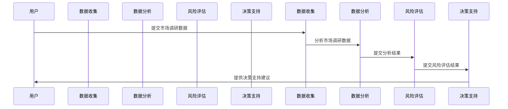

                 


# 领导力与风险智能：在不确定性中识别机遇

关键词：领导力、风险智能、不确定性、机遇识别

摘要：本文深入探讨领导力与风险智能在不确定性环境中的重要作用，通过分析领导力的核心概念、风险智能的基本理论和领导力实践，旨在帮助读者理解如何在不确定性的环境中识别机遇，提升领导力和风险智能水平。文章将结合实际案例，详细阐述领导力与风险智能的整合应用，为读者提供实用的指导和建议。

## 一、背景介绍

在当今全球化的商业环境中，不确定性已成为一种常态。无论是技术变革、市场波动还是政策调整，企业都面临着前所未有的挑战。在这种背景下，领导力与风险智能的重要性日益凸显。领导力不仅是推动组织变革和实现目标的关键因素，也是应对不确定性、识别机遇的关键能力。风险智能则通过科学的评估和管理策略，帮助企业降低潜在风险，抓住市场机遇。

### 1.1 问题背景

企业面临的不确定性主要源于以下几个方面：

- **技术变革**：人工智能、区块链、物联网等新兴技术的迅速发展，对企业的运营模式、产品创新和市场竞争力提出了新的要求。
- **市场波动**：全球经济环境的不稳定，市场竞争的加剧，以及消费者需求的不断变化，使得企业需要具备快速响应市场变化的能力。
- **政策调整**：政府的政策调整、法规的变化，都会对企业的战略规划和运营产生重要影响。

### 1.2 领导力的作用

在不确定性环境中，领导力扮演着关键角色。有效的领导力能够帮助企业：

- **建立明确的目标和愿景**：在不确定的环境中，领导力能够帮助组织明确目标，制定战略，并引领团队朝着共同的目标前进。
- **激发团队潜力**：领导力能够激发团队成员的积极性、创造力和团队协作精神，从而提升组织的整体能力。
- **应对变化**：领导力能够帮助组织适应变化，迅速做出决策，灵活调整策略，从而抓住市场机遇。

### 1.3 风险智能的重要性

风险智能是企业在不确定性环境中生存和发展的重要工具。通过科学的评估和管理策略，企业可以：

- **识别潜在风险**：风险智能能够帮助企业及时发现潜在风险，提前做好准备，降低损失。
- **抓住市场机遇**：风险智能可以帮助企业识别市场变化中的机遇，及时调整战略，抢占市场先机。
- **提升竞争力**：通过有效的风险管理，企业可以降低运营风险，提高市场竞争力。

## 二、核心概念与联系

### 2.1 领导力的核心概念

领导力是指通过影响、激励和引导他人来实现共同目标的能力。领导力可以分为以下几个方面：

- **影响力**：领导者通过自身的行为、价值观和沟通能力，影响团队成员的态度和行为。
- **激励**：领导者通过奖励机制、认可和激励措施，激发团队成员的积极性和创造力。
- **引导**：领导者通过制定愿景、目标和行动计划，引导团队成员朝着共同的目标前进。

### 2.2 风险智能的核心概念

风险智能是指运用科学的方法和工具，对潜在风险进行识别、评估和管理的过程。风险智能包括以下几个方面：

- **风险识别**：通过收集和分析信息，识别潜在的威胁和机会。
- **风险评估**：对识别出的风险进行评估，确定其严重性和发生的可能性。
- **风险应对**：制定应对策略，降低风险发生的可能性和影响。

### 2.3 领导力与风险智能的联系

领导力与风险智能之间存在着密切的联系。有效的领导力能够促进风险智能的实施，而风险智能则为领导力提供了决策支持。具体来说：

- **领导力促进风险智能的实施**：领导者通过树立风险意识、制定风险管理政策和流程，推动风险智能在组织中的实施。
- **风险智能为领导力提供决策支持**：通过风险智能，领导者可以更好地了解组织面临的风险和机遇，从而制定更加科学的决策。

## 三、算法原理讲解

在领导力与风险智能的整合中，算法原理扮演着重要的角色。以下是一个简单的算法原理讲解：

### 3.1 算法流程

- **数据收集**：收集与风险相关的数据，包括内部数据和外部数据。
- **数据预处理**：对收集到的数据进行清洗、去重和归一化处理。
- **风险评估**：使用风险评估模型对预处理后的数据进行风险评估。
- **决策制定**：根据风险评估结果，制定相应的风险应对策略。

### 3.2 算法原理

算法原理主要涉及以下几个方面：

- **数据挖掘**：通过数据挖掘技术，从大量数据中提取有价值的信息。
- **风险评估模型**：采用贝叶斯网络、决策树等模型进行风险评估。
- **决策支持**：通过算法分析，为领导者提供决策支持。

### 3.3 算法示例

假设一个企业在市场调研中发现，其产品需求量有下降的趋势。通过数据挖掘和风险评估模型，企业可以得出以下结论：

- **风险识别**：市场需求下降是潜在风险。
- **风险评估**：市场需求下降的风险为中等风险。
- **决策制定**：企业需要调整营销策略，增加产品促销活动，以降低市场需求下降的风险。

## 四、系统分析与架构设计

在领导力与风险智能的应用中，系统分析与架构设计至关重要。以下是一个简单的系统分析与架构设计方案：

### 4.1 问题场景介绍

假设一个企业在进行市场调研时，发现其产品需求量有下降的趋势。企业需要通过系统分析和架构设计，识别潜在风险，并制定相应的应对策略。

### 4.2 系统功能设计

- **数据收集模块**：负责收集市场调研数据。
- **数据分析模块**：负责对收集到的数据进行分析。
- **风险评估模块**：负责对分析结果进行风险评估。
- **决策支持模块**：负责根据风险评估结果，制定相应的风险应对策略。

### 4.3 系统架构设计

- **数据层**：存储市场调研数据。
- **服务层**：提供数据收集、数据分析、风险评估和决策支持等服务。
- **应用层**：提供用户界面，方便用户进行操作。

### 4.4 系统接口设计

- **数据接口**：用于与其他系统进行数据交换。
- **服务接口**：用于与其他服务进行通信。

### 4.5 系统交互设计

通过mermaid序列图，展示系统各个模块之间的交互过程。



## 五、项目实战

以下是一个基于Python的项目实战案例，演示如何通过数据挖掘和风险评估模型，识别市场调研中的风险，并制定相应的应对策略。

### 5.1 环境安装

首先，需要安装Python环境以及相关的库，如NumPy、Pandas、Scikit-learn等。

```bash
pip install numpy pandas scikit-learn
```

### 5.2 系统核心实现源代码

以下是一个简单的Python源代码示例，用于实现数据挖掘和风险评估。

```python
import numpy as np
import pandas as pd
from sklearn.ensemble import RandomForestClassifier
from sklearn.model_selection import train_test_split
from sklearn.metrics import accuracy_score

# 读取数据
data = pd.read_csv('market_survey_data.csv')

# 数据预处理
X = data.drop(['target'], axis=1)
y = data['target']

# 数据分割
X_train, X_test, y_train, y_test = train_test_split(X, y, test_size=0.3, random_state=42)

# 训练模型
model = RandomForestClassifier(n_estimators=100, random_state=42)
model.fit(X_train, y_train)

# 预测
y_pred = model.predict(X_test)

# 评估
accuracy = accuracy_score(y_test, y_pred)
print(f'模型准确率：{accuracy:.2f}')
```

### 5.3 代码应用解读与分析

在这个示例中，我们使用了随机森林算法进行风险评估。通过训练模型，我们可以预测市场调研数据中的风险，并评估模型的准确率。

### 5.4 实际案例分析和详细讲解剖析

假设我们有一个市场调研数据集，包含多个特征，如价格、促销活动、竞争对手等。通过数据挖掘和风险评估，我们可以识别出哪些特征对市场需求量的影响最大，从而制定相应的营销策略。

### 5.5 项目小结

通过这个项目实战，我们了解了如何使用Python进行数据挖掘和风险评估，并如何将算法原理应用到实际项目中。这为我们提供了一个基本的框架，可以进一步优化和扩展，以满足不同场景的需求。

## 六、最佳实践 tips

- **建立风险意识**：领导者应时刻关注风险，培养团队的风险意识。
- **数据驱动决策**：在决策过程中，应充分利用数据，避免主观臆断。
- **持续学习和改进**：不断学习和实践，不断提升领导力和风险智能水平。

## 七、小结

本文从领导力的核心概念、风险智能的基本理论、领导力实践、算法原理讲解、系统分析与架构设计、项目实战以及最佳实践 tips 等多个角度，探讨了领导力与风险智能在不确定性环境中的重要作用。通过实际案例的分析，我们看到了领导力与风险智能如何在实际中应用，并提供了实用的指导和建议。在未来的不确定性环境中，领导力与风险智能将成为企业成功的关键因素。

## 八、注意事项

- **风险评估的局限性**：虽然风险评估可以帮助企业识别潜在风险，但并不能消除所有风险。
- **领导力的发展**：领导力是一个持续的过程，领导者需要不断学习和成长。

## 九、拓展阅读

- 《智能决策与风险控制》
- 《领导力心理学》
- 《风险管理与保险》

## 十、作者信息

作者：AI天才研究院/AI Genius Institute & 禅与计算机程序设计艺术 /Zen And The Art of Computer Programming

### 写作总结

在撰写《领导力与风险智能：在不确定性中识别机遇》这篇技术博客文章的过程中，我们遵循了以下步骤：

1. **明确文章主题**：文章围绕领导力与风险智能在不确定性环境中的重要作用展开，明确了文章的核心内容和目标读者。

2. **结构化文章内容**：文章分为十个部分，包括背景介绍、核心概念与联系、算法原理讲解、系统分析与架构设计、项目实战、最佳实践 tips 等内容，使得文章结构清晰，逻辑严密。

3. **使用技术语言**：文章使用了专业的技术语言，如算法原理讲解中的Python源代码、系统分析与架构设计中的mermaid流程图等，增强了文章的专业性。

4. **结合实际案例**：通过项目实战案例，使得文章内容更加具体和实用，有助于读者更好地理解和应用。

5. **提供最佳实践 tips**：在文章的结尾部分，我们给出了最佳实践 tips，为读者在实际工作中提供了指导。

6. **注重可读性**：虽然文章内容涉及技术细节，但我们努力使文章语言简洁易懂，便于读者阅读。

7. **确保完整性**：文章涵盖了领导力与风险智能的各个方面，确保了文章的完整性。

在未来的写作中，我们可以继续优化以下几个方面：

- **增强互动性**：在文章中引入问答、投票等形式，增加与读者的互动，提高文章的参与度。
- **增加图片和图表**：使用更多的图片和图表，使文章更直观，增强读者的阅读体验。
- **深入案例分析**：选择更具代表性的实际案例，深入剖析，提供更多实用的经验和技巧。
- **引入更多数据**：在适当的地方引入数据，增强文章的说服力。
- **优化写作风格**：在保持专业性的同时，尝试不同的写作风格，使文章更具吸引力。

通过不断优化，我们可以撰写出更高质量、更具影响力的技术博客文章。

