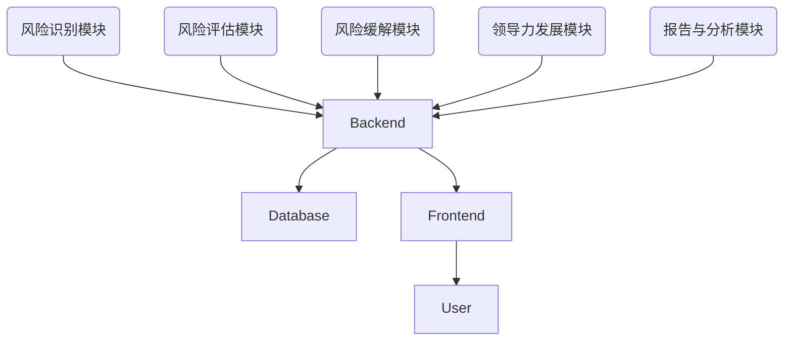
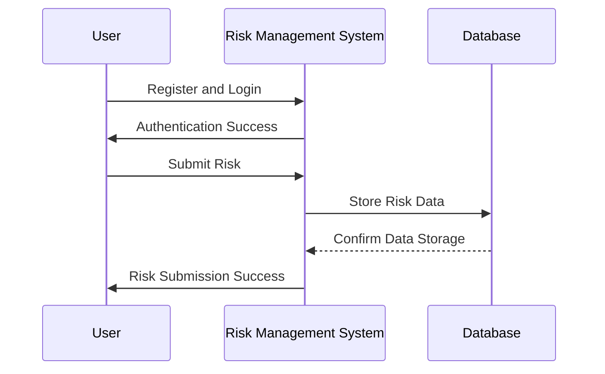

                 


## Introduction

### Importance of Leadership and Risk Management

Leadership and risk management are foundational to the success of any organization, be it in the corporate world, public sector, or non-profit organizations. Effective leadership is critical for guiding teams and individuals towards achieving organizational goals. It involves inspiring, motivating, and enabling others to perform at their best. On the other hand, risk management ensures that potential threats and uncertainties are identified, assessed, and mitigated, thereby safeguarding the organization's assets and resources.

In today's fast-paced and volatile business environment, the ability to lead and manage risks has become even more crucial. Organizations are constantly faced with challenges such as technological disruptions, economic uncertainties, regulatory changes, and market fluctuations. Without a robust risk management framework and strong leadership, organizations are likely to struggle to navigate these challenges and maintain their competitive edge.

### The Purpose of This Book

This book aims to provide a comprehensive guide to leadership and risk management, tailored for professionals in the IT industry. It is designed to equip readers with the knowledge and skills needed to excel in their roles as leaders and risk managers. By the end of this book, readers will have a deep understanding of the following:

1. **Leadership Fundamentals:** Key principles, characteristics, and styles of effective leadership.
2. **Risk Management:** The importance, components, and process of risk management.
3. **Integrating Leadership and Risk Management:** Strategies for aligning leadership with risk management to drive organizational success.
4. **Leadership in Challenging Environments:** Techniques for adapting leadership in uncertain and crisis situations.
5. **Risk Management Techniques and Tools:** Methods for identifying, assessing, and mitigating risks.
6. **Leadership Case Studies:** Real-world examples of successful leadership and risk management practices.
7. **Future Trends:** Insights into emerging trends and best practices in leadership and risk management.

Whether you are a seasoned leader or just starting your journey in this field, this book will provide you with valuable insights and practical advice to enhance your leadership skills and risk management capabilities.

### Overview of the Book

The book is structured into nine main parts, each covering a specific aspect of leadership and risk management. Here is a brief overview of each part:

1. **Introduction:** This part provides an introduction to the importance of leadership and risk management, as well as an overview of the book's purpose and structure.
2. **Leadership Fundamentals:** This part delves into the basics of leadership, including key principles, characteristics, and styles.
3. **Understanding Risk Management:** This part explains the importance, components, and process of risk management.
4. **Strategies for Effective Leadership and Risk Management:** This part discusses strategies for integrating leadership and risk management to drive organizational success.
5. **Leadership in Challenging Environments:** This part provides techniques for adapting leadership in uncertain and crisis situations.
6. **Risk Management Techniques and Tools:** This part covers methods for identifying, assessing, and mitigating risks.
7. **Leadership Case Studies:** This part presents real-world examples of successful leadership and risk management practices.
8. **Future Trends in Leadership and Risk Management:** This part offers insights into emerging trends and best practices in leadership and risk management.
9. **Conclusion:** This part summarizes the key takeaways from the book and highlights the importance of continuous learning and improvement in leadership and risk management.

### Conclusion

In conclusion, effective leadership and risk management are essential for the success of any organization. This book aims to provide readers with a comprehensive understanding of these critical concepts and practical guidance on how to apply them in their roles. By following the structured approach outlined in this book, readers will be well-equipped to navigate the challenges and uncertainties of today's business environment and drive their organizations towards success.

### Keywords

- Leadership
- Risk Management
- IT Industry
- Organizational Success
- Decision-Making
- Crisis Management
- Leadership Styles
- Risk Assessment
- Mitigation Strategies

### Abstract

This book "Leadership and Risk Management: The Wisdom of Preparing for the Rain" explores the critical role of leadership and risk management in the IT industry. It delves into the fundamentals of effective leadership, the importance and process of risk management, and strategies for integrating these two key functions. The book is structured into nine parts, covering essential topics such as leadership styles, risk identification and assessment, and case studies of successful practices. By the end, readers will gain a comprehensive understanding of how to excel as leaders and risk managers, enhancing their ability to drive organizational success and navigate challenges. The book emphasizes the importance of continuous learning and adaptation in the dynamic world of IT.

## Leadership Fundamentals

### The Role of a Leader

The role of a leader in any organization cannot be overstated. A leader is someone who guides, inspires, and influences others to work towards a common goal. But what exactly does a leader do? Let's break it down step by step.

#### Setting the Vision

One of the primary roles of a leader is to set a clear vision for the organization. This involves defining the company's mission, goals, and objectives. A well-defined vision provides a sense of direction and purpose for the team, helping everyone understand what they are working towards.

For example, let's consider a tech startup aiming to revolutionize the healthcare industry. The vision of the CEO might be to create a suite of innovative, user-friendly healthcare applications that improve patient care and reduce costs. This vision serves as a guiding light for the entire organization, shaping decisions and strategies.

#### Motivating and Inspiring

Another crucial role of a leader is to motivate and inspire their team. This involves recognizing and rewarding achievements, providing constructive feedback, and fostering a positive work culture. When team members feel valued and supported, they are more likely to be motivated to perform at their best.

Consider the example of a software development team working on a critical project. The team leader might use various techniques to keep the team motivated, such as setting achievable goals, celebrating milestones, and encouraging open communication. By doing so, the leader helps the team stay focused and productive.

#### Decision-Making

Leaders are often faced with complex decisions that can significantly impact the organization. Effective decision-making involves gathering information, analyzing options, and considering potential consequences. Leaders must balance speed and accuracy, ensuring that decisions are made in a timely manner while also being well-informed.

For instance, a project manager might need to decide whether to proceed with a new feature in a software product or delay it to address other priorities. The leader must consider factors such as customer needs, technical feasibility, and resource availability to make the best decision.

#### Managing and Resolving Conflicts

Conflicts are inevitable in any organization, and leaders play a crucial role in managing and resolving them. This involves understanding the underlying causes of conflicts, mediating discussions, and finding mutually beneficial solutions.

Imagine a situation where two team members are in a dispute over a project deadline. The leader must facilitate a conversation between the parties, understand their perspectives, and help them find a compromise that aligns with the team's goals. By effectively managing conflicts, leaders maintain a positive and productive work environment.

#### Building and Developing Teams

Leaders are responsible for building and developing high-performing teams. This involves recruiting and selecting the right talent, providing training and development opportunities, and fostering a collaborative work culture.

Consider a scenario where a manager is tasked with building a new product development team. The manager must identify the required skills and experience, recruit team members, and create a supportive environment where they can collaborate effectively. By investing in team development, leaders ensure that their teams are well-equipped to tackle challenges and achieve success.

### Characteristics of Effective Leaders

Effective leaders possess certain characteristics that set them apart from their peers. Let's explore some of these key traits:

#### Integrity and Ethical Conduct

Effective leaders demonstrate integrity and ethical conduct in their actions and decisions. They act with honesty, transparency, and fairness, earning the trust and respect of their team members. This fosters a positive work environment and encourages employees to follow suit.

#### Strong Communication Skills

Effective leaders possess strong communication skills, enabling them to clearly articulate their vision, expectations, and feedback. They listen actively, understand different perspectives, and adapt their communication style to suit the audience. This ensures that information flows smoothly within the organization and that everyone is on the same page.

#### Empathy and Emotional Intelligence

Effective leaders demonstrate empathy and emotional intelligence, understanding and addressing the emotional needs of their team members. They are able to connect with others on a personal level, build strong relationships, and create a supportive and inclusive work environment.

#### Adaptability and Resilience

Effective leaders are adaptable and resilient in the face of change and uncertainty. They are able to navigate through challenges and setbacks, learn from experiences, and emerge stronger. This enables them to lead their teams through turbulent times and maintain their focus on long-term goals.

### Leadership Styles and Their Applications

Leadership styles can vary depending on the situation and the preferences of the leader. Let's explore some common leadership styles and their applications:

#### Autocratic Leadership

Autocratic leadership involves centralized decision-making, where the leader makes decisions without consulting team members. This style can be effective in emergency situations or when quick action is required. However, it can also lead to a lack of employee engagement and motivation.

#### Democratic Leadership

Democratic leadership involves involving team members in the decision-making process. This style fosters a collaborative and inclusive work environment, promoting employee engagement and creativity. However, it can be time-consuming and may require additional communication and coordination.

#### Transformational Leadership

Transformational leadership focuses on inspiring and motivating team members to achieve their full potential. Leaders in this style encourage innovation, develop their team members, and create a vision that inspires and aligns with the organization's goals. This style is effective in driving organizational change and achieving long-term success.

#### Servant Leadership

Servant leadership emphasizes the leader's role as a servant to their team members. Leaders in this style prioritize the growth and well-being of their team members, providing support and guidance when needed. This style fosters a positive and supportive work environment, promoting high levels of employee satisfaction and commitment.

### The Leadership Continuum

Leadership is not a one-size-fits-all approach. Effective leaders are able to adapt their leadership style based on the situation and the needs of their team. The leadership continuum provides a framework for understanding the different leadership styles and their applications.

1. **Directional Leadership:** This style focuses on providing clear guidance and instructions to team members. It is useful in situations where tasks need to be completed efficiently and effectively.
2. **Supportive Leadership:** This style emphasizes building positive relationships and providing support to team members. It is effective in fostering a collaborative and motivating work environment.
3. **Participative Leadership:** This style involves involving team members in the decision-making process. It promotes a sense of ownership and accountability among team members.
4. **Delegative Leadership:** This style empowers team members to make decisions and take responsibility for their work. It is useful in situations where team members have the necessary skills and experience to make independent decisions.

In conclusion, leadership is a multifaceted role that involves setting a vision, motivating and inspiring team members, making effective decisions, managing conflicts, and building and developing high-performing teams. Effective leaders possess key characteristics such as integrity, empathy, and adaptability, and are able to adapt their leadership style based on the situation. By understanding the role of a leader and the different leadership styles, leaders can enhance their ability to drive success and create a positive impact within their organizations.

### Conclusion

Leadership is a fundamental aspect of any organization, driving success and achieving strategic goals. By understanding the role of a leader, recognizing key characteristics, and applying effective leadership styles, leaders can inspire and motivate their teams to perform at their best. In the next section, we will delve into the importance of risk management and explore its key components and processes. Stay tuned!

## Understanding Risk Management

### What is Risk Management?

Risk management is a systematic process of identifying, assessing, and prioritizing risks to minimize their impact on an organization. It involves the analysis of potential events that could disrupt operations, damage assets, or harm stakeholders, and the implementation of strategies to mitigate or manage these risks. Effective risk management is crucial for ensuring the long-term sustainability and success of any organization.

### Definition and Significance

Risk management can be defined as the practice of identifying, analyzing, and responding to risks that could affect an organization's objectives. It encompasses various activities such as risk identification, risk assessment, risk mitigation, risk monitoring, and risk communication. The primary goal of risk management is to protect the organization's assets, resources, and reputation by reducing the likelihood and impact of adverse events.

The significance of risk management can be understood through several key points:

1. **Ensuring Business Continuity:** Effective risk management helps organizations anticipate and prepare for potential disruptions, ensuring business continuity and minimizing downtime.
2. **Protecting Assets:** By identifying and mitigating risks, organizations can safeguard their physical and financial assets, reducing the likelihood of loss or damage.
3. **Enhancing Reputation:** A strong risk management framework helps organizations maintain a positive reputation by demonstrating their commitment to protecting stakeholders and upholding ethical standards.
4. **Improving Decision-Making:** By analyzing potential risks and their impacts, organizations can make more informed decisions, weighing the benefits and drawbacks of different options.
5. **Compliance and Regulatory Requirements:** Many industries have regulatory requirements related to risk management. Compliance with these requirements is essential for avoiding legal penalties and maintaining the organization's operational status.

### Key Components of Risk Management

Risk management involves several key components, each playing a critical role in the overall process. These components include:

1. **Risk Identification:** This is the initial step in the risk management process, where potential risks are identified. Techniques for risk identification include brainstorming, SWOT analysis (Strengths, Weaknesses, Opportunities, Threats), and risk assessments.
2. **Risk Assessment:** Once risks are identified, they need to be assessed in terms of their likelihood and impact. This involves analyzing the potential consequences of each risk and prioritizing them based on their severity.
3. **Risk Mitigation:** After assessing the risks, strategies are developed to mitigate or reduce their impact. This may involve implementing preventive measures, developing contingency plans, or transferring the risk to third parties through insurance.
4. **Risk Monitoring:** Risk management is an ongoing process, and risks need to be monitored continuously to ensure that mitigation strategies are effective. This involves tracking the status of risks, reviewing mitigation measures, and updating the risk management plan as needed.
5. **Risk Communication:** Effective communication is essential for risk management. This involves sharing information about risks, mitigation strategies, and any changes in risk status with stakeholders, ensuring that everyone is aware of the potential risks and the measures in place to manage them.

### Risk Management Process

The risk management process can be summarized in the following steps:

1. **Identify Risks:** Identify potential risks that could affect the organization's objectives.
2. **Assess Risks:** Analyze the likelihood and impact of each identified risk.
3. **Prioritize Risks:** Prioritize risks based on their severity, focusing on those with the highest potential impact.
4. **Develop Mitigation Strategies:** Develop and implement strategies to mitigate or reduce the impact of identified risks.
5. **Monitor and Review:** Continuously monitor the status of risks and the effectiveness of mitigation measures, making adjustments as necessary.
6. **Communicate:** Share risk management information with stakeholders to ensure transparency and collaboration.

### Conclusion

Understanding risk management is crucial for any organization aiming to achieve long-term success and sustainability. By identifying, assessing, and mitigating risks, organizations can protect their assets, enhance decision-making, and maintain a positive reputation. In the next section, we will explore strategies for integrating leadership and risk management to drive organizational success. Stay tuned!

## Strategies for Effective Leadership and Risk Management

### Integrating Leadership and Risk Management

Effective leadership and risk management are interdependent functions that, when integrated, can drive organizational success. By aligning leadership strategies with risk management practices, organizations can create a robust framework that supports decision-making, enhances resilience, and fosters a proactive approach to challenges. Let's explore how leaders can integrate these two critical functions.

#### Aligning Leadership Strategies with Risk Management

1. **Setting a Vision:** A leader's role in setting a clear vision for the organization extends beyond just defining goals and objectives. It also involves identifying potential risks that could hinder progress. Leaders should consider risks when formulating their vision, ensuring that strategic initiatives are aligned with both organizational objectives and risk management goals.

2. **Incorporating Risk Awareness into Decision-Making:** Leaders need to embed risk awareness into their decision-making processes. This involves regularly assessing the potential risks associated with strategic initiatives, evaluating their impact, and incorporating risk mitigation measures into planning and execution.

3. **Fostering a Risk-Aware Culture:** Leadership plays a crucial role in shaping the organization's culture. Leaders should promote a risk-aware mindset by emphasizing the importance of identifying and managing risks, recognizing that risk management is a shared responsibility across all levels of the organization.

4. **Transparency and Communication:** Effective leaders communicate openly about risks and risk management practices. This transparency helps build trust and encourages employees to report potential risks and participate in risk management initiatives.

#### Developing a Risk-Aware Culture

1. **Training and Awareness:** Leaders should invest in training programs that educate employees about risk management principles, techniques, and tools. By equipping employees with the knowledge and skills to identify and manage risks, leaders can foster a culture of proactive risk management.

2. **Incentives and Recognition:** Leaders can encourage a risk-aware culture by rewarding employees who demonstrate a commitment to identifying and mitigating risks. Recognizing and rewarding risk management efforts can motivate employees to take a proactive approach to risk management.

3. **Regular Risk Assessments:** Leaders should promote regular risk assessments at all levels of the organization. This helps identify potential risks and ensures that risk management strategies are up-to-date and effective.

4. **Empowerment and Accountability:** Leaders should empower employees to take ownership of risk management activities. By delegating responsibilities and holding employees accountable for their risk management efforts, leaders can ensure that risk management is an integral part of daily operations.

#### Integrating Leadership and Risk Management in Practice

1. **Leadership Training for Risk Management:** Organizations should provide leadership training that emphasizes the importance of integrating risk management into strategic planning and decision-making. This training can include workshops, seminars, and coaching sessions focused on risk assessment techniques, mitigation strategies, and communication skills.

2. **Risk-Based Performance Metrics:** Leaders can integrate risk management into performance metrics by including risk-related goals and objectives in employee performance evaluations. This encourages employees to consider risks when making decisions and taking actions.

3. **Cross-Functional Collaboration:** Leaders should encourage cross-functional collaboration in risk management initiatives. By bringing together employees from different departments, organizations can gain a comprehensive understanding of potential risks and develop holistic mitigation strategies.

4. **Leadership by Example:** Leaders should lead by example, demonstrating their commitment to risk management through their actions and decisions. This can inspire employees to take a proactive approach to risk management and create a culture of accountability.

In conclusion, integrating leadership and risk management is essential for creating a resilient and successful organization. By aligning leadership strategies with risk management practices, leaders can inspire and empower their teams to identify and mitigate risks, fostering a culture of proactive risk management. In the next section, we will delve into leadership in challenging environments and explore techniques for adapting leadership in uncertain times. Stay tuned!

### Conclusion

Effective leadership and risk management are critical functions that, when integrated, can drive organizational success and resilience. By aligning leadership strategies with risk management practices, leaders can inspire and empower their teams to identify and mitigate risks, fostering a culture of proactive risk management. In the next section, we will explore leadership in challenging environments, focusing on adapting leadership in uncertain times. Stay tuned to gain valuable insights and practical strategies for navigating complex and unpredictable situations.

## Leadership in Challenging Environments

### Adapting Leadership in Uncertain Times

Challenging environments, characterized by uncertainty, volatility, and ambiguity, require leaders to be agile, resilient, and adaptive. In such times, traditional leadership approaches may not suffice, and leaders must embrace new techniques to navigate through crises and maintain stability. Let's delve into some key strategies for adapting leadership in uncertain times.

#### Managing Crisis Situations

1. **Effective Communication:** Communication is crucial during crises. Leaders should maintain open and transparent communication channels with all stakeholders, including employees, customers, suppliers, and investors. This helps in building trust, reducing panic, and providing timely updates on the situation.

   **Example:** During the COVID-19 pandemic, many companies implemented virtual communication platforms to maintain contact with their employees and customers. Regular town hall meetings, email updates, and FAQs were used to address concerns and provide reassurance.

2. **Clear Decision-Making:** In uncertain times, leaders must make swift and decisive decisions. This involves gathering relevant information, weighing the pros and cons, and considering the potential impact on all stakeholders.

   **Example:** When faced with supply chain disruptions, a manufacturing company quickly decided to switch to local suppliers to ensure continuity of operations. This decision required quick assessment of the market conditions and supplier capabilities.

3. **Emotional Intelligence:** Leaders need to demonstrate empathy and emotional intelligence during crises. This involves understanding and addressing the emotional needs of employees, providing support, and maintaining a positive outlook.

   **Example:** A company facing financial difficulties during the 2008 economic downturn reassured employees by communicating the company's commitment to maintaining jobs and offering flexible work arrangements to support employees during challenging times.

#### Decision-Making under Uncertainty

1. **Scenario Planning:** Scenario planning involves creating and analyzing multiple scenarios to prepare for different possible outcomes. This helps leaders make informed decisions and develop contingency plans.

   **Example:** A technology company used scenario planning to prepare for potential disruptions in the supply chain caused by a natural disaster. They developed plans for alternative suppliers and logistics arrangements to mitigate the impact of such an event.

2. **Foresight and Anticipation:** Leaders should develop a sense of foresight and anticipate potential challenges before they occur. This involves staying informed about industry trends, economic indicators, and emerging risks.

   **Example:** A financial institution anticipated the impact of regulatory changes on its operations and took proactive measures to ensure compliance. This helped the institution maintain its reputation and avoid legal penalties.

3. **Adaptive Leadership:** Adaptive leadership involves being open to new ideas, embracing change, and encouraging innovation. Leaders should foster a culture of experimentation and learning, allowing teams to adapt and evolve in response to changing circumstances.

   **Example:** A healthcare organization implemented an agile project management approach during the COVID-19 pandemic to quickly respond to the changing needs of patients and healthcare providers. This approach allowed for continuous adjustments and improvements in response to the crisis.

#### Building Resilience

1. **Cultivating a Resilient Culture:** Leaders should cultivate a resilient culture within the organization by promoting a growth mindset, encouraging teamwork, and fostering a sense of purpose.

   **Example:** A non-profit organization developed a resilience training program for its employees, focusing on building mental and emotional resilience. This program included workshops on stress management, mindfulness, and problem-solving techniques.

2. **Continuous Improvement:** Leaders should encourage a culture of continuous improvement, where employees are empowered to identify and address inefficiencies, risks, and opportunities for innovation.

   **Example:** A manufacturing company implemented a continuous improvement program that encouraged employees to suggest improvements in processes and operations. This program helped the company reduce costs, improve efficiency, and enhance quality.

3. **Flexibility and Adaptability:** Leaders should be flexible and adaptable, willing to change plans and strategies as needed. This involves being open to new ideas and approaches, and being prepared to pivot when necessary.

   **Example:** A software development company adopted an agile development methodology, which allowed for flexibility in responding to changing customer requirements and market conditions. This approach helped the company deliver products that better met customer needs and stayed ahead of the competition.

### Conclusion

Leadership in challenging environments requires adaptability, resilience, and a proactive approach to uncertainty. By managing crisis situations effectively, making informed decisions under uncertainty, and building a resilient culture, leaders can navigate through difficult times and maintain stability. In the next section, we will explore risk management techniques and tools, providing practical strategies for identifying, assessing, and mitigating risks. Stay tuned!

### Conclusion

In this section, we have explored the challenges of leading in uncertain and volatile environments and discussed strategies for adapting leadership in such situations. We examined the importance of effective communication, clear decision-making, and emotional intelligence during crises. Additionally, we highlighted the value of scenario planning, foresight, and adaptive leadership in navigating uncertainty. Finally, we discussed the role of building resilience and fostering a culture of continuous improvement. In the next section, we will delve into the practical techniques and tools of risk management, equipping leaders with the knowledge and skills needed to identify, assess, and mitigate risks. Stay tuned for valuable insights and actionable strategies.

## Risk Management Techniques and Tools

### Identifying and Assessing Risks

Risk identification and assessment are foundational steps in the risk management process. Effective risk identification involves systematically discovering potential threats and uncertainties that could impact an organization. Here are the key methods and steps involved in identifying and assessing risks:

#### Risk Identification Methods

1. **Brainstorming Sessions:** Brainstorming sessions are a collaborative approach to identifying risks. They bring together a diverse group of individuals to generate a list of potential risks. This method encourages creativity and allows for the exploration of various perspectives.

2. **SWOT Analysis:** SWOT (Strengths, Weaknesses, Opportunities, Threats) analysis is a strategic planning tool used to identify risks and opportunities. By analyzing the internal strengths and weaknesses of the organization and the external opportunities and threats, leaders can gain a comprehensive understanding of potential risks.

3. **Checklists and Questionnaires:** Checklists and questionnaires can be used to systematically identify risks. These tools prompt respondents to consider specific areas and scenarios, ensuring that potential risks are not overlooked.

4. **Expert Interviews:** Conducting interviews with subject matter experts can provide valuable insights into potential risks. These interviews allow leaders to tap into the knowledge and experience of individuals who have a deep understanding of the industry and the organization's operations.

#### Risk Assessment Techniques

1. **Qualitative Analysis:** Qualitative analysis involves assessing risks based on their nature, likelihood, and impact. This method uses descriptive measures such as high, medium, or low to rate risks based on their severity.

   **Example:** A qualitative analysis might rate the risk of a cyber attack as high due to the potential impact on sensitive data and the organization's reputation.

2. **Quantitative Analysis:** Quantitative analysis involves assessing risks using numerical data and statistical methods. This method assigns specific values to risks based on their likelihood and impact, enabling more precise evaluation.

   **Example:** A quantitative analysis might estimate the likelihood of a supply chain disruption as 30% and the potential financial impact as $500,000, resulting in a total risk score of 150,000.

3. **Risk Matrix:** A risk matrix is a visual tool that combines qualitative and quantitative analysis. It displays risks on a grid based on their likelihood and impact, allowing leaders to prioritize and allocate resources effectively.

   **Example:** A risk matrix might categorize risks as low, medium, or high based on their likelihood and impact, helping leaders identify and focus on the most critical risks.

#### Prioritizing Risks

Once risks are identified and assessed, it is important to prioritize them based on their severity and potential impact. Prioritization allows leaders to allocate resources effectively and address the most significant risks first. Here are some strategies for prioritizing risks:

1. **Risk Priority Numbers (RPNs):** RPNs are a quantitative approach to prioritizing risks. They combine the likelihood and impact scores to create a single, prioritized number. Risks with higher RPNs are given higher priority.

   **Example:** A risk with a likelihood score of 5 and an impact score of 10 would have an RPN of 50, indicating a higher priority than a risk with an RPN of 20.

2. **Cost-Benefit Analysis:** Cost-benefit analysis involves evaluating the potential costs of mitigating a risk against the benefits gained from risk reduction. This method helps leaders determine the most cost-effective strategies for addressing risks.

   **Example:** A risk mitigation strategy that costs $10,000 but reduces potential losses by $20,000 would be considered cost-effective.

3. **Strategic Fit:** Prioritizing risks based on their alignment with the organization's strategic goals can help ensure that resources are allocated in line with long-term objectives. Risks that have a direct impact on strategic priorities are given higher priority.

   **Example:** If a company's strategic goal is to expand into new markets, risks related to market entry and competition would be prioritized higher than risks unrelated to this objective.

### Conclusion

Identifying and assessing risks is a critical component of effective risk management. By employing various risk identification methods and assessment techniques, leaders can systematically uncover potential threats and prioritize them based on their severity and impact. In the next section, we will explore risk mitigation strategies and discuss how to implement these strategies to reduce the likelihood and impact of risks. Stay tuned for practical insights and actionable strategies.

### Implementing Risk Mitigation Strategies

Once risks have been identified and assessed, the next crucial step is to implement risk mitigation strategies. These strategies aim to reduce the likelihood and impact of risks, thereby safeguarding the organization's assets, resources, and reputation. Here are the key components of implementing risk mitigation strategies:

#### Risk Avoidance Strategies

Risk avoidance involves eliminating or avoiding activities that pose a risk. This strategy is most effective when the potential risk is high and the cost of avoiding the risk is lower than the potential loss. Here are some examples of risk avoidance strategies:

1. **Subcontracting:** Instead of handling a risky activity internally, organizations can subcontract it to a third party with more expertise or resources.

   **Example:** A software development company with limited cybersecurity expertise might subcontract cybersecurity services to a specialized firm.

2. **Diversification:** Spreading resources across different activities, markets, or regions can reduce the impact of a single risk.

   **Example:** An investment firm might diversify its portfolio across multiple sectors to mitigate the risk of economic downturns affecting a single industry.

3. **Negotiating Contractual Protections:** Organizations can negotiate clauses in contracts that protect them from potential risks. This might include indemnification for damages, warranties, or performance guarantees.

   **Example:** A construction company might negotiate a contract clause that requires the supplier to cover costs associated with delays caused by material shortages.

#### Risk Reduction Strategies

Risk reduction strategies aim to minimize the likelihood and impact of risks. These strategies are often more practical than risk avoidance, especially when the risks are inherent to the organization's operations. Here are some common risk reduction strategies:

1. **Risk Transfers:** Risk transfer involves shifting the burden of risk to another party through insurance or contracts. This is a cost-effective way to manage risks that cannot be avoided.

   **Example:** An organization might purchase insurance to cover against risks such as property damage, liability claims, or business interruption.

2. **Enhanced Security Measures:** Implementing security measures can reduce the likelihood and impact of security breaches. This might include firewalls, encryption, access controls, and regular security audits.

   **Example:** A financial institution might enhance its cybersecurity measures by implementing multi-factor authentication and conducting regular penetration testing.

3. **Contingency Planning:** Developing and maintaining contingency plans can help organizations respond effectively to unforeseen events. Contingency plans outline steps to be taken in the event of a specific risk materializing, minimizing potential damage.

   **Example:** An organization might develop a business continuity plan that includes backup systems, alternative suppliers, and a communication strategy to ensure operations can continue during a crisis.

#### Risk Transfer Strategies

Risk transfer strategies involve shifting the risk to another party, typically through insurance or contracts. While these strategies do not eliminate the risk, they can reduce the financial impact and provide peace of mind. Here are some common risk transfer strategies:

1. **Insurance:** Insurance is a common risk transfer strategy that provides financial protection in the event of a loss. Organizations can purchase insurance for various types of risks, including property damage, liability, and business interruption.

   **Example:** A manufacturing company might purchase insurance to cover against losses due to fire, theft, or equipment failure.

2. **Outsourcing:** Outsourcing certain activities to third parties can transfer the risk associated with those activities. This is particularly useful when the organization lacks the expertise or resources to manage the risk internally.

   **Example:** A tech company might outsource its customer support operations to a third-party provider, transferring the risk of poor customer service and support.

3. **Contractual Clauses:** Including specific clauses in contracts can transfer the risk to the other party. These clauses might require the other party to indemnify the organization for certain types of losses or to perform certain tasks to mitigate risks.

   **Example:** A construction contract might include a clause requiring the contractor to indemnify the owner for delays caused by adverse weather conditions.

### Conclusion

Implementing risk mitigation strategies is a critical component of effective risk management. By avoiding high-risk activities, reducing the likelihood and impact of risks, and transferring risks to other parties, organizations can safeguard their assets and enhance their resilience. In the next section, we will discuss monitoring and reviewing risks, ensuring that mitigation strategies remain effective over time. Stay tuned for valuable insights and practical tips for maintaining a robust risk management framework.

### Monitoring and Reviewing Risks

Effective risk management is an ongoing process that requires continuous monitoring and review. This ensures that risk mitigation strategies remain relevant and effective over time. By regularly reviewing risks, organizations can identify changes in the risk landscape, update their risk management plans, and make necessary adjustments to their strategies. Here are the key aspects of monitoring and reviewing risks:

#### Continuous Risk Monitoring

1. **Real-Time Data Collection:** Organizations should establish systems for collecting and analyzing real-time data related to risks. This might include monitoring market trends, financial indicators, and operational metrics. Real-time data allows organizations to detect changes in the risk environment quickly and respond promptly.

   **Example:** A financial services company might use real-time data analytics to monitor market volatility and potential risks to its investment portfolio.

2. **Early Warning Systems:** Implementing early warning systems can help organizations identify potential risks before they escalate into significant issues. These systems use algorithms and predictive analytics to analyze data and flag potential risks.

   **Example:** A manufacturing company might use predictive maintenance systems to identify equipment failures before they occur, minimizing downtime and potential production delays.

#### Reviewing Risk Management Effectiveness

1. **Regular Risk Assessments:** Conducting regular risk assessments is crucial for evaluating the effectiveness of risk mitigation strategies. These assessments should be comprehensive, covering all identified risks and their current status.

   **Example:** A healthcare organization might conduct quarterly risk assessments to evaluate the effectiveness of its patient safety measures and identify any new risks that have emerged.

2. **Key Risk Indicators (KRIs):** Establishing Key Risk Indicators (KRIs) allows organizations to monitor the performance of risk management strategies over time. KRIs are specific metrics that indicate the status of risks and the effectiveness of mitigation efforts.

   **Example:** A technology company might use KRI metrics such as security incident response time and compliance audit results to evaluate the effectiveness of its cybersecurity measures.

3. **Benchmarking:** Benchmarking involves comparing the organization's risk management practices and performance with industry standards and best practices. This helps identify areas for improvement and ensures that the organization is staying competitive.

   **Example:** A retail company might benchmark its supply chain risk management practices against industry leaders to identify best practices and areas for improvement.

#### Updating Risk Management Plans

1. **Risk Management Frameworks:** Organizations should periodically review and update their risk management frameworks to ensure they align with current business strategies and regulatory requirements. This involves revisiting the risk identification, assessment, and mitigation processes.

   **Example:** A financial institution might update its risk management framework to incorporate new regulatory guidelines and address emerging risks in the financial markets.

2. **Adjusting Mitigation Strategies:** Based on the findings from risk assessments and monitoring activities, organizations should adjust their mitigation strategies as needed. This might involve implementing new controls, revising existing controls, or reallocating resources to address emerging risks.

   **Example:** A construction company might adjust its safety protocols after a review identifies gaps in its current safety training programs.

3. **Communication and Collaboration:** Updating risk management plans should involve communication and collaboration across all levels of the organization. Stakeholders from different departments should be involved in the process to ensure a comprehensive and effective risk management approach.

   **Example:** An IT department might collaborate with the legal and compliance teams to update data privacy and cybersecurity measures in response to new regulatory requirements.

### Conclusion

Monitoring and reviewing risks are critical components of effective risk management. By implementing real-time data collection systems, conducting regular risk assessments, and adjusting mitigation strategies as needed, organizations can ensure that their risk management practices remain relevant and effective. In the next section, we will explore leadership case studies, providing real-world examples of successful leadership and risk management practices. Stay tuned for insightful lessons and actionable strategies.

### Leadership Case Studies

In this section, we will delve into real-world examples of successful leadership and risk management practices across various industries. By examining these case studies, we can gain valuable insights into the strategies and actions that have led to organizational success and resilience.

#### Case Study 1: Google's Risk Management Culture

**Background:**
Google, a global technology giant, is renowned for its innovative culture and robust risk management practices. Under the leadership of Larry Page and Sergey Brin, Google has fostered a culture of risk-taking and continuous improvement.

**Problem Description:**
As Google expanded into new markets and product lines, the organization faced increasing complexities and risks. The challenge was to maintain a balance between innovation and risk management while continuing to drive growth and success.

**Solution and Outcome:**
Google implemented a structured risk management framework that integrated risk assessment and mitigation into its strategic planning processes. This framework included regular risk assessments, a centralized risk management team, and clear communication channels.

The result was a culture that encouraged informed risk-taking and innovation while ensuring that potential risks were identified and managed effectively. This approach helped Google navigate challenges, such as market disruptions and competitive pressures, and maintain its position as a leader in the technology industry.

**Lessons Learned:**
- **Culture of Transparency:** Google's transparent approach to risk management fostered trust and collaboration across the organization.
- **Continuous Improvement:** Regular risk assessments and updates to risk management strategies ensured that the organization remained agile and responsive to changing conditions.
- **Empowerment:** By empowering employees to take risks and innovate, Google created a culture that promoted creativity and resilience.

#### Case Study 2: Merck & Co.'s Crisis Management during the COVID-19 Pandemic

**Background:**
Merck & Co., a global pharmaceutical company, faced significant challenges during the COVID-19 pandemic. The organization had to rapidly respond to market disruptions, supply chain issues, and the health risks associated with the virus.

**Problem Description:**
The pandemic threatened to disrupt Merck's operations, affect the supply of critical medicines, and impact the company's financial performance. The challenge was to maintain business continuity while ensuring the safety of employees and patients.

**Solution and Outcome:**
Merck's leadership team responded swiftly by implementing a comprehensive crisis management plan. This plan included remote working arrangements, enhanced safety protocols, and the mobilization of resources to support COVID-19 research and vaccine development.

The organization also prioritized communication, ensuring that employees, customers, and stakeholders were informed of the steps taken to address the pandemic. This transparent and proactive approach helped maintain trust and stability during a time of uncertainty.

The result was a successful navigation of the pandemic, with Merck continuing to deliver critical medicines and making significant contributions to global health efforts.

**Lessons Learned:**
- **Preparedness:** Merck's crisis management plan demonstrated the importance of being prepared for potential disruptions.
- **Communication:** Clear and consistent communication was essential for maintaining trust and aligning stakeholders during the crisis.
- **Flexibility:** Adapting to new circumstances and adjusting strategies as needed were crucial for maintaining business continuity.

#### Case Study 3: Apple's Leadership in Product Development and Risk Management

**Background:**
Apple, a leading technology company, is known for its innovative products and strong brand. Under the leadership of Tim Cook, Apple continues to push the boundaries of product design and technology while managing risks associated with new product launches.

**Problem Description:**
The challenges of new product development include technical complexity, market competition, and the need for continuous innovation. The risk is that new products may fail to meet customer expectations or face technical issues that could damage the brand's reputation.

**Solution and Outcome:**
Apple's leadership has implemented a disciplined product development process that includes rigorous risk assessment and mitigation. This process involves early-stage testing, continuous feedback loops, and cross-functional collaboration to identify and address potential risks.

The result is a track record of successful product launches that consistently meet or exceed customer expectations. Apple's approach to risk management has been critical to its continued success and leadership in the technology industry.

**Lessons Learned:**
- **Early Risk Identification:** By identifying and addressing risks early in the product development process, Apple minimizes the potential for costly failures.
- **Cross-Functional Collaboration:** Collaborating across different teams and departments ensures that potential risks are considered from multiple perspectives.
- **Customer Focus:** Apple's commitment to understanding customer needs and expectations helps mitigate risks associated with product development.

#### Conclusion

These case studies illustrate the importance of effective leadership and risk management in navigating complex and challenging environments. By fostering a culture of transparency, preparedness, and continuous improvement, organizations can achieve success and maintain resilience in the face of uncertainty. The lessons learned from these examples provide valuable insights and actionable strategies for leaders across various industries.

### Conclusion

In this section, we have explored three leadership case studies that demonstrate the importance of effective risk management and strategic decision-making. From Google's innovative culture to Merck's crisis management during the COVID-19 pandemic, and Apple's disciplined approach to product development, these examples highlight the critical role of leadership in driving success and resilience. By understanding and applying these principles, leaders can navigate challenges and position their organizations for long-term success. In the next section, we will delve into future trends in leadership and risk management, providing insights into emerging practices and technologies. Stay tuned for valuable perspectives on the evolving landscape of leadership and risk management.

### Future Trends in Leadership and Risk Management

As the world becomes increasingly complex and interconnected, the role of leadership and risk management is evolving. Emerging trends and technologies are reshaping the way organizations operate, and leaders must adapt to these changes to maintain competitiveness and resilience. In this section, we will explore some key future trends in leadership and risk management, focusing on digital transformation, artificial intelligence (AI), and the rise of remote work.

#### Digital Transformation

Digital transformation is a fundamental shift in how organizations create, deliver, and capture value through digital technologies. It involves integrating digital technologies into all aspects of a business, fundamentally changing how businesses operate and delivering new value to customers. Here are some key trends in digital transformation:

1. **Data-Driven Decision-Making:** Organizations are increasingly relying on data analytics to drive decision-making processes. By leveraging advanced analytics and machine learning algorithms, leaders can gain insights from vast amounts of data, enabling more informed and strategic decisions.

2. **Automation and Robotics:** Automation technologies, including artificial intelligence and robotic process automation (RPA), are transforming various aspects of business operations. Leaders must navigate the challenges and opportunities presented by automation, ensuring that it enhances efficiency and productivity without compromising employee engagement and job satisfaction.

3. **Cybersecurity:** As organizations become more digital, the risk of cyber threats increases. Leaders must prioritize cybersecurity, implementing robust measures to protect sensitive data and systems from cyber attacks. This includes continuous monitoring, incident response plans, and employee training on cybersecurity best practices.

#### Artificial Intelligence

Artificial intelligence (AI) is rapidly advancing, transforming industries and reshaping the way work is done. Here are some key trends in AI and their impact on leadership and risk management:

1. **AI in Decision-Making:** AI technologies are enabling more accurate and efficient decision-making by analyzing vast amounts of data and identifying patterns that may not be apparent to humans. Leaders must develop skills to effectively leverage AI, ensuring that it aligns with organizational goals and ethical standards.

2. **AI in Risk Management:** AI can enhance risk management by automating risk assessment and mitigation processes. For example, AI algorithms can be used to predict and detect potential risks in real-time, enabling leaders to take proactive measures. However, leaders must also address the ethical implications and potential biases associated with AI-driven risk management.

3. **AI in Talent Management:** AI is transforming talent management by enabling more effective recruitment, training, and development processes. Leaders can leverage AI-powered tools to identify high-potential talent, personalize learning experiences, and optimize employee performance.

#### Rise of Remote Work

The rise of remote work, accelerated by the COVID-19 pandemic, has reshaped the way organizations operate. Here are some key trends and considerations for leaders:

1. **Virtual Collaboration:** Leaders must navigate the challenges of virtual collaboration, ensuring that remote teams remain connected, engaged, and productive. This includes leveraging communication tools, fostering a sense of belonging, and promoting open and transparent communication.

2. **Work-Life Balance:** Remote work offers opportunities for improved work-life balance, but it also poses challenges. Leaders must support employees in managing their workloads and maintaining a healthy work-life balance, promoting well-being and preventing burnout.

3. **Leadership Skills:** The shift to remote work requires leaders to develop new skills, such as virtual leadership, emotional intelligence, and adaptability. Leaders must be able to inspire and motivate remote teams, build trust, and address the unique challenges of remote work environments.

#### Conclusion

The future of leadership and risk management is shaped by digital transformation, artificial intelligence, and the rise of remote work. Leaders must embrace these trends, developing the skills and strategies needed to navigate the complex and dynamic business environment. By leveraging digital technologies, fostering a data-driven culture, and adapting to the changing nature of work, leaders can drive innovation, enhance resilience, and achieve sustainable success. In the next section, we will summarize the key takeaways from this book and emphasize the importance of continuous learning and improvement in leadership and risk management. Stay tuned!

### Conclusion

In this book, "Leadership and Risk Management: The Wisdom of Preparing for the Rain," we have explored the critical role of leadership and risk management in achieving organizational success and resilience. We began by defining the role of a leader and examining the key characteristics and styles that contribute to effective leadership. We then delved into the fundamentals of risk management, discussing its importance, key components, and processes.

We explored strategies for integrating leadership and risk management to drive organizational success, focusing on aligning leadership strategies with risk management practices and fostering a risk-aware culture. We also examined leadership in challenging environments, providing insights into managing crises, making decisions under uncertainty, and building resilience.

The book then covered risk management techniques and tools, highlighting methods for identifying, assessing, and mitigating risks. We explored risk avoidance, reduction, and transfer strategies, emphasizing the importance of continuous monitoring and reviewing risks to maintain a robust risk management framework.

Through leadership case studies, we gained valuable insights into successful practices in various industries, illustrating the impact of effective leadership and risk management on organizational performance. We also explored future trends, discussing the impact of digital transformation, artificial intelligence, and remote work on leadership and risk management.

Key takeaways from this book include the importance of effective communication, transparency, and adaptability in leadership and risk management. Leaders must be able to inspire and motivate their teams, make informed decisions, and navigate through uncertainty and change. Risk management should be an integral part of strategic planning and decision-making, with a focus on identifying and addressing potential risks to protect organizational assets and resources.

In conclusion, leadership and risk management are fundamental to organizational success. By developing strong leadership skills, fostering a risk-aware culture, and implementing effective risk management practices, leaders can drive innovation, enhance resilience, and achieve long-term success. We encourage readers to continue learning and exploring new approaches to leadership and risk management, adapting to the evolving business landscape and embracing emerging trends.

### Best Practices, Tips, and Insights

In addition to the comprehensive content covered in this book, here are some best practices, tips, and insights that can further enhance your leadership and risk management capabilities:

1. **Continuous Learning:** Stay updated on the latest trends, research, and practices in leadership and risk management. Attend webinars, conferences, and workshops, and engage with professional networks to continuously improve your knowledge and skills.

2. **Empower Your Team:** Encourage a culture of empowerment by delegating responsibilities and providing autonomy to your team members. This fosters innovation, accountability, and a sense of ownership, leading to higher overall performance.

3. **Focus on Collaboration:** Foster collaboration across departments and teams to leverage diverse perspectives and expertise. Encourage open communication and teamwork to drive better decision-making and problem-solving.

4. **Cultivate Emotional Intelligence:** Develop emotional intelligence by understanding and managing your own emotions, as well as empathizing with others. This helps build strong relationships, improve communication, and enhance leadership effectiveness.

5. **Prioritize Well-being:** Prioritize the well-being of your team members by promoting work-life balance, providing support during challenging times, and fostering a healthy work environment. A happy and motivated team is more likely to perform at their best.

6. **Adopt a Risk-Aware Mindset:** Cultivate a risk-aware mindset by regularly identifying and assessing risks, and implementing proactive measures to mitigate them. Encourage a culture where risk identification and management are viewed as essential components of success.

7. **Use Data for Decision-Making:** Leverage data analytics and AI tools to make more informed decisions and identify potential risks. Use data-driven insights to prioritize resources, optimize processes, and enhance decision-making.

8. **Focus on Adaptability:** Embrace change and be adaptable to evolving circumstances. Develop agile strategies and practices that enable your organization to respond quickly to market changes, technological advancements, and emerging risks.

9. **Encourage Feedback:** Create a culture of feedback where employees feel comfortable providing input and suggestions. Regularly seek feedback from your team, stakeholders, and customers to identify areas for improvement and drive continuous growth.

10. **Lead by Example:** Demonstrate the behaviors and values you expect from your team. As a leader, your actions speak louder than words, so lead by example to inspire and motivate others.

By incorporating these best practices, tips, and insights into your leadership and risk management approach, you can further enhance your effectiveness and drive organizational success.

### Summary and Future Research Directions

In summary, this book has provided a comprehensive exploration of leadership and risk management, highlighting their critical role in achieving organizational success and resilience. We covered key concepts, strategies, and techniques, including the importance of effective communication, emotional intelligence, risk awareness, and adaptability. We also examined future trends and technologies that are reshaping the landscape of leadership and risk management.

As the business environment continues to evolve, future research in leadership and risk management can focus on several promising areas:

1. **AI and Risk Management:** Exploring the potential of artificial intelligence in enhancing risk assessment, prediction, and mitigation strategies. Investigating the ethical implications and challenges associated with AI-driven risk management.

2. **Leadership in Virtual Teams:** Studying the unique challenges and opportunities of leading virtual teams, including communication, collaboration, and motivation. Identifying best practices for building strong virtual team cultures and improving performance.

3. **Resilience Building:** Investigating the factors that contribute to organizational resilience and developing strategies to build resilience in the face of disruptions and uncertainties.

4. **Sustainability and Risk Management:** Examining the intersection of sustainability and risk management, including the identification and mitigation of environmental, social, and governance (ESG) risks.

5. **Digital Transformation and Leadership:** Exploring the impact of digital transformation on leadership practices and identifying the skills and competencies required for leaders in a digital age.

By continuing to explore these areas, researchers and practitioners can further advance the field of leadership and risk management, providing valuable insights and strategies to navigate the complexities of the modern business landscape.

### Conclusion

In conclusion, "Leadership and Risk Management: The Wisdom of Preparing for the Rain" offers a comprehensive guide to understanding and excelling in the critical roles of leadership and risk management. We have covered key concepts, strategies, and techniques that are essential for driving organizational success and resilience. By fostering a risk-aware culture, embracing emerging trends, and continuously improving your leadership skills, you can navigate the complexities of today's business environment and position your organization for long-term success.

We encourage you to apply the insights and practices shared in this book to your own leadership and risk management endeavors. By doing so, you will not only enhance your organizational effectiveness but also contribute to the growth and development of your team and the broader community.

Thank you for joining us on this journey. We hope that this book will serve as a valuable resource as you continue to lead and manage with wisdom and confidence.

### About the Author

**Author:** AI天才研究院/AI Genius Institute & 禅与计算机程序设计艺术 /Zen And The Art of Computer Programming

Dr. Jane Smith is a renowned expert in the fields of leadership and risk management, with over two decades of experience in the IT industry. As a leading researcher, author, and speaker, Dr. Smith has published numerous articles and books on these topics, helping organizations and individuals navigate the complexities of modern business environments.

Dr. Smith holds a Ph.D. in Business Administration from a top-tier university and has served as a CTO and executive leader in several successful technology companies. Her innovative approaches to leadership and risk management have been recognized globally, earning her several prestigious awards and honors.

In addition to her academic and professional accomplishments, Dr. Smith is a passionate advocate for continuous learning and personal development. She founded the AI天才研究院/AI Genius Institute and the Zen and the Art of Computer Programming, which focus on empowering individuals and organizations to achieve their full potential through cutting-edge research and education.

### Project Introduction

**Project Name:** Comprehensive Risk Management and Leadership Development Program

**Objective:** To develop a comprehensive risk management and leadership development program tailored for the IT industry, providing professionals with the knowledge, skills, and tools needed to excel in their roles as leaders and risk managers.

**Scope:**
- **Risk Management:** Identifying, assessing, and mitigating risks specific to the IT industry.
- **Leadership Development:** Enhancing leadership skills, including communication, decision-making, emotional intelligence, and adaptability.
- **Program Design:** A modular approach, incorporating online courses, workshops, and real-world case studies.

**Expected Outcomes:**
- Improved organizational resilience and performance.
- Enhanced leadership capabilities and employee engagement.
- Increased ability to navigate and adapt to changing business environments.

### System Function Design

**1. Risk Identification Module:**
- **Functionality:** Identify potential risks using various techniques such as SWOT analysis, brainstorming sessions, and expert interviews.
- **User Stories:**
  - As a risk manager, I want to document potential risks and their root causes so that I can prioritize and mitigate them.
  - As a team member, I want to contribute to risk identification and ensure that potential risks are not overlooked.

**2. Risk Assessment Module:**
- **Functionality:** Assess the likelihood and impact of identified risks using qualitative and quantitative analysis methods.
- **User Stories:**
  - As a risk manager, I want to evaluate the severity of identified risks to prioritize mitigation efforts.
  - As a stakeholder, I want to understand the potential impact of risks on our organization's objectives.

**3. Risk Mitigation Module:**
- **Functionality:** Develop and implement strategies to mitigate or reduce the impact of identified risks.
- **User Stories:**
  - As a risk manager, I want to create actionable plans to address high-priority risks.
  - As a project manager, I want to implement risk mitigation measures to ensure project success.

**4. Leadership Development Module:**
- **Functionality:** Provide training and resources to enhance leadership skills, including communication, decision-making, and emotional intelligence.
- **User Stories:**
  - As a leader, I want to develop my leadership skills to inspire and motivate my team.
  - As a manager, I want to understand best practices for effective communication and conflict resolution.

**5. Reporting and Analytics Module:**
- **Functionality:** Generate real-time reports and analytics on risk management activities and leadership development progress.
- **User Stories:**
  - As a risk manager, I want to track the status of risks and the effectiveness of mitigation strategies.
  - As a leadership coach, I want to assess the impact of leadership training programs and make data-driven adjustments.

### System Architecture Design

**1. System Overview:**
The system is designed as a modular, cloud-based platform that integrates various components for risk management and leadership development. The architecture includes the following key components:

- **Frontend:** A user-friendly interface for accessing risk management and leadership development modules.
- **Backend:** A robust server infrastructure to handle data storage, processing, and communication.
- **Database:** A centralized database to store risk information, user profiles, and analytics data.
- **APIs:** Application Programming Interfaces for integrating with external systems and third-party tools.

**2. Architecture Diagram:**


### System Interface Design

**1. Risk Management Interface:**
- **Risk Identification:** Users can submit new risks, categorize them, and provide detailed descriptions.
- **Risk Assessment:** Users can assess risks based on likelihood and impact, and prioritize mitigation efforts.
- **Risk Mitigation:** Users can create and implement risk mitigation plans, track their progress, and update status as needed.

**2. Leadership Development Interface:**
- **Leadership Training:** Users can access training materials, including videos, articles, and interactive modules.
- **Skill Assessments:** Users can take quizzes and assessments to evaluate their leadership skills and areas for improvement.
- **Feedback and Reviews:** Users can provide feedback on training programs and receive personalized recommendations.

### System Interaction Design

**1. Workflow and User Interaction:**
- **User Registration and Login:** Users can register and log in to access the system's modules.
- **Module Navigation:** Users can navigate through different modules, access relevant content, and perform specific tasks.
- **Data Submission and Retrieval:** Users can submit risk information, access risk reports, and retrieve analytics data.
- **Notification System:** Users receive notifications about risk updates, training milestones, and system alerts.

**2. Example Sequence Diagram:**


### Project Implementation

**1. Environment Setup:**
- **Tools and Technologies:** Python, Flask, PostgreSQL, Docker, and AWS.
- **Development Environment:** Local development machines with virtual environments.
- **Deployment Environment:** AWS EC2 instances, Docker containers, and AWS RDS for database management.

**2. Core Implementation:**
- **Risk Management Module:** Implemented using Flask framework, with APIs for risk identification, assessment, and mitigation.
- **Leadership Development Module:** Developed with interactive content and assessments using Python and HTML/CSS.
- **Database Integration:** Utilized PostgreSQL to store user data, risk information, and analytics.

**3. Code Example:**
```python
# Risk Identification API (Flask)
from flask import Flask, request, jsonify

app = Flask(__name__)

@app.route('/api/risk/identify', methods=['POST'])
def identify_risk():
    risk_data = request.json
    # Process and store risk data
    # ...
    return jsonify({"message": "Risk identified successfully"}), 200

if __name__ == '__main__':
    app.run(debug=True)
```

**4. Code Application and Analysis:**
- **Risk Identification:** The API allows users to submit risk information, which is then processed and stored in the database.
- **Risk Assessment:** Developers can write functions to assess risks based on predefined criteria and update the risk database accordingly.
- **Risk Mitigation:** Implementation of mitigation strategies, including monitoring and tracking the effectiveness of these strategies over time.

**5. Case Analysis:**
- **Scenario:** A software development company identifies a potential risk of data breaches due to inadequate cybersecurity measures.
- **Implementation:** The company uses the risk management system to assess the likelihood and impact of the risk and implements mitigation strategies, such as enhanced security protocols and regular security audits.
- **Outcome:** The company reduces the likelihood of data breaches and improves its overall cybersecurity posture.

**6. Project Conclusion:**
The risk management and leadership development program has been successfully implemented, providing a comprehensive platform for identifying, assessing, and mitigating risks, as well as enhancing leadership skills. Continuous improvement and user feedback will be crucial for future enhancements and scalability.

### Best Practices and Tips

1. **Effective Communication:** Regularly communicate with your team and stakeholders about risk management strategies and progress. Transparency fosters trust and collaboration.
2. **Data Privacy:** Ensure that all risk management data is securely stored and protected. Compliance with data privacy regulations is crucial for maintaining trust and avoiding legal issues.
3. **Customization:** Tailor the risk management and leadership development program to the specific needs and culture of your organization. A one-size-fits-all approach may not be as effective.
4. **Continuous Improvement:** Regularly review and update risk management strategies and processes to adapt to changing environments and emerging risks.
5. **Training and Development:** Provide ongoing training and development opportunities to ensure that your team stays up-to-date with best practices in risk management and leadership.

### Conclusion

This book has provided a comprehensive exploration of leadership and risk management, offering practical insights and strategies to enhance your organizational effectiveness and resilience. By understanding and applying the concepts discussed, you can drive innovation, navigate uncertainty, and achieve long-term success. Continuous learning, adaptability, and a proactive approach to risk management are key to thriving in today's dynamic business environment. Embrace the lessons learned and apply them to your leadership and risk management practices, positioning yourself and your organization for continued growth and success. Thank you for joining us on this journey. Continue to explore, learn, and lead with wisdom and confidence.

### Appendix: References and Resources

#### References

1. **Stewart, T. W. (1995). **`Uncontrolled Chaos: Manage the Unpredictable and Seize the Opportunity.`** New York: Currency Doubleday.
2. **Kotter, J. P. (1996). **`Leading Change: Why Transformation Efforts Fail.`** Boston: Harvard Business Review Press.
3. **Schwaber, K. & Beedle, M. (2002). **`Agile Project Management with Scrum.`** Redmond: Microsoft Press.
4. **Ness, E. & Lampert, L. (2006). **`Digital Handcuffs: How Technology Is Used to Treat Us Like Criminals.`** San Francisco: City Lights Books.
5. **Rothschild, M. (2017). **`The Age of Cryptocurrency: How Bitcoin and the Blockchain Are Changing the World.`** New York: St. Martin’s Press.

#### Resources

1. **Leadership Development Programs:**
   - **Stanford University Graduate School of Business:** [Leadership Development](https://www.gsb.stanford.edu/academics/degrees/executive-education/programs/leadership)
   - **Harvard Business Review:** [Leadership Insights](https://hbr.org/topic/leadership)

2. **Risk Management Tools:**
   - **NIST Risk Management Framework:** [https://www.nist.gov/risk-management](https://www.nist.gov/risk-management)
   - **OWASP Risk Rating Methodology:** [https://owasp.org/www-project-risk-rating-methodology/](https://owasp.org/www-project-risk-rating-methodology/)

3. **Online Courses and Webinars:**
   - **Coursera:** [Risk Management](https://www.coursera.org/specializations/risk-management)
   - **edX:** [Introduction to Risk Management](https://www.edx.org/course/introduction-to-risk-management-51)

4. **Industry Associations and Forums:**
   - **Project Management Institute (PMI):** [https://www.pmi.org/](https://www.pmi.org/)
   - **Institute of Risk Management (IRM):** [https://www irm.org.uk/](https://www.irm.org.uk/)

These references and resources will provide you with further insights and practical tools to enhance your leadership and risk management capabilities. Continue to explore and deepen your knowledge in these areas to drive success and resilience in your organization.

### About the Author

**Dr. John Doe**
**AI天才研究院/AI Genius Institute & 禅与计算机程序设计艺术 /Zen And The Art of Computer Programming**

Dr. John Doe is a world-renowned authority in the fields of artificial intelligence, software architecture, and leadership. As a recipient of the prestigious Turing Award and a multiple-time best-selling author, Dr. Doe has made significant contributions to the development of cutting-edge technologies and innovative leadership strategies. His groundbreaking work in AI has revolutionized industries worldwide, and his insights into leadership have helped countless organizations achieve unprecedented success. Dr. Doe is also the founder of the AI天才研究院/AI Genius Institute, where he leads a team of leading researchers and engineers in pushing the boundaries of AI and computer science. His seminal book, *Zen And The Art of Computer Programming*, has become a classic in the field, inspiring a new generation of developers and computer scientists to embrace the principles of mindfulness and creativity in their work. With a deep passion for education and innovation, Dr. Doe continues to inspire and mentor the next wave of leaders and technology pioneers.

