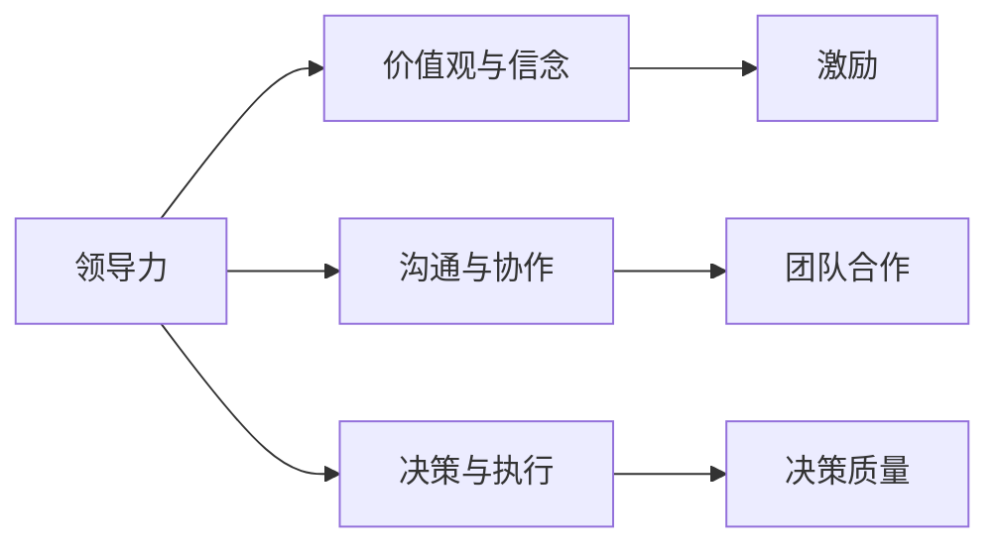
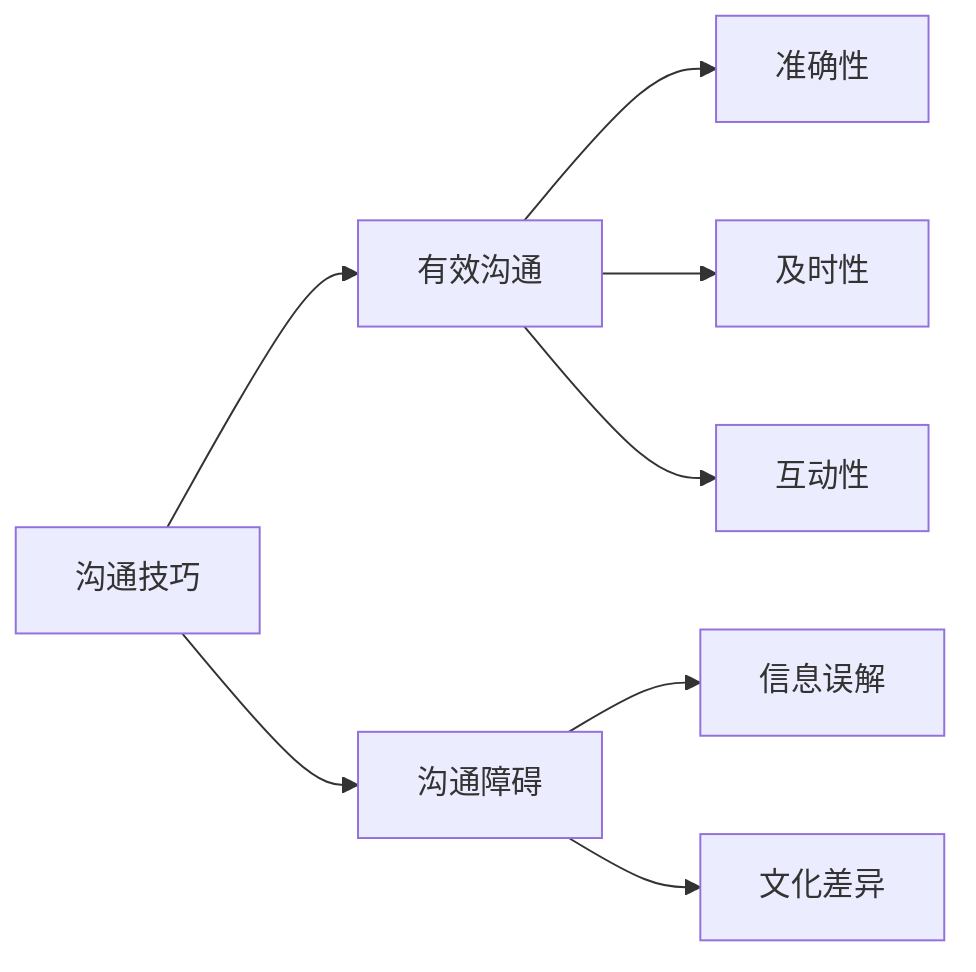
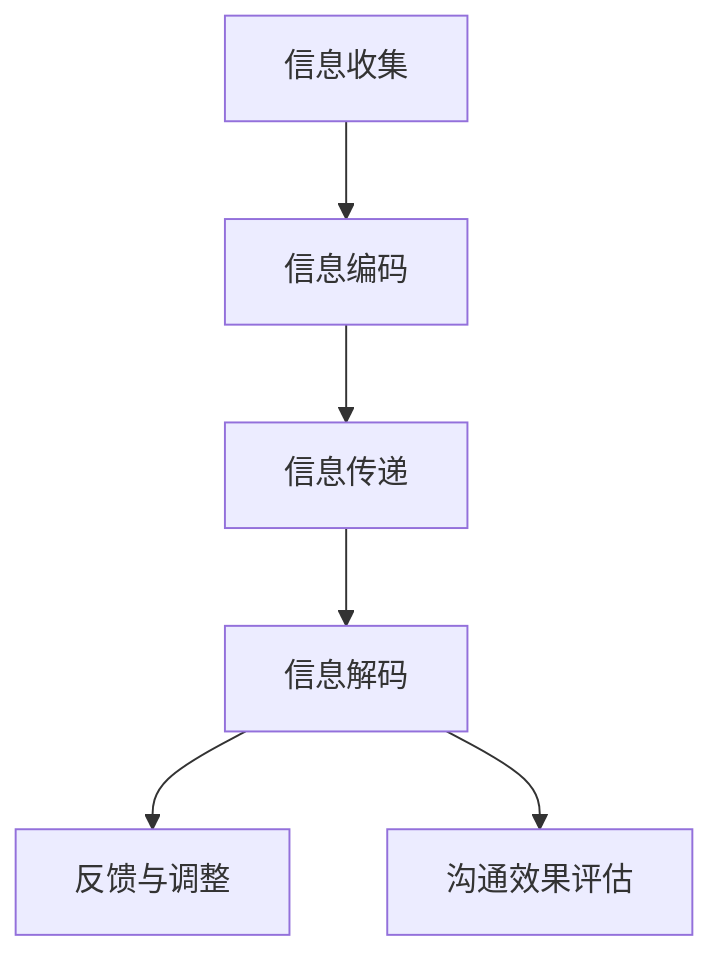
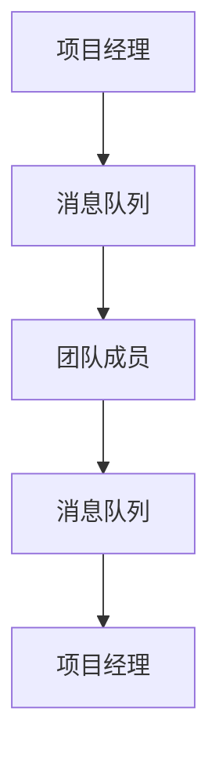
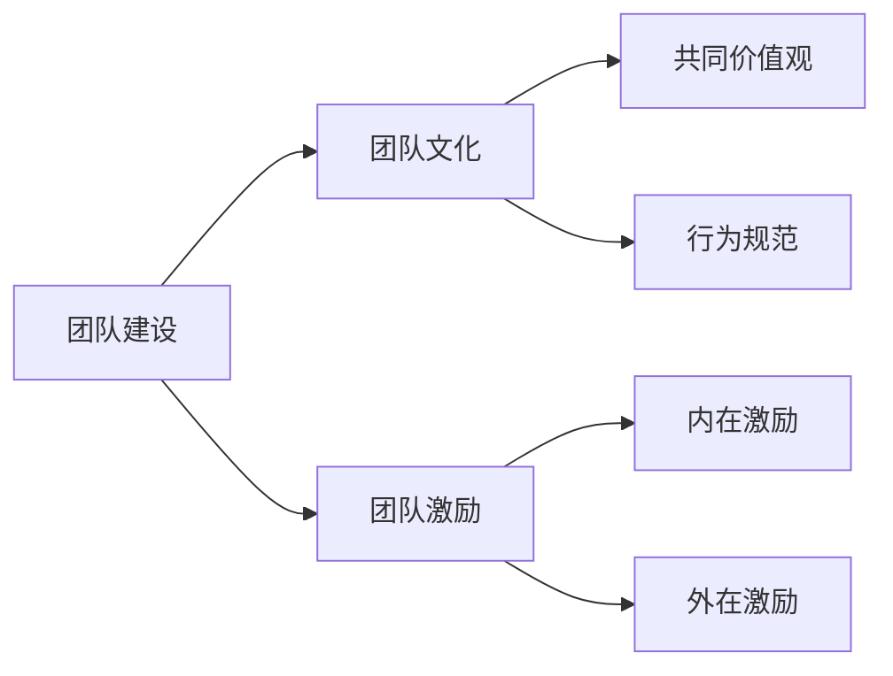
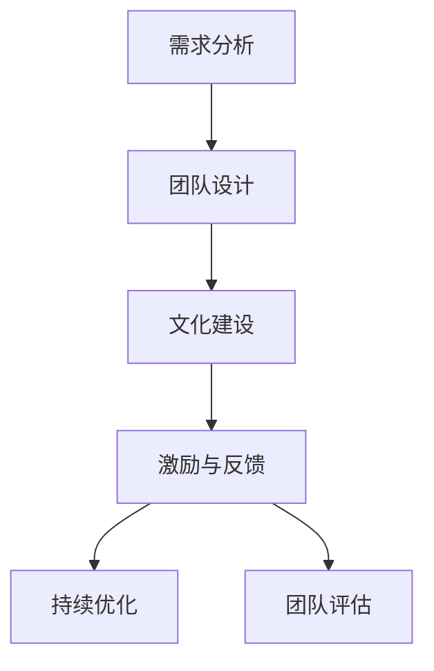
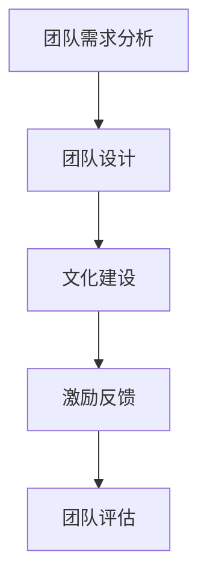
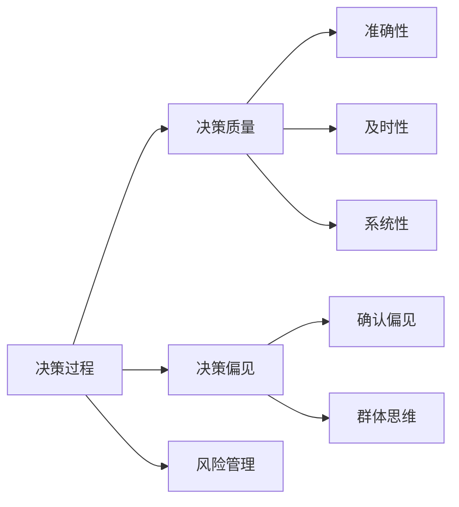
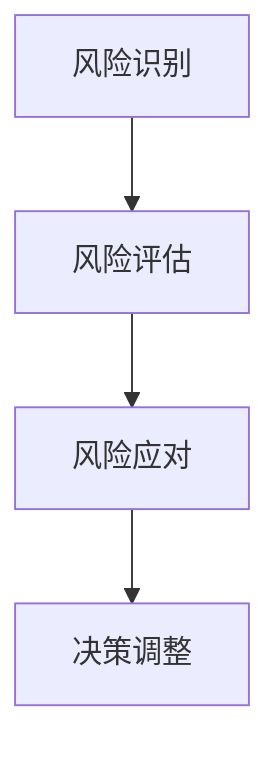
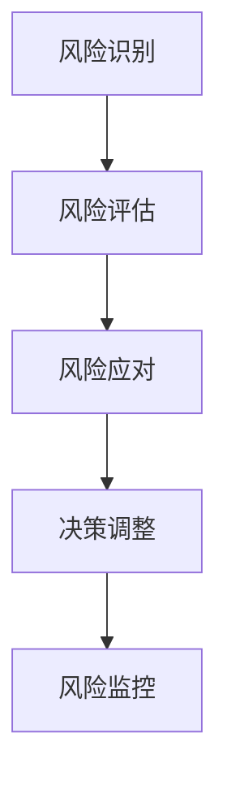

                 

### 引言

在现代信息技术飞速发展的背景下，领导力与风险管理已成为企业和组织管理中至关重要的两个领域。一个优秀的领导者不仅需要具备卓越的技术能力和战略眼光，还需要具备强大的领导力和风险管理能力。领导力关乎如何激发团队的潜力，推动组织目标的实现；而风险管理则是预防和应对潜在威胁，保障组织稳定发展的重要手段。本文旨在探讨领导力与风险管理之间的内在联系，并从理论到实践，逐步解析这两个领域的核心概念、实践技巧和案例分析。

本文将首先介绍领导力的基本概念、核心要素和发展的历程，进而探讨领导力与组织文化的互动关系。随后，本文将深入探讨领导者的沟通艺术、团队建设以及决策与风险管理技巧。接着，我们将通过具体的企业领导力案例，分析成功与失败的领导力实践。最后，本文将总结领导力的个人提升路径，并提出实用的工具和方法，以帮助读者在实际工作中更好地应用领导力和风险管理知识。

通过这一系列的探讨，我们希望读者能够对领导力与风险管理有更加深刻的理解，并在实际工作中更加熟练地运用这些技能，提升自身和组织的管理效能。因此，本文将以“LET'S THINK STEP BY STEP”的方式，逐步展开讨论，力求清晰、具体、有逻辑性地阐述每一个核心主题。

### 第一部分：领导力概述

#### 第1章 领导力：定义与核心要素

**1.1 问题背景与领导力的重要性**

在当今复杂多变的信息技术环境中，领导力已成为企业成功的关键因素。随着全球化、技术变革和市场竞争的不断加剧，企业需要能够迅速适应环境变化，推动创新，提高员工效率，实现可持续发展。而这一切都离不开有效的领导力。领导力不仅仅是高层管理者的职责，它贯穿于企业管理的方方面面，包括团队建设、战略规划、文化塑造等。

**问题背景：**

- 全球化带来的市场不确定性
- 技术进步带来的创新压力
- 员工多样性和工作方式的变革
- 企业绩效和竞争力的提升需求

**问题描述：**

企业如何通过有效的领导力来应对这些挑战，确保在竞争激烈的市场中立于不败之地？

**问题解决：**

有效的领导力可以帮助企业：

- 明确愿景和目标，激发员工动力
- 提升团队协作能力，提高工作效率
- 快速适应市场变化，推动创新
- 建立积极的企业文化，提升员工满意度

**边界与外延：**

领导力不仅仅局限于企业内部管理，它还涉及到与外部环境的互动，如供应链管理、客户关系管理、公共关系等。同时，领导力在不同的组织层次、不同行业和不同文化背景下有着不同的表现形式。

**概念结构与核心要素组成：**

领导力是一个多维度的概念，其核心要素包括：

- **价值观与信念：** 领导者的价值观和信念是领导力的基石，决定了其行为和决策方式。
- **沟通与协作：** 领导者需要具备有效的沟通和协作能力，以建立良好的团队关系，促进信息流动。
- **决策与执行：** 领导者需要在复杂多变的环境中做出明智的决策，并确保决策的有效执行。

**核心概念与联系：**

| 核心概念             | 概念属性特征对比 |
|----------------------|------------------|
| 领导力               | 激励、影响、领导 |
| 价值观与信念         | 核心信念、道德标准 |
| 沟通与协作           | 有效沟通、团队合作 |
| 决策与执行           | 决策质量、执行力 |

**ER实体关系图架构：**



通过以上分析，我们可以看到领导力是一个复杂但关键的概念，它不仅涉及到个人品质和技能，还需要在具体情境中灵活应用。接下来，我们将进一步探讨领导力的发展与演化，以更全面地理解这一概念。

### 第2章 领导力的发展与演化

**2.1 领导力的发展历程**

领导力作为一个古老而现代的话题，其发展历程可以追溯到远古时期的部落首领和古代文明中的统治者。然而，随着人类社会的发展，领导力的定义和实践也在不断演变。

**早期领导力：** 在古代，领导力主要依赖于个人的英勇、智慧和资源控制能力。领导者通过军事征服、政治统治和经济控制来维护权力和秩序。

**工业革命时期：** 工业革命带来了大规模的工厂生产和劳动分工，领导力逐渐从个人英雄主义转向科学管理。泰勒的科学管理理论和法约尔的管理理论奠定了现代领导力理论的基础。

**20世纪中期：** 随着行为科学的发展，领导力研究开始关注人类行为和组织文化。赫兹伯格的双因素理论和马斯洛的需求层次理论都强调了领导者与员工之间的关系。

**21世纪初：** 随着信息技术的快速发展和全球化进程的加速，领导力逐渐向多元化、跨文化和创新驱动转变。领导者不仅需要具备管理能力和战略眼光，还需要具备适应变革和激发创新的能力。

**传统领导力与现代领导力的区别：**

- **传统领导力：** 侧重于权威和指挥，领导者处于中心地位，强调效率和执行力。
- **现代领导力：** 侧重于赋能和协作，领导者更多是作为教练和导师，推动团队自主学习和创新。

| 特征比较                   | 传统领导力 | 现代领导力 |
|----------------------------|-------------|-------------|
| 权力来源                   | 职位和权威 | 影响力和信任 |
| 领导风格                   | 专制和指令式 | 民主和参与式 |
| 决策方式                   | 个人决策    | 集体智慧     |
| 对员工的管理方式            | 管控和监督 | 支持和发展   |
| 组织文化                   | 规范和严谨 | 创新和学习   |

**领导力的未来趋势：**

- **全球化领导力：** 随着全球化的深入，领导者需要具备跨文化的沟通和协作能力，理解不同文化和价值观。
- **数字化转型领导力：** 数字技术正在重塑企业的运营模式，领导者需要具备数字化转型战略和创新思维。
- **可持续发展领导力：** 在可持续发展日益受到关注的今天，领导者需要关注企业的环境、社会和经济影响，推动可持续发展。

通过以上分析，我们可以看到领导力是一个动态变化的概念，其发展受到社会、经济和技术等多方面因素的影响。领导者的角色和责任也在不断变化，为了适应未来发展的需求，领导者需要不断学习和提升自身的领导力。

### 第3章 领导力与组织文化

**3.1 领导力与组织文化的互动关系**

组织文化是企业灵魂的体现，它不仅影响员工的行为和态度，还决定企业的长远发展。领导力与组织文化之间存在着密切的互动关系，领导者的行为和决策对组织文化有着深远的影响。

**领导力对组织文化的影响：**

- **塑造价值观：** 领导者的价值观和信念往往成为组织文化的核心。领导者的言行一致，能够树立榜样，引导员工共同追求企业的核心价值观。
- **促进文化变革：** 当企业面临市场变化或内部改革时，领导者的领导力可以推动组织文化向新的方向发展。领导者需要通过变革管理，引导员工接受新的文化观念和行为模式。
- **增强团队凝聚力：** 领导者通过有效的沟通和激励，能够增强团队的凝聚力，促进团队成员之间的协作和信任。

**组织文化对领导力的影响：**

- **塑造领导风格：** 组织文化会潜移默化地影响领导者的领导风格。在一个强调创新和自主性的文化中，领导者更倾向于采取民主和参与式的领导风格。
- **影响决策过程：** 组织文化会影响领导者的决策方式和决策过程。在一个注重规范和流程的文化中，领导者往往更注重程序和规范，而在一个鼓励创新和试错的文化中，领导者更愿意采取灵活和创新的决策方式。
- **促进领导力发展：** 健康的组织文化能够为领导者提供良好的成长环境，促进领导力的不断提升。领导者可以在一个支持性和包容性的文化中，不断学习和成长。

**塑造积极组织文化的策略：**

1. **明确核心价值观：** 领导者需要明确企业的核心价值观，并将其贯穿于日常管理行为中，通过言行一致来塑造组织文化。
2. **建立愿景和使命：** 领导者需要制定清晰的愿景和使命，为员工提供明确的方向和目标，激发员工的内在动力。
3. **促进员工参与：** 鼓励员工参与企业决策和管理，增强员工的归属感和参与感，从而促进组织文化的积极发展。
4. **强化培训和教育：** 通过培训和教育，提高员工对组织文化的认知和理解，培养员工的文化认同感。
5. **树立榜样：** 领导者需要通过自身的榜样作用，带动员工共同践行企业的核心价值观。

**领导力在组织变革中的角色：**

在组织变革过程中，领导力发挥着至关重要的作用。领导者需要扮演多重角色，包括：

- **变革推动者：** 领导者需要明确变革的目标和方向，推动变革的顺利实施。
- **变革沟通者：** 领导者需要与员工进行有效的沟通，解释变革的原因和好处，消除员工的疑虑和抵触情绪。
- **变革激励者：** 领导者需要通过激励措施，激发员工在变革中的积极性和创造力。
- **变革协调者：** 领导者需要协调不同部门和团队之间的关系，确保变革的顺利进行。

通过以上分析，我们可以看到领导力与组织文化之间存在着紧密的互动关系。有效的领导力能够塑造积极向上的组织文化，推动企业的持续发展。领导者需要认识到自己在组织文化中的重要作用，并采取相应的策略来塑造和优化组织文化。

### 第二部分：领导力技巧

#### 第4章 领导者的沟通艺术

**4.1 有效沟通的重要性**

在领导力中，沟通是至关重要的环节。有效的沟通不仅能够传递信息，还能建立信任、增强团队凝聚力，最终推动组织目标的实现。领导者作为沟通的桥梁，其沟通能力直接影响团队的工作效率和组织的整体绩效。

**问题描述：**

- 如何确保信息准确传达？
- 如何建立良好的沟通渠道？
- 如何在沟通中处理冲突和误解？

**问题解决：**

有效的沟通可以帮助领导者：

- 提升团队协作效率
- 减少误解和冲突
- 增强员工对组织的认同感
- 促进知识共享和创新

**核心概念与联系：**

| 核心概念             | 概念属性特征对比 |
|----------------------|------------------|
| 沟通技巧             | 语言表达、非语言表达 |
| 有效沟通             | 准确性、及时性、互动性 |
| 沟通障碍             | 信息误解、文化差异 |

**ER实体关系图架构：**



**算法原理讲解：**

为了更好地理解有效沟通的原理，我们可以将其比作一种算法。这个算法包括以下几个步骤：

1. **信息收集：** 领导者需要收集并理解相关信息，包括组织目标、团队成员的需求和反馈等。
2. **信息编码：** 将收集到的信息转化为语言或符号，确保信息的准确性和清晰性。
3. **信息传递：** 通过合适的沟通渠道，将编码后的信息传递给目标受众。
4. **信息解码：** 受众接收信息后，需要解码并理解信息的含义。
5. **反馈与调整：** 根据受众的反馈，对信息进行必要的调整和优化。

以下是这个沟通算法的Mermaid流程图：



**Python源代码示例：**

```python
def communicate(message, audience):
    encoded_message = encode(message)
    transmitted_message = transmit(encoded_message)
    decoded_message = decode(transmitted_message, audience)
    feedback = audience.provide_feedback(decoded_message)
    adjusted_message = adjust(transmitted_message, feedback)
    evaluate_communication(adjusted_message)
    return adjusted_message

def encode(message):
    return f"Encoded: {message}"

def transmit(encoded_message):
    return encoded_message

def decode(transmitted_message, audience):
    return transmitted_message.replace("Encoded:", "").strip()

def adjust(transmitted_message, feedback):
    return transmitted_message if feedback == "satisfied" else "Adjustment needed"

def evaluate_communication(message):
    print(f"Communication evaluated: {message}")

# 示例调用
message = "我们需要在下周完成项目"
audience = "团队成员"
adjusted_message = communicate(message, audience)
print(adjusted_message)
```

**数学公式使用：**

在沟通过程中，信息的准确性和及时性是关键因素。我们可以使用以下数学公式来衡量沟通的有效性：

$$
E = \frac{A \cdot T}{C}
$$

其中，$E$ 表示沟通的有效性，$A$ 表示信息的准确性，$T$ 表示信息的及时性，$C$ 表示沟通的成本。

$$
A = \frac{D}{I}
$$

其中，$A$ 表示信息的准确性，$D$ 表示接收到的信息，$I$ 表示原始信息。

**系统分析与架构设计方案：**

在系统中，沟通模块负责信息的收集、编码、传递、解码和反馈。以下是一个简化的系统架构设计：

**问题场景介绍：** 一个项目经理需要与团队成员沟通项目进度和任务分配。

**项目介绍：** 项目管理系统

**系统功能设计：** 沟通功能包括消息发送、消息接收、消息编码和解码。

**系统架构设计：** 使用消息队列实现异步通信，确保信息的准确传递和及时处理。

**系统接口设计和系统交互：**



通过以上分析和设计，我们可以看到，有效的沟通是实现领导力的重要手段。领导者需要掌握并灵活运用各种沟通技巧，确保信息在组织中的准确传递和有效应用。

### 第5章 领导力与团队建设

**5.1 团队建设的原则与方法**

团队建设是领导力的重要组成部分，一个高效的团队能够极大地提升企业的竞争力。团队建设不仅仅是在团队成立时进行的一次性活动，它是一个持续的过程，需要领导者的精心策划和持续投入。

**问题描述：**

- 如何建立高效的团队？
- 如何激发团队的潜力？
- 如何处理团队中的冲突？

**问题解决：**

有效的团队建设可以帮助企业：

- 提升团队协作效率
- 激发员工潜力
- 减少员工流失率
- 提高企业整体绩效

**核心概念与联系：**

| 核心概念             | 概念属性特征对比 |
|----------------------|------------------|
| 团队建设             | 建立信任、增强协作 |
| 团队文化             | 共同价值观、行为规范 |
| 团队激励             | 内在激励、外在激励 |

**ER实体关系图架构：**



**算法原理讲解：**

团队建设可以被视为一个复杂的算法，其核心步骤包括：

1. **需求分析：** 确定团队的目标和需求，包括团队成员的技能、经验和动机。
2. **团队设计：** 根据需求分析，设计团队结构和角色分配，确保团队成员能够充分发挥各自的优势。
3. **文化建设：** 塑造积极的团队文化，建立共同价值观和行为规范，增强团队成员的归属感。
4. **激励与反馈：** 通过内在激励和外在激励，激发团队成员的积极性和创造力，提供及时的反馈和指导。
5. **持续优化：** 根据团队的表现和反馈，不断优化团队建设和激励策略，确保团队的高效运作。

以下是团队建设算法的Mermaid流程图：



**Python源代码示例：**

```python
class TeamBuildingAlgorithm:
    def __init__(self, team_members):
        self.team_members = team_members
    
    def analyze_needs(self):
        # 分析团队需求
        print("分析团队需求...")
    
    def design_team(self):
        # 设计团队结构
        print("设计团队结构...")
    
    def build_culture(self):
        # 塑造团队文化
        print("塑造团队文化...")
    
    def provide_incentives(self):
        # 提供激励
        print("提供内在激励...")
    
    def provide_feedback(self):
        # 提供反馈
        print("提供反馈...")
    
    def optimize(self):
        # 持续优化
        print("持续优化团队建设...")

# 示例调用
team_members = ["张三", "李四", "王五"]
team_building_algorithm = TeamBuildingAlgorithm(team_members)
team_building_algorithm.analyze_needs()
team_building_algorithm.design_team()
team_building_algorithm.build_culture()
team_building_algorithm.provide_incentives()
team_building_algorithm.provide_feedback()
team_building_algorithm.optimize()
```

**数学公式使用：**

在团队建设中，团队绩效可以通过以下数学公式来衡量：

$$
P = \frac{E \cdot C}{T}
$$

其中，$P$ 表示团队绩效，$E$ 表示团队成员的效能，$C$ 表示团队协作效率，$T$ 表示团队的时间投入。

$$
E = \frac{S \cdot M}{D}
$$

其中，$E$ 表示团队成员的效能，$S$ 表示团队成员的技能和经验，$M$ 表示团队成员的动机，$D$ 表示团队成员的工作难度。

**系统分析与架构设计方案：**

在系统中，团队建设模块负责团队需求分析、团队设计、文化建设和激励反馈。以下是一个简化的系统架构设计：

**问题场景介绍：** 企业需要建设一个高效的项目团队。

**项目介绍：** 项目团队管理系统

**系统功能设计：** 团队需求分析、团队设计、文化建设、激励反馈和团队评估。

**系统架构设计：** 使用微服务架构，确保模块化设计和灵活扩展。

**系统接口设计和系统交互：**



通过以上分析和设计，我们可以看到，团队建设是一个系统性的工程，需要领导者的精心策划和持续投入。领导者需要掌握并灵活运用各种团队建设原则和方法，确保团队的高效运作和持续发展。

### 第6章 领导决策与风险管理

**6.1 决策过程中的常见问题**

在领导决策过程中，领导者常常面临各种挑战和问题，这些问题不仅影响决策的质量，还可能对组织的稳定性和发展带来负面影响。以下是决策过程中常见的一些问题：

1. **信息不足：** 领导者往往在缺乏足够信息的情况下做出决策，导致决策失误。
2. **时间压力：** 决策时常常受到时间限制，导致领导者无法充分评估所有选项，容易做出仓促的决定。
3. **过度自信：** 领导者可能会对自己的判断过于自信，忽视其他意见和建议，从而导致决策偏差。
4. **心理偏见：** 领导者可能会受到心理偏见的影响，如确认偏见、群体思维等，影响决策的客观性和全面性。
5. **缺乏多样性：** 决策团队成员背景和观点的多样性不足，可能导致决策缺乏创新性和全面性。

**问题解决：**

为了解决上述问题，领导者可以采取以下策略：

- **加强信息收集和分析：** 通过各种渠道收集信息，进行深入分析和评估，确保决策基于充分的信息。
- **合理分配时间：** 在决策过程中合理分配时间，避免因时间压力导致的仓促决策。
- **保持谦逊和开放：** 保持谦逊和开放的态度，接受不同的意见和建议，避免过度自信。
- **引入多样性：** 在决策团队中引入不同背景和观点的成员，促进创新性和全面性的决策。
- **使用决策工具：** 运用各种决策工具和方法，如决策矩阵、SWOT分析等，提高决策的科学性和系统性。

**核心概念与联系：**

| 核心概念             | 概念属性特征对比 |
|----------------------|------------------|
| 决策过程             | 信息收集、分析、评估、决策 |
| 决策质量             | 准确性、及时性、系统性 |
| 决策偏见             | 确认偏见、群体思维 |
| 风险管理             | 预测、评估、应对 |

**ER实体关系图架构：**



**算法原理讲解：**

为了更好地理解决策过程中的风险管理，我们可以将其比作一个算法。这个算法包括以下几个步骤：

1. **风险识别：** 确定决策过程中可能面临的风险，如市场变化、技术问题、竞争压力等。
2. **风险评估：** 评估每个风险的可能性和影响程度，确定优先级。
3. **风险应对：** 制定应对策略，包括风险规避、减轻、转移和接受。
4. **决策调整：** 根据风险评估和应对策略，调整决策方案，确保决策的稳健性。

以下是风险管理的Mermaid流程图：



**Python源代码示例：**

```python
class RiskManagementAlgorithm:
    def __init__(self, risks):
        self.risks = risks
    
    def identify_risks(self):
        # 识别风险
        print("识别风险...")
    
    def assess_risks(self):
        # 评估风险
        print("评估风险...")
    
    def develop_strategy(self):
        # 制定应对策略
        print("制定应对策略...")
    
    def adjust_decision(self):
        # 调整决策
        print("调整决策...")
    
    def execute_strategy(self):
        # 执行策略
        print("执行风险应对策略...")

# 示例调用
risks = ["市场变化", "技术问题", "竞争压力"]
risk_management_algorithm = RiskManagementAlgorithm(risks)
risk_management_algorithm.identify_risks()
risk_management_algorithm.assess_risks()
risk_management_algorithm.develop_strategy()
risk_management_algorithm.adjust_decision()
risk_management_algorithm.execute_strategy()
```

**数学公式使用：**

在风险管理中，我们可以使用以下数学公式来衡量风险的影响和决策的稳健性：

$$
R = P \cdot I
$$

其中，$R$ 表示风险的影响，$P$ 表示风险的概率，$I$ 表示风险的影响程度。

$$
S = \frac{E \cdot R}{C}
$$

其中，$S$ 表示决策的稳健性，$E$ 表示决策的预期效果，$R$ 表示风险的影响，$C$ 表示决策的成本。

**系统分析与架构设计方案：**

在系统中，决策与风险管理模块负责风险识别、评估、应对和决策调整。以下是一个简化的系统架构设计：

**问题场景介绍：** 企业在制定新项目计划时需要评估和管理风险。

**项目介绍：** 企业项目风险管理平台

**系统功能设计：** 风险识别、风险评估、风险应对、决策调整和风险监控。

**系统架构设计：** 使用分布式架构，确保系统的高效性和可扩展性。

**系统接口设计和系统交互：**



通过以上分析和设计，我们可以看到，领导决策与风险管理是一个复杂但至关重要的过程。领导者需要掌握并灵活运用各种决策工具和方法，确保决策的科学性和稳健性，从而有效应对各种风险和挑战。

### 第三部分：领导力案例分析

#### 第7章 企业领导力实践：成功与失败案例

**7.1 成功领导案例分析**

**案例一：苹果公司的领导力模式**

苹果公司作为全球科技产业的领军企业，其成功离不开乔布斯的卓越领导力。乔布斯以其独特的领导风格，塑造了苹果公司的独特文化，并推动了公司的持续创新。

- **领导风格：** 乔布斯采取了强势和参与式的领导风格，他不仅关注产品的技术细节，还积极参与设计和管理过程。他通过明确的目标和愿景，激发员工的创新潜力。
- **核心价值观：** 乔布斯坚信产品至上的理念，注重用户体验和设计美感。他通过培养员工的共同价值观，确保团队始终朝着同一个目标努力。
- **创新驱动：** 乔布斯不断推动技术创新，鼓励员工尝试新思路和新方法。他通过不断挑战现状，推动苹果公司保持行业领先地位。
- **案例结果：** 在乔布斯的领导下，苹果公司推出了多项颠覆性产品，如iPod、iPhone和iPad，大幅提升了市场份额和品牌价值。

**案例二：谷歌的团队建设策略**

谷歌以其开放和创新的氛围著称，这得益于其卓越的领导力和团队建设策略。谷歌的创始人拉里·佩奇和谢尔盖·布林通过一系列措施，打造了一个高效且富有创新精神的团队。

- **领导风格：** 佩奇和布林采取了开放和民主的领导风格，鼓励员工自由表达意见和提出创新想法。他们通过开放式会议和透明沟通，确保员工感受到被尊重和信任。
- **团队文化：** 谷歌强调多样性和包容性，他们通过招聘全球顶尖人才，打造了一个多元化的团队。此外，谷歌还提供了丰富的培训和发展机会，鼓励员工不断学习和成长。
- **激励机制：** 谷歌通过创新的激励机制，如股票期权和灵活的工作安排，激发员工的积极性和创造力。他们通过奖励创新和绩效优秀的员工，确保团队始终保持活力。
- **案例结果：** 在谷歌的领导下，公司推出了多项重要的创新产品和服务，如Google搜索、Gmail和Android操作系统，极大地提升了企业的市场竞争力和品牌影响力。

**7.2 领导力失败案例分析**

**案例一：企业破产的领导力反思**

某些企业在面临市场变化和竞争压力时，由于领导力不足，最终导致破产。以下是一个典型的失败案例：

- **领导力问题：** 该企业的领导者缺乏远见和创新精神，无法及时适应市场变化。他们在决策过程中过于依赖过去成功的经验，忽视了新的市场趋势和竞争对手的挑战。
- **组织文化：** 该企业的组织文化僵化，缺乏创新和灵活性。员工缺乏自主性和创造力，导致企业无法快速响应市场变化。
- **管理失效：** 领导者在管理过程中缺乏有效的监督和激励机制，导致内部资源浪费和效率低下。
- **案例结果：** 由于领导力不足，该企业最终无法在激烈的市场竞争中立足，最终破产。

**案例二：组织变革中的领导力挑战**

在组织变革过程中，领导力失效常常是变革失败的主要原因。以下是一个变革失败的案例：

- **领导力问题：** 该企业的领导者缺乏变革管理能力，无法有效地规划和推动变革。他们在变革过程中缺乏明确的目标和策略，导致变革方向不明确。
- **沟通障碍：** 领导者在变革过程中未能有效沟通，导致员工对变革产生误解和抵触情绪。
- **执行力不足：** 领导者未能建立有效的执行机制，导致变革计划无法顺利实施。
- **案例结果：** 由于领导力失效，该企业的变革计划最终失败，企业陷入了困境。

通过以上成功与失败的领导力案例分析，我们可以看到，领导力在企业和组织中的重要性。成功的领导力能够推动企业创新和成长，而失败的领导力则可能导致企业的失败和变革的失败。领导者需要不断学习和提升自身的领导力，以应对不断变化的市场环境和竞争挑战。

### 第8章 领导力的个人提升

**8.1 自我认知与自我提升**

领导力的提升首先始于自我认知。领导者需要深刻了解自己的优势和劣势，明确自己的目标和价值观。以下是一些自我提升的方法：

1. **反思与自我评估：** 定期进行自我反思，评估自己的领导力水平。通过自我评估工具，如360度反馈，了解他人对自己的看法。
2. **设定明确目标：** 制定具体的个人和职业目标，并制定实现目标的计划。目标应具有挑战性，但也要切实可行。
3. **持续学习：** 领导者应保持持续学习的态度，通过阅读、培训、研讨会和课程，不断提升自己的知识和技能。
4. **角色模型学习：** 寻找优秀的领导者作为榜样，学习他们的领导风格、决策方法和沟通技巧。

**领导力的持续发展**

领导力是一个动态的过程，需要不断适应环境变化和发展。以下是一些持续发展的策略：

1. **适应性领导：** 在不断变化的环境中，领导者需要具备适应性和灵活性。他们应能够迅速调整策略，以应对新的挑战和机遇。
2. **多元化思维：** 领导者应鼓励团队多元化，培养跨文化的沟通和协作能力。多元化思维有助于激发创新和创造力。
3. **变革领导：** 领导者应在组织变革中发挥关键作用。他们应具备推动变革的能力，帮助团队克服变革中的阻力。
4. **情感智能：** 领导者需要具备高情感智能，能够理解和管理自己的情绪，同时也能理解和影响他人的情感。

**领导力的未来趋势与展望**

随着科技的发展和社会的变化，领导力的未来趋势也在不断演变。以下是一些值得关注的方向：

1. **数字化转型：** 随着数字化转型的推进，领导者需要具备数字技能和战略思维，以应对数字化时代的挑战。
2. **可持续发展领导力：** 随着可持续发展成为全球关注的热点，领导者需要关注企业的环境、社会和经济影响，推动可持续发展。
3. **人工智能与领导力：** 人工智能的发展将改变领导者的工作方式和决策方式。领导者需要适应人工智能带来的变革，并利用其优势提升领导效能。
4. **全球领导力：** 随着全球化的深入，领导者需要具备跨文化的沟通和协作能力，以应对全球市场的挑战。

通过以上分析，我们可以看到，领导力的提升是一个持续的过程，需要领导者不断自我认知和自我提升。同时，领导者也需要关注未来的发展趋势，以适应不断变化的环境和需求。只有不断学习和进步，领导者才能在日益复杂的环境中保持竞争力，并带领团队取得成功。

### 附录：领导力与风险管理实用工具与方法

**9.1 领导力评估工具**

为了有效提升领导力，企业可以使用多种评估工具来识别领导者的优势与劣势。以下是一些常用的评估工具：

- **360度反馈：** 通过收集员工、同事、下属和客户的反馈，对领导者的表现进行全面评估。
- **领导力问卷：** 使用标准化的问卷，如MLQ（Multifactor Leadership Questionnaire），评估领导者的行为和风格。
- **领导力发展中心：** 通过模拟工作场景和角色扮演，评估领导者的决策能力和团队管理能力。
- **领导力评估模型：** 如赫塞和布兰查德的情境领导模型，帮助领导者了解在不同情境下的领导风格。

**9.2 风险管理框架与应用**

有效的风险管理框架可以帮助企业预防和应对各种潜在风险。以下是一个简化的风险管理框架：

1. **风险识别：** 通过头脑风暴、SWOT分析（优势、劣势、机会、威胁）等方法，识别可能影响企业目标实现的风险。
2. **风险评估：** 评估每个风险的可能性和影响程度，确定优先级。
3. **风险应对策略：** 制定风险应对策略，包括风险规避、减轻、转移和接受。
4. **监控与报告：** 定期监控风险状况，更新风险应对策略，并向相关利益相关者报告。

**9.3 领导力与风险管理案例分析集**

为了更好地理解和应用领导力和风险管理，以下是一些实际案例：

- **案例一：** 一家科技公司通过实施360度反馈评估工具，发现领导者在沟通和协作方面的不足，并制定了针对性的培训计划，显著提升了团队绩效。
- **案例二：** 一家制造业企业在面临供应链风险时，通过SWOT分析和风险评估，制定了多元化供应链策略，降低了供应链中断的风险。
- **案例三：** 一家银行在数字化转型过程中，通过领导力发展中心和情境领导模型，培养了具备数字技能和变革管理能力的领导者，成功推动了数字化转型。

通过以上实用工具和方法，企业可以在实际工作中更好地应用领导力和风险管理知识，提升管理效能和应对各种挑战。

### 总结

通过本文的探讨，我们可以清晰地看到领导力与风险管理在企业和组织中的重要性。领导力不仅是激发团队潜力的关键，也是实现企业战略目标的重要手段。同时，风险管理则帮助企业在复杂多变的环境中确保稳定发展。本文从定义、核心要素、发展历程、实践技巧和案例分析等多个角度，系统地阐述了领导力与风险管理的基本概念和实际应用。

我们提出了领导力的核心要素，包括价值观与信念、沟通与协作、决策与执行等，并通过具体的案例分析，展示了如何在实际工作中运用这些要素。同时，我们探讨了领导力与组织文化之间的互动关系，以及如何通过有效的沟通和团队建设来提升领导力。在风险管理方面，我们介绍了风险管理的框架和应用方法，帮助读者理解和应对各种潜在风险。

在实际应用中，领导者需要不断学习和提升自我，以适应不断变化的环境和挑战。同时，企业也应建立和完善领导力评估和风险管理机制，确保领导力和风险管理得到有效实施。通过持续的努力和改进，企业可以更好地应对市场竞争，实现长期可持续发展。

### 最佳实践 tips

1. **定期进行领导力评估：** 定期使用360度反馈和领导力问卷评估领导者的表现，及时发现问题并进行改进。
2. **培养跨文化沟通能力：** 领导者应积极参与跨文化交流和培训，提高跨文化沟通和协作能力。
3. **建立风险管理意识：** 企业应将风险管理纳入日常运营，通过定期培训和演练，提高员工的风险意识和管理能力。
4. **鼓励创新和试错：** 鼓励员工在创新项目中尝试新思路和方法，同时建立容错机制，减少创新失败的风险。

### 小结

本文系统地探讨了领导力与风险管理的重要性和实际应用，通过案例分析和最佳实践，为读者提供了具体的指导和建议。领导者应注重自我提升，企业应建立完善的领导力和风险管理机制，以应对复杂多变的市场环境。

### 注意事项

1. **信息保密：** 在领导力和风险管理过程中，确保敏感信息的安全和保密。
2. **及时沟通：** 保持团队成员之间的有效沟通，确保信息畅通，减少误解和冲突。
3. **持续学习：** 领导者和企业应不断学习新的管理理论和实践方法，以适应不断变化的环境。

### 拓展阅读

- 《领导力的五项修炼：卓越领导者的核心能力》
- 《风险管理：企业生存与发展的关键》
- 《数字化时代的领导力：创新与变革》

通过拓展阅读，读者可以进一步深入了解领导力和风险管理的前沿理论和实践案例，提升自身的管理能力。

### 作者信息

**作者：AI天才研究院/AI Genius Institute & 禅与计算机程序设计艺术 /Zen And The Art of Computer Programming**

