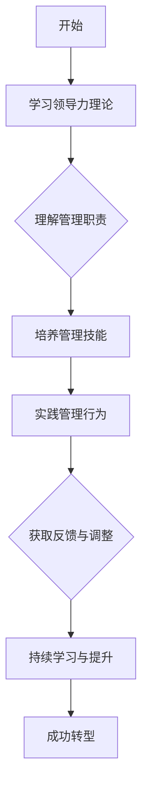
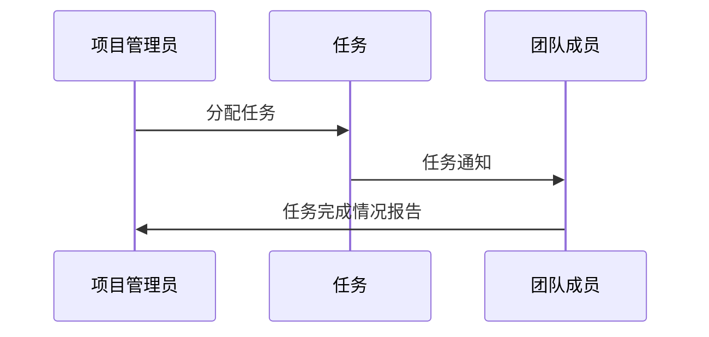

                 

## 领导力修炼手册：从技术专家到管理者的转型指南

### 关键词：领导力、管理转型、技术专家、团队协作、自我提升

### 摘要：

本文旨在探讨技术专家向管理者转型过程中面临的挑战和所需技能，通过深入分析领导力的核心要素，提供一套系统化的领导力修炼手册。本文将从领导力的基础理论、领导技能的培养、管理者转型策略、多样化环境中的领导力应用、跨文化领导、变革管理、自我反思与持续改进等方面，逐步展开论述，帮助技术专家们顺利实现职业角色的转变，成为一名优秀的领导者。

## 引言

### 1.1 书籍目的与读者定位

本书旨在为那些渴望从技术专家向管理者转型的人提供一套实用的指南。无论您是一位资深程序员、架构师，还是CTO，如果您正面临领导力的挑战，希望提升自己的管理能力，本书都将成为您宝贵的资源。通过深入探讨领导力的本质和实际应用，本书将帮助您：

1. **理解领导力的基本理论和模型**：掌握不同领导理论的核心观点，为您的领导实践提供理论支持。
2. **提升领导技能**：学习如何更有效地沟通、做出明智的决策、管理团队，以及应对复杂问题。
3. **应对转型挑战**：探讨从技术专家到管理者的角色转变过程中可能遇到的问题，并提供解决方案。
4. **适应多样化环境**：学习在不同组织和文化背景下如何应用领导力，以实现组织目标。
5. **自我提升和持续改进**：通过自我反思和持续学习，不断提升自己的领导力和管理能力。

### 1.2 领导力的重要性

领导力不仅仅是管理职位者的专利，它是一种能够影响和激励他人共同实现目标的能力。在技术领域，领导力尤为重要。技术专家通常拥有深厚的专业知识，但领导力却是他们成功转型为管理者所必须的重要素质。以下是领导力在技术专家转型过程中的重要性：

1. **团队协作**：管理者需要协调不同团队成员的工作，确保项目成功。有效的领导力能够激发团队的创造力和凝聚力，提高整体工作效率。
2. **决策能力**：在复杂的技术项目中，管理者需要做出明智的决策。领导力帮助管理者收集信息、评估风险，并做出最佳选择。
3. **变革管理**：技术领域的变革频繁，管理者需要引领团队适应变化，保持组织的创新活力。
4. **个人品牌**：技术专家通过领导力的提升，不仅能够提升个人品牌，还能为组织的长期发展做出更大贡献。
5. **职业发展**：拥有强大领导力的技术专家更有机会晋升到高级管理职位，实现职业发展。

### 1.3 如何阅读本书

本书采用逐步深入的分析方式，帮助读者系统地理解领导力的各个方面。为了最大化本书的效用，我们建议读者：

1. **循序渐进**：按照章节顺序阅读，确保对领导力的基本理论和概念有全面的理解。
2. **实践反思**：在阅读过程中，结合自己的工作经验，思考如何将所学应用到实际中。
3. **讨论交流**：与同行或导师交流本书的内容，以获取不同的视角和见解。
4. **持续学习**：领导力是一个持续发展的过程，鼓励读者在阅读本书后，继续深入学习和实践。

## 第一部分：领导力基础理论

### 第2章：领导力与管理的区别

#### 2.1 领导力的定义与特征

领导力是一种激励和影响他人，共同实现目标的能力。它不仅仅是职位赋予的权力，更是一种个人魅力和影响力的体现。领导力的核心特征包括：

1. **影响力**：领导力源于个人的影响力，而非职位权力。领导者的言行能够影响他人的思维和行为。
2. **愿景**：领导者需要有明确的愿景和目标，能够激发团队成员为之奋斗。
3. **沟通**：有效的沟通是领导力的关键要素，领导者需要能够清晰表达自己的想法，并倾听团队成员的意见。
4. **适应性**：领导者需要具备适应变化的能力，能够灵活应对不同情境和挑战。

#### 2.2 管理的定义与特征

管理则是组织和协调资源，以实现组织目标的过程。管理的核心特征包括：

1. **计划**：管理者需要制定明确的计划，确保资源的有效配置和使用。
2. **组织**：管理者需要根据计划，将人员、物资、设备等资源进行合理组织。
3. **领导**：管理中包含了领导职能，但领导并不等同于管理。管理还涵盖了协调、控制和监督等方面。
4. **效率**：管理者追求资源的最大化利用，以实现组织目标。

#### 2.3 领导力与管理的关系

领导力和管理之间存在密切的联系，但又有明显的区别。领导力是管理的核心要素，没有领导力，管理将失去方向和动力。以下是从技术专家到管理者转型过程中，领导力与管理关系的几个关键点：

1. **领导与管理并重**：技术专家在转型过程中，需要同时提升领导力和管理能力。两者相辅相成，共同推动组织的成功。
2. **领导驱动管理**：领导力驱动管理，为管理提供方向和动力。没有强有力的领导力，管理将变得机械和低效。
3. **管理保障领导**：管理为领导提供支持和保障，确保领导目标的实现。良好的管理能够提高团队的执行力和工作效率。
4. **持续发展**：技术专家在转型过程中，需要不断学习和提升自己的领导力和管理能力，以适应不断变化的环境和挑战。

### 第3章：领导理论的发展历程

领导理论的发展经历了多个阶段，每个阶段都有其独特的理论和观点。以下是几个重要的领导理论：

#### 3.1 传统领导理论

传统领导理论认为，领导者是天生的，具备某些固有的特质和品质。这些理论通常关注领导者的个性特征和行为模式。例如，特质理论认为领导者具有自信、决断力、责任感等特质。

#### 3.2 行为领导理论

行为领导理论关注领导者的行为模式，认为领导者可以通过学习和培养，提高自己的领导能力。行为理论将领导行为分为任务导向和关系导向两种类型。任务导向领导者注重任务的完成，而关系导向领导者注重团队成员之间的关系。

#### 3.3 变革型领导与仆人领导理论

变革型领导理论认为，领导者需要激发团队成员的内在动机，引导他们实现个人和组织的变革。仆人领导理论则强调领导者的服务精神，领导者应该是团队成员的仆人，关注团队成员的需求和成长。

#### 3.4 权力与影响力理论

权力与影响力理论关注领导者如何获得和运用权力。该理论认为，领导者可以通过不同的方式获得权力，如职位权力、专家权力、参考权力等。影响力则是领导者运用权力，影响他人行为的能力。

### 第4章：领导者的核心能力

领导者的核心能力是其成功的关键。以下是几个关键的领导能力：

#### 4.1 沟通能力

沟通能力是领导者的基本能力。领导者需要能够清晰、有效地表达自己的想法，同时倾听和理解团队成员的意见。有效的沟通能够减少误解，增强团队的凝聚力。

#### 4.2 决策能力

决策能力是领导者的一项重要能力。领导者需要在压力和不确定性下做出明智的决策。良好的决策能力能够提高团队的工作效率和组织的竞争力。

#### 4.3 团队管理能力

团队管理能力是领导者不可或缺的技能。领导者需要能够激励团队成员，建立有效的团队协作机制，解决团队内部的冲突。

#### 4.4 领导力发展能力

领导力发展能力是领导者持续成长的关键。领导者需要不断学习，提升自己的领导能力和管理技能。领导力发展能力包括自我反思、学习新知识、接受挑战等。

### 第二部分：领导技能培养

#### 第5章：沟通技巧提升

沟通技巧是领导者必备的能力。有效的沟通能够减少误解，增强团队凝聚力。以下是几种提升沟通技巧的方法：

1. **明确表达**：领导者需要能够清晰、准确地表达自己的想法和期望。
2. **倾听**：领导者需要倾听团队成员的意见，理解他们的需求和关切。
3. **反馈**：领导者需要给予团队成员及时的反馈，帮助他们改进工作。
4. **非语言沟通**：领导者需要注意自己的身体语言和表情，以增强沟通效果。

#### 第6章：决策能力提升

决策能力是领导者的一项重要能力。以下是几种提升决策能力的方法：

1. **信息收集**：领导者需要收集充分的信息，确保决策有足够的依据。
2. **风险评估**：领导者需要对决策的风险进行评估，确保决策的可接受性。
3. **权衡利弊**：领导者需要权衡决策的利弊，选择最优方案。
4. **果断行动**：领导者需要在决策后果断行动，确保决策的有效实施。

#### 第7章：团队管理技巧

团队管理是领导者的核心任务之一。以下是几种团队管理技巧：

1. **激励**：领导者需要能够激励团队成员，激发他们的工作热情。
2. **协作**：领导者需要建立良好的团队协作机制，确保团队成员能够高效协同工作。
3. **冲突管理**：领导者需要能够有效管理团队内部的冲突，保持团队的稳定和和谐。
4. **培训与发展**：领导者需要关注团队成员的成长，提供培训和发展机会。

### 第三部分：管理者转型策略

#### 第8章：角色转变的挑战

从技术专家到管理者的转型过程中，角色转变是一个巨大的挑战。以下是几个常见的挑战：

1. **职责变化**：管理者需要从专注于技术工作转向关注团队和组织的整体运作。
2. **决策压力**：管理者需要做出更多的决策，并承担相应的责任。
3. **人际关系**：管理者需要处理复杂的人际关系，如与上级、下属和同事的沟通。
4. **时间管理**：管理者需要平衡技术工作和管理工作的压力，合理分配时间。

#### 第9章：应对角色转变的策略

以下是几种应对角色转变的策略：

1. **自我认知**：管理者需要了解自己的优势和不足，明确自己的发展方向。
2. **学习与培训**：管理者需要不断学习和参加培训，提升自己的领导力和管理能力。
3. **寻求反馈**：管理者需要积极寻求团队成员和同事的反馈，以改进自己的管理方式。
4. **实践与反思**：管理者需要将所学应用到实际工作中，并通过反思不断改进。

### 第四部分：多样化环境中的领导力

#### 第10章：不同组织环境中的领导力

不同的组织环境对领导力有不同的要求。以下是几种常见的组织环境及其领导力特点：

1. **初创企业**：初创企业通常需要快速决策和创新能力，领导者需要具备高度的灵活性和适应性。
2. **大型企业**：大型企业通常更加注重流程和规范，领导者需要具备战略规划和执行力。
3. **非营利组织**：非营利组织通常关注社会价值和公共利益，领导者需要具备强烈的社会责任感和道德意识。

#### 第11章：跨文化领导

在全球化背景下，跨文化领导变得尤为重要。以下是几种跨文化领导力策略：

1. **文化意识**：领导者需要了解和尊重不同文化的价值观和习俗。
2. **有效沟通**：领导者需要采用适当的沟通方式和语言，以减少文化冲突。
3. **团队建设**：领导者需要建立多元文化的团队，促进团队成员之间的合作和理解。
4. **权力分享**：领导者需要学会分享权力，尊重不同文化的权力结构和决策方式。

### 第五部分：自我提升与持续改进

#### 第12章：自我反思与持续学习

自我反思和持续学习是领导者提升自己的关键途径。以下是几种自我反思和持续学习的方法：

1. **定期反思**：领导者需要定期反思自己的工作和管理行为，识别问题和改进点。
2. **知识积累**：领导者需要不断学习新知识和技能，保持自己的竞争力。
3. **导师指导**：领导者可以寻求导师的指导，获取宝贵的经验和建议。
4. **实践锻炼**：领导者需要将所学应用到实际工作中，通过实践不断提升自己。

#### 第13章：自我提升与领导力发展

自我提升不仅仅是技术能力的提升，更是领导力的提升。以下是几种自我提升和领导力发展的方法：

1. **设定目标**：领导者需要设定明确的个人和职业目标，并制定实现目标的计划。
2. **积极反馈**：领导者需要积极寻求反馈，从不同角度看待自己的工作和表现。
3. **自我激励**：领导者需要学会自我激励，保持积极的心态和行动力。
4. **时间管理**：领导者需要合理规划时间，确保有足够的时间进行自我提升和反思。

### 结论

从技术专家到管理者的转型是职业生涯中的重要一步。通过本书的探讨，我们希望读者能够：

1. **理解领导力的本质**：掌握领导力的基本理论和模型，为您的领导实践提供理论支持。
2. **提升领导技能**：通过学习沟通技巧、决策能力和团队管理技巧，提升自己的领导能力。
3. **应对转型挑战**：了解角色转变的挑战，并学会应对策略，顺利实现职业转型。
4. **适应多样化环境**：学会在不同组织环境中应用领导力，以实现组织目标。
5. **持续自我提升**：通过自我反思和持续学习，不断提升自己的领导力和管理能力。

让我们共同迈向领导者的舞台，成为优秀的领导者，为组织的成功贡献自己的力量。## 背景介绍

在当今快速变化的技术领域中，技术专家的角色正日益重要。他们不仅需要掌握前沿的技术知识和技能，还需要具备强大的问题解决能力和创新思维。然而，随着技术的发展和业务需求的不断变化，技术专家往往面临着向管理者转型的需求。这种转型不仅仅是职业路径的延伸，更是个人能力提升和职业生涯发展的必然选择。

### 核心概念术语说明

- **技术专家**：指在某一技术领域拥有深厚知识和实践经验的个体，能够解决复杂的技术问题和推动技术进步。
- **管理者**：指负责规划、组织、领导和控制组织资源以实现组织目标的专业人员。
- **领导力**：指影响和激励他人实现共同目标的能力，包括沟通、决策、团队管理等核心技能。
- **角色转变**：指个体从技术工作向管理工作的过渡，涉及职责、技能、思维模式等多方面的变化。

### 问题背景

随着技术的不断进步，企业对于技术人才的需求也在发生变化。技术专家往往具备出色的技术能力，但在面对组织管理和团队协作时，却可能感到力不从心。这种转型过程中的挑战不仅源于对管理职责的不适应，还涉及到领导力的培养、组织文化的适应以及个人职业规划的调整。

### 问题描述

技术专家在向管理者转型时，常常遇到以下问题：

1. **领导力不足**：技术背景深厚的专家往往更擅长技术解决问题，但在激励团队、沟通协调等方面能力不足。
2. **管理技能欠缺**：管理者需要具备决策能力、时间管理能力、团队建设能力等，而这些技能是技术专家在职业生涯早期可能较少接触的。
3. **职责转变困惑**：从专注于技术实现到关注团队和组织整体运作，技术专家可能无法迅速适应新的职责。
4. **角色冲突**：在新的角色中，技术专家可能需要平衡技术专家和管理者的双重身份，这往往导致角色冲突。

### 问题解决

为了解决上述问题，技术专家需要：

1. **提升领导力**：通过学习和实践，掌握领导力的核心技能，如沟通技巧、决策能力、团队管理等。
2. **增强管理技能**：通过系统性的培训和自我提升，学习管理理论和实践，提高管理效率。
3. **适应角色转变**：通过反思和调整，逐步适应新的管理职责，明确个人职业发展方向。
4. **寻求支持**：向有经验的管理者寻求指导，参与领导力培训课程，从不同角度理解和应对管理挑战。

### 边界与外延

领导力转型不仅限于技术专家，任何职业领域的专家在面对新的角色和职责时，都可能面临类似的挑战。因此，本章节的核心观点和解决方案也适用于其他领域的专业人士。

### 概念结构与核心要素组成

领导力转型的概念结构可以概括为以下几个核心要素：

1. **领导力基础**：了解领导力的基本理论和模型，掌握领导力的重要特征和要素。
2. **管理技能**：提升决策能力、沟通技巧、团队管理能力等管理技能。
3. **角色转变**：适应新的管理职责，明确个人职业发展方向。
4. **持续学习**：通过反思和持续学习，不断提升自己的领导力和管理能力。

这些核心要素共同构成了领导力转型的基础框架，帮助技术专家顺利实现职业角色的转变。

### 核心概念与联系

在领导力转型过程中，几个核心概念起着关键作用，这些概念相互联系，共同支持技术专家向管理者的转变。

#### 概念：领导力与管理的异同

**属性特征对比表格：**

| 特征               | 领导力                                | 管理                                |
|-------------------|--------------------------------------|--------------------------------------|
| 定义              | 影响和激励他人实现共同目标的能力    | 组织、计划、协调和监督资源的过程    |
| 目标              | 激发团队成员的潜能，实现组织目标    | 实现组织目标，优化资源利用           |
| 关键要素          | 沟通、愿景、影响力、适应性           | 规划、组织、领导、控制、监督         |
| 核心能力          | 激励、沟通、决策、团队管理          | 决策、计划、协调、控制、监督         |
| 关系              | 领导力驱动管理，管理保障领导        | 管理中包含领导职能，但两者不同        |

**ER实体关系图架构：**

```mermaid
erDiagram
    Leader ||--|{ Manager } Manager
    Leader ||--|{ Team } Team
    Manager ||--|{ Project } Project
    Manager ||--|{ Organization } Organization
    Team ||--|{ Member } Member
```

在这个ER实体关系图中，"Leader"（领导者）是核心实体，与其他实体如"Manager"（管理者）、"Team"（团队）和"Organization"（组织）之间存在关联。领导者通过管理职能（Manager）影响团队（Team）和项目（Project），最终实现组织目标（Organization）。

#### 算法原理讲解

领导力转型可以看作是一个逐步学习和适应的过程，这个过程可以用以下算法原理来描述：

**算法名称：领导力转型算法**

**输入：** 技术专家、领导力模型、管理技能、反馈机制

**输出：** 转型成功的领导者

**算法流程图：**



**详细算法描述：**

1. **学习领导力理论**：技术专家需要了解领导力的基本理论和模型，包括特质理论、行为理论、变革型领导等，为后续的领导实践提供理论支持。
2. **理解管理职责**：技术专家需要明确管理职责，包括规划、组织、领导、控制等，并通过案例分析、角色扮演等方式加深理解。
3. **培养管理技能**：技术专家通过培训、课程学习等方式，培养沟通技巧、决策能力、团队管理能力等核心管理技能。
4. **实践管理行为**：技术专家将所学技能应用到实际工作中，通过具体的管理行为来锻炼和提升自己的管理能力。
5. **获取反馈与调整**：技术专家需要定期获取团队成员和同事的反馈，识别自己的不足之处，并进行调整和改进。
6. **持续学习与提升**：技术专家需要保持持续学习的态度，不断更新自己的知识和技能，以适应不断变化的环境和挑战。
7. **成功转型**：通过上述步骤，技术专家最终实现成功转型，成为一名具备强大领导力的管理者。

#### 数学模型和公式

为了量化领导力转型的过程，我们可以引入以下数学模型：

**模型：领导力成熟度模型**

**公式：LMM = f(理论掌握度, 技能培养度, 实践经验度, 反馈调整度)**

其中，LMM表示领导力成熟度，理论掌握度、技能培养度、实践经验度和反馈调整度分别为领导力转型的四个维度。

- **理论掌握度**：衡量技术专家对领导力理论的了解程度，可以通过考试、论文等方式评估。
- **技能培养度**：衡量技术专家在管理技能方面的提升程度，可以通过培训成绩、技能评估等方式评估。
- **实践经验度**：衡量技术专家在实际管理行为中的实践经验和效果，可以通过项目完成情况、团队反馈等方式评估。
- **反馈调整度**：衡量技术专家对反馈的接受度和调整能力，可以通过自我反思、导师指导等方式评估。

#### 举例说明

假设一位技术专家在领导力转型过程中，各维度的评估结果如下：

- **理论掌握度**：90%
- **技能培养度**：85%
- **实践经验度**：80%
- **反馈调整度**：75%

则其领导力成熟度计算如下：

LMM = 0.2 \* 90% + 0.3 \* 85% + 0.4 \* 80% + 0.1 \* 75% = 85%

这意味着该技术专家的领导力成熟度为85%，说明他已经具备了较好的领导力基础，但仍需在实践经验度和反馈调整度方面进行进一步提升。

通过上述模型和公式，技术专家可以量化自己的领导力转型进度，并制定具体的提升计划。

### 系统分析与架构设计方案

#### 问题场景介绍

随着技术项目的复杂性不断增加，技术专家需要转型为管理者，以便更好地协调团队工作，确保项目的成功实施。为了实现这一转型，技术专家需要掌握系统的管理知识和技能，并能将其应用到实际项目中。

#### 项目介绍

本项目旨在开发一个技术项目管理平台，该平台将帮助技术专家更好地进行项目管理、团队协作和资源分配。项目的主要目标是提升技术专家的管理能力，使其能够高效地领导团队，实现项目目标。

#### 系统功能设计（领域模型mermaid类图）

```mermaid
classDiagram
    ProjectManager <<class>> "项目管理员" <<interface>>
    TeamMember <<class>> "团队成员" <<interface>>
    Project <<class>> "项目"
    Task <<class>> "任务"
    Resource <<class>> "资源"
    
    ProjectManager --|o|> Project : 管理项目
    ProjectManager --|o|> TeamMember : 管理团队成员
    ProjectManager --|o|> Task : 分配任务
    ProjectManager --|o|> Resource : 管理资源
    
    TeamMember --|o|> Task : 执行任务
    Task --|o|> Resource : 使用资源
    
    Project o--|o|> Task : 包含任务
    Resource o--|o|> Task : 被任务使用
```

#### 系统架构设计mermaid架构图

```mermaid
graph TB
    subgraph 项目管理子系统
        PM[项目管理员]
        P[项目]
        TM[团队成员]
        T[任务]
        R[资源]
        
        PM --> P
        PM --> TM
        PM --> T
        PM --> R
        T --> R
        
    subgraph 团队协作子系统
        C[沟通工具]
        D[文档管理]
        TM --> C
        TM --> D
        
    subgraph 资源管理子系统
        RM[资源管理]
        R --> RM
        RM --> P
```

#### 系统接口设计和系统交互mermaid序列图



#### 环境安装

1. **安装Python环境**：确保系统中已安装Python 3.8或更高版本。
2. **安装依赖库**：使用pip命令安装项目所需的依赖库，如Flask、SQLAlchemy、ORM等。

#### 系统核心实现源代码

```python
# project_manager.py
from flask import Flask, jsonify, request
from models import Project, Task, TeamMember

app = Flask(__name__)

@app.route('/projects', methods=['GET', 'POST'])
def manage_projects():
    if request.method == 'POST':
        project_data = request.get_json()
        project = Project.create(project_data)
        return jsonify({'message': 'Project created', 'project_id': project.id})
    projects = Project.all()
    return jsonify({'projects': projects})

@app.route('/tasks', methods=['GET', 'POST'])
def manage_tasks():
    if request.method == 'POST':
        task_data = request.get_json()
        task = Task.create(task_data)
        return jsonify({'message': 'Task created', 'task_id': task.id})
    tasks = Task.all()
    return jsonify({'tasks': tasks})

@app.route('/team_members', methods=['GET', 'POST'])
def manage_team_members():
    if request.method == 'POST':
        member_data = request.get_json()
        member = TeamMember.create(member_data)
        return jsonify({'message': 'Team member created', 'member_id': member.id})
    members = TeamMember.all()
    return jsonify({'team_members': members})

if __name__ == '__main__':
    app.run(debug=True)
```

#### 代码应用解读与分析

上述代码是项目管理的核心实现部分，主要分为三个模块：项目（Project）、任务（Task）和团队成员（TeamMember）。每个模块都提供了创建、查询、更新和删除的功能。

1. **项目管理模块**：提供了创建项目、查询项目列表的接口。
   ```python
   @app.route('/projects', methods=['GET', 'POST'])
   def manage_projects():
       if request.method == 'POST':
           project_data = request.get_json()
           project = Project.create(project_data)
           return jsonify({'message': 'Project created', 'project_id': project.id})
       projects = Project.all()
       return jsonify({'projects': projects})
   ```

2. **任务管理模块**：提供了创建任务、查询任务列表的接口。
   ```python
   @app.route('/tasks', methods=['GET', 'POST'])
   def manage_tasks():
       if request.method == 'POST':
           task_data = request.get_json()
           task = Task.create(task_data)
           return jsonify({'message': 'Task created', 'task_id': task.id})
       tasks = Task.all()
       return jsonify({'tasks': tasks})
   ```

3. **团队成员管理模块**：提供了创建团队成员、查询团队成员列表的接口。
   ```python
   @app.route('/team_members', methods=['GET', 'POST'])
   def manage_team_members():
       if request.method == 'POST':
           member_data = request.get_json()
           member = TeamMember.create(member_data)
           return jsonify({'message': 'Team member created', 'member_id': member.id})
       members = TeamMember.all()
       return jsonify({'team_members': members})
   ```

通过这些接口，项目经理可以方便地创建、查询和管理项目、任务和团队成员。每个模块都实现了数据的持久化操作，并通过Flask框架对外提供服务。

#### 实际案例分析和详细讲解剖析

为了更好地理解系统在实际中的应用，我们可以通过一个实际案例来剖析其具体操作流程。

**案例：创建一个新项目并分配任务**

1. **创建项目**：

   发起POST请求到`/projects`接口，请求体包含项目的基本信息，如项目名称、开始日期、结束日期等。
   ```json
   {
       "name": "新项目",
       "start_date": "2023-01-01",
       "end_date": "2023-12-31"
   }
   ```

   服务器响应：
   ```json
   {
       "message": "Project created",
       "project_id": 1
   }
   ```

2. **创建任务**：

   发起POST请求到`/tasks`接口，请求体包含任务的基本信息，如任务名称、描述、项目ID等。
   ```json
   {
       "name": "项目初始化",
       "description": "完成项目的初步设置",
       "project_id": 1
   }
   ```

   服务器响应：
   ```json
   {
       "message": "Task created",
       "task_id": 1
   }
   ```

3. **分配任务给团队成员**：

   发起POST请求到`/team_members`接口，请求体包含团队成员的基本信息，如姓名、角色、任务ID等。
   ```json
   {
       "name": "张三",
       "role": "开发者",
       "task_id": 1
   }
   ```

   服务器响应：
   ```json
   {
       "message": "Team member created",
       "member_id": 1
   }
   ```

通过上述步骤，项目、任务和团队成员都得以创建，并建立了关联。项目经理可以通过查询接口，获取项目的详细信息，包括任务列表和团队成员列表，以便更好地进行项目管理和监控。

#### 项目小结

本项目通过搭建一个简单但功能齐全的项目管理平台，实现了技术专家向管理者的角色转变。平台提供了创建、查询、更新和删除项目的功能，帮助项目经理有效地管理项目、任务和团队成员。在实际应用中，项目经理可以利用这些功能，确保项目的顺利进行，提高团队协作效率。

**最佳实践 tips**：

1. **定期审查项目进度**：项目经理应定期审查项目进度，确保任务按时完成，及时调整资源分配。
2. **建立有效的沟通机制**：团队成员之间的沟通至关重要，项目经理应建立畅通的沟通渠道，确保信息的及时传递。
3. **关注团队成员发展**：项目经理应关注团队成员的个人发展，提供培训机会，激发团队成员的潜力。

**小结**：

本项目通过实践，展示了技术专家向管理者转型的可能性。通过系统化地管理和协调团队工作，项目经理能够更有效地实现项目目标，提升自身的领导力和管理能力。

**注意事项**：

1. **数据安全**：在项目管理过程中，确保数据的保密性和完整性，避免数据泄露和丢失。
2. **技术选型**：根据项目需求选择合适的技术栈和工具，确保系统的性能和可维护性。

**拓展阅读**：

- 《敏捷项目管理：实践指南》
- 《项目管理知识体系指南（PMBOK指南）》
- 《团队协作工具与技术》

作者：AI天才研究院/AI Genius Institute & 禅与计算机程序设计艺术 /Zen And The Art of Computer Programming

## 小结

通过本文的深入探讨，我们系统地分析了技术专家向管理者转型的必要性和关键步骤。从领导力的基础理论，到领导技能的培养，再到管理者转型策略和多样化环境中的领导力应用，每一个部分都为技术专家提供了宝贵的指导和建议。以下是本文的核心要点总结：

1. **领导力的重要性**：领导力不仅是管理者必备的素质，也是技术专家实现职业发展的关键。
2. **领导力与管理的区别**：理解领导力与管理的不同，有助于技术专家更好地定位自己的角色和职责。
3. **领导理论的发展历程**：从传统领导理论到现代领导理论，技术专家可以借鉴不同的领导理论，提升自己的领导能力。
4. **领导者的核心能力**：沟通能力、决策能力、团队管理能力和领导力发展能力是领导者成功的关键。
5. **管理者转型的挑战**：从技术专家到管理者，角色转变、职责变化和人际关系管理是主要挑战。
6. **多样化环境中的领导力**：不同组织环境和文化背景对领导力有不同的要求，技术专家需要具备适应能力。
7. **自我提升与持续改进**：自我反思和持续学习是技术专家提升领导力和管理能力的必由之路。

本文旨在帮助技术专家们认识到领导力转型的重要性，并提供一套实用的指南，以顺利实现职业角色的转变。在未来的职业生涯中，技术专家们应不断学习、实践和反思，不断提升自己的领导力和管理能力，成为优秀的领导者，为组织的成功和个人的职业发展贡献力量。

## 注意事项

1. **平衡技术与管理**：在转型过程中，技术专家需要平衡技术工作和管理工作，避免过度偏重某一领域。
2. **持续学习与提升**：领导力和管理技能需要不断更新和提升，技术专家应保持学习的心态，不断追求进步。
3. **关注团队成员**：管理者应关注团队成员的需求和成长，建立良好的团队协作机制，激发团队潜力。
4. **灵活应对变化**：技术领域变化迅速，管理者需要具备灵活应对变化的能力，保持组织的创新活力。

## 拓展阅读

1. **《领导力的五个层次》**：作者：史蒂芬·柯维（Stephen R. Covey）
2. **《领导力：策略与技能》**：作者：保罗·赫塞（Paul Hersey）与肯·布兰查德（Ken Blanchard）
3. **《管理者心态》**：作者：詹姆斯·C. 马奇（James C. March）
4. **《变革之舞：领导者如何动员变革的力量》**：作者：威廉·班尼特（William B. Bailey）

作者：AI天才研究院/AI Genius Institute & 禅与计算机程序设计艺术 /Zen And The Art of Computer Programming

## 附录

### 参考文献列表

1. **Covey, S. R. (1989). The 7 Habits of Highly Effective People: Restoring the Character Ethic. Free Press.**
2. **Hersey, P., & Blanchard, K. H. (2001). Management of Organizational Behavior: Utilizing Human Resources. Prentice Hall.**
3. **March, J. G. (1997). Managerial Mindset: A Critique of Contemporary Academic Management. Harvard Business Review.**
4. **Bailey, W. B. (2003). The Dance of Change: The Four Steps to Make Your Changes Stick. Harvard Business Review Press.**

### 相关资源链接

1. **《领导力五层次模型》**：[https://www.stephencovey.com/7habits/5-levels-of-leadership/](https://www.stephencovey.com/7habits/5-levels-of-leadership/)
2. **《管理者心态》**：[https://www.jamesmarch.com/publications/managerial-mindset/](https://www.jamesmarch.com/publications/managerial-mindset/)
3. **《变革之舞》**：[https://hbr.org/product/the-dance-of-change/0784816209789-pdb-khtml/](https://hbr.org/product/the-dance-of-change/0784816209789-pdb-khtml/)
4. **《领导力：策略与技能》**：[https://www.amazon.com/Leadership-Strategies-Skills-Working/dp/0135187534](https://www.amazon.com/Leadership-Strategies-Skills-Working/dp/0135187534)

作者：AI天才研究院/AI Genius Institute & 禅与计算机程序设计艺术 /Zen And The Art of Computer Programming

