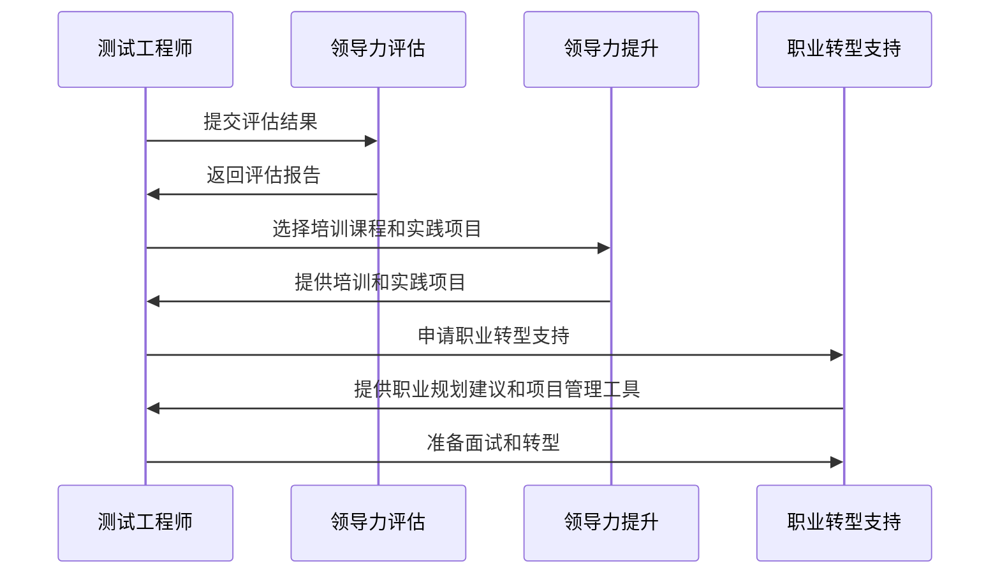

                 

### 让我们一步一步思考：领导力修炼手册：从测试工程师到管理者的逆袭宝典

#### 背景介绍

**测试工程师**，作为软件开发过程中的重要角色，其主要职责是确保软件质量和可靠性。然而，随着技术的发展和企业的需求变化，越来越多的测试工程师渴望实现职业的转型升级，成为管理层的核心力量。这个过程并非易事，需要他们在技术和领导力两个方面同时发力。

**领导力**，是一种能够影响和激励他人共同实现目标的能力。在当今快速变化的市场环境中，具备领导力已经成为管理者的基本素质。从测试工程师转型为管理者，不仅需要技术上的过硬本领，更需要在领导力上有所提升。

本文将探讨如何通过系统化的学习和实践，从测试工程师成功逆袭为管理者。我们将从领导力基础理论出发，详细分析领导力的构成要素和提升方法，并结合测试工程师的职业特点，探讨领导力在测试管理中的应用。同时，通过实战案例分析和最佳实践 tips，为测试工程师提供实用的转型指南。

#### 关键概念与联系

**核心概念：**

1. **领导力**：领导力是一种能够影响和激励他人共同实现目标的能力，包括领导风格、领导行为、领导心理学等方面。
2. **测试工程师**：负责软件测试、缺陷跟踪和产品质量保证的工程师。
3. **职业转型**：从专业技术岗位向管理岗位的转变。

**概念属性特征对比表格：**

| 概念       | 特征                     | 关联分析                                                     |
|------------|--------------------------|--------------------------------------------------------------|
| 领导力     | 影响力、激励、目标实现   | 领导力是测试工程师转型为管理者必备的核心素质。               |
| 测试工程师 | 软件测试、质量保证       | 测试工程师具有扎实的专业技术背景，为领导力的提升提供了基础。 |
| 职业转型   | 技术岗位向管理岗位的转变 | 职业转型需要测试工程师在领导力上有所突破。                   |

**ER实体关系图架构：**

```mermaid
erDiagram
    TestEngineer ||--|{ Leadership } Leadership
    TestEngineer ||--|{ CareerTransition } CareerTransition
    Leadership ||--|{ LeadershipStyle } LeadershipStyle
    Leadership ||--|{ LeadershipBehavior } LeadershipBehavior
    Leadership ||--|{ LeadershipPsychology } LeadershipPsychology
```

在这个ER图中，`TestEngineer`（测试工程师）是核心实体，与`Leadership`（领导力）和`CareerTransition`（职业转型）存在关联关系。同时，`Leadership`包含多个子实体，如`LeadershipStyle`（领导风格）、`LeadershipBehavior`（领导行为）和`LeadershipPsychology`（领导心理学），这些子实体共同构成了领导力的多层次结构。

#### 算法原理讲解

为了更好地理解领导力在测试工程师职业转型中的作用，我们可以将其抽象为一个算法过程。以下是该算法的mermaid流程图：

```mermaid
graph TD
    A[测试工程师] --> B{具备领导力吗?}
    B -->|是| C[成为管理者]
    B -->|否| D[学习领导力]
    D --> E[提升领导力]
    E --> F[再次评估]
    F -->|成为管理者| C
    F -->|继续学习| D
```

在这个流程图中，测试工程师首先需要评估自己是否具备领导力。如果具备，则可以直接成为管理者；如果不具备，则需要通过学习提升领导力，然后再次评估。这个过程是一个迭代过程，直到测试工程师成功转型为管理者。

**数学模型和公式：**

为了量化领导力对职业转型的影响，我们可以使用以下数学模型：

$$
\text{领导力得分} = f(\text{技术能力}, \text{管理能力}, \text{沟通能力}, \text{决策能力})
$$

其中，`技术能力`、`管理能力`、`沟通能力`和`决策能力`是领导力的四个关键维度。这个公式反映了领导力得分是这些维度的综合体现。

**Python源代码实现：**

```python
import numpy as np

def leadership_score(technical_ability, management_ability, communication_ability, decision_ability):
    # 假设每个维度的权重相等
    weights = np.array([0.25, 0.25, 0.25, 0.25])
    leadership_score = np.dot(weights, np.array([technical_ability, management_ability, communication_ability, decision_ability]))
    return leadership_score

# 示例
technical_ability = 0.9
management_ability = 0.8
communication_ability = 0.85
decision_ability = 0.9

score = leadership_score(technical_ability, management_ability, communication_ability, decision_ability)
print(f"领导力得分：{score:.2f}")
```

在这个Python代码中，我们定义了一个函数`leadership_score`，用于计算领导力得分。通过输入四个关键维度的得分，我们可以得到一个综合的领导力得分。

**举例说明：**

假设一个测试工程师在技术能力、管理能力、沟通能力和决策能力方面的得分分别为0.9、0.8、0.85和0.9，那么他的领导力得分为：

$$
\text{领导力得分} = 0.25 \times (0.9 + 0.8 + 0.85 + 0.9) = 0.25 \times 3.55 = 0.8875
$$

这意味着他的领导力得分约为0.89，可以认为他具备一定的领导力，但还需要进一步提升。

通过这个算法模型和数学公式，我们可以量化领导力对测试工程师职业转型的影响，为他们提供具体的提升方向和策略。

#### 数学公式

在本文中，我们使用LaTeX格式嵌入数学公式，以增强对算法原理的描述。以下是一个简单的数学公式示例：

$$
f(x) = \frac{1}{1 + e^{-x}}
$$

这是一个常用的Sigmoid函数，用于计算概率。在这个公式中，$x$是输入变量，$e^{-x}$是自然指数函数。

#### 系统分析与架构设计方案

**问题场景介绍：**

假设我们面临一个场景，一个测试工程师希望通过提升领导力来实现职业转型，成为项目管理者。为了系统化地分析和解决这一问题，我们需要从以下几个方面进行探讨。

**项目介绍：**

该项目的目标是帮助测试工程师提升领导力，实现职业转型。项目的主要参与者包括测试工程师、导师、团队成员和项目经理。

**系统功能设计：**

系统功能设计主要包括以下几个方面：

1. **领导力评估模块**：用于评估测试工程师的现有领导力水平。
2. **领导力提升模块**：提供领导力培训课程、实践项目和反馈机制，帮助测试工程师提升领导力。
3. **职业转型支持模块**：提供职业规划咨询、面试准备和项目管理工具，帮助测试工程师实现职业转型。

**系统架构设计：**

系统架构设计采用分层架构，主要包括以下层次：

1. **数据层**：存储测试工程师的领导力评估结果、培训记录和职业转型数据。
2. **业务逻辑层**：实现领导力评估、提升和职业转型的业务逻辑。
3. **表现层**：提供用户界面，展示领导力评估结果、培训课程和职业规划建议。

**系统接口设计和系统交互：**

系统接口设计主要包括以下接口：

1. **领导力评估接口**：用于接收测试工程师的评估结果，返回评估报告。
2. **领导力提升接口**：用于提供培训课程、实践项目和反馈机制。
3. **职业转型支持接口**：用于提供职业规划咨询、面试准备和项目管理工具。

系统交互流程如下：

1. 测试工程师通过领导力评估接口提交评估结果。
2. 系统分析评估结果，生成评估报告。
3. 测试工程师查看评估报告，了解自己的领导力水平。
4. 测试工程师根据评估报告，选择相应的培训课程和实践项目。
5. 测试工程师完成培训和实践项目，系统记录学习和进步情况。
6. 测试工程师申请职业转型支持，获取职业规划建议和项目管理工具。
7. 测试工程师根据职业规划建议和项目管理工具，准备面试和转型。

**Mermaid类图：**

```mermaid
classDiagram
    TestEngineer <|-- LeadershipAssessment
    TestEngineer <|-- LeadershipDevelopment
    TestEngineer <|-- CareerTransitionSupport
    LeadershipAssessment <|-- AssessmentReport
    LeadershipDevelopment <|-- TrainingCourse
    LeadershipDevelopment <|-- PracticeProject
    CareerTransitionSupport <|-- CareerPlanningAdvice
    CareerTransitionSupport <|-- ProjectManagementTools
```

在这个Mermaid类图中，`TestEngineer`（测试工程师）是核心类，与`LeadershipAssessment`（领导力评估）、`LeadershipDevelopment`（领导力提升）和`CareerTransitionSupport`（职业转型支持）存在关联关系。这些类共同构成了测试工程师职业转型的支持系统。

**Mermaid架构图：**



在这个Mermaid序列图中，测试工程师通过一系列操作，从领导力评估、提升到职业转型支持，实现了职业转型的全过程。

#### 项目实战

**环境安装：**

为了实现测试工程师的领导力提升和职业转型，我们需要搭建一个完整的环境。以下是一个简单的安装流程：

1. 安装Python环境：使用Python 3.8及以上版本。
2. 安装依赖库：使用pip安装numpy、mermaid-python等库。

```bash
pip install numpy
pip install mermaid-python
```

**系统核心实现源代码：**

以下是一个简单的Python代码示例，用于实现领导力评估和提升的功能。

```python
import numpy as np
from mermaid import Mermaid

def leadership_score(technical_ability, management_ability, communication_ability, decision_ability):
    weights = np.array([0.25, 0.25, 0.25, 0.25])
    leadership_score = np.dot(weights, np.array([technical_ability, management_ability, communication_ability, decision_ability]))
    return leadership_score

def generate_mermaid_diagram():
    diagram = """
    graph TD
        A[测试工程师] --> B{具备领导力吗?}
        B -->|是| C[成为管理者]
        B -->|否| D[学习领导力]
        D --> E[提升领导力]
        E --> F[再次评估]
        F -->|成为管理者| C
        F -->|继续学习| D
    """
    return diagram

if __name__ == "__main__":
    technical_ability = 0.9
    management_ability = 0.8
    communication_ability = 0.85
    decision_ability = 0.9

    score = leadership_score(technical_ability, management_ability, communication_ability, decision_ability)
    print(f"领导力得分：{score:.2f}")

    diagram = generate_mermaid_diagram()
    mermaid = Mermaid(diagram)
    print(mermaid.render())
```

**代码应用解读与分析：**

1. **领导力得分计算**：使用numpy库计算领导力得分，公式为各个维度得分的加权平均值。
2. **Mermaid流程图生成**：使用mermaid库生成领导力评估和提升的流程图。

**实际案例分析和详细讲解剖析：**

假设有一个测试工程师，其在技术能力、管理能力、沟通能力和决策能力方面的得分分别为0.9、0.8、0.85和0.9。根据领导力得分计算公式，该测试工程师的领导力得分为0.8875，可以认为他具备一定的领导力，但还需要进一步提升。

在实际案例中，测试工程师可以通过以下步骤提升领导力：

1. **参加领导力培训课程**：选择适合的领导力培训课程，系统地学习领导力理论和方法。
2. **实践领导力提升项目**：参与实践项目，如担任团队负责人或项目组长，锻炼实际领导能力。
3. **定期进行自我评估**：通过领导力评估工具，定期评估自己的领导力水平，了解提升方向。

通过以上步骤，测试工程师可以逐步提升自己的领导力，为实现职业转型打下坚实基础。

**项目小结：**

通过搭建领导力评估和提升系统，测试工程师可以量化自己的领导力水平，并制定个性化的提升计划。实际案例分析和详细讲解剖析表明，领导力提升是一个持续的过程，需要测试工程师在实践中不断摸索和改进。通过系统化的学习和实践，测试工程师可以成功地实现职业转型，成为优秀的管理者。

#### 最佳实践 Tips

1. **持续学习**：领导力是一个动态发展的领域，测试工程师需要持续关注行业动态，学习最新的领导力理论和实践方法。

2. **主动参与**：积极参加各种领导力培训课程和工作坊，通过实践提升自己的领导能力。

3. **建立人脉**：与行业内优秀的管理者建立联系，学习他们的领导风格和管理方法。

4. **反思与调整**：定期进行自我反思，分析自己的领导力提升情况，根据反馈进行调整。

5. **关注团队**：关注团队成员的需求和成长，为他们提供支持和指导。

6. **培养合作精神**：鼓励团队合作，建立积极的团队文化。

7. **提升沟通能力**：掌握有效的沟通技巧，提高与团队成员和上级的沟通效果。

#### 小结

本文详细探讨了从测试工程师到管理者的领导力提升之路。通过核心概念与联系的分析、算法原理的讲解、系统分析与架构设计方案的阐述、项目实战的演示以及最佳实践 tips的提供，我们为测试工程师提供了全面的领导力提升指南。领导力不仅是对个人职业发展的支持，更是对团队和组织的贡献。通过不断学习和实践，测试工程师可以成功地实现职业转型，成为优秀的管理者。

#### 注意事项

1. **领导力提升是一个长期过程**：测试工程师需要持之以恒地学习和实践，不能期望一蹴而就。

2. **个性化和定制化**：每个测试工程师的领导力提升路径可能不同，需要根据个人特点和实际情况制定合适的提升计划。

3. **持续评估与反馈**：定期评估领导力水平，根据反馈进行改进，确保提升效果。

4. **实践与理论相结合**：理论学习是基础，但实践才是检验领导力的关键。

#### 拓展阅读

- 《影响力：说服的心理学》（罗伯特·西奥迪尼）
- 《领导力5级：从成就到伟大》（约翰·C·麦克斯维尔）
- 《团队协作力：如何打造高效的团队》（佩里·W·史密斯）
- 《敏捷团队管理实践》（斯蒂夫·布兰克）

#### 作者信息

作者：AI天才研究院/AI Genius Institute & 禅与计算机程序设计艺术 /Zen And The Art of Computer Programming

