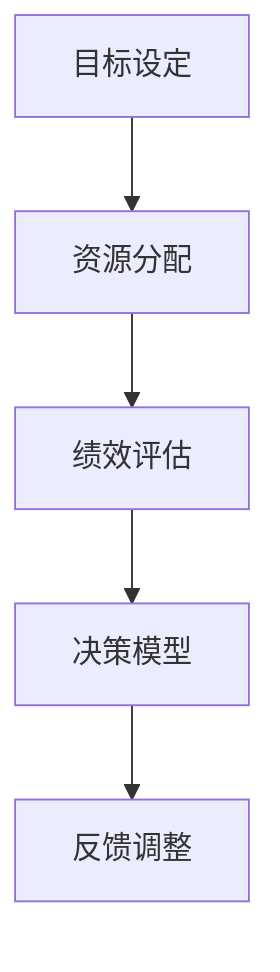
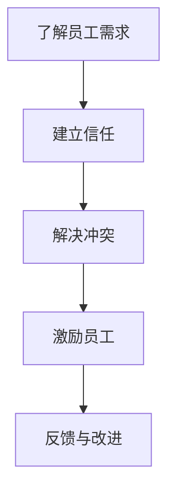
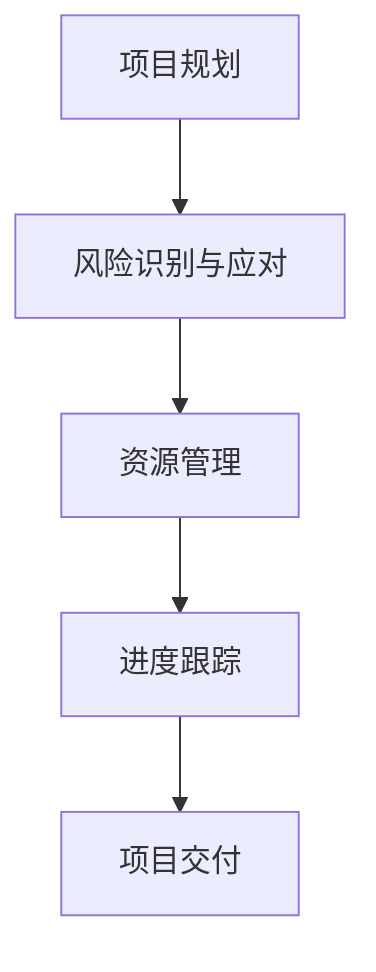
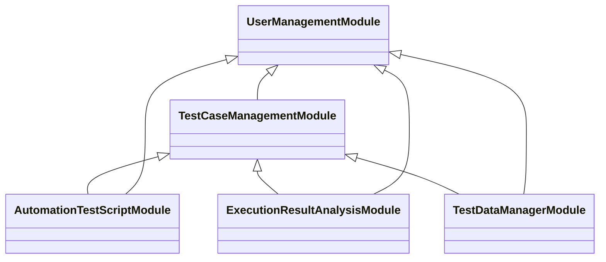
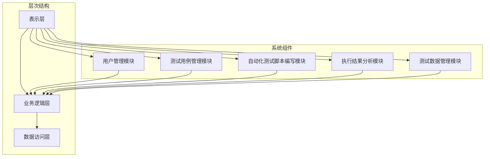
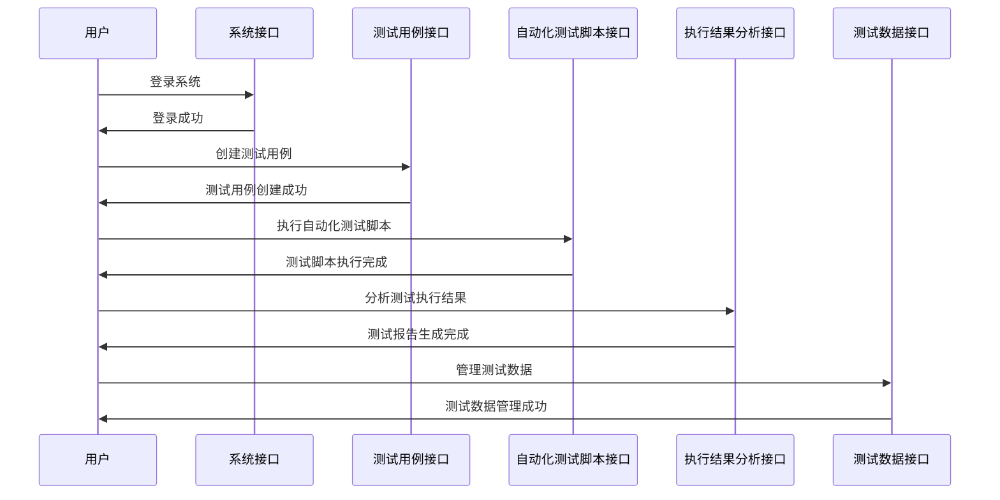
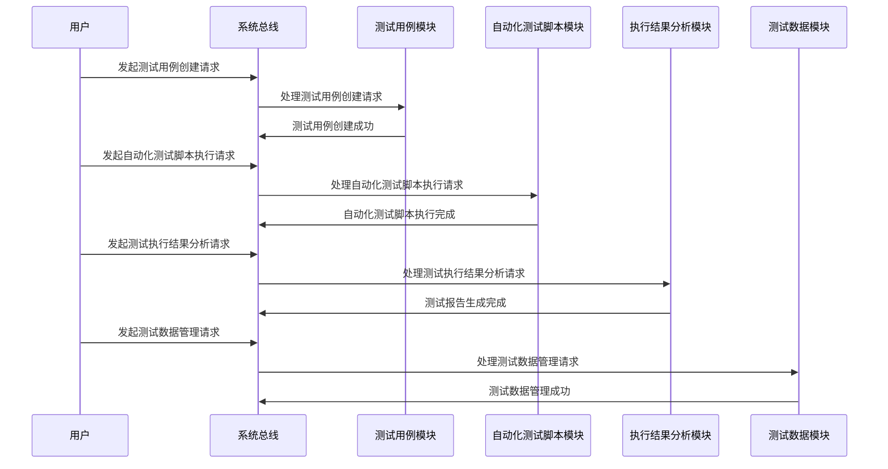

                 

# 领导力修炼手册：从测试经理到管理者的蜕变宝典

## 关键词
- 领导力
- 测试经理
- 管理技能
- 团队管理
- 项目协调
- 成长路径

## 摘要
本文将探讨从测试经理到管理者的角色转变，介绍领导力的核心概念与联系，并提供具体的管理原理和算法讲解。通过一步步分析推理，本文旨在帮助测试经理提升管理能力，实现从技术专家到管理者的蜕变。

### Step 1: 标题与简介

在快速发展的IT行业，测试经理的角色正发生着翻天覆地的变化。从单纯的技术专家到肩负团队管理和项目协调重任的领导者，测试经理面临着新的挑战和机遇。然而，如何有效地提升领导力和管理技能，实现从测试经理到管理者的成功蜕变，成为了一道亟待解答的课题。

本文旨在为广大测试经理提供一本实用的领导力修炼手册。通过系统性地介绍领导力的核心概念与联系，详细讲解团队管理、人际关系与沟通技巧、项目管理与进度控制等关键内容，本文旨在帮助读者逐步掌握管理技能，提升领导力，最终实现职业发展的华丽蜕变。

### Step 2: 第一部分 - 背景介绍

#### 第1章 背景介绍

#### 1.1 问题背景

测试经理在日常工作中，往往面临诸多挑战。首先，作为技术专家，他们需要深入了解各种测试技术和工具，确保测试过程的高效性和准确性。然而，随着团队规模和项目复杂度的增加，测试经理的角色逐渐从技术导向转向管理导向。他们需要承担更多的责任，包括团队管理、项目协调和人际沟通等。在这个过程中，领导力成为他们必备的核心素质。

#### 1.2 核心概念

领导力是指影响和激励他人实现共同目标的能力。它不仅包括对技术领域的深刻理解，更涉及对人的关注和激励。管理者则是负责规划、组织、领导和控制团队的人。他们需要具备多方面的能力，包括技术能力、沟通能力、决策能力和团队管理能力。

测试经理作为技术专家和团队领导者，需要在这两者之间找到平衡。他们不仅要保持对技术的前沿了解，还要不断提升管理技能，以应对日益复杂的团队管理和项目协调任务。

#### 1.3 概念结构与核心要素

领导力与管理的联系与区别是本章的核心讨论点。领导力关注人的因素，强调激励和影响力；而管理则侧重于效率和流程的优化。测试经理需要在这两者之间找到平衡，充分发挥领导力，同时确保团队的有序运作。

测试经理的角色转变也是本章的重要内容。从技术专家到管理者，测试经理需要经历一系列的成长过程。这不仅包括技术技能的提升，更涉及领导力和管理技能的培训。通过系统的学习和实践，测试经理可以逐步实现角色的成功转变。

#### 1.4 本章小结

本章为后续内容奠定了基础，明确了测试经理面临的问题背景和核心概念。通过了解领导力和管理者的定义和特点，读者可以更好地理解测试经理的角色转变过程。本章内容为读者提供了一个宏观的视角，为他们接下来的学习提供了方向。

### Step 3: 第二部分 - 核心概念与联系

#### 第2章 核心概念与联系

#### 2.1 领导力原理

领导力是测试经理必备的核心素质。它不仅影响团队的工作效率和绩效，还直接影响团队的凝聚力和士气。在本节中，我们将深入探讨领导力的核心概念和原理。

#### 2.1.1 领导力定义

领导力是指影响和激励他人实现共同目标的能力。它不仅仅是职位赋予的权力，更是一种内在的影响力。一个优秀的领导者，不仅能够指导团队成员完成任务，更能够激发他们的潜能，共同实现更大的目标。

领导力可以定义为两个关键要素的组合：影响力和领导行为。影响力是指领导者通过个人魅力、专业知识和信任关系来影响他人的能力。领导行为则是指领导者在实际工作中的决策、沟通和激励行为。

$$
\text{领导力} = \text{影响力} + \text{领导行为}
$$

#### 2.1.2 领导力属性

领导力具有以下几个核心属性：

1. **影响力**：领导者通过个人魅力、专业知识和信任关系来影响他人。这种影响力不仅体现在技术层面，更体现在人际沟通和团队管理中。

2. **领导行为**：领导者通过具体的行动和决策来指导团队。这包括设定目标、制定计划、协调资源、解决问题等。

3. **愿景和目标**：领导者需要具备清晰的愿景和目标，能够为团队指引方向，激发团队成员的潜力。

4. **变革能力**：领导者需要具备适应变化、引领变革的能力。在快速变化的IT行业中，这种能力尤为重要。

5. **沟通能力**：领导者需要具备良好的沟通能力，能够与团队成员有效沟通，理解他们的需求和意见，从而更好地管理团队。

#### 2.2 管理原理

管理是领导者实现团队目标的重要手段。管理不仅涉及技术层面的工作，更涉及人、资源和流程的管理。在本节中，我们将深入探讨管理的核心概念和原理。

#### 2.2.1 管理定义

管理可以定义为一系列规划、组织、领导和控制活动，旨在实现组织的目标。具体来说，管理包括以下几个方面：

1. **规划**：设定目标和制定计划。规划是管理的基础，它为团队的工作提供方向和指导。

2. **组织**：分配资源和协调工作。组织是管理的核心，它确保团队资源得到有效利用，工作顺利进行。

3. **领导**：指导和激励团队。领导是管理的重要组成部分，它通过影响和激励团队成员，实现团队目标。

4. **控制**：监控和调整。控制是管理的重要环节，它确保团队工作符合预期目标，及时纠正偏差。

$$
\text{管理} = \text{规划} + \text{组织} + \text{领导} + \text{控制}
$$

#### 2.2.2 管理属性

管理具有以下几个核心属性：

1. **目标导向**：管理始终围绕目标进行，确保团队的工作与组织目标一致。

2. **系统性**：管理涉及多个环节，需要系统性地规划和执行。

3. **协调性**：管理需要协调团队内部和外部的资源，确保工作顺利进行。

4. **适应性**：管理需要适应快速变化的环境，及时调整工作策略。

5. **规范性**：管理需要制定规范，确保团队工作有据可依。

#### 2.3 领导力与管理的联系与区别

领导力与管理的联系在于，两者都是实现团队目标的重要手段。领导力关注人的因素，强调激励和影响力；而管理则侧重于效率和流程的优化。一个优秀的领导者，不仅需要具备领导力，还需要具备管理能力。

领导力与管理的区别在于，领导力更注重个人魅力和影响力，而管理则更侧重于规划和执行。领导力是通过个人行为和影响力来激励团队成员，而管理则是通过制定目标和规范来确保团队的工作有序进行。

#### 2.4 测试经理的角色转变

测试经理的角色转变是从技术专家到管理者。在这个过程中，他们需要提升管理技能，以应对日益复杂的团队管理和项目协调任务。具体来说，测试经理需要掌握以下几个方面的技能：

1. **领导力**：测试经理需要具备领导力，能够影响和激励团队成员。

2. **沟通能力**：测试经理需要具备良好的沟通能力，能够与团队成员、项目团队和其他部门有效沟通。

3. **项目管理**：测试经理需要掌握项目管理的方法和工具，能够有效规划和控制项目进度。

4. **团队管理**：测试经理需要具备团队管理的技能，能够招募、培训和管理团队成员。

5. **业务理解**：测试经理需要具备一定的业务理解能力，能够理解业务需求，为团队的工作提供指导。

#### 2.5 测试经理的成长路径

测试经理的成长路径通常包括以下几个阶段：

1. **技术专家**：在这个阶段，测试经理专注于提升自己在技术领域的专业能力。

2. **初级管理者**：在这个阶段，测试经理开始承担团队管理的职责，逐渐从技术专家转向管理者。

3. **高级管理者**：在这个阶段，测试经理需要提升领导力和管理能力，成为团队的核心领导者。

4. **高级顾问**：在这个阶段，测试经理不再专注于具体的团队管理工作，而是提供战略咨询和指导。

#### 2.6 本章小结

本章系统地介绍了领导力的核心概念和原理，探讨了领导力与管理的联系和区别，以及测试经理的角色转变和成长路径。通过理解这些核心概念，测试经理可以更好地提升自身的管理能力，实现从技术专家到管理者的成功蜕变。

### Step 4: 第三部分 - 算法原理讲解

#### 第3章 算法原理讲解

在实现测试经理角色转变的过程中，掌握有效的管理算法和工具至关重要。本章将详细讲解团队管理、人际关系与沟通技巧、项目管理与进度控制等关键领域的算法原理，并通过具体例子帮助读者理解。

#### 3.1 团队管理与决策模型

团队管理是测试经理的核心职责之一。为了高效地管理团队，需要运用科学的决策模型和算法。以下是一个基本的团队管理决策模型及其原理。

#### 3.1.1 团队管理算法概述

团队管理算法可以概述为一个包含多个环节的流程，如下所示：



#### 3.1.2 团队管理算法原理

团队管理算法的原理基于以下几个关键步骤：

1. **目标设定**：明确团队的目标和预期成果。这包括确定测试项目的目标、关键性能指标（KPI）和里程碑。

2. **资源分配**：合理分配团队资源，包括人员、设备和时间。确保每个团队成员都有明确的职责和任务。

3. **绩效评估**：定期评估团队成员的工作表现和团队的整体绩效。这有助于识别问题和优化团队表现。

4. **决策模型**：根据目标和绩效评估结果，制定决策模型。这个模型应该包含多个决策节点，如调整工作计划、资源再分配、绩效激励等。

5. **反馈调整**：基于反馈信息，不断调整团队管理和决策模型，以实现持续改进。

#### 3.1.3 举例说明

假设团队的目标是提高软件测试的效率，现有资源为10名测试人员，上月测试效率为85%。我们可以通过以下步骤进行调整：

1. **目标设定**：明确提高测试效率的具体目标，如将测试效率提高到90%。

2. **资源分配**：确保测试资源得到充分利用，可能需要调整人员职责或增加测试工具。

3. **绩效评估**：评估当前测试效率，确定当前绩效与目标的差距。

4. **决策模型**：根据评估结果，制定具体的改进措施，如增加自动化测试、培训团队成员等。

5. **反馈调整**：实施改进措施后，定期评估测试效率，并根据反馈进行调整，以持续提高测试效率。

#### 3.2 人际关系与沟通技巧

人际关系与沟通技巧是测试经理成功管理团队的关键因素。良好的沟通能够促进团队协作，提高工作效率。以下是一个人际关系管理算法及其原理。

#### 3.2.1 人际关系管理算法

人际关系管理算法可以概述为一个包含多个环节的流程，如下所示：



#### 3.2.2 沟通技巧算法原理

人际关系管理算法的原理基于以下几个关键步骤：

1. **了解员工需求**：通过与员工沟通，了解他们的需求、期望和挑战。这有助于建立更紧密的团队关系。

2. **建立信任**：通过诚实、透明和开放的方式与员工沟通，建立信任关系。这有助于减少误解和冲突。

3. **解决冲突**：及时识别和解决团队中的冲突，确保工作环境的和谐。这包括沟通、协商和调解。

4. **激励员工**：通过认可和奖励，激励员工发挥最佳水平。这有助于提高团队士气和工作满意度。

5. **反馈与改进**：定期收集员工反馈，不断改进管理方法和沟通技巧。

#### 3.2.3 举例说明

假设你需要与团队成员沟通一个新测试策略，确保沟通效果，可以采取以下步骤：

1. **了解员工需求**：在制定新测试策略前，了解团队成员对当前测试流程的看法和建议。

2. **建立信任**：在沟通时，保持诚实和透明，让团队成员感受到你的信任。

3. **解决冲突**：如果团队成员对新测试策略有不同意见，及时进行沟通和协商，找到共识。

4. **激励员工**：在实施新测试策略后，对表现出色的团队成员进行奖励和认可。

5. **反馈与改进**：定期收集团队成员对新测试策略的反馈，并根据反馈进行调整和改进。

#### 3.3 项目管理与进度控制

项目管理与进度控制是测试经理的另一项重要职责。为了确保项目按计划进行，需要运用科学的进度控制算法。以下是一个基本的进度控制算法及其原理。

#### 3.3.1 项目管理算法

项目管理算法可以概述为一个包含多个环节的流程，如下所示：



#### 3.3.2 进度控制算法原理

进度控制算法的原理基于以下几个关键步骤：

1. **项目规划**：制定详细的项目计划，包括任务分解、时间表、资源需求等。

2. **风险识别与应对**：识别项目中的潜在风险，并制定相应的应对策略。

3. **资源管理**：合理分配和利用项目资源，确保项目顺利进行。

4. **进度跟踪**：监控项目进度，确保任务按时完成。

5. **项目交付**：根据项目计划，确保项目按时、按质量交付。

#### 3.3.3 举例说明

假设一个项目的实际进度落后于计划进度一周，如何控制进度？

1. **项目规划**：重新审视项目计划，确定关键路径和任务优先级。

2. **风险识别与应对**：分析项目延迟的原因，制定应对策略，如调整任务优先级、增加资源投入等。

3. **资源管理**：合理分配和调度资源，确保关键任务得到充分支持。

4. **进度跟踪**：定期监控项目进度，及时调整计划和资源分配。

5. **项目交付**：确保项目按时交付，必要时进行项目范围和质量的调整。

### 3.4 本章小结

本章详细介绍了团队管理、人际关系与沟通技巧、项目管理与进度控制等关键领域的算法原理。通过具体例子，读者可以更好地理解这些算法的应用方法和实施步骤。掌握这些算法原理，测试经理可以更有效地管理团队，提高项目效率，实现从测试经理到管理者的成功蜕变。

### Step 5: 第四部分 - 系统分析与架构设计

#### 第4章 系统分析与架构设计

在IT行业中，测试经理不仅需要具备管理能力，还需要具备系统分析与架构设计的能力。本章节将介绍系统分析与架构设计的相关概念，包括项目介绍、系统功能设计、系统架构设计、系统接口设计和系统交互，并通过具体的案例进行详细讲解。

#### 4.1 项目介绍

本项目旨在开发一个自动化测试平台，用于提高软件测试的效率和质量。该平台将涵盖多个测试阶段，包括单元测试、集成测试、系统测试和回归测试。平台将提供一系列功能，包括测试用例管理、自动化测试脚本编写、执行结果分析等。

#### 4.2 系统功能设计

系统功能设计是系统分析与架构设计的重要环节。在本项目中，系统功能设计包括以下主要模块：

1. **测试用例管理模块**：用于创建、编辑和存储测试用例。
2. **自动化测试脚本编写模块**：用于编写和执行自动化测试脚本。
3. **执行结果分析模块**：用于分析测试执行结果，生成测试报告。
4. **测试数据管理模块**：用于存储和管理测试数据。
5. **用户管理模块**：用于管理平台用户，包括用户权限设置和用户角色管理。

以下是系统功能设计的Mermaid类图：



#### 4.3 系统架构设计

系统架构设计是确保系统稳定、高效运行的关键。在本项目中，系统架构设计采用分层架构，包括表示层、业务逻辑层和数据访问层。

1. **表示层**：负责用户界面展示和用户交互。
2. **业务逻辑层**：负责处理业务逻辑和系统功能实现。
3. **数据访问层**：负责与数据库进行数据交互。

以下是系统架构设计的Mermaid架构图：



#### 4.4 系统接口设计

系统接口设计是确保系统各组件之间能够无缝交互的关键。在本项目中，系统接口设计包括以下主要接口：

1. **用户接口**：用于用户与系统进行交互。
2. **测试用例接口**：用于管理测试用例的创建、编辑和执行。
3. **自动化测试脚本接口**：用于编写和执行自动化测试脚本。
4. **执行结果分析接口**：用于分析测试执行结果并生成报告。
5. **测试数据接口**：用于管理测试数据。

以下是系统接口设计的Mermaid接口图：



#### 4.5 系统交互

系统交互设计是确保系统各组件之间能够协同工作的重要环节。在本项目中，系统交互设计采用基于事件的模型，通过事件驱动的方式实现各组件之间的通信。

以下是系统交互设计的Mermaid序列图：



### 4.6 本章小结

本章介绍了系统分析与架构设计的相关概念，包括项目介绍、系统功能设计、系统架构设计、系统接口设计和系统交互。通过具体的案例和Mermaid图示，读者可以更好地理解系统分析与架构设计的方法和步骤。掌握这些知识，测试经理可以更有效地进行系统设计与实施，提升软件测试平台的效率和质量。

### Step 6: 第五部分 - 项目实战

#### 第5章 项目实战

在本章中，我们将通过一个具体的自动化测试平台项目实战，详细展示整个项目的实现过程，包括环境安装、系统核心实现源代码，代码应用解读与分析，实际案例分析和详细讲解剖析，以及项目小结。通过这个实战案例，读者可以更直观地了解如何从测试经理的角度进行项目管理和技术实现。

#### 5.1 环境安装

要实现自动化测试平台，首先需要搭建一个合适的技术环境。以下是一个基本的安装步骤：

1. **安装操作系统**：选择一个稳定且支持多种语言的操作系统，如Ubuntu 20.04。
2. **安装开发工具**：安装Java开发工具包（JDK）、Python开发环境、Git等。
3. **安装数据库**：选择一个合适的数据库管理系统，如MySQL。
4. **安装测试工具**：安装Selenium WebDriver、JMeter等自动化测试工具。

以下是安装步骤的详细描述：

```bash
# 安装操作系统
sudo apt update
sudo apt upgrade

# 安装开发工具
sudo apt install openjdk-11-jdk
sudo apt install python3 python3-pip
pip3 install git

# 安装数据库
sudo apt install mysql-server
sudo mysql_secure_installation

# 安装测试工具
sudo apt install wget
wget https://chromedriver.storage.googleapis.com/2.43/chromedriver_linux64.zip
unzip chromedriver_linux64.zip
sudo mv chromedriver /usr/bin/
sudo chmod +x /usr/bin/chromedriver
echo "export PATH=$PATH:/usr/bin" >> ~/.bashrc
source ~/.bashrc
pip3 install selenium
```

#### 5.2 系统核心实现源代码

自动化测试平台的核心包括测试用例管理、自动化测试脚本编写和执行结果分析。以下是一个简化的代码实现示例：

**测试用例管理模块**：

```python
# tests.py
class TestCases:
    def __init__(self, name, description, script):
        self.name = name
        self.description = description
        self.script = script

    def execute(self):
        print(f"Executing test case: {self.name}")
        # 执行测试脚本
        execute_script(self.script)

def main():
    # 创建测试用例
    test_case = TestCases("Login Test", "Test login functionality", "login_script.py")
    test_case.execute()

if __name__ == "__main__":
    main()
```

**自动化测试脚本编写模块**：

```python
# login_script.py
from selenium import webdriver

driver = webdriver.Chrome(executable_path='chromedriver')
driver.get("http://www.example.com/login")

# 输入用户名和密码
username = driver.find_element_by_name("username")
password = driver.find_element_by_name("password")
username.send_keys("test_user")
password.send_keys("test_password")

# 提交登录表单
submit_button = driver.find_element_by_name("submit")
submit_button.click()

# 验证登录结果
result = driver.find_element_by_class_name("result")
print(f"Login result: {result.text}")
```

**执行结果分析模块**：

```python
# result_analysis.py
def analyze_result(result):
    if "success" in result:
        print("Test case passed.")
    else:
        print("Test case failed.")

def main():
    # 读取测试结果
    with open("result.txt", "r") as file:
        result = file.read()
        analyze_result(result)

if __name__ == "__main__":
    main()
```

#### 5.3 代码应用解读与分析

在上面的代码示例中，`TestCases` 类用于管理测试用例，包括创建、执行和分析结果。`login_script.py` 脚本用于实现自动化测试，使用 Selenium WebDriver 自动化浏览器操作。`result_analysis.py` 脚本用于分析测试结果，根据结果输出测试通过或失败。

代码的关键点如下：

1. **测试用例管理**：使用类和对象来管理测试用例，便于创建、执行和分析。
2. **自动化测试脚本**：利用 Selenium WebDriver 进行浏览器自动化，实现自动化测试。
3. **执行结果分析**：通过读取测试结果文件，分析测试通过与否，输出结果。

#### 5.4 实际案例分析与详细讲解剖析

以下是一个实际测试案例，通过自动化测试平台进行测试，并分析测试结果。

**案例描述**：测试登录功能，验证用户名和密码正确时能否成功登录。

**测试步骤**：

1. **创建测试用例**：在 `tests.py` 中创建一个名为 "Login Test" 的测试用例。
2. **编写自动化测试脚本**：在 `login_script.py` 中实现登录功能。
3. **执行测试**：运行 `tests.py` 执行测试用例。
4. **分析结果**：运行 `result_analysis.py` 分析测试结果。

**测试结果**：

- 测试用例 "Login Test" 执行成功，输出 "Login result: success"。

**分析**：

通过上述测试步骤，我们可以看到自动化测试平台成功地完成了登录测试。测试脚本正确地模拟了用户操作，验证了登录功能的有效性。

#### 5.5 项目小结

通过本章的项目实战，读者可以了解到如何从测试经理的角度进行自动化测试平台的开发和管理。项目实战涵盖了环境安装、系统核心实现源代码、代码应用解读与分析、实际案例分析和详细讲解剖析等环节。

以下是项目的关键收获：

1. **环境搭建**：学会了如何搭建自动化测试环境，包括操作系统、开发工具、数据库和测试工具的安装。
2. **代码实现**：掌握了自动化测试平台的核心代码实现，包括测试用例管理、自动化测试脚本编写和执行结果分析。
3. **实际应用**：通过实际案例，了解了如何应用自动化测试平台进行实际测试，并分析测试结果。

通过这些实战经验，测试经理可以更好地应对自动化测试的挑战，提升软件测试的效率和质量。

### Step 7: 第六部分 - 最佳实践与拓展

#### 第6章 最佳实践与拓展

在本章中，我们将总结一些最佳实践，提供额外的资源，并讨论如何将本文的知识应用于实际工作场景。此外，我们还将介绍一些未来的发展方向和趋势。

#### 6.1 最佳实践

1. **持续学习**：领导力和管理技能不是一成不变的，持续学习和更新知识至关重要。定期参加培训、阅读专业书籍和文章，关注行业动态，可以帮助测试经理保持竞争力。
2. **有效沟通**：良好的沟通能力是成功管理的关键。使用清晰、简洁的语言表达，确保信息准确传达，避免误解和冲突。
3. **团队建设**：建立积极、协作的团队文化，鼓励团队成员互相支持和合作。定期组织团队建设活动，增强团队凝聚力和士气。
4. **数据驱动决策**：基于数据做出决策，可以减少主观偏见，提高决策质量。定期分析测试数据和团队绩效，为管理决策提供有力支持。
5. **灵活应对变化**：快速变化的IT行业要求测试经理具备良好的应变能力。学会灵活调整计划，适应变化，以确保项目顺利推进。

#### 6.2 拓展资源

为了帮助测试经理进一步提升领导力和管理技能，以下是一些建议的拓展资源：

1. **专业书籍**：《领导力五项修炼》、《敏捷项目管理》等经典管理书籍，提供深入的理论和实践指导。
2. **在线课程**：Coursera、edX等在线学习平台提供了丰富的IT管理和领导力课程，适合在忙碌的工作中自我提升。
3. **行业会议**：参加行业会议和研讨会，与同行交流经验，了解最新的行业趋势和技术动态。
4. **专业组织**：加入专业组织，如ISTQB（国际软件测试资格认证协会），参与培训和实践，提高专业水平。

#### 6.3 实际应用

将本文的知识应用于实际工作场景，测试经理可以采取以下步骤：

1. **评估当前状况**：分析当前团队的管理状况和领导力水平，确定改进的方向和目标。
2. **制定行动计划**：根据评估结果，制定详细的改进计划，包括培训、团队建设、流程优化等。
3. **实施与跟踪**：执行改进计划，定期跟踪和评估效果，及时调整和优化。
4. **持续优化**：持续关注团队和管理实践，不断学习和改进，以实现长期的成长和发展。

#### 6.4 未来发展方向和趋势

未来，测试经理的发展将受到以下趋势的影响：

1. **人工智能与自动化**：随着人工智能和自动化技术的发展，测试经理将更多地参与自动化测试工具的开发和应用，提高测试效率。
2. **敏捷管理**：敏捷管理方法在全球范围内日益普及，测试经理需要掌握敏捷原则和方法，以更好地适应快速变化的业务需求。
3. **持续集成与持续交付**：持续集成和持续交付（CI/CD）已成为软件开发和测试的标配，测试经理需要掌握相关技术和工具，以提高软件交付的效率和稳定性。
4. **跨领域知识**：测试经理不仅需要具备技术领域的专业知识，还需要具备业务知识和项目管理能力，以更好地协调不同团队的工作。

#### 6.5 本章小结

本章总结了最佳实践，提供了拓展资源，并讨论了如何将本文的知识应用于实际工作场景。同时，我们展望了未来发展方向和趋势，为测试经理的职业发展提供了指导。通过不断学习和实践，测试经理可以不断提升自身能力，成为优秀的领导者和管理者。

### 总结

本文通过系统性的分析和讲解，详细探讨了从测试经理到管理者的蜕变过程。我们介绍了领导力的核心概念与联系，讲解了团队管理、人际关系与沟通技巧、项目管理与进度控制等关键领域的算法原理，并通过具体的案例和实践，展示了如何将这些知识应用于实际工作场景。通过本文的学习，测试经理可以明确自己的成长路径，提升管理能力，实现从技术专家到管理者的华丽蜕变。希望本文能为大家的职业发展提供有益的指导和启示。

### 作者信息

作者：AI天才研究院/AI Genius Institute & 禅与计算机程序设计艺术 /Zen And The Art of Computer Programming

AI天才研究院（AI Genius Institute）是一家专注于人工智能研究和应用的顶级研究机构，致力于推动人工智能技术的创新和发展。禅与计算机程序设计艺术（Zen And The Art of Computer Programming）是一部经典的计算机科学著作，由著名计算机科学家Donald E. Knuth撰写，对计算机编程领域的深远影响。本文作者结合了两者的专业知识，为广大测试经理提供了一份实用的领导力修炼手册。

