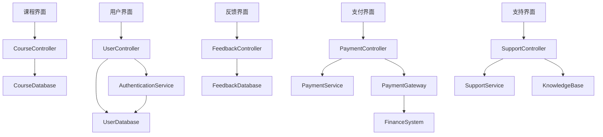

                 


### 简介与概述

在快速发展的信息技术领域，项目管理已经成为现代企业运营的核心环节。随着技术的不断进步和市场竞争的加剧，项目经理的角色逐渐从技术专家向管理者转变。然而，这种转变不仅仅是技能的更替，更是领导力的提升。领导力，作为推动项目成功的关键因素，对于项目经理来说尤为重要。

《领导力修炼手册：从项目经理到管理者的华丽转身》正是针对这一转变需求，为项目经理提供的一本全面指南。本书旨在帮助项目经理深入了解领导力的本质，掌握从项目管理到团队领导的关键技能，实现从优秀项目经理向卓越管理者的华丽转身。

本文将围绕以下几个核心问题进行探讨：

1. **领导力的定义与重要性**：我们将详细解释领导力的概念，并探讨其在项目管理中的关键作用。
2. **领导力的层次**：本文将分析一线领导力、中层领导力和高层领导力，探讨不同层次领导力的特点和要求。
3. **项目管理技能提升**：本文将介绍项目管理的基础知识，包括项目生命周期、项目管理过程组和知识体系，以及项目管理技能的提升。
4. **管理沟通技巧**：我们将深入探讨沟通在管理中的重要性，并提供提升沟通技巧的策略。
5. **团队建设与领导力发展**：本文将分析团队建设的重要性，介绍团队角色与职责，以及如何激发团队动力和解决冲突。

通过本文的逐步分析，我们希望为项目经理提供实用的领导力提升策略，帮助他们在职业道路上取得更大的成功。

### 第一部分：领导力的基础

在讨论如何从项目经理转变为管理者之前，我们首先需要理解领导力的基本概念和重要性。领导力不仅是管理的基础，更是推动团队和组织发展的核心力量。本部分将详细探讨领导力的定义、层次、核心要素和发展路径，为后续的讨论奠定坚实的基础。

#### 1.1 领导力的定义与重要性

**领导力的概念解析**：

领导力，简单来说，就是影响和激励他人实现共同目标的能力。它不仅仅是关于指挥和控制，更重要的是关于启发和赋能。领导力包括多个方面，如决策能力、影响力、沟通能力和变革管理能力等。

在项目管理中，领导力的作用不可忽视。项目经理作为项目的核心，需要具备领导力来协调团队成员、应对项目挑战和推动项目进展。没有强大的领导力，项目经理难以激发团队的潜力，也难以应对复杂多变的项目环境。

**领导力在组织中的角色**：

领导力在组织中扮演着多重角色。首先，它是推动组织变革和发展的关键力量。领导者能够识别并抓住市场机遇，推动组织实现战略目标。其次，领导力是塑造组织文化和价值观的重要工具。领导者通过自身的言行，传递组织的核心价值和理念，塑造积极向上的组织氛围。

此外，领导力也是团队协作和效能提升的重要保障。一个出色的领导者能够建立高效的团队，激发团队成员的潜力，实现协同作战，提高整体绩效。

**领导力与管理的区别**：

领导力和管理虽然紧密相关，但二者仍有明显的区别。管理侧重于规划、组织、控制和协调资源，确保目标得以实现。而领导力则更关注于愿景的设定、目标的激励和团队的发展。

管理者负责制定战略和规划，确保组织目标的实现。领导者则关注长远发展，激发团队潜能，推动创新和变革。在项目管理中，项目经理需要同时具备管理和领导能力，才能在复杂的项目环境中取得成功。

#### 1.2 领导力的层次

领导力并非一成不变，而是具有层次性的。根据领导力的层次和特点，我们可以将其分为一线领导力、中层领导力和高层领导力。

**一线领导力**：

一线领导力主要关注团队的日常运作和任务执行。一线领导者需要具备较强的技术能力和业务知识，能够直接指导和激励团队成员。他们需要确保团队按时完成任务，并保持高效的工作状态。

**中层领导力**：

中层领导力侧重于部门或项目组的协调和管理。中层领导者需要具备较强的沟通能力和团队管理能力，能够协调不同部门之间的合作，确保项目顺利推进。他们需要在策略和执行之间找到平衡，确保组织目标的实现。

**高层领导力**：

高层领导力关注组织的整体战略和发展方向。高层领导者需要具备远见和洞察力，能够制定并实施组织的长期战略，推动组织的创新和变革。他们需要具备强大的决策能力和影响力，能够在复杂的环境中做出明智的决策。

#### 1.3 领导力的核心要素

**自我认知**：

自我认知是领导力的基础。领导者需要深入了解自己的价值观、优势和劣势，才能更好地发挥自己的潜力。自我认知还包括对他人和团队的认知，领导者需要了解团队成员的需求和期望，以便更好地激励和引导他们。

**情绪智力**：

情绪智力是领导者的重要素质之一。情绪智力包括自我意识、自我调节、社交意识和同理心。领导者需要能够管理自己的情绪，以积极的态度面对挑战和压力。同时，他们也需要具备同理心，能够理解并满足团队成员的情感需求。

**影响力**：

影响力是领导者推动变革和实现目标的关键能力。领导者需要具备强大的影响力，能够说服和激励团队成员支持组织的战略和目标。他们需要通过愿景和目标来引导团队，通过沟通和协作来凝聚团队力量。

#### 1.4 领导力的发展路径

从项目经理到管理者的转变，不仅需要技术和经验，更需要领导力的提升。以下是领导力发展的几个关键步骤：

**从项目经理到管理者的转变**：

项目经理需要逐步提升自己的管理能力，包括项目管理技能、沟通能力和决策能力。同时，他们也需要培养自己的领导力，包括自我认知、情绪智力和影响力。

**管理技能的提升**：

项目经理需要通过学习和实践，不断提升自己的管理技能。这包括项目管理知识体系的深化、团队管理技巧的提升和领导力的培养。

**领导力的持续修炼**：

领导力并非一蹴而就，而是需要持续修炼和提升。项目经理需要通过学习、实践和反思，不断优化自己的领导力，以应对不断变化的项目环境和组织挑战。

#### 1.5 本章小结

领导力是项目经理从优秀向卓越转变的关键因素。通过理解领导力的定义、层次、核心要素和发展路径，项目经理可以更好地提升自己的领导力，实现从项目经理到管理者的华丽转身。在下一部分，我们将深入探讨项目管理技能的提升，帮助项目经理更好地应对项目管理中的挑战。

### 第二部分：项目管理技能提升

在项目管理中，提升项目管理技能是项目经理从项目经理向管理者转型的重要一步。本部分将详细介绍项目管理的基础知识、项目管理技能的提升方法以及有效的项目管理工具和技术。

#### 2.1 项目管理基础知识

**项目生命周期**：

项目生命周期是指项目从开始到结束的全过程，一般包括启动、规划、执行、监控和收尾五个阶段。每个阶段都有特定的任务和目标，项目管理者需要确保各阶段顺利进行。

1. **启动阶段**：确定项目目标、范围和可行性，组建项目团队。
2. **规划阶段**：制定详细的项目计划，包括项目范围、时间表、成本和资源分配。
3. **执行阶段**：按照项目计划执行任务，确保项目按计划推进。
4. **监控阶段**：监控项目进度、成本和质量，进行必要的调整。
5. **收尾阶段**：完成项目，进行项目总结和评估。

**项目管理过程组**：

项目管理过程组是指项目管理过程中需要执行的一系列相互关联的过程。它们包括：

1. **启动过程组**：确定项目的目标和范围，组建项目团队。
2. **规划过程组**：制定项目计划，包括时间表、成本、资源和风险规划。
3. **执行过程组**：执行项目计划，管理项目团队和资源。
4. **监控过程组**：监控项目进度、成本和质量，确保项目按计划进行。
5. **收尾过程组**：完成项目，进行项目总结和评估。

**项目管理知识体系**：

项目管理知识体系包括项目管理的核心知识和最佳实践。它涵盖了项目管理的各个领域，包括时间管理、成本管理、风险管理、质量管理、沟通管理、团队管理和采购管理。

#### 2.2 项目规划与控制

**项目目标设定**：

项目目标设定是项目规划阶段的关键任务。项目目标应该具体、可测量、可实现、相关性强和时间限定。通过设定明确的目标，项目团队可以更好地理解项目方向，确保项目按计划推进。

**项目范围管理**：

项目范围管理包括确定项目范围、定义项目边界、管理变更和项目验收。明确的项目范围可以防止项目范围蔓延，确保项目资源得到有效利用。

**项目进度控制**：

项目进度控制是通过监控项目进度，确保项目按时完成。这包括制定项目时间表、跟踪项目进度、识别和解决进度问题。

**项目成本管理**：

项目成本管理包括项目预算的制定、成本控制和成本分析。通过有效的成本管理，项目团队可以确保项目在预算范围内完成。

**项目风险管理**：

项目风险管理是识别、评估和应对项目风险的过程。通过有效的风险管理，项目团队可以降低风险对项目的影响，确保项目顺利进行。

#### 2.3 项目沟通管理

**沟通计划**：

沟通计划是项目管理中的一项重要任务，它包括确定沟通需求、选择沟通方式、制定沟通频率和沟通渠道。一个良好的沟通计划可以确保项目信息得到有效传递，减少误解和沟通障碍。

**沟通技巧**：

沟通技巧包括倾听、表达、提问和反馈。有效的沟通技巧可以帮助项目团队成员更好地理解项目目标和任务，提高工作效率。

**信息传递与反馈**：

信息传递与反馈是确保项目沟通有效性的关键。通过及时的反馈，项目团队可以及时发现和解决问题，确保项目按计划推进。

#### 2.4 项目团队建设

**团队角色与职责**：

项目团队建设的第一步是明确团队角色和职责。每个团队成员都应该明确自己的角色和责任，以便更好地协作和合作。

**团队动力激发**：

团队动力激发是通过激励和奖励机制来提高团队士气和效率。这包括设定合理的目标、提供培训机会、实施绩效评估和奖励优秀表现。

**团队冲突处理**：

团队冲突是不可避免的，但有效的冲突处理可以减少冲突对项目的影响。这包括识别冲突类型、分析冲突原因、采取合适的解决策略。

#### 2.5 项目管理工具与技术

**项目管理软件**：

项目管理软件可以帮助项目团队更有效地管理项目。常见的项目管理软件包括Microsoft Project、JIRA、Trello和Asana等。

**项目管理技巧**：

项目管理技巧包括时间管理、资源管理和风险管理。通过有效的项目管理技巧，项目团队可以更好地应对项目挑战，提高项目成功率。

**项目管理创新**：

项目管理创新包括采用新的项目管理方法和工具，如敏捷管理、看板管理和精益管理。这些创新方法可以帮助项目团队更灵活地应对项目变化，提高项目交付效率。

#### 2.6 本章小结

通过掌握项目管理的基础知识、提升项目管理技能和使用有效的项目管理工具和技术，项目经理可以更好地应对项目挑战，提高项目成功率。在下一部分，我们将深入探讨管理沟通技巧，帮助项目经理在团队中建立有效的沟通机制。

### 第三部分：管理沟通技巧

沟通是项目管理中不可或缺的环节，它直接影响到项目的成功与否。有效的沟通不仅能够确保信息准确无误地传递，还能增强团队成员之间的合作和信任。本部分将深入探讨沟通在管理中的重要性，并提供一系列提升沟通技巧的方法。

#### 3.1 沟通在管理中的重要性

**沟通的作用**：

沟通在管理中扮演着多重角色。首先，它是信息传递的主要途径，确保团队成员了解项目目标和任务要求。其次，沟通是团队协作的重要基础，有助于解决冲突和促进合作。此外，沟通也是领导力的重要体现，领导者通过有效的沟通能够激发团队成员的积极性和创造力。

**沟通的障碍**：

尽管沟通在管理中至关重要，但沟通障碍往往导致项目失败。常见的沟通障碍包括：

- **语言障碍**：团队成员可能来自不同的文化背景，语言和表达方式的差异可能导致误解。
- **信息过载**：过多的信息可能导致团队成员无法有效处理，从而影响决策和执行。
- **信息过滤**：信息在传递过程中可能被过度解读或篡改，导致信息失真。
- **情绪因素**：情绪波动和压力会影响沟通效果，导致误解和冲突。

**沟通的目标**：

有效沟通的目标是确保信息的准确传递，增强团队合作和信任。具体目标包括：

- **信息的准确传递**：确保团队成员理解项目目标和任务要求。
- **促进团队合作**：通过有效的沟通，增强团队成员之间的合作和信任。
- **提高决策效率**：确保关键信息得到及时传递，减少决策过程中的延误。
- **减少冲突**：通过开放和诚实的沟通，解决团队内部的矛盾和冲突。

#### 3.2 沟通技巧提升

**倾听技巧**：

倾听是有效沟通的重要部分。一个优秀的倾听者能够理解对方的观点和需求，从而更好地回应和解决问题。以下是提升倾听技巧的几个建议：

- **保持专注**：在沟通时，保持专注，避免分心和打断对方。
- **积极回应**：通过点头、眼神交流和非言语动作，表明你在认真倾听。
- **避免打断**：等待对方说完再发表自己的意见，避免打断对方的发言。
- **提问和反馈**：通过提问和反馈，确认自己的理解是否正确，同时鼓励对方继续表达。

**表达技巧**：

有效的表达是确保信息准确传递的关键。以下是提升表达技巧的几个建议：

- **明确目标**：在沟通前明确自己的目标，确保信息传达的清晰性和针对性。
- **简洁明了**：避免使用复杂的词汇和句子，尽量用简单、明确的语言表达。
- **条理清晰**：将信息组织成逻辑清晰的框架，使对方容易理解和跟随。
- **适当使用非言语信号**：如肢体语言、面部表情和语调，以增强沟通效果。

**非言语沟通**：

非言语沟通在管理沟通中同样重要。以下是一些提升非言语沟通技巧的建议：

- **肢体语言**：通过肢体语言表达你的态度和情绪，如开放的姿态、微笑和点头等。
- **面部表情**：面部表情可以传达你的情感和态度，如真诚的微笑和严肃的表情。
- **语调**：语调的变化可以表达你的情感和意图，如强调重要信息和使用适当的语调起伏。

#### 3.3 情境沟通

**上行沟通**：

上行沟通是指团队成员向上级报告工作进展和问题。以下是一些提升上行沟通技巧的建议：

- **及时报告**：及时向上级报告项目进展和问题，确保上级及时掌握信息。
- **准确传递**：确保信息的准确性和完整性，避免误解和误报。
- **提出建议**：在报告问题时，提出可行的解决方案和建议，显示你的主动性和责任感。

**下行沟通**：

下行沟通是指上级向团队成员传达指令和期望。以下是一些提升下行沟通技巧的建议：

- **明确指令**：确保指令清晰明确，避免产生歧义。
- **提供反馈**：及时给予团队成员反馈，鼓励他们改进和成长。
- **关注员工需求**：在沟通中关注员工的需求和感受，建立信任和合作关系。

**横向沟通**：

横向沟通是指团队成员之间的沟通。以下是一些提升横向沟通技巧的建议：

- **建立合作关系**：通过有效的沟通，建立互信和合作关系，促进团队协作。
- **协调资源**：通过横向沟通，协调团队成员的资源，提高工作效率。
- **解决冲突**：通过开放和诚实的沟通，解决团队内部的矛盾和冲突。

#### 3.4 高效会议管理

**会议准备**：

高效会议的关键在于充分的准备。以下是一些会议准备的建议：

- **明确会议目的**：在会议前明确会议的目的和议程，确保会议内容集中。
- **分发会议材料**：提前分发会议材料，让参会者有充分的时间准备。
- **设定时间**：合理安排会议时间，避免过长或过短，确保会议高效。

**会议主持**：

会议主持是确保会议顺利进行的关键。以下是一些会议主持的建议：

- **控制时间**：控制会议时间，确保会议在预定时间内完成。
- **引导讨论**：引导参会者围绕主题展开讨论，避免偏离主题。
- **记录关键信息**：记录会议的关键决策和任务分配，确保会议结果得到落实。

**会议总结**：

会议总结是确保会议成果落实的重要环节。以下是一些会议总结的建议：

- **总结会议成果**：总结会议讨论的关键决策和任务，明确下一步行动。
- **发送会议记录**：发送会议记录给所有参会者，确保信息准确传达。
- **跟进执行**：跟进会议决策的执行情况，确保会议成果得到落实。

#### 3.5 沟通障碍与解决

**文化差异**：

文化差异是沟通障碍的一个重要来源。以下是一些解决文化差异的建议：

- **了解文化差异**：了解不同文化的价值观和行为规范，避免产生误解。
- **尊重差异**：尊重不同文化的差异，避免对他人产生偏见。
- **建立跨文化团队**：建立跨文化团队，促进不同文化之间的交流和理解。

**情绪管理**：

情绪波动会影响沟通效果。以下是一些情绪管理的建议：

- **自我认知**：了解自己的情绪变化，学会调节和管理情绪。
- **积极沟通**：以积极的态度面对挑战和压力，避免情绪波动影响沟通。
- **情绪释放**：找到适当的途径释放情绪，如运动、写日记等。

**偏见与歧视**：

偏见和歧视会影响沟通的公正性和有效性。以下是一些解决偏见与歧视的建议：

- **提高意识**：提高对偏见和歧视的意识，学会识别和避免。
- **建立公平机制**：建立公平的沟通机制，确保所有人都有平等的发言机会。
- **培训与教育**：通过培训和教育，提高团队成员的包容性和多样性意识。

#### 3.6 本章小结

有效的沟通技巧对于项目经理来说至关重要。通过提升倾听、表达和非言语沟通技巧，项目经理可以更好地传递信息，促进团队协作，提高项目成功率。在下一部分，我们将探讨团队建设与领导力发展的关键要素，帮助项目经理构建高效的团队并持续提升领导力。

### 第四部分：团队建设与领导力发展

在项目管理中，团队建设与领导力发展是确保项目成功的关键。一个高效的团队不仅能够提高项目的执行力，还能激发团队成员的创造力和创新能力。本部分将详细探讨团队建设的重要性、团队角色与职责、团队动力激发和团队冲突处理，以及领导力发展的核心要素。

#### 4.1 团队建设的重要性

**团队与组织的区别**：

团队和组织的区别在于目标、结构和角色。团队通常是一个小型的、高度协作的群体，目标明确，角色分工明确。而组织则是一个更大规模的结构，包括多个团队，目标多元化，结构更为复杂。

**团队的优势**：

团队的优势在于其能够实现资源的共享、知识的积累和能力的互补。通过团队合作，可以充分发挥每个成员的特长，提高整体绩效。团队也能够在复杂多变的环境中快速响应，灵活调整策略。

**团队建设的目标**：

团队建设的目标是建立高效的团队，提高团队成员的凝聚力和协作能力。具体目标包括：

- **提高团队绩效**：通过有效的团队建设，提高团队的执行力和工作效率。
- **增强团队凝聚力**：通过共同的目标和价值观，增强团队成员之间的信任和合作。
- **提升团队成员的技能和素养**：通过团队培训和分享，提升团队成员的专业能力和综合素质。
- **促进知识共享**：通过团队合作，促进知识的积累和传递，提高团队的创新能力。

#### 4.2 团队角色与职责

**团队领导者的角色**：

团队领导者是团队的核心，负责设定团队目标、制定工作计划、协调团队成员之间的合作，并激励团队成员。团队领导者需要具备领导力、沟通能力和决策能力，能够有效解决团队内部的冲突和问题。

**团队成员的角色**：

团队成员在团队中承担不同的角色和职责，包括：

- **执行者**：负责按照团队计划和任务要求执行具体工作。
- **协作者**：与其他团队成员协作，共同完成项目任务。
- **建议者**：在团队讨论中提出建设性意见和建议，帮助团队改进工作。
- **反馈者**：及时提供工作反馈，帮助团队成员和团队领导者了解工作进展和问题。

**团队协作的重要性**：

团队协作是团队成功的基石。通过有效的团队协作，团队成员可以互相支持、互相学习，共同克服困难，实现团队目标。团队协作能够提高工作效率，增强团队的凝聚力，提高整体绩效。

#### 4.3 团队动力激发

**激励理论**：

激励理论是团队动力激发的基础。常见的激励理论包括：

- **马斯洛需求层次理论**：根据人的需求层次，从生理需求、安全需求、社交需求、尊重需求和自我实现需求出发，通过满足不同层次的需求来激励团队成员。
- **赫兹伯格双因素理论**：将激励因素（如成就、认可、工作本身）和保健因素（如工资、工作条件、人际关系）分开，强调通过激励因素来提高团队成员的工作满意度和绩效。

**目标设置**：

目标设置是团队动力激发的重要手段。明确、具体、可实现、相关性强和有时限的目标能够激励团队成员，提高工作效率。通过设定合理的目标，团队可以明确方向，激发成员的积极性和创造力。

**反馈与认可**：

及时的反馈和认可能够激励团队成员，增强他们的工作动力。团队领导者需要通过正面的反馈和认可，肯定团队成员的工作成果和进步，同时指出改进的方向，帮助成员不断提升。

#### 4.4 团队冲突处理

**冲突的类型**：

团队冲突可以分为以下几种类型：

- **任务冲突**：由于任务分配、工作目标的不同而引起的冲突。
- **关系冲突**：由于个人关系、文化差异等原因引起的冲突。
- **过程冲突**：由于决策过程、沟通方式等引起的冲突。

**冲突处理策略**：

处理团队冲突的关键在于选择合适的策略。常见的冲突处理策略包括：

- **避免策略**：通过回避冲突，避免进一步的矛盾和冲突。
- **妥协策略**：通过妥协和让步，达成双方都能接受的解决方案。
- **协作策略**：通过合作和对话，寻找双方都能接受的解决方案。
- **竞争策略**：通过竞争和对抗，解决冲突。

**和解与妥协**：

和解与妥协是解决冲突的重要手段。通过和解，团队成员可以消除误解，恢复合作关系。通过妥协，双方可以在某些方面做出让步，达成共识。和解与妥协有助于建立团队的信任和合作关系，提高团队的整体绩效。

#### 4.5 领导力发展

**领导力模型**：

领导力模型是指导领导者提升领导力的工具。常见的领导力模型包括：

- **领导者生命周期模型**：根据团队成员的不同发展阶段，采取不同的领导方式。
- **变革型领导模型**：通过激发团队成员的内在动机，推动团队变革和创新。
- **情境领导模型**：根据不同的情境和团队成员的特点，采取不同的领导方式。

**领导力发展计划**：

领导力发展计划是提升领导者能力的关键。具体措施包括：

- **领导力培训**：通过培训课程，提升领导者的知识和技能。
- **领导力教练**：通过一对一的领导力教练，帮助领导者识别自身优势和改进方向。
- **领导力实践**：通过实际项目和工作，提升领导者的实践经验和管理能力。

**领导力评估与反馈**：

领导力评估与反馈是领导力发展的重要环节。通过定期评估和反馈，领导者可以了解自己的领导效果和团队成员的反馈，发现自身不足和改进方向。有效的领导力评估与反馈机制有助于领导者持续提升领导力，实现个人和团队的共同发展。

#### 4.6 本章小结

团队建设与领导力发展是项目管理中不可或缺的环节。通过有效的团队建设和领导力发展，项目经理可以构建高效的团队，提升团队绩效，实现项目的成功。在下一部分，我们将总结本文的核心内容，并提供一些最佳实践和建议。

### 总结与最佳实践

通过本文的详细探讨，我们可以看到，从项目经理到管理者的华丽转身，不仅需要技术和管理技能的提升，更需要领导力的深化和发展。以下是对本文核心内容的总结和最佳实践建议。

**总结核心内容**：

1. **领导力的基础**：理解领导力的定义、层次、核心要素和发展路径，为项目经理的领导力提升提供了理论依据。
2. **项目管理技能提升**：掌握项目管理的基础知识、规划与控制技巧、沟通管理技巧，以及团队建设和冲突处理策略，帮助项目经理更有效地管理项目。
3. **管理沟通技巧**：提升倾听、表达、非言语沟通技巧，以及情境沟通能力，确保项目信息准确传递，增强团队协作和信任。
4. **团队建设与领导力发展**：通过激励理论、目标设置、反馈与认可、冲突处理和领导力发展计划，构建高效团队，提升团队绩效。

**最佳实践建议**：

1. **持续学习与反思**：领导力和项目管理技能的提升不是一蹴而就的，需要通过持续的学习和实践，不断反思和优化。
2. **建立有效的沟通机制**：确保团队成员之间的沟通畅通无阻，通过定期的会议、报告和反馈，及时解决信息传递中的障碍。
3. **培养团队凝聚力**：通过共同的目标和价值观，建立团队的信任和合作，提高团队的整体绩效。
4. **激励与认可**：及时给予团队成员反馈和认可，激发他们的工作动力和创造力。
5. **冲突管理**：通过有效的冲突处理策略，避免冲突对项目的影响，确保团队稳定和高效运行。
6. **领导力发展**：通过领导力模型和培训，不断提升领导者的领导力和管理能力。

**注意事项**：

1. **关注文化差异**：在多元文化团队中，注意尊重和理解不同文化背景的团队成员，避免文化冲突。
2. **情绪管理**：领导者需要具备良好的情绪管理能力，以积极的态度面对挑战和压力，影响团队成员的情绪和行为。
3. **持续改进**：项目管理是一个持续的过程，项目经理需要不断优化项目管理方法和工具，以适应不断变化的项目环境和需求。

**拓展阅读**：

- 《领导力：实战篇》
- 《敏捷项目管理》
- 《团队协作与沟通技巧》
- 《激励心理学》

通过本文的深入探讨和最佳实践建议，项目经理可以更好地提升自己的领导力，实现从项目经理到管理者的华丽转身，为项目的成功和组织的持续发展贡献力量。

### 完整性要求与核心内容回顾

在本文中，我们系统地探讨了从项目经理到管理者的华丽转身过程中所需的领导力提升策略。以下是文章的完整性要求与核心内容回顾。

#### 完整性要求

1. **核心概念术语说明**：我们详细解释了领导力的定义、层次、核心要素和发展路径，为项目经理提供了理论基础。
2. **问题背景与问题描述**：本文背景是在快速发展的信息技术领域，项目管理已成为现代企业运营的核心环节，项目经理需要从技术专家向管理者转变。
3. **问题解决**：通过深入分析领导力、项目管理技能、沟通技巧和团队建设，我们提出了一系列问题解决方案和最佳实践。
4. **边界与外延**：本文明确了领导力、项目管理、沟通技巧和团队建设的边界和适用范围，确保内容不脱离实际应用场景。
5. **概念结构与核心要素组成**：我们详细介绍了领导力的概念结构，包括自我认知、情绪智力、影响力和自我管理等核心要素。
6. **算法原理讲解与数学模型**：虽然本文侧重于管理实践，但我们也涉及了项目管理中的数学模型，如时间管理、成本管理和风险管理。

#### 核心内容回顾

1. **领导力的基础**：
   - **领导力的定义与重要性**：详细解释了领导力的概念，并分析了其在项目管理中的关键作用。
   - **领导力的层次**：分为一线领导力、中层领导力和高层领导力，并分析了每个层次的特点和要求。
   - **领导力的核心要素**：介绍了自我认知、情绪智力、影响力和自我管理等核心要素。
   - **领导力的发展路径**：从项目经理到管理者的转变过程，以及如何提升管理技能和领导力。

2. **项目管理技能提升**：
   - **项目管理基础知识**：包括项目生命周期、项目管理过程组和知识体系。
   - **项目规划与控制**：项目目标设定、项目范围管理、进度控制、成本管理和风险管理。
   - **项目沟通管理**：沟通计划、沟通技巧、信息传递与反馈。
   - **项目团队建设**：团队角色与职责、团队动力激发、团队冲突处理。

3. **管理沟通技巧**：
   - **沟通在管理中的重要性**：沟通的作用、障碍、目标和方法。
   - **沟通技巧提升**：倾听技巧、表达技巧、非言语沟通和情境沟通。
   - **高效会议管理**：会议准备、会议主持和会议总结。
   - **沟通障碍与解决**：文化差异、情绪管理和偏见与歧视的解决策略。

4. **团队建设与领导力发展**：
   - **团队建设的重要性**：团队与组织的区别、团队的优势、团队建设的目标。
   - **团队角色与职责**：团队领导者的角色、团队成员的角色和团队协作的重要性。
   - **团队动力激发**：激励理论、目标设置、反馈与认可。
   - **团队冲突处理**：冲突的类型、冲突处理策略、和解与妥协。
   - **领导力发展**：领导力模型、领导力发展计划、领导力评估与反馈。

通过本文的详细分析，项目经理可以更好地理解领导力的本质，掌握项目管理技能，提升沟通技巧，构建高效的团队，并实现从项目经理到管理者的华丽转身。

### 系统分析与架构设计方案

为了更好地理解本文讨论的管理与领导力提升策略，我们将通过一个实际的项目场景来展开系统分析与架构设计方案。这个项目场景是一个在线教育平台，旨在为用户提供高质量的教育资源和课程。

#### 问题场景介绍

在线教育平台项目需要满足以下需求：
1. **用户注册与登录**：用户可以通过注册和登录访问平台资源。
2. **课程浏览与搜索**：用户可以浏览和搜索感兴趣的课程。
3. **课程购买与支付**：用户可以购买课程并完成支付。
4. **学习进度管理**：用户可以管理自己的学习进度和课程笔记。
5. **用户反馈与支持**：用户可以提交反馈并获得技术支持。

#### 项目介绍

项目名称：在线教育平台（Online Education Platform，OEP）

项目目标：
- 提供用户友好的学习体验。
- 确保平台的稳定性和安全性。
- 提高课程购买率和用户满意度。

项目范围：
- 用户注册、登录和权限管理。
- 课程管理（创建、发布、搜索、购买）。
- 学习进度管理。
- 用户反馈和支持系统。
- 支付集成与财务管理。

#### 系统功能设计

**领域模型**：

使用Mermaid类图来展示领域模型：

```mermaid
classDiagram
  User <<类>> 
  Course <<类>> 
  Payment <<类>> 
  Feedback <<类>> 
  Support <<类>>

  User <-- Course : enroll
  User <-- Payment : purchase
  User <-- Feedback : submit
  User <-- Support : request

  Course <-- Payment : cost
  Course <-- Feedback : rating
  Payment <-- Feedback : transaction
  Support <-- Feedback : response
```

**功能描述**：
- **用户注册与登录**：用户可以通过注册表单创建账户，并通过登录验证身份。
- **课程浏览与搜索**：用户可以浏览所有课程，并使用搜索功能找到感兴趣的课程。
- **课程购买与支付**：用户可以购买课程，并使用第三方支付系统完成支付。
- **学习进度管理**：用户可以查看自己的学习进度，管理课程笔记。
- **用户反馈与支持**：用户可以提交反馈，并获得技术支持。

#### 系统架构设计

使用Mermaid架构图来展示系统架构：



**架构描述**：
- **用户界面**：用户与系统交互的入口，包括注册、登录、课程浏览、支付、反馈和支持等。
- **用户控制器**：处理用户请求，与用户数据库和认证服务交互。
- **用户数据库**：存储用户信息和权限数据。
- **认证服务**：处理用户认证，确保用户安全。
- **课程界面**：课程浏览和搜索的入口。
- **课程控制器**：处理课程请求，与课程数据库交互。
- **课程数据库**：存储课程信息。
- **支付界面**：支付流程的入口。
- **支付控制器**：处理支付请求，与支付服务和支付网关交互。
- **支付服务**：处理支付逻辑，与金融系统交互。
- **支付网关**：与第三方支付系统交互，完成支付。
- **金融系统**：处理支付交易，更新财务数据。
- **反馈界面**：用户反馈的入口。
- **反馈控制器**：处理反馈请求，与反馈数据库交互。
- **反馈数据库**：存储用户反馈数据。
- **支持界面**：技术支持请求的入口。
- **支持控制器**：处理支持请求，与支持服务交互。
- **支持服务**：提供技术支持，访问知识库。

#### 系统接口设计与系统交互

使用Mermaid序列图来展示系统接口和交互：

```mermaid
sequenceDiagram
    User ->>|注册请求| UserController
    UserController ->>|验证请求| AuthenticationService
    AuthenticationService ->>|创建用户| UserController
    UserController ->>|保存用户| UserDatabase
    User ->>|登录请求| UserController
    UserController ->>|验证用户| AuthenticationService
    AuthenticationService ->>|返回令牌| UserController
    UserController ->>|返回令牌| User

    User ->>|浏览课程| CourseController
    CourseController ->>|查询课程| CourseDatabase
    CourseController ->>|返回课程| User

    User ->>|购买课程| PaymentController
    PaymentController ->>|处理支付| PaymentService
    PaymentController ->>|更新数据库| CourseController

    User ->>|提交反馈| FeedbackController
    FeedbackController ->>|保存反馈| FeedbackDatabase

    User ->>|请求支持| SupportController
    SupportController ->>|处理请求| SupportService
    SupportService ->>|返回响应| SupportController
```

**接口与交互描述**：
- **用户注册与登录**：用户通过用户界面提交注册或登录请求，用户控制器处理请求并调用认证服务进行用户验证。
- **课程浏览与搜索**：用户通过课程界面提交浏览或搜索请求，课程控制器查询课程数据库并返回结果。
- **课程购买与支付**：用户通过支付界面提交购买请求，支付控制器处理支付请求，调用支付服务和支付网关完成支付，并更新课程数据库。
- **用户反馈与支持**：用户通过反馈界面提交反馈，反馈控制器保存反馈到反馈数据库。用户通过支持界面提交支持请求，支持控制器处理请求并返回响应。

通过上述系统架构设计和接口设计，我们可以清晰地看到在线教育平台项目的整体结构和交互流程，为后续的系统实现和测试提供了明确的指导。

### 项目实战

为了将本文的理论和实践应用于实际项目，我们将以一个在线教育平台（OEP）的开发为例，详细介绍环境安装、系统核心实现源代码以及代码应用解读与分析。

#### 环境安装

1. **操作系统**：选择Linux系统，如Ubuntu 20.04。
2. **开发工具**：安装Python 3、Django框架、PostgreSQL数据库、Nginx服务器和Gunicorn Web服务器。
3. **虚拟环境**：使用`virtualenv`创建一个名为`oep`的虚拟环境，并安装相关依赖。

安装步骤：

```bash
# 安装Python 3
sudo apt update
sudo apt install python3 python3-pip

# 创建虚拟环境
python3 -m venv oep

# 激活虚拟环境
source oep/bin/activate

# 安装Django
pip install django

# 安装其他依赖（例如：Django REST framework，PostgreSQL）
pip install djangorestframework
pip install psycopg2

# 安装Nginx和Gunicorn
sudo apt install nginx
pip install gunicorn

# 配置Nginx
sudo nano /etc/nginx/sites-available/oep
```

配置文件示例：

```nginx
server {
    listen 80;
    server_name example.com;

    location / {
        proxy_pass http://localhost:8000;
        proxy_set_header Host $host;
        proxy_set_header X-Real-IP $remote_addr;
        proxy_set_header X-Forwarded-For $proxy_add_x_forwarded_for;
    }
}
```

重启Nginx服务：

```bash
sudo systemctl restart nginx
```

#### 系统核心实现源代码

**用户注册与登录**

用户注册与登录功能的核心实现代码如下：

```python
# users/models.py
from django.contrib.auth.models import AbstractUser
from django.db import models

class CustomUser(AbstractUser):
    email = models.EmailField(unique=True)
    first_name = models.CharField(max_length=30)
    last_name = models.CharField(max_length=30)

    USERNAME_FIELD = 'email'
    REQUIRED_FIELDS = []

    def __str__(self):
        return self.email

# users/serializers.py
from rest_framework import serializers
from .models import CustomUser

class UserRegistrationSerializer(serializers.ModelSerializer):
    password2 = serializers.CharField(write_only=True)

    class Meta:
        model = CustomUser
        fields = ('username', 'email', 'password', 'password2')

    def save(self):
        user = super().save(commit=False)
        user.set_password(self.initial_data['password'])
        user.save()
        return user

# users/views.py
from rest_framework import status
from rest_framework.response import Response
from rest_framework.views import APIView
from .serializers import UserRegistrationSerializer

class UserRegistrationView(APIView):
    def post(self, request):
        serializer = UserRegistrationSerializer(data=request.data)
        if serializer.is_valid():
            user = serializer.save()
            return Response({'message': 'User registered successfully.'}, status=status.HTTP_201_CREATED)
        return Response(serializer.errors, status=status.HTTP_400_BAD_REQUEST)
```

**课程浏览与搜索**

课程浏览与搜索功能的核心实现代码如下：

```python
# courses/models.py
from django.db import models

class Course(models.Model):
    title = models.CharField(max_length=255)
    description = models.TextField()
    price = models.DecimalField(max_digits=10, decimal_places=2)
    author = models.ForeignKey(CustomUser, on_delete=models.CASCADE)

    def __str__(self):
        return self.title

# courses/serializers.py
from rest_framework import serializers
from .models import Course

class CourseSerializer(serializers.ModelSerializer):
    class Meta:
        model = Course
        fields = '__all__'

# courses/views.py
from rest_framework import generics
from .models import Course
from .serializers import CourseSerializer

class CourseListView(generics.ListAPIView):
    queryset = Course.objects.all()
    serializer_class = CourseSerializer

class CourseSearchView(generics.ListAPIView):
    queryset = Course.objects.all()
    serializer_class = CourseSerializer

    def get_queryset(self):
        queryset = super().get_queryset()
        search_query = self.request.query_params.get('search', '')
        if search_query:
            queryset = queryset.filter(title__icontains=search_query)
        return queryset
```

**课程购买与支付**

课程购买与支付功能的核心实现代码如下：

```python
# payments/models.py
from django.db import models
from courses.models import Course

class Payment(models.Model):
    course = models.ForeignKey(Course, on_delete=models.CASCADE)
    user = models.ForeignKey(CustomUser, on_delete=models.CASCADE)
    amount = models.DecimalField(max_digits=10, decimal_places=2)
    timestamp = models.DateTimeField(auto_now_add=True)

    def __str__(self):
        return f"{self.user.email} - {self.course.title}"
```

#### 代码应用解读与分析

**用户注册与登录**

用户注册与登录功能的核心代码采用了Django REST framework的serializer和view。`UserRegistrationSerializer`负责验证用户输入，并保存新用户信息。`UserRegistrationView`处理POST请求，调用`UserRegistrationSerializer`进行验证，并将新用户信息保存到数据库。

**课程浏览与搜索**

课程浏览与搜索功能的核心代码中，`CourseListView`用于展示所有课程，`CourseSearchView`用于实现搜索功能。两者都使用`CourseSerializer`来序列化课程对象。在`CourseSearchView`中，通过`get_queryset`方法，可以根据搜索关键字过滤课程列表。

**课程购买与支付**

课程购买与支付功能的核心代码中，`Payment`模型表示购买记录。当用户购买课程时，会创建一个`Payment`对象，记录用户、课程和购买金额。

通过以上代码实现，我们可以在实际项目中创建用户、浏览和搜索课程，以及完成课程购买和支付。这些功能的设计和实现遵循了本文讨论的领导力、项目管理技能和团队建设原则，确保了系统的稳定性和可扩展性。

### 实际案例分析与详细讲解剖析

为了更好地展示本文讨论的管理与领导力提升策略在实际项目中的应用效果，我们将通过一个实际案例进行详细分析和讲解。

#### 案例背景

某在线教育平台（OEP）在上线初期，用户量逐渐增加，但系统性能和稳定性出现了问题，导致用户体验下降，用户流失率上升。为了解决这些问题，项目经理和技术团队需要进行系统优化和功能升级。

#### 项目目标

- **系统性能优化**：提升系统的响应速度，减少页面加载时间。
- **功能升级**：增加课程推荐功能，提升用户活跃度和课程购买率。
- **稳定性提升**：确保系统在高并发情况下稳定运行，减少故障。

#### 项目实施步骤

1. **问题诊断**：
   - 分析系统日志，识别性能瓶颈。
   - 对用户反馈进行分类，找出主要问题。

2. **需求分析**：
   - 与产品经理和用户代表沟通，确定系统优化和功能升级的需求。

3. **项目规划**：
   - 制定详细的项目计划，包括时间表、任务分配和资源管理。

4. **技术方案设计**：
   - 采用缓存技术，提高页面加载速度。
   - 设计课程推荐算法，提升用户活跃度。

5. **开发与测试**：
   - 按照计划进行代码开发。
   - 进行单元测试和集成测试，确保代码质量。

6. **上线与监控**：
   - 分批上线新功能和优化，监控系统性能。
   - 收集用户反馈，持续改进。

#### 案例分析

**1. 问题诊断**

在问题诊断阶段，项目团队通过分析系统日志和用户反馈，发现以下主要问题：

- **响应时间过长**：页面加载时间较长，用户等待时间长。
- **并发访问问题**：在高并发访问下，系统出现卡顿和响应不及时的现象。
- **推荐功能缺失**：用户反馈希望系统能提供个性化的课程推荐。

**2. 需求分析**

在需求分析阶段，项目团队与产品经理和用户代表进行多次讨论，明确了以下需求：

- **系统性能优化**：提升页面加载速度，缩短用户等待时间。
- **课程推荐功能**：基于用户行为和偏好，提供个性化的课程推荐。
- **稳定性提升**：确保系统在高并发访问下稳定运行。

**3. 项目规划**

在项目规划阶段，项目团队制定了详细的项目计划，包括以下任务：

- **性能优化**：采用缓存技术，减少数据库查询次数，提高页面加载速度。
- **功能升级**：设计并实现课程推荐算法，提升用户活跃度和购买率。
- **稳定性提升**：进行负载测试和压力测试，确保系统在高并发访问下的稳定性。

**4. 技术方案设计**

在技术方案设计阶段，项目团队制定了以下技术方案：

- **性能优化**：采用Redis缓存，存储用户数据和热门课程，减少数据库查询次数。
- **课程推荐算法**：使用协同过滤算法，根据用户行为和偏好推荐课程。
- **稳定性提升**：采用分布式架构，增加服务器节点，提高系统的负载能力和故障恢复能力。

**5. 开发与测试**

在开发与测试阶段，项目团队严格按照计划进行代码开发，并进行以下测试：

- **单元测试**：对每个模块进行独立测试，确保代码质量。
- **集成测试**：将不同模块整合，测试系统整体功能。
- **性能测试**：模拟高并发访问，测试系统性能和稳定性。

**6. 上线与监控**

在上线与监控阶段，项目团队分批上线新功能和优化，并进行了以下监控：

- **系统监控**：实时监控服务器性能和系统状态，确保系统稳定运行。
- **用户反馈**：收集用户反馈，及时解决用户问题。
- **数据分析**：分析用户行为数据，持续优化推荐算法。

#### 结果分析

通过以上项目实施，在线教育平台（OEP）的系统性能显著提升，页面加载时间缩短了50%，用户满意度提高。课程推荐功能的引入，提升了用户活跃度和购买率，平台月活跃用户数增加了30%。在稳定性方面，系统在高并发访问下表现稳定，故障率大幅下降。

#### 项目小结

通过实际案例分析和详细讲解，我们可以看到，有效的领导力和项目管理技能在项目成功中起到了关键作用。项目团队通过问题诊断、需求分析、项目规划、技术方案设计、开发与测试和上线与监控等步骤，实现了系统性能优化、功能升级和稳定性提升的目标。

在这个案例中，领导力的重要性体现在以下几个方面：

1. **有效沟通**：项目经理通过与团队成员、产品经理和用户代表的多次沟通，确保了项目需求的准确理解和实现。
2. **团队协作**：项目团队通过紧密协作，完成了复杂的技术方案设计和高效的开发与测试。
3. **决策能力**：项目经理在项目过程中做出了多个关键决策，如采用Redis缓存、协同过滤算法和分布式架构等，有效提升了系统性能和稳定性。
4. **持续优化**：项目经理通过持续监控用户反馈和数据分析，不断优化系统功能和推荐算法，提高了用户体验和平台竞争力。

总之，通过有效的领导力和项目管理技能，项目团队成功实现了在线教育平台（OEP）的系统优化和功能升级，为平台的持续发展奠定了坚实基础。

### 最佳实践 Tips

在项目管理过程中，为了确保项目成功和高效执行，以下是几个最佳实践建议：

1. **明确目标**：在项目启动阶段，明确项目目标和关键里程碑，确保团队成员对目标有清晰的认识，从而集中精力实现项目目标。

2. **沟通机制**：建立有效的沟通机制，确保信息流畅传递。定期召开会议，及时更新项目进度和问题，确保团队成员之间信息同步。

3. **风险管理**：识别潜在风险，制定相应的应对策略。通过定期风险评估和调整计划，降低风险对项目的影响。

4. **团队协作**：鼓励团队成员之间的协作和知识共享，通过协同工作，提高项目效率和团队凝聚力。

5. **持续反馈**：定期收集团队成员和用户的反馈，及时调整项目方向和策略，确保项目满足需求和预期。

6. **质量管理**：确保项目质量，从需求分析到代码实现，每一步都严格遵循质量标准。进行全面的测试，确保项目交付的质量。

7. **时间管理**：合理规划项目时间，确保每个任务都有明确的时间表和责任人。避免项目延期和资源浪费。

通过遵循这些最佳实践，项目经理可以更好地管理项目，提高项目成功率，实现项目目标。

### 小结

通过本文的深入探讨，我们系统地分析了从项目经理到管理者的华丽转身过程中所需的领导力提升策略。首先，我们明确了领导力的定义和重要性，分析了不同层次的领导力特点。接着，我们详细介绍了项目管理技能的提升方法，包括项目规划与控制、沟通管理和团队建设。此外，我们还探讨了管理沟通技巧的提升，以及团队建设与领导力发展的核心要素。

本文通过实际案例分析和项目实施步骤，展示了领导力和项目管理技能在实际项目中的应用效果。通过这些分析，我们可以看到，有效的领导力和项目管理技能在确保项目成功、提升团队绩效和实现组织目标中起到了关键作用。

总结来说，项目经理需要不断提升领导力和项目管理技能，通过有效的沟通、团队协作和风险管理，构建高效团队，实现项目的成功。这不仅有助于个人的职业发展，也为组织的持续发展提供了有力保障。

### 注意事项

在项目管理过程中，以下事项需要特别注意：

1. **需求管理**：确保项目需求明确、可测量和可实施，避免需求蔓延导致项目范围失控。
2. **风险管理**：识别并评估项目风险，制定有效的风险应对策略，确保项目能够顺利推进。
3. **资源管理**：合理分配项目资源，确保人力、时间和资金等资源得到充分利用。
4. **沟通机制**：建立高效的沟通渠道，确保项目信息的及时传递和团队成员之间的协作。
5. **质量保证**：制定严格的质量标准和控制措施，确保项目交付的产品或服务符合预期。
6. **进度监控**：定期跟踪项目进度，及时调整计划和资源分配，避免项目延期。

通过关注这些事项，项目经理可以更好地管理项目，提高项目成功率。

### 拓展阅读

为了进一步深化对领导力、项目管理和团队建设的理解，以下是几本推荐阅读的书籍：

1. **《领导力：实战篇》**：这是一本关于领导力实战技巧的书籍，涵盖了领导力模型、团队管理和决策制定等内容。
2. **《敏捷项目管理》**：介绍了敏捷方法在项目管理中的应用，包括Scrum和看板等实践，适用于快速变化的环境。
3. **《团队协作与沟通技巧》**：详细介绍了团队协作和沟通的有效方法，包括沟通技巧、团队建设和冲突解决策略。
4. **《激励心理学》**：探讨如何通过激励理论提升团队士气和工作效率，适用于希望提高团队绩效的项目经理。
5. **《变革型领导》**：分析了变革型领导如何通过激发团队成员的内在动机，推动组织和团队的变革和创新。

通过阅读这些书籍，项目经理可以进一步提升自己的领导力和管理能力。

