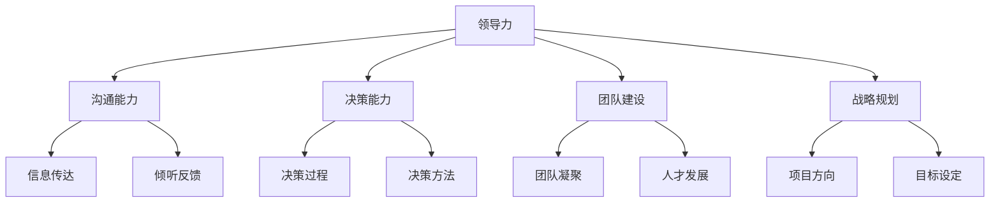

                 

## 领导力修炼手册：从项目经理到管理者的蜕变宝典

### 关键词：领导力、项目经理、管理者、项目管理、沟通技巧

### 摘要：
本文旨在为项目经理和初级行政管理者提供一本全方位的领导力修炼指南，帮助他们在项目管理中实现角色转变，提升整体领导效能。文章通过系统梳理领导力的基本原理、沟通技巧、决策与战略规划，以及自我修炼的方法，结合实战案例分析，提供从项目经理到管理者的蜕变路径。本文的目标是帮助读者理解领导力在项目管理中的核心作用，掌握提升领导力的具体策略，最终实现个人职业发展和团队绩效的显著提升。

## 引言

### 第1章 领导力修炼基础

#### 1.1 问题背景：领导力的含义与重要性

领导力是一种通过激励、指导和影响他人以实现共同目标的能力。在项目管理中，领导力不仅是项目经理个人素质的体现，更是团队协作和项目成功的核心要素。一个优秀的领导者能够有效地激发团队成员的潜力，提高团队的凝聚力和工作效率，从而确保项目目标的实现。

#### 1.2 问题描述：项目经理与领导者的区别

项目经理与领导者虽然在某些方面存在重叠，但两者在职责和角色上有所区别。项目经理主要关注项目的时间、成本、范围和质量，负责确保项目的顺利进行。而领导者则更注重团队建设、人才发展和组织文化的塑造，致力于提升团队的整体能力和绩效。

#### 1.3 问题解决：领导力的核心要素

要成为优秀的领导者，需要掌握以下几个核心要素：

1. **沟通能力**：领导者需要具备良好的沟通技巧，能够清晰地传达信息、倾听团队成员的意见，并有效解决冲突。
2. **决策能力**：领导者必须在复杂和不确定的环境下做出明智的决策，确保项目的方向和目标得到有效实现。
3. **团队建设**：领导者要关注团队建设，培养团队成员之间的信任和协作，激发团队的创造力和积极性。
4. **战略规划**：领导者需要具备战略规划的能力，能够从整体上把握项目的方向和目标，制定长期发展规划。

#### 1.4 边界与外延：领导力在不同组织环境中的应用

领导力不仅适用于企业环境，也广泛应用于政府、非营利组织等各种组织。不同组织环境中的领导力实践各有特点，但核心原则是相通的。例如，在科技公司中，领导者需要鼓励创新和快速迭代；而在传统制造业中，领导者则更强调流程优化和质量管理。

#### 1.5 概念结构与核心要素组成

领导力是一个多维度的概念，包括沟通、决策、团队建设和战略规划等多个方面。以下是一个简化的领导力概念结构图，用于帮助读者理解各要素之间的关系和相互影响。

### 第2章 领导力原理与模型

#### 2.1 领导力原理

领导力原理是理解领导行为和领导者特质的基础。以下是一些常见的领导力原理：

1. **领导行为理论**：领导行为理论强调领导者通过特定行为来影响团队成员。如勒温的“领导风格理论”将领导风格分为专制型、民主型和放任型三种。
2. **领导风格理论**：领导风格理论关注领导者如何与团队成员互动。常见的领导风格有民主型、权威型和参与型。
3. **领导力五要素模型**：领导力五要素模型将领导力分解为五个核心要素：道德品质、自信、影响力、团队协作和成就导向。

#### 2.2 领导力模型

领导力模型提供了具体的方法和工具，帮助领导者提高领导效能。以下是一些常见的领导力模型：

1. **领导者-成员交换理论（LMX理论）**：该理论认为领导者与成员之间的关系分为“内圈”和“外圈”，内圈成员得到更多的关注和支持。
2. **共生型领导理论**：共生型领导理论强调领导者与团队成员之间的合作和互惠关系，以实现共同的目标。
3. **服务型领导理论**：服务型领导理论认为领导者应该优先考虑团队成员的需求，通过服务和支持来激发团队成员的潜力。

#### 2.3 领导力与项目管理的联系

领导力在项目管理中发挥着至关重要的作用。领导者通过以下方式影响项目：
- **团队建设**：领导者通过培养团队成员之间的信任和协作，提高团队的凝聚力。
- **决策制定**：领导者通过制定明确的决策，确保项目方向的正确性和目标的实现。
- **风险管理**：领导者通过识别和应对项目风险，降低项目失败的可能性。

### 第3章 项目管理技能提升

#### 3.1 项目管理基础知识

项目管理是确保项目按时、按预算、按质量完成的过程。以下是一些关键的项目管理基础知识：

1. **项目生命周期**：项目生命周期包括项目启动、规划、执行、监控和收尾五个阶段。
2. **项目范围管理**：项目范围管理涉及定义项目边界、明确项目目标和工作内容。
3. **项目进度管理**：项目进度管理涉及制定项目计划、监控项目进度和调整计划。

#### 3.2 领导力在项目管理中的应用

领导力在项目管理中的应用体现在以下几个方面：
- **团队建设**：通过培养团队成员的信任和协作，提高团队效率。
- **冲突管理**：通过有效的沟通和协商，解决团队内部的冲突。
- **风险管理**：通过识别和应对项目风险，降低项目失败的可能性。

#### 3.3 项目管理技能提升方法

以下是一些提升项目管理技能的方法：
- **参加项目管理培训课程**：通过系统的培训，学习项目管理的基本知识和实践技巧。
- **阅读项目管理书籍和文章**：通过学习他人的经验和案例，提升自己的项目管理能力。
- **实践**：通过实际的项目管理实践，不断总结和反思，提升项目管理技能。

### 第4章 领导力沟通技巧

#### 4.1 沟通理论

沟通是领导力的核心要素之一。以下是一些关键的沟通理论：

1. **沟通障碍**：沟通障碍包括语言障碍、文化差异、心理障碍等，领导者需要识别和克服这些障碍。
2. **沟通模型**：沟通模型包括信息发送、信息接收、反馈和噪声处理等环节。
3. **沟通技巧**：有效的沟通技巧包括倾听、表达清晰、提问和反馈等。

#### 4.2 领导力沟通策略

领导力沟通策略涉及以下几个方面：

1. **听众分析**：领导者需要了解听众的需求和背景，以调整沟通内容和方式。
2. **非言语沟通**：非言语沟通包括肢体语言、面部表情和语调等，领导者需要掌握这些技巧，以增强沟通效果。
3. **提问技巧**：有效的提问技巧可以帮助领导者更好地理解团队成员的想法和意见。

#### 4.3 案例分析：领导力沟通技巧的实际应用

以下是一个案例分析，展示了领导力沟通技巧在实际工作中的应用：

某项目经理在项目执行过程中发现团队成员对项目进度有不同意见。项目经理通过以下步骤解决了问题：

1. **倾听**：项目经理主动倾听团队成员的意见，了解他们的担忧。
2. **表达清晰**：项目经理明确表达项目的目标和计划，确保团队成员理解。
3. **提问**：项目经理提问团队成员，了解他们的建议和意见。
4. **反馈**：项目经理给予团队成员积极的反馈，鼓励他们提出更多建设性意见。

通过这些沟通技巧，项目经理成功解决了团队内部的分歧，提高了项目执行力。

### 第5章 领导力决策与战略规划

#### 5.1 决策理论

决策理论涉及决策的过程、方法和错误。以下是一些关键的决策理论：

1. **决策过程**：决策过程包括问题识别、方案生成、方案评估和方案选择。
2. **决策方法**：决策方法包括理性决策模型、有限理性决策模型和启发式决策模型。
3. **决策错误**：决策错误包括过度自信、锚定效应、确认偏误等。

#### 5.2 战略规划

战略规划是确保项目长期成功的关键。以下是一些战略规划的关键步骤：

1. **战略规划模型**：战略规划模型包括SWOT分析、PESTLE分析和五力模型。
2. **战略实施**：战略实施涉及制定行动计划、分配资源、监控进度和调整计划。
3. **战略评估与调整**：战略评估与调整涉及评估战略的有效性，并根据实际情况进行调整。

#### 5.3 案例分析：领导力决策与战略规划的实际应用

以下是一个案例分析，展示了领导力决策与战略规划在实际工作中的应用：

某项目经理在项目启动阶段，通过SWOT分析确定了项目的优势、劣势、机会和威胁。根据分析结果，项目经理制定了以下战略规划：

1. **优势**：利用团队的专业技能和经验，确保项目质量。
2. **劣势**：提高团队成员的沟通效率，减少项目风险。
3. **机会**：积极寻求外部合作，扩大项目影响力。
4. **威胁**：密切关注市场动态，及时调整项目计划。

通过这些战略规划，项目经理成功确保了项目的顺利实施。

### 第6章 领导力自我修炼

#### 6.1 自我认知

自我认知是领导力自我修炼的基础。以下是一些自我认知的方法：

1. **SWOT分析**：通过SWOT分析，领导者可以了解自己的优势、劣势、机会和威胁。
2. **心理素质提升**：领导者需要提升自己的心理素质，以应对工作压力和挑战。
3. **自我激励**：领导者需要找到自我激励的方法，以保持积极的工作态度。

#### 6.2 持续学习

持续学习是领导力自我修炼的关键。以下是一些持续学习的方法：

1. **学习方法**：领导者需要掌握有效的学习方法，以提高学习效率。
2. **学习资源**：领导者需要利用各种学习资源，如书籍、课程和网络资源等。
3. **学习态度**：领导者需要保持积极的学习态度，不断追求知识和进步。

#### 6.3 领导力发展计划

领导力发展计划是确保领导力不断提升的关键。以下是一些制定领导力发展计划的方法：

1. **设定目标**：领导者需要设定明确的领导力发展目标。
2. **制定计划**：领导者需要制定具体的行动计划，以实现目标。
3. **实施与评估**：领导者需要实施计划，并根据实际情况进行评估和调整。

### 第7章 领导力实践与案例分析

#### 7.1 领导力实践

领导力实践是领导力理论在具体工作中的应用。以下是一些领导力实践的方法：

1. **领导力实践步骤**：领导者需要按照明确的步骤进行领导力实践，包括问题识别、目标设定、策略制定和执行监控等。
2. **领导力实践技巧**：领导者需要掌握一系列的领导力实践技巧，如沟通技巧、决策技巧和团队建设技巧等。
3. **领导力实践案例**：领导者可以通过分析和学习实际案例，提高自己的领导力实践能力。

#### 7.2 案例分析

以下是一些领导力实践的案例分析：

1. **成功案例**：分析成功案例，了解领导者是如何通过有效的领导力实践实现项目成功的。
2. **失败案例**：分析失败案例，了解领导者是如何在领导力实践中出现问题的，并从中吸取教训。
3. **案例总结与启示**：总结案例中的关键经验和教训，为其他领导者提供借鉴和启示。

### 第8章 领导力未来展望

#### 8.1 领导力发展趋势

随着社会和科技的发展，领导力也在不断演变。以下是一些领导力的发展趋势：

1. **数字化转型**：数字化转型正在改变传统的领导方式，领导者需要适应数字化环境，提高数字化领导能力。
2. **环境变化**：环境变化带来了新的挑战和机遇，领导者需要具备环境敏感性，以应对变化。
3. **领导力未来挑战**：领导者需要面对未来领导力的挑战，如全球化、多元化、复杂性和不确定性等。

#### 8.2 领导力发展建议

为了应对未来的领导力挑战，以下是一些领导力发展建议：

1. **组织层面**：组织需要为领导者提供良好的发展环境和资源，如培训、导师指导和反馈机制等。
2. **个人层面**：领导者需要不断自我提升，通过学习、实践和反思，提高自己的领导能力。
3. **持续发展**：领导力发展是一个持续的过程，领导者需要保持持续发展的意识，以适应不断变化的环境。

## 目录大纲总结

本书《领导力修炼手册：从项目经理到管理者的蜕变宝典》旨在为项目经理和初级行政管理者提供全面的领导力修炼指南，帮助他们在项目管理中实现角色转变，提升整体领导效能。以下是本书的详细目录大纲：

### 第一部分：领导力修炼基础

1. **第1章 引言**
   - **1.1** 问题背景：领导力的含义与重要性
   - **1.2** 问题描述：项目经理与领导者的区别
   - **1.3** 问题解决：领导力的核心要素
   - **1.4** 边界与外延：领导力在不同组织环境中的应用
   - **1.5** 概念结构与核心要素组成

2. **第2章 领导力原理与模型**
   - **2.1** 领导力原理
     - **2.1.1** 领导行为理论
     - **2.1.2** 领导风格理论
     - **2.1.3** 领导力五要素模型
   - **2.2** 领导力模型
     - **2.2.1** 领导者-成员交换理论
     - **2.2.2** 共生型领导理论
     - **2.2.3** 服务型领导理论
   - **2.3** 领导力与项目管理的联系

3. **第3章 项目管理技能提升**
   - **3.1** 项目管理基础知识
     - **3.1.1** 项目生命周期
     - **3.1.2** 项目范围管理
     - **3.1.3** 项目进度管理
   - **3.2** 领导力在项目管理中的应用
     - **3.2.1** 团队建设
     - **3.2.2** 冲突管理
     - **3.2.3** 风险管理
   - **3.3** 项目管理技能提升方法

4. **第4章 领导力沟通技巧**
   - **4.1** 沟通理论
     - **4.1.1** 沟通障碍
     - **4.1.2** 沟通模型
     - **4.1.3** 沟通技巧
   - **4.2** 领导力沟通策略
     - **4.2.1** 听众分析
     - **4.2.2** 非言语沟通
     - **4.2.3** 提问技巧
   - **4.3** 案例分析：领导力沟通技巧的实际应用

5. **第5章 领导力决策与战略规划**
   - **5.1** 决策理论
     - **5.1.1** 决策过程
     - **5.1.2** 决策方法
     - **5.1.3** 决策错误
   - **5.2** 战略规划
     - **5.2.1** 战略规划模型
     - **5.2.2** 战略实施
     - **5.2.3** 战略评估与调整
   - **5.3** 案例分析：领导力决策与战略规划的实际应用

6. **第6章 领导力自我修炼**
   - **6.1** 自我认知
     - **6.1.1** SWOT分析
     - **6.1.2** 心理素质提升
     - **6.1.3** 自我激励
   - **6.2** 持续学习
     - **6.2.1** 学习方法
     - **6.2.2** 学习资源
     - **6.2.3** 学习态度
   - **6.3** 领导力发展计划

7. **第7章 领导力实践与案例分析**
   - **7.1** 领导力实践
     - **7.1.1** 领导力实践步骤
     - **7.1.2** 领导力实践技巧
     - **7.1.3** 领导力实践案例
   - **7.2** 案例分析
     - **7.2.1** 成功案例
     - **7.2.2** 失败案例
     - **7.2.3** 案例总结与启示

### 第二部分：领导力提升与实战

8. **第8章 领导力未来展望**
   - **8.1** 领导力发展趋势
     - **8.1.1** 数字化转型
     - **8.1.2** 环境变化
     - **8.1.3** 领导力未来挑战
   - **8.2** 领导力发展建议
     - **8.2.1** 组织层面
     - **8.2.2** 个人层面
     - **8.2.3** 持续发展

通过以上详细的目录大纲，读者可以清晰地了解本书的结构和内容，为后续的阅读和学习打下基础。希望这份目录大纲能够满足您的需求，如果您有任何其他要求或需要进一步的修改，请随时告知。

### 作者信息

**作者：AI天才研究院/AI Genius Institute & 禅与计算机程序设计艺术 /Zen And The Art of Computer Programming**## 领导力修炼手册：从项目经理到管理者的蜕变宝典

### 关键词：领导力、项目经理、管理者、项目管理、沟通技巧

### 摘要：
本文为项目经理和初级行政管理者提供了一本全面的领导力修炼指南，旨在帮助他们在项目管理中实现角色转变，提升整体领导效能。文章详细介绍了领导力的核心原理与模型、项目管理技能提升、沟通技巧、决策与战略规划，以及自我修炼的方法，并通过实际案例分析，为读者提供了从项目经理到管理者的蜕变路径。通过本文，读者将了解领导力在项目管理中的重要性，掌握提升领导力的具体策略，实现个人职业发展和团队绩效的显著提升。

### 第一部分：领导力修炼基础

#### 第1章 引言

**1.1 问题背景：领导力的含义与重要性**

领导力是一种通过激励、指导和影响他人以实现共同目标的能力。在项目管理中，领导力不仅是项目经理个人素质的体现，更是团队协作和项目成功的核心要素。一个优秀的领导者能够有效地激发团队成员的潜力，提高团队的凝聚力和工作效率，从而确保项目目标的实现。

**1.2 问题描述：项目经理与领导者的区别**

项目经理与领导者虽然在某些方面存在重叠，但两者在职责和角色上有所区别。项目经理主要关注项目的时间、成本、范围和质量，负责确保项目的顺利进行。而领导者则更注重团队建设、人才发展和组织文化的塑造，致力于提升团队的整体能力和绩效。

**1.3 问题解决：领导力的核心要素**

要成为优秀的领导者，需要掌握以下几个核心要素：

1. **沟通能力**：领导者需要具备良好的沟通技巧，能够清晰地传达信息、倾听团队成员的意见，并有效解决冲突。
2. **决策能力**：领导者必须在复杂和不确定的环境下做出明智的决策，确保项目的方向和目标得到有效实现。
3. **团队建设**：领导者要关注团队建设，培养团队成员之间的信任和协作，激发团队的创造力和积极性。
4. **战略规划**：领导者需要具备战略规划的能力，能够从整体上把握项目的方向和目标，制定长期发展规划。

**1.4 边界与外延：领导力在不同组织环境中的应用**

领导力不仅适用于企业环境，也广泛应用于政府、非营利组织等各种组织。不同组织环境中的领导力实践各有特点，但核心原则是相通的。例如，在科技公司中，领导者需要鼓励创新和快速迭代；而在传统制造业中，领导者则更强调流程优化和质量管理。

**1.5 概念结构与核心要素组成**

领导力是一个多维度的概念，包括沟通、决策、团队建设和战略规划等多个方面。以下是一个简化的领导力概念结构图，用于帮助读者理解各要素之间的关系和相互影响。

### 第2章 领导力原理与模型

**2.1 领导力原理**

领导力原理是理解领导行为和领导者特质的基础。以下是一些常见的领导力原理：

1. **领导行为理论**：领导行为理论强调领导者通过特定行为来影响团队成员。如勒温的“领导风格理论”将领导风格分为专制型、民主型和放任型三种。
2. **领导风格理论**：领导风格理论关注领导者如何与团队成员互动。常见的领导风格有民主型、权威型和参与型。
3. **领导力五要素模型**：领导力五要素模型将领导力分解为五个核心要素：道德品质、自信、影响力、团队协作和成就导向。

**2.2 领导力模型**

领导力模型提供了具体的方法和工具，帮助领导者提高领导效能。以下是一些常见的领导力模型：

1. **领导者-成员交换理论（LMX理论）**：该理论认为领导者与成员之间的关系分为“内圈”和“外圈”，内圈成员得到更多的关注和支持。
2. **共生型领导理论**：共生型领导理论强调领导者与团队成员之间的合作和互惠关系，以实现共同的目标。
3. **服务型领导理论**：服务型领导理论认为领导者应该优先考虑团队成员的需求，通过服务和支持来激发团队成员的潜力。

**2.3 领导力与项目管理的联系**

领导力在项目管理中发挥着至关重要的作用。领导者通过以下方式影响项目：
- **团队建设**：领导者通过培养团队成员之间的信任和协作，提高团队的凝聚力。
- **决策制定**：领导者通过制定明确的决策，确保项目方向的正确性和目标的实现。
- **风险管理**：领导者通过识别和应对项目风险，降低项目失败的可能性。

### 第3章 项目管理技能提升

**3.1 项目管理基础知识**

项目管理是确保项目按时、按预算、按质量完成的过程。以下是一些关键的项目管理基础知识：

1. **项目生命周期**：项目生命周期包括项目启动、规划、执行、监控和收尾五个阶段。
2. **项目范围管理**：项目范围管理涉及定义项目边界、明确项目目标和工作内容。
3. **项目进度管理**：项目进度管理涉及制定项目计划、监控项目进度和调整计划。

**3.2 领导力在项目管理中的应用**

领导力在项目管理中的应用体现在以下几个方面：
- **团队建设**：通过培养团队成员的信任和协作，提高团队效率。
- **冲突管理**：通过有效的沟通和协商，解决团队内部的冲突。
- **风险管理**：通过识别和应对项目风险，降低项目失败的可能性。

**3.3 项目管理技能提升方法**

以下是一些提升项目管理技能的方法：
- **参加项目管理培训课程**：通过系统的培训，学习项目管理的基本知识和实践技巧。
- **阅读项目管理书籍和文章**：通过学习他人的经验和案例，提升自己的项目管理能力。
- **实践**：通过实际的项目管理实践，不断总结和反思，提升项目管理技能。

### 第4章 领导力沟通技巧

**4.1 沟通理论**

沟通是领导力的核心要素之一。以下是一些关键的沟通理论：

1. **沟通障碍**：沟通障碍包括语言障碍、文化差异、心理障碍等，领导者需要识别和克服这些障碍。
2. **沟通模型**：沟通模型包括信息发送、信息接收、反馈和噪声处理等环节。
3. **沟通技巧**：有效的沟通技巧包括倾听、表达清晰、提问和反馈等。

**4.2 领导力沟通策略**

领导力沟通策略涉及以下几个方面：

1. **听众分析**：领导者需要了解听众的需求和背景，以调整沟通内容和方式。
2. **非言语沟通**：非言语沟通包括肢体语言、面部表情和语调等，领导者需要掌握这些技巧，以增强沟通效果。
3. **提问技巧**：有效的提问技巧可以帮助领导者更好地理解团队成员的想法和意见。

**4.3 案例分析：领导力沟通技巧的实际应用**

以下是一个案例分析，展示了领导力沟通技巧在实际工作中的应用：

某项目经理在项目执行过程中发现团队成员对项目进度有不同意见。项目经理通过以下步骤解决了问题：

1. **倾听**：项目经理主动倾听团队成员的意见，了解他们的担忧。
2. **表达清晰**：项目经理明确表达项目的目标和计划，确保团队成员理解。
3. **提问**：项目经理提问团队成员，了解他们的建议和意见。
4. **反馈**：项目经理给予团队成员积极的反馈，鼓励他们提出更多建设性意见。

通过这些沟通技巧，项目经理成功解决了团队内部的分歧，提高了项目执行力。

### 第5章 领导力决策与战略规划

**5.1 决策理论**

决策理论涉及决策的过程、方法和错误。以下是一些关键的决策理论：

1. **决策过程**：决策过程包括问题识别、方案生成、方案评估和方案选择。
2. **决策方法**：决策方法包括理性决策模型、有限理性决策模型和启发式决策模型。
3. **决策错误**：决策错误包括过度自信、锚定效应、确认偏误等。

**5.2 战略规划**

战略规划是确保项目长期成功的关键。以下是一些战略规划的关键步骤：

1. **战略规划模型**：战略规划模型包括SWOT分析、PESTLE分析和五力模型。
2. **战略实施**：战略实施涉及制定行动计划、分配资源、监控进度和调整计划。
3. **战略评估与调整**：战略评估与调整涉及评估战略的有效性，并根据实际情况进行调整。

**5.3 案例分析：领导力决策与战略规划的实际应用**

以下是一个案例分析，展示了领导力决策与战略规划在实际工作中的应用：

某项目经理在项目启动阶段，通过SWOT分析确定了项目的优势、劣势、机会和威胁。根据分析结果，项目经理制定了以下战略规划：

1. **优势**：利用团队的专业技能和经验，确保项目质量。
2. **劣势**：提高团队成员的沟通效率，减少项目风险。
3. **机会**：积极寻求外部合作，扩大项目影响力。
4. **威胁**：密切关注市场动态，及时调整项目计划。

通过这些战略规划，项目经理成功确保了项目的顺利实施。

### 第6章 领导力自我修炼

**6.1 自我认知**

自我认知是领导力自我修炼的基础。以下是一些自我认知的方法：

1. **SWOT分析**：通过SWOT分析，领导者可以了解自己的优势、劣势、机会和威胁。
2. **心理素质提升**：领导者需要提升自己的心理素质，以应对工作压力和挑战。
3. **自我激励**：领导者需要找到自我激励的方法，以保持积极的工作态度。

**6.2 持续学习**

持续学习是领导力自我修炼的关键。以下是一些持续学习的方法：

1. **学习方法**：领导者需要掌握有效的学习方法，以提高学习效率。
2. **学习资源**：领导者需要利用各种学习资源，如书籍、课程和网络资源等。
3. **学习态度**：领导者需要保持积极的学习态度，不断追求知识和进步。

**6.3 领导力发展计划**

领导力发展计划是确保领导力不断提升的关键。以下是一些制定领导力发展计划的方法：

1. **设定目标**：领导者需要设定明确的领导力发展目标。
2. **制定计划**：领导者需要制定具体的行动计划，以实现目标。
3. **实施与评估**：领导者需要实施计划，并根据实际情况进行评估和调整。

### 第7章 领导力实践与案例分析

**7.1 领导力实践**

领导力实践是领导力理论在具体工作中的应用。以下是一些领导力实践的方法：

1. **领导力实践步骤**：领导者需要按照明确的步骤进行领导力实践，包括问题识别、目标设定、策略制定和执行监控等。
2. **领导力实践技巧**：领导者需要掌握一系列的领导力实践技巧，如沟通技巧、决策技巧和团队建设技巧等。
3. **领导力实践案例**：领导者可以通过分析和学习实际案例，提高自己的领导力实践能力。

**7.2 案例分析**

以下是一些领导力实践的案例分析：

1. **成功案例**：分析成功案例，了解领导者是如何通过有效的领导力实践实现项目成功的。
2. **失败案例**：分析失败案例，了解领导者是如何在领导力实践中出现问题的，并从中吸取教训。
3. **案例总结与启示**：总结案例中的关键经验和教训，为其他领导者提供借鉴和启示。

### 第8章 领导力未来展望

**8.1 领导力发展趋势**

随着社会和科技的发展，领导力也在不断演变。以下是一些领导力的发展趋势：

1. **数字化转型**：数字化转型正在改变传统的领导方式，领导者需要适应数字化环境，提高数字化领导能力。
2. **环境变化**：环境变化带来了新的挑战和机遇，领导者需要具备环境敏感性，以应对变化。
3. **领导力未来挑战**：领导者需要面对未来领导力的挑战，如全球化、多元化、复杂性和不确定性等。

**8.2 领导力发展建议**

为了应对未来的领导力挑战，以下是一些领导力发展建议：

1. **组织层面**：组织需要为领导者提供良好的发展环境和资源，如培训、导师指导和反馈机制等。
2. **个人层面**：领导者需要不断自我提升，通过学习、实践和反思，提高自己的领导能力。
3. **持续发展**：领导力发展是一个持续的过程，领导者需要保持持续发展的意识，以适应不断变化的环境。

### 结论

本文通过系统梳理领导力的基本原理、沟通技巧、决策与战略规划，以及自我修炼的方法，结合实战案例分析，为项目经理和初级行政管理者提供了一本全面的领导力修炼指南。希望本文能够帮助读者理解领导力在项目管理中的核心作用，掌握提升领导力的具体策略，实现从项目经理到管理者的角色转变，提升个人职业发展和团队绩效。

### 作者信息

**作者：AI天才研究院/AI Genius Institute & 禅与计算机程序设计艺术 /Zen And The Art of Computer Programming**## 领导力修炼手册：从项目经理到管理者的蜕变宝典

### 关键词：领导力、项目经理、管理者、项目管理、沟通技巧

### 摘要：
本文旨在为项目经理和初级行政管理者提供一本全方位的领导力修炼指南，帮助他们在项目管理中实现角色转变，提升整体领导效能。文章通过系统梳理领导力的基本原理、沟通技巧、决策与战略规划，以及自我修炼的方法，结合实战案例分析，提供从项目经理到管理者的蜕变路径。本文的目标是帮助读者理解领导力在项目管理中的核心作用，掌握提升领导力的具体策略，最终实现个人职业发展和团队绩效的显著提升。

### 第一部分：领导力修炼基础

#### 第1章 引言

**1.1 问题背景：领导力的含义与重要性**

领导力是一种通过激励、指导和影响他人以实现共同目标的能力。在项目管理中，领导力不仅是项目经理个人素质的体现，更是团队协作和项目成功的核心要素。一个优秀的领导者能够有效地激发团队成员的潜力，提高团队的凝聚力和工作效率，从而确保项目目标的实现。

**1.2 问题描述：项目经理与领导者的区别**

项目经理与领导者虽然在某些方面存在重叠，但两者在职责和角色上有所区别。项目经理主要关注项目的时间、成本、范围和质量，负责确保项目的顺利进行。而领导者则更注重团队建设、人才发展和组织文化的塑造，致力于提升团队的整体能力和绩效。

**1.3 问题解决：领导力的核心要素**

要成为优秀的领导者，需要掌握以下几个核心要素：

1. **沟通能力**：领导者需要具备良好的沟通技巧，能够清晰地传达信息、倾听团队成员的意见，并有效解决冲突。
2. **决策能力**：领导者必须在复杂和不确定的环境下做出明智的决策，确保项目的方向和目标得到有效实现。
3. **团队建设**：领导者要关注团队建设，培养团队成员之间的信任和协作，激发团队的创造力和积极性。
4. **战略规划**：领导者需要具备战略规划的能力，能够从整体上把握项目的方向和目标，制定长期发展规划。

**1.4 边界与外延：领导力在不同组织环境中的应用**

领导力不仅适用于企业环境，也广泛应用于政府、非营利组织等各种组织。不同组织环境中的领导力实践各有特点，但核心原则是相通的。例如，在科技公司中，领导者需要鼓励创新和快速迭代；而在传统制造业中，领导者则更强调流程优化和质量管理。

**1.5 概念结构与核心要素组成**

领导力是一个多维度的概念，包括沟通、决策、团队建设和战略规划等多个方面。以下是一个简化的领导力概念结构图，用于帮助读者理解各要素之间的关系和相互影响。

### 第2章 领导力原理与模型

#### 2.1 领导力原理

领导力原理是理解领导行为和领导者特质的基础。以下是一些常见的领导力原理：

1. **领导行为理论**：领导行为理论强调领导者通过特定行为来影响团队成员。如勒温的“领导风格理论”将领导风格分为专制型、民主型和放任型三种。
2. **领导风格理论**：领导风格理论关注领导者如何与团队成员互动。常见的领导风格有民主型、权威型和参与型。
3. **领导力五要素模型**：领导力五要素模型将领导力分解为五个核心要素：道德品质、自信、影响力、团队协作和成就导向。

#### 2.2 领导力模型

领导力模型提供了具体的方法和工具，帮助领导者提高领导效能。以下是一些常见的领导力模型：

1. **领导者-成员交换理论（LMX理论）**：该理论认为领导者与成员之间的关系分为“内圈”和“外圈”，内圈成员得到更多的关注和支持。
2. **共生型领导理论**：共生型领导理论强调领导者与团队成员之间的合作和互惠关系，以实现共同的目标。
3. **服务型领导理论**：服务型领导理论认为领导者应该优先考虑团队成员的需求，通过服务和支持来激发团队成员的潜力。

#### 2.3 领导力与项目管理的联系

领导力在项目管理中发挥着至关重要的作用。领导者通过以下方式影响项目：
- **团队建设**：领导者通过培养团队成员之间的信任和协作，提高团队的凝聚力。
- **决策制定**：领导者通过制定明确的决策，确保项目方向的正确性和目标的实现。
- **风险管理**：领导者通过识别和应对项目风险，降低项目失败的可能性。

### 第3章 项目管理技能提升

#### 3.1 项目管理基础知识

项目管理是确保项目按时、按预算、按质量完成的过程。以下是一些关键的项目管理基础知识：

1. **项目生命周期**：项目生命周期包括项目启动、规划、执行、监控和收尾五个阶段。
2. **项目范围管理**：项目范围管理涉及定义项目边界、明确项目目标和工作内容。
3. **项目进度管理**：项目进度管理涉及制定项目计划、监控项目进度和调整计划。

#### 3.2 领导力在项目管理中的应用

领导力在项目管理中的应用体现在以下几个方面：
- **团队建设**：通过培养团队成员的信任和协作，提高团队效率。
- **冲突管理**：通过有效的沟通和协商，解决团队内部的冲突。
- **风险管理**：通过识别和应对项目风险，降低项目失败的可能性。

#### 3.3 项目管理技能提升方法

以下是一些提升项目管理技能的方法：
- **参加项目管理培训课程**：通过系统的培训，学习项目管理的基本知识和实践技巧。
- **阅读项目管理书籍和文章**：通过学习他人的经验和案例，提升自己的项目管理能力。
- **实践**：通过实际的项目管理实践，不断总结和反思，提升项目管理技能。

### 第4章 领导力沟通技巧

#### 4.1 沟通理论

沟通是领导力的核心要素之一。以下是一些关键的沟通理论：

1. **沟通障碍**：沟通障碍包括语言障碍、文化差异、心理障碍等，领导者需要识别和克服这些障碍。
2. **沟通模型**：沟通模型包括信息发送、信息接收、反馈和噪声处理等环节。
3. **沟通技巧**：有效的沟通技巧包括倾听、表达清晰、提问和反馈等。

#### 4.2 领导力沟通策略

领导力沟通策略涉及以下几个方面：

1. **听众分析**：领导者需要了解听众的需求和背景，以调整沟通内容和方式。
2. **非言语沟通**：非言语沟通包括肢体语言、面部表情和语调等，领导者需要掌握这些技巧，以增强沟通效果。
3. **提问技巧**：有效的提问技巧可以帮助领导者更好地理解团队成员的想法和意见。

#### 4.3 案例分析：领导力沟通技巧的实际应用

以下是一个案例分析，展示了领导力沟通技巧在实际工作中的应用：

某项目经理在项目执行过程中发现团队成员对项目进度有不同意见。项目经理通过以下步骤解决了问题：

1. **倾听**：项目经理主动倾听团队成员的意见，了解他们的担忧。
2. **表达清晰**：项目经理明确表达项目的目标和计划，确保团队成员理解。
3. **提问**：项目经理提问团队成员，了解他们的建议和意见。
4. **反馈**：项目经理给予团队成员积极的反馈，鼓励他们提出更多建设性意见。

通过这些沟通技巧，项目经理成功解决了团队内部的分歧，提高了项目执行力。

### 第5章 领导力决策与战略规划

#### 5.1 决策理论

决策理论涉及决策的过程、方法和错误。以下是一些关键的决策理论：

1. **决策过程**：决策过程包括问题识别、方案生成、方案评估和方案选择。
2. **决策方法**：决策方法包括理性决策模型、有限理性决策模型和启发式决策模型。
3. **决策错误**：决策错误包括过度自信、锚定效应、确认偏误等。

#### 5.2 战略规划

战略规划是确保项目长期成功的关键。以下是一些战略规划的关键步骤：

1. **战略规划模型**：战略规划模型包括SWOT分析、PESTLE分析和五力模型。
2. **战略实施**：战略实施涉及制定行动计划、分配资源、监控进度和调整计划。
3. **战略评估与调整**：战略评估与调整涉及评估战略的有效性，并根据实际情况进行调整。

#### 5.3 案例分析：领导力决策与战略规划的实际应用

以下是一个案例分析，展示了领导力决策与战略规划在实际工作中的应用：

某项目经理在项目启动阶段，通过SWOT分析确定了项目的优势、劣势、机会和威胁。根据分析结果，项目经理制定了以下战略规划：

1. **优势**：利用团队的专业技能和经验，确保项目质量。
2. **劣势**：提高团队成员的沟通效率，减少项目风险。
3. **机会**：积极寻求外部合作，扩大项目影响力。
4. **威胁**：密切关注市场动态，及时调整项目计划。

通过这些战略规划，项目经理成功确保了项目的顺利实施。

### 第6章 领导力自我修炼

#### 6.1 自我认知

自我认知是领导力自我修炼的基础。以下是一些自我认知的方法：

1. **SWOT分析**：通过SWOT分析，领导者可以了解自己的优势、劣势、机会和威胁。
2. **心理素质提升**：领导者需要提升自己的心理素质，以应对工作压力和挑战。
3. **自我激励**：领导者需要找到自我激励的方法，以保持积极的工作态度。

#### 6.2 持续学习

持续学习是领导力自我修炼的关键。以下是一些持续学习的方法：

1. **学习方法**：领导者需要掌握有效的学习方法，以提高学习效率。
2. **学习资源**：领导者需要利用各种学习资源，如书籍、课程和网络资源等。
3. **学习态度**：领导者需要保持积极的学习态度，不断追求知识和进步。

#### 6.3 领导力发展计划

领导力发展计划是确保领导力不断提升的关键。以下是一些制定领导力发展计划的方法：

1. **设定目标**：领导者需要设定明确的领导力发展目标。
2. **制定计划**：领导者需要制定具体的行动计划，以实现目标。
3. **实施与评估**：领导者需要实施计划，并根据实际情况进行评估和调整。

### 第7章 领导力实践与案例分析

#### 7.1 领导力实践

领导力实践是领导力理论在具体工作中的应用。以下是一些领导力实践的方法：

1. **领导力实践步骤**：领导者需要按照明确的步骤进行领导力实践，包括问题识别、目标设定、策略制定和执行监控等。
2. **领导力实践技巧**：领导者需要掌握一系列的领导力实践技巧，如沟通技巧、决策技巧和团队建设技巧等。
3. **领导力实践案例**：领导者可以通过分析和学习实际案例，提高自己的领导力实践能力。

#### 7.2 案例分析

以下是一些领导力实践的案例分析：

1. **成功案例**：分析成功案例，了解领导者是如何通过有效的领导力实践实现项目成功的。
2. **失败案例**：分析失败案例，了解领导者是如何在领导力实践中出现问题的，并从中吸取教训。
3. **案例总结与启示**：总结案例中的关键经验和教训，为其他领导者提供借鉴和启示。

### 第8章 领导力未来展望

#### 8.1 领导力发展趋势

随着社会和科技的发展，领导力也在不断演变。以下是一些领导力的发展趋势：

1. **数字化转型**：数字化转型正在改变传统的领导方式，领导者需要适应数字化环境，提高数字化领导能力。
2. **环境变化**：环境变化带来了新的挑战和机遇，领导者需要具备环境敏感性，以应对变化。
3. **领导力未来挑战**：领导者需要面对未来领导力的挑战，如全球化、多元化、复杂性和不确定性等。

#### 8.2 领导力发展建议

为了应对未来的领导力挑战，以下是一些领导力发展建议：

1. **组织层面**：组织需要为领导者提供良好的发展环境和资源，如培训、导师指导和反馈机制等。
2. **个人层面**：领导者需要不断自我提升，通过学习、实践和反思，提高自己的领导能力。
3. **持续发展**：领导力发展是一个持续的过程，领导者需要保持持续发展的意识，以适应不断变化的环境。

### 结论

本文通过系统梳理领导力的基本原理、沟通技巧、决策与战略规划，以及自我修炼的方法，结合实战案例分析，为项目经理和初级行政管理者提供了一本全面的领导力修炼指南。希望本文能够帮助读者理解领导力在项目管理中的核心作用，掌握提升领导力的具体策略，实现从项目经理到管理者的角色转变，提升个人职业发展和团队绩效。

### 作者信息

**作者：AI天才研究院/AI Genius Institute & 禅与计算机程序设计艺术 /Zen And The Art of Computer Programming**## 领导力修炼手册：从项目经理到管理者的蜕变宝典

### 关键词：领导力、项目经理、管理者、项目管理、沟通技巧

### 摘要：
本文旨在为项目经理和初级行政管理者提供一本全面的领导力修炼指南，帮助他们在项目管理中实现角色转变，提升整体领导效能。文章通过系统梳理领导力的基本原理、沟通技巧、决策与战略规划，以及自我修炼的方法，结合实战案例分析，提供从项目经理到管理者的蜕变路径。本文的目标是帮助读者理解领导力在项目管理中的核心作用，掌握提升领导力的具体策略，最终实现个人职业发展和团队绩效的显著提升。

### 第一部分：领导力修炼基础

#### 第1章 引言

**1.1 问题背景：领导力的含义与重要性**

领导力是一种通过激励、指导和影响他人以实现共同目标的能力。在项目管理中，领导力不仅是项目经理个人素质的体现，更是团队协作和项目成功的核心要素。一个优秀的领导者能够有效地激发团队成员的潜力，提高团队的凝聚力和工作效率，从而确保项目目标的实现。

**1.2 问题描述：项目经理与领导者的区别**

项目经理与领导者虽然在某些方面存在重叠，但两者在职责和角色上有所区别。项目经理主要关注项目的时间、成本、范围和质量，负责确保项目的顺利进行。而领导者则更注重团队建设、人才发展和组织文化的塑造，致力于提升团队的整体能力和绩效。

**1.3 问题解决：领导力的核心要素**

要成为优秀的领导者，需要掌握以下几个核心要素：

1. **沟通能力**：领导者需要具备良好的沟通技巧，能够清晰地传达信息、倾听团队成员的意见，并有效解决冲突。
2. **决策能力**：领导者必须在复杂和不确定的环境下做出明智的决策，确保项目的方向和目标得到有效实现。
3. **团队建设**：领导者要关注团队建设，培养团队成员之间的信任和协作，激发团队的创造力和积极性。
4. **战略规划**：领导者需要具备战略规划的能力，能够从整体上把握项目的方向和目标，制定长期发展规划。

**1.4 边界与外延：领导力在不同组织环境中的应用**

领导力不仅适用于企业环境，也广泛应用于政府、非营利组织等各种组织。不同组织环境中的领导力实践各有特点，但核心原则是相通的。例如，在科技公司中，领导者需要鼓励创新和快速迭代；而在传统制造业中，领导者则更强调流程优化和质量管理。

**1.5 概念结构与核心要素组成**

领导力是一个多维度的概念，包括沟通、决策、团队建设和战略规划等多个方面。以下是一个简化的领导力概念结构图，用于帮助读者理解各要素之间的关系和相互影响。

### 第2章 领导力原理与模型

#### 2.1 领导力原理

领导力原理是理解领导行为和领导者特质的基础。以下是一些常见的领导力原理：

1. **领导行为理论**：领导行为理论强调领导者通过特定行为来影响团队成员。如勒温的“领导风格理论”将领导风格分为专制型、民主型和放任型三种。
2. **领导风格理论**：领导风格理论关注领导者如何与团队成员互动。常见的领导风格有民主型、权威型和参与型。
3. **领导力五要素模型**：领导力五要素模型将领导力分解为五个核心要素：道德品质、自信、影响力、团队协作和成就导向。

#### 2.2 领导力模型

领导力模型提供了具体的方法和工具，帮助领导者提高领导效能。以下是一些常见的领导力模型：

1. **领导者-成员交换理论（LMX理论）**：该理论认为领导者与成员之间的关系分为“内圈”和“外圈”，内圈成员得到更多的关注和支持。
2. **共生型领导理论**：共生型领导理论强调领导者与团队成员之间的合作和互惠关系，以实现共同的目标。
3. **服务型领导理论**：服务型领导理论认为领导者应该优先考虑团队成员的需求，通过服务和支持来激发团队成员的潜力。

#### 2.3 领导力与项目管理的联系

领导力在项目管理中发挥着至关重要的作用。领导者通过以下方式影响项目：
- **团队建设**：领导者通过培养团队成员之间的信任和协作，提高团队的凝聚力。
- **决策制定**：领导者通过制定明确的决策，确保项目方向的正确性和目标的实现。
- **风险管理**：领导者通过识别和应对项目风险，降低项目失败的可能性。

### 第3章 项目管理技能提升

#### 3.1 项目管理基础知识

项目管理是确保项目按时、按预算、按质量完成的过程。以下是一些关键的项目管理基础知识：

1. **项目生命周期**：项目生命周期包括项目启动、规划、执行、监控和收尾五个阶段。
2. **项目范围管理**：项目范围管理涉及定义项目边界、明确项目目标和工作内容。
3. **项目进度管理**：项目进度管理涉及制定项目计划、监控项目进度和调整计划。

#### 3.2 领导力在项目管理中的应用

领导力在项目管理中的应用体现在以下几个方面：
- **团队建设**：通过培养团队成员的信任和协作，提高团队效率。
- **冲突管理**：通过有效的沟通和协商，解决团队内部的冲突。
- **风险管理**：通过识别和应对项目风险，降低项目失败的可能性。

#### 3.3 项目管理技能提升方法

以下是一些提升项目管理技能的方法：
- **参加项目管理培训课程**：通过系统的培训，学习项目管理的基本知识和实践技巧。
- **阅读项目管理书籍和文章**：通过学习他人的经验和案例，提升自己的项目管理能力。
- **实践**：通过实际的项目管理实践，不断总结和反思，提升项目管理技能。

### 第4章 领导力沟通技巧

#### 4.1 沟通理论

沟通是领导力的核心要素之一。以下是一些关键的沟通理论：

1. **沟通障碍**：沟通障碍包括语言障碍、文化差异、心理障碍等，领导者需要识别和克服这些障碍。
2. **沟通模型**：沟通模型包括信息发送、信息接收、反馈和噪声处理等环节。
3. **沟通技巧**：有效的沟通技巧包括倾听、表达清晰、提问和反馈等。

#### 4.2 领导力沟通策略

领导力沟通策略涉及以下几个方面：

1. **听众分析**：领导者需要了解听众的需求和背景，以调整沟通内容和方式。
2. **非言语沟通**：非言语沟通包括肢体语言、面部表情和语调等，领导者需要掌握这些技巧，以增强沟通效果。
3. **提问技巧**：有效的提问技巧可以帮助领导者更好地理解团队成员的想法和意见。

#### 4.3 案例分析：领导力沟通技巧的实际应用

以下是一个案例分析，展示了领导力沟通技巧在实际工作中的应用：

某项目经理在项目执行过程中发现团队成员对项目进度有不同意见。项目经理通过以下步骤解决了问题：

1. **倾听**：项目经理主动倾听团队成员的意见，了解他们的担忧。
2. **表达清晰**：项目经理明确表达项目的目标和计划，确保团队成员理解。
3. **提问**：项目经理提问团队成员，了解他们的建议和意见。
4. **反馈**：项目经理给予团队成员积极的反馈，鼓励他们提出更多建设性意见。

通过这些沟通技巧，项目经理成功解决了团队内部的分歧，提高了项目执行力。

### 第5章 领导力决策与战略规划

#### 5.1 决策理论

决策理论涉及决策的过程、方法和错误。以下是一些关键的决策理论：

1. **决策过程**：决策过程包括问题识别、方案生成、方案评估和方案选择。
2. **决策方法**：决策方法包括理性决策模型、有限理性决策模型和启发式决策模型。
3. **决策错误**：决策错误包括过度自信、锚定效应、确认偏误等。

#### 5.2 战略规划

战略规划是确保项目长期成功的关键。以下是一些战略规划的关键步骤：

1. **战略规划模型**：战略规划模型包括SWOT分析、PESTLE分析和五力模型。
2. **战略实施**：战略实施涉及制定行动计划、分配资源、监控进度和调整计划。
3. **战略评估与调整**：战略评估与调整涉及评估战略的有效性，并根据实际情况进行调整。

#### 5.3 案例分析：领导力决策与战略规划的实际应用

以下是一个案例分析，展示了领导力决策与战略规划在实际工作中的应用：

某项目经理在项目启动阶段，通过SWOT分析确定了项目的优势、劣势、机会和威胁。根据分析结果，项目经理制定了以下战略规划：

1. **优势**：利用团队的专业技能和经验，确保项目质量。
2. **劣势**：提高团队成员的沟通效率，减少项目风险。
3. **机会**：积极寻求外部合作，扩大项目影响力。
4. **威胁**：密切关注市场动态，及时调整项目计划。

通过这些战略规划，项目经理成功确保了项目的顺利实施。

### 第6章 领导力自我修炼

#### 6.1 自我认知

自我认知是领导力自我修炼的基础。以下是一些自我认知的方法：

1. **SWOT分析**：通过SWOT分析，领导者可以了解自己的优势、劣势、机会和威胁。
2. **心理素质提升**：领导者需要提升自己的心理素质，以应对工作压力和挑战。
3. **自我激励**：领导者需要找到自我激励的方法，以保持积极的工作态度。

#### 6.2 持续学习

持续学习是领导力自我修炼的关键。以下是一些持续学习的方法：

1. **学习方法**：领导者需要掌握有效的学习方法，以提高学习效率。
2. **学习资源**：领导者需要利用各种学习资源，如书籍、课程和网络资源等。
3. **学习态度**：领导者需要保持积极的学习态度，不断追求知识和进步。

#### 6.3 领导力发展计划

领导力发展计划是确保领导力不断提升的关键。以下是一些制定领导力发展计划的方法：

1. **设定目标**：领导者需要设定明确的领导力发展目标。
2. **制定计划**：领导者需要制定具体的行动计划，以实现目标。
3. **实施与评估**：领导者需要实施计划，并根据实际情况进行评估和调整。

### 第7章 领导力实践与案例分析

#### 7.1 领导力实践

领导力实践是领导力理论在具体工作中的应用。以下是一些领导力实践的方法：

1. **领导力实践步骤**：领导者需要按照明确的步骤进行领导力实践，包括问题识别、目标设定、策略制定和执行监控等。
2. **领导力实践技巧**：领导者需要掌握一系列的领导力实践技巧，如沟通技巧、决策技巧和团队建设技巧等。
3. **领导力实践案例**：领导者可以通过分析和学习实际案例，提高自己的领导力实践能力。

#### 7.2 案例分析

以下是一些领导力实践的案例分析：

1. **成功案例**：分析成功案例，了解领导者是如何通过有效的领导力实践实现项目成功的。
2. **失败案例**：分析失败案例，了解领导者是如何在领导力实践中出现问题的，并从中吸取教训。
3. **案例总结与启示**：总结案例中的关键经验和教训，为其他领导者提供借鉴和启示。

### 第8章 领导力未来展望

#### 8.1 领导力发展趋势

随着社会和科技的发展，领导力也在不断演变。以下是一些领导力的发展趋势：

1. **数字化转型**：数字化转型正在改变传统的领导方式，领导者需要适应数字化环境，提高数字化领导能力。
2. **环境变化**：环境变化带来了新的挑战和机遇，领导者需要具备环境敏感性，以应对变化。
3. **领导力未来挑战**：领导者需要面对未来领导力的挑战，如全球化、多元化、复杂性和不确定性等。

#### 8.2 领导力发展建议

为了应对未来的领导力挑战，以下是一些领导力发展建议：

1. **组织层面**：组织需要为领导者提供良好的发展环境和资源，如培训、导师指导和反馈机制等。
2. **个人层面**：领导者需要不断自我提升，通过学习、实践和反思，提高自己的领导能力。
3. **持续发展**：领导力发展是一个持续的过程，领导者需要保持持续发展的意识，以适应不断变化的环境。

### 结论

本文通过系统梳理领导力的基本原理、沟通技巧、决策与战略规划，以及自我修炼的方法，结合实战案例分析，为项目经理和初级行政管理者提供了一本全面的领导力修炼指南。希望本文能够帮助读者理解领导力在项目管理中的核心作用，掌握提升领导力的具体策略，实现从项目经理到管理者的角色转变，提升个人职业发展和团队绩效。

### 作者信息

**作者：AI天才研究院/AI Genius Institute & 禅与计算机程序设计艺术 /Zen And The Art of Computer Programming**## 领导力修炼手册：从项目经理到管理者的蜕变宝典

### 关键词：领导力、项目经理、管理者、项目管理、沟通技巧

### 摘要：
本文旨在为项目经理和初级行政管理者提供一本全面的领导力修炼指南，帮助他们在项目管理中实现角色转变，提升整体领导效能。文章通过系统梳理领导力的基本原理、沟通技巧、决策与战略规划，以及自我修炼的方法，结合实战案例分析，提供从项目经理到管理者的蜕变路径。本文的目标是帮助读者理解领导力在项目管理中的核心作用，掌握提升领导力的具体策略，最终实现个人职业发展和团队绩效的显著提升。

### 第一部分：领导力修炼基础

#### 第1章 引言

**1.1 问题背景：领导力的含义与重要性**

领导力是一种通过激励、指导和影响他人以实现共同目标的能力。在项目管理中，领导力不仅是项目经理个人素质的体现，更是团队协作和项目成功的核心要素。一个优秀的领导者能够有效地激发团队成员的潜力，提高团队的凝聚力和工作效率，从而确保项目目标的实现。

**1.2 问题描述：项目经理与领导者的区别**

项目经理与领导者虽然在某些方面存在重叠，但两者在职责和角色上有所区别。项目经理主要关注项目的时间、成本、范围和质量，负责确保项目的顺利进行。而领导者则更注重团队建设、人才发展和组织文化的塑造，致力于提升团队的整体能力和绩效。

**1.3 问题解决：领导力的核心要素**

要成为优秀的领导者，需要掌握以下几个核心要素：

1. **沟通能力**：领导者需要具备良好的沟通技巧，能够清晰地传达信息、倾听团队成员的意见，并有效解决冲突。
2. **决策能力**：领导者必须在复杂和不确定的环境下做出明智的决策，确保项目的方向和目标得到有效实现。
3. **团队建设**：领导者要关注团队建设，培养团队成员之间的信任和协作，激发团队的创造力和积极性。
4. **战略规划**：领导者需要具备战略规划的能力，能够从整体上把握项目的方向和目标，制定长期发展规划。

**1.4 边界与外延：领导力在不同组织环境中的应用**

领导力不仅适用于企业环境，也广泛应用于政府、非营利组织等各种组织。不同组织环境中的领导力实践各有特点，但核心原则是相通的。例如，在科技公司中，领导者需要鼓励创新和快速迭代；而在传统制造业中，领导者则更强调流程优化和质量管理。

**1.5 概念结构与核心要素组成**

领导力是一个多维度的概念，包括沟通、决策、团队建设和战略规划等多个方面。以下是一个简化的领导力概念结构图，用于帮助读者理解各要素之间的关系和相互影响。

### 第2章 领导力原理与模型

#### 2.1 领导力原理

领导力原理是理解领导行为和领导者特质的基础。以下是一些常见的领导力原理：

1. **领导行为理论**：领导行为理论强调领导者通过特定行为来影响团队成员。如勒温的“领导风格理论”将领导风格分为专制型、民主型和放任型三种。
2. **领导风格理论**：领导风格理论关注领导者如何与团队成员互动。常见的领导风格有民主型、权威型和参与型。
3. **领导力五要素模型**：领导力五要素模型将领导力分解为五个核心要素：道德品质、自信、影响力、团队协作和成就导向。

#### 2.2 领导力模型

领导力模型提供了具体的方法和工具，帮助领导者提高领导效能。以下是一些常见的领导力模型：

1. **领导者-成员交换理论（LMX理论）**：该理论认为领导者与成员之间的关系分为“内圈”和“外圈”，内圈成员得到更多的关注和支持。
2. **共生型领导理论**：共生型领导理论强调领导者与团队成员之间的合作和互惠关系，以实现共同的目标。
3. **服务型领导理论**：服务型领导理论认为领导者应该优先考虑团队成员的需求，通过服务和支持来激发团队成员的潜力。

#### 2.3 领导力与项目管理的联系

领导力在项目管理中发挥着至关重要的作用。领导者通过以下方式影响项目：
- **团队建设**：领导者通过培养团队成员之间的信任和协作，提高团队的凝聚力。
- **决策制定**：领导者通过制定明确的决策，确保项目方向的正确性和目标的实现。
- **风险管理**：领导者通过识别和应对项目风险，降低项目失败的可能性。

### 第3章 项目管理技能提升

#### 3.1 项目管理基础知识

项目管理是确保项目按时、按预算、按质量完成的过程。以下是一些关键的项目管理基础知识：

1. **项目生命周期**：项目生命周期包括项目启动、规划、执行、监控和收尾五个阶段。
2. **项目范围管理**：项目范围管理涉及定义项目边界、明确项目目标和工作内容。
3. **项目进度管理**：项目进度管理涉及制定项目计划、监控项目进度和调整计划。

#### 3.2 领导力在项目管理中的应用

领导力在项目管理中的应用体现在以下几个方面：
- **团队建设**：通过培养团队成员的信任和协作，提高团队效率。
- **冲突管理**：通过有效的沟通和协商，解决团队内部的冲突。
- **风险管理**：通过识别和应对项目风险，降低项目失败的可能性。

#### 3.3 项目管理技能提升方法

以下是一些提升项目管理技能的方法：
- **参加项目管理培训课程**：通过系统的培训，学习项目管理的基本知识和实践技巧。
- **阅读项目管理书籍和文章**：通过学习他人的经验和案例，提升自己的项目管理能力。
- **实践**：通过实际的项目管理实践，不断总结和反思，提升项目管理技能。

### 第4章 领导力沟通技巧

#### 4.1 沟通理论

沟通是领导力的核心要素之一。以下是一些关键的沟通理论：

1. **沟通障碍**：沟通障碍包括语言障碍、文化差异、心理障碍等，领导者需要识别和克服这些障碍。
2. **沟通模型**：沟通模型包括信息发送、信息接收、反馈和噪声处理等环节。
3. **沟通技巧**：有效的沟通技巧包括倾听、表达清晰、提问和反馈等。

#### 4.2 领导力沟通策略

领导力沟通策略涉及以下几个方面：

1. **听众分析**：领导者需要了解听众的需求和背景，以调整沟通内容和方式。
2. **非言语沟通**：非言语沟通包括肢体语言、面部表情和语调等，领导者需要掌握这些技巧，以增强沟通效果。
3. **提问技巧**：有效的提问技巧可以帮助领导者更好地理解团队成员的想法和意见。

#### 4.3 案例分析：领导力沟通技巧的实际应用

以下是一个案例分析，展示了领导力沟通技巧在实际工作中的应用：

某项目经理在项目执行过程中发现团队成员对项目进度有不同意见。项目经理通过以下步骤解决了问题：

1. **倾听**：项目经理主动倾听团队成员的意见，了解他们的担忧。
2. **表达清晰**：项目经理明确表达项目的目标和计划，确保团队成员理解。
3. **提问**：项目经理提问团队成员，了解他们的建议和意见。
4. **反馈**：项目经理给予团队成员积极的反馈，鼓励他们提出更多建设性意见。

通过这些沟通技巧，项目经理成功解决了团队内部的分歧，提高了项目执行力。

### 第5章 领导力决策与战略规划

#### 5.1 决策理论

决策理论涉及决策的过程、方法和错误。以下是一些关键的决策理论：

1. **决策过程**：决策过程包括问题识别、方案生成、方案评估和方案选择。
2. **决策方法**：决策方法包括理性决策模型、有限理性决策模型和启发式决策模型。
3. **决策错误**：决策错误包括过度自信、锚定效应、确认偏误等。

#### 5.2 战略规划

战略规划是确保项目长期成功的关键。以下是一些战略规划的关键步骤：

1. **战略规划模型**：战略规划模型包括SWOT分析、PESTLE分析和五力模型。
2. **战略实施**：战略实施涉及制定行动计划、分配资源、监控进度和调整计划。
3. **战略评估与调整**：战略评估与调整涉及评估战略的有效性，并根据实际情况进行调整。

#### 5.3 案例分析：领导力决策与战略规划的实际应用

以下是一个案例分析，展示了领导力决策与战略规划在实际工作中的应用：

某项目经理在项目启动阶段，通过SWOT分析确定了项目的优势、劣势、机会和威胁。根据分析结果，项目经理制定了以下战略规划：

1. **优势**：利用团队的专业技能和经验，确保项目质量。
2. **劣势**：提高团队成员的沟通效率，减少项目风险。
3. **机会**：积极寻求外部合作，扩大项目影响力。
4. **威胁**：密切关注市场动态，及时调整项目计划。

通过这些战略规划，项目经理成功确保了项目的顺利实施。

### 第6章 领导力自我修炼

#### 6.1 自我认知

自我认知是领导力自我修炼的基础。以下是一些自我认知的方法：

1. **SWOT分析**：通过SWOT分析，领导者可以了解自己的优势、劣势、机会和威胁。
2. **心理素质提升**：领导者需要提升自己的心理素质，以应对工作压力和挑战。
3. **自我激励**：领导者需要找到自我激励的方法，以保持积极的工作态度。

#### 6.2 持续学习

持续学习是领导力自我修炼的关键。以下是一些持续学习的方法：

1. **学习方法**：领导者需要掌握有效的学习方法，以提高学习效率。
2. **学习资源**：领导者需要利用各种学习资源，如书籍、课程和网络资源等。
3. **学习态度**：领导者需要保持积极的学习态度，不断追求知识和进步。

#### 6.3 领导力发展计划

领导力发展计划是确保领导力不断提升的关键。以下是一些制定领导力发展计划的方法：

1. **设定目标**：领导者需要设定明确的领导力发展目标。
2. **制定计划**：领导者需要制定具体的行动计划，以实现目标。
3. **实施与评估**：领导者需要实施计划，并根据实际情况进行评估和调整。

### 第7章 领导力实践与案例分析

#### 7.1 领导力实践

领导力实践是领导力理论在具体工作中的应用。以下是一些领导力实践的方法：

1. **领导力实践步骤**：领导者需要按照明确的步骤进行领导力实践，包括问题识别、目标设定、策略制定和执行监控等。
2. **领导力实践技巧**：领导者需要掌握一系列的领导力实践技巧，如沟通技巧、决策技巧和团队建设技巧等。
3. **领导力实践案例**：领导者可以通过分析和学习实际案例，提高自己的领导力实践能力。

#### 7.2 案例分析

以下是一些领导力实践的案例分析：

1. **成功案例**：分析成功案例，了解领导者是如何通过有效的领导力实践实现项目成功的。
2. **失败案例**：分析失败案例，了解领导者是如何在领导力实践中出现问题的，并从中吸取教训。
3. **案例总结与启示**：总结案例中的关键经验和教训，为其他领导者提供借鉴和启示。

### 第8章 领导力未来展望

#### 8.1 领导力发展趋势

随着社会和科技的发展，领导力也在不断演变。以下是一些领导力的发展趋势：

1. **数字化转型**：数字化转型正在改变传统的领导方式，领导者需要适应数字化环境，提高数字化领导能力。
2. **环境变化**：环境变化带来了新的挑战和机遇，领导者需要具备环境敏感性，以应对变化。
3. **领导力未来挑战**：领导者需要面对未来领导力的挑战，如全球化、多元化、复杂性和不确定性等。

#### 8.2 领导力发展建议

为了应对未来的领导力挑战，以下是一些领导力发展建议：

1. **组织层面**：组织需要为领导者提供良好的发展环境和资源，如培训、导师指导和反馈机制等。
2. **个人层面**：领导者需要不断自我提升，通过学习、实践和反思，提高自己的领导能力。
3. **持续发展**：领导力发展是一个持续的过程，领导者需要保持持续发展的意识，以适应不断变化的环境。

### 结论

本文通过系统梳理领导力的基本原理、沟通技巧、决策与战略规划，以及自我修炼的方法，结合实战案例分析，为项目经理和初级行政管理者提供了一本全面的领导力修炼指南。希望本文能够帮助读者理解领导力在项目管理中的核心作用，掌握提升领导力的具体策略，实现从项目经理到管理者的角色转变，提升个人职业发展和团队绩效。

### 作者信息

**作者：AI天才研究院/AI Genius Institute & 禅与计算机程序设计艺术 /Zen And The Art of Computer Programming**## 领导力修炼手册：从项目经理到管理者的蜕变宝典

### 关键词：领导力、项目经理、管理者、项目管理、沟通技巧

### 摘要：
本文旨在为项目经理和初级行政管理者提供一本全面的领导力修炼指南，帮助他们在项目管理中实现角色转变，提升整体领导效能。文章通过系统梳理领导力的基本原理、沟通技巧、决策与战略规划，以及自我修炼的方法，结合实战案例分析，提供从项目经理到管理者的蜕变路径。本文的目标是帮助读者理解领导力在项目管理中的核心作用，掌握提升领导力的具体策略，最终实现个人职业发展和团队绩效的显著提升。

### 第一部分：领导力修炼基础

#### 第1章 引言

**1.1 问题背景：领导力的含义与重要性**

领导力是一种通过激励、指导和影响他人以实现共同目标的能力。在项目管理中，领导力不仅是项目经理个人素质的体现，更是团队协作和项目成功的核心要素。一个优秀的领导者能够有效地激发团队成员的潜力，提高团队的凝聚力和工作效率，从而确保项目目标的实现。

**1.2 问题描述：项目经理与领导者的区别**

项目经理与领导者虽然在某些方面存在重叠，但两者在职责和角色上有所区别。项目经理主要关注项目的时间、成本、范围和质量，负责确保项目的顺利进行。而领导者则更注重团队建设、人才发展和组织文化的塑造，致力于提升团队的整体能力和绩效。

**1.3 问题解决：领导力的核心要素**

要成为优秀的领导者，需要掌握以下几个核心要素：

1. **沟通能力**：领导者需要具备良好的沟通技巧，能够清晰地传达信息、倾听团队成员的意见，并有效解决冲突。
2. **决策能力**：领导者必须在复杂和不确定的环境下做出明智的决策，确保项目的方向和目标得到有效实现。
3. **团队建设**：领导者要关注团队建设，培养团队成员之间的信任和协作，激发团队的创造力和积极性。
4. **战略规划**：领导者需要具备战略规划的能力，能够从整体上把握项目的方向和目标，制定长期发展规划。

**1.4 边界与外延：领导力在不同组织环境中的应用**

领导力不仅适用于企业环境，也广泛应用于政府、非营利组织等各种组织。不同组织环境中的领导力实践各有特点，但核心原则是相通的。例如，在科技公司中，领导者需要鼓励创新和快速迭代；而在传统制造业中，领导者则更强调流程优化和质量管理。

**1.5 概念结构与核心要素组成**

领导力是一个多维度的概念，包括沟通、决策、团队建设和战略规划等多个方面。以下是一个简化的领导力概念结构图，用于帮助读者理解各要素之间的关系和相互影响。

### 第2章 领导力原理与模型

#### 2.1 领导力原理

领导力原理是理解领导行为和领导者特质的基础。以下是一些常见的领导力原理：

1. **领导行为理论**：领导行为理论强调领导者通过特定行为来影响团队成员。如勒温的“领导风格理论”将领导风格分为专制型、民主型和放任型三种。
2. **领导风格理论**：领导风格理论关注领导者如何与团队成员互动。常见的领导风格有民主型、权威型和参与型。
3. **领导力五要素模型**：领导力五要素模型将领导力分解为五个核心要素：道德品质、自信、影响力、团队协作和成就导向。

#### 2.2 领导力模型

领导力模型提供了具体的方法和工具，帮助领导者提高领导效能。以下是一些常见的领导力模型：

1. **领导者-成员交换理论（LMX理论）**：该理论认为领导者与成员之间的关系分为“内圈”和“外圈”，内圈成员得到更多的关注和支持。
2. **共生型领导理论**：共生型领导理论强调领导者与团队成员之间的合作和互惠关系，以实现共同的目标。
3. **服务型领导理论**：服务型领导理论认为领导者应该优先考虑团队成员的需求，通过服务和支持来激发团队成员的潜力。

#### 2.3 领导力与项目管理的联系

领导力在项目管理中发挥着至关重要的作用。领导者通过以下方式影响项目：
- **团队建设**：领导者通过培养团队成员之间的信任和协作，提高团队的凝聚力。
- **决策制定**：领导者通过制定明确的决策，确保项目方向的正确性和目标的实现。
- **风险管理**：领导者通过识别和应对项目风险，降低项目失败的可能性。

### 第3章 项目管理技能提升

#### 3.1 项目管理基础知识

项目管理是确保项目按时、按预算、按质量完成的过程。以下是一些关键的项目管理基础知识：

1. **项目生命周期**：项目生命周期包括项目启动、规划、执行、监控和收尾五个阶段。
2. **项目范围管理**：项目范围管理涉及定义项目边界、明确项目目标和工作内容。
3. **项目进度管理**：项目进度管理涉及制定项目计划、监控项目进度和调整计划。

#### 3.2 领导力在项目管理中的应用

领导力在项目管理中的应用体现在以下几个方面：
- **团队建设**：通过培养团队成员的信任和协作，提高团队效率。
- **冲突管理**：通过有效的沟通和协商，解决团队内部的冲突。
- **风险管理**：通过识别和应对项目风险，降低项目失败的可能性。

#### 3.3 项目管理技能提升方法

以下是一些提升项目管理技能的方法：
- **参加项目管理培训课程**：通过系统的培训，学习项目管理的基本知识和实践技巧。
- **阅读项目管理书籍和文章**：通过学习他人的经验和案例，提升自己的项目管理能力。
- **实践**：通过实际的项目管理实践，不断总结和反思，提升项目管理技能。

### 第4章 领导力沟通技巧

#### 4.1 沟通理论

沟通是领导力的核心要素之一。以下是一些关键的沟通理论：

1. **沟通障碍**：沟通障碍包括语言障碍、文化差异、心理障碍等，领导者需要识别和克服这些障碍。
2. **沟通模型**：沟通模型包括信息发送、信息接收、反馈和噪声处理等环节。
3. **沟通技巧**：有效的沟通技巧包括倾听、表达清晰、提问和反馈等。

#### 4.2 领导力沟通策略

领导力沟通策略涉及以下几个方面：

1. **听众分析**：领导者需要了解听众的需求和背景，以调整沟通内容和方式。
2. **非言语沟通**：非言语沟通包括肢体语言、面部表情和语调等，领导者需要掌握这些技巧，以增强沟通效果。
3. **提问技巧**：有效的提问技巧可以帮助领导者更好地理解团队成员的想法和意见。

#### 4.3 案例分析：领导力沟通技巧的实际应用

以下是一个案例分析，展示了领导力沟通技巧在实际工作中的应用：

某项目经理在项目执行过程中发现团队成员对项目进度有不同意见。项目经理通过以下步骤解决了问题：

1. **倾听**：项目经理主动倾听团队成员的意见，了解他们的担忧。
2. **表达清晰**：项目经理明确表达项目的目标和计划，确保团队成员理解。
3. **提问**：项目经理提问团队成员，了解他们的建议和意见。
4. **反馈**：项目经理给予团队成员积极的反馈，鼓励他们提出更多建设性意见。

通过这些沟通技巧，项目经理成功解决了团队内部的分歧，提高了项目执行力。

### 第5章 领导力决策与战略规划

#### 5.1 决策理论

决策理论涉及决策的过程、方法和错误。以下是一些关键的决策理论：

1. **决策过程**：决策过程包括问题识别、方案生成、方案评估和方案选择。
2. **决策方法**：决策方法包括理性决策模型、有限理性决策模型和启发式决策模型。
3. **决策错误**：决策错误包括过度自信、锚定效应、确认偏误等。

#### 5.2 战略规划

战略规划是确保项目长期成功的关键。以下是一些战略规划的关键步骤：

1. **战略规划模型**：战略规划模型包括SWOT分析、PESTLE分析和五力模型。
2. **战略实施**：战略实施涉及制定行动计划、分配资源、监控进度和调整计划。
3. **战略评估与调整**：战略评估与调整涉及评估战略的有效性，并根据实际情况进行调整。

#### 5.3 案例分析：领导力决策与战略规划的实际应用

以下是一个案例分析，展示了领导力决策与战略规划在实际工作中的应用：

某项目经理在项目启动阶段，通过SWOT分析确定了项目的优势、劣势、机会和威胁。根据分析结果，项目经理制定了以下战略规划：

1. **优势**：利用团队的专业技能和经验，确保项目质量。
2. **劣势**：提高团队成员的沟通效率，减少项目风险。
3. **机会**：积极寻求外部合作，扩大项目影响力。
4. **威胁**：密切关注市场动态，及时调整项目计划。

通过这些战略规划，项目经理成功确保了项目的顺利实施。

### 第6章 领导力自我修炼

#### 6.1 自我认知

自我认知是领导力自我修炼的基础。以下是一些自我认知的方法：

1. **SWOT分析**：通过SWOT分析，领导者可以了解自己的优势、劣势、机会和威胁。
2. **心理素质提升**：领导者需要提升自己的心理素质，以应对工作压力和挑战。
3. **自我激励**：领导者需要找到自我激励的方法，以保持积极的工作态度。

#### 6.2 持续学习

持续学习是领导力自我修炼的关键。以下是一些持续学习的方法：

1. **学习方法**：领导者需要掌握有效的学习方法，以提高学习效率。
2. **学习资源**：领导者需要利用各种学习资源，如书籍、课程和网络资源等。
3. **学习态度**：领导者需要保持积极的学习态度，不断追求知识和进步。

#### 6.3 领导力发展计划

领导力发展计划是确保领导力不断提升的关键。以下是一些制定领导力发展计划的方法：

1. **设定目标**：领导者需要设定明确的领导力发展目标。
2. **制定计划**：领导者需要制定具体的行动计划，以实现目标。
3. **实施与评估**：领导者需要实施计划，并根据实际情况进行评估和调整。

### 第7章 领导力实践与案例分析

#### 7.1 领导力实践

领导力实践是领导力理论在具体工作中的应用。以下是一些领导力实践的方法：

1. **领导力实践步骤**：领导者需要按照明确的步骤进行领导力实践，包括问题识别、目标设定、策略制定和执行监控等。
2. **领导力实践技巧**：领导者需要掌握一系列的领导力实践技巧，如沟通技巧、决策技巧和团队建设技巧等。
3. **领导力实践案例**：领导者可以通过分析和学习实际案例，提高自己的领导力实践能力。

#### 7.2 案例分析

以下是一些领导力实践的案例分析：

1. **成功案例**：分析成功案例，了解领导者是如何通过有效的领导力实践实现项目成功的。
2. **失败案例**：分析失败案例，了解领导者是如何在领导力实践中出现问题的，并从中吸取教训。
3. **案例总结与启示**：总结案例中的关键经验和教训，为其他领导者提供借鉴和启示。

### 第8章 领导力未来展望

#### 8.1 领导力发展趋势

随着社会和科技的发展，领导力也在不断演变。以下是一些领导力的发展趋势：

1. **数字化转型**：数字化转型正在改变传统的领导方式，领导者需要适应数字化环境，提高数字化领导能力。
2. **环境变化**：环境变化带来了新的挑战和机遇，领导者需要具备环境敏感性，以应对变化。
3. **领导力未来挑战**：领导者需要面对未来领导力的挑战，如全球化、多元化、复杂性和不确定性等。

#### 8.2 领导力发展建议

为了应对未来的领导力挑战，以下是一些领导力发展建议：

1. **组织层面**：组织需要为领导者提供良好的发展环境和资源，如培训、导师指导和反馈机制等。
2. **个人层面**：领导者需要不断自我提升，通过学习、实践和反思，提高自己的领导能力。
3. **持续发展**：领导力发展是一个持续的过程，领导者需要保持持续发展的意识，以适应不断变化的环境。

### 结论

本文通过系统梳理领导力的基本原理、沟通技巧、决策与战略规划，以及自我修炼的方法，结合实战案例分析，为项目经理和初级行政管理者提供了一本全面的领导力修炼指南。希望本文能够帮助读者理解领导力在项目管理中的核心作用，掌握提升领导力的具体策略，实现从项目经理到管理者的角色转变，提升个人职业发展和团队绩效。

### 作者信息

**作者：AI天才研究院/AI Genius Institute & 禅与计算机程序设计艺术 /Zen And The Art of Computer Programming**## 领导力修炼手册：从项目经理到管理者的蜕变宝典

### 关键词：领导力、项目经理、管理者、项目管理、沟通技巧

### 摘要：
本文旨在为项目经理和初级行政管理者提供一本全面的领导力修炼指南，帮助他们在项目管理中实现角色转变，提升整体领导效能。文章通过系统梳理领导力的基本原理、沟通技巧、决策与战略规划，以及自我修炼的方法，结合实战案例分析，提供从项目经理到管理者的蜕变路径。本文的目标是帮助读者理解领导力在项目管理中的核心作用，掌握提升领导力的具体策略，最终实现个人职业发展和团队绩效的显著提升。

### 第一部分：领导力修炼基础

#### 第1章 引言

**1.1 问题背景：领导力的含义与重要性**

领导力是一种通过激励、指导和影响他人以实现共同目标的能力。在项目管理中，领导力不仅是项目经理个人素质的体现，更是团队协作和项目成功的核心要素。一个优秀的领导者能够有效地激发团队成员的潜力，提高团队的凝聚力和工作效率，从而确保项目目标的实现。

**1.2 问题描述：项目经理与领导者的区别**

项目经理与领导者虽然在某些方面存在重叠，但两者在职责和角色上有所区别。项目经理主要关注项目的时间、成本、范围和质量，负责确保项目的顺利进行。而领导者则更注重团队建设、人才发展和组织文化的塑造，致力于提升团队的整体能力和绩效。

**1.3 问题解决：领导力的核心要素**

要成为优秀的领导者，需要掌握以下几个核心要素：

1. **沟通能力**：领导者需要具备良好的沟通技巧，能够清晰地传达信息、倾听团队成员的意见，并有效解决冲突。
2. **决策能力**：领导者必须在复杂和不确定的环境下做出明智的决策，确保项目的方向和目标得到有效实现。
3. **团队建设**：领导者要关注团队建设，培养团队成员之间的信任和协作，激发团队的创造力和积极性。
4. **战略规划**：领导者需要具备战略规划的能力，能够从整体上把握项目的方向和目标，制定长期发展规划。

**1.4 边界与外延：领导力在不同组织环境中的应用**

领导力不仅适用于企业环境，也广泛应用于政府、非营利组织等各种组织。不同组织环境中的领导力实践各有特点，但核心原则是相通的。例如，在科技公司中，领导者需要鼓励创新和快速迭代；而在传统制造业中，领导者则更强调流程优化和质量管理。

**1.5 概念结构与核心要素组成**

领导力是一个多维度的概念，包括沟通、决策、团队建设和战略规划等多个方面。以下是一个简化的领导力概念结构图，用于帮助读者理解各要素之间的关系和相互影响。

### 第2章 领导力原理与模型

#### 2.1 领导力原理

领导力原理是理解领导行为和领导者特质的基础。以下是一些常见的领导力原理：

1. **领导行为理论**：领导行为理论强调领导者通过特定行为来影响团队成员。如勒温的“领导风格理论”将领导风格分为专制型、民主型和放任型三种。
2. **领导风格理论**：领导风格理论关注领导者如何与团队成员互动。常见的领导风格有民主型、权威型和参与型。
3. **领导力五要素模型**：领导力五要素模型将领导力分解为五个核心要素：道德品质、自信、影响力、团队协作和成就导向。

#### 2.2 领导力模型

领导力模型提供了具体的方法和工具，帮助领导者提高领导效能。以下是一些常见的领导力模型：

1. **领导者-成员交换理论（LMX理论）**：该理论认为领导者与成员之间的关系分为“内圈”和“外圈”，内圈成员得到更多的关注和支持。
2. **共生型领导理论**：共生型领导理论强调领导者与团队成员之间的合作和互惠关系，以实现共同的目标。
3. **服务型领导理论**：服务型领导理论认为领导者应该优先考虑团队成员的需求，通过服务和支持来激发团队成员的潜力。

#### 2.3 领导力与项目管理的联系

领导力在项目管理中发挥着至关重要的作用。领导者通过以下方式影响项目：
- **团队建设**：领导者通过培养团队成员之间的信任和协作，提高团队的凝聚力。
- **决策制定**：领导者通过制定明确的决策，确保项目方向的正确性和目标的实现。
- **风险管理**：领导者通过识别和应对项目风险，降低项目失败的可能性。

### 第3章 项目管理技能提升

#### 3.1 项目管理基础知识

项目管理是确保项目按时、按预算、按质量完成的过程。以下是一些关键的项目管理基础知识：

1. **项目生命周期**：项目生命周期包括项目启动、规划、执行、监控和收尾五个阶段。
2. **项目范围管理**：项目范围管理涉及定义项目边界、明确项目目标和工作内容。
3. **项目进度管理**：项目进度管理涉及制定项目计划、监控项目进度和调整计划。

#### 3.2 领导力在项目管理中的应用

领导力在项目管理中的应用体现在以下几个方面：
- **团队建设**：通过培养团队成员的信任和协作，提高团队效率。
- **冲突管理**：通过有效的沟通和协商，解决团队内部的冲突。
- **风险管理**：通过识别和应对项目风险，降低项目失败的可能性。

#### 3.3 项目管理技能提升方法

以下是一些提升项目管理技能的方法：
- **参加项目管理培训课程**：通过系统的培训，学习项目管理的基本知识和实践技巧。
- **阅读项目管理书籍和文章**：通过学习他人的经验和案例，提升自己的项目管理能力。
- **实践**：通过实际的项目管理实践，不断总结和反思，提升项目管理技能。

### 第4章 领导力沟通技巧

#### 4.1 沟通理论

沟通是领导力的核心要素之一。以下是一些关键的沟通理论：

1. **沟通障碍**：沟通障碍包括语言障碍、文化差异、心理障碍等，领导者需要识别和克服这些障碍。
2. **沟通模型**：沟通模型包括信息发送、信息接收、反馈和噪声处理等环节。
3. **沟通技巧**：有效的沟通技巧包括倾听、表达清晰、提问和反馈等。

#### 4.2 领导力沟通策略

领导力沟通策略涉及以下几个方面：

1. **听众分析**：领导者需要了解听众的需求和背景，以调整沟通内容和方式。
2. **非言语沟通**：非言语沟通包括肢体语言、面部表情和语调等，领导者需要掌握这些技巧，以增强沟通效果。
3. **提问技巧**：有效的提问技巧可以帮助领导者更好地理解团队成员的想法和意见。

#### 4.3 案例分析：领导力沟通技巧的实际应用

以下是一个案例分析，展示了领导力沟通技巧在实际工作中的应用：

某项目经理在项目执行过程中发现团队成员对项目进度有不同意见。项目经理通过以下步骤解决了问题：

1. **倾听**：项目经理主动倾听团队成员的意见，了解他们的担忧。
2. **表达清晰**：项目经理明确表达项目的目标和计划，确保团队成员理解。
3. **提问**：项目经理提问团队成员，了解他们的建议和意见。
4. **反馈**：项目经理给予团队成员积极的反馈，鼓励他们提出更多建设性意见。

通过这些沟通技巧，项目经理成功解决了团队内部的分歧，提高了项目执行力。

### 第5章 领导力决策与战略规划

#### 5.1 决策理论

决策理论涉及决策的过程、方法和错误。以下是一些关键的决策理论：

1. **决策过程**：决策过程包括问题识别、方案生成、方案评估和方案选择。
2. **决策方法**：决策方法包括理性决策模型、有限理性决策模型和启发式决策模型。
3. **决策错误**：决策错误包括过度自信、锚定效应、确认偏误等。

#### 5.2 战略规划

战略规划是确保项目长期成功的关键。以下是一些战略规划的关键步骤：

1. **战略规划模型**：战略规划模型包括SWOT分析、PESTLE分析和五力模型。
2. **战略实施**：战略实施涉及制定行动计划、分配资源、监控进度和调整计划。
3. **战略评估与调整**：战略评估与调整涉及评估战略的有效性，并根据实际情况进行调整。

#### 5.3 案例分析：领导力决策与战略规划的实际应用

以下是一个案例分析，展示了领导力决策与战略规划在实际工作中的应用：

某项目经理在项目启动阶段，通过SWOT分析确定了项目的优势、劣势、机会和威胁。根据分析结果，项目经理制定了以下战略规划：

1. **优势**：利用团队的专业技能和经验，确保项目质量。
2. **劣势**：提高团队成员的沟通效率，减少项目风险。
3. **机会**：积极寻求外部合作，扩大项目影响力。
4. **威胁**：密切关注市场动态，及时调整项目计划。

通过这些战略规划，项目经理成功确保了项目的顺利实施。

### 第6章 领导力自我修炼

#### 6.1 自我认知

自我认知是领导力自我修炼的基础。以下是一些自我认知的方法：

1. **SWOT分析**：通过SWOT分析，领导者可以了解自己的优势、劣势、机会和威胁。
2. **心理素质提升**：领导者需要提升自己的心理素质，以应对工作压力和挑战。
3. **自我激励**：领导者需要找到自我激励的方法，以保持积极的工作态度。

#### 6.2 持续学习

持续学习是领导力自我修炼的关键。以下是一些持续学习的方法：

1. **学习方法**：领导者需要掌握有效的学习方法，以提高学习效率。
2. **学习资源**：领导者需要利用各种学习资源，如书籍、课程和网络资源等。
3. **学习态度**：领导者需要保持积极的学习态度，不断追求知识和进步。

#### 6.3 领导力发展计划

领导力发展计划是确保领导力不断提升的关键。以下是一些制定领导力发展计划的方法：

1. **设定目标**：领导者需要设定明确的领导力发展目标。
2. **制定计划**：领导者需要制定具体的行动计划，以实现目标。
3. **实施与评估**：领导者需要实施计划，并根据实际情况进行评估和调整。

### 第7章 领导力实践与案例分析

#### 7.1 领导力实践

领导力实践是领导力理论在具体工作中的应用。以下是一些领导力实践的方法：

1. **领导力实践步骤**：领导者需要按照明确的步骤进行领导力实践，包括问题识别、目标设定、策略制定和执行监控等。
2. **领导力实践技巧**：领导者需要掌握一系列的领导力实践技巧，如沟通技巧、决策技巧和团队建设技巧等。
3. **领导力实践案例**：领导者可以通过分析和学习实际案例，提高自己的领导力实践能力。

#### 7.2 案例分析

以下是一些领导力实践的案例分析：

1. **成功案例**：分析成功案例，了解领导者是如何通过有效的领导力实践实现项目成功的。
2. **失败案例**：分析失败案例，了解领导者是如何在领导力实践中出现问题的，并从中吸取教训。
3. **案例总结与启示**：总结案例中的关键经验和教训，为其他领导者提供借鉴和启示。

### 第8章 领导力未来展望

#### 8.1 领导力发展趋势

随着社会和科技的发展，领导力也在不断演变。以下是一些领导力的发展趋势：

1. **数字化转型**：数字化转型正在改变传统的领导方式，领导者需要适应数字化环境，提高数字化领导能力。
2. **环境变化**：环境变化带来了新的挑战和机遇，领导者需要具备环境敏感性，以应对变化。
3. **领导力未来挑战**：领导者需要面对未来领导力的挑战，如全球化、多元化、复杂性和不确定性等。

#### 8.2 领导力发展建议

为了应对未来的领导力挑战，以下是一些领导力发展建议：

1. **组织层面**：组织需要为领导者提供良好的发展环境和资源，如培训、导师指导和反馈机制等。
2. **个人层面**：领导者需要不断自我提升，通过学习、实践和反思，提高自己的领导能力。
3. **持续发展**：领导力发展是一个持续的过程，领导者需要保持持续发展的意识，以适应不断变化的环境。

### 结论

本文通过系统梳理领导力的基本原理、沟通技巧、决策与战略规划，以及自我修炼的方法，结合实战案例分析，为项目经理和初级行政管理者提供了一本全面的领导力修炼指南。希望本文能够帮助读者理解领导力在项目管理中的核心作用，掌握提升领导力的具体策略，实现从项目经理到管理者的角色转变，提升个人职业发展和团队绩效。

### 作者信息

**作者：AI天才研究院/AI Genius Institute & 禅与计算机程序设计艺术 /Zen And The Art of Computer Programming**## 领导力修炼手册：从项目经理到管理者的蜕变宝典

### 关键词：领导力、项目经理、管理者、项目管理、沟通技巧

### 摘要：
本文旨在为项目经理和初级行政管理者提供一本全面的领导力修炼指南，帮助他们在项目管理中实现角色转变，提升整体领导效能。文章通过系统梳理领导力的基本原理、沟通技巧、决策与战略规划，以及自我修炼的方法，结合实战案例分析，提供从项目经理到管理者的蜕变路径。本文的目标是帮助读者理解领导力在项目管理中的核心作用，掌握提升领导力的具体策略，最终实现个人职业发展和团队绩效的显著提升。

### 第一部分：领导力修炼基础

#### 第1章 引言

**1.1 问题背景：领导力的含义与重要性**

领导力是一种通过激励、指导和影响他人以实现共同目标的能力。在项目管理中，领导力不仅是项目经理个人素质的体现，更是团队协作和项目成功的核心要素。一个优秀的领导者能够有效地激发团队成员的潜力，提高团队的凝聚力和工作效率，从而确保项目目标的实现。

**1.2 问题描述：项目经理与领导者的区别**

项目经理与领导者虽然在某些方面存在重叠，但两者在职责和角色上有所区别。项目经理主要关注项目的时间、成本、范围和质量，负责确保项目的顺利进行。而领导者则更注重团队建设、人才发展和组织文化的塑造，致力于提升团队的整体能力和绩效。

**1.3 问题解决：领导力的核心要素**

要成为优秀的领导者，需要掌握以下几个核心要素：

1. **沟通能力**：领导者需要具备良好的沟通技巧，能够清晰地传达信息、倾听团队成员的意见，并有效解决冲突。
2. **决策能力**：领导者必须在复杂和不确定的环境下做出明智的决策，确保项目的方向和目标得到有效实现。
3. **团队建设**：领导者要关注团队建设，培养团队成员之间的信任和协作，激发团队的创造力和积极性。
4. **战略规划**：领导者需要具备战略规划的能力，能够从整体上把握项目的方向和目标，制定长期发展规划。

**1.4 边界与外延：领导力在不同组织环境中的应用**

领导力不仅适用于企业环境，也广泛应用于政府、非营利组织等各种组织。不同组织环境中的领导力实践各有特点，但核心原则是相通的。例如，在科技公司中，领导者需要鼓励创新和快速迭代；而在传统制造业中，领导者则更强调流程优化和质量管理。

**1.5 概念结构与核心要素组成**

领导力是一个多维度的概念，包括沟通、决策、团队建设和战略规划等多个方面。以下是一个简化的领导力概念结构图，用于帮助读者理解各要素之间的关系和相互影响。

### 第2章 领导力原理与模型

#### 2.1 领导力原理

领导力原理是理解领导行为和领导者特质的基础。以下是一些常见的领导力原理：

1. **领导行为理论**：领导行为理论强调领导者通过特定行为来影响团队成员。如勒温的“领导风格理论”将领导风格分为专制型、民主型和放任型三种。
2. **领导风格理论**：领导风格理论关注领导者如何与团队成员互动。常见的领导风格有民主型、权威型和参与型。
3. **领导力五要素模型**：领导力五要素模型将领导力分解为五个核心要素：道德品质、自信、影响力、团队协作和成就导向。

#### 2.2 领导力模型

领导力模型提供了具体的方法和工具，帮助领导者提高领导效能。以下是一些常见的领导力模型：

1. **领导者-成员交换理论（LMX理论）**：该理论认为领导者与成员之间的关系分为“内圈”和“外圈”，内圈成员得到更多的关注和支持。
2. **共生型领导理论**：共生型领导理论强调领导者与团队成员之间的合作和互惠关系，以实现共同的目标。
3. **服务型领导理论**：服务型领导理论认为领导者应该优先考虑团队成员的需求，通过服务和支持来激发团队成员的潜力。

#### 2.3 领导力与项目管理的联系

领导力在项目管理中发挥着至关重要的作用。领导者通过以下方式影响项目：
- **团队建设**：领导者通过培养团队成员之间的信任和协作，提高团队的凝聚力。
- **决策制定**：领导者通过制定明确的决策，确保项目方向的正确性和目标的实现。
- **风险管理**：领导者通过识别和应对项目风险，降低项目失败的可能性。

### 第3章 项目管理技能提升

#### 3.1 项目管理基础知识

项目管理是确保项目按时、按预算、按质量完成的过程。以下是一些关键的项目管理基础知识：

1. **项目生命周期**：项目生命周期包括项目启动、规划、执行、监控和收尾五个阶段。
2. **项目范围管理**：项目范围管理涉及定义项目边界、明确项目目标和工作内容。
3. **项目进度管理**：项目进度管理涉及制定项目计划、监控项目进度和调整计划。

#### 3.2 领导力在项目管理中的应用

领导力在项目管理中的应用体现在以下几个方面：
- **团队建设**：通过培养团队成员的信任和协作，提高团队效率。
- **冲突管理**：通过有效的沟通和协商，解决团队内部的冲突。
- **风险管理**：通过识别和应对项目风险，降低项目失败的可能性。

#### 3.3 项目管理技能提升方法

以下是一些提升项目管理技能的方法：
- **参加项目管理培训课程**：通过系统的培训，学习项目管理的基本知识和实践技巧。
- **阅读项目管理书籍和文章**：通过学习他人的经验和案例，提升自己的项目管理能力。
- **实践**：通过实际的项目管理实践，不断总结和反思，提升项目管理技能。

### 第4章 领导力沟通技巧

#### 4.1 沟通理论

沟通是领导力的核心要素之一。以下是一些关键的沟通理论：

1. **沟通障碍**：沟通障碍包括语言障碍、文化差异、心理障碍等，领导者需要识别和克服这些障碍。
2. **沟通模型**：沟通模型包括信息发送、信息接收、反馈和噪声处理等环节。
3. **沟通技巧**：有效的沟通技巧包括倾听、表达清晰、提问和反馈等。

#### 4.2 领导力沟通策略

领导力沟通策略涉及以下几个方面：

1. **听众分析**：领导者需要了解听众的需求和背景，以调整沟通内容和方式。
2. **非言语沟通**：非言语沟通包括肢体语言、面部表情和语调等，领导者需要掌握这些技巧，以增强沟通效果。
3. **提问技巧**：有效的提问技巧可以帮助领导者更好地理解团队成员的想法和意见。

#### 4.3 案例分析：领导力沟通技巧的实际应用

以下是一个案例分析，展示了领导力沟通技巧在实际工作中的应用：

某项目经理在项目执行过程中发现团队成员对项目进度有不同意见。项目经理通过以下步骤解决了问题：

1. **倾听**：项目经理主动倾听团队成员的意见，了解他们的担忧。
2. **表达清晰**：项目经理明确表达项目的目标和计划，确保团队成员理解。
3. **提问**：项目经理提问团队成员，了解他们的建议和意见。
4. **反馈**：项目经理给予团队成员积极的反馈，鼓励他们提出更多建设性意见。

通过这些沟通技巧，项目经理成功解决了团队内部的分歧，提高了项目执行力。

### 第5章 领导力决策与战略规划

#### 5.1 决策理论

决策理论涉及决策的过程、方法和错误。以下是一些关键的决策理论：

1. **决策过程**：决策过程包括问题识别、方案生成、方案评估和方案选择。
2. **决策方法**：决策方法包括理性决策模型、有限理性决策模型和启发式决策模型。
3. **决策错误**：决策错误包括过度自信、锚定效应、确认偏误等。

#### 5.2 战略规划

战略规划是确保项目长期成功的关键。以下是一些战略规划的关键步骤：

1. **战略规划模型**：战略规划模型包括SWOT分析、PESTLE分析和五力模型。
2. **战略实施**：战略实施涉及制定行动计划、分配资源、监控进度和调整计划。
3. **战略评估与调整**：战略评估与调整涉及评估战略的有效性，并根据实际情况进行调整。

#### 5.3 案例分析：领导力决策与战略规划的实际应用

以下是一个案例分析，展示了领导力决策与战略规划在实际工作中的应用：

某项目经理在项目启动阶段，通过SWOT分析确定了项目的优势、劣势、机会和威胁。根据分析结果，项目经理制定了以下战略规划：

1. **优势**：利用团队的专业技能和经验，确保项目质量。
2. **劣势**：提高团队成员的沟通效率，减少项目风险。
3. **机会**：积极寻求外部合作，扩大项目影响力。
4. **威胁**：密切关注市场动态，及时调整项目计划。

通过这些战略规划，项目经理成功确保了项目的顺利实施。

### 第6章 领导力自我修炼

#### 6.1 自我认知

自我认知是领导力自我修炼的基础。以下是一些自我认知的方法：

1. **SWOT分析**：通过SWOT分析，领导者可以了解自己的优势、劣势、机会和威胁。
2. **心理素质提升**：领导者需要提升自己的心理素质，以应对工作压力和挑战。
3. **自我激励**：领导者需要找到自我激励的方法，以保持积极的工作态度。

#### 6.2 持续学习

持续学习是领导力自我修炼的关键。以下是一些持续学习的方法：

1. **学习方法**：领导者需要掌握有效的学习方法，以提高学习效率。
2. **学习资源**：领导者需要利用各种学习资源，如书籍、课程和网络资源等。
3. **学习态度**：领导者需要保持积极的学习态度，不断追求知识和进步。

#### 6.3 领导力发展计划

领导力发展计划是确保领导力不断提升的关键。以下是一些制定领导力发展计划的方法：

1. **设定目标**：领导者需要设定明确的领导力发展目标。
2. **制定计划**：领导者需要制定具体的行动计划，以实现目标。
3. **实施与评估**：领导者需要实施计划，并根据实际情况进行评估和调整。

### 第7章 领导力实践与案例分析

#### 7.1 领导力实践

领导力实践是领导力理论在具体工作中的应用。以下是一些领导力实践的方法：

1. **领导力实践步骤**：领导者需要按照明确的步骤进行领导力实践，包括问题识别、目标设定、策略制定和执行监控等。
2. **领导力实践技巧**：领导者需要掌握一系列的领导力实践技巧，如沟通技巧、决策技巧和团队建设技巧等。
3. **领导力实践案例**：领导者可以通过分析和学习实际案例，提高自己的领导力实践能力。

#### 7.2 案例分析

以下是一些领导力实践的案例分析：

1. **成功案例**：分析成功案例，了解领导者是如何通过有效的领导力实践实现项目成功的。
2. **失败案例**：分析失败案例，了解领导者是如何在领导力实践中出现问题的，并从中吸取教训。
3. **案例总结与启示**：总结案例中的关键经验和教训，为其他领导者提供借鉴和启示。

### 第8章 领导力未来展望

#### 8.1 领导力发展趋势

随着社会和科技的发展，领导力也在不断演变。以下是一些领导力的发展趋势：

1. **数字化转型**：数字化转型正在改变传统的领导方式，领导者需要适应数字化环境，提高数字化领导能力。
2. **环境变化**：环境变化带来了新的挑战和机遇，领导者需要具备环境敏感性，以应对变化。
3. **领导力未来挑战**：领导者需要面对未来领导力的挑战，如全球化、多元化、复杂性和不确定性等。

#### 8.2 领导力发展建议

为了应对未来的领导力挑战，以下是一些领导力发展建议：

1. **组织层面**：组织需要为领导者提供良好的发展环境和资源，如培训、导师指导和反馈机制等。
2. **个人层面**：领导者需要不断自我提升，通过学习、实践和反思，提高自己的领导能力。
3. **持续发展**：领导力发展是一个持续的过程，领导者需要保持持续发展的意识，以适应不断变化的环境。

### 结论

本文通过系统梳理领导力的基本原理、沟通技巧、决策与战略规划，以及自我修炼的方法，结合实战案例分析，为项目经理和初级行政管理者提供了一本全面的领导力修炼指南。希望本文能够帮助读者理解领导力在项目管理中的核心作用，掌握提升领导力的具体策略，实现从项目经理到管理者的角色转变，提升个人职业发展和团队绩效。

### 作者信息

**作者：AI天才研究院/AI Genius Institute & 禅与计算机程序设计艺术 /Zen And The Art of Computer Programming**## 领导力修炼手册：从项目经理到管理者的蜕变宝典

### 关键词：领导力、项目经理、管理者、项目管理、沟通技巧

### 摘要：
本文旨在为项目经理和初级行政管理者提供一本全面的领导力修炼指南，帮助他们在项目管理中实现角色转变，提升整体领导效能。文章通过系统梳理领导力的基本原理、沟通技巧、决策与战略规划，以及自我修炼的方法，结合实战案例分析，提供从项目经理到管理者的蜕变路径。本文的目标是帮助读者理解领导力在项目管理中的核心作用，掌握提升领导力的具体策略，最终实现个人职业发展和团队绩效的显著提升。

### 第一部分：领导力修炼基础

#### 第1章 引言

**1.1 问题背景：领导力的含义与重要性**

领导力是一种通过激励、指导和影响他人以实现共同目标的能力。在项目管理中，领导力不仅是项目经理个人素质的体现，更是团队协作和项目成功的核心要素。一个优秀的领导者能够有效地激发团队成员的潜力，提高团队的凝聚力和工作效率，从而确保项目目标的实现。

**1.2 问题描述：项目经理与领导者的区别**

项目经理与领导者虽然在某些方面存在重叠，但两者在职责和角色上有所区别。项目经理主要关注项目的时间、成本、范围和质量，负责确保项目的顺利进行。而领导者则更注重团队建设、人才发展和组织文化的塑造，致力于提升团队的整体能力和绩效。

**1.3 问题解决：领导力的核心要素**

要成为优秀的领导者，需要掌握以下几个核心要素：

1. **沟通能力**：领导者需要具备良好的沟通技巧，能够清晰地传达信息、倾听团队成员的意见，并有效解决冲突。
2. **决策能力**：领导者必须在复杂和不确定的环境下做出明智的决策，确保项目的方向和目标得到有效实现。
3. **团队建设**：领导者要关注团队建设，培养团队成员之间的信任和协作，激发团队的创造力和积极性。
4. **战略规划**：领导者需要具备战略规划的能力，能够从整体上把握项目的方向和目标，制定长期发展规划。

**1.4 边界与外延：领导力在不同组织环境中的应用**

领导力不仅适用于企业环境，也广泛应用于政府、非营利组织等各种组织。不同组织环境中的领导力实践各有特点，但核心原则是相通的。例如，在科技公司中，领导者需要鼓励创新和快速迭代；而在传统制造业中，领导者则更强调流程优化和质量管理。

**1.5 概念结构与核心要素组成**

领导力是一个多维度的概念，包括沟通、决策、团队建设和战略规划等多个方面。以下是一个简化的领导力概念结构图，用于帮助读者理解各要素之间的关系和相互影响。

### 第2章 领导力原理与模型

#### 2.1 领导力原理

领导力原理是理解领导行为和领导者特质的基础。以下是一些常见的领导力原理：

1. **领导行为理论**：领导行为理论强调领导者通过特定行为来影响团队成员。如勒温的“领导风格理论”将领导风格分为专制型、民主型和放任型三种。
2. **领导风格理论**：领导风格理论关注领导者如何与团队成员互动。常见的领导风格有民主型、权威型和参与型。
3. **领导力五要素模型**：领导力五要素模型将领导力分解为五个核心要素：道德品质、自信、影响力、团队协作和成就导向。

#### 2.2 领导力模型

领导力模型提供了具体的方法和工具，帮助领导者提高领导效能。以下是一些常见的领导力模型：

1. **领导者-成员交换理论（LMX理论）**：该理论认为领导者与成员之间的关系分为“内圈”和“外圈”，内圈成员得到更多的关注和支持。
2. **共生型领导理论**：共生型领导理论强调领导者与团队成员之间的合作和互惠关系，以实现共同的目标。
3. **服务型领导理论**：服务型领导理论认为领导者应该优先考虑团队成员的需求，通过服务和支持来激发团队成员的潜力。

#### 2.3 领导力与项目管理的联系

领导力在项目管理中发挥着至关重要的作用。领导者通过以下方式影响项目：
- **团队建设**：领导者通过培养团队成员之间的信任和协作，提高团队的凝聚力。
- **决策制定**：领导者通过制定明确的决策，确保项目方向的正确性和目标的实现。
- **风险管理**：领导者通过识别和应对项目风险，降低项目失败的可能性。

### 第3章 项目管理技能提升

#### 3.1 项目管理基础知识

项目管理是确保项目按时、按预算、按质量完成的过程。以下是一些关键的项目管理基础知识：

1. **项目生命周期**：项目生命周期包括项目启动、规划、执行、监控和收尾五个阶段。
2. **项目范围管理**：项目范围管理涉及定义项目边界、明确项目目标和工作内容。
3. **项目进度管理**：项目进度管理涉及制定项目计划、监控项目进度和调整计划。

#### 3.2 领导力在项目管理中的应用

领导力在项目管理中的应用体现在以下几个方面：
- **团队建设**：通过培养团队成员的信任和协作，提高团队效率。
- **冲突管理**：通过有效的沟通和协商，解决团队内部的冲突。
- **风险管理**：通过识别和应对项目风险，降低项目失败的可能性。

#### 3.3 项目管理技能提升方法

以下是一些提升项目管理技能的方法：
- **参加项目管理培训课程**：通过系统的培训，学习项目管理的基本知识和实践技巧。
- **阅读项目管理书籍和文章**：通过学习他人的经验和案例，提升自己的项目管理能力。
- **实践**：通过实际的项目管理实践，不断总结和反思，提升项目管理技能。

### 第4章 领导力沟通技巧

#### 4.1 沟通理论

沟通是领导力的核心要素之一。以下是一些关键的沟通理论：

1. **沟通障碍**：沟通障碍包括语言障碍、文化差异、心理障碍等，领导者需要识别和克服这些障碍。
2. **沟通模型**：沟通模型包括信息发送、信息接收、反馈和噪声处理等环节。
3. **沟通技巧**：有效的沟通技巧包括倾听、表达清晰、提问和反馈等。

#### 4.2 领导力沟通策略

领导力沟通策略涉及以下几个方面：

1. **听众分析**：领导者需要了解听众的需求和背景，以调整沟通内容和方式。
2. **非言语沟通**：非言语沟通包括肢体语言、面部表情和语调等，领导者需要掌握这些技巧，以增强沟通效果。
3. **提问技巧**：有效的提问技巧可以帮助领导者更好地理解团队成员的想法和意见。

#### 4.3 案例分析：领导力沟通技巧的实际应用

以下是一个案例分析，展示了领导力沟通技巧在实际工作中的应用：

某项目经理在项目执行过程中发现团队成员对项目进度有不同意见。项目经理通过以下步骤解决了问题：

1. **倾听**：项目经理主动倾听团队成员的意见，了解他们的担忧。
2. **表达清晰**：项目经理明确表达项目的目标和计划，确保团队成员理解。
3. **提问**：项目经理提问团队成员，了解他们的建议和意见。
4. **反馈**：项目经理给予团队成员积极的反馈，鼓励他们提出更多建设性意见。

通过这些沟通技巧，项目经理成功解决了团队内部的分歧，提高了项目执行力。

### 第5章 领导力决策与战略规划

#### 5.1 决策理论

决策理论涉及决策的过程、方法和错误。以下是一些关键的决策理论：

1. **决策过程**：决策过程包括问题识别、方案生成、方案评估和方案选择。
2. **决策方法**：决策方法包括理性决策模型、有限理性决策模型和启发式决策模型。
3. **决策错误**：决策错误包括过度自信、锚定效应、确认偏误等。

#### 5.2 战略规划

战略规划是确保项目长期成功的关键。以下是一些战略规划的关键步骤：

1. **战略规划模型**：战略规划模型包括SWOT分析、PESTLE分析和五力模型。
2. **战略实施**：战略实施涉及制定行动计划、分配资源、监控进度和调整计划。
3. **战略评估与调整**：战略评估与调整涉及评估战略的有效性，并根据实际情况进行调整。

#### 5.3 案例分析：领导力决策与战略规划的实际应用

以下是一个案例分析，展示了领导力决策与战略规划在实际工作中的应用：

某项目经理在项目启动阶段，通过SWOT分析确定了项目的优势、劣势、机会和威胁。根据分析结果，项目经理制定了以下战略规划：

1. **优势**：利用团队的专业技能和经验，确保项目质量。
2. **劣势**：提高团队成员的沟通效率，减少项目风险。
3. **机会**：积极寻求外部合作，扩大项目影响力。
4. **威胁**：密切关注市场动态，及时调整项目计划。

通过这些战略规划，项目经理成功确保了项目的顺利实施。

### 第6章 领导力自我修炼

#### 6.1 自我认知

自我认知是领导力自我修炼的基础。以下是一些自我认知的方法：

1. **SWOT分析**：通过SWOT分析，领导者可以了解自己的优势、劣势、机会和威胁。
2. **心理素质提升**：领导者需要提升自己的心理素质，以应对工作压力和挑战。
3. **自我激励**：领导者需要找到自我激励的方法，以保持积极的工作态度。

#### 6.2 持续学习

持续学习是领导力自我修炼的关键。以下是一些持续学习的方法：

1. **学习方法**：领导者需要掌握有效的学习方法，以提高学习效率。
2. **学习资源**：领导者需要利用各种学习资源，如书籍、课程和网络资源等。
3. **学习态度**：领导者需要保持积极的学习态度，不断追求知识和进步。

#### 6.3 领导力发展计划

领导力发展计划是确保领导力不断提升的关键。以下是一些制定领导力发展计划的方法：

1. **设定目标**：领导者需要设定明确的领导力发展目标。
2. **制定计划**：领导者需要制定具体的行动计划，以实现目标。
3. **实施与评估**：领导者需要实施计划，并根据实际情况进行评估和调整。

### 第7章 领导力实践与案例分析

#### 7.1 领导力实践

领导力实践是领导力理论在具体工作中的应用。以下是一些领导力实践的方法：

1. **领导力实践步骤**：领导者需要按照明确的步骤进行领导力实践，包括问题识别、目标设定、策略制定和执行监控等。
2. **领导力实践技巧**：领导者需要掌握一系列的领导力实践技巧，如沟通技巧、决策技巧和团队建设技巧等。
3. **领导力实践案例**：领导者可以通过分析和学习实际案例，提高自己的领导力实践能力。

#### 7.2 案例分析

以下是一些领导力实践的案例分析：

1. **成功案例**：分析成功案例，了解领导者是如何通过有效的领导力实践实现项目成功的。
2. **失败案例**：分析失败案例，了解领导者是如何在领导力实践中出现问题的，并从中吸取教训。
3. **案例总结与启示**：总结案例中的关键经验和教训，为其他领导者提供借鉴和启示。

### 第8章 领导力未来展望

#### 8.1 领导力发展趋势

随着社会和科技的发展，领导力也在不断演变。以下是一些领导力的发展趋势：

1. **数字化转型**：数字化转型正在改变传统的领导方式，领导者需要适应数字化环境，提高数字化领导能力。
2. **环境变化**：环境变化带来了新的挑战和机遇，领导者需要具备环境敏感性，以应对变化。
3. **领导力未来挑战**：领导者需要面对未来领导力的挑战，如全球化、多元化、复杂性和不确定性等。

#### 8.2 领导力发展建议

为了应对未来的领导力挑战，以下是一些领导力发展建议：

1. **组织层面**：组织需要为领导者提供良好的发展环境和资源，如培训、导师指导和反馈机制等。
2. **个人层面**：领导者需要不断自我提升，通过学习、实践和反思，提高自己的领导能力。
3. **持续发展**：领导力发展是一个持续的过程，领导者需要保持持续发展的意识，以适应不断变化的环境。

### 结论

本文通过系统梳理领导力的基本原理、沟通技巧、决策与战略规划，以及自我修炼的方法，结合实战案例分析，为项目经理和初级行政管理者提供了一本全面的领导力修炼指南。希望本文能够帮助读者理解领导力在项目管理中的核心作用，掌握提升领导力的具体策略，实现从项目经理到管理者的角色转变，提升个人职业发展和团队绩效。

### 作者信息

**作者：AI天才研究院/AI Genius Institute & 禅与计算机程序设计艺术 /Zen And The Art of Computer Programming**## 领导力修炼手册：从项目经理到管理者的蜕变宝典

### 关键词：领导力、项目经理、管理者、项目管理、沟通技巧

### 摘要：
本文旨在为项目经理和初级行政管理者提供一本全面的领导力修炼指南，帮助他们在项目管理中实现角色转变，提升整体领导效能。文章通过系统梳理领导力的基本原理、沟通技巧、决策与战略规划，以及自我修炼的方法，结合实战案例分析，提供从项目经理到管理者的蜕变路径。本文的目标是帮助读者理解领导力在项目管理中的核心作用，掌握提升领导力的具体策略，最终实现个人职业发展和团队绩效的显著提升。

### 第一部分：领导力修炼基础

#### 第1章 引言

**1.1 问题背景：领导力的含义与重要性**

领导力是一种通过激励、指导和影响他人以实现共同目标的能力。在项目管理中，领导力不仅是项目经理个人素质的体现，更是团队协作和项目成功的核心要素。一个优秀的领导者能够有效地激发团队成员的潜力，提高团队的凝聚力和工作效率，从而确保项目目标的实现。

**1.2 问题描述：项目经理与领导者的区别**

项目经理与领导者虽然在某些方面存在重叠，但两者在职责和角色上有所区别。项目经理主要关注项目的时间、成本、范围和质量，负责确保项目的顺利进行。而领导者则更注重团队建设、人才发展和组织文化的塑造，致力于提升团队的整体能力和绩效。

**1.3 问题解决：领导力的核心要素**

要成为优秀的领导者，需要掌握以下几个核心要素：

1. **沟通能力**：领导者需要具备良好的沟通技巧，能够清晰地传达信息、倾听团队成员的意见，并有效解决冲突。
2. **决策能力**：领导者必须在复杂和不确定的环境下做出明智的决策，确保项目的方向和目标得到有效实现。
3. **团队建设**：领导者要关注团队建设，培养团队成员之间的信任和协作，激发团队的创造力和积极性。
4. **战略规划**：领导者需要具备战略规划的能力，能够从整体上把握项目的方向和目标，制定长期发展规划。

**1.4 边界与外延：领导力在不同组织环境中的应用**

领导力不仅适用于企业环境，也广泛应用于政府、非营利组织等各种组织。不同组织环境中的领导力实践各有特点，但核心原则是相通的。例如，在科技公司中，领导者需要鼓励创新和快速迭代；而在传统制造业中，领导者则更强调流程优化和质量管理。

**1.5 概念结构与核心要素组成**

领导力是一个多维度的概念，包括沟通、决策、团队建设和战略规划等多个方面。以下是一个简化的领导力概念结构图，用于帮助读者理解各要素之间的关系和相互影响。

### 第2章 领导力原理与模型

#### 2.1 领导力原理

领导力原理是理解领导行为和领导者特质的基础。以下是一些常见的领导力原理：

1. **领导行为理论**：领导行为理论强调领导者通过特定行为来影响团队成员。如勒温的“领导风格理论”将领导风格分为专制型、民主型和放任型三种。
2. **领导风格理论**：领导风格理论关注领导者如何与团队成员互动。常见的领导风格有民主型、权威型和参与型。
3. **领导力五要素模型**：领导力五要素模型将领导力分解为五个核心要素：道德品质、自信、影响力、团队协作和成就导向。

#### 2.2 领导力模型

领导力模型提供了具体的方法和工具，帮助领导者提高领导效能。以下是一些常见的领导力模型：

1. **领导者-成员交换理论（LMX理论）**：该理论认为领导者与成员之间的关系分为“内圈”和“外圈”，内圈成员得到更多的关注和支持。
2. **共生型领导理论**：共生型领导理论强调领导者与团队成员之间的合作和互惠关系，以实现共同的目标。
3. **服务型领导理论**：服务型领导理论认为领导者应该优先考虑团队成员的需求，通过服务和支持来激发团队成员的潜力。

#### 2.3 领导力与项目管理的联系

领导力在项目管理中发挥着至关重要的作用。领导者通过以下方式影响项目：
- **团队建设**：领导者通过培养团队成员之间的信任和协作，提高团队的凝聚力。
- **决策制定**：领导者通过制定明确的决策，确保项目方向的正确性和目标的实现。
- **风险管理**：领导者通过识别和应对项目风险，降低项目失败的可能性。

### 第3章 项目管理技能提升

#### 3.1 项目管理基础知识

项目管理是确保项目按时、按预算、按质量完成的过程。以下是一些关键的项目管理基础知识：

1. **项目生命周期**：项目生命周期包括项目启动、规划、执行、监控和收尾五个阶段。
2. **项目范围管理**：项目范围管理涉及定义项目边界、明确项目目标和工作内容。
3. **项目进度管理**：项目进度管理涉及制定项目计划、监控项目进度和调整计划。

#### 3.2 领导力在项目管理中的应用

领导力在项目管理中的应用体现在以下几个方面：
- **团队建设**：通过培养团队成员的信任和协作，提高团队效率。
- **冲突管理**：通过有效的沟通和协商，解决团队内部的冲突。
- **风险管理**：通过识别和应对项目风险，降低项目失败的可能性。

#### 3.3 项目管理技能提升方法

以下是一些提升项目管理技能的方法：
- **参加项目管理培训课程**：通过系统的培训，学习项目管理的基本知识和实践技巧。
- **阅读项目管理书籍和文章**：通过学习他人的经验和案例，提升自己的项目管理能力。
- **实践**：通过实际的项目管理实践，不断总结和反思，提升项目管理技能。

### 第4章 领导力沟通技巧

#### 4.1 沟通理论

沟通是领导力的核心要素之一。以下是一些关键的沟通理论：

1. **沟通障碍**：沟通障碍包括语言障碍、文化差异、心理障碍等，领导者需要识别和克服这些障碍。
2. **沟通模型**：沟通模型包括信息发送、信息接收、反馈和噪声处理等环节。
3. **沟通技巧**：有效的沟通技巧包括倾听、表达清晰、提问和反馈等。

#### 4.2 领导力沟通策略

领导力沟通策略涉及以下几个方面：

1. **听众分析**：领导者需要了解听众的需求和背景，以调整沟通内容和方式。
2. **非言语沟通**：非言语沟通包括肢体语言、面部表情和语调等，领导者需要掌握这些技巧，以增强沟通效果。
3. **提问技巧**：有效的提问技巧可以帮助领导者更好地理解团队成员的想法和意见。

#### 4.3 案例分析：领导力沟通技巧的实际应用

以下是一个案例分析，展示了领导力沟通技巧在实际工作中的应用：

某项目经理在项目执行过程中发现团队成员对项目进度有不同意见。项目经理通过以下步骤解决了问题：

1. **倾听**：项目经理主动倾听团队成员的意见，了解他们的担忧。
2. **表达清晰**：项目经理明确表达项目的目标和计划，确保团队成员理解。
3. **提问**：项目经理提问团队成员，了解他们的建议和意见。
4. **反馈**：项目经理给予团队成员积极的反馈，鼓励他们提出更多建设性意见。

通过这些沟通技巧，项目经理成功解决了团队内部的分歧，提高了项目执行力。

### 第5章 领导力决策与战略规划

#### 5.1 决策理论

决策理论涉及决策的过程、方法和错误。以下是一些关键的决策理论：

1. **决策过程**：决策过程包括问题识别、方案生成、方案评估和方案选择。
2. **决策方法**：决策方法包括理性决策模型、有限理性决策模型和启发式决策模型。
3. **决策错误**：决策错误包括过度自信、锚定效应、确认偏误等。

#### 5.2 战略规划

战略规划是确保项目长期成功的关键。以下是一些战略规划的关键步骤：

1. **战略规划模型**：战略规划模型包括SWOT分析、PESTLE分析和五力模型。
2. **战略实施**：战略实施涉及制定行动计划、分配资源、监控进度和调整计划。
3. **战略评估与调整**：战略评估与调整涉及评估战略的有效性，并根据实际情况进行调整。

#### 5.3 案例分析：领导力决策与战略规划的实际应用

以下是一个案例分析，展示了领导力决策与战略规划在实际工作中的应用：

某项目经理在项目启动阶段，通过SWOT分析确定了项目的优势、劣势、机会和威胁。根据分析结果，项目经理制定了以下战略规划：

1. **优势**：利用团队的专业技能和经验，确保项目质量。
2. **劣势**：提高团队成员的沟通效率，减少项目风险。
3. **机会**：积极寻求外部合作，扩大项目影响力。
4. **威胁**：密切关注市场动态，及时调整项目计划。

通过这些战略规划，项目经理成功确保了项目的顺利实施。

### 第6章 领导力自我修炼

#### 6.1 自我认知

自我认知是领导力自我修炼的基础。以下是一些自我认知的方法：

1. **SWOT分析**：通过SWOT分析，领导者可以了解自己的优势、劣势、机会和威胁。
2. **心理素质提升**：领导者需要提升自己的心理素质，以应对工作压力和挑战。
3. **自我激励**：领导者需要找到自我激励的方法，以保持积极的工作态度。

#### 6.2 持续学习

持续学习是领导力自我修炼的关键。以下是一些持续学习的方法：

1. **学习方法**：领导者需要掌握有效的学习方法，以提高学习效率。
2. **学习资源**：领导者需要利用各种学习资源，如书籍、课程和网络资源等。
3. **学习态度**：领导者需要保持积极的学习态度，不断追求知识和进步。

#### 6.3 领导力发展计划

领导力发展计划是确保领导力不断提升的关键。以下是一些制定领导力发展计划的方法：

1. **设定目标**：领导者需要设定明确的领导力发展目标。
2. **制定计划**：领导者需要制定具体的行动计划，以实现目标。
3. **实施与评估**：领导者需要实施计划，并根据实际情况进行评估和调整。

### 第7章 领导力实践与案例分析

#### 7.1 领导力实践

领导力实践是领导力理论在具体工作中的应用。以下是一些领导力实践的方法：

1. **领导力实践步骤**：领导者需要按照明确的步骤进行领导力实践，包括问题识别、目标设定、策略制定和执行监控等。
2. **领导力实践技巧**：领导者需要掌握一系列的领导力实践技巧，如沟通技巧、决策技巧和团队建设技巧等。
3. **领导力实践案例**：领导者可以通过分析和学习实际案例，提高自己的领导力实践能力。

#### 7.2 案例分析

以下是一些领导力实践的案例分析：

1. **成功案例**：分析成功案例，了解领导者是如何通过有效的领导力实践实现项目成功的。
2. **失败案例**：分析失败案例，了解领导者是如何在领导力实践中出现问题的，并从中吸取教训。
3. **案例总结与启示**：总结案例中的关键经验和教训，为其他领导者提供借鉴和启示。

### 第8章 领导力未来展望

#### 8.1 领导力发展趋势

随着社会和科技的发展，领导力也在不断演变。以下是一些领导力的发展趋势：

1. **数字化转型**：数字化转型正在改变传统的领导方式，领导者需要适应数字化环境，提高数字化领导能力。
2. **环境变化**：环境变化带来了新的挑战和机遇，领导者需要具备环境敏感性，以应对变化。
3. **领导力未来挑战**：领导者需要面对未来领导力的挑战，如全球化、多元化、复杂性和不确定性等。

#### 8.2 领导力发展建议

为了应对未来的领导力挑战，以下是一些领导力发展建议：

1. **组织层面**：组织需要为领导者提供良好的发展环境和资源，如培训、导师指导和反馈机制等。
2. **个人层面**：领导者需要不断自我提升，通过学习、实践和反思，提高自己的领导能力。
3. **持续发展**：领导力发展是一个持续的过程，领导者需要保持持续发展的意识，以适应不断变化的环境。

### 结论

本文通过系统梳理领导力的基本原理、沟通技巧、决策与战略规划，以及自我修炼的方法，结合实战案例分析，为项目经理和初级行政管理者提供了一本全面的领导力修炼指南。希望本文能够帮助读者理解领导力在项目管理中的核心作用，掌握提升领导力的具体策略，实现从项目经理到管理者的角色转变，提升个人职业发展和团队绩效。

