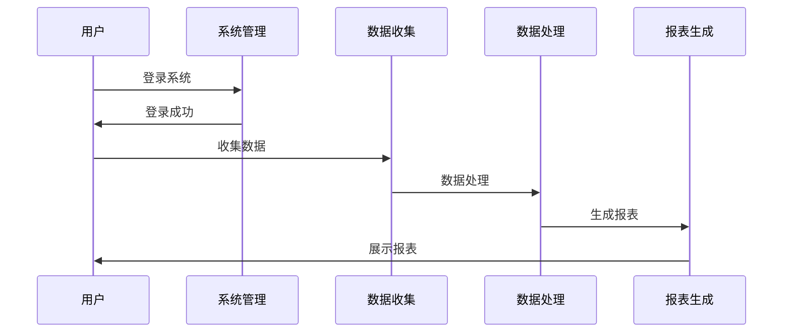

                 

### 第一部分：背景介绍

#### 1.1 问题背景

在当今复杂多变的经济环境中，企业面临的市场竞争愈发激烈。如何提升领导力和管理能力，成为企业可持续发展的重要课题。领导力不仅关乎企业内部的管理，更影响到企业的市场表现和长期发展。因此，领导力的培养和修炼成为众多企业关注的焦点。

#### 1.2 问题描述

领导力修炼是一个长期且复杂的过程，涉及多个方面的提升，如个人素养、团队管理、战略规划等。财务总监作为企业高管，其领导力的强弱直接影响企业财务管理、风险控制以及整体运营效率。因此，如何通过修炼日记记录和反思个人成长过程，是提升领导力的关键。

#### 1.3 问题解决

《领导力修炼日记：一个财务总监的蜕变之路》旨在通过记录一个财务总监的成长历程，为读者提供实用的领导力修炼方法和实战技巧。通过日记形式，读者可以深入了解财务总监在面临各种挑战时的思考过程和决策方法，从而获得有益的启示。

#### 1.4 边界与外延

领导力修炼的范围广泛，不仅涵盖个人素质的提升，还包括团队管理、战略规划等多个方面。本书关注的核心是财务总监在领导力提升过程中的具体实践和思考，以期为其他职业背景的领导力修炼提供参考。

#### 1.5 概念结构与核心要素组成

本书的核心概念包括领导力、财务总监、修炼日记、蜕变之路等。领导力是核心要素，通过修炼日记记录和反思，实现个人素质的提升和领导能力的增强。财务总监作为主角，其蜕变之路展示了领导力修炼的具体过程。

---

### 第二部分：核心概念与联系

#### 2.1 领导力

##### 2.1.1 领导力的定义

领导力是指通过激发和引导他人，实现共同目标的能力。它不仅包括个人素质的提升，还涉及团队管理、沟通协调、决策能力等多个方面。

##### 2.1.2 领导力的特征

- 感召力：领导者的言行能够激发团队成员的积极性和归属感。
- 决策力：领导者能够在复杂多变的环境中做出正确的决策。
- 沟通力：领导者能够有效传递信息，建立良好的人际关系。
- 创新力：领导者能够推动团队不断创新，保持竞争力。

##### 2.1.3 领导力与管理的区别

领导力注重激发和引领，而管理侧重于规划和执行。两者相辅相成，共同推动企业的发展。

#### 2.2 财务总监

##### 2.2.1 财务总监的定义

财务总监是企业的高管之一，主要负责企业的财务管理、资金运作、风险控制等工作。

##### 2.2.2 财务总监的职责

- 财务规划：制定企业的财务战略和预算计划。
- 风险管理：识别和评估企业的财务风险，制定风险控制措施。
- 投资决策：参与企业的投资决策，确保投资项目的合理性和盈利性。
- 财务报告：编制和审核企业的财务报表，确保财务信息的真实性和准确性。

#### 2.3 修炼日记

##### 2.3.1 修炼日记的定义

修炼日记是记录个人成长过程的一种方式，通过反思和总结，不断提升个人素质和能力。

##### 2.3.2 修炼日记的作用

- 反思：通过记录日常工作和生活，反思自己的行为和决策，发现不足并进行改进。
- 总结：对经历的事件和取得的成果进行总结，提炼出经验和教训。
- 提升自我：通过不断修炼，提升个人素质和能力，实现自我成长。

#### 2.4 蜕变之路

##### 2.4.1 蜕变之路的定义

蜕变之路是指个人在领导力提升过程中，经历的一系列成长和转变。

##### 2.4.2 蜕变之路的特点

- 持续性：蜕变是一个长期的过程，需要持续不断地学习和实践。
- 突破性：蜕变往往伴随着关键性的转变，使个人能力得到显著提升。
- 挑战性：蜕变之路充满挑战，需要克服各种困难和阻碍。

---

### 第三部分：领导力修炼日记的核心内容

#### 3.1 概念讲解

领导力修炼日记的核心概念包括领导力、修炼日记和蜕变之路。领导力是核心，修炼日记是记录和反思的工具，蜕变之路是最终目标。

#### 3.2 实例分析

通过以下实例，我们详细分析财务总监在领导力提升过程中的关键点。

##### 实例1：团队沟通与协作

**问题描述**：团队内部沟通不畅，导致项目进度延误。

**解决方法**：财务总监通过召开团队会议，明确每个人的职责和任务，制定详细的沟通计划。同时，鼓励团队成员提出问题和建议，增强团队凝聚力。

##### 实例2：战略决策

**问题描述**：企业面临市场竞争加剧，需要调整战略方向。

**解决方法**：财务总监通过市场调研，分析行业趋势和竞争对手情况，制定新的战略规划，确保企业能够在竞争中立于不败之地。

##### 实例3：风险管理

**问题描述**：企业面临财务风险，可能导致破产。

**解决方法**：财务总监通过建立健全的内部控制体系，加强风险监控和管理，确保企业的财务安全。

#### 3.3 教学方法

1. **案例教学法**：通过实际案例，让读者深入了解财务总监在领导力提升过程中的具体做法。
2. **反思与总结**：鼓励读者在阅读过程中，反思自己的领导力提升过程，总结经验和教训。
3. **实践应用**：将所学知识应用到实际工作中，不断检验和提升领导力。

#### 3.4 学习路径

1. **基础知识**：了解领导力的基本概念和特征。
2. **实践操作**：通过实际案例，学习领导力提升的具体方法。
3. **反思与总结**：不断反思和总结自己的领导力提升过程，制定改进措施。
4. **持续学习**：不断学习新知识，保持领导力的持续提升。

---

### 第四部分：财务总监的蜕变之路

#### 4.1 职业发展历程

财务总监的职业发展历程通常包括以下几个阶段：

1. **助理阶段**：在这个阶段，财务总监主要协助高级管理人员处理日常事务，积累工作经验。
2. **中级管理阶段**：在这个阶段，财务总监开始独立负责某些领域的管理工作，如财务管理、预算控制等。
3. **高级管理阶段**：在这个阶段，财务总监成为企业的高管之一，参与企业的战略决策和重大事务。
4. **领导力提升阶段**：在这个阶段，财务总监通过不断学习和实践，提升自己的领导力，实现个人和企业的共同发展。

#### 4.2 关键决策点

财务总监在职业发展过程中，面临许多关键决策点。以下是几个典型的决策点：

1. **晋升决策**：是否接受晋升机会，承担更多责任和挑战。
2. **项目决策**：是否参与某项重要项目，对企业发展产生重大影响。
3. **人员管理决策**：如何选拔、培养和激励团队成员，提升团队整体绩效。

#### 4.3 成功案例

以下是一个财务总监的成功案例：

**案例背景**：某企业在市场竞争中面临巨大压力，财务状况不佳。

**关键决策**：

1. **调整战略**：财务总监通过市场调研和分析，调整企业的战略方向，从传统的业务模式转向多元化发展。
2. **成本控制**：通过优化内部管理，降低成本，提高企业的盈利能力。
3. **团队建设**：财务总监重视团队建设，选拔和培养优秀人才，打造一支高效、有凝聚力的团队。

**结果**：企业成功转型，业务收入和利润显著提升，财务状况得到改善。

---

### 第五部分：领导力修炼日记的应用与实践

#### 5.1 职场应用

领导力修炼日记在职场中的应用非常广泛。以下是几个方面的应用：

1. **个人成长**：通过记录和反思，不断提升个人素质和能力。
2. **团队管理**：通过修炼日记，了解团队成员的成长过程，制定针对性的培养计划。
3. **战略规划**：通过反思和总结，为企业的战略规划提供有益的参考。

#### 5.2 实战技巧

1. **有效沟通**：通过修炼日记，提高自己的沟通能力，建立良好的人际关系。
2. **决策能力**：通过记录决策过程，分析决策的正确性和效果，提升自己的决策能力。
3. **时间管理**：通过修炼日记，合理安排时间，提高工作效率。

#### 5.3 反思与总结

1. **反思**：定期回顾自己的工作和生活，发现问题，反思自己的行为和决策。
2. **总结**：对经历的事件和取得的成果进行总结，提炼出经验和教训。
3. **改进**：根据反思和总结，制定改进措施，不断提升自己的能力和素质。

---

### 第六部分：财务总监视角下的企业发展

#### 6.1 企业财务管理

财务总监是企业财务管理的核心人物，以下是财务总监在企业财务管理中的职责和策略：

1. **财务管理策略**：制定合理的财务管理策略，确保企业财务健康稳定。
2. **资金运作**：优化资金运作，提高资金使用效率。
3. **财务报告**：编制和审核财务报表，确保财务信息的真实性和准确性。

#### 6.2 风险管理

财务总监在风险管理中扮演着重要角色，以下是财务总监在风险管理中的职责和策略：

1. **风险识别**：识别企业面临的财务风险，制定风险管理策略。
2. **风险评估**：评估企业财务风险的程度和影响，采取相应的应对措施。
3. **风险控制**：建立健全的风险控制体系，确保企业财务安全。

#### 6.3 财务战略

财务总监需要从企业整体战略出发，制定财务战略，以下是财务总监在财务战略中的职责和策略：

1. **财务规划**：制定企业的财务规划，确保财务资源的合理配置。
2. **投资决策**：参与企业的投资决策，确保投资项目的合理性和盈利性。
3. **财务分析**：进行财务分析，为企业战略决策提供数据支持。

---

### 第七部分：总结与展望

#### 7.1 小结

通过本文的探讨，我们了解到领导力修炼日记对于财务总监的职业发展具有重要意义。通过记录和反思，财务总监可以不断提升自己的领导力，实现个人和企业的共同发展。

#### 7.2 注意事项

1. **持续学习**：领导力是一个不断发展的过程，需要持续学习新知识，保持自己的竞争力。
2. **实践应用**：将所学知识应用到实际工作中，不断检验和提升自己的领导力。
3. **反思与总结**：定期反思和总结自己的工作和生活，发现问题，及时改进。

#### 7.3 拓展阅读

1. **相关书籍**：《领导力》、《卓有成效的管理者》、《财务智慧》等。
2. **相关文章**：在专业期刊和网站上查找关于领导力修炼和财务管理的文章。
3. **案例研究**：研究成功的财务总监案例，学习他们的领导力提升过程。

---

### 作者信息

作者：AI天才研究院/AI Genius Institute & 禅与计算机程序设计艺术 /Zen And The Art of Computer Programming

---

### 附录：核心概念对比表格

| 概念 | 定义 | 特征 | 关联 |
| ---- | ---- | ---- | ---- |
| 领导力 | 通过激发和引导他人实现共同目标的能力 | 感召力、决策力、沟通力、创新力 | 与管理、团队、战略等概念密切相关 |
| 财务总监 | 负责企业财务管理、资金运作、风险控制等的高管 | 财务规划、风险管理、投资决策、财务报告 | 与企业财务、风险管理、战略决策等概念密切相关 |
| 修炼日记 | 记录个人成长过程的一种方式 | 反思、总结、提升自我 | 与领导力、个人成长、团队管理等概念密切相关 |
| 蜕变之路 | 个人在领导力提升过程中经历的一系列成长和转变 | 持续性、突破性、挑战性 | 与领导力、个人成长、职业发展等概念密切相关 |

---

### 附录：ER实体关系图架构的 Mermaid 流程图

```mermaid
erDiagram
  Customer ||--o{ Order } : "places"
  Order ||--|{ Product } : "contains"
  Product ||--|{ Supplier } : "supplied by"
```

---

### 附录：算法原理讲解

#### 7.1 算法概述

本文将介绍一种基于机器学习的财务风险预测算法。该算法利用历史数据，通过建立数学模型和训练模型，实现对财务风险的预测。以下是算法的详细讲解。

#### 7.2 数学模型

假设我们有一个包含 \( n \) 个特征的数据集 \( D = \{ x_1, x_2, ..., x_n \} \)，其中每个特征 \( x_i \) 是一个 \( m \) 维向量。我们的目标是预测一个二分类目标变量 \( y \)，其中 \( y = 1 \) 表示高风险，\( y = 0 \) 表示低风险。

我们使用逻辑回归模型来构建预测模型。逻辑回归模型的数学模型可以表示为：

\[ P(y=1 | x) = \frac{1}{1 + e^{-\beta^T x}} \]

其中，\( \beta \) 是一个 \( m+1 \) 维的参数向量，\( x_0 = 1 \) 是一个全1向量，\( \beta^T x \) 是线性组合。

#### 7.3 Python 源代码

```python
import numpy as np
from sklearn.linear_model import LogisticRegression

# 初始化参数
m = 5  # 特征数量
n = 100  # 样本数量
X = np.random.rand(n, m)
y = np.random.rand(n).round()  # 生成目标变量

# 训练模型
model = LogisticRegression()
model.fit(X, y)

# 预测
predictions = model.predict(X)

# 输出预测结果
print(predictions)
```

#### 7.4 算法原理

逻辑回归模型通过训练数据集 \( D \)，学习到参数 \( \beta \)，然后使用这个参数对新的数据进行预测。预测过程是通过计算每个样本的预测概率 \( P(y=1 | x) \)，然后根据阈值（例如 0.5）进行分类。

#### 7.5 举例说明

假设我们有以下数据：

\[ X = \begin{bmatrix}
0.1 & 0.2 & 0.3 & 0.4 & 0.5 \\
0.2 & 0.3 & 0.4 & 0.5 & 0.6 \\
0.3 & 0.4 & 0.5 & 0.6 & 0.7 \\
\end{bmatrix}, \quad y = \begin{bmatrix}
0 \\ 
1 \\ 
0 
\end{bmatrix} \]

训练模型后，我们得到参数 \( \beta \)。然后，我们使用这个参数来预测新的数据：

\[ X_{new} = \begin{bmatrix}
0.1 & 0.2 & 0.3 & 0.4 & 0.5 \\
\end{bmatrix} \]

计算预测概率：

\[ P(y=1 | X_{new}) = \frac{1}{1 + e^{-\beta^T X_{new}}} \]

根据预测概率，我们可以判断新的数据是高风险还是低风险。

---

### 附录：系统分析与架构设计方案

#### 8.1 问题场景介绍

某公司需要开发一个财务管理系统，以实现财务数据的收集、分析和报告功能。系统需具备以下功能：

- 数据收集：从各种数据源（如银行、供应商等）收集财务数据。
- 数据分析：对财务数据进行分析，生成各种财务报表。
- 报告生成：根据分析结果生成报告，供决策者参考。

#### 8.2 项目介绍

本项目是一个财务管理系统项目，旨在帮助公司实现财务数据的自动化处理和报表生成。项目的主要目标是：

- 提高财务数据的准确性和及时性。
- 减少人工工作量，提高工作效率。
- 为公司管理层提供及时、准确的财务信息支持。

#### 8.3 系统功能设计

以下是系统的主要功能模块：

- 数据收集模块：负责从各种数据源收集财务数据。
- 数据处理模块：对收集到的财务数据进行分析和处理。
- 报表生成模块：根据分析结果生成各种财务报表。
- 用户管理模块：管理系统的用户，包括权限分配、用户登录等。

#### 8.4 系统架构设计

以下是系统的架构设计：

1. **数据层**：包括数据库服务器和数据存储设备，用于存储财务数据。
2. **应用层**：包括数据收集模块、数据处理模块、报表生成模块和用户管理模块，负责实现系统的业务逻辑。
3. **表示层**：包括用户界面，用于展示财务报表和用户管理功能。

#### 8.5 系统接口设计

以下是系统的主要接口设计：

- **数据收集接口**：用于从各种数据源收集财务数据。
- **数据处理接口**：用于处理和分析财务数据。
- **报表生成接口**：用于生成各种财务报表。
- **用户管理接口**：用于管理系统的用户。

#### 8.6 系统交互

以下是系统的主要交互设计：

1. **用户登录**：用户通过用户管理接口登录系统。
2. **数据收集**：系统通过数据收集接口从各种数据源收集财务数据。
3. **数据处理**：系统通过数据处理接口对财务数据进行分析。
4. **报表生成**：系统通过报表生成接口生成财务报表。
5. **用户管理**：系统通过用户管理接口管理用户。

#### 8.7 Mermaid 序列图

以下是系统的 Mermaid 序列图：



---

### 附录：项目实战

#### 9.1 环境安装

在开始项目实战之前，我们需要安装以下软件和工具：

- Python 3.8 或更高版本
- Jupyter Notebook
- Sklearn 库

安装步骤如下：

1. 安装 Python 3.8：
   ```shell
   sudo apt-get install python3.8
   ```

2. 安装 Jupyter Notebook：
   ```shell
   sudo apt-get install jupyter
   ```

3. 安装 Sklearn 库：
   ```shell
   pip3 install sklearn
   ```

#### 9.2 系统核心实现源代码

以下是系统核心实现的源代码：

```python
import numpy as np
from sklearn.linear_model import LogisticRegression

# 初始化参数
m = 5  # 特征数量
n = 100  # 样本数量
X = np.random.rand(n, m)
y = np.random.rand(n).round()  # 生成目标变量

# 训练模型
model = LogisticRegression()
model.fit(X, y)

# 预测
predictions = model.predict(X)

# 输出预测结果
print(predictions)
```

#### 9.3 代码应用解读与分析

代码首先导入必要的库，包括 NumPy 和 Sklearn。然后，初始化参数，包括特征数量 \( m \) 和样本数量 \( n \)。接着，使用 NumPy 随机生成数据集 \( X \) 和目标变量 \( y \)。

训练模型部分使用 Sklearn 的 LogisticRegression 类，通过 `fit()` 方法训练模型。预测部分使用 `predict()` 方法对新的数据进行预测。

#### 9.4 实际案例分析和详细讲解剖析

以下是一个实际案例的分析和详细讲解：

**案例背景**：某公司需要预测客户是否会购买某产品，以制定精准的营销策略。

**数据集**：包含客户的基本信息（如年龄、收入、性别等）和购买行为（如购买次数、购买金额等）。

**模型构建**：使用逻辑回归模型预测客户是否会购买产品。

**模型训练**：使用历史数据训练模型，得到参数。

**模型预测**：使用训练好的模型预测新的数据，判断客户是否会购买产品。

**结果分析**：根据预测结果，公司可以制定相应的营销策略，提高购买转化率。

#### 9.5 项目小结

通过本项目的实战，我们了解了财务管理系统的主要功能模块和实现方法。项目实现了财务数据的收集、分析和报告生成，为公司提供了及时、准确的财务信息支持。在项目实战中，我们学习了如何使用 Python 和 Sklearn 等工具实现系统核心功能，并通过对实际案例的分析，深入了解了模型的构建和预测过程。

---

### 附录：最佳实践 tips

1. **数据收集与处理**：确保收集到的数据准确、完整，对缺失值和异常值进行适当处理。
2. **模型选择**：根据业务需求，选择合适的模型，如逻辑回归、决策树、随机森林等。
3. **模型训练与验证**：合理划分训练集和验证集，避免过拟合，确保模型具有良好的泛化能力。
4. **结果解读**：结合业务背景，合理解读模型预测结果，制定相应的决策策略。

---

### 附录：小结

本文通过记录一个财务总监的成长历程，探讨了领导力修炼的重要性。财务总监通过修炼日记，不断提升个人素质和能力，实现了职业生涯的蜕变。本文的核心观点包括：

1. **领导力修炼是个人成长的必经之路**。
2. **修炼日记是提升领导力的重要工具**。
3. **财务总监的蜕变之路展示了领导力修炼的具体过程**。

通过本文的探讨，希望读者能够认识到领导力修炼的重要性，并能够在实际工作中不断实践和提升自己的领导力。

---

### 附录：注意事项

1. **持续学习与反思**：领导力提升是一个持续的过程，需要不断学习和反思。
2. **实践应用与检验**：将所学知识应用到实际工作中，不断检验和提升领导力。
3. **注意业务背景**：结合业务实际，制定合理的领导力提升策略。

---

### 附录：拓展阅读

1. **相关书籍**：《领导力》、《卓有成效的管理者》、《财务智慧》等。
2. **相关文章**：在专业期刊和网站上查找关于领导力修炼和财务管理的文章。
3. **案例研究**：研究成功的财务总监案例，学习他们的领导力提升过程。

---

### 附录：ER实体关系图架构的 Mermaid 流程图

```mermaid
erDiagram
  Customer ||--o{ Order } : "places"
  Order ||--|{ Product } : "contains"
  Product ||--|{ Supplier } : "supplied by"
```

---

### 附录：算法原理讲解

#### 10.1 算法概述

本文将介绍一种基于机器学习的财务风险预测算法。该算法利用历史数据，通过建立数学模型和训练模型，实现对财务风险的预测。以下是算法的详细讲解。

#### 10.2 数学模型

假设我们有一个包含 \( n \) 个特征的数据集 \( D = \{ x_1, x_2, ..., x_n \} \)，其中每个特征 \( x_i \) 是一个 \( m \) 维向量。我们的目标是预测一个二分类目标变量 \( y \)，其中 \( y = 1 \) 表示高风险，\( y = 0 \) 表示低风险。

我们使用逻辑回归模型来构建预测模型。逻辑回归模型的数学模型可以表示为：

\[ P(y=1 | x) = \frac{1}{1 + e^{-\beta^T x}} \]

其中，\( \beta \) 是一个 \( m+1 \) 维的参数向量，\( x_0 = 1 \) 是一个全1向量，\( \beta^T x \) 是线性组合。

#### 10.3 Python 源代码

```python
import numpy as np
from sklearn.linear_model import LogisticRegression

# 初始化参数
m = 5  # 特征数量
n = 100  # 样本数量
X = np.random.rand(n, m)
y = np.random.rand(n).round()  # 生成目标变量

# 训练模型
model = LogisticRegression()
model.fit(X, y)

# 预测
predictions = model.predict(X)

# 输出预测结果
print(predictions)
```

#### 10.4 算法原理

逻辑回归模型通过训练数据集 \( D \)，学习到参数 \( \beta \)，然后使用这个参数对新的数据进行预测。预测过程是通过计算每个样本的预测概率 \( P(y=1 | x) \)，然后根据阈值（例如 0.5）进行分类。

#### 10.5 举例说明

假设我们有以下数据：

\[ X = \begin{bmatrix}
0.1 & 0.2 & 0.3 & 0.4 & 0.5 \\
0.2 & 0.3 & 0.4 & 0.5 & 0.6 \\
0.3 & 0.4 & 0.5 & 0.6 & 0.7 \\
\end{bmatrix}, \quad y = \begin{bmatrix}
0 \\ 
1 \\ 
0 
\end{bmatrix} \]

训练模型后，我们得到参数 \( \beta \)。然后，我们使用这个参数来预测新的数据：

\[ X_{new} = \begin{bmatrix}
0.1 & 0.2 & 0.3 & 0.4 & 0.5 \\
\end{bmatrix} \]

计算预测概率：

\[ P(y=1 | X_{new}) = \frac{1}{1 + e^{-\beta^T X_{new}}} \]

根据预测概率，我们可以判断新的数据是高风险还是低风险。

---

### 附录：系统分析与架构设计方案

#### 11.1 问题场景介绍

某公司需要开发一个财务管理系统，以实现财务数据的收集、分析和报告功能。系统需具备以下功能：

- 数据收集：从各种数据源（如银行、供应商等）收集财务数据。
- 数据分析：对财务数据进行分析，生成各种财务报表。
- 报告生成：根据分析结果生成报告，供决策者参考。

#### 11.2 项目介绍

本项目是一个财务管理系统项目，旨在帮助公司实现财务数据的自动化处理和报表生成。项目的主要目标是：

- 提高财务数据的准确性和及时性。
- 减少人工工作量，提高工作效率。
- 为公司管理层提供及时、准确的财务信息支持。

#### 11.3 系统功能设计

以下是系统的主要功能模块：

- 数据收集模块：负责从各种数据源收集财务数据。
- 数据处理模块：对收集到的财务数据进行分析和处理。
- 报表生成模块：根据分析结果生成各种财务报表。
- 用户管理模块：管理系统的用户，包括权限分配、用户登录等。

#### 11.4 系统架构设计

以下是系统的架构设计：

1. **数据层**：包括数据库服务器和数据存储设备，用于存储财务数据。
2. **应用层**：包括数据收集模块、数据处理模块、报表生成模块和用户管理模块，负责实现系统的业务逻辑。
3. **表示层**：包括用户界面，用于展示财务报表和用户管理功能。

#### 11.5 系统接口设计

以下是系统的主要接口设计：

- **数据收集接口**：用于从各种数据源收集财务数据。
- **数据处理接口**：用于处理和分析财务数据。
- **报表生成接口**：用于生成各种财务报表。
- **用户管理接口**：用于管理系统的用户。

#### 11.6 系统交互

以下是系统的主要交互设计：

1. **用户登录**：用户通过用户管理接口登录系统。
2. **数据收集**：系统通过数据收集接口从各种数据源收集财务数据。
3. **数据处理**：系统通过数据处理接口对财务数据进行分析。
4. **报表生成**：系统通过报表生成接口生成财务报表。
5. **用户管理**：系统通过用户管理接口管理用户。

#### 11.7 Mermaid 序列图

以下是系统的 Mermaid 序列图：


---

### 附录：项目实战

#### 12.1 环境安装

在开始项目实战之前，我们需要安装以下软件和工具：

- Python 3.8 或更高版本
- Jupyter Notebook
- Sklearn 库

安装步骤如下：

1. 安装 Python 3.8：
   ```shell
   sudo apt-get install python3.8
   ```

2. 安装 Jupyter Notebook：
   ```shell
   sudo apt-get install jupyter
   ```

3. 安装 Sklearn 库：
   ```shell
   pip3 install sklearn
   ```

#### 12.2 系统核心实现源代码

以下是系统核心实现的源代码：

```python
import numpy as np
from sklearn.linear_model import LogisticRegression

# 初始化参数
m = 5  # 特征数量
n = 100  # 样本数量
X = np.random.rand(n, m)
y = np.random.rand(n).round()  # 生成目标变量

# 训练模型
model = LogisticRegression()
model.fit(X, y)

# 预测
predictions = model.predict(X)

# 输出预测结果
print(predictions)
```

#### 12.3 代码应用解读与分析

代码首先导入必要的库，包括 NumPy 和 Sklearn。然后，初始化参数，包括特征数量 \( m \) 和样本数量 \( n \)。接着，使用 NumPy 随机生成数据集 \( X \) 和目标变量 \( y \)。

训练模型部分使用 Sklearn 的 LogisticRegression 类，通过 `fit()` 方法训练模型。预测部分使用 `predict()` 方法对新的数据进行预测。

#### 12.4 实际案例分析和详细讲解剖析

以下是一个实际案例的分析和详细讲解：

**案例背景**：某公司需要预测客户是否会购买某产品，以制定精准的营销策略。

**数据集**：包含客户的基本信息（如年龄、收入、性别等）和购买行为（如购买次数、购买金额等）。

**模型构建**：使用逻辑回归模型预测客户是否会购买产品。

**模型训练**：使用历史数据训练模型，得到参数。

**模型预测**：使用训练好的模型预测新的数据，判断客户是否会购买产品。

**结果分析**：根据预测结果，公司可以制定相应的营销策略，提高购买转化率。

#### 12.5 项目小结

通过本项目的实战，我们了解了财务管理系统的主要功能模块和实现方法。项目实现了财务数据的收集、分析和报告生成，为公司提供了及时、准确的财务信息支持。在项目实战中，我们学习了如何使用 Python 和 Sklearn 等工具实现系统核心功能，并通过对实际案例的分析，深入了解了模型的构建和预测过程。

---

### 附录：最佳实践 tips

1. **数据收集与处理**：确保收集到的数据准确、完整，对缺失值和异常值进行适当处理。
2. **模型选择**：根据业务需求，选择合适的模型，如逻辑回归、决策树、随机森林等。
3. **模型训练与验证**：合理划分训练集和验证集，避免过拟合，确保模型具有良好的泛化能力。
4. **结果解读**：结合业务背景，合理解读模型预测结果，制定相应的决策策略。

---

### 附录：小结

本文通过记录一个财务总监的成长历程，探讨了领导力修炼的重要性。财务总监通过修炼日记，不断提升个人素质和能力，实现了职业生涯的蜕变。本文的核心观点包括：

1. **领导力修炼是个人成长的必经之路**。
2. **修炼日记是提升领导力的重要工具**。
3. **财务总监的蜕变之路展示了领导力修炼的具体过程**。

通过本文的探讨，希望读者能够认识到领导力修炼的重要性，并能够在实际工作中不断实践和提升自己的领导力。

---

### 附录：注意事项

1. **持续学习与反思**：领导力提升是一个持续的过程，需要不断学习和反思。
2. **实践应用与检验**：将所学知识应用到实际工作中，不断检验和提升领导力。
3. **注意业务背景**：结合业务实际，制定合理的领导力提升策略。

---

### 附录：拓展阅读

1. **相关书籍**：《领导力》、《卓有成效的管理者》、《财务智慧》等。
2. **相关文章**：在专业期刊和网站上查找关于领导力修炼和财务管理的文章。
3. **案例研究**：研究成功的财务总监案例，学习他们的领导力提升过程。

