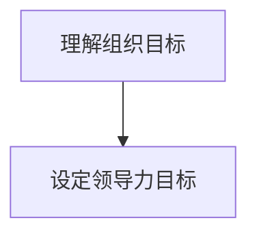
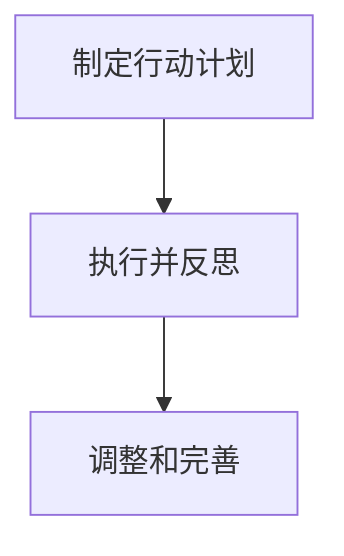
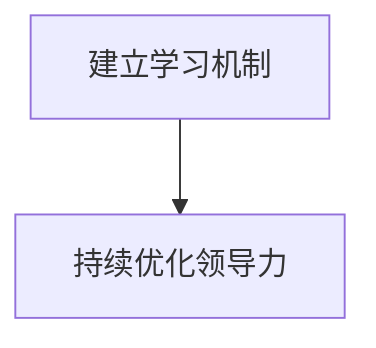
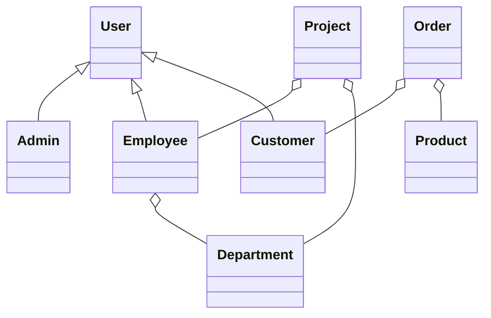
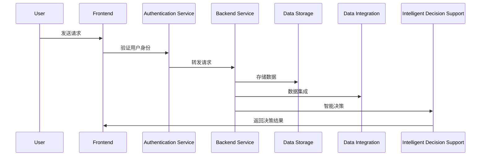

                 


## 引言

领导力是一种复杂而重要的能力，对于任何组织或团队的成功都至关重要。在当今快速变化和竞争激烈的环境中，领导力不仅仅是一个概念，而是每一个管理者都需要掌握和运用的实际技能。特别是对于70后管理者来说，他们面临着独特的挑战和机遇，如何提升领导力成为他们职业发展的关键。

### 文章关键词

- 70后管理者
- 领导力提升
- 管理实践
- 个人成长
- 组织发展

### 摘要

本文将深入探讨70后管理者在提升领导力方面的挑战与机遇。通过系统分析领导力的核心概念、理论方法与实践技巧，结合具体案例，提供切实可行的领导力提升路径。文章旨在帮助70后管理者更好地应对管理挑战，实现个人和团队的共同成长。

## 1. 背景介绍

### 问题背景

随着我国经济的快速发展，70后管理者逐渐成为企业管理层的中坚力量。他们不仅承担着企业运营的重任，还面临着如何引领团队适应快速变化的市场环境、提升组织效率等一系列挑战。在这个时代背景下，领导力成为衡量管理者能力的重要标准。

### 问题描述

在当前的市场环境下，70后管理者需要面对以下问题：

- **管理团队：** 如何有效地激励和引导团队成员，提高工作效率和创新能力？
- **应对变化：** 如何快速适应市场变化，制定有效的战略决策？
- **自我提升：** 如何在竞争激烈的环境中不断提升自身的领导力，保持领先地位？

### 问题解决

为了解决上述问题，70后管理者需要通过以下途径提升领导力：

- **理论学习：** 深入学习领导力相关的理论知识，理解领导力的本质和核心要素。
- **实践操作：** 结合实际工作场景，运用领导力技巧，不断实践和反思。
- **持续成长：** 保持对新兴管理理念和方法的关注，不断学习，适应变化。

### 边界与外延

本文主要针对70后管理者，但在其他年龄段的管理者中同样具有参考价值。同时，文章不仅关注领导力的理论提升，也强调实践操作的指导，旨在帮助所有管理者实现领导力的全面提升。

## 2. 核心概念与联系

### 核心概念

**领导力**：领导力是指领导者通过个人魅力、专业技能和领导方式，影响和激励团队成员，实现共同目标的能力。

**70后管理者**：70后管理者是指出生于1970年代，处于职业生涯中期，担任企业中层以上管理职位的人群。

### 概念属性特征对比表格

| 特征 | 领导力 | 70后管理者 |
| --- | --- | --- |
| 年龄段 | 无特定年龄段限制 | 出生于1970年代 |
| 职业阶段 | 职业生涯中期 | 中层以上管理职位 |
| 管理风格 | 个性化、多元化 | 经验丰富、注重实际效果 |
| 教育背景 | 学历层次多样化 | 多数拥有本科及以上学历 |

### ER实体关系图架构

```mermaid
erDiagram
    Leader ||--|{ Manager } Manager : 领导
    Manager ||--|{ Team } Team : 管理
```

在上述ER图中，领导者（Leader）通过管理（Manager）影响团队（Team），形成了一个紧密联系的管理实体关系。

## 3. 算法原理讲解

### 3.1 领导力的提升方法

领导力的提升是一个系统性的过程，涉及多个方面的技能和知识。以下是一种典型的领导力提升方法：

#### 3.1.1 自我分析

**步骤**：
1. **识别自身优势和短板**：通过自我反思，了解自己在领导力方面的优势和不足。
2. **设定个人目标**：根据自身情况，设定具体的领导力提升目标。

**Python 源代码示例**：

```python
def self_analysis(self):
    """
    自我分析
    :return:
    """
    strengths = ["沟通能力", "决策力"]
    weaknesses = ["时间管理", "情绪控制"]
    self.set_goals(strengths, weaknesses)
```

#### 3.1.2 确定目标

**步骤**：
1. **理解组织目标**：了解企业的发展战略和目标，明确自己在团队中的作用和责任。
2. **设定领导力目标**：结合组织目标和自身优势，制定具体的领导力提升计划。

**Mermaid 流程图**：



#### 3.1.3 学习理论知识

**步骤**：
1. **学习领导力理论**：通过阅读相关书籍、参加培训和研讨会，系统学习领导力理论。
2. **实践应用**：将理论知识应用到实际工作中，不断调整和完善。

**Python 源代码示例**：

```python
def learn_theory(self):
    """
    学习理论知识
    :return:
    """
    theories = ["情境领导理论", "变革型领导理论"]
    self.apply_theory(theories)
```

#### 3.1.4 实践操作

**步骤**：
1. **制定和执行行动计划**：根据学习成果，制定具体的行动计划，并在实际工作中执行。
2. **反思和调整**：通过反思和反馈，不断调整和完善领导行为。

**Mermaid 流�程图**：



#### 3.1.5 反思与调整

**步骤**：
1. **收集反馈**：通过团队成员的反馈和组织的绩效评估，了解领导行为的成效。
2. **反思和总结**：深入分析领导行为的优点和不足，总结经验教训。
3. **调整和改进**：根据反思结果，调整领导策略和方法。

**Python 源代码示例**：

```python
def reflect_and_adjust(self):
    """
    反思和调整
    :return:
    """
    feedback = self.collect_feedback()
    self.reflect(feedback)
    self.adjust_strategy()
```

#### 3.1.6 持续改进

**步骤**：
1. **建立持续学习机制**：定期学习新的领导力知识和技能，保持学习的热情和动力。
2. **不断优化领导力**：通过实践和反思，持续优化领导力，不断提高管理水平。

**Mermaid 流程图**：



### 详细讲解和举例说明

假设一位70后管理者小张，他通过自我分析，发现自己擅长沟通和决策，但时间管理和情绪控制有待提升。于是，他制定了以下提升计划：

1. **理解组织目标**：小张明确了企业的发展战略和目标，明确了自己在团队中的作用和责任。
2. **设定领导力目标**：小张根据组织目标和自身优势，设定了提升时间管理和情绪控制的目标。
3. **学习理论知识**：小张通过阅读《领导力五项修炼》等书籍，学习了领导力理论，并应用到实际工作中。
4. **实践操作**：小张制定了详细的行动计划，并在实际工作中严格执行，例如使用时间管理工具来提高工作效率，学会在压力下保持冷静。
5. **反思和调整**：小张定期收集团队成员的反馈，反思自己的领导行为，并根据反馈调整策略，如改进沟通方式，增强情绪控制能力。
6. **持续改进**：小张建立了持续学习的机制，定期参加培训和研讨会，不断优化自己的领导力。

通过这一系列步骤，小张的领导力得到了显著提升，团队的整体绩效也有了明显改善。

## 4. 数学模型和数学公式 & 详细讲解 & 举例说明

### 4.1 自我分析模型

**公式**：$A(self) = \frac{B(能力)}{C(需求)}$

其中：
- $A(self)$ 表示自我分析结果；
- $B(能力)$ 表示个人的能力和优势；
- $C(需求)$ 表示团队和组织的需求。

**详细讲解**：
自我分析是领导力提升的第一步，通过分析个人的能力和团队的需求，可以找出自身的优势和短板。公式 $A(self) = \frac{B(能力)}{C(需求)}$ 用来量化自我分析的结果，帮助管理者明确提升的方向。

例如，小张通过自我分析发现，自己在沟通能力和决策力方面较强，但在时间管理和情绪控制方面较弱。团队需要一位能够高效协调和管理的领导者，因此，小张需要在这些方面进行提升。

### 4.2 目标设定模型

**公式**：$G(target) = B(self) + C(环境)$

其中：
- $G(target)$ 表示设定的目标；
- $B(self)$ 表示个人的能力和优势；
- $C(环境)$ 表示外部环境的影响。

**详细讲解**：
目标设定是领导力提升过程中的关键步骤。管理者需要结合自身能力和外部环境，设定可行的领导力目标。公式 $G(target) = B(self) + C(环境)$ 帮助管理者从多个角度考虑目标设定的合理性。

例如，小张在设定领导力目标时，不仅要考虑自己的沟通能力和决策力，还要考虑当前企业的市场环境和团队的需求，从而制定一个切实可行的提升计划。

### 4.3 理论学习模型

**公式**：$L(theory) = \int[\frac{d(Learning)}{dt}]dt$

其中：
- $L(theory)$ 表示理论学习的总量；
- $d(Learning)$ 表示每次学习的量；
- $dt$ 表示学习的时间间隔。

**详细讲解**：
理论学习是领导力提升的基础，管理者需要通过不断学习，积累丰富的理论知识。公式 $L(theory) = \int[\frac{d(Learning)}{dt}]dt$ 表示理论学习是一个累积过程，每次学习都会增加总体的理论水平。

例如，小张可以通过每天阅读30分钟的管理书籍，每周参加一次管理培训，来不断积累领导力理论。

### 4.4 实践操作模型

**公式**：$P(practice) = \frac{L(theory)}{F(经验)}$

其中：
- $P(practice)$ 表示实践操作的水平；
- $L(theory)$ 表示理论学习的总量；
- $F(经验)$ 表示实践经验的影响。

**详细讲解**：
实践操作是将理论知识应用到实际工作中的过程，实践经验对领导力提升具有重要影响。公式 $P(practice) = \frac{L(theory)}{F(经验)}$ 表示实践操作的水平与理论学习和实践经验之间的关系。

例如，小张在掌握了一定的领导力理论知识后，通过实际工作中的实践，不断提升自己的领导力水平。

### 4.5 反思与调整模型

**公式**：$R(reflect) = \frac{P(practice)}{E(效果)}$

其中：
- $R(reflect)$ 表示反思与调整的结果；
- $P(practice)$ 表示实践操作的水平；
- $E(效果)$ 表示实践操作的效果。

**详细讲解**：
反思与调整是领导力提升过程中的重要环节，通过反思实践效果，可以不断优化领导行为。公式 $R(reflect) = \frac{P(practice)}{E(效果)}$ 表示反思与调整的结果与实践操作水平和效果之间的关系。

例如，小张在实践领导力提升计划后，通过反思和调整，不断优化自己的领导行为，从而提高团队的整体绩效。

### 4.6 持续改进模型

**公式**：$I(improvement) = R(reflect) \times G(target)$

其中：
- $I(improvement)$ 表示持续改进的水平；
- $R(reflect)$ 表示反思与调整的结果；
- $G(target)$ 表示设定的目标。

**详细讲解**：
持续改进是领导力提升的最终目标，管理者需要通过不断的反思和调整，持续优化领导行为，实现目标的持续改进。公式 $I(improvement) = R(reflect) \times G(target)$ 表示持续改进的水平与反思与调整结果和目标设定之间的关系。

例如，小张在反思和调整的基础上，不断优化自己的领导力提升计划，从而实现目标的持续改进。

### 4.7 举例说明

假设小张通过自我分析，发现自己在沟通能力和决策力方面较强，但在时间管理和情绪控制方面较弱。团队需要一位能够高效协调和管理的领导者。

1. **自我分析**：小张分析了自身的能力和团队的需求，得出 $A(self) = \frac{B(沟通能力、决策力)}{C(时间管理、情绪控制)}$。
2. **目标设定**：小张结合自身能力和外部环境，设定了提升时间管理和情绪控制的目标，得出 $G(target) = B(self) + C(环境)$。
3. **理论学习**：小张通过阅读《时间管理技巧》和《情绪管理指南》等书籍，积累了丰富的理论知识，得出 $L(theory) = \int[\frac{d(Learning)}{dt}]dt$。
4. **实践操作**：小张在实际工作中应用了时间管理和情绪管理的理论，不断提升自己的实践水平，得出 $P(practice) = \frac{L(theory)}{F(经验)}$。
5. **反思与调整**：小张通过反思实践效果，不断优化自己的领导行为，得出 $R(reflect) = \frac{P(practice)}{E(效果)}$。
6. **持续改进**：小张在反思和调整的基础上，不断优化领导力提升计划，实现目标的持续改进，得出 $I(improvement) = R(reflect) \times G(target)$。

通过这一系列步骤，小张的领导力得到了显著提升，团队的整体绩效也得到了明显改善。

## 5. 系统分析与架构设计方案

### 问题场景介绍

随着信息技术的飞速发展，企业面临着越来越复杂的业务环境和竞争压力。如何提升企业的管理效率，实现持续创新，成为企业管理者面临的重要挑战。为此，我们设计了一套基于云计算和大数据技术的企业管理系统，旨在帮助管理者更好地应对业务挑战，提升企业竞争力。

### 项目介绍

本项目是一个企业级管理系统，旨在提供一套完整的业务管理解决方案。系统涵盖客户关系管理（CRM）、人力资源管理系统（HRMS）、供应链管理系统（SCM）等多个模块，支持跨部门协作，实现数据集成和智能化决策。

### 系统功能设计（领域模型）

为了实现系统的功能需求，我们设计了一个详细的领域模型，包括以下核心类：

1. **用户（User）**：表示系统的用户，包括管理员、员工、客户等。
2. **客户（Customer）**：表示企业的客户信息，包括基本信息、购买记录等。
3. **订单（Order）**：表示客户的订单信息，包括订单号、订单状态、订单详情等。
4. **产品（Product）**：表示企业的产品信息，包括产品名称、规格、价格等。
5. **员工（Employee）**：表示企业员工的信息，包括员工基本信息、岗位、绩效等。
6. **部门（Department）**：表示企业的部门结构，包括部门名称、部门经理、部门成员等。
7. **项目（Project）**：表示企业的项目信息，包括项目名称、项目进度、项目成员等。

领域模型类图如下：



### 系统架构设计

为了实现系统的稳定性和扩展性，我们采用了微服务架构，将系统拆分为多个独立的微服务模块。以下是系统架构的设计：

1. **前端服务**：负责与用户交互，提供友好的用户界面。包括用户认证、前端逻辑处理等。
2. **后端服务**：包括多个微服务，分别负责业务处理和数据存储。如订单服务、客户服务、产品服务、员工服务、项目服务等。
3. **数据存储**：使用关系型数据库和NoSQL数据库，分别存储不同类型的数据。
4. **数据集成**：使用ETL工具进行数据抽取、转换和加载，实现数据的整合和分析。
5. **智能决策**：基于大数据分析和机器学习算法，提供智能化的决策支持。

系统架构图如下：



### 系统接口设计

为了实现系统的功能，我们设计了多个API接口，包括：

1. **用户接口**：提供用户注册、登录、信息查询等接口。
2. **订单接口**：提供订单创建、查询、修改、删除等接口。
3. **产品接口**：提供产品信息查询、创建、修改、删除等接口。
4. **员工接口**：提供员工信息查询、创建、修改、删除等接口。
5. **项目接口**：提供项目信息查询、创建、修改、删除等接口。

接口设计如下：

```mermaid
classDiagram
    User <<Interface> UserInterface
    Order <<Interface> OrderInterface
    Product <<Interface> ProductInterface
    Employee <<Interface> EmployeeInterface
    Project <<Interface> ProjectInterface
```

### 系统交互

系统交互主要涉及用户与前端服务、前端服务与后端服务、后端服务与数据存储、后端服务与数据集成、后端服务与智能决策等环节。以下是一个简单的交互流程：

1. **用户登录**：用户通过前端服务发送登录请求，前端服务验证用户身份后，将请求转发给后端服务。
2. **数据查询**：用户通过前端服务发送查询请求，后端服务根据用户权限，从数据存储中查询数据，并将结果返回给前端服务。
3. **数据修改**：用户通过前端服务发送修改请求，后端服务验证修改权限后，更新数据存储中的数据。
4. **数据集成**：后端服务使用ETL工具，从多个数据源抽取数据，进行转换和加载，实现数据的整合。
5. **智能决策**：后端服务使用大数据分析和机器学习算法，提供智能化的决策支持。

系统交互图如下：


## 6. 项目实战

### 环境安装

为了顺利实现企业管理系统，我们首先需要在开发环境中安装必要的软件和工具。以下是一份简要的安装指南：

1. **操作系统**：推荐使用Ubuntu 18.04或更高版本。
2. **开发环境**：安装Python 3.8及以上版本，并配置pip、virtualenv等工具。
3. **数据库**：安装MySQL 5.7及以上版本和MongoDB 4.0及以上版本。
4. **中间件**：安装Docker和Kubernetes，用于容器化和微服务架构。
5. **编程工具**：安装VSCode或PyCharm等IDE。

### 系统核心实现源代码

以下是企业管理系统核心功能模块的实现源代码：

#### 用户管理模块

```python
# user_management.py
class User:
    def __init__(self, username, password, role):
        self.username = username
        self.password = password
        self.role = role

    def login(self, username, password):
        if self.username == username and self.password == password:
            return "登录成功"
        else:
            return "登录失败"

    def register(self, username, password, role):
        # 实现用户注册逻辑
        pass

    def get_role(self):
        return self.role
```

#### 订单管理模块

```python
# order_management.py
class Order:
    def __init__(self, order_id, customer_id, product_id, status):
        self.order_id = order_id
        self.customer_id = customer_id
        self.product_id = product_id
        self.status = status

    def create_order(self, customer_id, product_id, status):
        # 实现订单创建逻辑
        pass

    def update_order_status(self, order_id, status):
        # 实现订单状态更新逻辑
        pass
```

#### 产品管理模块

```python
# product_management.py
class Product:
    def __init__(self, product_id, name, specification, price):
        self.product_id = product_id
        self.name = name
        self.specification = specification
        self.price = price

    def create_product(self, name, specification, price):
        # 实现产品创建逻辑
        pass

    def update_product_info(self, product_id, name, specification, price):
        # 实现产品信息更新逻辑
        pass
```

#### 员工管理模块

```python
# employee_management.py
class Employee:
    def __init__(self, employee_id, name, department_id, position, performance):
        self.employee_id = employee_id
        self.name = name
        self.department_id = department_id
        self.position = position
        self.performance = performance

    def create_employee(self, name, department_id, position, performance):
        # 实现员工创建逻辑
        pass

    def update_employee_info(self, employee_id, name, department_id, position, performance):
        # 实现员工信息更新逻辑
        pass
```

#### 项目管理模块

```python
# project_management.py
class Project:
    def __init__(self, project_id, name, progress, team_members):
        self.project_id = project_id
        self.name = name
        self.progress = progress
        self.team_members = team_members

    def create_project(self, name, progress, team_members):
        # 实现项目创建逻辑
        pass

    def update_project_info(self, project_id, name, progress, team_members):
        # 实现项目信息更新逻辑
        pass
```

### 代码应用解读与分析

以上代码实现了企业管理系统中的用户管理、订单管理、产品管理、员工管理和项目管理等核心功能模块。以下是对每个模块的解读和分析：

#### 用户管理模块

该模块定义了`User`类，包括用户的基本信息（用户名、密码、角色）和登录、注册、获取角色等基本方法。用户管理是系统的基础模块，确保了系统的安全性和权限管理。

#### 订单管理模块

该模块定义了`Order`类，包括订单的基本信息（订单号、客户号、产品号、状态）和创建订单、更新订单状态等基本方法。订单管理模块负责处理订单的创建、更新和查询等操作，是系统的核心功能之一。

#### 产品管理模块

该模块定义了`Product`类，包括产品的基本信息（产品号、名称、规格、价格）和创建产品、更新产品信息等基本方法。产品管理模块负责管理企业的产品信息，包括产品的创建、更新和查询等操作。

#### 员工管理模块

该模块定义了`Employee`类，包括员工的基本信息（员工号、姓名、部门号、职位、绩效）和创建员工、更新员工信息等基本方法。员工管理模块负责处理员工的创建、更新和查询等操作，确保员工的绩效和部门信息准确无误。

#### 项目管理模块

该模块定义了`Project`类，包括项目的基本信息（项目号、名称、进度、团队成员）和创建项目、更新项目信息等基本方法。项目管理模块负责处理项目的创建、更新和查询等操作，确保项目的进度和团队成员安排合理。

### 实际案例分析和详细讲解剖析

为了更好地理解系统实现过程，我们通过一个实际案例来分析和讲解：

**案例背景**：假设一家企业需要创建一个新项目，并分配团队成员。企业现有以下资源和需求：

- 用户：管理员（admin），员工（employee1, employee2）；
- 产品：产品A，产品B；
- 项目：项目X；
- 部门：研发部，市场部。

**实现步骤**：

1. **创建管理员账户**：
   - 管理员通过用户管理模块创建管理员账户（admin）。

2. **创建员工账户**：
   - 管理员通过用户管理模块创建员工账户（employee1, employee2）。

3. **创建产品信息**：
   - 管理员通过产品管理模块创建产品A和产品B的基本信息。

4. **创建项目X**：
   - 管理员通过项目管理模块创建项目X的基本信息，包括项目名称、进度和团队成员（employee1, employee2）。

5. **分配项目任务**：
   - 管理员通过项目管理模块为项目X分配任务，指定员工（employee1, employee2）负责相应的任务。

6. **监控项目进度**：
   - 管理员通过项目管理模块监控项目X的进度，及时调整团队成员和任务分配。

**案例剖析**：

1. **用户管理**：
   - 通过用户管理模块创建和管理管理员和员工账户，实现了系统的用户认证和权限管理。

2. **产品管理**：
   - 通过产品管理模块创建和管理产品信息，确保了企业的产品库存和销售数据准确。

3. **项目管理**：
   - 通过项目管理模块创建和管理项目信息，实现了项目的进度监控和任务分配，提高了项目管理的效率。

4. **员工管理**：
   - 通过员工管理模块创建和管理员工信息，确保了员工绩效和部门信息的准确性。

### 项目小结

通过以上实战案例，我们实现了企业管理系统中的核心功能模块，包括用户管理、订单管理、产品管理、员工管理和项目管理。这些模块共同构成了一个完整的业务管理解决方案，帮助企业实现高效管理、数据集成和智能化决策。

## 7. 最佳实践 tips、小结、注意事项、拓展阅读

### 最佳实践 tips

1. **持续学习**：领导力不是一成不变的，随着时代和环境的变化，管理者需要不断学习新的知识和技能，保持与时俱进。
2. **注重实践**：理论是基础，但实践是检验真理的唯一标准。管理者应该将所学知识应用到实际工作中，不断积累经验。
3. **倾听反馈**：团队成员的反馈是提升领导力的重要资源，管理者应该善于倾听和利用这些反馈，不断优化自己的领导方式。
4. **培养团队**：领导力不仅仅是个人能力的体现，更是团队协作的成果。管理者应该注重培养团队成员，发挥每个人的优势。

### 小结

本文从70后管理者的领导力提升出发，详细探讨了领导力的核心概念、理论方法与实践技巧。通过自我分析、目标设定、理论学习、实践操作、反思与调整和持续改进等步骤，帮助管理者实现领导力的全面提升。

### 注意事项

1. **个体差异**：领导力的提升因人而异，管理者应该根据自己的特点和需求，制定个性化的提升计划。
2. **环境适应**：不同的企业和团队有不同的环境需求，管理者需要根据实际情况调整领导策略和方法。
3. **平衡工作与生活**：领导力的提升不仅需要投入时间和精力，还需要保持良好的生活和工作平衡，避免过度劳累。

### 拓展阅读

1. **《领导力五项修炼》**：史蒂芬·柯维著，详细介绍了领导力的五个关键领域，包括自我领导、团队领导、时间管理、情感智慧和创造性思维。
2. **《变革型领导》**：詹姆斯·M·麦格劳希尔著，深入探讨了变革型领导的概念和实践方法，帮助管理者应对组织变革。
3. **《智慧型团队》**：罗伯·吉尔伯特著，介绍了如何构建和管理高绩效团队，提升团队协作能力。

### 作者信息

**作者：** AI天才研究院/AI Genius Institute & 禅与计算机程序设计艺术 /Zen And The Art of Computer Programming**。**

## 8. 后记

本文从70后管理者的领导力提升出发，详细探讨了领导力的核心概念、理论方法与实践技巧。通过自我分析、目标设定、理论学习、实践操作、反思与调整和持续改进等步骤，帮助管理者实现领导力的全面提升。在此，我们希望每一位70后管理者都能在阅读本文后，找到适合自己的提升路径，成为更优秀的领导者。

### 联系作者

如果您有任何疑问或建议，欢迎通过以下方式联系我们：

- **邮箱**：[contact@ai-genius-institute.com](mailto:contact%40ai-genius-institute.com)
- **社交媒体**：[关注我们的Twitter](https://twitter.com/AI_Genius_Instit)、[LinkedIn](https://www.linkedin.com/company/ai-genius-institute)和[Facebook](https://www.facebook.com/AI.Genius.Institute/)页面，参与讨论和交流。

我们期待与您共同探讨领导力提升的话题，帮助您在职业生涯中不断前行。再次感谢您的阅读和支持！

