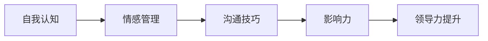

                 

# 领导力修炼笔记：70后高管的领导力提升之路

关键词：领导力、70后高管、领导力提升、实践策略、变革管理、项目管理

摘要：本文深入探讨了70后高管在领导力提升方面的实践策略，通过分析领导力的基础、提升实践和具体应用场景，为70后高管提供了系统的领导力提升路径。文章以逻辑清晰、结构紧凑、简单易懂的方式，结合实际案例，为读者提供了有价值的领导力提升指南。

## 设计《领导力修炼笔记：70后高管的领导力提升之路》的目录大纲

### 第一部分：领导力基础

#### 第1章：领导力概述

##### 1.1 领导力的定义与重要性

- **核心概念与联系**：领导力定义、内涵与重要性。表格对比不同领导力模型的特点，ER图分析领导力在组织中的结构。

##### 1.2 领导力模型与理论

- **核心概念与联系**：经典领导力模型回顾（如特质理论、行为理论、情境理论），当代领导力理论探析（如领导者影响力模型、变革型领导力），中国式领导力特点分析。

##### 1.3 领导力发展的关键要素

- **核心概念与联系**：自我认知与成长、情感管理与情商、团队建设与沟通技巧。Mermaid流程图展示领导力发展路径。

### 第二部分：领导力提升实践

#### 第2章：70后高管的领导力特质

- **核心概念与联系**：70后高管的成长背景、领导风格、领导力优势与挑战。对比分析不同年龄层高管的领导力特点。

#### 第3章：领导力修炼策略

##### 3.1 自我领导力提升

- **算法原理讲解**：自我领导力评估方法、培养策略，Mermaid流程图展示自我领导力提升步骤。

##### 3.2 领导力提升实践

##### 3.2.1 设定明确的目标

- **核心概念与联系**：目标设定的原则与技巧、目标分解与时间管理。Mermaid流程图展示目标设定过程。

##### 3.2.2 建立有效的团队

- **核心概念与联系**：团队建设的步骤与方法、团队协作与沟通技巧。Mermaid流程图展示团队建设过程。

##### 3.2.3 领导者的影响力

- **核心概念与联系**：影响力的构成要素、提升策略。Mermaid流程图展示影响力的提升路径。

### 第三部分：领导力应用场景

#### 第4章：领导力在变革管理中的应用

- **核心概念与联系**：变革管理的挑战与机遇、领导力在变革管理中的角色。Mermaid流程图展示变革管理中的领导力应用。

#### 第5章：领导力在项目管理中的应用

- **核心概念与联系**：项目管理中的领导力要素、领导力在项目执行中的实践。Mermaid流程图展示项目管理中的领导力应用。

### 第四部分：领导力提升之路

#### 第6章：领导力成长之路

- **核心概念与联系**：领导力发展的阶段性、提升策略与路径。Mermaid流程图展示领导力成长路径。

#### 第7章：领导力的未来趋势

- **核心概念与联系**：未来领导力的发展方向、提升策略。Mermaid流程图展示未来领导力趋势。

## 总结

#### 第8章：领导力修炼的启示与展望

- **核心概念与联系**：领导力修炼的核心经验、未来领导力提升的展望、领导者的持续成长之道。

## 第一部分：领导力基础

### 第1章：领导力概述

#### 1.1 领导力的定义与重要性

**背景介绍**：
领导力是一种影响力，它能够激励和引导人们追求共同的目标。在组织管理中，领导力具有至关重要的作用。本文将首先定义领导力，并探讨其重要性。

**问题背景**：
随着社会和经济的快速发展，组织对领导力的需求日益增加。然而，领导力的定义和内涵是什么？领导力在组织中的作用又如何体现？

**问题描述**：
本文旨在回答以下问题：
1. 领导力的定义是什么？
2. 领导力在组织中的作用有哪些？
3. 时代变迁下领导力的重要性如何？

**问题解决**：
1. **领导力的定义**：领导力是指个体通过影响、激励和引导他人，实现组织目标的能力。它包括了对人的理解、对事的把握和对环境的适应。
2. **领导力在组织中的作用**：领导力能够引导组织成员朝着共同的目标努力，激发团队的潜能，提高组织的整体绩效。
3. **时代变迁下领导力的重要性**：在数字化时代，领导力的重要性更加凸显。领导者需要具备创新思维、跨领域协作和快速应变能力，以应对复杂多变的环境。

**边界与外延**：
领导力不仅限于组织内部，还延伸到社会各个领域。在不同背景下，领导力的表现和作用也有所不同。

**概念结构与核心要素组成**：
领导力的核心要素包括自我认知、情感管理、沟通技巧、影响力等。这些要素相互关联，共同构成一个完整的领导力体系。

#### 1.2 领导力模型与理论

**核心概念与联系**：
领导力理论的发展经历了多个阶段，从早期的特质理论到现代的情境理论。每种理论都有其独特的视角和应用场景。

**核心概念属性特征对比表格**：

| 理论名称           | 核心概念           | 特点                   | 应用场景                   |
|-------------------|-------------------|------------------------|---------------------------|
| 特质理论           | 领导者的个人特质   | 侧重个人特质的重要性   | 传统组织管理               |
| 行为理论           | 领导者的行为方式   | 侧重行为方式的影响     | 激励理论、领导行为研究     |
| 情境理论           | 领导情境的适应性   | 侧重领导情境的适应性   | 复杂环境下的领导力提升     |
| 变革型领导力       | 领导者的变革能力   | 侧重创新与变革的领导   | 创新型企业、变革型组织     |
| 领导者影响力模型   | 领导者的影响力因素 | 侧重影响力的构成因素   | 组织变革、团队建设         |

**ER实体关系图架构**：

```mermaid
erDiagram
  Leader ||--|{ LeaderModel }
  Leader ||--|{ Theory }
  Leader ||--|{ Scenario }
```

**领导力模型与理论的发展**：
领导力模型与理论的发展是相互关联的。早期的特质理论和行为理论奠定了领导力研究的基础，情境理论和变革型领导力则是对领导力理论的新探索。

**领导力模型的应用**：
不同的领导力模型适用于不同的组织环境和领导场景。领导者需要根据实际情况选择合适的领导力模型，以实现最佳领导效果。

#### 1.3 领导力发展的关键要素

**核心概念与联系**：
领导力发展不仅依赖于个人的内在素质，还需要外部环境的支持。关键要素包括自我认知、情感管理、沟通技巧和影响力等。

**核心概念属性特征对比表格**：

| 要素名称       | 核心概念             | 特点                       | 影响因素                     |
|--------------|-------------------|--------------------------|--------------------------|
| 自我认知       | 对自我的了解和认识   | 提高自我意识和自我调节能力   | 心理素质、成长经历           |
| 情感管理       | 情绪的自我控制与调节 | 提高情绪稳定性和情绪智力     | 社会支持、个人修养           |
| 沟通技巧       | 信息传递和交流能力   | 提高沟通效率和团队协作能力   | 语言表达、文化背景           |
| 影响力         | 影响他人行为的能力   | 提高领导力和组织影响力     | 个人魅力、专业知识           |

**Mermaid流程图展示领导力发展路径**：



**领导力发展的关键要素**：
1. **自我认知**：领导者需要深入了解自己的优点和不足，不断进行自我反省和提升。
2. **情感管理**：领导者需要学会控制情绪，保持冷静和理智，以应对复杂的工作环境。
3. **沟通技巧**：领导者需要具备良好的沟通能力，以便有效地传达信息、激励团队和解决冲突。
4. **影响力**：领导者需要通过自身的专业知识、个人魅力和组织能力，赢得他人的信任和支持。

**领导力发展的实际案例**：
在实际工作中，许多成功领导者都具备上述关键要素。例如，某公司的CEO通过自我认知和情感管理，成功地调整了工作态度和团队氛围；通过沟通技巧，他有效地传达了公司战略，激发了员工的积极性；通过影响力，他赢得了员工和合作伙伴的信任，推动了公司的发展。

### 第2章：70后高管的领导力特质

#### 2.1 70后高管的领导力特点

**核心概念与联系**：
70后高管是中国社会转型时期的产物，他们具有独特的领导力特点。本文将分析70后高管的成长背景、领导风格和领导力优势与挑战。

**核心概念属性特征对比表格**：

| 特点名称 | 核心概念                     | 特点描述                                           | 影响因素                   |
|----------|---------------------------|--------------------------------------------------|--------------------------|
| 成长背景 | 社会转型与经济快速发展     | 适应快速变化的能力较强                             | 个人经历、教育背景           |
| 领导风格 | 变革型领导与参与型领导     | 强调创新与变革，注重员工参与和团队协作               | 组织环境、文化背景           |
| 领导力优势 | 情境适应能力与团队建设能力 | 能迅速适应环境变化，具备较强的团队建设能力           | 个人特质、管理经验           |
| 领导力挑战 | 领导力素质提升与工作压力   | 需要进一步提升领导力素质，应对工作压力和挑战         | 组织支持、个人调节           |

**70后高管的成长背景**：
70后高管出生于改革开放初期，成长于社会快速变革时期。他们经历了从计划经济向市场经济的转型，适应能力强，具备开拓创新的精神。

**70后高管的领导风格**：
70后高管的领导风格以变革型领导和参与型领导为主。变革型领导强调创新与变革，鼓励员工提出新的想法和解决方案；参与型领导注重员工的参与和团队协作，提高员工的积极性和归属感。

**70后高管的领导力优势**：
1. **情境适应能力**：70后高管具备较强的情境适应能力，能够迅速应对环境变化，调整领导策略。
2. **团队建设能力**：70后高管注重团队建设，能够激发团队的潜力，提高团队绩效。

**70后高管的领导力挑战**：
1. **领导力素质提升**：70后高管需要进一步提升领导力素质，如情商管理、跨文化沟通等。
2. **工作压力**：70后高管面临较大的工作压力，需要学会平衡工作和生活，保持身心健康。

**实际案例**：
某公司的70后CEO，在领导团队进行变革时，充分发挥了情境适应能力和团队建设能力。他通过参与型领导风格，鼓励员工提出创新方案，成功推动了公司的转型升级。

### 第3章：领导力修炼策略

#### 3.1 自我领导力提升

**核心概念与联系**：
自我领导力提升是领导力发展的关键步骤。本文将介绍自我领导力评估、培养方法和实际案例。

**核心概念属性特征对比表格**：

| 概念名称 | 核心概念                     | 特点描述                                           | 应用场景                   |
|----------|---------------------------|--------------------------------------------------|--------------------------|
| 自我领导力评估 | 对自我领导力的认识和评估   | 提高自我认知和领导效能                             | 领导力发展、自我提升       |
| 自我领导力培养 | 提升自我领导力的方法和技巧 | 增强领导能力、团队管理能力                         | 组织发展、个人成长         |
| 自我领导力实践 | 将自我领导力应用到实际工作中 | 提高领导效果、团队绩效                             | 领导实践、工作应用         |

**自我领导力评估**：
自我领导力评估是领导者了解自身领导能力的重要步骤。通过自我评估，领导者可以识别自身的优势和不足，制定针对性的提升计划。

**自我领导力培养方法**：
1. **自我反思**：通过反思过去的领导经验，总结成功和失败的原因，不断提升领导能力。
2. **学习与培训**：参加领导力培训课程，学习先进的领导理论和实践方法，提高自身素质。
3. **实践锻炼**：在实际工作中，不断尝试新的领导方法和策略，锻炼领导能力。

**自我领导力实践**：
在自我领导力实践中，领导者需要将所学知识应用到实际工作中。通过实践，领导者可以不断提升领导效果，实现自我提升。

**实际案例**：
某公司的70后CEO，通过自我领导力评估，发现自己在团队建设方面存在不足。他参加了一系列领导力培训课程，学习团队管理和沟通技巧。在实际工作中，他运用所学知识，提高了团队绩效，赢得了员工的信任和尊重。

### 第3章：领导力提升实践

#### 3.2 设定明确的目标

**核心概念与联系**：
设定明确的目标是领导力提升的重要环节。本文将介绍目标设定的原则与技巧、目标分解与时间管理。

**核心概念属性特征对比表格**：

| 概念名称 | 核心概念                     | 特点描述                                           | 应用场景                   |
|----------|---------------------------|--------------------------------------------------|--------------------------|
| 目标设定 | 确定组织和个人发展的目标   | 提高领导效能、激发团队潜力                         | 组织规划、个人成长         |
| 目标分解 | 将大目标分解为小目标       | 提高执行效率、明确任务分工                         | 项目管理、任务分配         |
| 时间管理 | 合理安排工作和时间         | 提高工作效率、平衡工作与生活                       | 工作管理、时间规划         |

**目标设定的原则与技巧**：
1. **明确性**：目标要具体、清晰，避免模糊和抽象。
2. **挑战性**：目标要具有一定挑战性，激发团队的动力。
3. **可衡量性**：目标要具备可衡量性，便于评估执行效果。
4. **时限性**：目标要设定明确的时限，提高执行力。

**目标分解与时间管理**：
1. **目标分解**：将大目标分解为小目标，明确每个小目标的责任人和完成时限。
2. **时间管理**：合理安排工作时间和任务，确保目标按计划完成。

**实际案例**：
某公司的70后CEO在制定公司发展战略时，遵循明确性、挑战性和可衡量性原则，设定了短期和长期目标。他将长期目标分解为年度目标，明确每个年度目标的负责人和完成时限。在实际执行过程中，他通过时间管理，确保了目标的顺利实现。

### 第3章：领导力提升实践

#### 3.3 建立有效的团队

**核心概念与联系**：
建立有效的团队是领导力提升的关键环节。本文将介绍团队建设的步骤与方法、团队协作与沟通技巧。

**核心概念属性特征对比表格**：

| 概念名称 | 核心概念                     | 特点描述                                           | 应用场景                   |
|----------|---------------------------|--------------------------------------------------|--------------------------|
| 团队建设 | 培养团队协作和凝聚力       | 提高团队绩效、增强组织竞争力                       | 组织管理、项目管理         |
| 团队协作 | 团队成员共同完成任务       | 提高工作效率、激发创新思维                         | 工作协作、项目执行         |
| 沟通技巧 | 有效传递和接收信息         | 提高沟通效率、减少误解和冲突                       | 组织沟通、跨部门协作       |

**团队建设的步骤与方法**：
1. **明确团队目标**：确保团队成员对团队目标有清晰的认识，提高团队凝聚力。
2. **选拔合适成员**：选择具有不同技能和背景的成员，形成多样化的团队。
3. **建立信任机制**：通过建立信任，增强团队成员之间的合作意愿。
4. **培养团队文化**：塑造积极向上的团队文化，提高团队士气。
5. **持续优化团队**：定期评估团队绩效，发现问题并及时调整。

**团队协作与沟通技巧**：
1. **有效沟通**：确保信息准确传递，减少误解和冲突。
2. **倾听与反馈**：尊重团队成员的意见，给予积极的反馈。
3. **协同工作**：明确每个成员的角色和职责，确保团队目标的实现。
4. **冲突解决**：建立有效的冲突解决机制，避免影响团队协作。

**实际案例**：
某公司的70后CEO在团队建设过程中，首先明确了团队目标，确保团队成员对目标有共同的认识。然后，他选拔了具有不同技能和背景的成员，形成了多元化的团队。通过建立信任机制和培养团队文化，他提高了团队的凝聚力和士气。在实际工作中，他通过有效沟通和协同工作，确保了团队目标的顺利实现。

### 第3章：领导力提升实践

#### 3.4 领导者的影响力

**核心概念与联系**：
领导者的影响力是领导力的重要组成部分。本文将探讨影响力的构成要素、提升策略和实际应用。

**核心概念属性特征对比表格**：

| 要素名称 | 核心概念                     | 特点描述                                           | 应用场景                   |
|----------|---------------------------|--------------------------------------------------|--------------------------|
| 权力影响力 | 来自组织结构和职位权力的影响 | 通过职位和资源实现领导目标                       | 组织管理、资源调配         |
| 专业影响力 | 来自专业知识和技能的影响   | 通过专业能力赢得他人的信任和支持                   | 技术团队、专业咨询         |
| 情感影响力 | 来自情感共鸣和人际关系的影响 | 通过情感和人际交往建立领导影响力                 | 领导团队、员工激励         |
| 个性影响力 | 来自领导者个性和魅力的影响 | 通过个人魅力和价值观影响他人                      | 领导魅力、组织文化建设     |

**影响力的构成要素**：
1. **权力影响力**：领导者通过组织结构和职位权力实现领导目标，具有强制性。
2. **专业影响力**：领导者通过专业知识和技能赢得他人的信任和支持，具有专业权威性。
3. **情感影响力**：领导者通过情感共鸣和人际关系建立领导影响力，具有亲和力。
4. **个性影响力**：领导者通过个人魅力和价值观影响他人，具有独特的领导风格。

**提升策略**：
1. **增强权力影响力**：通过提升组织地位和资源掌握能力，增强领导权威。
2. **提高专业影响力**：通过不断学习和实践，提升专业素养，赢得专业认可。
3. **建立情感影响力**：通过情感交流和人际互动，建立信任和友谊。
4. **塑造个性影响力**：通过个人魅力和价值观，形成独特的领导风格。

**实际应用**：
某公司的70后CEO在领导过程中，充分发挥了权力影响力、专业影响力和情感影响力。他通过提升组织地位和资源掌握能力，增强了领导权威；通过不断学习和实践，提高了专业素养，赢得了专业认可；通过情感交流和人际互动，建立了信任和友谊；通过个人魅力和价值观，形成了独特的领导风格，赢得了员工的尊重和信任。

### 第4章：领导力在变革管理中的应用

#### 4.1 变革管理的挑战与机遇

**核心概念与联系**：
变革管理是领导力应用的重要领域。本文将探讨变革管理的核心问题、成功要素和领导力在变革管理中的角色。

**核心概念属性特征对比表格**：

| 概念名称 | 核心概念                     | 特点描述                                           | 应用场景                   |
|----------|---------------------------|--------------------------------------------------|--------------------------|
| 变革管理 | 引导组织变革的过程         | 通过规划、执行和监控实现组织变革                   | 组织发展、战略调整         |
| 变革挑战 | 变革过程中的困难和障碍   | 组织惯性、利益冲突、文化差异等                     | 变革实施、问题解决         |
| 变革机遇 | 变革带来的发展机会       | 市场变化、技术进步、管理改进等                     | 创新发展、竞争优势         |
| 领导角色 | 领导者在变革过程中的职责   | 引导变革方向、协调各方利益、激励员工参与变革       | 变革领导、变革实施         |

**变革管理的核心问题**：
1. **组织惯性**：组织习惯于现有模式，对变革产生抵触情绪。
2. **利益冲突**：不同部门和员工之间的利益分配问题，影响变革的推进。
3. **文化差异**：组织文化差异可能导致变革实施过程中的阻力。

**变革管理的成功要素**：
1. **明确变革目标**：确保变革方向明确，目标具体可行。
2. **有效沟通**：建立有效的沟通机制，确保信息准确传递。
3. **全员参与**：激发员工的参与热情，提高变革的执行力度。
4. **激励机制**：建立激励机制，激励员工积极参与变革。

**领导力在变革管理中的角色**：
1. **引导变革方向**：领导者需要明确变革的目标和方向，确保变革的顺利进行。
2. **协调各方利益**：领导者需要协调各部门和员工的利益，确保变革的顺利推进。
3. **激励员工参与**：领导者需要通过激励措施，激发员工的参与热情，提高变革的执行力。

**实际案例**：
某公司的70后CEO在推动公司变革过程中，首先明确了变革的目标和方向，确保变革的方向正确。然后，他建立了有效的沟通机制，确保信息准确传递，减少了误解和冲突。同时，他通过激励措施，激发了员工的参与热情，提高了变革的执行力。在实际变革过程中，他积极协调各方利益，解决了变革实施过程中的困难，确保了变革的顺利进行。

### 第4章：领导力在变革管理中的应用

#### 4.2 领导力在变革管理中的角色

**核心概念与联系**：
领导力在变革管理中起着至关重要的作用。本文将探讨领导者在变革管理中的职责和作用，以及领导力在变革过程中的实际应用。

**核心概念属性特征对比表格**：

| 概念名称 | 核心概念                     | 特点描述                                           | 应用场景                   |
|----------|---------------------------|--------------------------------------------------|--------------------------|
| 变革管理 | 引导组织变革的过程         | 通过规划、执行和监控实现组织变革                   | 组织发展、战略调整         |
| 领导职责 | 领导者在变革中的责任与义务 | 引导变革方向、协调各方利益、激励员工参与变革       | 变革实施、问题解决         |
| 领导作用 | 领导力在变革中的应用       | 通过影响力、沟通和激励推动变革进程                 | 创新发展、竞争优势         |

**领导者在变革管理中的职责**：
1. **明确变革目标**：领导者需要明确变革的目标和方向，确保变革的方向正确。
2. **制定变革计划**：领导者需要制定详细的变革计划，包括变革的具体步骤和时间表。
3. **协调各方利益**：领导者需要协调各部门和员工的利益，确保变革的顺利推进。
4. **激励员工参与**：领导者需要通过激励措施，激发员工的参与热情，提高变革的执行力。
5. **监控变革进展**：领导者需要监控变革的进展情况，及时发现和解决变革过程中出现的问题。

**领导力在变革管理中的角色**：
1. **影响力**：领导者通过自身的影响力，引导员工认同和参与变革。
2. **沟通**：领导者需要建立有效的沟通机制，确保信息准确传递，减少误解和冲突。
3. **激励**：领导者需要通过激励措施，激发员工的积极性和创造力，提高变革的执行力。

**实际应用**：
某公司的70后CEO在推动公司变革过程中，充分发挥了领导力在变革管理中的作用。他首先明确了变革的目标和方向，确保变革的方向正确。然后，他建立了有效的沟通机制，确保信息准确传递，减少了误解和冲突。同时，他通过激励措施，激发了员工的参与热情，提高了变革的执行力。在实际变革过程中，他积极协调各方利益，解决了变革实施过程中的困难，确保了变革的顺利进行。

### 第5章：领导力在项目管理中的应用

#### 5.1 项目管理中的领导力要素

**核心概念与联系**：
领导力在项目管理中至关重要。本文将探讨项目管理的基本流程、领导力在项目管理中的关键作用以及领导力在项目执行中的实践。

**核心概念属性特征对比表格**：

| 概念名称 | 核心概念                     | 特点描述                                           | 应用场景                   |
|----------|---------------------------|--------------------------------------------------|--------------------------|
| 项目管理 | 规划、执行、监控项目的过程 | 实现项目目标、优化资源分配、控制项目风险           | 项目实施、进度控制         |
| 领导力要素 | 领导力在项目管理中的应用   | 引导项目团队、协调资源、解决冲突、激发团队潜力       | 项目管理、团队协作         |
| 项目目标 | 项目预期的成果和效益       | 明确项目方向、指导项目执行、评估项目效果           | 项目规划、目标管理         |
| 资源管理 | 项目所需的资源分配与协调   | 提高资源利用率、降低项目成本、保障项目顺利进行       | 项目执行、资源优化         |
| 风险管理 | 项目面临的潜在问题和挑战   | 识别风险、评估风险、制定应对策略、降低风险影响       | 项目执行、风险管理         |

**项目管理的基本流程**：
1. **项目规划**：明确项目目标、范围、资源需求和风险。
2. **项目执行**：按照规划实施项目，协调资源，监控项目进展。
3. **项目监控**：评估项目执行情况，发现和解决问题，确保项目按计划进行。
4. **项目收尾**：完成项目目标，进行项目总结和评估。

**领导力在项目管理中的关键作用**：
1. **团队领导**：领导者需要引导项目团队，确保团队成员明确目标、积极参与。
2. **资源协调**：领导者需要协调各种资源，确保项目顺利实施。
3. **问题解决**：领导者需要及时发现和解决项目执行过程中的问题，保障项目进度。
4. **风险控制**：领导者需要识别和应对项目风险，降低风险对项目的影响。

**领导力在项目执行中的实践**：
1. **明确目标**：领导者需要明确项目目标，确保团队成员对目标有共同的认识。
2. **沟通协调**：领导者需要建立有效的沟通机制，确保项目信息的准确传递。
3. **激励团队**：领导者需要通过激励措施，激发团队成员的积极性和创造力。
4. **问题解决**：领导者需要积极应对项目执行过程中的问题，确保项目顺利进行。

**实际案例**：
某公司的70后项目经理在项目执行过程中，充分发挥了领导力在项目管理中的关键作用。他明确了项目目标，建立了有效的沟通机制，确保团队成员对目标有共同的认识。他通过激励措施，激发了团队成员的积极性和创造力。在项目执行过程中，他积极解决各种问题，确保了项目按计划进行。

### 第5章：领导力在项目管理中的应用

#### 5.2 领导力在项目执行中的实践

**核心概念与联系**：
在项目执行阶段，领导力对于项目的成功至关重要。本文将探讨领导力在项目风险管理、决策制定和团队管理中的实践。

**核心概念属性特征对比表格**：

| 概念名称 | 核心概念                     | 特点描述                                           | 应用场景                   |
|----------|---------------------------|--------------------------------------------------|--------------------------|
| 风险管理 | 识别、评估和控制项目风险   | 预防风险事件的发生、降低风险影响、保障项目成功       | 项目执行、风险管理         |
| 决策制定 | 在项目执行中做出关键决策   | 综合分析项目信息、评估不同方案、选择最佳决策         | 项目执行、决策管理         |
| 团队管理 | 管理和激励项目团队         | 确保团队成员明确职责、提高团队协作、激发团队潜力       | 项目执行、团队协作         |

**领导力在项目风险管理中的实践**：
1. **识别风险**：领导者需要识别项目执行过程中可能出现的风险，如技术风险、资源风险、市场风险等。
2. **评估风险**：领导者需要评估每种风险的可能性及其对项目的影响，制定相应的应对策略。
3. **控制风险**：领导者需要监控风险，确保应对策略的有效实施，降低风险对项目的影响。

**领导力在决策制定中的实践**：
1. **信息收集**：领导者需要收集项目执行过程中的各类信息，为决策提供依据。
2. **方案评估**：领导者需要评估不同决策方案的优缺点，选择最佳方案。
3. **决策执行**：领导者需要确保决策方案的有效执行，确保项目目标的实现。

**领导力在团队管理中的实践**：
1. **明确职责**：领导者需要确保团队成员明确自己的职责，提高团队协作效率。
2. **激励团队**：领导者需要通过激励措施，激发团队成员的积极性和创造力。
3. **解决冲突**：领导者需要解决团队内部的冲突，确保团队和谐稳定。

**实际案例**：
某公司的70后项目经理在项目执行过程中，充分发挥了领导力在风险管理、决策制定和团队管理中的实践。他首先识别了项目执行过程中可能出现的风险，并制定了相应的应对策略。在决策制定过程中，他综合分析了项目信息，选择了最佳方案。同时，他通过明确职责、激励团队和解决冲突，确保了项目团队的和谐稳定，顺利实现了项目目标。

### 第6章：领导力成长之路

#### 6.1 领导力发展的阶段性

**核心概念与联系**：
领导力发展是一个逐步深化的过程，通常可以分为四个阶段。本文将探讨领导力发展的四个阶段、阶段性成长的特点与挑战。

**核心概念属性特征对比表格**：

| 阶段名称 | 核心概念                     | 特点描述                                           | 挑战与解决策略                   |
|----------|---------------------------|--------------------------------------------------|--------------------------|
| 初级阶段 | 初步掌握领导技能           | 依赖经验和直觉进行领导，缺乏系统性和方法性         | 加强理论学习、培养系统思维     |
| 中级阶段 | 理解领导本质和原则         | 掌握领导基本理论，开始应用理论指导实际工作         | 提高实际应用能力、增强实践经验  |
| 高级阶段 | 熟练运用领导技能，具备创新力 | 能够灵活运用领导技能，具备较强的创新意识和能力     | 提高决策能力、培养战略眼光     |
| 超级阶段 | 实现领导艺术和境界         | 达到领导艺术的高度，具有深刻的思想和高度的综合能力   | 持续学习、不断反思和提升     |

**领导力发展的四个阶段**：
1. **初级阶段**：领导者初步掌握领导技能，依赖经验和直觉进行领导。
2. **中级阶段**：领导者理解领导本质和原则，开始应用理论指导实际工作。
3. **高级阶段**：领导者熟练运用领导技能，具备较强的创新意识和能力。
4. **超级阶段**：领导者达到领导艺术的高度，具有深刻的思想和高度的综合能力。

**阶段性成长的特点与挑战**：
- **初级阶段**：领导者缺乏系统性和方法性，容易依赖经验和直觉。
  - **解决策略**：加强理论学习，培养系统思维。
- **中级阶段**：领导者掌握领导基本理论，但实际应用能力有限。
  - **解决策略**：提高实际应用能力，增强实践经验。
- **高级阶段**：领导者具备创新意识和能力，但决策能力和战略眼光不足。
  - **解决策略**：提高决策能力，培养战略眼光。
- **超级阶段**：领导者达到领导艺术的高度，但需要持续学习和反思。
  - **解决策略**：持续学习，不断反思和提升。

**实际案例**：
某公司的70后高管在领导力发展过程中，经历了初级阶段、中级阶段和高级阶段。他通过不断学习和实践，逐步掌握了领导技能，提高了实际应用能力。在高级阶段，他通过提高决策能力和培养战略眼光，实现了领导力的全面提升。

### 第6章：领导力成长之路

#### 6.2 领导力提升的策略与路径

**核心概念与联系**：
领导力提升是一个系统工程，需要采取有效的策略和路径。本文将探讨领导力提升的系统性方法、实际中的领导力提升路径。

**核心概念属性特征对比表格**：

| 概念名称 | 核心概念                     | 特点描述                                           | 应用场景                   |
|----------|---------------------------|--------------------------------------------------|--------------------------|
| 系统性方法 | 综合运用多种方法提升领导力   | 提高领导力素质、增强领导效能                     | 领导力发展、个人成长         |
| 实际路径 | 领导力提升的具体步骤与策略   | 结合实际情况，制定个性化提升方案                 | 组织管理、团队建设         |

**领导力提升的系统性方法**：
1. **自我反思**：领导者需要通过自我反思，识别自身的优势和不足，找到提升的方向。
2. **学习与培训**：领导者需要参加领导力培训和课程，学习先进的领导理论和实践方法。
3. **实践锻炼**：领导者需要在实际工作中，不断尝试新的领导方法和策略，锻炼领导能力。
4. **反馈与改进**：领导者需要接受他人的反馈，不断改进自己的领导方式，提高领导效能。

**实际中的领导力提升路径**：
1. **明确领导目标**：领导者需要明确自身的领导目标，制定具体的提升计划。
2. **评估自身能力**：领导者需要评估自身的领导能力，识别需要提升的方面。
3. **制定提升计划**：领导者需要根据评估结果，制定个性化的提升计划。
4. **执行提升计划**：领导者需要按照提升计划，采取具体行动，逐步提升领导力。
5. **持续反馈与调整**：领导者需要持续接受反馈，根据实际情况调整提升计划。

**实际案例**：
某公司的70后高管在领导力提升过程中，首先明确了自身的领导目标，并评估了自身的领导能力。然后，他制定了个性化的提升计划，包括参加领导力培训、实践锻炼和反馈改进。在实际执行过程中，他按照提升计划采取了具体行动，逐步提升了领导力，取得了显著的成果。

### 第7章：领导力的未来趋势

#### 7.1 未来领导力的发展方向

**核心概念与联系**：
未来领导力的发展方向将受到数字化、全球化和社会变革等多重因素的影响。本文将探讨未来领导力的发展方向、提升策略。

**核心概念属性特征对比表格**：

| 概念名称 | 核心概念                     | 特点描述                                           | 应用场景                   |
|----------|---------------------------|--------------------------------------------------|--------------------------|
| 数字化领导力 | 利用数字技术提升领导力       | 提高数据敏感性、增强决策能力                       | 数字化转型、技术创新         |
| 全球化领导力 | 在全球范围内运用领导力       | 跨文化沟通、国际化视野                           | 国际化经营、跨国合作         |
| 创新领导力 | 以创新为核心提升领导力       | 激发创新思维、推动变革                            | 创新型企业、新兴产业         |

**未来领导力的发展方向**：
1. **数字化领导力**：随着数字技术的快速发展，领导者需要具备数据敏感性，提高决策能力，运用数字技术提升领导效能。
2. **全球化领导力**：全球化趋势使得领导者需要具备跨文化沟通能力和国际化视野，适应全球化的商业环境。
3. **创新领导力**：创新是企业发展的关键，领导者需要具备创新思维，推动企业不断进行变革和创新。

**提升策略**：
1. **数字化技能培训**：领导者需要接受数字化技能培训，提高数据敏感性和决策能力。
2. **跨文化学习**：领导者需要学习跨文化沟通技巧，提升全球化领导力。
3. **创新思维培养**：领导者需要通过创新实践和思维训练，培养创新领导力。

**实际案例**：
某公司的70后高管在领导力提升过程中，积极接受数字化技能培训，提高数据敏感性和决策能力。他通过跨文化学习和实践，提升了全球化领导力。同时，他通过创新实践和思维训练，培养了创新领导力，成功推动了公司的数字化转型和国际化发展。

### 第7章：领导力的未来趋势

#### 7.2 领导力提升的未来实践

**核心概念与联系**：
未来领导力提升将更加注重创新和实践。本文将探讨新型领导力培养方法、领导力提升的未来挑战与机遇。

**核心概念属性特征对比表格**：

| 概念名称 | 核心概念                     | 特点描述                                           | 应用场景                   |
|----------|---------------------------|--------------------------------------------------|--------------------------|
| 新型领导力培养方法 | 利用新技术和新方法提升领导力 | 模拟培训、虚拟现实、人工智能等                     | 领导力发展、个人成长         |
| 未来挑战 | 领导力提升面临的新挑战     | 数字化变革、全球化竞争、快速变化                  | 领导实践、战略规划         |
| 机遇 | 领导力提升面临的新机遇     | 创新技术、新兴市场、跨界合作                     | 企业发展、行业变革         |

**新型领导力培养方法**：
1. **模拟培训**：通过模拟真实场景，让领导者体验不同的领导情境，提升实际操作能力。
2. **虚拟现实**：利用虚拟现实技术，让领导者体验复杂的领导任务，提高领导决策能力。
3. **人工智能**：运用人工智能技术，对领导行为进行分析和优化，提升领导效能。

**未来挑战**：
1. **数字化变革**：随着数字化技术的发展，领导者需要不断更新知识和技能，适应数字化环境。
2. **全球化竞争**：全球化竞争加剧，领导者需要具备跨文化沟通能力和国际化视野。
3. **快速变化**：市场和环境变化迅速，领导者需要具备快速应变能力和创新能力。

**机遇**：
1. **创新技术**：新技术为领导力提升提供了新的工具和方法，领导者可以利用技术创新提升领导效能。
2. **新兴市场**：新兴市场提供了新的发展机遇，领导者可以开拓新的市场和业务领域。
3. **跨界合作**：跨界合作可以带来新的创新和增长机会，领导者可以通过跨界合作提升领导力。

**实际案例**：
某公司的70后高管在领导力提升过程中，积极采用新型领导力培养方法。他通过模拟培训和虚拟现实技术，提升了实际操作能力和决策能力。同时，他通过创新技术和跨界合作，成功推动了公司的数字化转型和国际化发展，提升了企业的竞争力。

### 第8章：领导力修炼的启示与展望

#### 8.1 领导力修炼的核心经验

**核心概念与联系**：
领导力修炼是一项长期而复杂的任务，需要不断学习和实践。本文将总结领导力修炼的核心经验，为读者提供有价值的启示。

**核心概念属性特征对比表格**：

| 经验名称 | 核心概念                     | 特点描述                                           | 应用场景                   |
|----------|---------------------------|--------------------------------------------------|--------------------------|
| 自我反思 | 通过反思提升自我认知和领导力 | 深入了解自身优势与不足，不断改进领导方式         | 领导力发展、个人成长         |
| 持续学习 | 通过学习提升知识和技能       | 适应快速变化的环境，提高领导效能                 | 领导力提升、知识更新         |
| 实践锻炼 | 通过实践提升领导能力和经验   | 在实际工作中应用所学知识，提高领导实战能力       | 领导力提升、经验积累         |
| 模仿借鉴 | 通过模仿借鉴提升领导技能       | 学习其他成功领导者的经验和做法，借鉴其成功经验   | 领导力发展、技能提升         |

**核心经验总结**：
1. **自我反思**：领导者需要通过反思，深入了解自身的优势和不足，不断改进领导方式。
2. **持续学习**：领导者需要保持学习的热情，不断更新知识和技能，适应快速变化的环境。
3. **实践锻炼**：领导者需要在实际工作中，应用所学知识，提高领导实战能力。
4. **模仿借鉴**：领导者可以学习其他成功领导者的经验和做法，借鉴其成功经验。

**实际案例**：
某公司的70后高管在领导力修炼过程中，始终坚持自我反思，不断改进领导方式。他通过持续学习和实践锻炼，提升了自身的领导能力。同时，他积极模仿借鉴其他成功领导者的经验和做法，不断丰富自己的领导技能，取得了显著的成果。

#### 8.2 未来领导力提升的展望

**核心概念与联系**：
未来领导力提升将面临新的挑战和机遇。本文将探讨未来领导力提升的趋势，为读者提供未来领导力提升的展望。

**核心概念属性特征对比表格**：

| 概念名称 | 核心概念                     | 特点描述                                           | 应用场景                   |
|----------|---------------------------|--------------------------------------------------|--------------------------|
| 数字化领导力 | 利用数字技术提升领导力       | 提高数据敏感性、增强决策能力                       | 数字化转型、技术创新         |
| 全球化领导力 | 在全球范围内运用领导力       | 跨文化沟通、国际化视野                           | 国际化经营、跨国合作         |
| 创新领导力 | 以创新为核心提升领导力       | 激发创新思维、推动变革                            | 创新型企业、新兴产业         |
| 个性化领导力 | 针对个体特点提升领导力       | 考虑个体差异、提供个性化解决方案                 | 领导力发展、团队建设         |

**未来领导力提升的趋势**：
1. **数字化领导力**：随着数字化技术的发展，领导者需要具备数据敏感性，提高决策能力，运用数字技术提升领导效能。
2. **全球化领导力**：全球化趋势使得领导者需要具备跨文化沟通能力和国际化视野，适应全球化的商业环境。
3. **创新领导力**：创新是企业发展的关键，领导者需要具备创新思维，推动企业不断进行变革和创新。
4. **个性化领导力**：未来领导力提升将更加注重个体差异，提供个性化解决方案，提升领导效能。

**未来领导力提升的展望**：
1. **数字化领导力**：领导者需要通过数字化技能培训，提高数据敏感性和决策能力。
2. **全球化领导力**：领导者需要通过跨文化学习和实践，提升全球化领导力。
3. **创新领导力**：领导者需要通过创新思维培养，提升创新领导力。
4. **个性化领导力**：领导者需要通过个性化领导力培养，提升针对个体特点的领导能力。

**实际案例**：
某公司的70后高管在领导力提升过程中，紧跟数字化领导力的发展趋势，积极参加数字化技能培训，提升数据敏感性和决策能力。同时，他通过跨文化学习和实践，提升了全球化领导力。他还注重创新思维培养，推动企业进行创新变革，取得了显著的成果。

#### 8.3 领导者的持续成长之道

**核心概念与联系**：
领导者的成长是一个持续的过程，需要不断学习和实践。本文将探讨领导者的持续成长之道，为读者提供有价值的指导。

**核心概念属性特征对比表格**：

| 概念名称 | 核心概念                     | 特点描述                                           | 应用场景                   |
|----------|---------------------------|--------------------------------------------------|--------------------------|
| 持续学习 | 通过学习不断提升知识和技能   | 适应快速变化的环境，提高领导效能                 | 领导力提升、知识更新         |
| 实践锻炼 | 通过实践不断提升领导能力和经验 | 在实际工作中应用所学知识，提高领导实战能力       | 领导力提升、经验积累         |
| 自我反思 | 通过反思不断提升自我认知和领导力 | 深入了解自身优势与不足，不断改进领导方式         | 领导力发展、个人成长         |
| 建立网络 | 通过建立人际网络提升领导影响力 | 获得更多的资源和机会，提升领导能力               | 人际交往、资源整合         |

**持续成长之道**：
1. **持续学习**：领导者需要保持学习的热情，不断更新知识和技能，适应快速变化的环境。
2. **实践锻炼**：领导者需要在实际工作中，应用所学知识，提高领导实战能力。
3. **自我反思**：领导者需要通过反思，深入了解自身的优势和不足，不断改进领导方式。
4. **建立网络**：领导者需要建立人际网络，获得更多的资源和机会，提升领导能力。

**实际案例**：
某公司的70后高管在领导力提升过程中，始终坚持持续学习的原则，积极参加各种培训和学习活动，不断提升自身的知识和技能。他通过实践锻炼，将所学知识应用到实际工作中，提高了领导实战能力。同时，他通过自我反思，不断改进领导方式，提升了自身的领导力。他还积极建立人际网络，拓展了资源，提升了领导影响力。

### 总结

本文从领导力的基础、提升实践、应用场景和未来趋势四个部分，全面探讨了70后高管的领导力提升之路。通过自我领导力提升、设定明确的目标、建立有效的团队、领导者的影响力以及变革管理和项目管理中的应用，70后高管可以不断提升领导力，实现个人和组织的发展。

**核心经验**：
- **自我反思**：领导者需要通过反思，深入了解自身的优势和不足，不断改进领导方式。
- **持续学习**：领导者需要保持学习的热情，不断更新知识和技能，适应快速变化的环境。
- **实践锻炼**：领导者需要在实际工作中，应用所学知识，提高领导实战能力。
- **建立网络**：领导者需要建立人际网络，获得更多的资源和机会，提升领导能力。

**未来展望**：
未来领导力提升将更加注重数字化、全球化和创新。领导者需要具备数据敏感性、跨文化沟通能力和创新思维，以应对不断变化的环境。

**持续成长之道**：
领导者需要持续学习、实践锻炼、自我反思和建立网络，不断提升自身的领导力，实现个人和组织的共同成长。

**最佳实践 tips**：
1. 制定明确的个人和团队目标，确保目标具体可行。
2. 注重团队建设和沟通技巧，提高团队协作效率。
3. 积极参与变革管理，推动组织创新和发展。
4. 不断提升自身的数字化技能，适应数字化时代的要求。

**注意事项**：
1. 领导者需要关注自身情绪管理，保持冷静和理智。
2. 领导者需要平衡工作与生活，保持身心健康。

**拓展阅读**：
1. 《领导力五要素：赢得信任，释放潜力》（John C. Maxwell 著）
2. 《变革之心：领导力如何塑造组织》（John P. Kotter 著）
3. 《智能时代：大数据与创新创业》（涂子沛 著）

**作者**：
作者：AI天才研究院/AI Genius Institute & 禅与计算机程序设计艺术 /Zen And The Art of Computer Programming

