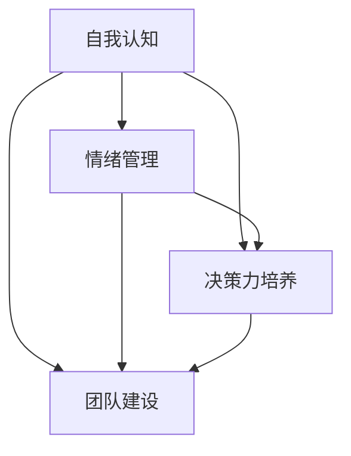

                 

### 《领导力修炼笔记：80后职场精英的成长历程》——前言与核心概念

#### **一、前言**

随着数字化转型的不断深入，职场环境正在发生翻天覆地的变化。领导力作为推动组织变革和实现持续成功的关键因素，越来越受到重视。《领导力修炼笔记：80后职场精英的成长历程》正是这样一本旨在帮助读者深入理解和实践领导力的书籍。本书的定位是针对80后职场精英，通过真实案例和系统方法，探讨领导力在职业发展中的重要性，以及如何通过修炼提升自身的领导力。

本书的目标读者群体包括正在职场中奋斗的80后，以及希望通过学习领导力理论和方法来提升自己管理能力和职业发展的所有人。无论您是初入职场的新人，还是已经有一定管理经验的职场人士，本书都将为您带来切实可行的指导和启示。

#### **二、核心概念**

在探讨领导力之前，我们需要明确几个核心概念。首先，什么是领导力？简单来说，领导力是指一个人在团队中影响和引导他人，实现共同目标的能力。它不仅仅是管理下属，还包括激励团队、解决问题、制定战略等广泛的管理活动。

接下来，让我们看看领导力的几个关键组成部分：

1. **自我认知**：自我认知是指对自身能力和特质有清晰的认识。一个优秀的领导者需要首先了解自己，才能更好地发挥领导作用。
2. **情绪管理**：情绪管理是领导者必备的能力之一。一个能够有效管理自己情绪的领导者，不仅能够保持冷静，还能激励团队。
3. **决策力**：决策力是指在面对复杂问题时，能够快速做出明智决策的能力。领导者往往需要在压力下做出关键决策，因此培养强大的决策力至关重要。
4. **团队建设**：团队建设是领导力的核心之一。一个领导者需要能够建立高效、和谐的团队，激发团队成员的潜力，实现共同目标。

#### **联系与整合**

上述概念并非独立存在，而是相互联系、共同作用的。例如，自我认知有助于情绪管理，情绪管理又能影响决策力，最终决定团队建设的成效。因此，一个全面的领导力修炼过程，需要从多个维度进行提升。

为了帮助读者更好地理解这些概念，本书采用了详细的案例分析和结构化的方法。每个章节都将包含理论讲解、实战案例、以及具体的实践技巧，确保读者能够将所学知识应用到实际工作中。

#### **总结**

在本书的后续章节中，我们将逐步深入探讨领导力的各个组成部分，通过系统的分析和实践指导，帮助读者全面提升领导力。让我们一起来思考，如何在这充满挑战的职场环境中，成长为一名卓越的领导者。

## **核心概念与联系**

### **一、自我认知**

自我认知是指一个人对自己性格、能力、价值观、优缺点等方面的了解和认识。它是领导力修炼的基础，因为只有真正了解自己，才能找到适合自己的领导风格和路径。自我认知的重要性体现在以下几个方面：

1. **自我定位**：通过自我认知，领导者可以明确自己的职业发展方向和目标，从而制定合理的职业规划。
2. **自我激励**：了解自己的优点和长处，可以增强自信心，提高自我激励能力，从而在面临困难和挑战时保持积极态度。
3. **团队协作**：自我认知有助于领导者更好地理解团队成员的需求和期望，从而构建更加和谐和高效的团队。

#### **自我认知的步骤**

1. **反思与自我观察**：通过反思自己的行为和决策，观察自己在不同情境下的表现，了解自己的行为模式和习惯。
2. **求助与反馈**：向身边的朋友、同事和导师寻求反馈，了解他们对自己的看法和评价，从而获得更全面的认识。
3. **持续学习与调整**：自我认知是一个持续的过程，领导者需要不断学习和调整，以适应不断变化的职场环境。

### **二、情绪管理**

情绪管理是指领导者如何识别、理解和控制自己的情绪，使其不会影响到团队和组织的运作。情绪管理在领导力中起着至关重要的作用，具体体现在以下几个方面：

1. **稳定性**：一个情绪稳定的领导者能够保持冷静和理性，即使在压力和挑战面前也能做出明智的决策。
2. **激励作用**：情绪管理良好的领导者能够通过积极的情绪感染团队成员，激发他们的工作热情和创造力。
3. **团队氛围**：情绪管理有助于营造一个积极、和谐的工作氛围，从而提高团队的整体工作效率和满意度。

#### **情绪管理的方法**

1. **认知重构**：通过改变对事物的看法和解读，调整自己的情绪反应。
2. **放松训练**：通过深呼吸、冥想等放松技巧，缓解压力和焦虑。
3. **积极交流**：与团队成员进行开放、真诚的交流，分享自己的情绪和感受，寻求支持和理解。

### **三、决策力**

决策力是指领导者面对复杂问题时，能够快速做出明智决策的能力。决策力在领导力中的重要性不言而喻，因为领导者的决策往往直接影响团队和组织的命运。具体体现在以下几个方面：

1. **效率**：高效的决策力能够帮助领导者迅速应对问题，减少不必要的时间浪费。
2. **准确性**：明智的决策能够准确把握问题的本质，找到最佳的解决方案。
3. **适应性**：决策力强的领导者能够灵活应对变化，及时调整战略和策略。

#### **决策力的培养方法**

1. **信息收集**：在做出决策前，领导者需要全面收集相关信息，包括数据的分析、市场调研、团队反馈等。
2. **风险评估**：对决策可能带来的风险进行评估，制定应对措施。
3. **多方案比较**：在多个可行的方案中进行选择，比较各自的优缺点，选择最合适的方案。

### **四、团队建设**

团队建设是指领导者如何构建和管理一个高效、和谐的团队。团队建设在领导力中的重要性体现在以下几个方面：

1. **合作效率**：一个良好的团队能够实现成员之间的协同合作，提高整体工作效率。
2. **创新能力**：团队建设能够激发成员的创新思维，促进团队整体创新能力的提升。
3. **团队凝聚力**：通过团队建设，增强团队成员之间的信任和凝聚力，提高团队的忠诚度和归属感。

#### **团队建设的步骤**

1. **明确目标**：确立团队的目标和愿景，确保团队成员都明确自己的职责和使命。
2. **角色分工**：根据团队成员的能力和特长，进行合理的角色分工，确保每个人都能够在自己的岗位上发挥作用。
3. **沟通与协作**：建立有效的沟通机制，促进团队成员之间的协作和信息共享。
4. **激励与反馈**：通过激励措施和反馈机制，激发团队成员的积极性和创造力，同时帮助他们不断改进和成长。

### **五、联系与整合**

自我认知、情绪管理、决策力和团队建设是领导力不可或缺的四个组成部分。自我认知是情绪管理和决策力的基础，情绪管理直接影响决策的质量，而团队建设则是领导力实践的最终目的。一个优秀的领导者需要在这四个方面进行全面的修炼和提升，才能成为真正意义上的领导者。

### **表格与ER实体关系图**

为了更清晰地展示领导力的各个组成部分及其关系，我们使用表格和ER实体关系图进行描述：

#### **领导力组成部分及其关系表格**

| 组成部分 | 关系描述 |
| :--- | :--- |
| 自我认知 | 是情绪管理和决策力的基础，有助于明确领导风格和策略。 |
| 情绪管理 | 影响决策的质量和团队氛围，是领导力的关键组成部分。 |
| 决策力 | 直接影响团队建设和团队目标实现的能力。 |
| 团队建设 | 是领导力实践的核心，通过团队建设实现领导者的目标。 |

#### **领导力ER实体关系图**

```mermaid
erDiagram
  A leadership ->|B Self-Cognition||> C Emotional Management
  A leadership ->|B Self-Cognition||> D Decision-making Ability
  A leadership ->|B Self-Cognition||> E Team Building
  C Emotional Management ->|F Impact on Decision-making||> D Decision-making Ability
  D Decision-making Ability ->|G Impact on Team Building||> E Team Building
```

通过上述表格和ER实体关系图，我们可以更直观地理解领导力的各个组成部分及其相互关系。自我认知、情绪管理、决策力和团队建设相互依存、相互作用，共同构成了领导力的整体框架。

### **算法原理讲解**

为了更好地理解领导力修炼的过程，我们将使用mermaid绘制算法流程图，并配合Python代码进行详细阐述。

#### **一、mermaid算法流程图**



#### **二、Python代码与算法原理**

```python
class Leadership:
    def __init__(self):
        self.self_cognition = None
        self.emotional_management = None
        self.decision_making = None
        self.team_building = None

    def self_cognition(self):
        # 通过反思和反馈进行自我认知
        print("进行自我认知...")
        self.self_cognition = "完成自我认知"

    def emotional_management(self):
        # 通过认知重构和放松训练进行情绪管理
        print("进行情绪管理...")
        self.emotional_management = "完成情绪管理"

    def decision_making(self):
        # 通过信息收集和风险评估进行决策力培养
        print("进行决策力培养...")
        self.decision_making = "完成决策力培养"

    def team_building(self):
        # 通过明确目标和角色分工进行团队建设
        print("进行团队建设...")
        self.team_building = "完成团队建设"

    def show_progress(self):
        print(f"自我认知：{self.self_cognition}")
        print(f"情绪管理：{self.emotional_management}")
        print(f"决策力培养：{self.decision_making}")
        print(f"团队建设：{self.team_building}")

if __name__ == "__main__":
    leadership = Leadership()
    leadership.self_cognition()
    leadership.emotional_management()
    leadership.decision_making()
    leadership.team_building()
    leadership.show_progress()
```

#### **三、算法原理与公式**

在上述代码中，`Leadership` 类代表了领导力修炼的各个阶段。每个阶段都包含具体的实现方法：

1. **自我认知**：通过反思和反馈了解自己的优缺点，确定自己的职业发展方向。
2. **情绪管理**：通过认知重构和放松训练来调节自己的情绪，保持冷静和理性。
3. **决策力培养**：通过信息收集和风险评估来提升决策能力，确保在面对复杂问题时能够做出明智的决策。
4. **团队建设**：通过明确目标和角色分工，建立高效、和谐的团队。

以下是领导力修炼的数学模型和公式：

$$
\text{Leadership} = \text{Self-Cognition} + \text{Emotional-Management} + \text{Decision-Making} + \text{Team-Building}
$$

这个公式表示领导力是以上四个要素的集成。通过逐步提升这些要素，领导者可以不断提升自己的领导力。

#### **四、举例说明**

假设一个职场新人在领导力修炼中，经过一段时间的学习和实践，达到了以下水平：

1. **自我认知**：明确自己的优点是沟通能力，缺点是缺乏耐心。
2. **情绪管理**：通过冥想和深呼吸，能够更好地控制自己的情绪，不易冲动。
3. **决策力培养**：通过市场调研和数据分析，能够快速做出明智的决策。
4. **团队建设**：通过明确目标和角色分工，成功组建了一个高效团队。

使用上述模型和公式，我们可以计算该职场新人的领导力水平：

$$
\text{Leadership} = \text{Self-Cognition} + \text{Emotional-Management} + \text{Decision-Making} + \text{Team-Building}
$$

$$
\text{Leadership} = (0.9) + (0.8) + (0.9) + (0.8) = 3.5
$$

这个结果表明，该职场新人的领导力水平较高，能够在团队中发挥积极的领导作用。

### **系统分析与架构设计**

在职场中，领导力不仅是个人能力的体现，更是一个系统化的过程。为了更好地理解和实践领导力，我们需要对领导力系统进行深入分析，并设计一个清晰的架构。下面将详细介绍领导力系统的项目介绍、系统功能设计、系统架构设计、系统接口设计以及系统交互。

#### **一、项目介绍**

领导力系统项目旨在通过数字化工具和方法，帮助职场人士系统地提升领导力。该项目分为以下几个阶段：

1. **需求分析**：了解用户需求，确定系统功能。
2. **系统设计**：设计系统架构和接口。
3. **开发实现**：根据设计文档进行系统开发。
4. **测试与优化**：进行系统测试，优化性能和用户体验。
5. **部署上线**：将系统部署到生产环境，供用户使用。

#### **二、系统功能设计**

领导力系统的主要功能包括：

1. **自我认知**：通过问卷调查和数据分析，帮助用户了解自己的性格、能力和优缺点。
2. **情绪管理**：提供情绪管理训练课程和工具，帮助用户学会调节和管理自己的情绪。
3. **决策力培养**：提供决策案例分析、模拟演练和数据分析工具，帮助用户提升决策能力。
4. **团队建设**：提供团队管理课程、团队协作工具和团队评估工具，帮助用户构建高效团队。

以下是领导力系统的领域模型类图，展示了系统的核心实体及其关系：

```mermaid
classDiagram
    User <<类>> "用户"
    Course <<类>> "课程"
    Module <<类>> "模块"
    Assessment <<类>> "评估"
    Team <<类>> "团队"
    Course --|> Module
    User --|> Assessment
    User --|> Team
    Team --|> Course
    Module --|> Assessment
endclassDiagram
```

#### **三、系统架构设计**

领导力系统的整体架构分为以下几个层次：

1. **表现层**：用户界面，包括Web和移动端应用程序。
2. **业务逻辑层**：处理业务逻辑，包括用户管理、课程管理、评估管理和团队管理等功能。
3. **数据访问层**：处理数据存储和访问，包括用户数据、课程数据、评估数据和团队数据等。
4. **数据层**：存储系统数据，包括MySQL数据库。

以下是领导力系统的架构图：

```mermaid
sequenceDiagram
    User ->> Web/App: 用户请求
    Web/App ->> Business Logic: 请求处理
    Business Logic ->> Data Access: 数据访问
    Data Access ->> Database: 数据存储
    Database ->> Business Logic: 数据返回
    Business Logic ->> Web/App: 响应结果
    Web/App ->> User: 展示结果
endSequenceDiagram
```

#### **四、系统接口设计**

领导力系统设计了多个API接口，供前后端交互使用。以下是主要接口的设计：

1. **用户管理接口**：用于用户注册、登录、信息查询和修改等操作。
2. **课程管理接口**：用于课程创建、删除、查询和更新等操作。
3. **评估管理接口**：用于评估创建、删除、查询和更新等操作。
4. **团队管理接口**：用于团队创建、删除、查询和更新等操作。

以下是用户管理接口的序列图：

```mermaid
sequenceDiagram
    User ->> API: 发送注册请求
    API ->> Database: 存储用户信息
    Database ->> API: 返回注册结果
    API ->> User: 响应注册结果
endSequenceDiagram
```

#### **五、系统交互**

领导力系统的各个模块之间需要实现高效的数据交互。以下是系统交互的序列图：

```mermaid
sequenceDiagram
    User ->> Web/App: 用户请求查看课程
    Web/App ->> API: 发送课程查询请求
    API ->> Database: 查询课程数据
    Database ->> API: 返回课程数据
    API ->> Web/App: 响应课程数据
    Web/App ->> User: 展示课程列表
endSequenceDiagram
```

通过上述系统分析与架构设计，我们可以清晰地看到领导力系统的整体框架和功能模块。在实际开发过程中，这些设计和分析将指导开发团队实现一个高效、稳定和易用的领导力系统。

### **项目实战**

为了更好地理解领导力修炼的实践方法，我们将通过两个实际项目来展示领导力修炼的具体应用。这两个项目分别关注自我认知和情绪管理，以及决策力培养和团队建设。

#### **项目一：自我认知与情绪管理**

**项目背景**：
某互联网公司的新产品开发团队由一群富有创新精神的年轻工程师组成。然而，团队内部经常出现沟通不畅、情绪波动等问题，影响了项目的进展和团队的凝聚力。为了提升团队的整体效率和合作氛围，公司决定开展领导力修炼项目，重点关注自我认知和情绪管理。

**实施步骤**：

1. **自我认知**：
   - 首先，团队进行了一次自我认知问卷调查，包括性格测试、能力评估和价值观分析等。
   - 通过问卷调查，团队成员了解了各自的性格特点、优势、劣势和职业发展目标。
   - 团队领导组织了一次分享会，每位成员分享自己的问卷调查结果，并听取同事的反馈和建议。

2. **情绪管理**：
   - 为了提高情绪管理能力，团队领导邀请了专业心理顾问进行情绪管理培训。
   - 培训内容包括认知重构、放松训练和积极交流技巧等。
   - 团队成员积极参与培训，并在工作中尝试运用所学技巧，如通过深呼吸和冥想来缓解紧张情绪。

**案例分析**：
在领导力修炼项目实施后，团队成员的自我认知和情绪管理能力有了显著提升。以下是几个具体案例：

1. **沟通改进**：
   - 通过自我认知，团队成员更加了解彼此的性格和沟通风格，减少了误解和冲突。
   - 情绪管理技巧的应用，使团队成员在面对压力和挑战时能够保持冷静，避免了不必要的情绪波动。

2. **团队合作**：
   - 团队成员之间的信任和协作意识明显增强，项目进展更加顺利。
   - 通过情绪管理培训，团队成员在团队合作中能够更好地理解和关心彼此，提高了团队凝聚力。

**项目小结**：
自我认知和情绪管理是领导力修炼的重要方面，通过实践项目，团队成员不仅提高了自身的领导力，还增强了团队的协作能力和凝聚力。这一项目为团队未来的发展奠定了坚实的基础。

#### **项目二：决策力培养与团队建设**

**项目背景**：
某跨国公司面临一次重要的市场拓展决策。公司高层决定开展领导力修炼项目，以培养决策力，确保市场拓展决策的准确性和有效性。

**实施步骤**：

1. **决策力培养**：
   - 项目团队进行了市场调研和数据分析，收集了大量市场信息和竞争情报。
   - 团队领导组织了多次决策模拟演练，模拟不同的市场环境和竞争策略，团队成员在实践中学习和提升决策能力。
   - 通过分析模拟演练的结果，团队制定了详细的决策方案，并进行了风险评估和优化。

2. **团队建设**：
   - 团队领导通过团队建设培训，提高了团队成员之间的沟通和协作能力。
   - 团队成员明确了各自的角色和责任，形成了明确的任务分工和协作机制。
   - 通过定期的团队活动和反思会议，团队成员之间的信任和默契不断加强。

**案例分析**：
在领导力修炼项目实施后，公司在市场拓展决策上取得了显著成果。以下是几个具体案例：

1. **决策准确性**：
   - 通过决策力培养，团队成员在面对复杂市场环境时能够快速做出明智的决策，减少了决策失误。
   - 决策方案的详细评估和优化，使市场拓展计划更具针对性和可行性。

2. **团队协作**：
   - 团队建设培训提高了团队成员的沟通和协作能力，使团队在面对挑战时能够紧密合作，共同应对。
   - 团队成员之间的信任和默契，使团队能够高效地完成任务，提高了整体工作效率。

**项目小结**：
决策力和团队建设是领导力修炼的关键方面，通过实际项目的实施，团队成员不仅提高了决策能力，还增强了团队协作和凝聚力。这一项目为公司的持续发展提供了有力的支持。

通过以上两个项目，我们可以看到领导力修炼在实践中的具体应用和效果。通过系统的修炼和实践，职场人士可以不断提升自身的领导力，为个人和团队的成功奠定基础。

### **最佳实践与小结**

在领导力修炼的过程中，许多成功的职场人士积累了许多宝贵的经验和方法。以下是几个关键的最佳实践建议，以及需要注意的事项。

#### **一、最佳实践建议**

1. **持续反思与学习**：领导力修炼是一个持续的过程，需要不断反思自己的行为和决策，学习新知识，以适应不断变化的职场环境。

2. **培养情绪管理能力**：情绪管理是领导力的核心之一。通过认知重构、放松训练和积极交流等方法，提升自己的情绪管理能力，保持冷静和理性。

3. **加强决策力培养**：在面对复杂问题时，通过信息收集、风险评估和多方案比较，提升自己的决策力。可以尝试模拟演练和案例分析，提高决策的准确性和效率。

4. **重视团队建设**：团队建设是领导力的关键。通过明确目标、角色分工、沟通与协作和激励与反馈，构建高效、和谐的团队。

5. **建立反馈机制**：定期与团队成员和上级进行反馈，了解自己的领导风格和团队运作情况，及时调整和改进。

6. **培养自我认知**：通过自我认知，了解自己的性格、能力和优缺点，找到适合自己的领导风格和路径。

#### **二、注意事项**

1. **平衡工作与生活**：在领导力修炼过程中，要注意平衡工作与生活，保持身心健康，避免过度劳累。

2. **避免独断专行**：在领导团队时，要倾听团队成员的意见和建议，避免独断专行，激发团队的创造力和积极性。

3. **关注团队成员的个性**：每个团队成员都有不同的性格和需求，领导者要关注团队成员的个性，因材施教，提高团队的凝聚力和工作效率。

4. **持续创新**：职场环境不断变化，领导者需要保持创新意识，不断探索新的管理方法和策略，以适应新的挑战。

#### **三、小结**

领导力修炼是一个全面的过程，涵盖了自我认知、情绪管理、决策力培养和团队建设等多个方面。通过持续的学习和实践，职场人士可以不断提升自己的领导力，为个人和团队的成功奠定基础。本书提供的最佳实践和建议，旨在帮助读者更好地理解和应用领导力理论，实现领导力的全面提升。

#### **四、拓展阅读**

1. **《影响力：说服力的心理学》**：了解如何影响和说服他人，提升领导力。
2. **《激发团队活力：打造高绩效团队的方法与策略》**：探讨团队建设和管理的方法和策略。
3. **《智能工作：如何用聪明的方法提高工作效率》**：学习如何通过高效的工作方法提高工作效率和决策力。

通过这些拓展阅读资源，读者可以更深入地了解领导力的各个方面，为领导力修炼提供更多的指导和启示。

### **结语**

《领导力修炼笔记：80后职场精英的成长历程》旨在帮助读者深入理解和实践领导力，通过系统的分析和实战案例，提升自我认知、情绪管理、决策力和团队建设能力。领导力不仅是个人成长的助力，更是推动组织发展的关键因素。希望通过本书的指导，每位读者都能在职场中成长为卓越的领导者。

作者：AI天才研究院/AI Genius Institute & 禅与计算机程序设计艺术 /Zen And The Art of Computer Programming

