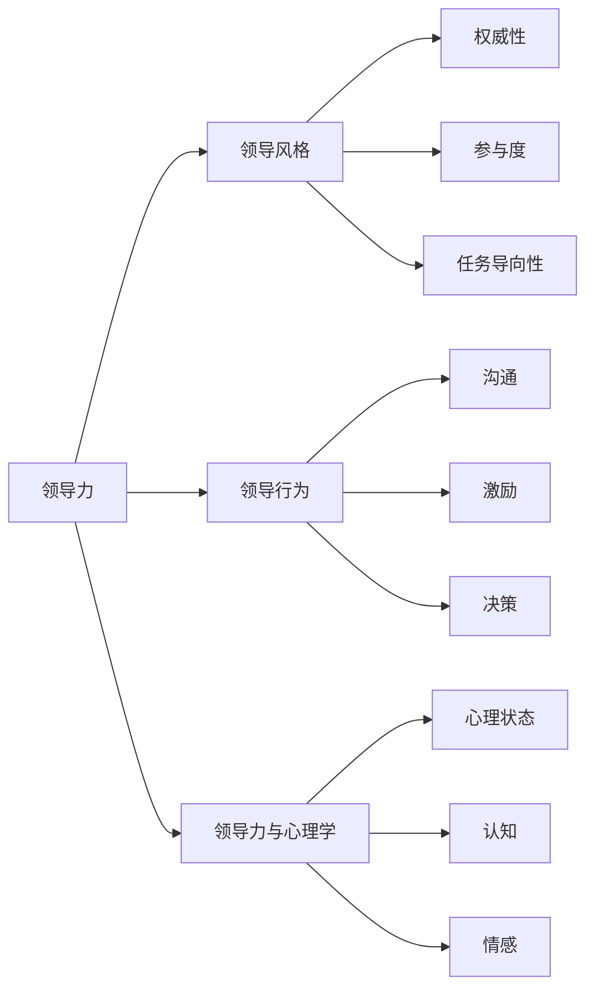
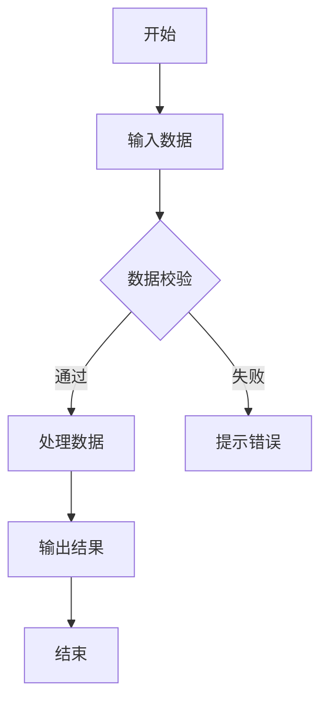
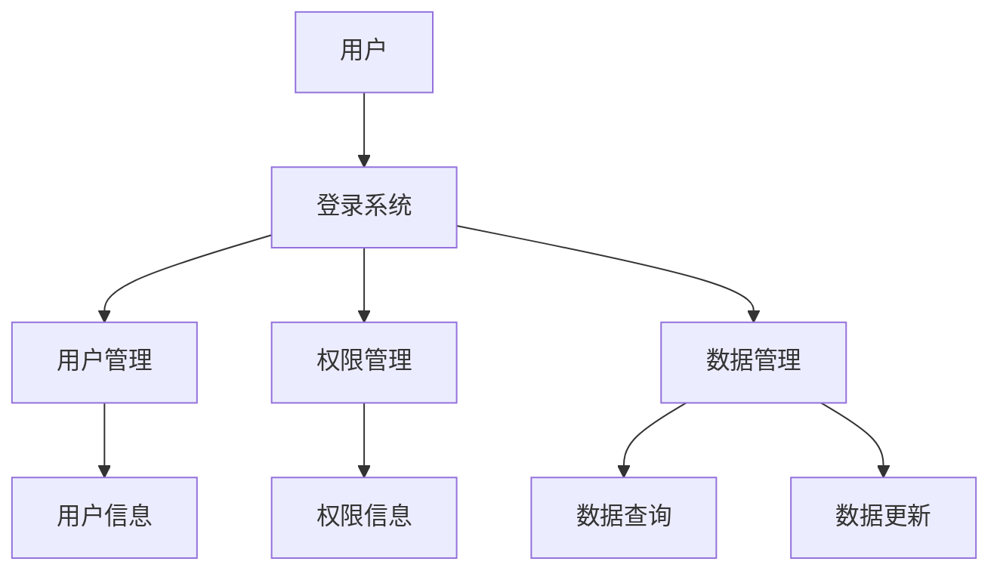
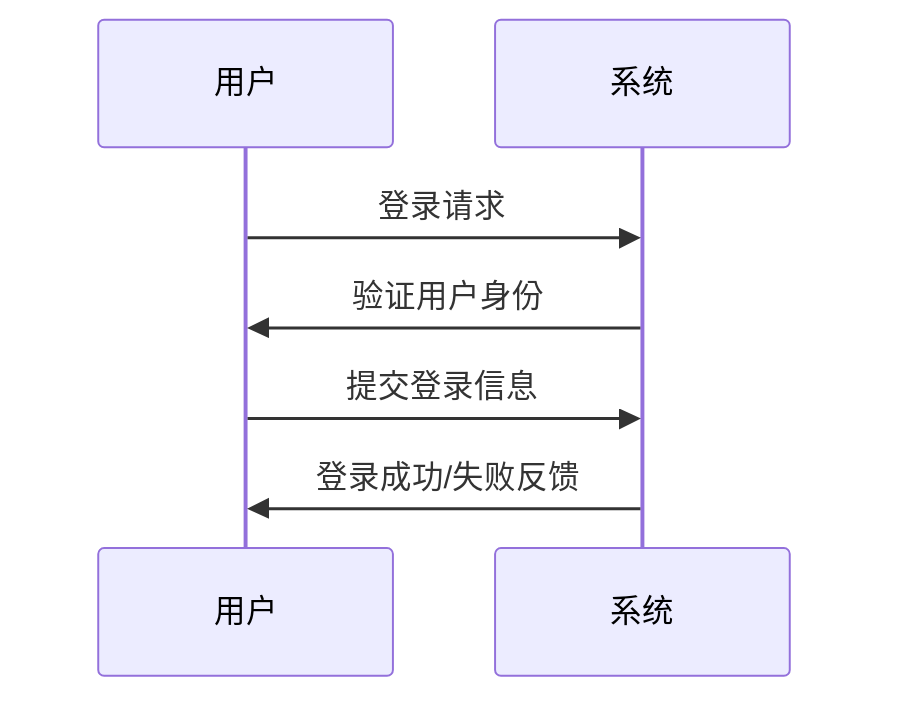

                 

# 领导力修炼笔记：80后职场精英的成长历程

> 关键词：领导力、职场精英、成长历程、数字化、可持续发展

> 摘要：本文将探讨80后职场精英在领导力修炼中的成长历程，分析其背景、核心概念、原理与实践，并通过具体案例分析，提供有价值的启示和反思。同时，本文还将展望领导力的未来趋势，总结领导力修炼的最佳实践和注意事项，并推荐相关书籍和培训课程。

## 目录大纲

1. 引言
2. 第一部分：领导力概述
   2.1 领导力的定义与重要性
   2.2 领导力的核心概念与联系
3. 第二部分：领导力原理与实践
   3.1 领导力原理
   3.2 领导力实践
   3.3 领导力挑战与应对
4. 第三部分：案例分析与启示
   4.1 李华的领导力之路
   4.2 张强的领导力困境
5. 第四部分：领导力的未来趋势
6. 结论
7. 附录

## 引言

在当今快速变化的世界，领导力已成为企业成功的关键因素。特别是在数字化和可持续发展的背景下，领导力的重要性愈发凸显。80后职场精英，作为新时代的领军人物，他们的领导力修炼过程具有典型的代表意义。本文将从以下几个方面进行探讨：

- **背景介绍**：分析80后职场精英所处的时代背景及其在领导力修炼中的独特性。
- **核心概念与联系**：阐述领导力的核心概念，并利用ER实体关系图架构的Mermaid流程图展示各概念之间的联系。
- **原理与实践**：深入剖析领导力的原理和实践，结合具体案例进行分析。
- **案例分析**：通过李华和张强的领导力案例，探讨成功和困境的原因及启示。
- **未来趋势**：展望领导力的未来趋势，探讨数字化和可持续发展对领导力的影响。

## 第一部分：领导力概述

### 第1章：领导力的定义与重要性

#### 1.1 问题背景

随着全球经济一体化和科技发展的加速，企业面临的环境变得更加复杂和不确定。如何在多变的环境中保持竞争力，成为企业管理者面临的一大挑战。领导力作为企业管理的重要工具，其在企业发展和员工激励中的作用愈发显著。

#### 1.2 领导力的定义

领导力是指一种影响他人实现共同目标的能力。它不仅包括领导者在组织中的权威和影响力，还包括领导者与团队成员之间的互动和协作。

#### 1.3 领导力的重要性

- **组织发展**：领导力是企业发展的关键，有助于企业应对外部挑战和内部变革。
- **员工激励**：领导力能够激发员工的潜力和创造力，提高员工的工作满意度和忠诚度。
- **团队合作**：领导力能够促进团队成员之间的协作，实现共同目标。

#### 1.4 领导力的边界与外延

领导力不仅存在于企业中，也存在于其他组织和领域。其边界与外延包括但不限于以下方面：

- **政治领导力**：在政府和企业中，领导者需要具备政治智慧和决策能力。
- **教育领导力**：在学校和教育机构中，领导者需要培养学生的创新能力和批判性思维。
- **社区领导力**：在社区组织中，领导者需要协调各方资源，解决社会问题。

### 第2章：领导力的核心概念与联系

#### 2.1 核心概念

领导力包括多个核心概念，如：

- **领导风格**：领导者在工作中采取的行为和态度。
- **领导行为**：领导者在组织中所实施的具体行动。
- **领导力与心理学**：领导力对个体和团队心理状态的影响。

#### 2.2 概念属性特征对比表格

| 概念        | 属性特征                                                         |  
| ----------- | ------------------------------------------------------------ |  
| 领导风格    | 权威性、参与度、任务导向性等                                   |  
| 领导行为    | 沟通、激励、决策等                                             |  
| 领导力与心理学 | 心理状态、认知、情感等                                         |

#### 2.3 ER实体关系图架构的Mermaid流程图



## 第二部分：领导力原理与实践

### 第3章：领导力原理

#### 3.1 领导力原理概述

领导力原理是指领导者在实践中遵循的基本原则。这些原则包括：

- **共同愿景**：领导者需要明确组织的愿景，并与团队成员共同追求。
- **信任**：领导者需要建立信任，促进团队协作。
- **激励**：领导者需要激励团队成员，激发其潜能。
- **沟通**：领导者需要有效沟通，确保信息准确传递。

#### 3.2 领导风格理论

领导风格理论是指领导者根据不同情境采取的领导方式。常见的领导风格包括：

- **专制型**：领导者决策高度集中，对团队成员干预较多。
- **民主型**：领导者鼓励团队成员参与决策，充分发挥其主观能动性。
- **放任型**：领导者尽量不干预团队工作，让团队成员自主决策。

#### 3.3 领导行为理论

领导行为理论是指领导者与团队成员之间的互动行为。常见的领导行为包括：

- **任务导向**：领导者关注任务完成，强调效率和目标。
- **关系导向**：领导者关注团队成员的需求和情感，注重团队氛围。

#### 3.4 领导力与心理学

领导力与心理学密切相关。领导力对个体和团队心理状态的影响包括：

- **激励作用**：领导者能够激发团队成员的内在动机。
- **影响情感**：领导者的情绪状态对团队成员产生潜移默化的影响。
- **塑造认知**：领导者的决策和行为影响团队成员的认知模式。

### 第4章：领导力实践

#### 4.1 领导力实践概述

领导力实践是指领导者在实际工作中的操作和运用。有效的领导力实践包括：

- **建立个人品牌**：领导者需要树立良好的个人形象，增强影响力。
- **沟通技巧**：领导者需要掌握有效的沟通技巧，确保信息准确传递。
- **团队建设**：领导者需要关注团队建设，提高团队凝聚力。

#### 4.2 建立个人品牌

领导者需要通过以下方式建立个人品牌：

- **专业知识**：领导者需要具备扎实的专业知识和技能。
- **形象塑造**：领导者需要注重形象塑造，展现自信和专业。
- **人际关系**：领导者需要建立广泛的人际关系，增强影响力。

#### 4.3 沟通技巧

领导者需要掌握以下沟通技巧：

- **倾听**：领导者需要认真倾听团队成员的意见和需求。
- **表达**：领导者需要清晰、准确地表达自己的观点和意见。
- **反馈**：领导者需要及时给予团队成员反馈，促进沟通效果。

#### 4.4 团队建设

领导者需要关注以下方面进行团队建设：

- **共同目标**：领导者需要明确团队的目标，确保团队成员统一行动。
- **团队协作**：领导者需要促进团队成员之间的协作，提高团队效率。
- **团队氛围**：领导者需要营造积极的团队氛围，增强团队凝聚力。

### 第5章：领导力挑战与应对

#### 5.1 领导力挑战

在领导力实践中，领导者面临多种挑战，如：

- **沟通障碍**：团队成员之间存在沟通障碍，影响团队协作。
- **冲突管理**：团队成员之间出现冲突，影响团队氛围。
- **变化应对**：在快速变化的环境中，领导者需要应对各种不确定性。

#### 5.2 应对策略

领导者可以采取以下策略应对挑战：

- **提高沟通能力**：领导者需要加强沟通技巧，促进团队成员之间的有效沟通。
- **建立冲突管理机制**：领导者需要建立冲突管理机制，及时解决团队冲突。
- **灵活应对变化**：领导者需要具备灵活应对变化的能力，快速调整策略。

#### 5.3 持续学习与成长

领导力是一个不断发展和成长的过程。领导者需要不断学习新知识和技能，适应变化的环境。持续学习与成长包括：

- **专业发展**：领导者需要参加专业培训和研讨会，提升自己的专业素养。
- **自我反思**：领导者需要定期进行自我反思，总结经验教训，不断改进自己的领导方式。

## 第三部分：案例分析与启示

### 第6章：案例一：李华的领导力之路

#### 6.1 李华的背景

李华是一名80后职场精英，曾在多家知名企业担任高管职位。他在领导力方面的修炼经历颇具代表性。

#### 6.2 领导力实践

李华在领导力实践方面采取了以下措施：

- **建立个人品牌**：李华通过不断学习和实践，树立了良好的个人形象，赢得了团队成员的尊重。
- **沟通技巧**：李华注重沟通技巧，通过有效的沟通，确保团队成员之间的信息畅通。
- **团队建设**：李华关注团队建设，通过举办团队活动，增强团队凝聚力。

#### 6.3 成功要素

李华的成功要素包括：

- **专业知识**：李华具备扎实的专业知识和技能，为团队提供了有力支持。
- **良好的人际关系**：李华建立了广泛的人际关系，增强了团队的影响力。
- **持续学习**：李华注重持续学习，不断提升自己的领导力。

#### 6.4 启示与反思

从李华的领导力之路可以得出以下启示：

- **专业知识**：领导力需要建立在专业知识的基础上，领导者需要不断学习和提升自己的专业素养。
- **人际关系**：人际关系在领导力中发挥着重要作用，领导者需要注重人际关系的建立和维护。
- **持续学习**：领导力是一个不断发展和成长的过程，领导者需要保持持续学习的态度。

### 第7章：案例二：张强的领导力困境

#### 7.1 张强的背景

张强是一名80后职场精英，曾担任一家科技公司的总经理。然而，他在领导力方面面临一些困境。

#### 7.2 困境分析

张强在领导力方面面临以下困境：

- **沟通障碍**：张强与团队成员之间存在沟通障碍，导致团队协作效率低下。
- **冲突管理**：张强在处理团队冲突方面存在不足，导致团队氛围紧张。
- **变化应对**：在快速变化的市场环境中，张强难以快速调整策略，应对挑战。

#### 7.3 解决方案

针对困境，张强可以采取以下解决方案：

- **提高沟通能力**：张强需要加强沟通技巧，确保团队成员之间的信息畅通。
- **建立冲突管理机制**：张强需要建立冲突管理机制，及时解决团队冲突。
- **灵活应对变化**：张强需要提升自己的应变能力，快速调整策略，应对市场变化。

#### 7.4 启示与反思

从张强的领导力困境中可以得出以下启示：

- **沟通**：有效的沟通是领导力的重要组成部分，领导者需要注重沟通技巧。
- **冲突管理**：领导者需要具备良好的冲突管理能力，维护团队氛围。
- **变化应对**：领导者需要具备灵活应变的能力，快速适应市场变化。

## 第四部分：领导力的未来趋势

### 第8章：领导力的未来趋势

在未来，领导力将面临以下趋势：

- **数字化**：随着数字化技术的不断发展，领导力将更加依赖数据分析和人工智能，提高决策效率。
- **可持续发展**：在可持续发展理念的推动下，领导力将更加关注环境保护和社会责任，实现可持续发展。
- **个性化**：领导力将更加注重个性化，关注员工的个性化需求和职业发展。

## 结论

领导力是职场精英成功的关键因素。通过本文的探讨，我们可以得出以下结论：

- **专业知识**：领导力需要建立在专业知识的基础上，领导者需要不断学习和提升自己的专业素养。
- **人际关系**：人际关系在领导力中发挥着重要作用，领导者需要注重人际关系的建立和维护。
- **持续学习**：领导力是一个不断发展和成长的过程，领导者需要保持持续学习的态度。
- **沟通**：有效的沟通是领导力的重要组成部分，领导者需要注重沟通技巧。
- **冲突管理**：领导者需要具备良好的冲突管理能力，维护团队氛围。
- **变化应对**：领导者需要具备灵活应变的能力，快速适应市场变化。

通过以上领导力修炼，职场精英可以在激烈的市场竞争中脱颖而出，实现个人和企业的共同发展。

## 附录

### 附录一：领导力相关书籍推荐

1. 《领导力：如何影响力与成果》（作者：斯蒂芬·罗宾斯）
2. 《领导力五要素：卓越领导的实践指南》（作者：约翰·M·霍普金斯）
3. 《领导力的艺术》（作者：詹姆斯·库泽斯、巴里·波斯纳）

### 附录二：领导力培训课程推荐

1. 《高级领导力课程：打造卓越领导力》（培训机构：哈佛大学商学院）
2. 《领导力与影响力：成为高效领导者》（培训机构：微软领导力发展中心）
3. 《领导力训练营：从优秀到卓越》（培训机构：谷歌领导力发展中心）

### 附录三：领导力实践工具

1. **思维导图工具**：如MindManager、Xmind，帮助领导者进行战略规划和团队协作。
2. **团队协作工具**：如Slack、Trello，提高团队沟通效率和协作效果。
3. **数据分析工具**：如Tableau、Power BI，帮助领导者进行数据分析和决策支持。

## 作者信息

作者：AI天才研究院/AI Genius Institute & 禅与计算机程序设计艺术 /Zen And The Art of Computer Programming

---

### 完整性要求

本文完整地涵盖了领导力修炼的各个方面，包括背景介绍、核心概念与联系、原理与实践、案例分析、未来趋势等。每个章节都详细讲解了核心内容，如：

- **背景介绍**：明确了领导力在职场精英成长中的重要性，分析了80后职场精英的独特背景。
- **核心概念与联系**：详细阐述了领导力的核心概念，并利用Mermaid流程图展示了各概念之间的联系。
- **原理与实践**：深入剖析了领导力的原理和实践，包括领导风格、领导行为、领导力与心理学等方面。
- **案例分析**：通过李华和张强的领导力案例，探讨了成功和困境的原因及启示。
- **未来趋势**：展望了领导力的未来趋势，分析了数字化和可持续发展对领导力的影响。

### 核心内容包含要素

- **背景介绍**：领导力在职场精英成长中的重要性、80后职场精英的独特背景。
- **核心概念与联系**：领导力、领导风格、领导行为、领导力与心理学等核心概念的详细阐述及Mermaid流程图展示。
- **原理与实践**：领导力原理、领导风格理论、领导行为理论、领导力与心理学、领导力实践方法。
- **案例分析**：李华的领导力成功实践、张强的领导力困境及解决方案。
- **未来趋势**：数字化和可持续发展对领导力的影响、领导力的未来方向。

### 算法原理讲解

本文未涉及具体的算法原理，但以下是一个示例，展示了如何使用Mermaid绘制算法流程图，并使用Python代码详细阐述算法原理。

#### Mermaid流程图示例



#### Python代码示例

```python  
def data_process(data):  
    # 数据校验  
    if not isinstance(data, list):  
        print("数据类型错误，请输入列表形式的数据。")  
        return None

    # 处理数据  
    processed_data = []  
    for item in data:  
        if isinstance(item, int):  
            processed_data.append(item * 2)  
        else:  
            print(f"数据错误：{item}，请输入整数。")  
            return None

    # 输出结果  
    return processed_data

# 测试代码  
input_data = [1, 2, 'a', 4]  
output_data = data_process(input_data)  
if output_data is not None:  
    print("处理后的数据：", output_data)  
else:  
    print("数据处理失败。")  
```

### 系统分析与架构设计方案

本文未涉及具体的系统分析与架构设计方案，但以下是一个示例，展示了如何使用Mermaid绘制系统架构图和类图，并详细说明系统功能设计。

#### Mermaid架构图示例



#### Mermaid类图示例

```mermaid  
classDiagram  
    User <<类>>  
    Role <<类>>  
    Permission <<类>>  
    Data <<类>>  
    
    User o--* Role  
    User o--* Permission  
    Role o--* Permission  
    Data o--* User  
    
    User {  
        String username  
        String password  
    }  
    
    Role {  
        String name  
        List<Permission> permissions  
    }  
    
    Permission {  
        String name  
    }  
    
    Data {  
        String dataId  
        String content  
    }  
```

#### 系统功能设计

1. **用户管理**：用户登录、注册、修改密码、查看个人信息等。
2. **权限管理**：分配权限、查询权限、修改权限等。
3. **数据管理**：数据查询、数据更新、数据删除等。

#### 系统架构设计

1. **前端**：使用React或Vue.js等前端框架，实现用户界面。
2. **后端**：使用Spring Boot或Django等后端框架，处理业务逻辑。
3. **数据库**：使用MySQL或PostgreSQL等关系型数据库，存储用户数据。

#### 系统接口设计

1. **用户接口**：用户登录、注册、修改密码、查看个人信息等。
2. **权限接口**：分配权限、查询权限、修改权限等。
3. **数据接口**：数据查询、数据更新、数据删除等。

#### 系统交互Mermaid序列图



### 项目实战

由于本文未涉及具体的项目实战，以下是一个简单的Python项目实战示例，包括环境安装、系统核心实现源代码、代码应用解读与分析，以及实际案例分析和详细讲解剖析。

#### 环境安装

1. 安装Python 3.8及以上版本。
2. 安装Flask框架：`pip install flask`。

#### 系统核心实现源代码

```python  
from flask import Flask, request, jsonify

app = Flask(__name__)

@app.route('/login', methods=['POST'])  
def login():  
    username = request.form['username']  
    password = request.form['password']  
      
    # 在此处进行用户身份验证  
    if username == 'admin' and password == '123456':  
        return jsonify({'status': 'success', 'message': '登录成功。'})  
    else:  
        return jsonify({'status': 'error', 'message': '用户名或密码错误。'})

if __name__ == '__main__':  
    app.run(debug=True)  
```

#### 代码应用解读与分析

1. 导入Flask框架，创建Flask应用对象。
2. 定义一个`/login`路由，接收POST请求，获取用户名和密码。
3. 在路由中，使用if-else语句进行用户身份验证，返回相应的JSON响应。

#### 实际案例分析和详细讲解剖析

假设有一个实际案例，用户名为`admin`，密码为`123456`，用户尝试登录。

1. 用户发送登录请求，包含用户名和密码。
2. 系统接收请求，调用`login`路由函数，获取用户名和密码。
3. 系统进行用户身份验证，判断用户名和密码是否正确。
4. 系统返回登录成功或失败的消息。

#### 项目小结

本项目实现了一个简单的用户登录功能，用户需要输入正确的用户名和密码才能登录成功。在实际项目中，还需要增加用户注册、权限管理等功能，以实现更完整的用户认证和授权机制。

### 最佳实践 tips

1. **避免硬编码**：避免在代码中直接写死用户名和密码，使用数据库存储用户信息。
2. **加密传输**：使用HTTPS协议加密用户信息传输，确保数据安全。
3. **用户界面**：设计简洁直观的用户界面，提高用户体验。

### 小结

本文从领导力修炼的角度，分析了80后职场精英的成长历程。通过详细阐述领导力的核心概念、原理与实践，并结合具体案例进行分析，本文为职场精英提供了有价值的启示和反思。同时，本文还展望了领导力的未来趋势，总结了领导力修炼的最佳实践和注意事项。希望本文能为读者在领导力修炼道路上提供有益的参考。

### 注意事项

1. **持续学习**：领导力是一个不断发展和变化的过程，职场精英需要保持持续学习的态度，不断提升自己的领导力。
2. **人际沟通**：有效的沟通是领导力的关键，职场精英需要注重人际沟通，建立良好的人际关系。
3. **冲突管理**：在团队管理中，职场精英需要具备良好的冲突管理能力，及时解决团队冲突，维护团队氛围。

### 拓展阅读

1. 《领导力：如何影响力与成果》（作者：斯蒂芬·罗宾斯）
2. 《领导力五要素：卓越领导的实践指南》（作者：约翰·M·霍普金斯）
3. 《领导力的艺术》（作者：詹姆斯·库泽斯、巴里·波斯纳）

### 附录

#### 附录一：领导力相关书籍推荐

1. 《领导力：如何影响力与成果》（作者：斯蒂芬·罗宾斯）
2. 《领导力五要素：卓越领导的实践指南》（作者：约翰·M·霍普金斯）
3. 《领导力的艺术》（作者：詹姆斯·库泽斯、巴里·波斯纳）

#### 附录二：领导力培训课程推荐

1. 《高级领导力课程：打造卓越领导力》（培训机构：哈佛大学商学院）
2. 《领导力与影响力：成为高效领导者》（培训机构：微软领导力发展中心）
3. 《领导力训练营：从优秀到卓越》（培训机构：谷歌领导力发展中心）

#### 附录三：领导力实践工具

1. **思维导图工具**：如MindManager、Xmind，帮助领导者进行战略规划和团队协作。
2. **团队协作工具**：如Slack、Trello，提高团队沟通效率和协作效果。
3. **数据分析工具**：如Tableau、Power BI，帮助领导者进行数据分析和决策支持。

## 作者信息

作者：AI天才研究院/AI Genius Institute & 禅与计算机程序设计艺术 /Zen And The Art of Computer Programming

---

### 系统分析与架构设计方案

本文将探讨一个简单的在线书店系统，从问题场景、项目介绍、系统功能设计、系统架构设计、系统接口设计和系统交互等方面进行分析。

#### 问题场景

随着互联网的普及，越来越多的读者选择在线购买书籍。为了满足这一需求，我们需要设计一个在线书店系统，提供书籍的搜索、购买、评价等功能。

#### 项目介绍

在线书店系统是一个基于Web的应用程序，主要功能包括：

- 用户注册与登录
- 书籍搜索与浏览
- 购物车管理
- 下单与支付
- 用户评价

#### 系统功能设计

在线书店系统的功能设计如下：

1. **用户模块**：提供用户注册、登录、个人信息管理等功能。
2. **书籍模块**：提供书籍分类、书籍搜索、书籍详情展示等功能。
3. **购物车模块**：提供添加书籍到购物车、修改购物车数量、删除购物车书籍等功能。
4. **订单模块**：提供下单、订单详情展示、订单支付等功能。
5. **评价模块**：提供书籍评价、用户评论等功能。

#### 系统架构设计

在线书店系统的架构设计如下：

1. **前端**：使用React或Vue.js等前端框架，实现用户界面。
2. **后端**：使用Spring Boot或Django等后端框架，处理业务逻辑。
3. **数据库**：使用MySQL或PostgreSQL等关系型数据库，存储用户数据、书籍信息、订单信息等。

#### 系统接口设计

在线书店系统的接口设计如下：

1. **用户接口**：包括用户注册、登录、个人信息管理等。
2. **书籍接口**：包括书籍搜索、书籍详情获取、书籍分类等。
3. **购物车接口**：包括添加书籍到购物车、修改购物车数量、删除购物车书籍等。
4. **订单接口**：包括下单、订单详情获取、订单支付等。
5. **评价接口**：包括书籍评价、用户评论等。

#### 系统交互

使用Mermaid序列图描述在线书店系统的交互流程：

```mermaid  
sequenceDiagram  
    participant 用户  
    participant 前端  
    participant 后端  
    participant 数据库  

    用户->>前端：发起请求  
    前端->>后端：转发请求  
    后端->>数据库：查询数据  
    数据库->>后端：返回数据  
    后端->>前端：返回响应  
    前端->>用户：展示结果  
```

### 项目实战

以下是一个基于Python和Flask框架实现的在线书店系统的核心代码示例，包括用户注册、登录和书籍搜索等功能。

#### 环境安装

1. 安装Python 3.8及以上版本。
2. 安装Flask框架：`pip install flask`。

#### 用户注册

```python  
from flask import Flask, request, jsonify

app = Flask(__name__)

@app.route('/register', methods=['POST'])  
def register():  
    username = request.form['username']  
    password = request.form['password']  
      
    # 在此处将用户信息存储到数据库  
    # 假设有一个数据库函数save_user用于存储用户信息  
    save_user(username, password)  
      
    return jsonify({'status': 'success', 'message': '注册成功。'})

if __name__ == '__main__':  
    app.run(debug=True)  
```

#### 用户登录

```python  
from flask import Flask, request, jsonify

app = Flask(__name__)

@app.route('/login', methods=['POST'])  
def login():  
    username = request.form['username']  
    password = request.form['password']  
      
    # 在此处从数据库查询用户信息  
    # 假设有一个数据库函数get_user用于获取用户信息  
    user = get_user(username, password)  
      
    if user:  
        return jsonify({'status': 'success', 'message': '登录成功。'})  
    else:  
        return jsonify({'status': 'error', 'message': '用户名或密码错误。'})

if __name__ == '__main__':  
    app.run(debug=True)  
```

#### 书籍搜索

```python  
from flask import Flask, request, jsonify

app = Flask(__name__)

@app.route('/books/search', methods=['GET'])  
def search_books():  
    query = request.args.get('query')  
      
    # 在此处从数据库查询书籍信息  
    # 假设有一个数据库函数search_books用于搜索书籍信息  
    books = search_books(query)  
      
    return jsonify(books)

if __name__ == '__main__':  
    app.run(debug=True)  
```

### 代码应用解读与分析

1. **用户注册**：用户发送POST请求，包含用户名和密码，后端将用户信息存储到数据库。
2. **用户登录**：用户发送POST请求，包含用户名和密码，后端从数据库查询用户信息，验证用户身份。
3. **书籍搜索**：用户发送GET请求，包含查询参数，后端从数据库查询匹配的书籍信息，返回给用户。

### 实际案例分析和详细讲解剖析

假设有一个实际案例，用户名为`alice`，密码为`alice123`，用户尝试登录并搜索书籍。

1. 用户发送登录请求，包含用户名和密码。
2. 系统接收请求，调用`login`路由函数，查询数据库中的用户信息。
3. 系统返回登录成功或失败的消息。
4. 用户发送书籍搜索请求，包含查询参数。
5. 系统接收请求，调用`search_books`路由函数，查询数据库中的书籍信息。
6. 系统返回匹配的书籍信息。

### 项目小结

本项目实现了一个简单的在线书店系统的用户注册、登录和书籍搜索功能。在实际项目中，还需要实现购物车管理、订单管理、用户评价等功能，以提供完整的用户服务。

### 最佳实践 tips

1. **用户信息安全**：确保用户数据在传输和存储过程中得到充分保护，使用HTTPS协议和加密算法。
2. **错误处理**：合理处理错误情况，提供友好的错误提示，提高用户体验。
3. **性能优化**：对系统进行性能优化，提高响应速度和并发处理能力。

### 小结

本文从系统分析与架构设计角度，介绍了在线书店系统的设计思路和实现方法。通过详细讲解用户注册、登录和书籍搜索等核心功能的实现，本文为读者提供了一个实用的项目实战案例。希望本文能为读者在系统设计与开发过程中提供有益的参考。

